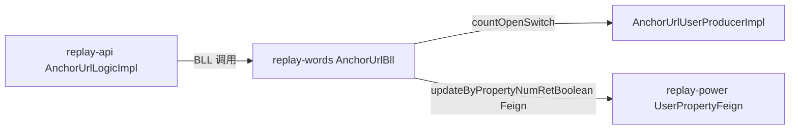

# fix-anchor-soft-delete-quota-leak

## 1. Context
- **Business goal (one sentence):** 修复主播软删（`isRemoveRecord=1` / `isRemoveRecord=2`）时未释放话术质检 / 还原度 / 互动巡检三个监控开关占用的资源位，避免配额永久泄露。
- **Scope of change:** `replay-words` 模块 `AnchorUrlBll.java` 内的两个方法：`updateUserAnchor`（软删，`isRemoveRecord=1`）、`thoroughlyDeleteAnchor`（彻底删除，`isRemoveRecord=2`）。
- **Dependencies consulted:**
  - `bug_raw.md`（本 run_dir）— RCA 完整版，调用链 file:line + 正确范例引用
  - `explore_report.md`（本 run_dir）— Spec Inference + 9 候选 AC + Hidden Scope
  - `CLAUDE.md §5`（项目特异约束：`@Transactional`、构造器注入、Feign 返 boolean 必接收）
- **Explorer hand-off:** `.claude/runs/Change__2026-06-15_17-35-02/explore_report.md`

## 2. Domain Model
Not applicable — 本次修复补齐已有的配额释放逻辑，不引入新业务术语、状态机或枚举。`isRemoveRecord=1/2` 含义不变。

## 2.5 Business Architecture
Not applicable — 变更只在 `replay-words` 模块内部补逻辑，不涉及 ≥2 jiuyu 模块间的业务规则变更；跨模块 Feign 调用（`userPropertyFeign`）已存在于同文件其他方法，本次为补用（§5.5 覆盖技术面）。

## 3. API Contract
Not applicable — `frontend-facing: false`；本次不新增也不修改任何 Controller endpoint 契约。

## 4. Data Model
Not applicable — 无 DDL；`tb_anchor_url_user` 和 `tb_user_property` 表结构不变。

## 5. Business Logic

### 5.1 Happy path — `updateUserAnchor`（`isRemoveRecord=1`）

1. 调用方（`AnchorUrlLogicImpl.updateUserAnchor`）传入 `anchorUrlUserBo`，其中 `isRemoveRecord=1`，`userId`、`tenantId`、`anchorUrlSecUid` 已填充。
2. `getUserAnchorBySecUid(secUid, userId, tenantId)` 查出当前行（含三个开关字段快照，供日志用，不再影响计数逻辑）。
3. `anchorUrlUserProducer.updateById(anchorUrlUserBo)` — 写 `isRemoveRecord=1` + `deleteDate=now()` 落库（**此步必须先于 `countOpenSwitch`**，`countOpenSwitch` 内置 `isRemoveRecord=0` 过滤，先写后查自然递减）。
4. 构建 `Map<String, String> releaseCodeMap`：
   ```
   "isScriptQualityInspection" → SCRIPT_QUALITY_NUM.code
   "isScriptFidelityMonitor"   → SCRIPT_FIDELITY_NUM.code
   "isInteractionPatrol"       → INTERACTION_PATROL_NUM.code
   ```
5. `userId` / `tenantId` **从入参 `anchorUrlUserBo` 取**（`anchorUrlUserBo.getUserId()` / `anchorUrlUserBo.getTenantId()`），**不从** `anchorUrlUserVo`（DB 查回对象）取，避免 `tenantId` 丢失。遍历 `releaseCodeMap`，对每个 `(switchField, code)` 对：
   - `Long openCount = anchorUrlUserProducer.countOpenSwitch(userId, tenantId, switchField)` — 返回当前 `isRemoveRecord=0` 且该 switch=1 的行数（已经不含刚软删的那行）。
   - `boolean ok = userPropertyFeign.updateByPropertyNumRetBoolean(userId, code, openCount)` — 覆盖语义，直接传 openCount，无需 ±1。
   - 若 `ok == false`：`log.warn(...)` + `throw new RuntimeException("资产占用量更新失败, userId=" + userId + ", code=" + code)` — 触发事务回滚。
6. 返回 `R.ok()`。

**OQ1 拍板 — 全 0 跳过 Feign vs 防御性总调：**
选择**防御性总调**（无条件遍历三个对，不做 `openCount == 0` 跳过判断）。理由：与 `addOrUpdateAnchor` Step 5 范式对齐，让计数最终一致，避免因 `isRemoveRecord=0` 之外的行仍持有该开关的边界情况产生漏更新。openCount=0 时 `updateByPropertyNumRetBoolean(userId, code, 0)` 也是合法覆盖（把已占用数置 0），语义正确。

### 5.2 Happy path — `thoroughlyDeleteAnchor`（`isRemoveRecord=2`）

1. 通过 `userFeign.getLocalUser()` 获取 `userId`、`tenantId`。
2. 查询该 `secUid` 下 `userId + tenantId` 匹配的所有行（不过滤 `isRemoveRecord`，可能存在 `isRemoveRecord=1` 已软删行再彻底删）。
3. 若列表为空 → 返回 `false`（既有逻辑，不变）。
4. `anchorUrlUserEntityList.forEach(item -> item.setIsRemoveRecord(2))` + `boolean result = anchorUrlUserService.updateBatchById(...)` — 批量写 `isRemoveRecord=2` 落库；**将返回值赋给 `boolean result` 变量，不立即 `return`**，需执行完步骤 5-6 的释放循环后再 `return result`。
5. 同 §5.1 步骤 4-5，构建 `releaseCodeMap` 并遍历，对每个 `(switchField, code)` 对执行 `countOpenSwitch(userId, tenantId, switchField)` → `updateByPropertyNumRetBoolean(userId, code, openCount)`。此时 `countOpenSwitch` 已不含刚彻底删的行（`isRemoveRecord=2` ≠ 0）。
6. 返回 `result`（步骤 4 保存的 `updateBatchById` 结果）。

**注意**：`thoroughlyDeleteAnchor` 批量入口可能影响同一 `secUid` 对应多行（同一用户下多租户账号）；`countOpenSwitch` 按 `userId + tenantId` 过滤，单次调用统计该 `userId + tenantId` 下所有 `isRemoveRecord=0` 且该开关开启的总数，与单行/多行无关，语义仍正确。

### 5.3 Branches & exceptions

| Branch | Trigger | Handling | 关联 AC |
|---|---|---|---|
| 记录不存在 (`getUserAnchorBySecUid` 返 null) | `updateUserAnchor` 路径：`secUid` 无对应行 | 跳过 `updateById` 及释放逻辑，直接返回 `R.ok()` — 维持既有逻辑 | — |
| 记录列表为空 (`thoroughlyDeleteAnchor`) | `secUid` 无对应行 | 返回 `false` — 维持既有逻辑 | — |
| `updateByPropertyNumRetBoolean` 返回 false | 任意一个 `(switchField, code)` 对 | `throw new RuntimeException(...)` → 既有 `@Transactional(rollbackFor=Exception.class)` 触发 `isRemoveRecord` 回滚 | AC-7 |
| 三开关全为 0（软删时开关已全关） | `countOpenSwitch` 分别返回全账号维度下各 switch 的非此行计数 | 防御性继续调 Feign（openCount 当前总数），不跳过；`use_quantity` 不因本次软删再递减（其他主播的占用量不受影响） | AC-6 |

### 5.4 Idempotency
- 重复软删同一主播（`isRemoveRecord=1` 调两次）：第二次 `updateById` 幂等（`isRemoveRecord` 已是 1）；`countOpenSwitch` 已不含该行（两次均过滤 `isRemoveRecord=0`），`openCount` 稳定，`updateByPropertyNumRetBoolean` 覆盖写也幂等。→ 配额不会再递减（AC-9）。

## 5.5 Technical Architecture

### 5.5.1 Module Topology



### 5.5.2 Cross-Module Communication

| Channel | From → To | Contract | Failure handling |
|---|---|---|---|
| Feign | `replay-words` → `replay-power` | `UserPropertyFeign#updateByPropertyNumRetBoolean(userId, code, openCount)` | 返回 false → 抛 `RuntimeException` → `@Transactional` 回滚 |

### 5.5.3 Async Tasks
Not applicable — 无 MQ、无 `@Scheduled` 任务引入。

### 5.5.4 Cache Strategy
Not applicable — 无 Redis 缓存触碰。

### 5.5.5 Transaction Boundary

- **`thoroughlyDeleteAnchor`**：已有 `@Transactional(rollbackFor = Exception.class)`（`AnchorUrlBll.java:1894`）；新增 Feign 调用在同一事务内，任一 false 回滚 `updateBatchById`。
- **`updateUserAnchor`**：**当前无 `@Transactional` 注解**（代码审计确认）。新增 Feign 调用后若 false 抛 `RuntimeException`，但无事务则 `updateById` 已提交，无法回滚。→ **必须为 `updateUserAnchor` 新增 `@Transactional(rollbackFor = Exception.class)`**（AC-7 回滚保证的前提）。
- 事务跨度：`updateById`（`AnchorUrlUserProducerImpl`，底层走 `anchorUrlUserService.updateById`）+ 三次 Feign 调用均在同一方法事务内。

### 5.5.6 Observability
- 现有 `log.warn("[B6 监控位占用] 更新资产失败 userId=...")` 范式（`addOrUpdateAnchor` Step 5）复用于新代码，将 tag 前缀换为 `[软删释放]` 区分来源。
- 日志关键字段：`userId`、`tenantId`、`secUid`、`code`、`openCount`。
- 无新增 metric / alert（沿用既有请求日志）。

## 6. Non-Functional Constraints (Hard Constraints)

**安全 / 权限：**
- `countOpenSwitch` 内置 `userId + tenantId` 过滤（已验证，`AnchorUrlUserProducerImpl.java:675-693`），租户隔离无需额外处理。
- `updateUserAnchor` 调用方 `AnchorUrlLogicImpl` 已从 JWT 取 `userId`，BLL 层不从请求参数接收 `userId`（符合 CLAUDE.md §2 租户隔离规则）。

**并发 / 幂等：**
- 重复软删幂等由 `countOpenSwitch` 的 `isRemoveRecord=0` 过滤保证（§5.4 Idempotency）。
- 无额外分布式锁需求（同一主播并发软删极低频，且覆盖写语义安全）。

**事务边界（关键）：**
- `updateUserAnchor` **必须加** `@Transactional(rollbackFor = Exception.class)` — 这是本次修复的额外变更点（AC-7 依赖）。
- 两个方法内均不允许 try-catch 吞异常（Feign false → RuntimeException 必须冒泡触发回滚）。

**数据完整性：**
- Feign 写方法返回 boolean 必须接收并判断，false 时抛 `RuntimeException` 触发回滚（CLAUDE.md §2 硬约束）。
- `countOpenSwitch` 统计口径：`userId + tenantId + switchField + isRemoveRecord=0`，覆盖当前用户该租户下所有绑定主播中该开关开启总数，语义正确。

**Forbidden（禁止）：**
- DO NOT 改 `AnchorUrlController.java`（endpoint 契约不变）。
- DO NOT 改 `AnchorUrlUserProducerImpl.java`（修复在 BLL 层，不下沉 Producer）。
- DO NOT 触碰 `deletBySecUid` 物理删入口（用户拍板本次不修复）。
- DO NOT 写 DDL / 表结构变更。
- DO NOT 写存量对账跑批（独立任务，用户拍板本次不做）。
- DO NOT 使用 `@Autowired` / `@Resource`（构造器注入，AnchorUrlBll 已使用构造器注入，新依赖无需添加）。
- DO NOT 使用 `@TableLogic`。

**性能：**
- 每次软删固定 3 次 Feign（N=3，常数，不随主播数线性增长），无 N+1 风险。
- `thoroughlyDeleteAnchor` 批量场景：`countOpenSwitch` 按 `userId + tenantId + switchField` 统计全量，与批次大小无关，仍 3 次 Feign。

## 7. Acceptance Criteria (Testing)

**Verification 形态：手工集成验证**（项目零 BLL 单测基建，本次不破例起新测试基建；每条 AC 给出手工验证步骤或 SQL 核查语句）。

### AC 列表（精选 7 条，覆盖 1 happy + 3 edge + 1 branch AC + 幂等 + 回滚底线）

| AC-id | Given | When | Then | 手工验证方式 |
|---|---|---|---|---|
| AC-1 | 主播 `isScriptQualityInspection=1` | `POST /anchorurl/updateUserAnchor (isRemoveRecord=1)` | `tb_user_property.use_quantity[SCRIPT_QUALITY_NUM]` 递减 1 | 软删前后各查 `tb_user_property` 对比 `use_quantity` |
| AC-4 | 三个开关均为 1 | `POST /anchorurl/updateUserAnchor (isRemoveRecord=1)` | 三个配额各释放 1（SCRIPT_QUALITY_NUM / SCRIPT_FIDELITY_NUM / INTERACTION_PATROL_NUM 同时递减） | 软删前后各查三条 `use_quantity` 对比 |
| AC-5 | 主播 `isScriptQualityInspection=1` | `POST /anchorurl/thoroughlyDeleteAnchor (secUid=...)` | `tb_user_property.use_quantity[SCRIPT_QUALITY_NUM]` 递减 1；`tb_anchor_url_user.isRemoveRecord=2` | 彻底删前后查 `tb_user_property` + `tb_anchor_url_user` |
| AC-6 | 三开关全为 0 | `POST /anchorurl/updateUserAnchor (isRemoveRecord=1)` | 软删正常完成，3 次 Feign 均被调用（`openCount=0`），`use_quantity` 不因本次软删再递减（其他主播的占用量不受影响）；无异常 | 查日志确认 3 次 Feign 调用；查日志含 `[软删释放]` 前缀；`use_quantity` 不变 |
| AC-7 | `userPropertyFeign.updateByPropertyNumRetBoolean` 被 mock 返回 false（任一次） | `POST /anchorurl/updateUserAnchor (isRemoveRecord=1)` | 接口抛出 500（RuntimeException）；`tb_anchor_url_user.isRemoveRecord` 回滚（仍为 0） | 临时 mock Feign 返回 false，查 `tb_anchor_url_user` 行 `isRemoveRecord` 仍为 0 |
| AC-8 | 用户绑定 3 个主播 A/B/C，三者都开启 `isScriptQualityInspection=1`（`tb_user_property.use_quantity[SCRIPT_QUALITY_NUM]=3`） | `updateUserAnchor(secUid=B, isRemoveRecord=1)` | `tb_user_property.use_quantity[SCRIPT_QUALITY_NUM]=2`（不是 0，不是不变）；A 和 C 的 `isScriptQualityInspection=1` 且 `isRemoveRecord=0` 不受影响 | 软删前后执行 `SELECT use_quantity FROM tb_user_property WHERE user_id=? AND ...` 对比（3→2）；额外查 `tb_anchor_url_user` 确认 A/C 的 `isRemoveRecord=0` |
| AC-9 | 主播已软删（`isRemoveRecord=1`） | 同一主播 `updateUserAnchor(isRemoveRecord=1)` 再调一次 | 第二次调用后 `use_quantity` 不再递减（幂等）；无异常 | 两次软删后查 `use_quantity` = 第一次后的值 |

### 单测要求（条件性）
如测试基建具备，Lead-Engineer 可在 `AnchorUrlBllTest.java`（如存在）补如下 Mockito 单测：

| AC-id | Method under test | Mock | Assertion |
|---|---|---|---|
| AC-7 | `AnchorUrlBll#updateUserAnchor` | `userPropertyFeign.updateByPropertyNumRetBoolean` → false | 抛 `RuntimeException`，`anchorUrlUserProducer.updateById` 已被调用（Mockito verify） |
| AC-9 | `AnchorUrlBll#updateUserAnchor` | `countOpenSwitch` → 0（第二次） | 调用成功，第二次 Feign 传 `openCount=0` 覆盖写 |

若 `AnchorUrlBllTest.java` 不存在且本批次评估不值得起新测试基建，以手工集成验证作为 QA evidence 底线。

## 做什么 / 为什么

**现状：** 主播软删（`POST /anchorurl/updateUserAnchor` 设 `isRemoveRecord=1`，或 `POST /anchorurl/thoroughlyDeleteAnchor` 设 `isRemoveRecord=2`）后，三个监控开关（话术质检 / 还原度 / 巡检）占用的 `tb_user_property.use_quantity` 不递减，用户配额永久泄露。同模式正确范例已在 `AnchorUrlBll.addOrUpdateAnchorBo`（修改主播）和 `AnchorUrlBll.updateMonitorSwitch`（开关切换）两条路径里实现，仅软删路径漏写。

**需要：** 在两个软删入口的 `producer.updateById/updateBatchById` 之后，追加三个 `(switchField, commodityTypeCode)` 对的释放循环：`countOpenSwitch(userId, tenantId, switchField)` → `userPropertyFeign.updateByPropertyNumRetBoolean(userId, code, openCount)`；任一 false 抛 `RuntimeException` 触发既有 `@Transactional` 回滚。额外：`updateUserAnchor` 当前缺 `@Transactional` 注解，需同步补上。

**范围：** 单文件 `AnchorUrlBll.java`，两个方法（`updateUserAnchor` + `thoroughlyDeleteAnchor`），预计 60-90 行净增；不动 Controller / DDL / Feign 接口定义；存量对账不做（用户拍板）；`deletBySecUid` 物理删入口不修（用户拍板）。

## 怎么做

采用**防御性总调**方式（OQ1 拍板）：软删后无条件遍历三个 `(switchField, commodityTypeCode)` 对，调 `countOpenSwitch` + `updateByPropertyNumRetBoolean`，不做"全 0 跳过"短路。理由：与 `addOrUpdateAnchor` Step 5 范式完全对齐，`openCount=0` 的覆盖写合法无副作用，且防御边界场景（同用户其他主播仍开启时避免漏更新）。

**关键发现**：`updateUserAnchor` 缺 `@Transactional(rollbackFor = Exception.class)` 注解，AC-7 回滚语义依赖此注解，需同步补上（这是非功能性必要修改，不超出 Allowed Scope，属于同方法内修改）。

**实现参照**：`addOrUpdateAnchor` Step 5（`AnchorUrlBll.java:1226-1254`）逐行复用，仅调整入参来源（从 `anchorUrlUserBo` 取 `userId / tenantId`，不传 Bo 字段）。

Machine Section:

## Allowed Scope
- `replay-words/src/main/java/com/jiuyu/replay/words/bll/AnchorUrlBll.java`

## Acceptance Criteria
- AC-1: Given 主播 `isScriptQualityInspection=1`, when `POST /anchorurl/updateUserAnchor (isRemoveRecord=1)`, then `tb_user_property.use_quantity[SCRIPT_QUALITY_NUM]` 递减 1。
- AC-4: Given 三个开关均为 1, when `POST /anchorurl/updateUserAnchor (isRemoveRecord=1)`, then 三个配额各释放 1（SCRIPT_QUALITY_NUM / SCRIPT_FIDELITY_NUM / INTERACTION_PATROL_NUM）。
- AC-5: Given 主播 `isScriptQualityInspection=1`, when `POST /anchorurl/thoroughlyDeleteAnchor`, then `tb_user_property.use_quantity[SCRIPT_QUALITY_NUM]` 递减 1 且 `isRemoveRecord=2`。
- AC-6: Given 三开关全为 0, when `POST /anchorurl/updateUserAnchor (isRemoveRecord=1)`, then 3 次 Feign 均被调用（openCount=0），no exception，use_quantity 不因本次软删再递减（其他主播的占用量不受影响）。
- AC-8: Given 用户绑定 3 个主播 A/B/C 且 `isScriptQualityInspection` 均为 1，`use_quantity[SCRIPT_QUALITY_NUM]=3`, when `updateUserAnchor(secUid=B, isRemoveRecord=1)`, then `use_quantity[SCRIPT_QUALITY_NUM]=2`（不是 0，不是不变）；A/C 的 `isRemoveRecord=0` 不受影响。
- AC-7: Given `updateByPropertyNumRetBoolean` 返回 false, when `POST /anchorurl/updateUserAnchor (isRemoveRecord=1)`, then 抛 RuntimeException，`tb_anchor_url_user.isRemoveRecord` 回滚为 0。
- AC-9: Given 主播已 `isRemoveRecord=1`, when 同一主播再次调用 `updateUserAnchor(isRemoveRecord=1)`, then `use_quantity` 不再递减（幂等）。

## Task Dependencies
- Depends on: 无

## Hard Constraints
- `updateUserAnchor` 必须新增 `@Transactional(rollbackFor = Exception.class)` — 当前缺失，AC-7 回滚依赖此注解
- 释放逻辑必须在 `producer.updateById / updateBatchById` **之后**（先写后查，让 `countOpenSwitch` 的 `isRemoveRecord=0` 过滤自然递减）
- Feign 写方法返回 boolean 必须接收；false → 抛 `RuntimeException`，不允许 try-catch 吞异常
- DO NOT 改 `AnchorUrlController.java` / `AnchorUrlUserProducerImpl.java` / DDL / `deletBySecUid`
- DI 使用构造器注入（`userPropertyFeign` 已注入，无需新增）；禁 `@Autowired`/`@Resource`/`@TableLogic`
- 防御性总调：无条件遍历三个 `(switchField, commodityTypeCode)` 对，不做 openCount=0 短路

## Plan Deviation Reflection

闭环时的实际偏差与计划相比（按发现顺序）：

### 偏差 1 — 测试基建认知错误（重大）

**计划**（openspec §7 Propose 阶段）："项目零 BLL 单测基建，本次不破例补单测，verification 形态为手工集成验证"。

**实际**（@test-engineer post-implement 发现）：`replay-words/src/test/java/com/jiuyu/replay/words/bll/` 下已有 `AnchorUrlBllTest.java`(8 ACs) + `AnchorUrlBllUpdateMonitorSwitchTest.java`(7 ACs) 两份成熟 Mockito 单测，且已 mock 本次代码用到的核心 SPI (`UserPropertyFeign.updateByPropertyNumRetBoolean` / `AnchorUrlUserProducer.countOpenSwitch`)。

**修正**：扩 focus_card Allowed Scope 加入 `AnchorUrlBllSoftDeleteTest.java`，破例补 7 个单测 mirror 现成范式（最终 Tests run: 7, Failures: 0, Errors: 0, Skipped: 0）。

**根因**：Propose 阶段 architect 未实际 grep 测试目录就援引 `feedback_testing_strategy` memory（"项目零单测基建"）做决策。memory 描述的是项目**整体**测试稀疏，但 `AnchorUrlBll` 本身已有局部覆盖，是 memory 在该 BLL 上的反例。

**经验**：未来在 §7 决议测试形态前必须 `find <module>/src/test -name "*<TargetClass>*"`，不能直接套 memory 的一刀切结论。

### 偏差 2 — Implement 一轮 lead-engineer 引入 2 个 MAJOR

**计划**（openspec §5.3 Branches）：`anchorUrlUserVo == null` 时跳过 `updateById` 及释放逻辑直接返回。

**实际**（reviewer round 2 发现）：lead-engineer 一轮把释放循环放在 `if (vo != null)` 块**外**，违反 §5.3。第二个 MAJOR 是 `thoroughlyDeleteAnchor` `updateBatchById` 返 false 时无 guard 仍执行释放循环。

**修正**：lead-engineer 二轮把释放循环移入 `if (vo != null)` 块内 + `if (!result) return false` 提前返回。reviewer round 3 复审 closed。

**经验**：契约里"跳过释放逻辑"的描述被 lead-engineer 误读为仅指"跳过 updateById"。**下次 architect 在 §5.3 表格 + §5.1/§5.2 步骤中应明确"if(vo==null)→直接 return，不执行任何后续逻辑"，去掉解释余地**。

### 偏差 3 — Allowed Scope 中途扩展

**计划**：focus_card Allowed Scope 锁定单文件 `AnchorUrlBll.java`。

**实际**：post-implement 阶段 @test-engineer 建议破例补单测，主 agent 扩 Allowed Scope 加入 `AnchorUrlBllSoftDeleteTest.java`。

**经验**：测试文件扩 scope 走主 agent reflex（无需重派 architect），但需在 focus_card.md 显式追加（已做），保证 PreToolUse hook 不阻拦 Edit。

### 副产物 — reflex fix 3 MINOR

reviewer round 3 标的 3 个 MINOR（log tag `[软删释放]` → `[彻底删释放]` typo / case#3 缺 `times(3)` 总次数断言 / case#5 缺双重 hasMessageContaining）主 agent 直接 Edit 闭环，跑 mvn test 7 PASS 验证，未再派 lead-engineer 或 reviewer。3 行级修复属 reflex correction 而非 Implement 复审范围。

### 未做事项（用户明确拍板）

- ❌ `deletBySecUid` 物理删入口修复（用户拍板不动）
- ❌ 存量数据对账跑批（用户拍板不做）
- ❌ `AnchorUrlBll` 类级 `@Resource` 字段注入重构（外科手术原则，已存量违规登记到 docs/TECH-DEBT.md 范畴）
- ❌ 类级 Javadoc 缺失（同上）
