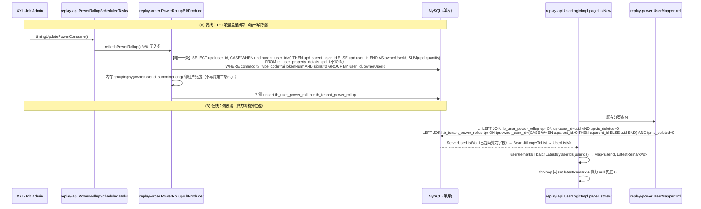
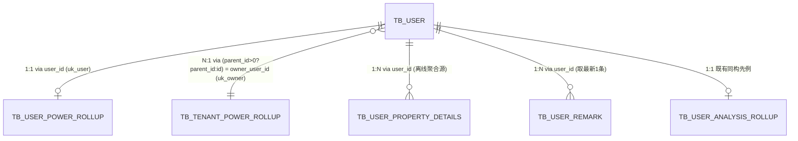
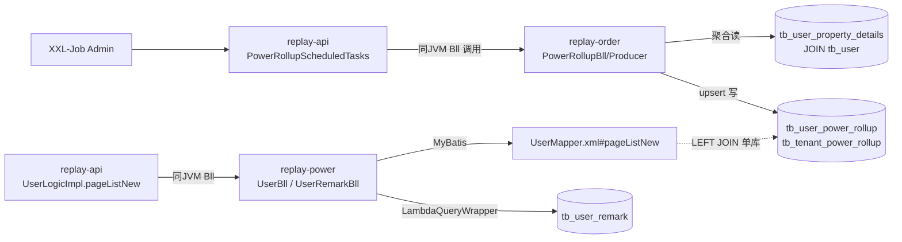

<!-- ARCHIVE AMENDMENT #2 2026-07-24（归档后按用户新增需求变更，正文未逐条改写，以本说明为准）：
     【变更】两张 rollup 表的关联键由 `owner_user_id`（主账号 user_id）**改为 `tenant_id`（tb_tenant.id）**。
     【口径】tenant_id = 主账号拥有的租户：`tb_tenant.id WHERE tb_tenant.user_id = 主账号(台账 parent_user_id 归一化)`。
             建租户时 getOne(user_id).limit1 存在即不建（TenantProducerImpl:196），故 owner↔tenant 严格 1:1、稳定不漂移。
     【与本正文差异，以下为准】：
       - DDL 两表：`owner_user_id`→`tenant_id`；`idx_owner`/`uk_owner`→`idx_tenant`/`uk_tenant`（见 sql/replay-41.sql）。
       - 增量聚合(UserPowerRollupDao.xml) 与 存量②③：新增 `JOIN tb_tenant tnt ON tnt.user_id=(parent_user_id归一化) AND tnt.is_deleted=0`，取 `tnt.id AS tenant_id`，GROUP BY tenant_id。
       - 在线读(UserMapper.xml pageListNew)：原 `tpr.owner_user_id=(CASE u.parent_id...)` 改为经 tb_tenant 中转两段 JOIN：
         `LEFT JOIN tb_tenant tnt ON tnt.user_id=(CASE u.parent_id>0 THEN u.parent_id ELSE u.id) AND tnt.is_deleted=0`
         `LEFT JOIN tb_tenant_power_rollup tpr ON tpr.tenant_id=tnt.id AND tpr.is_deleted=0`
         （经 tb_tenant 中转而非 upr.tenant_id，保证「未消费用户」也能看到其所属租户总量）。
       - Entity/VO：`ownerUserId`→`tenantId`（UserPowerRollupEntity/TenantPowerRollupEntity/PowerAggregateVo）；Producer 内存归并键改 tenant_id。
     【新引入的边界】增量聚合/存量用 INNER JOIN tb_tenant，故「消费过但主账号无租户行」的用户被排除（列表显示 0）。
       正常注册都建租户，属极少数遗留数据，为用户确认接受的取舍。上线前可用 LEFT JOIN ... WHERE tnt.id IS NULL 盘点数量。
     【前端契约无变化】tenantPowerConsume 语义仍为「用户所属租户全体累计」，字段名/类型不变（内部键换名不外泄）。
     变更已编译 + 测试通过（replay-order 22 用例 0 失败）。 -->
<!-- ARCHIVE CORRECTION 2026-07-24（Phase 6 reverse 校验后）：
     本 spec 全文原将端点写作 `POST /user/pageListNew`，漏了 UserController 的类级 @RequestMapping("replay/user")。
     真实路径为 `POST /replay/user/pageListNew`（UserController.java:41 + :432，无 server.servlet.context-path）。
     已就地更正全部 5 处；除该路径外，正文其余内容与归档时逐字一致。
     字段级契约经 reverse 校验零漂移，权威前端稿见 wiki/frontend-api/power.md。 -->
spec_mode: STANDARD
risk: HIGH
frontend-facing: true
module: power
triggers: [domain, api, data, business-arch, tech-arch, adr]

<!-- Machine Section (English) — for downstream sub-agent dispatch -->
<!-- REWRITE #2 — 本文件已按用户决策整体重写，覆盖第一次 Propose。旧版的
     「replay-generic Feign 契约 + PowerConsumeVo + UserPropertyApi + replay-api 装配算力」方案
     **已作废**，本版一律以 pageListNew SQL LEFT JOIN rollup 表为准。replay-generic 不在范围内。 -->

## Allowed Scope

**sql（DDL）**
- `sql/replay-41.sql` — 新增文件（同文件建 `tb_user_power_rollup` + `tb_tenant_power_rollup` 两张表）

**replay-order（rollup 双表 + 离线聚合刷新；本域拥有算力台账）**
- `replay-order/src/main/java/com/jiuyu/replay/order/entity/UserPowerRollupEntity.java` — 新增文件（映射 `tb_user_power_rollup`）
- `replay-order/src/main/java/com/jiuyu/replay/order/entity/TenantPowerRollupEntity.java` — 新增文件（映射 `tb_tenant_power_rollup`）
- `replay-order/src/main/java/com/jiuyu/replay/order/repository/dao/UserPowerRollupDao.java` — 新增文件（BaseMapper + 用户维度聚合方法 `aggregateUserPowerConsume()`）
- `replay-order/src/main/java/com/jiuyu/replay/order/repository/dao/TenantPowerRollupDao.java` — 新增文件（BaseMapper + 按 owner 累加更新）
- `replay-order/src/main/resources/mapper/order/UserPowerRollupDao.xml` — 新增文件（承载**唯一一条增量聚合** `<select>` + 累加 `<update>`）
- `replay-order/src/main/resources/mapper/order/TenantPowerRollupDao.xml` — 新增文件（承载累加 `<update>`；**无**第二条聚合 SQL）
- `replay-order/src/main/java/com/jiuyu/replay/order/entity/PowerRollupWatermarkEntity.java` — 新增文件（映射 `tb_power_rollup_watermark`）
- `replay-order/src/main/java/com/jiuyu/replay/order/repository/dao/PowerRollupWatermarkDao.java` — 新增文件
- `replay-order/src/main/java/com/jiuyu/replay/order/repository/service/PowerRollupWatermarkService.java` — 新增文件
- `replay-order/src/main/java/com/jiuyu/replay/order/repository/service/impl/PowerRollupWatermarkServiceImpl.java` — 新增文件
- `replay-order/src/main/java/com/jiuyu/replay/order/repository/service/UserPowerRollupService.java` — 新增文件
- `replay-order/src/main/java/com/jiuyu/replay/order/repository/service/impl/UserPowerRollupServiceImpl.java` — 新增文件
- `replay-order/src/main/java/com/jiuyu/replay/order/repository/service/TenantPowerRollupService.java` — 新增文件
- `replay-order/src/main/java/com/jiuyu/replay/order/repository/service/impl/TenantPowerRollupServiceImpl.java` — 新增文件
- `replay-order/src/main/java/com/jiuyu/replay/order/vo/PowerAggregateVo.java` — 新增文件（增量聚合行载体 `{userId, ownerUserId, powerConsume(净增量)}`）
- `replay-order/src/main/java/com/jiuyu/replay/order/producer/PowerRollupProducer.java` — 新增文件
- `replay-order/src/main/java/com/jiuyu/replay/order/producer/impl/PowerRollupProducerImpl.java` — 新增文件（读水位线 + 单条增量聚合 SQL + 内存归并租户 + 双表累加 + 同事务推进水位线）
- `replay-order/src/main/java/com/jiuyu/replay/order/bll/PowerRollupBll.java` — 新增文件（对外唯一入口 `refreshPowerRollup()`，无入参）

**replay-power（pageListNew SQL 带出算力 + UserListVo 三字段 + latestRemark 批量最新）**
- `replay-power/src/main/resources/mapper/UserMapper.xml` — 改既有 `<select id="pageListNew">`（L5-）：新增 2 个 `LEFT JOIN` + 2 个 SELECT 列
- `replay-power/src/main/java/com/jiuyu/replay/power/vo/ServerUserListVo.java` — 新增字段 `userPowerConsume`(Long) / `tenantPowerConsume`(Long)（pageListNew 的 `resultType`，必须加，否则 SQL 列无处落）
- `replay-power/src/main/java/com/jiuyu/replay/power/vo/UserListVo.java` — 新增字段 `userPowerConsume`(Long) / `tenantPowerConsume`(Long) / `latestRemark`(LatestRemarkVo)
- `replay-power/src/main/java/com/jiuyu/replay/power/vo/LatestRemarkVo.java` — 新增文件 `{remark, remarkTime, createName}`
- `replay-power/src/main/java/com/jiuyu/replay/power/bll/UserRemarkBll.java` — 新增方法 `batchLatestByUserIds(Collection<Long> userIds)`
- `replay-power/src/main/java/com/jiuyu/replay/power/producer/UserRemarkProducer.java` — 新增方法
- `replay-power/src/main/java/com/jiuyu/replay/power/producer/impl/UserRemarkProducerImpl.java` — 新增方法实现（批量 IN + Java 去重取首条 + `create_id → nickName` 批量解析）

**replay-api（XXL-Job 任务壳 + pageListNew 仅装配 latestRemark）**
- `replay-api/src/main/java/com/jiuyu/replay/api/task/PowerRollupScheduledTasks.java` — 新增文件（`@XxlJob("timingUpdatePowerConsume")`，仅调 `PowerRollupBll#refreshPowerRollup()`）
- `replay-api/src/main/java/com/jiuyu/replay/api/logic/power/impl/UserLogicImpl.java` — 改既有 `pageListNew`：for-loop 前批量取 `Map<Long, LatestRemarkVo>`，loop 内 set `latestRemark` + 算力两字段 `defaultIfNull(..., 0L)` 兜底

**明确不在范围内（禁止修改）**
- `replay-generic/**`（不加 Feign 方法、不加 `PowerConsumeVo`）
- `replay-order/.../api/UserPropertyApi.java`、`replay-generic/.../feign/order/UserPropertyFeign.java`
- `replay-order/.../repository/dao/UserPropertyDetailsDao.java` 及 `replay-video/src/main/resources/mapper/UserPropertyDetailsDao.xml`
- `UserController#pageListNew` 签名、`UserListBo`、排序白名单

## Acceptance Criteria

- AC-1: Given 运营账号调用 `POST /replay/user/pageListNew` 返回 N 行，when 查询与装配完成，then 每行 `UserListVo` 含 `userPowerConsume`（该用户在 `tb_user_power_rollup.user_power_consume`，其值 = `tb_user_property_details` 中 `commodity_type_code='aiTokenNum'` 的**净额** `SUM(CASE WHEN signs=0 THEN quantity ELSE -quantity END)`，Long，token 数；`signs=1` 为执行失败回退，须冲减）、`tenantPowerConsume`（该行用户的主账号 `parent_id>0?parent_id:id` 对应 `tb_tenant_power_rollup.tenant_power_consume`，Long）、`latestRemark`（`tb_user_remark` 中该 userId 按 `create_date DESC, id DESC` 的第一条，映射为 `{remark, remarkTime=create_date, createName=create_id→nickName}`），三字段取值与 DB 一致。
- AC-2: Given 单页 N 行(10~50)，when 装配三字段，then **算力两字段零额外 DB 往返**（随 pageListNew 主查询的两个 `LEFT JOIN` 一次带出，不产生任何新增查询）；`latestRemark` 为 1 次批量 `IN` 读 `tb_user_remark` + 1 次批量 `listByIds(createIds)` 解析跟进人姓名；**禁止**在 for-loop 内逐用户查询（N+1 红线）。
- AC-3: Given 用户从无算力流水（rollup 表无该 user_id / 该 tenant_id 行，`LEFT JOIN` 未命中取 null）或从无任何跟进记录，when 查询，then `userPowerConsume` / `tenantPowerConsume` 兜底为 `0L`，`latestRemark` 为 `null`，不抛异常。
- AC-4: Given 子账号(userType=2, parentId>0)，when 取算力，then `userPowerConsume` = 子账号**自身** `user_id` 的台账聚合值（台账 `user_id` 记录实际消费者，见 `UserPropertyImpl:284`，故子账号有独立值、不并入父账号）；`tenantPowerConsume` = 其主账号(`parent_id`)对应的租户汇总值（含该主账号及其全部子账号）；主账号自身行的 `tenantPowerConsume` 亦取自身为 owner 的汇总；口径确定、结果不报错。
- AC-5: Given XXL-Job `timingUpdatePowerConsume` 触发，when 执行，then 读 `tb_power_rollup_watermark.last_detail_id` 后只跑**一条增量**聚合 SQL（`WHERE commodity_type_code='aiTokenNum' AND id > lastDetailId`，走 PK 范围扫；禁止全表扫、禁止对明细表跑第二条 GROUP BY），租户维度由其结果内存归并；两表按唯一键**累加** `+= delta`（不存在则 `save` + `SnowflakeManager.nextValue()` + 初值=delta + `create_date`）；**累加与水位线推进在同一事务内提交**。连续执行两次：第二次因 `id > 新水位线` 无新增行而不产生任何写入（**恰好一次**，值不翻倍）；事务失败时水位线不推进，重跑同一区间结果仍正确。
- AC-6: Given `UserListVo` 被 `pageList` / `selectClientList` / `selectByuseId` / `subAccountList` / `seletUidAnchorUrlWhite` / `listByIds` / `OrderScheduledTasks` 等复用（见 explore_report `## Hidden Scope`），when 只有 `pageListNew` 的 SQL 含新 `LEFT JOIN`、只有 `pageListNew` 装配 `latestRemark`，then 其它端点返回的 `UserListVo` 三新字段为 `null`（additive JSON，不破坏既有反序列化/前端），且这些端点行为不变。

## Task Dependencies

- T1 `sql/replay-41.sql` 建**三张表**（`tb_user_power_rollup` / `tb_tenant_power_rollup` / `tb_power_rollup_watermark`）+ 文件尾部附**存量初始化 SQL**（人工执行，§4.5-A-0）— Status: PENDING（无前置，先行）
- T2 replay-order rollup 表栈（UserPowerRollup / TenantPowerRollup / PowerRollupWatermark 各 Entity / Dao / Service(Impl) + 2 个 mapper XML + `PowerAggregateVo{userId, ownerUserId, powerConsume}`）— Depends on: T1 — Status: PENDING
- T3 replay-order `PowerRollupProducer(Impl)` + `PowerRollupBll`（读水位线 → **唯一一条增量聚合 SQL**(`id > 水位线`，净额 `CASE WHEN signs=0 THEN quantity ELSE -quantity END`，不 JOIN) → 内存归并租户 → 双表 `+= delta` 累加 → **同事务推进水位线**）— Depends on: T2 — Status: PENDING
- T4 replay-api `PowerRollupScheduledTasks`（`@XxlJob`）— Depends on: T3 — Status: PENDING
- T5 replay-power `UserMapper.xml` 加双 LEFT JOIN + `ServerUserListVo` / `UserListVo` 加字段 + `LatestRemarkVo` — Depends on: T1（表须先存在，否则 SQL 报错）— Status: PENDING
- T6 replay-power `UserRemarkBll/Producer(Impl)#batchLatestByUserIds` — Status: PENDING（可与 T2~T5 并行）
- T7 replay-api `UserLogicImpl#pageListNew` 装配 latestRemark + 算力兜底 — Depends on: T5, T6 — Status: PENDING

## Hard Constraints

**jiuyu 工程不变量（实现不得越线）**
- 新建类一律**构造器注入**，禁止在新类上使用 `@Autowired` / `@Resource`（既有类 `UserLogicImpl` / `UserRemarkProducerImpl` 已是 `@Resource` 字段注入，新增字段**局部一致**沿用其风格，不重构）。
- Controller / Bll 返回值统一 `R<T>`；分页统一 `PageUtils<T>`。
- 新增 ID 一律 `SnowflakeManager.nextValue()`，Entity 用 `@TableId(type = IdType.INPUT)`。
- 软删除手动置 `isDeleted = 1`，**禁止** `@TableLogic`，禁止物理删除。
- 时间戳手动 `LocalDateTime.now()`（既有实体多用 `java.util.Date`，与被改文件保持一致）设置 `create_date` / `update_date`；rollup upsert 的 save / update 两个分支都必须设。
- 写方法必须标 `@Transactional(rollbackFor = Exception.class)`（rollup 双表批量 upsert）。
- MyBatis-Plus 查询统一 `LambdaQueryWrapper`；XML SQL 占位统一 `#{}`，**禁止** `${}`。
- `IN` 列表元素 > 500 必须用 `com.google.common.collect.Lists.partition` 分批（`batchLatestByUserIds`、`listByIds(createIds)`、rollup upsert 批次）。
- 列表查询带 `tenant_id` + `is_deleted` 过滤（例外见下）。
- 代码标识符全英文，中文仅出现在注释 / DDL COMMENT。
- 新建表必须含 `tenant_id` / `is_deleted` / `create_date` / `update_date`（`tb_tenant_power_rollup` 的 `tenant_id` 即其业务主键，满足该约束）。

**显式声明的例外（经核实的物理事实，实现不得据此报错或臆造过滤条件）**
- **E-1**：`tb_user_property_details`（实体 `UserPropertyDetailsEntity`）物理**无** `tenant_id`、**无** `is_deleted` 列，但**有** `parent_user_id`（租户主账号 user_id，消费当刻写入）。聚合 SQL 只按 `commodity_type_code` + `signs` 过滤，租户归属直接取 `CASE WHEN parent_user_id > 0 THEN parent_user_id ELSE user_id END`，**无需 JOIN `tb_user`**（台账自给自足）。
- **E-2**：`tb_user_remark`（实体 `UserRemarkEntity extends BaseEntity`，仅 `createId/updateId`）物理**无** `tenant_id` 列，既有 `UserRemarkProducerImpl#queryPage` 也只按 `user_id` 过滤。`batchLatestByUserIds` 只带 `user_id IN (...) AND is_deleted = 0`。**注意**：此处并非"由 userIds 传递性保证租户隔离"——见 E-3，本列表本就无租户隔离；该查询的边界等同于列表本身的可见范围，不额外收紧也不额外放宽。
- **E-3**：既有 `pageListNew` 是**平台级管理后台全量列表，SQL 本身不含 `tenant_id` 过滤**（`UserMapper.xml` WHERE 仅 `u.is_deleted=0 AND u.user_type in (0,2)`），即该接口**本就没有租户隔离**。本 change **不改变**该现状，也**不得**据"租户隔离"红线在本路径臆造 `tenant_id` 过滤条件。
- **E-6**：**消耗 = 净额，不是毛扣减**。`aiTokenNum` 的 `signs=1` 行是**执行失败回退**（充值不落这张表，`aiTokenNum` 不会被充值 —— 用户确认）。`quantity` 存**绝对值**（`UserPropertyImpl:301,308`）。故必须 `SUM(CASE WHEN signs=0 THEN quantity ELSE -quantity END)`，**禁止**只累加 `signs=0`（会把已退回的失败消耗算进去，虚高）。过滤条件**只有** `commodity_type_code='aiTokenNum'`（+ 增量的 `id >` 条件），**不得**再加 `signs` 过滤。
- **E-7**：**增量累加，非全量覆盖**。定时任务以 `tb_power_rollup_watermark.last_detail_id` 为水位线走明细表 PK 范围扫，只处理新增段并 `+= delta`。**累加与水位线推进必须在同一事务**（唯一的恰好一次保障）；XXL-Job 必须配单机串行/丢弃后续调度（并发会重复累加）。存量由人工 SQL 一次性灌入并把水位线初始化为同一个 `MAX(id)`。
- **E-5**：**租户口径 = 消耗发生时租户**。租户标识取台账 `parent_user_id`（写台账当刻由 `UserPropertyImpl:286` 落库）归一化后的主账号 id，**不使用** `tb_user.active_tenant_id`——后者是"当前激活租户"且可变（`UserProducerImpl#updateActiveTenantId` 被子账号登录随父租户 `UserBll:195`、注册建租户 `:496`、加子账号绑定 `UserLogicImpl:1442`、解绑 `TenantBll:118`、通用改租户 `UserBll:1252` 等多处调用），用它会把用户全部历史消耗漂移到新租户。
- **E-4**：`UserPropertyDetailsDao` 的 XML 实际位于 `replay-video/src/main/resources/mapper/UserPropertyDetailsDao.xml`（跨模块 namespace）。为避免同 namespace 双 XML 的 MyBatis 加载风险，本 change 的两条聚合 `<select>` 放入**新建**的 `UserPowerRollupDao.xml` / `TenantPowerRollupDao.xml`，**不触碰** `UserPropertyDetailsDao` 及其 XML。

**跨模块调用约定（本 change 的特化）**
- 在线读算力**不走任何 Java 跨模块调用**：由 `pageListNew` SQL 直接 `LEFT JOIN` rollup 两表取数（全系统单 MySQL 库；该 SQL 已跨模块 JOIN `tb_user_analysis_rollup`(words) / `tb_order`(order) / `tb_sales`(agent)，本 change 完全比照既有惯例）。见 ADR-2。
- 离线刷新：`PowerRollupScheduledTasks`(replay-api) → `PowerRollupBll#refreshPowerRollup()`(replay-order) 同 JVM 直调，**无入参映射**（不再从 replay-api 拉全量用户传入）。
- `latestRemark`：`UserLogicImpl` → `UserRemarkBll`（replay-power，同 JVM，沿既有直连先例）。

**禁止（DO NOT）**
- DO NOT 修改 `replay-generic`（本轮无跨模块 Feign 契约变更）。
- DO NOT 复用 `tb_user_property_type.total_use_quantity`（死列，全库从不写入，落表恒 0）。
- DO NOT 复用 `use_quantity`（`aiTokenNum` 月底重置，语义=当期已用，非终身累计）。
- DO NOT 复用 `UserPropertyDetailsDao#sumTotalTokensByTenant`（`since` 参数失效 bug）。
- DO NOT 在线实时聚合 `tb_user_property_details`（只读 rollup 表）。
- DO NOT 在 `pageListNew` for-loop 内逐用户查询。
- DO NOT 改动 `pageListNew` 的请求签名 / `UserListBo` / 排序白名单（三新字段不参与排序）。
- DO NOT 用 `${}` 拼 SQL。

---
---

# Human / Design Section

## 1. Context

- **Business goal (one sentence):** 给管理后台用户列表 `POST /replay/user/pageListNew` 每行新增三个只读辅助字段（用户累计算力消耗、租户累计算力消耗、最新跟进记录），供前端 hover 展示。
- **Risk:** **HIGH（elective）** —— 客观触发档位在方案简化后已降为 MEDIUM（不再改 `replay-generic`、无新增跨模块 Feign 契约、模块数 3+sql），但**用户主动选择按 HIGH 档执行**，故 §2.5 / §5.5 / §9 按 HIGH 强制口径完整填写。
- **Scope of change:** 3 模块 + sql。`replay-order`（新建 rollup 双表 + 离线聚合刷新）、`replay-power`（pageListNew SQL 加双 LEFT JOIN + `ServerUserListVo`/`UserListVo` 加字段 + `UserRemark` 批量最新）、`replay-api`（XXL-Job 任务壳 + pageListNew 装配 latestRemark）、`sql/replay-41.sql`。关键类：`UserPowerRollupEntity`、`TenantPowerRollupEntity`、`PowerRollupBll#refreshPowerRollup`、`UserMapper.xml#pageListNew`、`ServerUserListVo`、`UserListVo`、`LatestRemarkVo`、`UserRemarkBll#batchLatestByUserIds`、`PowerRollupScheduledTasks`、`UserLogicImpl#pageListNew`。
- **Dependencies consulted:** `depends_on: [../wiki/domain/power_domain.md, ../wiki/domain/crm_domain.md, ../wiki/preferences/index.md]`（均已在 explore_report `## Wiki Sources Consulted` 提取，本阶段不复读）。
- **Explorer hand-off:** `<run_dir>/explore_report.md`，权威输入为其最后一节 `## Explorer Reconciliation`（adversarial-A 判 FAIL 后 + 用户 4 个 Open Question 决策的校正结果）。其中「`total_use_quantity` 是死列」的证伪结论仍然有效并被本 spec 采纳；`## Explorer Reconciliation` 中"走 Feign（方案B）"的部分已被用户后续决策取代（见 ADR-2）。
- **本次为第二次 Propose（重写）：** 第一版 openspec 的 Feign / `PowerConsumeVo` / `UserPropertyApi` / replay-api 侧装配算力方案整体作废。作废依据：全系统单个 MySQL 库（单数据源），且 `pageListNew` SQL **本就跨模块 JOIN** `tb_user_analysis_rollup`(words 域)、`tb_order`(order 域)、`tb_sales` / `tb_invite_url_code` / `tb_agent_promotion`(agent 域) —— 跨模块 SQL JOIN 是本项目既有惯例，"anti-JOIN" 前提在此上下文不成立。

## 2. Domain Model

- **New/updated terms:**
  - `userPowerConsume`（用户累计算力消耗）= 该用户在明细表 `tb_user_property_details` 中 `commodity_type_code='aiTokenNum'` 的**净额** `SUM(CASE WHEN signs=0 THEN quantity ELSE -quantity END)`（`signs=1` 为执行失败回退，须冲减），终身累计，单位 = token 数。
  - `tenantPowerConsume`（租户累计算力消耗）= 该用户所属租户下**全部用户**算力消耗之和，单位 = token 数。租户标识 = **主账号 user_id**（`owner_user_id`），取自台账 `parent_user_id` 归一化（为 0 时即自身），是"消耗发生时"的租户归属。
  - `latestRemark`（最新跟进）= 该用户 `tb_user_remark` 中 `create_date` 最新一条的 `{remark(内容), remarkTime(记录时间), createName(跟进人)}`。
  - `power rollup`（算力离线汇总）= 由 XXL-Job 全量刷新的两张预聚合表 `tb_user_power_rollup` / `tb_tenant_power_rollup`；在线列表只对它们做 SQL `LEFT JOIN`。
- **State machines:** None — 纯只读聚合 + 展示，无状态迁移。
- **Enum updates:** 无新增枚举。复用既有 `tb_user_property_details.signs`（0=减/扣费，1=加/充值），本需求只取 `signs=0`；复用既有 `commodity_type_code='aiTokenNum'`（AI 算力资产 key，常量见 `AI_TOKEN_KEY`）。

## 2.5 Business Architecture

### 2.5.1 Business Flow



### 2.5.2 Business Boundary

- **In scope（本 change 各模块所有权）：**
  - `replay-order`：拥有算力台账 `tb_user_property_details` 域、新建 rollup 双表、两条聚合 SQL、双表 upsert 刷新逻辑。
  - `replay-power`：拥有 `pageListNew` 的 SQL（`UserMapper.xml`）、展示 VO（`ServerUserListVo` / `UserListVo` / `LatestRemarkVo`）、`tb_user_remark` 跟进域及其批量最新读。
  - `replay-api`：拥有列表编排（`pageListNew` 装配 latestRemark）与 XXL-Job 任务壳。
- **Out of scope（其它模块所有 / 本轮不动）：** `replay-generic`（无 Feign 契约变更）；`replay-video` 下的 `UserPropertyDetailsDao.xml`；智能体三字段（是否使用智能体 / session 数 / 对话次数 —— 外部接口，另轮）；`sumTotalTokensByTenant`（有 since bug，不复用）；`tb_user` 结构（只读 `active_tenant_id`）。
- **Boundary contract：** 本 change 的**跨模块通道只有一个——共享的单个 MySQL 库上的 SQL JOIN**（`replay-power` 的 pageListNew SQL 读 `replay-order` 拥有的 rollup 两表），与该 SQL 已有的 `tb_user_analysis_rollup` / `tb_order` / `tb_sales` 跨域 JOIN 完全同构。Java 层无新增跨模块耦合：`replay-api → replay-order` 仅任务壳一次同 JVM 调用；`replay-api → replay-power` 仅 `UserRemarkBll` 同 JVM 调用（既有先例）。

### 2.5.3 Upstream / Downstream

| Direction | System / Module | Touchpoint | What flows |
|---|---|---|---|
| Upstream | XXL-Job Admin | `@XxlJob("timingUpdatePowerConsume")` | cron 触发信号（T+1 凌晨） |
| Downstream | replay-order `PowerRollupBll` | 同 JVM 调用（任务壳内，无入参） | 刷新指令 |
| Downstream | MySQL `tb_user_property_details` + `tb_user` | 两条聚合 SQL（离线） | user/tenant 维度累计消耗 |
| Downstream | MySQL `tb_user_power_rollup` / `tb_tenant_power_rollup` | 离线写 upsert；在线由 pageListNew SQL `LEFT JOIN` 读 | 预聚合算力值 |
| Downstream | replay-power `UserRemarkBll` | 同 JVM 调用（列表装配） | `Map<userId, LatestRemarkVo>` |

### 2.5.4 Business Rules (invariants this change preserves or adds)

- **Rule 1（口径）**：算力累计口径 = `tb_user_property_details` 台账 `signs=0` 流水（业务扣费额度，终身累计）。**不用** `total_use_quantity`（死列，恒 0），**不用** `use_quantity`（月底重置的当期已用）。
- **Rule 2（租户归属）**：租户口径按台账 `parent_user_id` 归一化出的**主账号 id（`owner_user_id`）**归并，即"消耗发生时"的租户，**不用**可变的 `tb_user.active_tenant_id`；该值为**每租户一个**，只落在 `tb_tenant_power_rollup` 一行，**不冗余**到用户行。
- **Rule 3（子账号）**：`userPowerConsume` 严格按用户自身 `user_id` 聚合，不并入父账号；子账号的 `tenantPowerConsume` 与其父账号同租户时自然相同。
- **Rule 4（污染面）**：三字段只在 `pageListNew` 这一条 SQL / 一条装配路径产生值；其它复用 `UserListVo` 的端点因 SQL 不含新 JOIN、装配不含 latestRemark，字段自然为 `null`。
- **Rule 5（性能红线）**：在线列表**绝不**实时扫台账，只读预聚合 rollup 表；且算力读必须随主查询一次带出，不得引入任何额外往返。

## 3. API Contract (Handoff)

- **Endpoint:** `POST /replay/user/pageListNew`（既有端点，`replay-api/.../controller/power/UserController.java:432`）。**不改签名、不改入参、不改排序白名单**，仅响应体 `data.list[*]` 每行新增三个只读字段。
- **Header/Auth:** 沿用既有（token + 登录上下文），本 change 不变。`@NoRepeatSubmit` 不涉及（纯读）。
- **Request:** 不变 —— 不新增、不修改任何请求字段（`UserListBo` 不动）。

  | Field | Type | Required | Validation | Meaning |
  |---|---|---|---|---|
  | （无变更） | — | — | — | 沿用既有 `UserListBo` 全部字段 |

- **Response（新增字段，additive）：**
  - Success schema（仅列新增部分，其余字段一律不变）：
    ```json
    {
      "code": 0,
      "msg": "OK",
      "data": {
        "list": [
          {
            "id": "<Long, 既有>",
            "userPowerConsume": "1234567",
            "tenantPowerConsume": "98765432",
            "latestRemark": {
              "remark": "客户已确认续费意向",
              "remarkTime": "2026-07-20 15:04:05",
              "createName": "张三"
            }
          }
        ],
        "totalCount": 100,
        "pageSize": 10,
        "currPage": 1
      }
    }
    ```
  - 无算力流水 / 无跟进时：
    ```json
    { "userPowerConsume": "0", "tenantPowerConsume": "0", "latestRemark": null }
    ```
  - 字段表（新增部分）：

    | Field | Type | Nullable | Validation | Meaning |
    |---|---|---|---|---|
  > ⚠️ **负值可能**：净额口径下，若某水位线区间内的失败回退量大于扣减量（跨区间常见：扣减落在上一区间、回退落在本区间），该轮 delta 为负。**累计总值仍正确**（正负相抵）；累计成负数只可能是数据异常（回退多于扣减）。经用户决策**不做钳制、原样返回**，负值作为异常信号暴露给前端与运营。

  > ⚠️ **序列化注意**：项目全局对 `Long` 注册了 `ToStringSerializer`（`replay-api/.../config/JacksonSerializerConfig.java:30-31`，防前端精度丢失），故下表中 Long 类型字段在 JSON 中**实际为字符串**（如 `"1234567"`、兜底 `"0"`），前端参与运算前需转换。

    | userPowerConsume | Long | 否（空取 `0`） | 可为负(异常) | 该用户 `aiTokenNum` 终身累计消耗（原始 token 数，展示换算由前端做） |
    | tenantPowerConsume | Long | 否（空取 `0`） | 可为负(异常) | 该用户所属租户（主账号维度）全体累计消耗（原始 token 数，净额=扣减-失败回退） |
    | latestRemark | LatestRemarkVo | 是（无跟进整体为 `null`） | — | 最新一条跟进，按 `create_date DESC, id DESC` 取首条 |
    | latestRemark.remark | String | 否 | — | 跟进内容（`tb_user_remark.remark`） |
    | latestRemark.remarkTime | Date | 否 | — | 记录时间（`tb_user_remark.create_date`） |
    | latestRemark.createName | String | 是 | — | 跟进人姓名（`create_id` → 用户 `nickName`，解析不到为 `null`） |

  - **数据新鲜度提示（前端需知）**：两个算力字段为 **T+1 离线值**（当日消耗次日可见），非实时；`latestRemark` 为实时值。
  - Error schema reference: `../wiki/frontend-api/_error_codes.md`；`R<T>` 包络见 `../wiki/frontend-api/_response_envelope.md`。

## 4. Data Model

### 4.1 Tables

新建两张离线汇总表（`replay-order` 所有），DDL 同写入 `sql/replay-41.sql`：

```sql
-- ============================================================
-- replay-41.sql
-- 用户/租户算力消耗汇总表（XXL-Job timingUpdatePowerConsume 全量刷新）
-- 数据源：tb_user_property_details（commodity_type_code='aiTokenNum' AND signs=0）
-- ============================================================

-- 用户维度：每用户一行
CREATE TABLE `tb_user_power_rollup` (
  `id`                 BIGINT      NOT NULL COMMENT '主键，Snowflake',
  `user_id`            BIGINT      NOT NULL COMMENT '用户ID(实际消费者)',
  `owner_user_id`      BIGINT      NOT NULL DEFAULT 0 COMMENT '租户主账号user_id(台账parent_user_id，为0时即自身)',
  `user_power_consume` BIGINT      NOT NULL DEFAULT 0 COMMENT '用户累计算力消耗(token数,净额=扣减-失败回退)',
  `is_deleted`         TINYINT     NOT NULL DEFAULT 0 COMMENT '是否已删除 0否 1是',
  `create_date`        DATETIME    NOT NULL COMMENT '创建时间',
  `update_date`        DATETIME    NOT NULL COMMENT '最后刷新时间',
  PRIMARY KEY (`id`),
  UNIQUE KEY `uk_user` (`user_id`),
  KEY `idx_owner` (`owner_user_id`)
) ENGINE=InnoDB DEFAULT CHARSET=utf8mb4 COMMENT='用户算力消耗汇总表';

-- 增量水位线：记录已处理到的明细表最大 id（保证增量累加恰好一次）
CREATE TABLE `tb_power_rollup_watermark` (
  `id`             BIGINT      NOT NULL COMMENT '主键，Snowflake',
  `biz_code`       VARCHAR(64) NOT NULL COMMENT '业务标识，本轮固定 aiTokenNum',
  `last_detail_id` BIGINT      NOT NULL DEFAULT 0 COMMENT '已处理到的 tb_user_property_details 最大id(含)',
  `is_deleted`     TINYINT     NOT NULL DEFAULT 0 COMMENT '是否已删除 0否 1是',
  `create_date`    DATETIME    NOT NULL COMMENT '创建时间',
  `update_date`    DATETIME    NOT NULL COMMENT '最后推进时间',
  PRIMARY KEY (`id`),
  UNIQUE KEY `uk_biz` (`biz_code`)
) ENGINE=InnoDB DEFAULT CHARSET=utf8mb4 COMMENT='算力汇总增量水位线';

-- 租户维度：每租户(主账号)一行
CREATE TABLE `tb_tenant_power_rollup` (
  `owner_user_id`        BIGINT   NOT NULL COMMENT '租户主账号user_id(租户标识)',
  `id`                   BIGINT   NOT NULL COMMENT '主键，Snowflake',
  `tenant_power_consume` BIGINT   NOT NULL DEFAULT 0 COMMENT '租户全体累计算力消耗(token数,净额=扣减-失败回退)',
  `is_deleted`           TINYINT  NOT NULL DEFAULT 0 COMMENT '是否已删除 0否 1是',
  `create_date`          DATETIME NOT NULL COMMENT '创建时间',
  `update_date`          DATETIME NOT NULL COMMENT '最后刷新时间',
  PRIMARY KEY (`id`),
  UNIQUE KEY `uk_owner` (`owner_user_id`)
) ENGINE=InnoDB DEFAULT CHARSET=utf8mb4 COMMENT='租户算力消耗汇总表';
```

说明：
- `uk_user(user_id)` / `uk_owner(owner_user_id)` 既是 upsert 的幂等定位键，也是在线 `LEFT JOIN` 的驱动键（1:1 命中，绝不放大主查询行数 → 分页 count 不受影响）。
- **租户标识用 `owner_user_id`（主账号 user_id）而非 `tenant_id`**：本产品中租户 = 主账号 + 其子账号，台账 `parent_user_id` 在消费当刻即记录了归属主账号，故按它归集天然是"发生时租户"、永不漂移；若改用可变的 `tb_user.active_tenant_id`，用户换租户会把历史消耗整体带走（见 ADR-3 与 E-5）。
- 用户表保留 `owner_user_id` 供按租户排查/未来分析（非在线读路径依赖）。

### 4.2 VO 字段 Delta（replay-power）

`ServerUserListVo`（`UserMapper.xml#pageListNew` 的 `resultType`，SQL 新列的落点）新增：
```java
/** 用户累计算力消耗(token数)，SQL LEFT JOIN tb_user_power_rollup 带出，未命中为 null */
private Long userPowerConsume;
/** 租户累计算力消耗(token数)，SQL LEFT JOIN tb_tenant_power_rollup 带出，未命中为 null */
private Long tenantPowerConsume;
```

`UserListVo extends UserVo`（对外响应 VO，经既有 `BeanUtil.copyToList(..., UserListVo.class)` 从 `ServerUserListVo` 同名拷贝）新增：
```java
/** 用户累计算力消耗(token数)，空取0L；仅 pageListNew 有值，其它端点为 null */
private Long userPowerConsume;
/** 租户累计算力消耗(token数)，空取0L */
private Long tenantPowerConsume;
/** 最新一条跟进，无跟进为 null */
private LatestRemarkVo latestRemark;
```

新建 `LatestRemarkVo`（`replay-power/.../vo/`）：
```java
/** 跟进内容 */ private String remark;
/** 记录时间(tb_user_remark.create_date) */ private Date remarkTime;
/** 跟进人姓名(create_id → nickName) */ private String createName;
```

> **关键链路提醒**：`ServerUserListVo` 是 SQL → Java 的第一落点，`UserListVo` 是对外 VO；**两处都加**才能让 SQL 带出的算力值流到响应。漏加 `ServerUserListVo` 会导致字段恒为 null（MyBatis 无对应属性，静默丢弃）。

### 4.3 ER Diagram



### 4.4 Index Reasoning

| Index | Query scenario | Why this shape |
|---|---|---|
| `tb_user_power_rollup.uk_user(user_id)` | ① 离线 upsert 幂等定位 ② 在线 `LEFT JOIN ... ON upr.user_id = u.id` | user_id 唯一且高选择性；唯一键保证 JOIN 1:1、不放大行数、不影响分页 count |
| `tb_user_power_rollup.idx_owner(owner_user_id)` | 按租户(主账号)排查 / 未来租户维度分析 | 预留，避免全表扫；非本轮在线路径依赖 |
| `tb_tenant_power_rollup.uk_owner(owner_user_id)` | ① upsert 幂等定位 ② 在线 `LEFT JOIN ... ON tpr.owner_user_id = (CASE WHEN u.parent_id>0 THEN u.parent_id ELSE u.id END)` | owner_user_id 唯一；表达式在 `u` 侧求值、右侧命中唯一键，1:1 且索引可用 |
| （聚合源）`tb_user_property_details` 既有索引 | `WHERE commodity_type_code=? AND signs=0 GROUP BY user_id, <owner表达式>` | ⚠️ 该表现列由未入库 ALTER 添加，仓库内 DDL(`sql/replay-22.sql`)为旧结构，**无法确认存在 `(commodity_type_code, signs, user_id)` 索引**，很可能全表扫 + 临时表 GROUP BY。离线 T+1 单次扫可容忍；**上线后须观测任务耗时**，超预期则补该联合索引（**本轮不改该表 DDL**） |

### 4.5 Data Assembly Strategy

> **本项目在此场景不适用 anti-JOIN 教条**：全系统为**单个 MySQL 库（单数据源）**，且 `pageListNew` SQL 已跨模块 JOIN `tb_user_analysis_rollup`(words 域，`UserMapper.xml:44`)、`tb_order`(order 域，:46-56)、`tb_sales`/`tb_invite_url_code`/`tb_agent_promotion`(agent 域，:58-62)。跨模块 SQL JOIN 是既有惯例。详见 ADR-2。

**(A) 离线聚合（写路径，replay-order，单条 SQL + 内存归并）**

> **关键：台账自给自足，无需 JOIN `tb_user`。** `tb_user_property_details` 同时含 `user_id`（实际消费者）与 `parent_user_id`（**租户主账号 user_id**，写台账当刻由 `UserPropertyImpl:286 e.setParentUserId(user.getParentId())` 落下）。主账号自身消费时 `parent_user_id` 为 0/null，故租户归属键取 `CASE WHEN upd.parent_user_id > 0 THEN upd.parent_user_id ELSE upd.user_id END`（与既有 `parentId > 0 ? parentId : id` 归属惯例一致，见 `UserLogicImpl:1183`）。
> 由此**租户口径天然是"消耗发生时租户"、永不漂移**——无需给台账加列、无需改扣费写入路径、也不依赖可变的 `tb_user.active_tenant_id`。

> **消耗 = 净额**：`aiTokenNum` 的 `signs=1` 行是**执行失败回退**（用户确认：充值不落这张表，`aiTokenNum` 不会被充值）。`quantity` 存**绝对值**（`UserPropertyImpl:301,308` `Math.abs(...)`），方向由 `signs` 承载。故净消耗 = `SUM(CASE WHEN signs = 0 THEN quantity ELSE -quantity END)`。**只过滤 `commodity_type_code = 'aiTokenNum'`**（不再按 `signs` 过滤，两种 signs 都要参与净额计算）。

> **增量而非全量**：明细表随业务持续增长，每日全表 `GROUP BY` 不可持续。改为**以明细表主键 `id` 作水位线走 PK 范围扫**，每轮只读上次之后新增的一小段——**无需给明细表新建任何索引**（PK 天然可用），直接规避 §4.4 标注的索引不确定风险。

**(A-0) 存量初始化（一次性，人工执行 SQL；见 `sql/replay-41.sql` 尾部）**

三步**必须共用同一个上界 id**，否则灌数期间产生的新流水会被重复计或漏计：
```sql
-- ① 取上界（记下这个值，下面两处都用它）
SELECT MAX(id) INTO @max_id FROM tb_user_property_details;

-- ② 灌用户维度（id 用递增计数器，与 Snowflake 值域不冲突）
SET @rn := 0;
INSERT INTO tb_user_power_rollup (id, user_id, owner_user_id, user_power_consume, is_deleted, create_date, update_date)
SELECT (@rn := @rn + 1), t.user_id, t.owner_user_id, t.net, 0, NOW(), NOW()
FROM (
  SELECT upd.user_id,
         CASE WHEN upd.parent_user_id > 0 THEN upd.parent_user_id ELSE upd.user_id END AS owner_user_id,
         SUM(CASE WHEN upd.signs = 0 THEN upd.quantity ELSE -upd.quantity END) AS net
  FROM tb_user_property_details upd
  WHERE upd.commodity_type_code = 'aiTokenNum' AND upd.id <= @max_id
  GROUP BY upd.user_id, CASE WHEN upd.parent_user_id > 0 THEN upd.parent_user_id ELSE upd.user_id END
) t;

-- ③ 灌租户维度（同源、同上界，按 owner 归集）
SET @rn2 := 0;
INSERT INTO tb_tenant_power_rollup (id, owner_user_id, tenant_power_consume, is_deleted, create_date, update_date)
SELECT (@rn2 := @rn2 + 1), t.owner_user_id, t.net, 0, NOW(), NOW()
FROM (
  SELECT CASE WHEN upd.parent_user_id > 0 THEN upd.parent_user_id ELSE upd.user_id END AS owner_user_id,
         SUM(CASE WHEN upd.signs = 0 THEN upd.quantity ELSE -upd.quantity END) AS net
  FROM tb_user_property_details upd
  WHERE upd.commodity_type_code = 'aiTokenNum' AND upd.id <= @max_id
  GROUP BY CASE WHEN upd.parent_user_id > 0 THEN upd.parent_user_id ELSE upd.user_id END
) t;

-- ④ 初始化水位线为同一上界（关键：定时任务从这里续跑）
INSERT INTO tb_power_rollup_watermark (id, biz_code, last_detail_id, is_deleted, create_date, update_date)
VALUES (1, 'aiTokenNum', @max_id, 0, NOW(), NOW());
```

**(A-1) 增量刷新（XXL-Job 每日，replay-order）**

1. 读水位线 `last_detail_id`（`biz_code='aiTokenNum'`）。
2. **唯一一条增量聚合 SQL**（PK 范围扫，只读新增段；同时带出租户归属键与净增量）：
   ```sql
   SELECT upd.user_id AS userId,
          CASE WHEN upd.parent_user_id > 0 THEN upd.parent_user_id ELSE upd.user_id END AS ownerUserId,
          SUM(CASE WHEN upd.signs = 0 THEN upd.quantity ELSE -upd.quantity END) AS powerConsume,
          MAX(upd.id) AS maxDetailId
   FROM tb_user_property_details upd
   WHERE upd.commodity_type_code = #{commodityTypeCode}
     AND upd.id > #{lastDetailId}
     AND upd.create_date < DATE_SUB(NOW(), INTERVAL 1 HOUR)   -- 安全滞后，见 E-8
   GROUP BY upd.user_id,
            CASE WHEN upd.parent_user_id > 0 THEN upd.parent_user_id ELSE upd.user_id END
   ```
   （新上界 `newWatermark` 取本次扫描到的全局 `MAX(id)`；无新增行则直接结束，不推进水位线。）
3. **租户维度在内存归并**：对上一步结果（行数 = 本轮有变动的用户数，很小）做
   `groupingBy(PowerAggregateVo::getOwnerUserId, summingLong(PowerAggregateVo::getPowerConsume))`。
   **不再**对明细表跑第二条 GROUP BY。
4. **累加**落两表（注意是 `+= delta`，**不是**覆盖）：命中唯一键 → `update ... SET xxx_power_consume = xxx_power_consume + #{delta}, update_date = now()`；未命中 → `save` + `SnowflakeManager.nextValue()` + 初值 = delta + `create_date/update_date = now()`。分批（建议 500/批），整体 `@Transactional(rollbackFor = Exception.class)`。
   - **读现存行时不加 `is_deleted` 过滤**：否则未来一旦引入软删，会漏读软删行 → 走 save → 撞唯一键冲突。
5. **同一事务内**把水位线推进到 `newWatermark`。事务失败 → 水位线不动 → 下轮重跑同一区间，结果仍正确（**恰好一次**语义的唯一保障，见 §5.3）。
- **不再** 从 replay-api 拉全量用户列表传入 replay-order（旧版方案），也**不再** JOIN `tb_user`（`parent_user_id` 已足够）。

**(B) 在线读（读路径，replay-power `UserMapper.xml#pageListNew`）**

在既有 FROM/JOIN 块（`UserMapper.xml:41-56`）中，**完全比照 `tb_user_analysis_rollup` 的写法**追加：
```sql
LEFT JOIN tb_user_power_rollup   upr ON upr.user_id = u.id AND upr.is_deleted = 0
LEFT JOIN tb_tenant_power_rollup tpr ON tpr.owner_user_id = (CASE WHEN u.parent_id > 0 THEN u.parent_id ELSE u.id END) AND tpr.is_deleted = 0
```
> 租户侧 JOIN 键取该行用户的**主账号 id**（`parent_id > 0 ? parent_id : id`，与离线聚合键同源同语义），**不使用**可变的 `u.active_tenant_id`，从而与"发生时租户"口径严格一致。表达式在驱动表 `u` 侧求值，右侧 `tpr.owner_user_id` 命中唯一键 `uk_owner`，索引可用。
并在 SELECT 列表追加：
```sql
upr.user_power_consume   AS user_power_consume,
tpr.tenant_power_consume AS tenant_power_consume
```
- 两个 JOIN 均命中唯一键、1:1，**不放大结果行数**（分页 count 语义不变）。
- 算力字段**零额外 DB 往返**（AC-2）。未命中时列值为 `NULL` → `ServerUserListVo` 为 `null` → 在 `UserLogicImpl` 的既有 for-loop 里与 `sumAnalysis/dayAnalysis` 同款 `ObjectUtil.defaultIfNull(..., 0L)` 兜底为 `0L`。

**(C) latestRemark（replay-power `UserRemarkProducerImpl`）**

```
SELECT * FROM tb_user_remark
WHERE is_deleted = 0 AND user_id IN (...)
ORDER BY create_date DESC, id DESC
```
（MyBatis-Plus `LambdaQueryWrapper`；`user_id IN` 超 500 用 `Lists.partition`）
Java 端按 `userId` 去重取首条（`Collectors.toMap(..., (first, second) -> first)`）→ 得每人最新一条。「最新」口径 = **`create_date DESC`**（用户已定），tie-break `id DESC`。
跟进人 `createName` **不是** `tb_user_remark` 的列：取该记录的 `create_id`（来自 `BaseEntity`），去重收集后**一次** `userService.listByIds(createIds)` 解析 `nickName` 填入（复用 `replay-api/.../logic/power/impl/UserRemarkLogicImpl.java:104` 的既有范式）。整个方法对外只暴露 `Map<Long, LatestRemarkVo>`，`replay-api` 侧零额外查询。

### 4.6 Lifecycle

- 软删除：`is_deleted = 1`（手动，无 `@TableLogic`）。rollup 两表当前只 upsert 不删，`is_deleted` 列为规范保留 + JOIN 条件占位。
- 全量刷新：XXL-Job `timingUpdatePowerConsume`，cron 由 XXL-Job Admin 配 T+1 凌晨（比照 `timingUpdateData`）。
- 租户归属：两表均以 `owner_user_id`（租户主账号 user_id）标识租户，取自台账 `parent_user_id`（消费当刻落库），**不依赖可变的 `tb_user.active_tenant_id`**；在线读按该行用户的主账号 id 关联。
- 陈旧行：台账为 append-only、`SUM(signs=0)` 单调不减，有消耗的用户每轮都会出现在聚合结果中被覆盖，**不存在用户级陈旧值**；仅当某租户全部用户消失时租户表可能残留一行历史值（在线读因主账号已不在列表而读不到，属可接受脏数据，不做清理）。
- 例外声明见 `## Hard Constraints` E-1 / E-2 / E-3 / E-4 / E-5。

## 5. Business Logic

### 5.1 Happy path (step-by-step)

**(A) 离线刷新 `timingUpdatePowerConsume`**
1. XXL-Job Admin 按 cron 触发 `replay-api` 的 `PowerRollupScheduledTasks#timingUpdatePowerConsume()`。
2. 任务壳打点日志（开始时间），调用 `PowerRollupBll#refreshPowerRollup()`（**无入参**）。
3. 读水位线 `tb_power_rollup_watermark.last_detail_id`（`biz_code='aiTokenNum'`）；若无行则说明存量未初始化 → 记 ERROR 日志并终止（**不得**退化为全量跑，避免与存量脚本重复计数）。
4. `PowerRollupProducerImpl` 执行**唯一一条**增量聚合 SQL（§4.5-A-1，`id > lastDetailId` 走 PK 范围扫）→ `List<PowerAggregateVo>{userId, ownerUserId, powerConsume(净增量)}` + 本轮 `newWatermark = MAX(id)`。无新增行 → 直接结束、不推进水位线。
5. **内存归并**出租户维度：`groupingBy(ownerUserId, summingLong(powerConsume))` → `Map<ownerUserId, 租户净增量>`（**不再跑第二条 GROUP BY SQL**）。
6. 读取两表现存行（**不加 `is_deleted` 过滤**），**累加**落表：已存在 → `xxx_power_consume += delta` + 刷 `update_date`；不存在 → save 补 Snowflake id + 初值 = delta + `create_date`。分批 500/批。
7. **同一事务内**将水位线推进到 `newWatermark`（累加与推进必须原子，否则会重复累加或漏算）。
7. 任务壳打点结束日志（耗时 + 两表落表行数），返回 `R.ok`。

**(B) 在线列表 `pageListNew`**
1. 既有链路 `UserController → UserLogicImpl → UserBll → UserProducerImpl → UserDao#pageListNew`；SQL 现已 `LEFT JOIN` rollup 两表，`ServerUserListVo` 直接携带两个算力值。
2. `UserProducerImpl` 既有 `BeanUtil.copyToList(..., UserListVo.class)` 按同名属性把两个算力值拷到 `UserListVo`（无需改 `UserProducerImpl`）。
3. `UserLogicImpl#pageListNew` 在既有 for-loop **之前**，用已构造的本页 `userIds` 调一次 `userRemarkBll.batchLatestByUserIds(userIds)` 得 `Map<Long, LatestRemarkVo>`。
4. 在既有 for-loop **之内**（紧邻既有 `setSumAnalysis/setDayAnalysis` 默认值段）：
   - `item.setLatestRemark(remarkMap.get(item.getId()))`（无跟进自然为 `null`）；
   - `item.setUserPowerConsume(ObjectUtil.defaultIfNull(item.getUserPowerConsume(), 0L))`；
   - `item.setTenantPowerConsume(ObjectUtil.defaultIfNull(item.getTenantPowerConsume(), 0L))`。
5. 返回 `R.ok(PageUtils<UserListVo>)`。

> 注意：`latestRemark` 的 key 用 `item.getId()`（用户自身），**不用** `packageUserId`（父账号归并口径，那是版本/订单专用）。

### 5.2 Branches & exceptions

| Branch | Trigger | Handling | Returned error code |
|---|---|---|---|
| 用户无算力流水 | rollup 表无该 `user_id` 行 → JOIN 列为 NULL | `userPowerConsume = 0L` | — |
| 租户无算力流水 / 主账号无 rollup 行 | `tb_tenant_power_rollup` 未命中 → NULL | `tenantPowerConsume = 0L` | — |
| 用户无跟进 | `tb_user_remark` 无该 `user_id` 有效行 | `latestRemark = null` | — |
| 跟进人已删除 / `create_id` 为 null | `listByIds` 解析不到 | `createName = null`，其余字段照常返回 | — |
| 本页 0 行 / userIds 为空 | 空结果集 | 跳过 `batchLatestByUserIds`，不发 DB 请求 | — |
| `IN` 列表 > 500 | 单页(10~50)理论不会，防御性 | `Lists.partition` 分批后合并 | — |
| rollup 增量累加某批异常 | DB 异常 | `@Transactional(rollbackFor = Exception.class)` 回滚**累加与水位线推进**，任务整体记失败 + XXL-Job 标失败；下轮从**未推进的**水位线重跑同一区间，结果正确 | — |
| 水位线行不存在（存量未初始化） | `tb_power_rollup_watermark` 无 `aiTokenNum` 行 | 记 ERROR 并终止任务；**禁止**退化为全量跑（会与存量脚本重复计数） | — |
| 本轮无新增明细 | `id > lastDetailId` 无行 | 直接结束，不推进水位线，不写表 | — |
| rollup 表尚未初始化（存量脚本未跑） | 表为空 | 两算力字段全为 `0L`，列表功能正常；存量灌完即有值 | — |

### 5.3 Idempotency / replay safety

- **在线列表**：纯读，天然幂等；无 `@NoRepeatSubmit` / 分布式锁需求。
- **离线刷新（增量累加，恰好一次）**：因改为 `+= delta` 累加，**不再具备"全量覆盖"那种天然幂等**——重复处理同一区间会翻倍。正确性**完全依赖**「累加写入 + 水位线推进」在**同一事务**内提交：
  - 事务成功 → 水位线已前移，重跑时 `id > lastDetailId` 查不到旧行 → 不会重复累加。
  - 事务失败 → 水位线未动 → 下轮重跑同一区间 → 恰好累加一次。
  - ⚠️ 实现红线：**严禁**把累加与水位线推进拆到两个事务，也严禁先推进水位线再累加。
- **存量与增量的衔接**：存量脚本必须以 `MAX(id)` 为上界聚合，并把水位线初始化为**同一个** id；否则灌数期间的新流水会被双算或漏算（§4.5-A-0）。
- **任务并发**：依赖 XXL-Job Admin 阻塞策略（**必须**配「单机串行 / 丢弃后续调度」）。与旧全量方案不同，**并发执行会导致重复累加**，该配置由可选项变为**强制项**。

## 5.5 Technical Architecture

### 5.5.1 Module Topology



**关键点**：`replay-power` 与 `replay-order` 之间**没有 Java 调用边**，只有单库上的 SQL JOIN 虚线 —— 与该 SQL 已有的 `tb_user_analysis_rollup`(words)、`tb_order`(order)、`tb_sales`(agent) 跨域 JOIN 同构。

### 5.5.2 Cross-Module Communication

| Channel | From → To | Contract | Failure handling |
|---|---|---|---|
| 共享单库 SQL JOIN | replay-power `UserMapper.xml#pageListNew` → replay-order 拥有的 rollup 两表 | `LEFT JOIN tb_user_power_rollup / tb_tenant_power_rollup`（唯一键 1:1） | 表缺行 → 列 NULL → Java 兜底 `0L`；不存在调用失败态 |
| 同 JVM Bll | replay-api `PowerRollupScheduledTasks` → replay-order `PowerRollupBll#refreshPowerRollup()` | 无入参，返回 `R<String>` / void | 异常上抛 → XXL-Job 标失败告警 → 下次全量重跑 |
| 同 JVM Bll | replay-api `UserLogicImpl` → replay-power `UserRemarkBll#batchLatestByUserIds(Collection<Long>)` | 返回 `Map<Long, LatestRemarkVo>` | 异常记日志并降级为空 Map（`latestRemark` 全 null），不阻断列表主数据 |
| Feign | — | **本轮无任何 Feign 契约变更**（`replay-generic` 不动） | N/A |
| MQ | — | 无 | N/A |

### 5.5.3 Async Tasks

- **Scheduled（XXL-Job，非 `@Scheduled`）**：`@XxlJob("timingUpdatePowerConsume")`，类 `replay-api/src/main/java/com/jiuyu/replay/api/task/PowerRollupScheduledTasks.java`（`@Component` + `@Slf4j`，构造器注入 `PowerRollupBll`）。cron 由 XXL-Job Admin 配置为 T+1 凌晨。范式比照 `replay-api/.../task/UserRollupScheduledTasks#timingUpdateData`（`@XxlJob` + 起止耗时日志 + 返回 `R.ok("")`）。
  - **幂等证明**：任务体只做「聚合读 → 覆盖式 upsert」，无增量累加、无外部副作用，重复执行收敛到同一状态（§5.3 / AC-5）。
  - 任务壳保持极薄：**不做**任何数据组装（旧版「拉全量用户 → 传映射入 order」已删除）。
- **MQ consumer**：None — 本 change 不引入 MQ。

### 5.5.4 Cache Strategy

Not applicable — 不引入 Redis。rollup 两表本身即"物化视图式缓存"，在线读由 SQL JOIN 直接命中唯一键。

### 5.5.5 Transaction Boundary

- `@Transactional(rollbackFor = Exception.class)` 声明于：`PowerRollupProducerImpl#refreshPowerRollup()`（或其分批 upsert 私有方法 —— 若为分批则**必须**由 Spring 代理调用，避免自调用事务失效）。
- Spans：`tb_user_power_rollup` 与 `tb_tenant_power_rollup` 的 `saveBatch` / `updateBatchById` 落表调用。聚合 `SELECT` 为只读，可在同事务内。
- 在线读路径（`pageListNew`）无写、无事务需求，不加 `@Transactional`。
- Compensation：部分失败 → 事务回滚该批 → 任务整体失败 → XXL-Job 告警 → 下次全量重跑覆盖（幂等，无补偿队列、无人工介入流程）。

### 5.5.6 Observability

- Log keys：`userId`、`tenantId`、`userIds.size`、两表 save/update 行数、聚合行数、总耗时（ms）。任务日志前缀统一 `[定时更新算力消耗汇总]`（比照 `[定时更新用户分析汇总数据]`）。
- Metric：依赖 XXL-Job Admin 的任务执行日志（成功/失败/耗时）+ 标准请求日志；不新增 Prometheus 指标。
- Alert：XXL-Job Admin 侧任务失败告警；无额外自定义告警通道。

## 6. Non-Functional Constraints (Hard Constraints)

- **Security / permissions:** 沿用 `pageListNew` 既有登录与权限校验，本 change 不放宽也不收紧。新增三字段均为管理后台内部可见的运营辅助信息，不含敏感 PII。
- **Concurrency / idempotency:** rollup upsert 幂等（唯一键覆盖式）；任务并发由 XXL-Job 调度策略约束；在线读无并发写风险。
- **Forbidden patterns (DO NOT):** 逐条见顶部 `## Hard Constraints` 的 DO NOT 段（此处不重复），要点：不改 `replay-generic`、不用 `total_use_quantity`/`use_quantity`/`sumTotalTokensByTenant`、不在线扫台账、不在 for-loop 内查询、不改请求签名与排序白名单、不用 `${}`、新类不用 `@Autowired`/`@Resource`、不用 `@TableLogic`。
- **Partial-failure rollback:** 离线任务分批事务回滚 + 下次全量重跑；在线读无写操作，无回滚面。
- **Performance budget:**
  - 算力两字段：**0 次**额外 DB 往返（随主查询 JOIN 带出）。JOIN 走唯一键，对 P95 的增量应在个位数 ms。
  - `latestRemark`：单页 ≤ 2 次批量查询（1 次 remark IN + 1 次 createIds IN），与既有 `orderFeign.currentOrderByUserIds` / `inviteCodeAndPromotionName` 同量级。
  - `IN` 元素 > 500 → `Lists.partition` 分批。
  - 离线任务：T+1 非在线路径，可容忍全量扫；若生产实测超阈值，再评估补索引（不在本轮 scope）。

## 6.5 Design Patterns

Not applicable — 本 change 不引入、不修改、也不重构掉任何具名设计模式（Strategy / Template Method / Factory / Chain of Responsibility / Observer / Visitor / State）；实现为既有 Entity/Dao/Service/Producer/Bll 分层的直接复制式扩展 + 一条 SQL 的 JOIN 追加。

## 7. Acceptance Criteria (Testing)

- **Happy path / edge cases:** 见顶部 Machine Section `## Acceptance Criteria`（AC-1 ~ AC-6），为本 spec 的权威表述；已在校正后覆盖 explore_report `## Explorer Reconciliation` 的 ACs，并按最终设计（SQL JOIN 取代 Feign）改写 AC-2。
- **Unit test requirements:**

  | AC-id | Method under test | Assertion |
  |---|---|---|
  | AC-1 | `UserDao#pageListNew`（Mapper 集成测试）+ `UserLogicImpl#pageListNew` | SQL 返回的 `ServerUserListVo` 含两算力值；装配后 `UserListVo` 三字段值 = 造数（rollup 两表 + `tb_user_remark` 最新一条 + `create_id` 对应 `nickName`） |
  | AC-2 | `UserLogicImpl#pageListNew` | 断言 `userRemarkBll.batchLatestByUserIds` 恰被调用 **1** 次；断言**不存在**任何算力相关的额外 Bll/Dao 调用（算力仅来自主查询）；for-loop 内无 DB 调用 |
  | AC-3 | `UserLogicImpl#pageListNew` | rollup 表无对应行时 `userPowerConsume == 0L && tenantPowerConsume == 0L`；`tb_user_remark` 无行时 `latestRemark == null`；无异常抛出 |
  | AC-4 | `PowerRollupProducerImpl#refreshPowerRollup` + `UserDao#pageListNew` | 子账号行 `user_power_consume` = 其自身 `user_id` 台账聚合（≠ 父账号值）；`tenant_power_consume` = 其主账号(`owner_user_id`)的租户汇总（含主账号及全部子账号） |
  | AC-5 | `PowerRollupProducerImpl#refreshPowerRollup` | 两表各自：已存在走 update 且 `update_date` 变化、`create_date`/`id` 不变；新行走 save 且 `id` 非空（Snowflake）、`create_date` 已设；连续执行两次后两表内容完全一致（幂等） |
  | AC-6 | `UserBll#pageList` / `#subAccountList` / `#listByIds` 等 | 返回的 `UserListVo` 三新字段为 `null`；这些方法的既有断言全部不变（回归） |

## 8. Frontend Contract Publishing

- `frontend-facing: true`
- `module: power`
- Phase 4 **before** Implement：dispatch `@frontend-api-doc-writer`（mode: forward），读本 spec §3（API Contract）+ §4.2（VO 字段 Delta）+ §7（AC 示例）→ 产出/追加 `.claude/llm_wiki/wiki/frontend-api/power.md` 中 `POST /replay/user/pageListNew` 的响应字段 delta。
- 三新字段的类型 / 可空性 / 校验 / 语义已在 §3 字段表完整给出；`R<T>` 包络不 inline，agent 自引 `_response_envelope.md` + `_error_codes.md`。
- 文档需显式标注两点：① 算力单位 = **原始 token 数**（展示换算由前端做）；② 算力为 **T+1 离线值**，非实时。
- Phase 6 Archive：以 mode: reverse 做字段漂移核查。

## 9. Architecture Decision Records

### ADR-1: 以业务扣费台账 `tb_user_property_details` 为算力消耗口径，弃用 `total_use_quantity` 与 `tb_ai_token_use_record`

**Status:** accepted
**Date:** 2026-07-23
**Deciders:** system-architect, 产品（用户已指定 `tb_user_property_details`）

#### Context

需求要展示"用户/租户总算力消耗"。第一轮 explore 指定的取数列 `tb_user_property_type.total_use_quantity` 已被 adversarial 复核**证伪**：全库对 `totalUseQuantity` / `total_use_quantity` 的引用只有三类 —— 实体/BO/VO 字段声明（`UserPropertyTypeEntity.java:71` 等）、初始化为 `0L`（`UserPropertyProducerImpl.java:328/775/875/1083`、`CommodityTypeProducerImpl.java:207`），**没有任何** `SET total_use_quantity = ...` 的 UPDATE、没有任何 `setTotalUseQuantity(<非0>)`、无触发器/迁移脚本。它是一列**死列**，照此实现上线后所有用户恒显 0。同源的 `use_quantity` 也不可用：`aiTokenNum` 属月底重置类资产（`OrderScheduledTasks.java:337-453` 重置逻辑，`UserPropertyTypeDao.xml:5-26` 把 `use_quantity` 置 0），语义为"当期已用"而非终身累计。真正的终身流水在台账 `tb_user_property_details`（扣减时 `signs=0`、`quantity=本次消耗`，写入见 `UserPropertyImpl.java:298,346`；内置 AI 与智能体开放 API 两条扣减路径**收敛于同一个** `UserPropertyImpl.use` 入口，无漏计）。另有候选源 `tb_ai_token_use_record`（天然带 `tenant_id` + `user_id` + `total_tokens`）。

#### Decision

以 `tb_user_property_details` 的 `SUM(CASE WHEN signs=0 THEN quantity ELSE -quantity END) WHERE commodity_type_code = 'aiTokenNum'` 作为算力消耗口径（**净额**：`signs=1` 为执行失败回退，须冲减；`aiTokenNum` 不会被充值且充值不落此表），按 `user_id` 与 `owner_user_id`（台账 `parent_user_id` 归一化出的租户主账号）两个维度聚合——**无需 JOIN `tb_user`**。明确弃用 `total_use_quantity`（死列）与 `use_quantity`（周期重置）。

#### Alternatives Considered

**Alternative A: `tb_ai_token_use_record`（模型侧实际 token）**
- Pros: 表自带 `tenant_id` + `user_id`，聚合无需 JOIN `tb_user`，租户维度天然可 `GROUP BY tenant_id`；粒度真实反映模型用量。
- Cons: 口径 = **模型实际 token**，与用户在计费页/额度页看到的"算力扣费"数值不一致（可能含未计费/内部调用），运营列表与账单对不上；且既有聚合 `UserPropertyDetailsDao#sumTotalTokensByTenant` 的 mapper XML 位于 `replay-video` 且 `since` 参数失效（复用有风险）。
- Failure conditions: 一旦运营/产品以"已扣额度"为准核对，展示值与业务事实背离，引发对账投诉与信任损失。
- Estimated complexity: M
- Why not chosen: 口径与产品语义（算力消耗 = 扣费额度）不符；用户已明确指定 `tb_user_property_details`。

**Alternative B: 沿用第一轮的 `tb_user_property_type.total_use_quantity`**
- Pros: 单表、无需 JOIN、字段名语义看似最贴切（wiki `order_data_detail.md:383` 注释为"历史累计使用"）。
- Cons: **代码从不维护该列**，落表恒 0；wiki 注释与代码事实相悖。
- Failure conditions: 上线即全量显示 0，需求完全失效且不易被测试环境（数据稀疏）发现。
- Estimated complexity: S
- Why not chosen: 已被证伪为死列（本 ADR Context）。此项作为**必须记录的反面结论**保留在 ADR 中，防止后续迭代重蹈。

#### Consequences

**Positive**
- 展示值 = 业务扣费口径，与账单/额度一致，运营可解释、可对账。
- 台账为 append-only 全流水，"终身累计"天然可得，且两条扣减路径已统一入口，无漏计。
- 明确记录了死列结论，避免未来有人再次误用 `total_use_quantity`。

**Negative**
- 台账无 `tenant_id`，但**有 `parent_user_id`**（租户主账号，消费当刻落库），租户维度直接由它归一化得到，**无需 JOIN `tb_user`**，且天然是"发生时租户"（见 E-1 / E-5）。
- 与模型侧 token 存在口径差，需在前端文案/接口文档标注"算力消耗 = 扣费额度"。
- **口径为"净额"**：`SUM(signs=0) - SUM(signs=1)`。`signs=1` 对 `aiTokenNum` 而言是**执行失败回退**，必须冲减，否则把已退回的失败消耗算成消耗、虚高。用户已确认 `aiTokenNum` 不会被充值、且充值不落此表，故不存在"把充值当成消耗减少"的误算风险。

**Risks (and mitigation)**
- Risk: 台账行数大，离线全量聚合耗时长 → Mitigation: T+1 离线执行，非在线路径；打点耗时日志；实测超阈值再评估补 `(commodity_type_code, signs, user_id)` 联合索引（不在本轮 scope）。
- Risk: 口径被误解为"模型 token" → Mitigation: §3 字段语义 + frontend-api 文档明确标注单位与口径。

#### Archive target
`.claude/llm_wiki/wiki/architecture/adrs/NNNN-<slug>.md`（编号由 `@architecture-curator` 在 Archive 阶段分配）

---

### ADR-2: 在线读走 `pageListNew` SQL 直接 `LEFT JOIN` rollup 表，不新增跨模块 Feign 取数

**Status:** accepted
**Date:** 2026-07-23
**Deciders:** system-architect, 产品（用户决策，取代第一版 Propose 的方案B）

#### Context

`replay-api` 的列表需要拿到 `replay-order` 域产生的 rollup 值。第一版 Propose 采用「replay-generic 新增 `UserPropertyFeign#getPowerConsumeMap` + `PowerConsumeVo` + `replay-order/api/UserPropertyApi` 实现 + replay-api 在 for-loop 前批量取 Map」的跨模块 Feign 方案，依据是 CLAUDE.md「跨模块调用走 replay-generic Feign SPI」的不变量与 mybatis-sql-standard 的 anti-JOIN 倾向。复核后发现两个前提在本场景**不成立**：① 全系统为**单个 MySQL 库（单数据源）**，rollup 表与 `tb_user` 物理同库，不存在跨库 JOIN；② 目标 SQL `UserMapper.xml#pageListNew` **本就跨模块 JOIN** 了 `tb_user_analysis_rollup`（words 域，:44）、`tb_order`（order 域，:46-56）、`tb_sales` / `tb_invite_url_code` / `tb_agent_promotion`（agent 域，:58-62）—— 跨模块 SQL JOIN 是本项目该链路的**既有惯例**，而非破例。

#### Decision

在 `UserMapper.xml#pageListNew` 中追加两个 `LEFT JOIN`（`tb_user_power_rollup` on `user_id`、`tb_tenant_power_rollup` on 主账号 id 表达式 `CASE WHEN u.parent_id>0 THEN u.parent_id ELSE u.id END`，均带 `is_deleted = 0`），比照同文件既有 `tb_user_analysis_rollup` 的写法，把两个算力值随主查询一次带出；同步给 `ServerUserListVo` 与 `UserListVo` 加字段，经既有 `BeanUtil.copyToList` 流转。**不新增任何 Feign 契约，`replay-generic` 完全不动。**

#### Alternatives Considered

**Alternative A: 跨模块 Feign 批量取数（第一版 Propose 的方案B）**
- Pros: 符合"跨模块走 Feign SPI"的字面约定；rollup 表所有权在 Java 层显式收敛于 replay-order；未来真拆库/拆服务时接口已就位。
- Cons: 需改 4 个模块（含 `replay-generic`），新增 Feign 接口 + 强制实现 + 传输 VO + replay-api 侧装配循环，改动面显著更大；引入一次额外的批量往返（N+1 之外的 +1）与一条新的失败态（Feign 超时/降级）；与同一条 SQL 已存在的跨模块 JOIN 惯例自相矛盾（同一行数据，words 域走 JOIN，order 域走 Feign）；`replay-generic` 是全模块共享契约，改它的 blast radius 最大。
- Failure conditions: Feign 调用超时/异常时算力降级为 0，出现与 DB 不一致的展示；`UserPropertyApi` 未同步实现导致编译失败。
- Estimated complexity: L
- Why not chosen: 单库前提下该抽象无收益，只有成本；且与既有惯例冲突。用户已决策改为 SQL JOIN。

**Alternative B: 在 `replay-api` 侧新建 Dao 直读 rollup 表**
- Pros: 不改 `replay-power` 的 SQL，也不改 `replay-generic`；实现直白。
- Cons: `replay-api` 直接持有 `replay-order` 域表的 Entity/Dao 映射，数据所有权被彻底打穿（比 Feign 和 SQL JOIN 都差）；rollup 表 schema 演进牵连 api 模块；且仍多一次批量往返。
- Failure conditions: 表结构演进时多模块需同时改，边界失控。
- Estimated complexity: M
- Why not chosen: 最差的边界破坏，明确排除。

#### Consequences

**Positive**
- 算力字段**零额外 DB 往返**（AC-2），性能最优。
- 消除 `replay-generic` 改动 → 客观风险档从 HIGH 降到 MEDIUM，blast radius 最小。
- 与同一条 SQL 的既有跨域 JOIN 写法完全一致，可读性与可维护性最好；无新增 Java 跨模块耦合。
- 删除了整条 Feign 失败降级分支（少一个失败态）。

**Negative**
- `replay-power` 的 SQL 依赖 `replay-order` 拥有的表：若未来真拆库，这条 JOIN（连同既有的 3 条跨域 JOIN）需要一并重构 —— 但这是**既有技术债的等量延伸**，不是新增债务类型。
- 字段必须在 `ServerUserListVo` 与 `UserListVo` **两处**都加，漏一处则静默为 null（已在 §4.2 显式标注）。

**Risks (and mitigation)**
- Risk: 新 JOIN 放大分页结果行数/影响 count → Mitigation: 两个 JOIN 均以唯一键（`uk_user` / `uk_tenant`）为 ON 条件，严格 1:1，不可能放大；AC-6 回归覆盖。
- Risk: rollup 表未建 / 未刷新导致 SQL 报错或全 0 → Mitigation: T1 先行建表（Task Dependencies）；表空时 `LEFT JOIN` 取 NULL → 兜底 `0L`，列表功能不受影响。
- Risk: 后续有人误以为"本项目禁止跨模块 JOIN"而回退此设计 → Mitigation: 本 ADR 归档，明确记录单库事实与既有 JOIN 惯例的证据（`UserMapper.xml:41-62`）。

#### Archive target
`.claude/llm_wiki/wiki/architecture/adrs/NNNN-<slug>.md`（编号由 `@architecture-curator` 在 Archive 阶段分配）

---

### ADR-3: 建离线 rollup **两张分离的表** + XXL-Job 单 SQL 聚合刷新，不做在线实时聚合、不做跨模块内存归并

**Status:** accepted
**Date:** 2026-07-23
**Deciders:** system-architect, 产品（用户已指定"新建统计表 + 定时任务"及"两表分离"）

#### Context

`tb_user_property_details` 无任何预聚合，租户口径还需跨用户汇总；`pageListNew` 是管理后台高频列表（单页 10~50 行）。若在线实时聚合，每页要么对每用户跑 `SUM`（N+1），要么大范围扫表，延迟随流水量不可控增长 —— 直接撞性能红线。同时，第一版 Propose 的刷新实现是"replay-api 拉全量用户 `{id, activeTenantId}` → 作为入参传给 replay-order → replay-order 单表聚合后在 Java 内存按 tenant 归并"，这是为了规避跨模块 JOIN 而设计的；在 ADR-2 确认单库 + JOIN 惯例后，该规避不再必要。另需决定租户值的存放形态：冗余进用户行（单表）还是独立成表。

#### Decision

新建 `tb_user_power_rollup`（每用户一行）与 `tb_tenant_power_rollup`（每租户/主账号一行）**两张分离的汇总表**，外加 `tb_power_rollup_watermark`（增量水位线）。**存量**由人工一次性 SQL 灌入（以 `MAX(id)` 为统一上界，并把水位线初始化为同一 id）；**增量**由 XXL-Job `timingUpdatePowerConsume` 每日执行：以水位线走明细表 **PK 范围扫**只读新增段，跑**唯一一条** `GROUP BY` 聚合 SQL（**不 JOIN 任何表**，`parent_user_id` 已含租户归属），租户维度由该结果集在 Java 内存 `groupingBy(ownerUserId, summingLong)` 归并，两表 `+= delta` 累加，**累加与水位线推进同事务提交**。

**为何增量而非每日全量**：明细表是持续增长的 append-only 流水，每日全表 `GROUP BY` 的成本随数据量线性恶化，且本项目**无法确认该表存在可用的 `(commodity_type_code, signs, user_id)` 索引**（现列由未入库 ALTER 添加）。改用主键 `id` 水位线后，每轮只扫新增的一小段、**直接复用 PRIMARY KEY**，无需新建任何索引，成本与增量数据量成正比而非与历史总量成正比。代价是幂等性从"全量覆盖天然幂等"退化为"依赖水位线事务保证恰好一次"（见 §5.3 实现红线）。

**为何只跑一条 SQL**：用户维度聚合已产出 `{userId, ownerUserId, powerConsume}`，租户维度就是它按 `ownerUserId` 再求和；该结果集行数 = 有消耗的用户数（远小于台账行数）且已在内存。再跑一条租户维度 `GROUP BY` 等于对同一张大台账**重复全表扫一遍**，纯浪费。注意这与 Alternative C 被否的"内存归并"不同：C 是把**全量用户**从另一模块拉进内存做映射，此处是对**已取回的少量聚合行**做求和，严格更省。

**租户键用 `owner_user_id`（主账号 id）而非 `tenant_id`**：台账 `parent_user_id` 在消费当刻写入，是"发生时租户"的天然快照；而 `tb_user.active_tenant_id` 是可变的当前激活租户（多处写路径见 E-5），用它会让用户换租户时把全部历史消耗漂移到新租户。用 `parent_user_id` 归一化后既零漂移，又免去 `JOIN tb_user`。

**两表分离而非单表冗余的理由**：租户口径每租户仅一个值；若冗余进用户行，存储会按租户内用户数放大，且每次刷新需级联更新该租户下所有用户行（写放大 + 一致性窗口）。拆表后租户值单行存储、职责单一，在线读经 `LEFT JOIN ... ON tpr.owner_user_id = (CASE WHEN u.parent_id>0 THEN u.parent_id ELSE u.id END)` 一次命中唯一键，无任何额外成本。

#### Alternatives Considered

**Alternative A: 在线实时聚合（不建 rollup 表、无定时任务）**
- Pros: 数据实时，无新表、无任务、无一致性窗口；改动面看似最小。
- Cons: 用户维度要么 N+1、要么在主查询里挂一个对台账的 `GROUP BY` 子查询（大扫表）；租户维度更重（需跨用户汇总）；在线延迟随流水量恶化。
- Failure conditions: 台账增长后 `pageListNew` 超时，管理后台不可用。
- Estimated complexity: S（实现）/ L（性能后果）
- Why not chosen: 违反 No-N+1 与"在线不实时扫台账"红线；用户已指定离线统计表方案。

**Alternative B: 单张 rollup 表，租户值冗余到每个用户行**
- Pros: 只建一张表、只写一处，在线读少一个 JOIN。
- Cons: 租户值按租户内用户数冗余放大；租户总量变化时需级联更新该租户下全部用户行（写放大）；刷新过程中同租户各行可能短暂不一致；表语义混杂（一行同时承载两个粒度的事实）。
- Failure conditions: 大租户（数千用户）刷新时写放大明显；部分失败会导致同租户内行间值不一致。
- Estimated complexity: M
- Why not chosen: 写放大与粒度混杂；两表方案的在线成本增量仅为一个唯一键 JOIN，可忽略。

**Alternative C: 跨模块内存归并（第一版 Propose 的刷新方式）**
- Pros: replay-order 只碰自己的表，严格不跨域 JOIN。
- Cons: 需把全量用户 `{id, activeTenantId}` 从 replay-api 拉出并作为入参传入，内存占用随用户数线性增长；任务壳变厚、职责不清；归并逻辑在 Java 端重复实现数据库本就擅长的 `GROUP BY`；在 ADR-2 确认单库后，其规避的问题并不存在。
- Failure conditions: 用户量增长后任务壳 OOM 或入参过大。
- Estimated complexity: M
- Why not chosen: 在单库前提下是纯粹的额外复杂度；两条聚合 SQL 更短、更快、更省内存。

**Alternative D: Redis 预聚合缓存（扣减时写缓存）**
- Pros: 内存读极快，数据近实时。
- Cons: 需侵入 `UserPropertyImpl.use` 这条核心扣费热路径写缓存；一致性/失效策略复杂；租户汇总的更新扇出大。
- Failure conditions: 缓存与 DB 不一致；扣费热路径被拖慢或因缓存故障而失败。
- Estimated complexity: L
- Why not chosen: 侵入核心扣费路径、一致性成本高；T+1 精度对 hover 辅助信息已完全足够（YAGNI）。

#### Consequences

**Positive**
- 在线读命中唯一键、零额外往返，彻底满足性能红线。
- 刷新逻辑收敛为两条 SQL，代码量与内存占用都最小；任务壳保持极薄（只有一次无入参调用）。
- 增量累加 + 同事务推进水位线 → **恰好一次**；事务失败则水位线不动、下轮重跑同区间自愈，无需补偿逻辑。⚠️ 累加与水位线推进**必须同事务**，否则重复累加。
- 两表职责单一，租户值无写放大、无行间不一致窗口。
- 扣费热路径零侵入。

**Negative**
- 算力值有 **T+1 延迟**（当日消耗次日可见）—— hover 辅助信息可接受，但需在前端/文档标注。
- 新增两张表 + 一个 XXL-Job 任务的运维面（建表脚本、Admin 配 cron、失败告警）。
- 离线聚合 `JOIN tb_user` 跨了 order/power 两域的表（与 ADR-2 同一取舍，同一理由）。

**Risks (and mitigation)**
- Risk: 任务失败导致数据陈旧且无人察觉 → Mitigation: XXL-Job Admin 失败告警 + 任务日志打点行数/耗时；幂等可随时手工重跑。
- Risk: 新注册用户在首次刷新前 rollup 无行 → Mitigation: `LEFT JOIN` 未命中 → `0L`（AC-3），次日刷新补齐。
- Risk: 全量聚合随台账增长变慢 → Mitigation: T+1 凌晨低峰执行；打点耗时；超阈值再评估索引或按时间窗增量（本轮 YAGNI）。

#### Archive target
`.claude/llm_wiki/wiki/architecture/adrs/NNNN-<slug>.md`（编号由 `@architecture-curator` 在 Archive 阶段分配）

---

## 做什么 / 为什么

**现状：** 管理后台用户列表 `POST /replay/user/pageListNew` 每行只有基础用户信息，运营看不到该用户/该租户累计消耗了多少算力，也看不到最新一条跟进记录。第一轮探索指定的取数列 `total_use_quantity` 经对抗审查证实是一列"死数据"（全库从不写入，上线会恒显 0）。

**需要：** 每行新增三个只读字段供前端 hover 展示 —— `userPowerConsume`（该用户终身累计算力消耗，token 数）、`tenantPowerConsume`（该用户所在租户全体累计）、`latestRemark`（最新一条跟进的内容 + 时间 + 跟进人）。算力真实源改为业务扣费台账 `tb_user_property_details`。

**范围：** `replay-order`（新建 `tb_user_power_rollup` + `tb_tenant_power_rollup` 两张汇总表 + 两条聚合 SQL + 刷新逻辑）、`replay-power`（pageListNew SQL 加两个 LEFT JOIN + `ServerUserListVo`/`UserListVo` 加字段 + `tb_user_remark` 批量取最新）、`replay-api`（XXL-Job 任务壳 + pageListNew 装配 latestRemark）、`sql/replay-41.sql`。**`replay-generic` 不动。**

## 怎么做

- **算力（存量一次性 + 增量定时，在线 JOIN 读）**：**存量**由人工跑一次 SQL 灌满两张汇总表；**增量**由 XXL-Job `timingUpdatePowerConsume` 每日以主键水位线只扫明细表新增段（不 JOIN 任何表），算出净增量后累加进汇总表。列表侧**不写一行取数 Java 代码** —— 直接在 `pageListNew` 的 SQL 里加两个 `LEFT JOIN`（完全比照同一条 SQL 里已有的 `tb_user_analysis_rollup` 写法），算力值随主查询一次带出，**零额外数据库往返**。
- **消耗口径 = 净额**：`SUM(signs=0 的 quantity) - SUM(signs=1 的 quantity)`。`signs=1` 是执行失败回退，必须冲减；`aiTokenNum` 不会被充值，故不存在"把充值也扣掉"的问题。
- **跟进记录（实时读）**：走 `replay-power` 的 `tb_user_remark`，按本页 userIds 一次批量 `IN` 取每人最新一条（`create_date DESC`），跟进人由 `create_id` 批量解析 `nickName`，装成嵌套 `LatestRemarkVo{remark, remarkTime, createName}`。
- **不污染其它端点**：三字段只在 `pageListNew` 这一条 SQL / 一条装配路径产生值，其它复用 `UserListVo` 的端点自然返回 `null`（additive，不破坏前端）。
- **租户口径 = 发生时租户，零漂移**：租户归属直接取台账 `parent_user_id`（= 租户主账号 user_id，消费当刻即落库），**不用**可变的 `tb_user.active_tenant_id`。因此用户换租户不会把历史消耗带走，且**无需给台账加列、无需改扣费写入路径**。
- **相比第一版方案的简化**：删掉了整条 Feign 链路（`replay-generic` 契约 + `PowerConsumeVo` + `UserPropertyApi` 实现 + replay-api 侧算力装配循环 + 失败降级分支），删掉了"拉全量用户传映射进 order 再内存归并"的刷新方式，也删掉了第二条租户维度聚合 SQL（改为对已取回的聚合结果内存归并，省一次台账全表扫）。依据：全系统单个 MySQL 库、该 SQL 本就跨模块 JOIN 了 words/order/agent 三域的表、且台账自带 `parent_user_id`。
- 三项关键取舍见 §9 的 ADR-1（算力口径）/ ADR-2（读取方式）/ ADR-3（汇总方式、单次聚合与两表分离）。

## 需要你确认的

- [ ] **ADR-3 数据新鲜度**：接受算力为 **T+1 离线值**（当日消耗次日可见），换取列表零性能压力 —— 确认可接受该延迟，并确认前端会标注"数据截至昨日"。
- [ ] **上线顺序**：① 建三张表 → ② **人工跑存量 SQL**（含水位线初始化）→ ③ 上代码 + 配 XXL-Job。若跳过 ②，定时任务会因无水位线行而终止（不会算错，但列表恒 0）—— 确认按此顺序。
- [ ] **XXL-Job 必须配「单机串行 / 丢弃后续调度」**：增量累加下并发执行会重复计数，该配置是正确性前提而非优化项 —— 确认调度侧会这么配。
- [x] **消耗口径 = 净额**：`SUM(signs=0) - SUM(signs=1)`，`signs=1` 为执行失败回退须冲减；`aiTokenNum` 不会被充值、充值也不落该表 —— 用户已确认。
- [x] **增量而非全量**：定时任务以明细表主键水位线只跑增量累加；存量由人工一条 SQL 一次性灌完 —— 用户已确定（顺带规避了明细表索引不确定导致的全表扫风险）。
- [x] **ADR-1 算力口径** = 业务扣费台账 `tb_user_property_details`（非模型 token）—— 用户已确定。
- [x] **ADR-2 读取方式** = `pageListNew` SQL 直接 `LEFT JOIN` rollup 表，不新增 Feign、`replay-generic` 不动 —— 用户已确定。
- [x] **风险档位** = **elective HIGH**（客观触发已降为 MEDIUM，用户主动选择按 HIGH 执行）—— 用户已确定。
- [x] **汇总表拆两张**（用户维度 + 租户维度）—— 用户已确定。
- [x] **latestRemark** = 独立查 `tb_user_remark`，「最新」按 `create_date DESC`（tie-break `id DESC`），`remarkTime` 回传 `create_date`，跟进人由 `create_id → nickName` 解析 —— 用户已确定（不复用 `tb_user_business` 快照，因其无跟进人且"最新"按 `followUpTime`）。
- [x] **租户口径** = 消耗**发生时**租户，键取台账 `parent_user_id` 归一化后的主账号 id —— 用户已确定（用户指出 `parent_user_id` 即租户主账号 user_id，故无需改台账/写入路径）。
- [x] **子账号口径** = `userPowerConsume` 取子账号自身聚合（台账 `user_id` 记实际消费者）；`tenantPowerConsume` 取其主账号对应的租户汇总 —— 见 AC-4。
