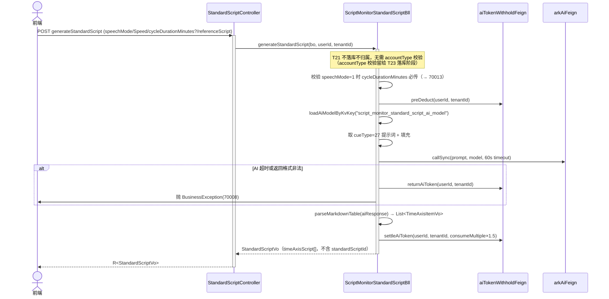
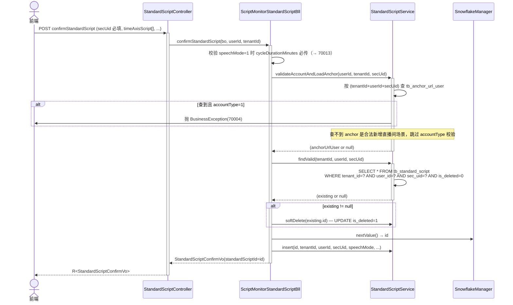
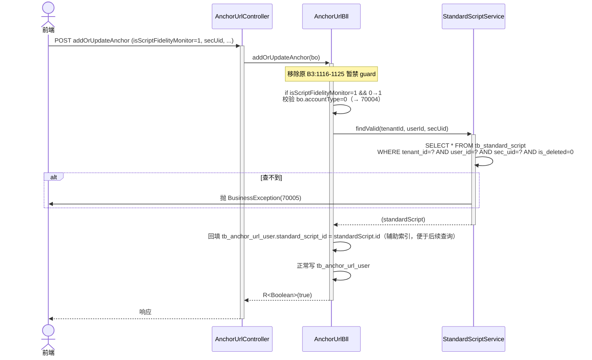
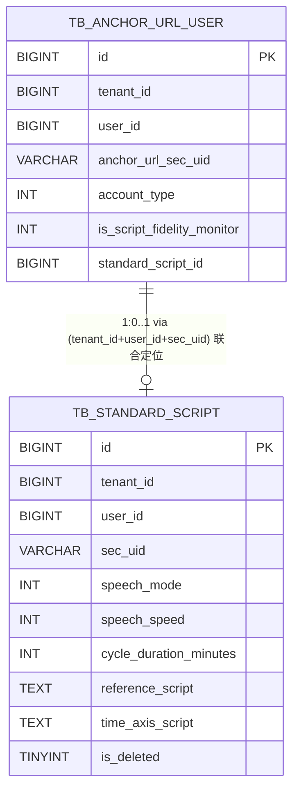
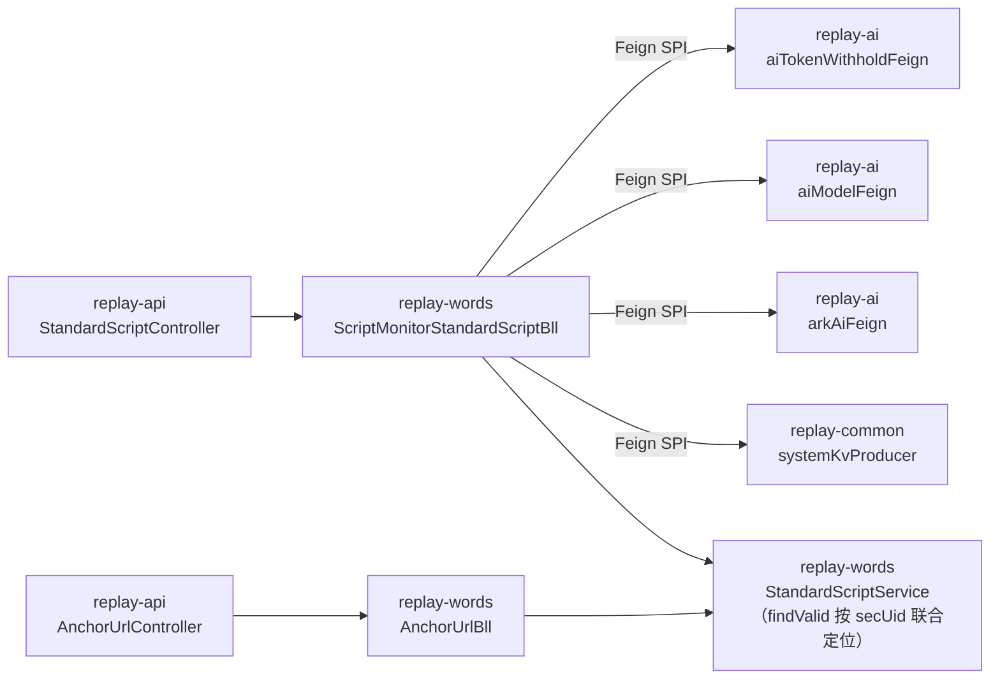

# 话术还原度 Slice A — 标准稿能力 + B3/B8 限闸解除

## 1. Context

- **Business goal (one sentence):** 打通话术还原度配置阶段全链路 — 前端能开启还原度开关、能调用 generateStandardScript/confirmStandardScript/standardScriptDetail 三个 API 配置并落库标准直播稿；为后续 Slice B（报告生成核心）+ Slice C（详情+多页面+触发链）铺契约。
- **Scope of change:**
  - `replay-common` — `AiEnums.askType`：18 重命名 `FIDELITY_NON_CYCLIC_GENERATE` / 19 重命名 `FIDELITY_NON_CYCLIC_MERGE` / 新增 25 `FIDELITY_CYCLIC_GENERATE` / 26 `FIDELITY_CYCLIC_MERGE` / 27 `STANDARD_SCRIPT_GENERATE`
  - `replay-words` — 新增 `ScriptMonitorStandardScriptBll`（T21/T23/T24 主逻辑 + markdown 解析私有方法）；新增 `StandardScriptService` + `StandardScriptServiceImpl`（**抽 Service 层，避免 Bll-to-Bll 互调；AnchorUrlBll 通过 Service 校验标准稿，不直调 Bll**）；修改 `AnchorUrlBll`（移除 B3:1116-1125 暂禁 guard + 移除 B8:2317-2324 暂禁 guard + 按 `(tenantId+userId+secUid)` 联合定位查标准稿 + accountType 校验）；修改 `StandardScriptEntity`（去掉 `anchorUrlUserId` 字段，加 `secUid` 字段）；新建 6 个 BO/VO
  - `replay-api` — 新建 `StandardScriptController`（T21/T23/T24 三入口）
  - `sql/replay-34.sql` — 5 条 INSERT INTO `tb_cue_words`，cueType 18/19/25/26/27（提示词落库）
  - `sql/replay-35.sql` — DDL：`tb_standard_script` DROP `anchor_url_user_id` + DROP `uk_tenant_anchor` 索引 + ADD `sec_uid VARCHAR(64) NOT NULL` + ADD `uk_tenant_user_secuid (tenant_id, user_id, sec_uid, is_deleted)` 唯一索引
- **Dependencies consulted:**
  - `.claude/llm_wiki/wiki/frontend-api/script_monitor.md`（行 616-731：B3 三 API 完整字段 + 错误码）
  - `replay-generic/src/main/java/com/jiuyu/replay/generic/vo/common/code/StatusCode.java`（70001-70014 全部已定义）
- **Explorer hand-off:** `.claude/runs/Change__2026-06-11_12-33-48/explore_report.md`

---

## 2. Domain Model

### 新增/变更业务术语

| 术语 | 定义 |
|---|---|
| 标准直播稿（StandardScript） | 经用户确认落库的时间轴话术模板；同一(租户+用户+secUid)三元组同时只有一份已确认稿（软删除历史版本）。**用 `secUid` 作为主播唯一标识，不依赖 anchorUrlUserId**（避免新增直播间场景下 anchorUrlUserId 尚未生成的占位问题）。 |
| 生成稿（draft） | T21 AI 同步生成的临时时间轴，不落库，前端暂存供用户编辑后调 T23 确认。 |
| 已确认稿 | T23 落库后的记录，`is_deleted=0`；每次确认替换，旧稿 `is_deleted=1`。 |
| 话术模式（speechMode） | 0=非循环（整场单轮话术）/ 1=循环（重复周期性话术，需 cycleDurationMinutes）。 |
| 还原度开关（isScriptFidelityMonitor） | `tb_anchor_url_user` 字段，0=关闭 1=开启；开启前置：按 `(tenantId+userId+secUid)` 能查到有效标准稿。 |
| accountType | 0=自有账号（可操作全部能力）/ 1=同行/竞品账号（话术还原度 + 标准稿操作全拒）。 |
| secUid 主键定位 | 标准稿表主定位三元组 `(tenant_id, user_id, sec_uid, is_deleted=0)`；唯一索引 `uk_tenant_user_secuid`。T23/T24/B3/B8 均按此定位，**无 anchor_url_user_id 占位**、**无回填逻辑**、**无幽灵行**。 |

### AiEnums.askType 枚举变更

| 值 | 旧名 | 新名 | 用途 |
|---|---|---|---|
| 18 | `FIDELITY_MONITOR_GENERATE_PROMPT` | `FIDELITY_NON_CYCLIC_GENERATE` | 话术还原度非循环对比生成 |
| 19 | `FIDELITY_MONITOR_MERGE_PROMPT` | `FIDELITY_NON_CYCLIC_MERGE` | 话术还原度非循环合并 |
| 25（新增） | — | `FIDELITY_CYCLIC_GENERATE` | 话术还原度循环对比生成 |
| 26（新增） | — | `FIDELITY_CYCLIC_MERGE` | 话术还原度循环合并 |
| 27（新增） | — | `STANDARD_SCRIPT_GENERATE` | 标准稿 AI 生成（T21 用） |

> 安全证据：已 grep 确认 `FIDELITY_MONITOR_GENERATE_PROMPT` / `FIDELITY_MONITOR_MERGE_PROMPT` 业务代码 + SQL **零字面量引用**，重命名无运行时风险（仅枚举名引用）。

### isScriptFidelityMonitor 状态机

| 当前状态 | 事件 | 新状态 | 前置条件 |
|---|---|---|---|
| 0（关闭） | addOrUpdateAnchor(isScriptFidelityMonitor=1) | 1（开启） | accountType=0 + 按 `(tenantId+userId+secUid+is_deleted=0)` 能查到 tb_standard_script 记录（否则 70005） |
| 0（关闭） | setMonitorEnabled(monitorType=1, enabled=1) | 1（开启） | accountType=0 + 按 `(tenantId+userId+secUid+is_deleted=0)` 能查到 tb_standard_script 记录（否则 70005） |
| 1（开启） | addOrUpdateAnchor(isScriptFidelityMonitor=0) | 0（关闭） | 无前置 |
| 1（开启） | setMonitorEnabled(monitorType=1, enabled=0) | 0（关闭） | 无前置 |
| 任意 | accountType=1 时调用 | 拒绝（70004） | — |

> **关键变更**：开关开启的"前置标准稿校验"不再需要前端传 `standardScriptId`；后端按 `(tenantId+userId+secUid)` 自动查 tb_standard_script。前端 B3 addOrUpdateAnchor 入参的 `standardScriptId` 字段在本设计下**变为可选**（保留字段做向后兼容，但后端不再依赖）。

---

## 2.5 Business Architecture

### 2.5.1 Business Flow

**T21 generateStandardScript（纯 AI 调用 + 不落库 + 不归属）：**



**T23 confirmStandardScript（按 secUid 落库 — 软删旧 + INSERT 新 + 无占位）：**



**B3 addOrUpdateAnchor 解禁（isScriptFidelityMonitor=1 校验链 — 按 secUid 自动查标准稿，无回填）：**



### 2.5.2 Business Boundary

- **In scope (replay-words 层拥有):**
  - T21 AI 调用与 markdown 解析逻辑（`ScriptMonitorStandardScriptBll`）
  - T23 标准稿落库与软删除编排（`ScriptMonitorStandardScriptBll`）
  - T24 详情查询编排（`ScriptMonitorStandardScriptBll`）
  - 标准稿数据访问层（`StandardScriptService` + `StandardScriptServiceImpl`）：`findValid(tenantId, userId, secUid)` / `softDelete(id)` / `insert(...)` / `selectByAnchorUser(...)`（T24 用）
  - B3 限闸解除 + accountType 校验 + 按 secUid 查标准稿（`AnchorUrlBll` **注入 `StandardScriptService`，不注入 `ScriptMonitorStandardScriptBll`** — 避免 Bll-to-Bll 互调）
  - B8 限闸解除 + accountType 校验 + 按 secUid 查标准稿（同 B3）
- **Out of scope (其他模块负责):**
  - Token 余额管理：`replay-ai` 的 `aiTokenWithholdFeign`（Feign 调用）
  - systemKv 配置读取：`replay-common` 的 `systemKvProducer`
  - AI 模型调用：`replay-ai` 的 `arkAiFeign`
  - 报告生成（T25/T26/T27）：Slice B 负责
  - triggerReport 闸解除（monitorType=1）：Slice C 负责
- **Boundary contract:**
  - 跨模块全部通过 `replay-generic` Feign SPI
  - 同模块 Bll-to-Service 单向依赖：`ScriptMonitorStandardScriptBll` 注入 `StandardScriptService`；`AnchorUrlBll` 注入 `StandardScriptService`
  - **禁止 Bll-to-Bll 直接互调**（架构原则 — 业务编排在 Bll，数据访问在 Service）

### 2.5.3 Upstream / Downstream

| Direction | System / Module | Touchpoint | What flows |
|---|---|---|---|
| Downstream | replay-ai | `aiTokenWithholdFeign.preDeduct` / `settleAiToken` / `returnAiToken` | userId + tenantId + consumeMultiple |
| Downstream | replay-common | `systemKvProducer.getByKey("script_monitor_standard_script_ai_model")` | kvKey → kvValue(modelCode) |
| Downstream | replay-ai | `aiModelFeign.getByCode(modelCode)` | modelCode → AiModelInfoVo |
| Downstream | replay-ai | `arkAiFeign.callSync(prompt, model)` | 系统提示词 + 参考脚本 → AI 输出文本 |

### 2.5.4 Business Rules

1. **单主播单标准稿**：`tb_standard_script` 对 `(tenant_id, user_id, sec_uid, is_deleted=0)` 语义唯一（唯一索引 `uk_tenant_user_secuid`）；新确认时旧稿 `is_deleted=1`，不保留历史版本（Slice A 不提供历史版本功能）。
2. **无占位回填**：标准稿按 secUid 联合定位，无 anchor_url_user_id 占位、无 addOrUpdateAnchor 回填逻辑、无幽灵行。B3/B8 解禁时按 (tenantId+userId+secUid) 自动查标准稿，不依赖前端传 standardScriptId（前端传该字段在本设计下被后端忽略，标记为可选）。
3. **accountType 守门**：B3/B8/T23 三入口校验 `accountType=0`（T21 是纯 AI 调用不归属，不校验 accountType）；新增直播间场景（按 secUid 查 anchor_url_user 无记录）跳过校验；同行/竞品账号（accountType=1）抛 70004，不执行任何写操作；B3 新增直播间场景下后端必须 fallback 到 `addOrUpdateAnchorBo.getAccountType()`，避免 currentAnchorUser=null 时绕过校验。
4. **Token 边界**：T21 成功消耗 Token（预扣→settle）；失败/超时必须归还预扣（returnAiToken）；T23/T24/B3/B8 不消耗 Token。Token 归还职责由外层 catch 统一负责，私有方法（parseMarkdownTable 等）仅抛 BusinessException，禁止在内部直接调 returnAiToken（避免双重归还）。
5. **还原度开关 0→1 必须绑定有效稿**：isScriptFidelityMonitor 从 0 开启，按 (tenantId+userId+secUid) 查到 `is_deleted=0` 标准稿才允许；查不到抛 70005；1→0 关闭无前置条件。校验通过时把 standardScript.id 回填到 tb_anchor_url_user.standard_script_id（辅助索引，非主定位字段）。
6. **AI 输出格式约定**：cueType=27 提示词约定 AI 输出 markdown 表格（`|时间段|框架标题|直播话术|`）；解析失败视为生成失败（70008）。

---

## 3. API Contract (Handoff)

### T21 — POST /replay/script-monitor/generateStandardScript

- **鉴权：** Header `Authorization: Bearer <jwt>` 必填；从 JWT 取 userId / tenantId，Controller 禁止接收外部 userId 参数
- **`@NoRepeatSubmit`：** 建议加（AI 调用 60s 上限，防重复提交）
- **Request Body：**

| 字段 | 类型 | 必填 | 校验 | 语义 |
|---|---|---|---|---|
| speechMode | Integer | Y | 0 or 1 | 话术模式 |
| speechSpeed | Integer | Y | 100-500 | 语速（字/分钟）|
| cycleDurationMinutes | Integer | 条件 | — | 循环预估时长；speechMode=1 时必填 |
| referenceScript | String | Y | @NotBlank | 参考直播脚本原文 |

> T21 是**纯 AI 调用**，不落库不归属，**无需 anchorUrlUserId / secUid 入参**。accountType 校验留给 T23 落库阶段。

```json
{
  "speechMode": 0,
  "speechSpeed": 280,
  "referenceScript": "开播了，欢迎大家……"
}
```

- **Response data（`R<StandardScriptVo>`）：**

| 字段 | 类型 | 语义 |
|---|---|---|
| speechMode | Integer | 话术模式（回显）|
| speechSpeed | Integer | 语速（回显）|
| cycleDurationMinutes | Integer \| null | 循环时长 |
| referenceScript | String | 参考脚本原文（回显）|
| timeAxisScript | List\<TimeAxisItemVo\> | AI 生成时间轴 |

`TimeAxisItemVo`：

| 字段 | 类型 | 语义 |
|---|---|---|
| timeRange | String | 时间段，如"00:00-05:00" |
| title | String | 段落标题 |
| content | String | 话术内容 |

> **不含 standardScriptId**，此接口不落库。

- **错误码：** 70001（Token 不足）/ 70004（非自有账号）/ 70008（生成失败 / 超时）/ 70013（参数校验失败）

---

### T23 — POST /replay/script-monitor/confirmStandardScript

- **鉴权：** 同 T21
- **`@NoRepeatSubmit`：** 加（防重复落库）
- **Request Body：**

| 字段 | 类型 | 必填 | 校验 | 语义 |
|---|---|---|---|---|
| secUid | String | Y | @NotBlank | 主播唯一标识；标准稿按 (tenantId+userId+secUid) 联合定位 |
| speechMode | Integer | Y | 0 or 1 | 话术模式 |
| speechSpeed | Integer | Y | 100-500 | 语速 |
| cycleDurationMinutes | Integer | 条件 | — | speechMode=1 时必填 |
| referenceScript | String | Y | @NotBlank | 参考脚本原文 |
| timeAxisScript | List\<TimeAxisItemBo\> | Y | @NotEmpty | 时间轴内容（来自 T21 + 用户编辑）|

`TimeAxisItemBo`：

| 字段 | 类型 | 必填 | 校验 |
|---|---|---|---|
| timeRange | String | Y | @NotBlank |
| title | String | Y | @NotBlank |
| content | String | Y | @NotBlank |

```json
{
  "secUid": "MS4wLjABAAAA_abc123",
  "speechMode": 0,
  "speechSpeed": 280,
  "referenceScript": "开播了……",
  "timeAxisScript": [
    {"timeRange": "00:00-05:00", "title": "开场暖场", "content": "欢迎大家……"}
  ]
}
```

- **Response data（`R<StandardScriptConfirmVo>`）：**

| 字段 | 类型 | 语义 |
|---|---|---|
| standardScriptId | Long | 已确认标准稿 ID（Snowflake 19位；JacksonSerializerConfig 全局序列化为 String 输出给前端）|

- **落库语义：** 按 (tenantId+userId+secUid+is_deleted=0) 查现有稿；有 → 软删（is_deleted=1）+ INSERT 新行；无 → 直接 INSERT。**无 anchor_url_user_id 占位逻辑**。
- **accountType 校验：** 按 (tenantId+userId+secUid) 查 tb_anchor_url_user，查到且 accountType=1 → 70004；查不到（新增直播间场景）→ 跳过校验，允许落库。
- **错误码：** 70004（非自有账号）/ 70013（参数校验失败 — secUid 缺失 / 循环模式缺 cycleDurationMinutes / speechSpeed 越界）

---

### T24 — GET /replay/script-monitor/standardScriptDetail

- **鉴权：** 同 T21
- **Request Query：**

| 字段 | 类型 | 必填 | 语义 |
|---|---|---|---|
| secUid | String | Y | 主播唯一标识；按 (tenantId+userId+secUid) 联合查 |

- **Response data（`R<StandardScriptDetailVo>`）：**

| 字段 | 类型 | 语义 |
|---|---|---|
| hasScript | Boolean | 是否有已确认稿 |
| standardScriptId | Long \| null | 标准稿 ID；hasScript=false 时 null |
| secUid | String \| null | 主播唯一标识（回显）；hasScript=false 时 null |
| speechMode | Integer \| null | 话术模式 |
| speechSpeed | Integer | 语速；无稿时返回默认值 280 |
| cycleDurationMinutes | Integer \| null | 循环时长 |
| referenceScript | String \| null | 参考脚本原文 |
| timeAxisScript | List\<TimeAxisItemVo\> \| null | 时间轴内容 |
| createDate | String \| null | 标准稿确认时间（ISO-8601） |

- **错误码：** 无业务错误码（无稿返 hasScript=false，不抛异常）

---

## 4. Data Model

### 4.1 表：tb_standard_script（已建于 replay-23.sql，本 Slice DDL 变更）

**DDL 变更（sql/replay-35.sql）：**

```sql
ALTER TABLE tb_standard_script
  DROP INDEX uk_tenant_anchor,
  DROP COLUMN anchor_url_user_id,
  ADD COLUMN sec_uid VARCHAR(64) NOT NULL DEFAULT '' COMMENT '主播唯一标识（secUid）；标准稿按 (tenant_id, user_id, sec_uid) 联合定位' AFTER user_id,
  ADD UNIQUE INDEX uk_tenant_user_secuid (tenant_id, user_id, sec_uid, is_deleted) USING BTREE;
```

> 当前 tb_standard_script 表无业务数据（还原度未上线），DROP COLUMN + DROP INDEX 安全无回滚成本。

**变更后字段说明：**

| 字段 | 类型 | 语义 |
|---|---|---|
| id | BIGINT | Snowflake，`@TableId(type = IdType.INPUT)` |
| tenant_id | BIGINT NOT NULL | 租户隔离，所有查询必带 |
| user_id | BIGINT NOT NULL | 确认操作的用户 |
| **sec_uid** | **VARCHAR(64) NOT NULL** | **主播唯一标识；标准稿主定位字段（替代 anchor_url_user_id）** |
| speech_mode | TINYINT | 0=非循环 1=循环 |
| speech_speed | INT | 100-500 |
| cycle_duration_minutes | INT | 循环预估分钟 |
| reference_script | TEXT | 参考脚本原文 |
| time_axis_script | TEXT | JSON 字符串 `[{"timeRange","title","content"}]` |
| is_deleted | TINYINT | 0=有效 1=软删除 |
| create_date / update_date | DATETIME | 手动 `LocalDateTime.now()` 设置 |

**索引：** `uk_tenant_user_secuid (tenant_id, user_id, sec_uid, is_deleted)` — 唯一索引；保证同 (租户+用户+主播) 只有一份 is_deleted=0 的有效稿。

**查询场景 → 使用 uk_tenant_user_secuid 索引：**
- T24 查详情：`WHERE tenant_id=? AND user_id=? AND sec_uid=? AND is_deleted=0`
- T23 确认前查旧稿：同上
- B3/B8 校验有效稿：同上（**不再按 standardScriptId 查**）

### 4.2 SQL 数据变更（replay-34.sql）

**5 条 INSERT INTO `tb_cue_words`（提示词落库）：**

| cueType | 枚举名 | 内容来源 |
|---|---|---|
| 18 | `FIDELITY_NON_CYCLIC_GENERATE` | `docs/2.6.01/REQ-2026-0508-话术还原度/非循环对比*.md` |
| 19 | `FIDELITY_NON_CYCLIC_MERGE` | `docs/2.6.01/REQ-2026-0508-话术还原度/非循环合并*.md` |
| 25 | `FIDELITY_CYCLIC_GENERATE` | `docs/2.6.01/REQ-2026-0508-话术还原度/循环对比*.md` |
| 26 | `FIDELITY_CYCLIC_MERGE` | `docs/2.6.01/REQ-2026-0508-话术还原度/循环合并*.md` |
| 27 | `STANDARD_SCRIPT_GENERATE` | `docs/2.6.01/REQ-2026-0508-话术还原度/标准稿生成*.md` |

> `tradeId=1`（通用兜底），`tenantId=0`（通用），mirror 现有 cueType 16/17/20/21 的 INSERT 范式。
> **两文件分离**：replay-34.sql 仅 INSERT 数据；replay-35.sql 仅 DDL 改动；便于灰度回滚。

### 4.3 ER Diagram（涉及表关系）



> tb_anchor_url_user.standard_script_id 字段保留（作为辅助索引，B3 解禁时回填 standardScript.id 便于后续直查）；不作为主定位字段。

### 4.4 数据装配策略（anti-JOIN）

- T24 查详情：单表查 `tb_standard_script`，按 `(tenant_id, user_id, sec_uid, is_deleted=0)` 命中 `uk_tenant_user_secuid` 唯一索引拿唯一行，in-memory 映射到 `StandardScriptDetailVo`；不 JOIN `tb_anchor_url_user`。
- B3/B8 校验：先查 `tb_anchor_url_user`（已在 AnchorUrlBll 调用栈中），再独立按 secUid 查 `tb_standard_script`；两次单表查，不 JOIN。

### 4.5 生命周期

- 软删除：`is_deleted = 1`，手动设置，禁用 `@TableLogic`
- 存档：无（Slice A 不提供历史版本）
- 租户隔离：所有读写查询必带 `tenant_id = #{tenantId}`

---

## 5. Business Logic

### T21 generateStandardScript — Happy Path

1. Controller 从 JWT 取 userId / tenantId；校验请求体（`@Validated`）
2. 校验 `speechMode=1` 时 `cycleDurationMinutes` 不为 null（否则 70013）
3. **不校验 accountType / 不查任何直播间归属**（T21 是纯 AI 调用，不落库不归属；accountType 校验留给 T23 落库阶段）
4. `aiTokenWithholdFeign.preDeduct(userId, tenantId)` — 预扣 Token（失败抛 70001）
5. `loadAiModelByKvKey("script_monitor_standard_script_ai_model")` — 取 AI 模型（兜底 listDiagnosisModel）
6. 取 cueType=27 提示词（`tb_cue_words WHERE cue_type=27 AND trade_id=1 AND tenant_id=0 AND is_deleted=0`），填充 `#{referenceScript}` / `#{speechSpeed}` / `#{trade}` 占位符
7. `arkAiFeign.callSync(prompt, model)` — 同步调用，60s 超时；超时捕获 → `returnAiToken` → 抛 70008
8. `parseMarkdownTable(aiOutput)` — 正则解析 `|时间段|框架标题|直播话术|` 表格行，跳表头/分隔行；解析失败 → `returnAiToken` → 抛 70008
9. `aiTokenWithholdFeign.settleAiToken(userId, tenantId, model.consumeMultiple × 1.5)` — 消费
10. 返回 `StandardScriptVo`（不含 standardScriptId）

### T23 confirmStandardScript — Happy Path

1. 校验请求体（`@Validated`）— secUid 必填、speechMode=1 时 cycleDurationMinutes 必传、speechSpeed 100-500（否则 70013）
2. **accountType 校验**（通过 `StandardScriptService.validateAccount(tenantId, userId, secUid)`）：
   - 按 (tenantId+userId+secUid) 查 `tb_anchor_url_user`
   - 查到 + accountType=1 → 抛 70004
   - 查不到（新增直播间场景）→ 跳过校验，允许落库
3. **按 (tenantId+userId+secUid, is_deleted=0) 查现有稿**（`StandardScriptService.findValid`）
4. 若存在旧稿 → `StandardScriptService.softDelete(existing.id)`（UPDATE is_deleted=1，create_date 不变 / update_date=now）
5. `SnowflakeManager.nextValue()` 生成新 id
6. `timeAxisScript` 序列化为 JSON String（`JSON.toJSONString(bo.getTimeAxisScript())`）
7. INSERT `tb_standard_script`：(id, tenant_id, user_id, sec_uid, speech_mode, speech_speed, cycle_duration_minutes, reference_script, time_axis_script, create_date=now, update_date=now, is_deleted=0)
8. 返回 `StandardScriptConfirmVo(standardScriptId=id)`

### T24 standardScriptDetail — Happy Path

1. Controller 从 JWT 取 userId / tenantId；secUid 从 Query 取
2. `StandardScriptService.findValid(tenantId, userId, secUid)` — 按 `uk_tenant_user_secuid` 索引查
3. 若无记录：返回 `StandardScriptDetailVo(hasScript=false, speechSpeed=280)`，其余字段 null
4. 若有记录：`timeAxisScript` JSON String 反序列化为 `List<TimeAxisItemVo>`；`hasScript=true`；`createDate` 格式化为 ISO-8601 String

### B3 addOrUpdateAnchor 解禁 — 还原度开关 0→1 校验

> 替换原 1116-1125 行的"暂禁 guard"为新校验逻辑：

1. 判断 `isScriptFidelityMonitor == 1` 且为 0→1（currentFidelity == null || currentFidelity == 0）
2. 校验 `bo.accountType == 0`（或当前 AnchorUrlUserEntity.accountType；否则 70004）
3. **按 (tenantId+userId+bo.secUid) 查标准稿**（`standardScriptService.findValid`）；无记录 → 抛 70005（请先确认标准直播稿）
4. **回填辅助索引**：将 `standardScript.id` 写入待保存的 `anchorUrlUser.standardScriptId`（用于后续 T24 等场景快捷查询，非主定位字段）
5. 继续现有写库逻辑（写 tb_anchor_url_user）
6. **无需独立回填操作**（标准稿表无 anchor_url_user_id 字段，不存在占位回填）

### B8 updateMonitorSwitch 解禁 — monitorType=1 0→1 校验

> 替换原 2317-2324 行的"暂禁 guard"为新校验逻辑：

1. 判断 `monitorType == 1 && enabled == 1 && curInt == 0`
2. 校验 `current.accountType == 0`（否则 70004）
3. **按 (tenantId+userId+current.anchorUrlSecUid) 查标准稿**（`standardScriptService.findValid`）；无记录 → 抛 70005
4. 校验通过，回填 `current.standardScriptId = standardScript.id`（同步辅助索引）
5. 继续现有"监控位授权量"校验（步骤四）

### 5.2 Branches & Exceptions

| Branch | Trigger | Handling | Error Code |
|---|---|---|---|
| 非自有账号 | accountType == 1（按 secUid 查到的 anchor_url_user.accountType；B3 新主播场景 fallback 到 bo.getAccountType()） | throw BusinessException(70004) | SCRIPT_MONITOR_NOT_OWN_ACCOUNT |
| 无标准稿 | isScriptFidelityMonitor=1 且按 (tenantId+userId+secUid) 在 tb_standard_script 查无 is_deleted=0 记录 | throw BusinessException(70005) | SCRIPT_MONITOR_STANDARD_SCRIPT_NOT_CONFIRMED |
| Token 不足 | preDeduct 失败 | throw BusinessException(70001) | SCRIPT_MONITOR_TOKEN_NOT_ENOUGH |
| AI 生成失败 | 超时/格式非法 | parseMarkdownTable 仅抛异常；外层 catch (BusinessException) 统一 returnAiToken | SCRIPT_MONITOR_STANDARD_SCRIPT_GENERATE_FAIL |
| 参数校验失败 | cycleDurationMinutes 缺 / speechSpeed 越界 / secUid 缺失 | throw BusinessException(70013) | SCRIPT_MONITOR_PARAM_INVALID |

> 70006（SCRIPT_MONITOR_STANDARD_SCRIPT_INVALID）在 ADR-2 secUid 联合定位设计下**无实际触发路径**（已被 70005 覆盖）；错误码枚举保留供未来场景使用，本 Slice A 不显式抛。

### 5.3 Idempotency / Replay Safety

- **T21（generateStandardScript）：** `@NoRepeatSubmit` 防重复触发 AI；非幂等（AI 每次输出不同）
- **T23（confirmStandardScript）：** `@NoRepeatSubmit` 防重复落库；逻辑幂等 — 同一 (tenantId+userId+secUid) 重复确认会软删旧稿+INSERT 新稿
- **T24（standardScriptDetail）：** GET 只读，天然幂等
- **B3/B8：** AnchorUrlBll 已有业务幂等（状态无变化短路）

---

## 5.5 Technical Architecture

### 5.5.1 Module Topology



### 5.5.2 Cross-Module Communication

| Channel | From → To | Contract | Failure Handling |
|---|---|---|---|
| Feign | words → ai | `aiTokenWithholdFeign.preDeduct` | 失败抛 70001（不吞） |
| Feign | words → ai | `aiTokenWithholdFeign.settleAiToken` | 失败记 warn 日志；Token 预扣已完成 |
| Feign | words → ai | `aiTokenWithholdFeign.returnAiToken` | 失败记 error 日志（理论不应失败） |
| Feign | words → ai | `aiModelFeign.getByCode(modelCode)` | null → 兜底 listDiagnosisModel().get(0) |
| Feign | words → ai | `arkAiFeign.callSync(prompt, 60s)` | 超时 → returnAiToken → 70008 |
| Feign | words → common | `systemKvProducer.getByKey(kvKey)` | null/blank → 兜底 listDiagnosisModel |

### 5.5.3 Async Tasks

不涉及（T21 同步调用，无 MQ / @Scheduled）。

### 5.5.4 Cache Strategy

不涉及（标准稿详情 T24 直查 DB，不引入 Redis 缓存）。

### 5.5.5 Transaction Boundary

| 方法 | @Transactional | 覆盖操作 | 回滚语义 |
|---|---|---|---|
| `ScriptMonitorStandardScriptBll.confirmStandardScript` | `@Transactional(rollbackFor = Exception.class)` | softDelete 旧稿 is_deleted=1 + INSERT 新稿（通过 `StandardScriptService`） | 任一失败整体回滚，保持数据一致 |
| `AnchorUrlBll.addOrUpdateAnchor` | 现有事务（已有 `@Transactional`） | B3 校验时通过 `StandardScriptService.findValid` 查标准稿 + 回填 `bo.standardScriptId`（辅助索引），均在同一事务内 |
| `StandardScriptServiceImpl.softDelete` | **无独立 @Transactional** | 单条 UPDATE | 由调用方 `confirmStandardScript` 的事务统一覆盖（PROPAGATION_REQUIRED 加入外层），禁止本方法独立声明事务边界 |

> **设计原则：** ADR-2 选定 secUid 联合定位后**无 backfillAnchorUrlUserId 跨 Bll 调用**；`AnchorUrlBll` 通过构造器 / `@Resource` 注入 `StandardScriptService`，所有标准稿数据访问走 Service 层，事务边界由 Bll 业务方法的 `@Transactional` 统一管理。

### 5.5.6 Observability

- **Log keys（每个 Bll 方法）：** `userId`, `tenantId`, `anchorUrlUserId`, `standardScriptId`（where applicable）
- **T21 Log 节点：** 预扣Token→AI调用开始→AI返回→解析完成/失败→归还Token（异常路径）
- **B3/B8 解禁 Log：** 移除原有 `log.warn("[B6/B8 还原度暂禁]...")` 行；新增 `log.info("[B3/B8 还原度校验通过] ...")` 日志
- **Metric：** 依赖 Spring 标准请求日志（无额外 Prometheus 指标）

---

## 6. Non-Functional Constraints (Hard Constraints)

### 编码强制规范（传递给 @lead-engineer）

- **DI：** 构造器注入；禁 `@Autowired`；禁 `@Resource`（新代码强制；遗留 Bll 如已全用 @Resource 则镜像遗留风格并登记 TECH-DEBT）
- **软删除：** 手动 `entity.setIsDeleted(1)`；禁用 `@TableLogic`
- **时间戳：** 手动 `entity.setCreateDate(LocalDateTime.now())` / `setUpdateDate(LocalDateTime.now())`
- **ID 生成：** `SnowflakeManager.nextValue()`；Entity `@TableId(type = IdType.INPUT)`
- **Controller 返回值：** 统一 `R<T>`（`com.jiuyu.replay.generic.vo.common.R`），禁裸返业务对象
- **Long ID 序列化：** 直接用 `Long` 字段，依赖 `JacksonSerializerConfig.java:30` 全局 `ToStringSerializer`，**禁用** 字段级 `@JsonSerialize(using = ToStringSerializer.class)`（重复）
- **写方法事务：** `@Transactional(rollbackFor = Exception.class)` 加在 `confirmStandardScript` + 含多表写的方法上
- **跨模块调用：** 全部走 `replay-generic` Feign SPI，禁止直连其他模块 Dao/Service

### 安全与权限

- **租户隔离：** 所有 `StandardScriptDao` 查询必带 `tenantId` 过滤；LambdaQueryWrapper 必含 `eq(StandardScriptEntity::getTenantId, tenantId)`
- **accountType 校验：** B3/B8/T21/T23 四入口从数据库取 `AnchorUrlUserEntity.accountType`；Controller 禁止从请求体接收 userId/accountType（从 JWT 取）
- **SQL 注入防护：** 占位符一律 `#{}`，禁 `${}`

### 性能预算

- **T21 AI 同步超时上限：** 60s（需配置 Feign/HttpClient 超时）
- **T23/T24 DB 操作：** 无循环查询；单次查询 + 单次写入
- **B3/B8 校验：** 额外增加 1 次 `tb_standard_script` 单行查询（by id + tenant_id，走主键索引，< 1ms）

### 禁止项

- 禁止 IN 列表 > 500（当前场景无批量查询，N/A）
- 禁止循环内 DB 查询（N/A）
- 禁止物理删除（所有删除走 `is_deleted=1`）
- 禁止 triggerReport monitorType=1 放行（B5 Slice C 才解禁，本 Slice 保持 70014）

---

## 6.5 Design Patterns

不涉及命名模式引入或修改。markdown 表格解析（parseMarkdownTable 私有方法）采用 Pattern Matching 范式（mirror `ScriptMonitorPatrolGenerateBll.buildSummary`），属局部实现细节，不归入命名设计模式。

Not applicable — 无 Strategy / Template Method / Factory / Chain 等命名模式引入或重构。

---

## 7. Acceptance Criteria (Testing)

### Happy Path ACs（来自 explore_report.md，verbatim）

- **AC-001（T21 生成标准稿）：** Given 已登录自有账号（accountType=0）用户，当前直播间任意 anchorUrlUserId（或不传），when POST `/replay/script-monitor/generateStandardScript`（speechMode/speechSpeed/referenceScript 合法），then 返回 `R<StandardScriptVo>` 含 `timeAxisScript[]` 非空，HTTP 200，无 standardScriptId，耗时 ≤60s。

- **AC-002（T23 确认标准稿，新增场景）：** Given 已登录自有账号用户，前端传 secUid + speechMode/speechSpeed/timeAxisScript 但 anchor_url_user 表中无记录（新增直播间前置步骤），when POST `/replay/script-monitor/confirmStandardScript`，then 返回 `R<StandardScriptConfirmVo>` 含 19 位 Snowflake 字符串 `standardScriptId`，`tb_standard_script` 写入一行（带 secUid + tenantId + userId，无 anchor_url_user_id 字段）。

- **AC-003（T24 查详情，有稿）：** Given 已登录用户，按 (tenantId+userId+secUid) 在 tb_standard_script 有 is_deleted=0 记录，when GET `/replay/script-monitor/standardScriptDetail?secUid=<>`，then 返回 `hasScript=true` + 完整 standardScriptId/speechMode/speechSpeed/timeAxisScript[]。

- **AC-004（T24 查详情，无稿）：** Given 已登录用户，按 (tenantId+userId+secUid) 在 tb_standard_script 无 is_deleted=0 记录，when GET `/replay/script-monitor/standardScriptDetail?secUid=<>`，then 返回 `hasScript=false` + `speechSpeed=280`（默认值），其余字段 null。

- **AC-005（B3 解禁开启还原度）：** Given 已登录自有账号，按 (tenantId+userId+bo.secUid) 在 tb_standard_script 有 is_deleted=0 记录，when POST `addOrUpdateAnchor`（isScriptFidelityMonitor=1，standardScriptId 不传或忽略），then 还原度开关写入 tb_anchor_url_user，AnchorUrlBll 不再抛 70014，返回成功，tb_anchor_url_user.is_script_fidelity_monitor=1 且 standard_script_id 回填为查到的 standardScript.id。

- **AC-006（B8 解禁 setMonitorEnabled monitorType=1）：** Given 已登录自有账号，按 (tenantId+userId+current.anchorUrlSecUid) 能查到标准稿，when POST `setMonitorEnabled`（monitorType=1, enabled=1），then 成功切换开关，不再抛 70014，同步回填 current.standardScriptId。

- **AC-007（竞品账号拦截）：** Given 已登录用户，按 (tenantId+userId+secUid) 查到的 tb_anchor_url_user.accountType=1（同行账号），when 调用 B3/B8/T23 任意一个接口，then 抛 `BusinessException(70004)`，`{"code":70004}`，不写库。

### Edge Case ACs

- **AC-008（B3 新增直播间 bo.accountType=1 拒绝）：** Given 前端新增直播间（currentAnchorUser=null）+ 传 accountType=1 + isScriptFidelityMonitor=1，when POST `addOrUpdateAnchor`，then 抛 70004（AnchorUrlBll 必须 fallback 到 bo.getAccountType()，不能因 currentAnchorUser=null 而绕过校验），不写库。

- **AC-009（B8 按 secUid 查无标准稿）：** Given tb_anchor_url_user 存在 + accountType=0，但按 (tenantId+userId+current.anchorUrlSecUid) 查 tb_standard_script 无 is_deleted=0 记录，when POST `setMonitorEnabled`（monitorType=1, enabled=1），then 抛 70005，不修改开关。

- **AC-010（T21 AI 超时 60s）：** Given AI 调用超 60s，when POST `generateStandardScript`，then 归还预扣 Token + 抛 70008，不写库；returnAiToken 只调用 1 次（由外层 catch 统一处理）。

- **AC-011（T21 AI 输出格式非法）：** Given AI 返回文本不含 `|时间段|` 格式表格行，when parseMarkdownTable 解析，then 归还预扣 Token + 抛 70008，不写库；returnAiToken 只调用 1 次（parseMarkdownTable 仅抛异常不归还，外层 catch 归还）。

- **AC-012（T23 speechMode=1 cycleDurationMinutes 未传）：** Given speechMode=1，cycleDurationMinutes=null，when POST `confirmStandardScript`，then 抛 70013，不写库。

- **AC-013（T23 同 secUid 已有稿更新替换）：** Given (tenantId+userId+secUid) 已有 is_deleted=0 旧标准稿，when POST `confirmStandardScript`（同 secUid），then 旧稿 is_deleted=1（softDelete），新稿 INSERT（新 Snowflake id），返回新 standardScriptId。

- **AC-014（B3 isScriptFidelityMonitor=1 但按 secUid 查无标准稿）：** Given isScriptFidelityMonitor=1 + accountType=0，但按 (tenantId+userId+bo.secUid) 查无 is_deleted=0 标准稿，when POST `addOrUpdateAnchor`，then 抛 70005，不写库。

- **AC-015（回归：质检 monitorType=0 不受影响）：** Given cueType=18 枚举重命名为 `FIDELITY_NON_CYCLIC_GENERATE`，when 质检 triggerReport（monitorType=0）触发生成，then 报告正常生成，无 NPE，日志无 askType 找不到的 WARN。

- **AC-016（回归：巡检 monitorType=2 不受影响）：** Given cueType=19 重命名为 `FIDELITY_NON_CYCLIC_MERGE`，when 巡检 triggerReport（monitorType=2）触发合并，then 报告正常合并，无异常。

- **AC-017（已废弃）：** ~~原 anchor_url_user_id 回填场景~~ — ADR-2 最终选定 (tenantId+userId+secUid) 联合定位方案后**无任何回填逻辑**；此 AC 整体废弃，无对应实现，不需单测。

### Unit Test Requirements

| AC-id | 被测方法 | 关键断言 |
|---|---|---|
| AC-001 | `ScriptMonitorStandardScriptBll#generateStandardScript` | 返回 StandardScriptVo.timeAxisScript 非空；Feign 预扣+settle 各调用 1 次 |
| AC-002 | `ScriptMonitorStandardScriptBll#confirmStandardScript` | INSERT 行中 secUid 非空（取自 bo）；返回 standardScriptId != null |
| AC-005/AC-006 | `AnchorUrlBll#addOrUpdateAnchor` / `updateMonitorSwitch` | 不抛 BusinessException(70014)；is_script_fidelity_monitor 写库为 1；standard_script_id 回填到 anchor_url_user |
| AC-007 | B3/B8/T23 三个入口（T21 不校验 accountType） | 抛 BusinessException(70004) |
| AC-008 | `AnchorUrlBll#addOrUpdateAnchor`（currentAnchorUser=null + bo.accountType=1） | 抛 BusinessException(70004)；验证 fallback 到 bo.getAccountType() 生效 |
| AC-009 | B8 校验链（按 secUid 查无标准稿） | 抛 BusinessException(70005) |
| AC-010/AC-011 | `ScriptMonitorStandardScriptBll#generateStandardScript`（mock timeout/bad format） | returnAiToken **只调用 1 次**（验证不双重归还）；抛 70008 |
| AC-013 | `ScriptMonitorStandardScriptBll#confirmStandardScript`（有旧稿场景） | 旧稿 softDelete 被调用；新稿 INSERT 被调用 |
| AC-014 | `AnchorUrlBll#addOrUpdateAnchor`（按 secUid 查无标准稿） | 抛 BusinessException(70005) |
| AC-015/AC-016 | 现有测试文件 `AnchorUrlBllTest` + `AnchorUrlBllUpdateMonitorSwitchTest` | 补 cueType 重命名回归 case；断言无 NPE |

---

## 8. Frontend Contract Publishing

- `frontend-facing: true`
- `module: script-monitor`

当前状态：T21/T23/T24 三 API 的字段表已在 `.claude/llm_wiki/wiki/frontend-api/script_monitor.md` 行 616-731 中以 "TBD（B3 批次实现）" 状态存在。

**Phase 4 前（Implement 开始前）：** dispatch `@frontend-api-doc-writer`（mode: forward），读 §3 API Contract + §4 Data Model + §7 AC examples → 将 `script_monitor.md` 中 T21/T23/T24 三节从"TBD"状态更新为正式契约，同步补充错误码表。

**Phase 6 Archive：** 运行 mode: reverse 做字段漂移检查，确认 §3 与 `script_monitor.md` 最终实现一致。

---

## 9. Architecture Decision Records

### ADR-1: cueType 18/19 重命名策略 — 在位重命名 vs 废弃+新增连号

**Status:** proposed
**Date:** 2026-06-11
**Deciders:** 架构师 + 后端 lead

#### Context
AiEnums.askType 枚举中 18/19 当前名为 `FIDELITY_MONITOR_GENERATE_PROMPT` / `FIDELITY_MONITOR_MERGE_PROMPT`，语义含糊（无法区分循环/非循环）。Slice A 需要新增循环话术（25/26）和标准稿生成（27）枚举值，同时澄清 18/19 语义。两种策略在枚举值稳定性和代码清洁性上存在真实 trade-off。已 grep 确认 18/19 业务代码 + SQL **零字面量引用**，重命名无运行时风险。

#### Decision
**原地重命名**（18 → `FIDELITY_NON_CYCLIC_GENERATE`，19 → `FIDELITY_NON_CYCLIC_MERGE`），在同一 enum 块新增 25/26/27。保持数值稳定性（18/19 数值不变，只改枚举名），消除语义歧义。

#### Alternatives Considered

**Alternative A: 原地重命名（选定方案）**
- Pros: 数值 18/19 不变，`tb_cue_words` 和任何外部系统（监控/日志 pattern）无需迁移；代码改动最小（单文件 2 行重命名 + 3 行新增）；编译器保证所有引用点名称更新
- Cons: 枚举名变化需 grep 确认所有引用点（已完成：零引用）；若存在跨服务字面量传输（如序列化为名称字符串的 MQ 消息）会 break
- Failure conditions: 存在通过枚举名序列化传输的 RPC 或 MQ 消息（已 grep 排除）
- Estimated complexity: S
- Why not chosen: 本方案即选定

**Alternative B: 废弃 18/19 + 全新 20-24 连号分配（跳过已占用 20-24）**
- Pros: 旧枚举值完全保留，历史兼容性强；不同语义用完全独立的值
- Cons: 20-23 已被 `INTERACTION_PATROL_*` 和 `SCRIPT_*` 占用，需要从 28 开始；`tb_cue_words` 中 18/19 行要新增 28/29 同内容记录，或更改 cueType；数据库双写窗口期风险；enum 中保留"废弃"值导致长期技术债
- Failure conditions: 废弃值和新值共存期间，某路径仍用旧值触发 cueType 未命中（提示词查 0 条）
- Estimated complexity: M
- Why not chosen: 零引用证据已充分支持重命名安全；废弃策略引入数据层迁移和技术债，收益为零

**Alternative C: 新增 25-29 连号，不重命名 18/19（仅新增，不触碰旧值）**
- Pros: 最低改动风险（18/19 名称不变）；只新增行，不修改行
- Cons: 18/19 语义歧义永久保留（GENERATE_PROMPT 不说明循环/非循环）；Slice B 报告生成用循环提示词时，开发者需看文档才能分辨 18=非循环；积累可读性债务
- Failure conditions: 未来开发者误用 18 用于循环场景（已知只 diff 于 cueType，不 diff 于 speechMode 字段）
- Estimated complexity: S
- Why not chosen: 语义歧义会持续伤害 Slice B/C 维护；重命名零风险（已 grep 证明），不理由保留歧义名

#### Consequences

**Positive**
- 代码可读性提升：18/19/25/26 四个枚举名直接表达循环/非循环语义
- 数值 18/19 不变，`tb_cue_words` 存量数据无需迁移
- Slice B/C 实现者无需查文档即可选正确枚举

**Negative**
- 编译后必须全量测试（mvn compile + 回归 AC-015/AC-016）
- 如有其他服务通过枚举名字符串传输（非当前已知情况）会 break

**Risks (and mitigation)**
- Risk: 存在遗漏的字面量 18/19 引用 → Mitigation: Implement 阶段 lead-engineer 执行 `grep -r "FIDELITY_MONITOR_GENERATE_PROMPT\|FIDELITY_MONITOR_MERGE_PROMPT" --include="*.java" --include="*.xml"` 再次确认零引用后方可提交
- Risk: 其他语言客户端（如前端 TS 代码）硬编码枚举数值 18/19 → Mitigation: 枚举数值不变，前端无影响

#### Archive target
`.claude/llm_wiki/wiki/architecture/adrs/NNNN-aienums-fidelity-rename.md`

---

### ADR-2: 标准稿主键定位策略 — (tenantId+userId+secUid) 联合定位 vs anchor_url_user_id 直接关联

**Status:** proposed
**Date:** 2026-06-11
**Deciders:** 架构师 + 产品

#### Context
用户配置话术还原度的典型流程：新增直播间时先点"生成标准稿"→确认标准稿→保存直播间（此时 `anchorUrlUserId` 才生成）→开启还原度。问题：T23 confirmStandardScript 被调用时 `anchorUrlUserId` 尚不存在。如何在标准稿表中标识"这份稿归属哪个主播"是核心数据模型决策，影响表设计、API 入参、Bll 校验逻辑、跨表依赖。

**关键洞察：** `sec_uid`（主播平台唯一标识）在新增直播间流程的**最开始**就由前端持有（用户输入主播链接后即可解析），且**全生命周期不变**。相比之下 `anchorUrlUserId`（tb_anchor_url_user.id）要等直播间落库后才生成。用 `secUid` 作为定位主键能彻底消除占位回填问题。

#### Decision
采用 **(tenantId+userId+secUid) 联合定位 + 唯一索引 `uk_tenant_user_secuid`**：
- `tb_standard_script` DROP 字段 `anchor_url_user_id` + DROP 索引 `uk_tenant_anchor` + ADD 字段 `sec_uid VARCHAR(64) NOT NULL` + ADD 唯一索引 `uk_tenant_user_secuid (tenant_id, user_id, sec_uid, is_deleted)`
- T23 入参 `secUid` 必填（前端在新增/编辑直播间场景下都已持有）
- T24 入参 `secUid` 替代 `anchorUrlUserId`
- B3/B8 解禁时按 `(tenantId+userId+secUid)` 自动查标准稿（无需前端传 `standardScriptId`）
- `tb_anchor_url_user.standard_script_id` 字段保留作为辅助索引（B3/B8 回填 standardScript.id）

#### Alternatives Considered

**Alternative A: (tenantId+userId+secUid) 联合定位（选定方案）**
- Pros: **数据模型最干净** — 无占位、无回填、无幽灵行；前端 UX 不变（继续支持先配标准稿后保存直播间）；B3/B8 校验不依赖前端传 standardScriptId；唯一索引天然防重复
- Cons: DROP COLUMN + DROP INDEX 是 destructive DDL（但 tb_standard_script 当前无业务数据，零回滚成本）；entity / dao 字段需要同步改
- Failure conditions: 多端同时调用 T23 软删 + INSERT 可能短暂出现 2 行同 (tenant_id,user_id,sec_uid)，但 is_deleted 在唯一键内不冲突（is_deleted=0 仅 1 行）
- Estimated complexity: M（DDL + entity 改 + API 入参改 + Bll 校验逻辑改）
- Why not chosen: 本方案即选定

**Alternative B: anchor_url_user_id 直接关联 + 占位回填（原 architect 方案）**
- Pros: 保留 anchor_url_user_id 字段对前端友好（前端用 anchorUrlUserId 标识业务对象）；DDL 改动最小
- Cons: 引入 `anchor_url_user_id=0` 占位语义；引入 addOrUpdateAnchor 保存后回填逻辑；**幽灵行风险**（保存直播间失败且用户放弃时，残留 anchor_url_user_id=0 行）；回填逻辑跨 Bll；T24 需要按"已确认 + 已回填"语义查询，逻辑复杂
- Failure conditions: addOrUpdateAnchor 失败 → 占位行永久残留；下次重试 INSERT 又产生新占位行（除非加复杂的去重逻辑）
- Estimated complexity: M
- Why not chosen: 占位+回填模型增加复杂度但不解决根本问题（标准稿表始终需要标识"属于哪个主播"，secUid 比 anchorUrlUserId 更直接）

**Alternative C: 强制前端先保存直播间（anchorUrlUserId 必传）**
- Pros: 数据模型最简洁；无幽灵行；无回填逻辑
- Cons: 强制前端改变流程（先保存直播间→再生成/确认标准稿）；UI/UX 需重新设计；PRD 已明确"支持新增直播间时先配标准稿"，违背产品需求
- Estimated complexity: S（后端简单，但产品/前端代价高）
- Why not chosen: 违背 PRD v1.3 流程要求

#### Consequences

**Positive**
- 数据模型干净：无占位 / 无回填 / 无幽灵行
- B3/B8 校验逻辑简化：自动按 secUid 查，无需前端传 standardScriptId
- T24 查询语义清晰：直接按 (tenantId, userId, secUid) 唯一索引查
- secUid 作为主播平台唯一标识全生命周期不变，比 anchorUrlUserId 更稳定（anchorUrlUserId 在用户删除/重新添加直播间时会变）
- 唯一索引天然防同账户重复标准稿
- `ScriptMonitorStandardScriptBll` 与 `AnchorUrlBll` 通过 `StandardScriptService` 解耦，无 Bll-to-Bll 互调

**Negative**
- 需要新增 DDL（sql/replay-35.sql：DROP COLUMN + DROP INDEX + ADD COLUMN + ADD UNIQUE INDEX）
- `StandardScriptEntity` 字段同步改（去 anchorUrlUserId + 加 secUid）
- 前端 T23/T24/T21 入参契约变更（anchorUrlUserId → secUid）

**Risks (and mitigation)**
- Risk: DDL DROP COLUMN 影响存量数据 → Mitigation: tb_standard_script 当前**无业务数据**（还原度未上线），DROP 安全；replay-35.sql 单独 DDL 文件便于灰度
- Risk: 前端契约变更需要前后端协调 → Mitigation: Slice A 完工同步更新 `.claude/llm_wiki/wiki/frontend-api/script_monitor.md` 入参字段；前端联调前提供变更说明
- Risk: 多端并发 T23 软删 + INSERT 产生短暂多行 → Mitigation: 唯一索引 `uk_tenant_user_secuid` 包含 is_deleted，保证 is_deleted=0 唯一；并发场景由 DB 唯一约束兜底，业务层不需要分布式锁

#### Archive target
`.claude/llm_wiki/wiki/architecture/adrs/NNNN-standardscript-secuid-primary-locator.md`

---

## 做什么 / 为什么

**现状：** 话术还原度功能（`isScriptFidelityMonitor`）在 `AnchorUrlBll.java:1116` 和 `2317-2324` 均有硬性暂禁 guard，任何开启操作均抛 70014（功能未上线）。三个配置 API（T21/T23/T24）尚未实现。标准稿表 `tb_standard_script` 已建（但字段需调整），相关枚举（18/19）已定义但语义不清晰，25/26/27 枚举值尚未添加，5 套提示词尚未入库。

**需要：** 移除两处暂禁 guard；调整 `tb_standard_script` 表结构（去 `anchor_url_user_id` 加 `sec_uid`，改唯一键为 `uk_tenant_user_secuid`）；实现 B3/B8 两处 secUid + accountType 校验逻辑（自动按 secUid 查标准稿，无需前端传 standardScriptId）；新增 `ScriptMonitorStandardScriptBll` + `StandardScriptService` 实现 T21 同步 AI 生成（60s 超时 + markdown 解析）、T23 按 secUid 落库（软删旧 + INSERT 新）、T24 按 secUid 查详情；新建 `StandardScriptController` 暴露三个 API；AiEnums 枚举重命名 + 扩充；5 套提示词 INSERT。

**范围：** 5 个模块协作（replay-common + replay-words + replay-api + replay-ai(Feign 调) + sql）；新增 1 个 Bll 类、1 个 Service 接口 + 实现、6 个 BO/VO 类、1 个 Controller 类、2 个 SQL 文件（replay-34 数据 + replay-35 DDL）；修改 3 个现有文件（AiEnums + AnchorUrlBll + StandardScriptEntity）。

## 怎么做

核心设计选择（详见 §9 ADR）：

1. **枚举重命名**（ADR-1）：选"原地重命名"（数值不变、改名、新增），零数据迁移代价，已 grep 确认零引用风险。

2. **标准稿主键定位**（ADR-2）：选"(tenantId+userId+secUid) 联合定位"，DROP anchor_url_user_id + ADD sec_uid + 改唯一键。**无占位、无回填、无幽灵行**。secUid 比 anchorUrlUserId 更稳定（主播平台唯一标识，全生命周期不变）。

3. **AI 调用同步（T21）**：60s 超时上限，失败强制 returnAiToken 后抛 70008；不引入异步 MQ（Slice A 无轮询需求，前端等待 60s 内响应）。

4. **parseMarkdownTable**：私有方法内联在 `ScriptMonitorStandardScriptBll`（非独立工具类），mirror 现有 `ScriptMonitorPatrolGenerateBll.buildSummary` 正则范式，减少新建类数量。

5. **Service 层抽离**：新建 `StandardScriptService` + `StandardScriptServiceImpl`，提供 `findValid` / `softDelete` / `insert` / `validateAccount` 4 个方法。**AnchorUrlBll 注入 `StandardScriptService`（而非 `ScriptMonitorStandardScriptBll`）**，避免 Bll-to-Bll 互调；业务编排在 Bll、数据访问在 Service，分层清晰。

## 需要你确认的

- [ ] **ADR-1**：18/19 原地重命名（数值不变）已确认无运行时风险，同意继续？（已确认 OK）
- [ ] **ADR-2 修订版**：(tenantId+userId+secUid) 联合定位 + DDL DROP anchor_url_user_id + ADD sec_uid，同意进入实现？（已确认 OK）
- [ ] **sql 文件编号**：replay-34.sql（提示词 INSERT） + replay-35.sql（DDL），同意？（已确认 OK）
- [ ] **Service 层抽离**：AnchorUrlBll 通过 `StandardScriptService` 访问标准稿，无 Bll-to-Bll 依赖，**不登记 TECH-DEBT**（已确认 OK）

---

## Plan Deviation Reflection

2026-06-11

### 1. Design 阶段（/h-design）相对 /h-brief 骨架的演进

**Deviation：** ADR-2 决策从 architect 初版"anchor_url_user_id=0 占位 + addOrUpdateAnchor 回填"演进为最终选定的"(tenantId+userId+secUid) 联合定位 + DDL DROP anchor_url_user_id + ADD sec_uid"。同步触发 DDL 改动（新增 sql/replay-35.sql），entity 字段 / API 入参 / B3/B8 校验逻辑全面调整为按 secUid 自动查标准稿，无回填、无幽灵行。

**Reason:** Review architect 初版 openspec 时识别到 architect 设计的 sequence diagram 中"UPDATE anchor_url_user_id, sec_uid WHERE id=standardScriptId"暗含 tb_standard_script 需要 sec_uid 字段（DDL 未声明），与"无 DDL 改动"前提矛盾；进一步评估发现 sec_uid 是主播平台唯一标识，全生命周期不变，比 anchorUrlUserId（直播间落库后才生成）更适合作主键定位。用户拍板"去掉 anchorUrlUserId"彻底重构数据模型。

**Cost：** ADR-2 全文重写 + openspec §1/§2/§2.5/§3/§4/§5 全段更新 + DDL 增量从 0 改为 sql/replay-35.sql 1 个 destructive DDL（DROP COLUMN + DROP INDEX + ADD COLUMN + ADD UNIQUE INDEX）。无 Boundary Exception；DDL 在 tb_standard_script 当前无业务数据前提下零回滚成本。

### 2. Service 层抽离（用户明确指示）

**Deviation：** Architect 初版方案"AnchorUrlBll 直调 ScriptMonitorStandardScriptBll + 登 TECH-DEBT"被用户否决，改为"抽 StandardScriptService 层 + AnchorUrlBll 注入 Service 而非 Bll"。

**Reason：** 用户明确反对"动不动登 TECH-DEBT"作为新建 Bll-to-Bll 依赖的借口；新代码必须正经设计，业务编排在 Bll、数据访问在 Service。memory `feedback-record-tech-debt-in-docs` 同步更新门槛收紧为"本次新建依赖不允许走 TECH-DEBT 借口路径"。

**Cost：** 新增 StandardScriptService + StandardScriptServiceImpl 2 个文件；focus_card Allowed Scope 加 2 行；架构层次更清晰，无运行时成本。

### 3. Implement 阶段两轮 review 后的修复

**Deviation：** code-reviewer Round 1 找到 2 CRITICAL + 1 MAJOR + 6 MINOR；Round 2 复核确认 5 处 fix CONFIRMED 后又新发现 5 处 MINOR（1 处代码 Javadoc + 4 处 openspec stale 遗漏）。最终累计实际修复 11 处（5 + 1 + 5）。

**Reason：** ADR-2 中途重构涉及面广，openspec §2.5.4/§5.2/§5.3/§5.5.1/§5.5.5 多处隐性 stale 在 Round 1 MINOR #9 未全量识别；code-reviewer Round 2 系统性扫出。CRITICAL 双重 returnAiToken / accountType 绕过是 lead-engineer 实现细节疏漏，通过 review 闭环捕获。

**Cost：** 多两轮 review + 多一次 stale 全面扫描；额外 ~30 分钟 lead-engineer push back（@Resource → 构造器注入）。未触发 Boundary Exception；mvn test 41 PASS 验证修复正确性。

### 4. Lead-engineer 误判 AnchorVideoApi:68 "pre-existing"

**Deviation：** lead-engineer 报告 `replay-words/.../AnchorVideoApi.java:68` 编译错为 pre-existing；实际是 lead-engineer 环境 replay-generic 未 install 最新版本（hasBarrage 接口尚未对齐）。

**Reason：** lead-engineer 用 git stash 验证时未意识到新建的 untracked 文件 stash 不走，导致 `StandardScriptServiceImpl` 仍引用 `getSecUid()`、误判错误来源。主代理 install replay-generic 后全栈 BUILD SUCCESS 19.6s。

**Cost：** 排查耗时 ~10 分钟；无代码修改成本。

### 5. 顺手登记 DEBT-021（RedisWithholdVo 命名反直觉）

**Deviation：** test-engineer 写 mock 时实测踩坑（redisId: Long / withholdId: String 与命名直觉相反），符合存量真实债务标准，登记到 docs/TECH-DEBT.md。

**Reason：** 真实可观察的踩坑证据 + 存量类（非本次新建），符合 memory 门槛"真实存量债务才登"。

**Cost：** 仅 1 行台账登记；不动 RedisWithholdVo 类本身（未来独立任务清理）。
