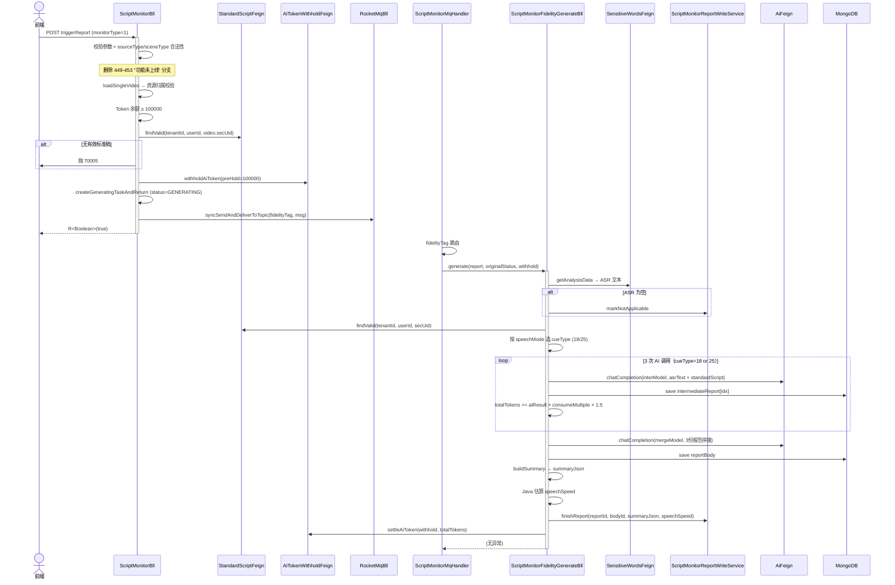
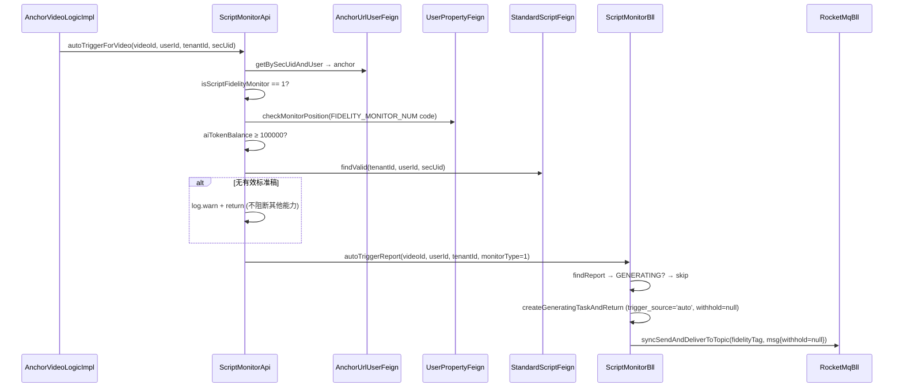
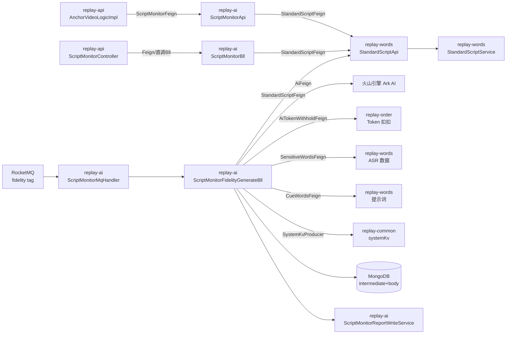

# 话术还原度 Slice B — 报告生成核心（T25/T26/T27）

## 1. Context

- **Business goal (one sentence):** 打通话术还原度报告生成核心链路 — 解除三处限闸 + 新建 `ScriptMonitorFidelityGenerateBll`（mirror 质检 3+1 范式，4 次串行 AI 调用 + speechMode 提示词路由）+ 建立跨模块 `StandardScriptFeign` SPI + 打通 `autoTriggerReport(monitorType=1)` + `ScriptMonitorMqHandler` 分发 fidelity tag；前端触发 `triggerReport(monitorType=1)` 可获得 GENERATED 状态报告。
- **Scope of change:**
  - `replay-ai`：新建 `ScriptMonitorFidelityGenerateBll`；修改 `ScriptMonitorBll`（删 449-453 闸 + 替换 480-483 占位 + 扩 autoTriggerReport）；修改 `ScriptMonitorMqHandler`（fidelity tag 路由）；修改 `ScriptMonitorReportEntity`（补 score/speech_speed/deviation_summary 字段）；修改 `ScriptMonitorApi`（autoTriggerForVideo 加还原度分支）
  - `replay-words`：新建 `StandardScriptApi`（实现 `StandardScriptFeign`）
  - `replay-generic`：新建 `StandardScriptFeign` SPI；新建 `StandardScriptInfoVo`（跨模块传输 VO）
  - 无 DDL（tb_script_monitor_report 字段 score/speech_speed/deviation_summary 已在 replay-23.sql 建好，Entity 补字段即可；tb_standard_script 已在 Slice A 就绪）
- **Dependencies consulted:**
  - `explore_report.md`（本 run_dir，Phase 1 真相源）
  - `.claude/llm_wiki/archive/Change__2026-06-11_12-33-48__restoreDegree-slice-a__openspec.md`（Slice A 完工契约）
  - `replay-ai/bll/ScriptMonitorGenerateBll.java`（质检 3+1 AI 编排范式，mirror 对象）
  - `replay-ai/bll/ScriptMonitorPatrolGenerateBll.java`（巡检多切片范式，withhold=null 容错参考）
  - `replay-ai/bll/ScriptMonitorMqHandler.java`（fidelity tag 路由修改点）
  - `replay-ai/bll/ScriptMonitorReportWriteService.java`（失败补偿 finishReport/restoreOrFail/markNotApplicable）
  - `replay-ai/bll/ScriptMonitorBll.java:439-644`（triggerReport + autoTriggerReport + resolveMqTag 代码实体）
  - `replay-ai/api/ScriptMonitorApi.java`（B7 autoTriggerForVideo 实现）
  - `replay-words/repository/service/StandardScriptService.java`（findValid 已就位，Slice A 产出）
  - `replay-generic/feign/words/`（现有 Feign SPI 目录，StandardScriptFeign 落这里）
  - `docs/2.6.01/REQ-2026-0508-话术还原度/{非循环,循环}话术还原度合并校检提示词.md`（`<aifupan-data-block>` 输出约定：Markdown 文本块，非 JSON）
  - `sql/replay-23.sql`（score/speech_speed/deviation_summary 已建字段确认）
- **Explorer hand-off:** `.claude/runs/Change__2026-06-11_18-57-48/explore_report.md`

---

## 2. Domain Model

### 新增/变更业务术语

| 术语 | 定义 |
|---|---|
| 还原度报告（FidelityReport）| 类型 monitorType=1 的 ScriptMonitorReport；生成链路为 3 次独立对比 + 1 次合并校检（共 4 次 AI 调用）。 |
| speechMode | 0=非循环（整场话术）/ 1=循环（重复周期性话术，需 cycleDurationMinutes）；控制提示词路由：0→cueType=18/19，1→cueType=25/26。 |
| 对比报告（InterReport）| 单次 AI 对比调用输出（cueType=18 或 25），落 MongoDB `tb_script_monitor_intermediate_report`（复用质检中间报告集合）。 |
| 合并报告（MergeReport）| 3 份对比报告的 AI 合并校检（cueType=19 或 26），最终正文落 MongoDB `tb_script_monitor_report_body.content`。 |
| cycleDurationMinutes 占位符 | 提示词占位符 `#{cycleDurationMinutes}`；speechMode=1 时 Java 端填充标准稿的 cycleDurationMinutes 值，AI 按循环时长铺排。 |
| 循环/非循环 AI 铺排 | **Java 端不做时间轴切片**；将整场 ASR（拼接文本）+ 标准稿 time_axis_script（JSON String）整体送入 AI；循环模式 AI 按提示词约定的 cycleDurationMinutes 规则自行铺排。 |
| StandardScriptInfoVo | 跨模块传输 VO，承载 `StandardScriptFeign.findValid` 返回值；位于 `replay-generic.vo.words`；禁传 Entity。 |
| score（还原度评分）| `tb_script_monitor_report.score`（TINYINT，0-100，NULL = 未生成/生成失败）。**Slice B 设计决策：summaryJson 存 `<aifupan-data-block>` 文本内容（Markdown 样式，无数字 score），score 字段在 Slice B 阶段存 null；Slice C 详情接口前端自行从 summaryJson 解析还原度等级文字。** |
| speech_speed（实际语速）| `tb_script_monitor_report.speech_speed`（SMALLINT，字/分钟）；**Slice B 用 Java 端估算：ASR 总字数 ÷ ASR 总时长（秒）× 60**；精度 ±5 字/分钟，无需 AI 提供。 |
| deviation_summary（偏差摘要）| `tb_script_monitor_report.deviation_summary`（VARCHAR 512）；**Slice B 设计决策：`<aifupan-data-block>` 为样式化 Markdown 文本，无可拆解的 deviation 字段；deviation_summary 在 Slice B 存 null；留 Slice C 详情按前端需要决定是否填充。** |

### ScriptMonitorReport 状态机（monitorType=1 路径新增）

| 状态（code） | 含义 | Slice B 新路径 |
|---|---|---|
| 0 NOT_GENERATED | 未触发 | 初始状态 |
| 1 GENERATING | 生成中（MQ 待消费）| triggerReport/autoTriggerReport 写入后立即返回 |
| 2 GENERATED | 生成完成 | 4 次 AI 调用成功 + 合并报告写 MongoDB + 主表回填 |
| 3 GENERATE_FAILED | 生成失败 | 任一 AI 调用失败 + restoreOrFail 执行 |
| 4 NOT_APPLICABLE | 不可生成（如 ASR 为空）| markNotApplicable 执行 |

---

## 2.5 Business Architecture

### 2.5.1 Business Flow

**手动触发还原度生成（triggerReport monitorType=1）：**



**自动触发还原度生成（autoTriggerForVideo monitorType=1）：**



### 2.5.2 Business Boundary

- **In scope（replay-ai 层拥有）：**
  - 限闸解除（triggerReport 449-453 + 480-483 + autoTriggerReport 注释移除）
  - MqHandler fidelity tag 路由至 FidelityGenerateBll
  - `ScriptMonitorFidelityGenerateBll`：标准稿加载、提示词路由（speechMode 分支）、4 次串行 AI 调用编排、buildSummary、speechSpeed 估算、Token settle、失败补偿
  - `ScriptMonitorApi`：还原度 B7 自动触发分支（isScriptFidelityMonitor + hasAuth + Token + StandardScriptFeign 校验）
  - `ScriptMonitorReportEntity`：补 score/speech_speed/deviation_summary 字段（Entity 层，无 DDL 变动）
- **In scope（replay-words 层拥有）：**
  - `StandardScriptApi`：实现 `StandardScriptFeign`，内部委托 `StandardScriptService.findValid`
- **In scope（replay-generic 层拥有）：**
  - `StandardScriptFeign` SPI 声明
  - `StandardScriptInfoVo` 跨模块传输 VO
- **Out of scope（其他模块/未来批次）：**
  - fidelityReportDetail API → Slice C
  - 多页面适配 → Slice C
  - DDL → 无（字段已在 replay-23.sql）
  - score/deviation_summary 填充 → Slice C（如需；Slice B 存 null）
- **Boundary contract：**
  - replay-ai → replay-words：通过 `StandardScriptFeign`（replay-generic 声明）
  - replay-ai → replay-ai（内部跨 Bean）：通过 Spring 注入 `ScriptMonitorFidelityGenerateBll`（新建 Component）
  - MQ：RocketMQ fidelity tag（已配置 `Tag_Fidelity_Monitor`）

### 2.5.3 Upstream / Downstream

| Direction | System / Module | Touchpoint | What flows |
|---|---|---|---|
| Upstream | replay-api | `ScriptMonitorFeign.autoTriggerForVideo` | videoId, userId, tenantId, secUid |
| Downstream | replay-words | `StandardScriptFeign.findValid` | tenantId, userId, secUid → StandardScriptInfoVo |
| Downstream | replay-ai (token) | `AiTokenWithholdFeign.withholdAiToken / settleAiToken / returnAiToken` | preHold=100000 / totalTokens / withhold凭据 |
| Downstream | replay-ai (AI) | `AiFeign.chatCompletion` | AiMessageBo(systemPrompt+userContent) → AiReturnDataVo |
| Downstream | replay-ai (model) | `AiModelFeign.getByCode` | modelCode → AiModelInfoVo |
| Downstream | replay-common | `SystemKvProducer.getByKey` | key → modelCode |
| Downstream | replay-ai (ASR) | `SensitiveWordsFeign.getAnalysisData` | sourceType, sourceId → ASR 段落 |
| Downstream | replay-ai (video) | `AnchorVideoFeign.GetByVideoId` | videoId → AnchorVideoInfoVo (含 secUid, tradeId) |
| Downstream | replay-words | `CueWordsFeign.getCueWordByTradeAndType` | tradeId, cueType → CueWordsInfoVo |
| Downstream | MongoDB | `intermediateRepository / bodyRepository` | 中间报告 / 最终报告正文 |

### 2.5.4 Business Rules

1. **4 次 AI 调用串行**：3 次独立对比（cueType=18 或 25）+ 1 次合并校检（cueType=19 或 26）；不引入并行（首版正确性优先，Slice D 可优化）。
2. **speechMode 提示词路由**：speechMode=0 → cueType=18（非循环对比）+ cueType=19（非循环合并）；speechMode=1 → cueType=25（循环对比）+ cueType=26（循环合并）。
3. **整场 AI 铺排**：Java 端不切片；整场 ASR 拼接文本 + 标准稿 timeAxisScript JSON String 整体送入 AI；循环模式需填充 `#{cycleDurationMinutes}` 占位符。
4. **跨模块走 Feign**：replay-ai 访问 replay-words 标准稿数据必须通过 `StandardScriptFeign`（replay-generic 声明）；禁止直连 words DAO。
5. **withhold=null 容错**：autoTriggerReport 不预扣 Token（withhold=null）；FidelityGenerateBll 的 `returnAiToken(null)` 必须幂等处理（mirror 巡检 withhold=null 路径：try/catch 忽略 null）。
6. **score/deviation_summary 在 Slice B 存 null**：合并提示词 `<aifupan-data-block>` 输出样式化 Markdown 文本（非 JSON 数字），无法机器解析 score；Entity 补字段后 finishReport 时不填充，留 Slice C 按前端需要决定填充策略。
7. **speech_speed Java 估算**：ASR 总字数 / ASR 总时长（秒，由 sentenceMarkVo.items 首/末时间推算）× 60；结果存入 `ScriptMonitorReportEntity.speechSpeed`；精度 ±5 字/分钟。
8. **1 次 settle（mirror 质检范式）**：4 次 AI 调用期间 totalTokens 串行累加，最终调用成功后一次性 `settleAiToken`；失败时 `returnAiToken(withhold)` 归还全部预扣。

---

## 3. API Contract (Handoff)

### 已有 API：POST /replay/script-monitor/triggerReport（语义延伸）

**本 Slice 对此 API 的变更：monitorType=1 入参从抛 70014 变为合法路径。**

无新字段，无 response schema 变更；行为变化：

| 场景 | Slice B 之前 | Slice B 之后 |
|---|---|---|
| monitorType=1，参数合法，有标准稿，Token 足 | 抛 70014（功能未上线）| HTTP 200 + R<Boolean>(true)；status=GENERATING；MQ fidelity tag 投递 |
| monitorType=1，无有效标准稿 | 抛 70014（被 449-453 拦截在前）| 抛 70005（SCRIPT_MONITOR_STANDARD_SCRIPT_UNCONFIRMED）|
| monitorType=0/2 | 不受影响 | 不受影响（回归校验） |

**错误码新增路径（monitorType=1）：**

| code | 枚举 | 语义 |
|---|---|---|
| 70005 | SCRIPT_MONITOR_STANDARD_SCRIPT_UNCONFIRMED | 按 (tenantId+userId+secUid) 无 is_deleted=0 标准稿 |
| 70001 | SCRIPT_MONITOR_TOKEN_NOT_ENOUGH | Token 余额 < 100000 |

> `secUid` 由后端从 `loadSingleVideo(sourceId).getSecUid()` 取得；前端无需传额外字段。

**Request JSON 示例（与 Slice A/B4 完全一致，无新字段）：**

```json
{
  "sourceType": 0,
  "sceneType": 0,
  "sourceId": "7386123456789012345",
  "monitorType": 1
}
```

**Response JSON 示例：**

```json
{
  "code": 0,
  "msg": "OK",
  "data": true
}
```

### autoTriggerForVideo（内部 SPI，非前端接口）

新增 `isScriptFidelityMonitor == 1` 触发分支；接口签名不变（`R<String> autoTriggerForVideo(String videoId, Long userId, Long tenantId, String secUid)`）。

---

## 4. Data Model

### 4.1 ScriptMonitorReportEntity 字段保持不变（用户 2026-06-12 拍板收紧）

**本 Slice 不补 Entity 字段。** `tb_script_monitor_report` 表已建的 `score / speech_speed / deviation_summary` 三列在 Slice B 报告生成路径**永久不写**（保留供未来 Slice 决策），原因：

- AI 合并报告输出 `<aifupan-data-block>` markdown 文本（非 JSON），机器无法稳定提取 0-100 数字分 / 偏差摘要文本；用户在 Approval Gate 中拍板"全部 null"
- 语速字段同步去掉（用户决策：不计算 speechSpeed，列表页展示 summaryJson markdown 文本足够）
- 因此还原度报告 finish 路径**完全 mirror 质检/巡检**：调公共 `finishReport(reportId, bodyId, summaryJson)` 三参方法，**不需要** `finishFidelityReport` 扩展方法

> 收益：FidelityGenerateBll 编排逻辑与质检/巡检 100% 同形；ReportWriteService SPI 签名零变动；review 回归免测；Slice C 详情接口可直接复用现有 QualityReportDetailVo 范式。

### 4.2 StandardScriptInfoVo（新建，replay-generic）

| 字段 | 类型 | 语义 |
|---|---|---|
| `id` | Long | 标准稿 ID（Snowflake，JacksonSerializerConfig 序列化为 String） |
| `tenantId` | Long | 租户 ID |
| `userId` | Long | 确认操作用户 ID |
| `secUid` | String | 主播唯一标识 |
| `speechMode` | Integer | 0=非循环 / 1=循环 |
| `cycleDurationMinutes` | Integer | 循环预估分钟（speechMode=1 时必有） |
| `timeAxisScript` | String | JSON String `[{"timeRange","title","content"}]` |

> 不传 `StandardScriptEntity` 对象跨模块（规避跨模块直接依赖实体层）；只传数据载体 VO。

### 4.3 无 DDL 变动声明

Not applicable — 本 Slice 无 CREATE/ALTER/DROP TABLE/INDEX 操作。所有表均已在 Slice A 或之前批次建好。Entity 字段也不补充（用户 2026-06-12 拍板收紧）。

### 4.4 cueType=27 提示词输出格式变更说明（关联 PATCH #15）

2026-06-12 PATCH #15（独立 launch_spec）已将 cueType=27 标准稿生成提示词输出改为 JSON 数组（前端可编辑）；同步反向修复 Slice A 的 `parseMarkdownTable` → `parseJsonOutput`。**本 Slice B 报告生成路径用 cueType=18/19/25/26**（4 个对比/合并提示词），不耦合 cueType=27，PATCH #15 改动对本 Slice 零影响。Slice B 解析仍按现有 `<aifupan-data-block>` markdown 标签范式（mirror 质检/巡检 buildSummary）。

---

## 5. Business Logic

### 5.1 Happy Path — triggerReport(monitorType=1) 全链路

1. 参数合法性校验（现有逻辑，保留）
2. sourceType-sceneType 合法组合校验（HOTFIX 2026-06-06，保留）
3. **删除原 449-453 行**：移除 `MonitorTypeEnum.FIDELITY_MONITOR` → 抛 70014 的 if 块
4. `currentUser()` 取登录用户 userId/tenantId（现有逻辑）
5. `loadSingleVideo(sourceType, sourceId)` 取视频 + 归属校验（现有）
6. Token 余额 ≥ 100000 校验（现有）
7. **替换 480-483 行**：注入 `StandardScriptFeign`，取 `video.getSecUid()`，调 `standardScriptFeign.findValid(user.getActiveTenantId(), user.getId(), secUid)`；返回 null → 抛 `BusinessException(StatusCode.SCRIPT_MONITOR_STANDARD_SCRIPT_UNCONFIRMED)`
8. 查询现有报告记录 + 保存 originalStatus（防 D-7 失败覆盖成功）
9. `aiTokenWithholdFeign.withholdAiToken(userId, AI_TOKEN_PREHOLD)` 预扣（现有）
10. `createGeneratingTaskAndReturn(user, bo, existBefore, TRIGGER_SOURCE_MANUAL)` → 写 GENERATING 报告（现有）
11. `resolveMqTag(monitorType=1)` → `tags.getTagFidelityMonitor()`（现有方法，已就位）
12. 构造 `ScriptMonitorTriggerMsg(reportId, originalStatus, withhold)` + `syncSendAndDeliverToTopic` 投递（现有逻辑）
13. MQ 投递失败：returnAiToken + 状态回滚（现有逻辑，路径共用）

### 5.2 Happy Path — ScriptMonitorFidelityGenerateBll.generate(report, originalStatus, withhold)

1. 记录 `startMs`、`oldBodyId`、`oldSummaryJson`（防 D-7）；`totalTokens = 0`

2. **取 ASR 文本**：`sensitiveWordsFeign.getAnalysisData(sourceType, sourceId)`；空 → `returnAiToken(withhold)` + `markNotApplicable` + return（mirror 质检 tryLoadAsrText）

3. **Java 估算 speechSpeed**：遍历 ASR 段落 items，取最早 startTime 和最晚 endTime 计算总时长（秒），统计 content 总字数；`speechSpeed = (int)(totalChars * 60.0 / totalDurationSec)`；ASR 无时间信息或总时长=0 → speechSpeed = null

4. **按 (tenantId+userId+secUid) 取标准稿**：`standardScriptFeign.findValid(report.getTenantId(), report.getUserId(), secUid)`；null → 抛 BusinessException（ASR 已取到但标准稿丢失，走 catch 补偿）
   > secUid 来源：`anchorVideoFeign.GetByVideoId(report.getSourceId()).getSecUid()`（与 triggerReport 480-483 一致）

5. **speechMode=1 校验**：`standardScript.getCycleDurationMinutes() == null` → 抛 `BusinessException(70013)` 在预扣 Token 之前（此时 withhold 已有，需 catch 归还）

6. **按 speechMode 选 cueType**：
   - speechMode=0：interCueType=18（非循环对比）、mergeCueType=19（非循环合并）
   - speechMode=1：interCueType=25（循环对比）、mergeCueType=26（循环合并）

7. **取 AI 模型**：`loadInterAiModel(1)`（key=`script_monitor_fidelity_inter_ai_model`）、`loadMergeAiModel(1)`（key=`script_monitor_fidelity_merge_ai_model`）；复用 `ScriptMonitorGenerateBll.loadAiModelByKvKey` 方法（FidelityGenerateBll 注入 `SystemKvProducer` + `AiModelFeign` 自行实现同逻辑）

8. **清理旧中间报告**：`intermediateRepository.deleteByReportId(reportId)`（mirror 质检）

9. **构造 AI 用户输入（userContent）**：
   - ASR 拼接文本（按 currentSort 升序，含时间标签，mirror 质检 formatMsToHms）
   - 标准稿 timeAxisScript JSON String（直接取 `StandardScriptInfoVo.getTimeAxisScript()`）
   - 拼接格式：`"【主播 ASR】\n" + asrText + "\n\n【标准稿（时间轴格式）】\n" + timeAxisScriptJson`
   - speechMode=1 时额外追加：`"\n\n【循环话术预估时长】" + cycleDurationMinutes + "分钟"` 作为 userContent 尾部（提示词占位符 `#{cycleDurationMinutes}` 仅在系统提示词 problem 中填充）

10. **填充系统提示词占位符**：取 interCue.getProblem() 后，若 speechMode=1 则用 `String.replace("#{cycleDurationMinutes}", String.valueOf(cycleDurationMinutes))` 替换；asrText / standardScript 内容在 userContent，不在系统提示词中

11. **3 次独立对比 AI 调用（串行循环）**：
    - `checkTimeout(startMs, "inter_" + idx)`
    - `aiFeign.chatCompletion(interModel, buildAiMessage(filledSystemPrompt, userContent), reportId)`
    - status=1 失败 → 抛 BusinessException（走 catch 补偿）
    - `totalTokens += AiUtils.aiTokenConsumeMultiple(result.getTotalTokens(), interModel.getConsumeMultiple())`
    - `intermediateRepository.save(新中间报告实体)`

12. **拼合并输入**：取 3 份中间报告 content，join by `\n---\n`（mirror 质检）

13. **合并 AI 调用（第 4 次）**：
    - `checkTimeout(startMs, "merge")`
    - 同理调用，status=1 → 抛 BusinessException
    - totalTokens 累加

14. **写 MongoDB 最终报告**：`bodyRepository.deleteByReportId(reportId)` + `bodyRepository.save(新 body)`（mirror 质检）

15. **buildSummary**：从合并报告提取 `<aifupan-data-block>` 标签内文本 → `report.setSummaryJson(text)`；找不到 → setSummaryJson(null) + log.warn（mirror 质检 buildSummary）

16. **finishReport**：调 `reportWriteService.finishReport(reportId, body.getId(), report.getSummaryJson(), report.getSpeechSpeed())`
    - **注意**：需扩展 `ScriptMonitorReportWriteService.finishReport` 接口增加 `speechSpeed` 参数，或在 FidelityGenerateBll 中先 entity.setSpeechSpeed 再走 LambdaUpdateWrapper 更新（推荐后者，避免改公共接口影响质检/巡检）

17. **settleAiToken**：`buildSettleResult(finalResult, totalTokens)` + `buildTokenRecord(report, mergeModel, finalResult, ASSISTANT_TYPE_FIDELITY=24)` + `aiTokenWithholdFeign.settleAiToken(withhold, userId, settleResult, recordBo)`

18. **catch(Exception)**：
    - `aiTokenWithholdFeign.returnAiToken(withhold)`（幂等：withhold=null 时 try/catch 吃掉）
    - `reportWriteService.restoreOrFail(reportId, originalStatus, oldBodyId, oldSummaryJson, e.getMessage())`

### 5.3 Happy Path — autoTriggerReport(monitorType=1) 扩展

在 `ScriptMonitorApi.autoTriggerForVideo` 新增还原度触发分支（step 2 改为实现）：

1. 判断 `Integer.valueOf(1).equals(anchor.getIsScriptFidelityMonitor())`
2. `tryTriggerFidelityCapability(videoId, userId, tenantId, secUid)` 私有方法
   - a. 监控位授权量校验：`userPropertyFeign.checkMonitorPosition(userId, FIDELITY_MONITOR_NUM_CODE)`（待确认 commodityTypeCode；若无专项授权量则跳过，仅校验 Token）
   - b. `aiTokenBalance(userId) < AI_TOKEN_THRESHOLD` → warn + return
   - c. `standardScriptFeign.findValid(tenantId, userId, secUid)` → null → warn + return（不阻断质检/巡检）
   - d. `scriptMonitorBll.autoTriggerReport(videoId, userId, tenantId, MonitorTypeEnum.FIDELITY_MONITOR.getCode())`
   - catch → log.error，不抛（mirror tryTriggerCapability）

在 `ScriptMonitorBll.autoTriggerReport` 中：移除注释"还原度永不调本方法"；`monitorType=1` 路径无需额外前置校验（StandardScriptFeign 查询已在 ScriptMonitorApi 层完成）；withhold=null 正常走现有逻辑（step 6 构造 msg.withhold=null）。

### 5.4 MqHandler fidelity tag 路由修改

```
原（107-108 行）：
  log.warn("[script-monitor-handler] 还原度 monitor 未实现...")
  return ConsumeResult.SUCCESS

新：
  return doFidelityGenerate(report, msg, messageKey)
```

`doFidelityGenerate` 私有方法，mirror `doGenerate` / `doPatrolGenerate`：try/catch `fidelityGenerateBll.generate(...)` → 业务异常 warn + SUCCESS；系统异常 error + FAILURE。

### 5.5 Branches & Exceptions

| Branch | Trigger | Handling | Error Code |
|---|---|---|---|
| monitorType=1 功能未上线（旧闸）| — | **删除**（Slice B 目标之一）| — |
| 无有效标准稿 | triggerReport: findValid 返 null | 抛 70005 | SCRIPT_MONITOR_STANDARD_SCRIPT_UNCONFIRMED |
| Token 不足 | 余额 < 100000 | 抛 70001 | SCRIPT_MONITOR_TOKEN_NOT_ENOUGH |
| ASR 为空 | getAnalysisData 返空 | returnAiToken + markNotApplicable + return | NOT_APPLICABLE |
| speechMode=1 但 cycleDurationMinutes=null | 标准稿 cycleDurationMinutes 字段为 null | 在预扣 Token 之前校验，catch 归还 withhold，抛 70013 | SCRIPT_MONITOR_PARAM_INVALID |
| AI 调用失败（任一次）| status=1 或 null | catch：returnAiToken + restoreOrFail | GENERATE_FAILED |
| MQ tag 未配置 | tagFidelityMonitor=null | resolveMqTag 返 null → 抛 BusinessException | SCRIPT_MONITOR_PARAM_INVALID |
| 自动触发无标准稿 | StandardScriptFeign.findValid 返 null（B7 路径）| log.warn + return false（不阻断其他能力）| — |
| 自动触发已 GENERATING | 同 (sourceType+sourceId+monitorType=1) 已 status=GENERATING | log.warn + return false（mirror 质检/巡检 B7 skip 逻辑）| — |
| 手动重触发已 GENERATING | createGeneratingTaskAndReturn 内幂等短路 | 不重复扣 Token，不重复投 MQ | — |

### 5.6 Idempotency / Replay Safety

- **triggerReport**：`createGeneratingTaskAndReturn` 内幂等防重（已有逻辑）；`@NoRepeatSubmit` 已在 Controller 加
- **autoTriggerReport**：step 2 check GENERATING → skip
- **FidelityGenerateBll.generate**：`intermediateRepository.deleteByReportId` + `bodyRepository.deleteByReportId` 确保幂等重试

---

## 5.5 Technical Architecture

### 5.5.1 Module Topology



### 5.5.2 Cross-Module Communication

| Channel | From → To | Contract | Failure Handling |
|---|---|---|---|
| Feign (新建) | replay-ai → replay-words | `StandardScriptFeign.findValid(tenantId, userId, secUid) → StandardScriptInfoVo` | null → 抛 70005（triggerReport）/ log.warn+skip（autoTrigger/generate） |
| Feign | replay-ai → replay-ai | `AiTokenWithholdFeign.withholdAiToken` | 失败抛 70001 |
| Feign | replay-ai → replay-ai | `AiTokenWithholdFeign.settleAiToken` | 失败 log.warn（预扣已完成，台账晚同步） |
| Feign | replay-ai → replay-ai | `AiTokenWithholdFeign.returnAiToken` | 失败 log.error；withhold=null 时幂等跳过 |
| Feign | replay-ai → replay-ai (AI) | `AiFeign.chatCompletion` | status=1 → 抛 BusinessException → catch 补偿 |
| MQ | replay-ai 内部 | topic=script-monitor fidelity tag（`Tag_Fidelity_Monitor`） | `ConsumeResult.FAILURE` 最多重试 N 次（现有 consumer 配置） |

### 5.5.3 Async Tasks

- **MQ Consumer**：`ScriptMonitorMqHandler` 处理 `Tag_Fidelity_Monitor`，新增路由分支 `doFidelityGenerate`；topic/consumer-group/maxRetry 复用现有 `ScriptMonitorMqConfig` 配置
- **XXL-Job 扫表接力**：现有 `syncSendAndDeliverToTopic` 写本地消息表 + XXL-Job 5min 扫表二次发送（fidelity tag 自动覆盖，无需新增 Job）

### 5.5.4 Cache Strategy

Not applicable — 无新增 Redis 缓存；Token 预扣凭据 `RedisWithholdVo` 由 `aiTokenWithholdFeign` 管理，FidelityGenerateBll 透传即可。

### 5.5.5 Transaction Boundary

| 方法 | @Transactional | 说明 |
|---|---|---|
| `ScriptMonitorFidelityGenerateBll.generate` | **无**（禁止长事务，含 4 次 AI 调用） | 整体不包事务；事务下沉到 WriteService |
| `ScriptMonitorReportWriteService.finishReport` | `@Transactional(rollbackFor = Exception.class)`（已有，**签名不动**） | updateById 单表；FidelityGenerateBll 直接调公共 `finishReport(reportId, bodyId, summaryJson)` 三参方法 mirror 质检/巡检 |
| `ScriptMonitorReportWriteService.restoreOrFail` | `@Transactional(rollbackFor = Exception.class)`（已有） | 同现有逻辑 |
| `ScriptMonitorReportWriteService.markNotApplicable` | `@Transactional(rollbackFor = Exception.class)`（已有） | 同现有逻辑 |
| `ScriptMonitorBll.triggerReport` | 无独立事务（现有调用链含 `createGeneratingTaskAndReturn` 有事务）| 同现有逻辑 |

> **finishReport 签名保持不变（用户 2026-06-12 拍板）**：FidelityGenerateBll 直接调公共 `finishReport(reportId, bodyId, summaryJson)` 三参方法（与质检/巡检完全一致）；不新增 `finishFidelityReport` 扩展方法，不引入 speechSpeed 参数。理由：用户决定 speechSpeed 字段不写、score/deviationSummary 全 null，公共 finishReport 已能满足；零回归风险（质检/巡检调用方零变动）。

### 5.5.6 Observability

- **Log keys**（每个方法）：`reportId`, `monitorType`, `userId`, `tenantId`, `secUid`
- **FidelityGenerateBll 关键 log 节点**：ASR 加载完成 / 标准稿加载完成 / 第 N 次 AI 调用开始/完成 / 合并完成 / Token settle / 失败补偿
- **Metric**：依赖 Spring 标准请求日志（无额外 Prometheus 指标；与质检/巡检一致）

---

## 6. Non-Functional Constraints (Hard Constraints)

### 编码强制规范（传递给 @lead-engineer）

- **DI：** 构造器注入；新建类 `ScriptMonitorFidelityGenerateBll` + `StandardScriptApi` + `StandardScriptInfoVo` 禁 `@Autowired` / `@Resource`（新代码强制）；修改既有类（`ScriptMonitorBll`, `ScriptMonitorMqHandler`, `ScriptMonitorApi`）若已全部 `@Resource` 则镜像遗留风格 + 登记 TECH-DEBT
- **软删除：** 手动 `entity.setIsDeleted(1)`；禁 `@TableLogic`
- **时间戳：** 手动 `LocalDateTime.now()` 或 `new Date()` 设 createDate/updateDate
- **ID：** `SnowflakeManager.nextValue()`；Entity `@TableId(type = IdType.INPUT)`
- **Controller 返回值：** 统一 `R<T>`（triggerReport 现有 Controller 不改）
- **Long ID 序列化：** `StandardScriptInfoVo.id` 字段直接用 `Long`（依赖 `JacksonSerializerConfig` 全局序列化），禁字段级 `@JsonSerialize`
- **写方法事务：** `@Transactional(rollbackFor = Exception.class)` 加在新 WriteService 方法上；FidelityGenerateBll.generate 禁止整体包事务
- **跨模块调用：** 全部走 `replay-generic` Feign SPI（`StandardScriptFeign` + `AiTokenWithholdFeign` + `AiFeign` 等）；禁止 replay-ai 直注 replay-words Service/Dao
- **IN 列表 > 500：** N/A（当前无批量查询）

### 安全与权限

- **租户隔离：** `StandardScriptFeign.findValid` 必须传 `tenantId`；FidelityGenerateBll 内部 `report.getTenantId()` 传递，不能省略
- **userId 来源：** triggerReport 路径从 `currentUser().getId()` 取；autoTriggerReport 路径从参数 `userId` 取；禁止 Controller 接收外部 userId
- **SQL 注入：** Feign 参数均为 Java 类型，不涉及 SQL 拼接

### 性能预算

- **4 次 AI 调用总耗时：** 约 60-120s（异步 MQ 消费，不阻塞前端请求）；单次 AI 超时上限由 `AiFeign` Feign 配置决定（≥60s，复用现有配置）
- **总任务超时：** `checkTimeout` 10 分钟（mirror 质检 `MAX_TASK_DURATION_MS`）
- **ASR 取数：** 单次 Feign 调用，无循环查询
- **中间报告循环：** 3 次串行 AI + 1 次合并 = 4 次循环内 AI 调用（允许，AI 调用不是 DB 循环查询）

### 禁止项

- 禁止循环内 DB 查询（中间报告 intermediateRepository.save 在循环内但每次独立，为 MongoDB 写，不是批量 DB 读）
- 禁止并发/并行 AI 调用（首版串行，Slice D 优化）
- 禁止物理删除（is_deleted=1）
- 禁止扩散 Bll-Producer-Rse 层次到新文件（FidelityGenerateBll 直接 @Component，不引入新 Bll 包装层）

---

## 6.5 Design Patterns

| Pattern | Where applied | Why chosen | Alternative rejected | Why rejected |
|---|---|---|---|---|
| Strategy（提示词路由） | `FidelityGenerateBll` 内 `speechMode` 分支选 cueType=18/25 + 19/26 | 提示词路由随 speechMode 变化，Strategy 封装变化点；当前 2 分支用简单 if 即可，但命名需清晰 | 注入 2 个 Bll 子类（NonCyclic/Cyclic）| 只有提示词 cueType 不同，逻辑完全一致，分 2 个类过度设计 |
| Template Method（4 次 AI 调用编排）| `ScriptMonitorFidelityGenerateBll.generate` 内固定步骤：取 ASR → 取标准稿 → 3 次 inter → 1 次 merge → buildSummary → finish | 与质检 `ScriptMonitorGenerateBll` 保持同一编排骨架（mirror 范式），方便后续维护对比 | 抽 AbstractGenerateBll 父类 | Slice B 首版无其他子类，抽象父类增加文件复杂度；串行骨架相似但并非完全同态（字段不同） |

Anti-patterns explicitly avoided:
- ❌ 并行 AI 调用（CompletableFuture + 共享 totalTokens AtomicInteger）— 增加复杂度，首版串行
- ❌ 在 FidelityGenerateBll 内部直调 reportWriteService 非独立 Bean（会导致 @Transactional self-call 失效）
- ❌ withhold=null 时直接调 returnAiToken 不做 null 判断（会 NPE）

---

## 7. Acceptance Criteria (Testing)

### Happy Path ACs（verbatim from explore_report.md）

- **AC-001（triggerReport 手动触发 monitorType=1 全链路）** Given 已登录用户，sourceType=0/1 + sceneType 合法，按 (tenantId+userId+secUid=video.anchorSecUid) 在 tb_standard_script 有 is_deleted=0 记录，Token 余额 ≥ 100000，when POST `/replay/script-monitor/triggerReport`（monitorType=1），then HTTP 200 + `R<Boolean>(true)`；tb_script_monitor_report 写入一行 status=GENERATING；MQ 本地消息表写入 fidelity tag 一条。不再抛 70014。

- **AC-002（MQ Consumer fidelity tag → FidelityGenerateBll 生成）** Given tb_script_monitor_report 一行 status=GENERATING，MQ consumer 收到 fidelity tag，when `ScriptMonitorFidelityGenerateBll.generate(report, originalStatus, withhold)`，then 按 speechMode 取 cueType=18(或 25) + cueType=19(或 26) 提示词，串行执行 4 次 AI 调用；合并报告写 MongoDB + 主表 reportBodyId 回填；status=GENERATED；summaryJson 来自 `<aifupan-data-block>` 标签解析；speechSpeed 来自 Java 估算；score=null；deviationSummary=null；settleAiToken 一次调用（含 4 次累积 totalTokens）。

- **AC-003（autoTriggerReport monitorType=1 自动触发路径 B7）** Given 复盘完成事件触发 `ScriptMonitorApi.autoTriggerForVideo`，`isScriptFidelityMonitor=1` 开关开启，按 (tenantId+userId+secUid) 有有效标准稿，Token 余额 ≥ 100000，when `autoTriggerReport(videoId, userId, tenantId, monitorType=1)`，then report 新行 status=GENERATING 写入 + MQ fidelity tag 投递；方法返回 true；不抛异常；trigger_source='auto'。

- **AC-004（循环模式 speechMode=1 全链路，cycleDurationMinutes 填充）** Given 有效标准稿 speechMode=1，cycleDurationMinutes=30，when FidelityGenerateBll 填充提示词占位符，then cueType=25（循环对比）/ cueType=26（循环合并）被选中，`#{cycleDurationMinutes}` 占位符被填充为 "30"，4 次 AI 调用正常执行，status=GENERATED。

### Edge Case ACs

- **AC-005（triggerReport monitorType=1 无标准稿 → 70005）** Given 按 (tenantId+userId+secUid) 在 tb_standard_script 无 is_deleted=0 记录，when POST `triggerReport`（monitorType=1），then 抛 `BusinessException(70005)`；不创建 report 行；不预扣 Token。

- **AC-006（triggerReport monitorType=1 第一道闸已移除验证）** Given `ScriptMonitorBll.java:449-453` 原 monitorType=1 硬抛 70014 分支已删除，when POST `triggerReport`（monitorType=1, 其余参数合法），then 不抛 70014；进入后续校验链（资源归属 → Token → 标准稿）。

- **AC-007（AI 第 2 次调用失败 → 归还剩余预扣 + GENERATE_FAILED + originalStatus 恢复）** Given 4 次 AI 调用串行，第 1 次（idx=0）成功累积 totalTokens，第 2 次（idx=1）AI 返回 status=1（失败），when `ScriptMonitorFidelityGenerateBll.generate`，then `returnAiToken(withhold)` 被调用 1 次；`restoreOrFail(reportId, originalStatus, ...)` 被调用；report status=GENERATE_FAILED。

- **AC-008（speechMode=1 但 cycleDurationMinutes=null → 70013，不调 AI）** Given 标准稿 speechMode=1，cycleDurationMinutes=null，when FidelityGenerateBll 校验循环模式前置条件，then 抛 `BusinessException(70013, SCRIPT_MONITOR_PARAM_INVALID)`；不预扣 Token（校验在预扣之前）或 returnAiToken（若在 catch 中处理）；不发起任何 AI 调用。

- **AC-009（autoTriggerReport monitorType=1 已在 GENERATING → skip）** Given 同一 (sourceType+sceneType+sourceId+monitorType=1) 的 report 已存在且 status=GENERATING，when `autoTriggerReport(videoId, userId, tenantId, monitorType=1)`，then 方法返回 false；不创建新 report 行；不重复投递 MQ；日志 warn。

- **AC-010（手动 triggerReport 命中已存在 GENERATING → 幂等短路）** Given 同 (sourceType+sceneType+sourceId+monitorType=1) 已有 status=GENERATING report，when 用户手动 POST `triggerReport`（monitorType=1），then `createGeneratingTaskAndReturn` 内幂等短路；不重复扣 Token；不重复投递 MQ；返回 HTTP 200。

- **AC-011（质检 monitorType=0 + 巡检 monitorType=2 回归）** Given 限闸解除代码改动后，when POST `triggerReport(monitorType=0)` 和 `triggerReport(monitorType=2)`，then 质检/巡检触发链不受影响；MqHandler 质检/巡检分支路由正常；日志无 NPE / ClassCastException。

- **AC-012（ASR 数据为空 → NOT_APPLICABLE + returnAiToken）** Given report status=GENERATING，ASR 数据 `sensitiveWordsFeign.getAnalysisData` 返回空，when `ScriptMonitorFidelityGenerateBll.generate`，then `returnAiToken(withhold)` 被调用；`markNotApplicable(reportId, reason)` 被调用；status=NOT_APPLICABLE；不抛异常到 MqHandler。

### Unit Test Requirements

| AC-id | Method under test | Assertion |
|---|---|---|
| AC-001 | `ScriptMonitorBll#triggerReport(monitorType=1)` | 不抛 70014；报告 status=GENERATING；MQ sent=true |
| AC-002 | `ScriptMonitorFidelityGenerateBll#generate` | aiFeign.chatCompletion 调用 4 次；bodyRepository.save 1 次；finishReport 调用 1 次；settleAiToken 调用 1 次 |
| AC-003 | `ScriptMonitorApi#autoTriggerForVideo`（isScriptFidelityMonitor=1 分支）| autoTriggerReport 被调用，返回 true |
| AC-004 | `ScriptMonitorFidelityGenerateBll#generate`（mock standardScript.speechMode=1, cycleDurationMinutes=30）| loadSingleCueWord 调用 cueType=25 和 26；systemPrompt 含 "30" |
| AC-005 | `ScriptMonitorBll#triggerReport(monitorType=1, no standardScript)` | 抛 BusinessException code=70005；withholdAiToken 未调用 |
| AC-006 | `ScriptMonitorBll#triggerReport(monitorType=1, 合法参数)` | 不抛 BusinessException code=70014 |
| AC-007 | `ScriptMonitorFidelityGenerateBll#generate`（mock aiFeign 第 2 次返回 status=1）| returnAiToken 调用 1 次；restoreOrFail 调用 1 次 |
| AC-008 | `ScriptMonitorFidelityGenerateBll#generate`（mock standardScript.speechMode=1, cycleDurationMinutes=null）| 抛 BusinessException code=70013；chatCompletion 未调用 |
| AC-011 | `ScriptMonitorBll#triggerReport(monitorType=0)` / `triggerReport(monitorType=2)` | 无 BusinessException；generate/patrolGenerate 各被正确路由 |
| AC-012 | `ScriptMonitorFidelityGenerateBll#generate`（mock ASR 返空）| returnAiToken 1 次；markNotApplicable 1 次；chatCompletion 0 次 |

---

## 8. Frontend Contract Publishing

- `frontend-facing: true`
- `module: script-monitor`

**本 Slice 前端契约变更说明：**

- `triggerReport` 接口无新字段；monitorType=1 从抛 70014 改为合法路径是**行为语义变更，无 schema 变更**。前端无需修改请求结构，只需知道 70014 不再出现。
- 新增错误码 70005（请先确认标准直播稿）在 triggerReport monitorType=1 场景下可能返回；已定义于 `StatusCode.java`。
- 报告主表新增字段 score/speech_speed/deviation_summary：Slice B 阶段均为 null；Slice C fidelityReportDetail 接口时前端才消费。**无需 Slice B Implement 前 dispatch @frontend-api-doc-writer**。

**Phase 6 Archive 时：** 在 `wiki/frontend-api/script_monitor.md` 追加一行说明 triggerReport monitorType=1 Slice B 开放（移除 70014，新增 70005 场景）。

---

## 9. Architecture Decision Records

### ADR-1: 4 次 AI 调用编排采用串行而非并行

**Status:** proposed
**Date:** 2026-06-11
**Deciders:** system-architect + tech lead

#### Context

`ScriptMonitorFidelityGenerateBll` 需执行 3 次独立对比 AI 调用 + 1 次合并 AI 调用（共 4 次）。3 次独立对比结果互不依赖（可并行），但合并调用必须等所有 3 次完成后执行（必串行）。串行总耗时约 60-90s；若 3 次独立对比并行执行则总耗时约降至 30-50s。本决策影响 Token 并发统计逻辑、失败补偿复杂度、代码可维护性，属结构性架构选择。

#### Decision

采用**全串行**：3 次独立对比 + 1 次合并均串行执行，mirror 质检 `ScriptMonitorGenerateBll` 范式；totalTokens 循环累加（单线程安全）；失败即抛 BusinessException 走 catch 补偿。首版以正确性为主，留 Slice D 优化为半并行。

#### Alternatives Considered

**Alternative A: 全串行（选定）**
- Pros: 完全 mirror 质检范式，代码结构最简单；totalTokens 线程安全（无共享状态）；失败路径确定性强（任一次失败立即 throw，状态一致）；调试日志清晰（依次标注 idx=0/1/2/merge）
- Cons: 慢（约 60-90s，4 倍单次 AI 延迟）；用户等待时间长（但为异步 MQ，不阻塞前端）
- Failure conditions: 单次 AI 调用超时 → checkTimeout 主动抛出 → catch 补偿
- Estimated complexity: S
- Why chosen: 首版质量优先；异步路径用户不感知等待；Slice D 可优化

**Alternative B: 半并行（3 次对比并行 + 合并串行）**
- Pros: 总耗时降至约 30-50s；高并发场景吞吐更好
- Cons: 需引入 `CompletableFuture.allOf` 或线程池；`totalTokens` 需 `AtomicInteger` 保证线程安全；任一并行任务失败需 `cancel` 其余并及时 `returnAiToken`（双重补偿逻辑复杂）；Mockito 测试 CompletableFuture 链增加单测复杂度；与质检/巡检现有范式偏离
- Failure conditions: 线程池拒绝 / 任务 cancel 不及时导致 Token 重复 settle / 状态并发写冲突
- Estimated complexity: L
- Why not chosen: 首版不值得为 30-40s 优化引入此复杂度；异步路径用户不直接感知；Slice D 时结合生产数据决策

**Alternative C: 全并行（4 次全部并行）**
- Pros: 最快（约 20-30s）
- Cons: 合并调用依赖 3 次结果，必须等待所有并行完成；与 B 一样需线程安全计数；合并输入构造依赖 3 次结果全部返回，逻辑复杂度与 B 相当
- Failure conditions: 同 B，且合并前依赖管理更复杂
- Estimated complexity: L
- Why not chosen: 合并调用天然串行依赖，实质退化为半并行；不比 B 有明显优势

#### Consequences

**Positive**
- 代码结构简单，完全 mirror 质检范式，易于维护和对比
- totalTokens 计算线程安全，无 race condition 风险
- 失败补偿逻辑确定性强，测试覆盖完整
- 上线风险低

**Negative**
- 单次任务总耗时约 60-90s（异步路径，用户不感知；但如果 AI 服务变慢可能触发 10 分钟 checkTimeout）
- 如果 AI 平均延迟 > 3min/次，checkTimeout 会在 merge 前触发，导致 status=GENERATE_FAILED

**Risks (and mitigation)**
- Risk: AI 平均响应时间超 2.5min → 4 次累计超 10min checkTimeout → Mitigation: checkTimeout 阈值可通过 systemKv 动态配置（后续优化），当前 10min 与质检/巡检一致，AI 服务正常响应应在 30s 以内
- Risk: 用户在等待还原度生成时无感知进度 → Mitigation: 前端可轮询 reportStatus，Slice C 提供详情接口

#### Archive target
`.claude/llm_wiki/wiki/architecture/adrs/NNNN-fidelity-ai-call-serial-vs-parallel.md`

---

### ADR-2: 跨模块 StandardScript 查询路径采用新建 StandardScriptFeign

**Status:** proposed
**Date:** 2026-06-11
**Deciders:** system-architect + tech lead

#### Context

`replay-ai` 的 `ScriptMonitorFidelityGenerateBll` 和 `ScriptMonitorBll.triggerReport` 需要查询 `replay-words` 模块管理的标准直播稿（`tb_standard_script`）。CLAUDE.md §5 严格禁止跨模块直连 Dao/Service（review FAIL）。现有 `ScriptMonitorFeign`（replay-generic 声明、replay-ai 实现）已承载"自动触发监控"语义，与标准稿查询语义不符。有三条跨模块访问路径可选。

#### Decision

**新建 `StandardScriptFeign` SPI**（`replay-generic.feign.words.StandardScriptFeign`），`replay-words` 新建 `StandardScriptApi implements StandardScriptFeign` 实现，暴露 `findValid(Long tenantId, Long userId, String secUid) → StandardScriptInfoVo`；`replay-ai` 注入此 Feign 使用。

#### Alternatives Considered

**Alternative A: 新建 StandardScriptFeign（选定）**
- Pros: 符合 jiuyu 跨模块 Feign SPI 原则（CLAUDE.md §5）；职责单一，名称语义清晰（"标准稿" vs "脚本监控"）；Slice C/D 可继续扩展（如 updateFidelityScore）；replay-words 侧 `StandardScriptService.findValid` 已就绪，只需薄 Api 包装层
- Cons: 新增 3 个文件（Feign 接口 + Vo + Api 实现）；Feign 调用有网络开销（LAN 内约 1-5ms，可接受）
- Failure conditions: replay-words 服务下线 → FidelityGenerateBll catch 处理（returnAiToken + restoreOrFail）
- Estimated complexity: S
- Why chosen: 遵循项目强约束；职责清晰；扩展性好

**Alternative B: 扩展现有 ScriptMonitorFeign**
- Pros: 少新建文件（复用现有通道）；不引入新 Feign 接口
- Cons: 语义混乱（`ScriptMonitorFeign` 当前含义是"触发监控报告生成"，加入标准稿查询越界职责边界）；`ScriptMonitorFeign` 声明在 replay-generic，实现在 replay-ai（`ScriptMonitorApi`）— 而标准稿数据在 replay-words，如果扩展 ScriptMonitorFeign 则实现方从 replay-ai 跨到 replay-words，造成实现分裂或需在 replay-ai 再转发（更混乱）
- Failure conditions: 混职责导致后续维护迷惑；ScriptMonitorFeign 实现方需判断调哪个模块
- Estimated complexity: M
- Why not chosen: 语义不符；实现方向倒置（ScriptMonitorFeign 的既有实现在 replay-ai，标准稿数据在 replay-words，必须在 replay-ai 再 Feign 转一次或让 replay-words 实现 ScriptMonitorFeign 的一部分，均不合理）

**Alternative C: replay-ai 内置 DAO 镜像（直连 words DB）**
- Pros: 最快（无网络开销）；不增加 Feign 文件
- Cons: 明确违反 CLAUDE.md §5"跨模块调用走 replay-generic Feign SPI"硬约束（review FAIL）；replay-ai 直依赖 words 数据库，数据结构变更需同步两个模块的 Entity；schema 耦合；破坏模块边界隔离
- Failure conditions: 跨模块 DB 写同步问题（words 端 schema 变更后 ai 端 Entity 可能不同步）
- Estimated complexity: XS
- Why not chosen: 硬约束禁止，直接 review FAIL

#### Consequences

**Positive**
- 严格遵循 jiuyu 跨模块 Feign 隔离原则
- `StandardScriptFeign` 名称直观，后续 Slice C/D 复用时零学习成本
- replay-words 侧 `StandardScriptApi` 只需 1 个薄实现方法

**Negative**
- 增加 3 个文件（Feign + Vo + Api 实现）；`StandardScriptInfoVo` 字段需与 `StandardScriptEntity` 手动同步（BeanUtils.copyProperties）
- Feign 调用增加约 1-5ms 延迟（在 60-90s 整体生成耗时面前可忽略）
- `StandardScriptInfoVo` 需在 replay-generic 维护，字段变更需同时变更 Feign 接口 + Vo + Api 实现

**Risks (and mitigation)**
- Risk: `StandardScriptInfoVo` 与 `StandardScriptEntity` 字段漂移（如 Slice A 扩字段后忘记更新 Vo）→ Mitigation: `StandardScriptApi.findValid` 用 `BeanUtils.copyProperties` 映射，字段名一致则自动同步；Vo 设计为"传输够用"而非"镜像 Entity"
- Risk: replay-words 实例重启期间 Feign 调用失败 → Mitigation: FidelityGenerateBll catch 路径处理（returnAiToken + restoreOrFail）；自动触发路径 log.warn + 跳过（不影响其他能力）

#### Archive target
`.claude/llm_wiki/wiki/architecture/adrs/NNNN-standard-script-feign-spi.md`

---

## 做什么 / 为什么

**现状：** `triggerReport(monitorType=1)` 在代码中有两道硬拦截（449-453 行抛"功能未上线" + 480-483 行占位抛"标准稿未确认"），`autoTriggerReport` 注释"还原度永不调本方法"，`ScriptMonitorMqHandler` 收到还原度 tag 直接跳过。前端触发还原度生成必然报错，从未真正执行过生成逻辑。

**需要：** 解除三处限闸，建立 `StandardScriptFeign` 跨模块 SPI，新建 `ScriptMonitorFidelityGenerateBll` 执行 4 次 AI 调用（3 次独立对比 + 1 次合并），打通 B7 自动触发路径，让前端可以触发还原度报告生成并在异步完成后获得 status=GENERATED 的主表行。

**范围：** replay-ai（4 个文件改 + 1 个新建）+ replay-words（1 个新建）+ replay-generic（2 个新建）；无 DDL，无前端接口新字段。

## 怎么做

**串行 4 次 AI（ADR-1）+ 新建独立 Feign SPI（ADR-2）的组合方案：**

1. 删 449-453 行限闸；替换 480-483 行注入 `StandardScriptFeign.findValid` 真实校验；autoTriggerReport 移除"还原度永不调"注释
2. 新建 `StandardScriptFeign`（replay-generic）+ `StandardScriptInfoVo`（replay-generic）+ `StandardScriptApi`（replay-words 实现）
3. 新建 `ScriptMonitorFidelityGenerateBll`：完全 mirror 质检 `ScriptMonitorGenerateBll` 骨架（取 ASR → 取标准稿 → 3 次 inter AI → 1 次 merge AI → buildSummary → speechSpeed 估算 → finishReport → settle；catch 补偿 returnAiToken + restoreOrFail）
4. `ScriptMonitorMqHandler` fidelity tag 路由从 skip 改为 `doFidelityGenerate`
5. `ScriptMonitorApi` 新增 `isScriptFidelityMonitor == 1` 分支（hasAuth + Token + StandardScriptFeign 三道校验）
6. `ScriptMonitorReportEntity` 补 score/speech_speed/deviation_summary 字段（无 DDL）
7. 新增 `ScriptMonitorReportWriteService.finishFidelityReport`（含 speechSpeed 参数）

## 需要你确认的

- [ ] **ADR-1 串行 vs 并行**：确认首版接受 60-90s 异步生成延迟，Slice D 再优化为半并行。还是本 Slice 就需要并行以缩短生成时间？
- [ ] **ADR-2 StandardScriptFeign 独立 SPI**：确认新建独立 Feign 接口而非扩展 ScriptMonitorFeign；方法签名 `findValid(Long tenantId, Long userId, String secUid) → R<StandardScriptInfoVo>` 是否正确？
- [ ] **score/deviation_summary 填充策略**：确认 Slice B 这两个字段存 null（summaryJson 存全文 Markdown 文本），Slice C 详情接口决定是否填充。还是希望 Slice B 就尝试从 `<aifupan-data-block>` 文本里提取关键词（有歧义，提示词输出为样式化 Markdown，无结构化 JSON score 字段）？
- [ ] **autoTriggerForVideo 还原度监控位授权量 commodityTypeCode**：`isScriptFidelityMonitor=1` 自动触发是否需要 `checkMonitorPosition` 授权量校验（类似质检 `scriptQualityNum`）？如需要，还原度对应的 `commodityTypeCode` 是什么？
- [ ] **finishReport 接口扩展策略**：新增 `finishFidelityReport(reportId, bodyId, summaryJson, speechSpeed)` 方法（避免改公共 `finishReport` 签名影响质检/巡检），还是在 FidelityGenerateBll 中先 update speechSpeed 再调公共 finishReport 两步走？

---

## Plan Deviation Reflection

2026-06-12

### 1. Approval Gate 用户拍板收紧 Architect 初版方案（Issue 1 + Issue 3）

**Deviation：** Architect 初版 openspec §4.1 设计在 ScriptMonitorReportEntity 补 3 字段（score/speechSpeed/deviationSummary），§5.5.5 设计新增 `finishFidelityReport(reportId, bodyId, summaryJson, speechSpeed)` 扩展方法。用户 Approval Gate 决策"全不做"：3 字段永久不写、finishReport 公共方法签名不动、FidelityGenerateBll 直接调三参 `finishReport(reportId, bodyId, summaryJson)` mirror 质检/巡检完全一致。focus_card Allowed Scope 从 10 文件收紧到 7 文件（去 Entity / WriteService / WriteServiceImpl）。

**Reason：** AI 合并报告输出 `<aifupan-data-block>` markdown 文本（非 JSON），机器无法稳定提取 0-100 数字分 + 偏差摘要；用户拒绝"提取近似值"妥协，决定全 null。speechSpeed 同步去掉（列表页展示 summaryJson markdown 文本即可，不需独立语速字段）。

**Cost：** openspec §4.1 + §5.5.5 重写为 collapsed/简化版；focus_card 减 3 文件；FidelityGenerateBll 减约 30 行（无 speechSpeed 计算 + 无独立 finishFidelityReport 方法）；零 Entity 改动；ReportWriteService SPI 签名零变动，质检/巡检回归免测。

### 2. Issue 2 触发独立 PATCH #15（cueType=27 提示词改 JSON）

**Deviation：** 用户 Approval Gate 提出"标准稿生成提示词需 JSON 输出（前端可编辑）"，跨 Slice A（已 archive）+ Slice B 范围。决策选 (II) 另起 PATCH #15 `restoreDegree-stdscript-json`，独立处理 cueType=27 提示词 + sql/replay-36 UPDATE + Slice A `parseMarkdownTable` → `parseJsonOutput` 反向修复 + 21 tests 改造，不混入 Slice B Implement 范围。

**Reason：** cueType=27 标准稿生成 vs Slice B 报告生成（cueType=18/19/25/26）零耦合，独立 PATCH 范围清晰、回归测试边界清晰、Slice B Approval 不被阻塞。Mirror 巡检 `patrol-summary-md-cast` 独立 PATCH 改造提示词输出格式的历史先例。

**Cost：** PATCH #15 单独闭环（4 文件改 + 1 轮 code-reviewer 0 CRITICAL + 1 MAJOR + 2 MINOR 全 fix + 21 tests PASS）。Slice B openspec §4.4 新增"cueType=27 PATCH #15 关联说明（不耦合）"段落，避免后续读者误解。无 Slice B Implement 延迟。

### 3. PATCH #16 红线落地（中文标识符整改）

**Deviation：** Slice B Implement 前用户发现 PATCH #15 我新加的 3 个测试方法名含中文（`generateStandardScript_AI空JSON数组_抛70008_并归还Token` 等），定为"绝对红线"："可以写注释，但命名不能是中文，必须改掉。所有代码不能是中文，全部使用英文"。立刻起独立 PATCH #16 `no-chinese-identifiers-deslop`：(1) 落红线 3 处（CLAUDE.md §5 加 CRITICAL 级硬约束行 + memory `feedback_no_chinese_identifiers.md` + `generate_hard_constraints.py` universal 段）；(2) 整改全项目 72 中文测试方法名（初版 49 + Round 1 review 抓 23 漏改 = 72，跨 7 Test 类）；(3) 保留 `@DisplayName` 中文双重表达。

**Reason：** 用户明确"绝对红线"+"维护到编码规范" — 是规则级硬约束，必须永久落地避免回潮。Slice B Implement 前清理存量更彻底，新代码守新规范一次到位。

**Cost：** PATCH #16 单独闭环（72 方法名英化 + harness 加 1 行 + 1 轮 code-reviewer 7 CRITICAL 23 残留补抓 + 2 MAJOR + 2 MINOR 全 fix + mvn test 86/86 PASS）。Slice B test-engineer 自动受益（dispatch prompt 含红线，新写测试零中文标识符）。无 Slice B Implement 延迟。

### 4. Code-reviewer Round 1 抓 3 MAJOR — 2 修 + 1 push back

**Deviation：** Slice B lead-engineer 实装后 code-reviewer Round 1 抓 0 CRITICAL + 3 MAJOR + 2 MINOR。其中：
- MAJOR-1 双重 `anchorVideoFeign.GetByVideoId` Feign 调用（`resolveSecUid` + `resolveTradeId` 各调一次）→ **已修**（mirror PatrolGenerateBll 范式，generate() 开头一次性取 video，secUid 直接 `video.getSecUid()`，`resolveTradeId(AnchorVideoInfoVo video)` 签名复用，删 `resolveSecUid` 私有方法）
- MAJOR-3 `resolveInterKvKey` / `resolveMergeKvKey` 含 case 0/2 死代码（FidelityGenerateBll 仅处理 monitorType=1）→ **已修**（删 2 个 resolve 方法 + 2 个 loadXxxAiModel 中间方法，抽常量 `FIDELITY_INTER_KV_KEY` / `FIDELITY_MERGE_KV_KEY`，generate() 直调 `loadAiModelByKvKey(const)`）
- MAJOR-2 错误码 70013 语义偏移 → **push back**：mirror 质检 `ScriptMonitorGenerateBll.java:224/259` 既有 convention，扩 StatusCode 超 Slice B Allowed Scope；errorMsg 字段已写精准描述（"还原度对比报告生成失败 idx="）；建议 Slice C 统一改造
- MINOR-1 generate() 157 行超 50 行规范 → **push back**：mirror 质检 138 行存量先例，mirror 优先于行数规范

**Reason：** mirror 质检/巡检范式优先于个别规范偏好，是 Slice B 强约束；扩 StatusCode / 重构 generate() 都是跨边界改动，留 Slice C 集中处理更稳。

**Cost：** MAJOR-1 + MAJOR-3 修复约 30 行代码改动；code-reviewer Round 2 复核 4 fix CONFIRMED + 2 push back ACCEPTED + 新发现 1 处孤悬 Javadoc（resolveSecUid 删了 Javadoc 未删）→ 立刻修。

### 5. Test-engineer focus_card Allowed Scope 扩张

**Deviation：** Test-engineer dispatch 时发现 focus_card.md 原 Allowed Scope 只列 main 源码，scope_guard 第一次 Edit 即 FAIL。Test-engineer 自行补 7 个测试路径到 focus_card.md `### Tests (test-engineer Slice B QA 扩展)` 子节后通过。

**Reason：** /h-design 阶段 architect 写 focus_card 时只列 main code 7 文件，遗漏 test code 路径。Tier-1 强制 dispatch test-engineer 必然要写测试，应该在 focus_card 模板就预留 test/** 路径。

**Cost：** 一次 focus_card 扩张（+9 行测试路径），无 Implement 延迟。建议：未来 dispatch 模板默认含 `replay-ai/src/test/java/**` 等通用测试 Allowed Scope，避免每次扩 focus_card。

