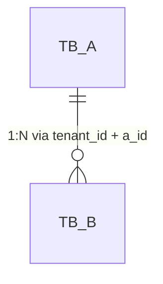
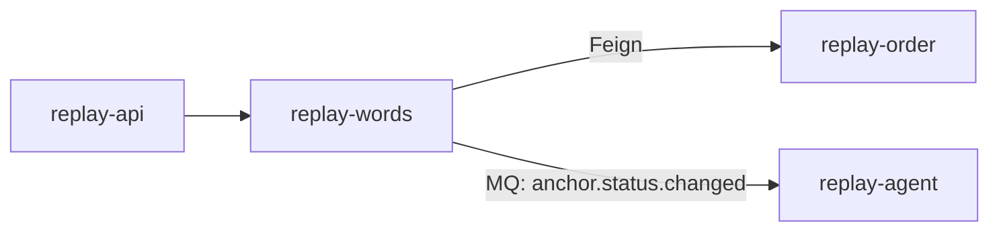

# OpenSpec Schema (Contract Template)

This is the required contract format for Phase 2 (Propose), produced by `@system-architect` and consumed by all downstream phases (Implement / QA / Archive).

Rules:
- The proposal document lives at `<run_dir>/openspec.md` during the run; Archive moves it to `.claude/llm_wiki/archive/YYYYMMDD_<slug>.md`.
- For traceability, after creating it `@system-architect` writes a link + 1–2 line summary into `.claude/llm_wiki/wiki/specs/index.md`.

---

## Two Modes

### Slim Spec (LOW risk only)

When the change is LOW risk, `openspec.md` MAY be downgraded to a Slim Spec to reduce review fatigue and documentation cost.

Hard rules:
- The document MUST include the marker `spec_mode: SLIM`.
- The document MUST contain all sections below.

```markdown
spec_mode: SLIM

# Change Summary
- What changed: one sentence
- Why: one sentence

# Scope of Change
- File/module list (paths only)

# Risk & Rollback
- Why LOW: one sentence
- Rollback steps: one sentence or a short list

# Verification & Evidence
- Local verification: build/test/manual steps you actually ran
- Evidence: logs/snippets/screenshots/links (if any)
```

### Standard Spec (MEDIUM/HIGH risk)

When the change is MEDIUM or HIGH risk, you MUST use the Standard Spec format below. The schema is **trigger-based** — only the core sections are always required; the rest are conditional on the change's actual impact. **Goal: cover what matters, omit what doesn't, never produce ceremonial bloat.**

Hard rules:
- The document MUST include the marker `spec_mode: STANDARD`.
- Sections marked **REQUIRED** must always be present.
- Sections marked **CONDITIONAL** must be present when their trigger fires; otherwise write `## <N>. <Title>\nNot applicable — <one-line reason>` so reviewers can verify the architect considered the dimension.
- HIGH risk: trigger thresholds are tightened (e.g., §5.5 Technical Architecture fires on ANY MQ/cache/transaction/scheduled-task touch, not just "≥2 modules").

---

## Section Trigger Matrix

| Section | LOW | MEDIUM | HIGH | Trigger (must include section if any fires) |
|---|---|---|---|---|
| **§1 Context** | (Slim) | REQUIRED | REQUIRED | Always |
| **§2 Domain Model** | — | CONDITIONAL | CONDITIONAL | New/changed business terms, state machines, enums |
| **§2.5 Business Architecture** | — | CONDITIONAL | REQUIRED if HIGH | Touches ≥2 jiuyu modules; involves upstream/downstream systems; introduces or changes business rules |
| **§3 API Contract** | — | CONDITIONAL | CONDITIONAL | New/changed Controller endpoint OR breaking response schema change |
| **§4 Data Model** | — | CONDITIONAL | CONDITIONAL | DDL (CREATE/ALTER/DROP TABLE/INDEX) OR new persistence shape (MongoDB collection, Redis structure) |
| **§5 Business Logic** | (Slim §3) | REQUIRED | REQUIRED | Always |
| **§5.5 Technical Architecture** | — | CONDITIONAL | REQUIRED if HIGH | Touches: cross-module Feign call, RocketMQ topic, @Scheduled job, Redis cache, distributed lock, transaction boundary spanning ≥2 Service methods |
| **§6 Non-Functional Constraints** | (Slim §3) | REQUIRED | REQUIRED | Always |
| **§6.5 Design Patterns** | — | CONDITIONAL | CONDITIONAL | Introduces or changes a named pattern (Strategy / Template Method / Factory / Chain of Responsibility / Observer / Visitor / State); OR refactors away from a pattern |
| **§7 Acceptance Criteria** | (Slim §4 evidence) | REQUIRED | REQUIRED | Always |
| **§8 Frontend Contract** | — | CONDITIONAL | CONDITIONAL | `frontend-facing: true` in frontmatter |
| **§9 ADRs** | — | — | REQUIRED | HIGH risk: ≥2 Nygard-format ADRs for the chosen approach vs alternatives |

Use the matrix to decide section presence. The body templates follow.

---

## Standard Spec — Section Body Templates

### Frontmatter (top of file)

```markdown
spec_mode: STANDARD
risk: MEDIUM | HIGH
frontend-facing: true | false
module: <module-name>             # required when frontend-facing: true
triggers: [domain, api, data, business-arch, tech-arch, design-pattern, adr]   # which sections the architect activated
```

### §1. Context — REQUIRED

```markdown
## 1. Context
- **Business goal (one sentence):** <…>
- **Scope of change:** modules/packages/key classes touched (objective checklist).
- **Dependencies consulted:** wiki documents read (cite relative paths from explore_report.md `## Wiki Sources Consulted` to avoid duplication).
  - Example: `depends_on: [../wiki/domain/words_domain.md, ../wiki/data/words_data.md]`
- **Explorer hand-off:** `<run_dir>/explore_report.md` (the source AC list and Spec Inference live there; this section only summarizes the delta).
```

### §2. Domain Model — CONDITIONAL

Trigger: new or changed business terms, state machines, enums.

```markdown
## 2. Domain Model
- **New/updated terms:** <term> = <definition> | (or "None")
- **State machines:** Mermaid stateDiagram-v2, OR explicit state-transition table:
    | From | Event | To | Side-effect |
    |---|---|---|---|
- **Enum updates:** new values + their meanings + DB persistence rule.
```

### §2.5 Business Architecture — CONDITIONAL (REQUIRED if HIGH)

Trigger: touches ≥2 jiuyu modules; involves upstream/downstream systems; introduces or changes business rules.

```markdown
## 2.5 Business Architecture

### 2.5.1 Business Flow
Mermaid flowchart or sequence diagram covering the end-to-end business path:
```mermaid
sequenceDiagram
  Actor->>+ModuleA: <event>
  ModuleA->>+ModuleB: <call>
  ModuleB-->>-ModuleA: <result>
  ModuleA-->>-Actor: <response>
```

### 2.5.2 Business Boundary
- **In scope (this module owns):** <responsibilities>
- **Out of scope (other modules own):** <responsibilities + which module>
- **Boundary contract:** how this module communicates with the others (Feign / MQ / shared DB read / shared Redis).

### 2.5.3 Upstream / Downstream
| Direction | System / Module | Touchpoint | What flows |
|---|---|---|---|
| Upstream | <module> | <Feign endpoint or MQ topic> | <data> |
| Downstream | <module> | <Feign endpoint or MQ topic> | <data> |

### 2.5.4 Business Rules (invariants this change preserves or adds)
- Rule 1: <e.g., "主播被冻结后，所有 pending order 自动 cancel">
- Rule 2: <…>
```

### §3. API Contract — CONDITIONAL

Trigger: new or changed Controller endpoint, breaking response schema change.

```markdown
## 3. API Contract (Handoff)
- **Endpoint:** `POST /api/v1/...`
- **Header/Auth:** token required? special headers? tenant header? `@NoRepeatSubmit`?
- **Request:**
  - Field table (name / type / required / validation / semantic):
    | Field | Type | Required | Validation | Meaning |
    |---|---|---|---|---|
    | anchorId | Long | yes | > 0 | 主播ID |
  - JSON example:
    ```json
    { "anchorId": 1234567890 }
    ```
- **Response:**
  - Success schema (full JSON, type-annotated):
    ```json
    {
      "code": 0,
      "msg": "OK",
      "data": { "id": "<Long>", "status": "<Integer>" }
    }
    ```
  - Error schema reference: `../wiki/frontend-api/_error_codes.md`
```

### §4. Data Model — CONDITIONAL

Trigger: DDL or new persistence shape.

```markdown
## 4. Data Model

### 4.1 Tables
- **Table:** `tb_<name>`
- **DDL:**
  ```sql
  CREATE TABLE tb_<name> (
    id BIGINT NOT NULL,
    tenant_id BIGINT NOT NULL,
    -- domain columns
    create_date DATETIME NOT NULL,
    update_date DATETIME NOT NULL,
    is_deleted TINYINT NOT NULL DEFAULT 0,
    PRIMARY KEY (id),
    KEY idx_tenant_<col> (tenant_id, <col>)
  );
  ```

### 4.2 ER Diagram (mandatory when ≥2 tables touched)


### 4.3 Index Reasoning (one row per index)
| Index | Query scenario | Why this shape (leftmost-prefix, selectivity, sort) |
|---|---|---|
| `idx_tenant_anchor_status` | 列租户内某主播某状态视频 | tenant_id + anchor_id 高选择性，status 末位 |

### 4.4 Data Assembly Strategy (anti-JOIN)
- Read path: <e.g. 先查 tb_anchor，再 in-memory map by id 装配 tb_anchor_stat>
- Why anti-JOIN: <selectivity / index loss / sharding readiness>

### 4.5 Lifecycle
- Soft delete: `is_deleted = 1` (manual, no `@TableLogic`)
- Archival: <when, where, or "None">
- Tenant isolation: every read query MUST filter `tenant_id = #{tenantId}`
```

### §5. Business Logic — REQUIRED

```markdown
## 5. Business Logic
### 5.1 Happy path (step-by-step)
1. <step>
2. <step>

### 5.2 Branches & exceptions
| Branch | Trigger | Handling | Returned error code |
|---|---|---|---|
| 权限不足 | tenantId mismatch | throw BusinessException(ResponseCode.AUTH_FAIL) | AUTH_FAIL |

### 5.3 Idempotency / replay safety
- Method: <`@NoRepeatSubmit` / distributed lock / unique constraint>
- Replay window: <seconds / token TTL>
```

### §5.5 Technical Architecture — CONDITIONAL (REQUIRED if HIGH)

Trigger: cross-module Feign call, RocketMQ topic, @Scheduled job, Redis cache, distributed lock, multi-Service transaction boundary.

```markdown
## 5.5 Technical Architecture

### 5.5.1 Module Topology
Mermaid graph showing call direction across jiuyu modules:


### 5.5.2 Cross-Module Communication
| Channel | From → To | Contract | Failure handling |
|---|---|---|---|
| Feign | words → order | `OrderRemoteService#queryByAnchorId` | retry once, then fallback empty list |
| MQ | words → agent | topic `anchor.status.changed`, group `agent-anchor-status-cg` | DLQ after 3 retries |

### 5.5.3 Async Tasks
- Scheduled: `@Scheduled(cron = "0 0 2 * * ?")` in `<class>#<method>` — what it does, idempotency proof.
- MQ consumer: topic / tag / group / max retries / DLQ topic.

### 5.5.4 Cache Strategy (if Redis touched)
- Key pattern: `replay:words:anchor:{tenantId}:{anchorId}`
- TTL: <seconds>
- Eviction trigger: <write-through / delete-on-update / TTL only>
- Consistency: <strong / eventual + max-staleness>

### 5.5.5 Transaction Boundary
- `@Transactional(rollbackFor = Exception.class)` declared on: `<ServiceImpl>#<method>`
- Spans: <which dao calls fall inside>
- Compensation if partial failure: <e.g., MQ-driven retry / manual ops queue / none>

### 5.5.6 Observability
- Log keys: tenantId, anchorId, traceId
- Metric / monitor: <prometheus counter / Skywalking span> (or "rely on standard request log")
- Alert: <threshold + channel> (or "None")
```

### §6. Non-Functional Constraints — REQUIRED

```markdown
## 6. Non-Functional Constraints (Hard Constraints)
- **Security / permissions:** <e.g., 必须校验 tenantId 与当前用户匹配>
- **Concurrency / idempotency:** <e.g., distributed lock on anchorId>
- **Forbidden patterns (DO NOT):**
  - DO NOT use @Autowired (use constructor injection or @Resource — see CLAUDE.md §5)
  - DO NOT use @TableLogic (manual `isDeleted` flip)
  - DO NOT call cross-module Dao directly (use Feign from replay-generic)
- **Partial-failure rollback:** <steps>
- **Performance budget (if applicable):** P95 < <ms>, list size cap < <N>, IN-clause partition every 500
```

### §6.5 Design Patterns — CONDITIONAL

Trigger: introduces or changes a named pattern, or refactors away from one.

```markdown
## 6.5 Design Patterns

| Pattern | Where applied | Why chosen | Alternative rejected | Why rejected |
|---|---|---|---|---|
| Strategy | `AnchorAnalyzer` per `analysis_type` | extensible without if-else; aligns with existing `WordRule` strategy | giant if/else chain | adds branches per type, fails open-closed |
| Template Method | `BaseEventConsumer` | shared lifecycle (lock → dedupe → handle → ack), subclass owns `handle()` | each consumer reimplements lifecycle | duplication + lock-skip risk |

Anti-patterns explicitly avoided:
- ❌ <e.g., "service-locator lookup in Service constructor">
```

### §7. Acceptance Criteria — REQUIRED

```markdown
## 7. Acceptance Criteria (Testing)
- **Happy path:** Given / When / Then — copy verbatim from `explore_report.md`, do NOT re-author.
- **Edge cases:** invalid params, concurrency, permission denied, empty data, partial failure (timeout / DLQ).
- **Unit test requirements:** key branches and asserts (one row per AC).
  | AC-id | Method under test | Assertion |
  |---|---|---|
  | AC-001 | `AnchorService#updateBase` | returns R<Boolean>.ok(true), DB row updated |
```

### §8. Frontend Contract Publishing — CONDITIONAL

Trigger: `frontend-facing: true` in frontmatter.

```markdown
## 8. Frontend Contract Publishing
- `frontend-facing: true | false`
- `module: <module-name>`

When `true`:
- Phase 4 **before** Implement: dispatch `@frontend-api-doc-writer` (mode: forward).
- Agent reads §3 (API Contract) + §4 (Data Model) + §7 (AC examples) → produces `.claude/llm_wiki/wiki/frontend-api/<module>.md`.
- §3 / §4 字段必须完整（类型 / 必填 / 校验 / 语义说明），否则 agent 返回 PARTIAL，由 `@system-architect` 补完再 dispatch.
- Do NOT inline `R<T>` wrapper — agent auto-references `wiki/frontend-api/_response_envelope.md` + `_error_codes.md`.
- Phase 6 Archive: run mode: reverse for field-drift check.

When `false`:
- Skip front-end contract publishing (internal scheduled jobs / refactors / data migration / backend-only).
- Phase 6 Archive changelog: mark "frontend-facing: false".
```

### §9. ADRs — REQUIRED for HIGH risk

Format: Michael Nygard's ADR template, adapted. Embedded **inline** in openspec.md (one `### ADR-N` block per decision). At Archive phase, `@architecture-curator` extracts these into `.claude/llm_wiki/wiki/architecture/adrs/NNNN-<slug>.md` and updates `wiki/architecture/adrs/index.md`. Do NOT pre-create separate ADR files during Propose — keep them in openspec until archive.

For each major decision (≥2 alternatives compared):

```markdown
## 9. Architecture Decision Records

### ADR-1: <Decision title — verb + object, e.g., "Use RocketMQ delayed-message for retry instead of @Scheduled polling">

**Status:** proposed
**Date:** YYYY-MM-DD
**Deciders:** <names or roles>

#### Context
<2–5 sentences: what problem prompted this decision, what constraints (latency, deployment, team skill), what forces are at play>

#### Decision
<1–3 sentences: the change being proposed, stated affirmatively>

#### Alternatives Considered

**Alternative A: <name>**
- Pros: <…>
- Cons: <…>
- Failure conditions: <when this option breaks>
- Estimated complexity: S / M / L
- Why not chosen: <specific reason>

**Alternative B: <name>**
- Pros: <…>
- Cons: <…>
- Failure conditions: <…>
- Estimated complexity: S / M / L
- Why not chosen: <specific reason>

(MUST include ≥2 alternatives. Each must be genuinely different — not "same thing with different library".)

#### Consequences

**Positive**
- <benefit 1>
- <benefit 2>

**Negative**
- <trade-off 1>
- <trade-off 2>

**Risks (and mitigation)**
- Risk: <…> → Mitigation: <…>

#### Archive target
`.claude/llm_wiki/wiki/architecture/adrs/NNNN-<slug>.md` (assigned by `@architecture-curator` at Archive phase based on next available number; see `wiki/architecture/adrs/index.md`)

### ADR-2: <…next decision…>
```

### Human Section (Chinese — for approval)

Appended at the bottom of openspec.md after the machine sections.

```markdown
## 做什么 / 为什么
**现状：** <business-language>
**需要：** <required behavior>
**范围：** <one-line scope summary>

## 怎么做
<selected approach + rationale. HIGH risk: link to §9 ADR table>

## 需要你确认的  ← HIGH risk only
- [ ] <decision question for human>
- [ ] <ADR-1 chosen over alternatives — confirm or push back>
```
