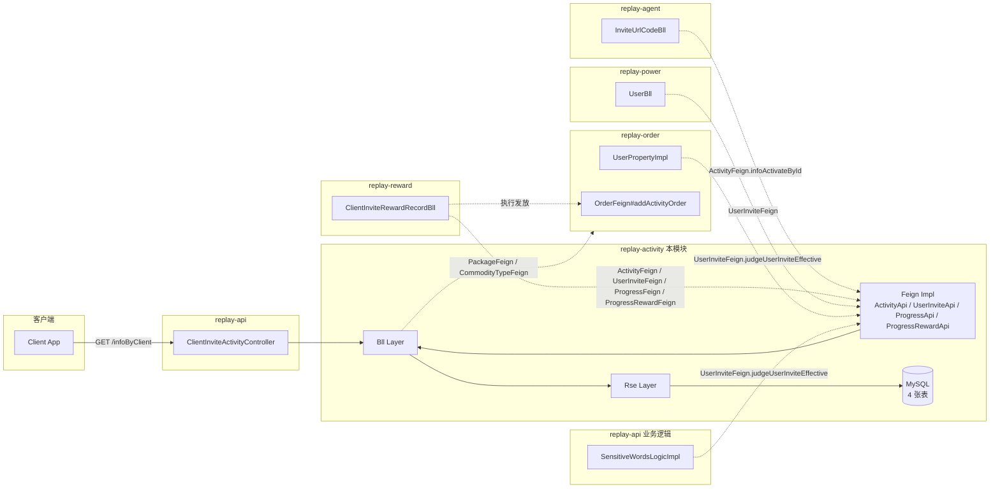

<!-- module: activity -->
<!-- area: architecture -->
<!-- generated-by: reverse-scan -->
<!-- last-scan: 2026-05-20 -->
<!-- source-paths: replay-activity/ -->

# Activity Architecture — 架构决策与设计

> replay-activity 是邀请奖励链路的**配置中枢与判定中枢**：定义"活动 / 进度 / 奖励规则"，记录"用户邀请关系"，但不计算、不发放奖励。

---

## 一、模块定位

```
┌─────────────────────────────────────────────────────────────┐
│  replay-api (HTTP 入口)                                       │
│   ClientInviteActivityController (后台管理 + 客户端拉取)         │
├─────────────────────────────────────────────────────────────┤
│  replay-activity (本模块)                                      │
│   bll/   — 业务编排 + 事务边界                                  │
│   rse/   — Repository Service (持久层适配)                     │
│   api/   — Feign 接口实现（同 JVM 跨模块调用）                  │
│   repository/service+dao — MyBatis-Plus 基础 CRUD              │
│   entity/ — 4 张表实体                                         │
│   constant/ActivityProperties — 默认活动 ID 配置注入            │
├─────────────────────────────────────────────────────────────┤
│  replay-common / replay-generic                              │
│   SnowflakeManager, PageUtils, Query, R<T>, BeanConvertUtils │
└─────────────────────────────────────────────────────────────┘
```

**分层（历史遗留 Bll/Rse 命名）：**
- `Controller` → `Bll` → `Rse(Impl)` → `repository.service` / `repository.dao`
- `Bll` 持有 `@Transactional` 边界；`Rse` 是无事务的持久化协作层；`api/*Api` 类实现跨模块 Feign 契约（同 JVM 直调本模块 Bll）

> `Bll / Rse / Producer` 是 jiuyu 老代码的遗留命名（words/order/agent/activity）。
> CLAUDE.md §4 明确：**新代码默认走 Controller→Service→Mapper 三层**，不要扩散 Bll/Rse。

---

## 二、模块拓扑（与上下游交互）



**关键事实：**
- replay-activity **只 export 4 个 Feign**，不 import 其他模块的 Feign（除了 `infoByClient` 富化时调用 `PackageFeign` / `CommodityTypeFeign`，走的是 replay-order 的 Feign）
- replay-reward 是 activity 的**最大消费者**（4 个 Feign 都用上了）
- replay-agent 通过 ActivityFeign 拿当前激活活动，决定能否生成邀请链接
- replay-power / replay-order / replay-api 通过 UserInviteFeign 做用户邀请关系判定

---

## 三、关键调用链

### 链路 1 — 客户端展示当前邀请活动

```
GET /replay/activity/clientinviteactivity/infoByClient
 → Controller#infoByClient
 → Bll#infoByClient
   ├ activityProperties.clientDefaultInviteActivityId
   ├ ClientInviteActivityRse#infoByActivate(id)              ← 三条件激活态判定
   ├ ClientInviteProgressRse#getInviteProgressAndReward(id, 1) ← 仅邀请人进度，已绑 rewardList
   ├ commodityTypeFeign.listAll() (replay-order)            ← 富化增量包名称/单位
   ├ packageFeign.listAll(1) (replay-order)                 ← 富化版本名称/价格/时长
   └ in-memory join → ClientInviteActivityInfoVo
 → R.ok(infoVo)
```

### 链路 2 — 后台新增 / 修改邀请活动

```
POST /save 或 /update
 → Controller → Bll#save 或 #update（@Transactional）
   ├ ClientInviteActivityRse#save / #update (主体)
   ├ [update only] ClientInviteActivityRse#disableOld(activityId)  ← 旧 progress 全置 status=0
   └ ClientInviteActivityRse#saveBatch(progressBoList)             ← 重新批量插入
       ├ 每个 ProgressEntity 雪花 ID + 时间戳 + status=1
       └ 每个 RewardEntity 雪花 ID + 时间戳 + 互斥字段清洗
```

### 链路 3 — 跨模块奖励发放（reward 主导，调用 activity 4 个 Feign）

```
[MQ] UserInviteMqDto → replay-reward.ClientInviteRewardRecordBll#giveUserInviteAward
  ├ activity.UserInviteFeign#judgeUserInviteEffective       ← 闸门
  ├ activity.ActivityFeign#infoActivateById(null)           ← 当前激活活动
  ├ activity.ClientInviteProgressFeign#listClientInviteProgressByActivityIdAndInviteProgressType(activityId, 1) ← 邀请人阶梯
  ├ activity.ClientInviteProgressRewardFeign#listByProgressIds(progressIds)                                    ← 邀请人奖励规则
  ├ activity.ClientInviteProgressFeign#listClientInviteProgressByActivityIdAndInviteProgressType(activityId, 0) ← 被邀请人阶梯
  ├ activity.ClientInviteProgressRewardFeign#listByProgressIds(passiveProgressIds)                             ← 被邀请人奖励规则
  ├ reward 落 tb_client_invite_reward_record
  ├ order.OrderFeign#addActivityOrder(detailDtos)           ← 执行发放（活动订单）
  └ reward 更新 reward_status = 已发放
```

---

## 四、跨模块通讯

### Feign 接口（本模块 export）

| 接口 | 调用方 | 用途 |
|---|---|---|
| `ActivityFeign` | replay-agent, replay-reward | 取激活态活动 |
| `UserInviteFeign` | replay-power, replay-order, replay-reward, replay-api(words) | 用户邀请关系判定 + 计数 |
| `ClientInviteProgressFeign` | replay-reward | 拉进度阶梯 |
| `ClientInviteProgressRewardFeign` | replay-reward | 拉奖励规则 |

### Feign 接口（本模块 import）

| 接口 | 来源模块 | 用途 |
|---|---|---|
| `PackageFeign` | replay-order | 客户端展示富化套餐信息 |
| `CommodityTypeFeign` | replay-order | 客户端展示富化增量包信息 |

### MQ / Scheduled / Cache

- **无 `@Scheduled`** — 本模块**无定时任务**。活动到期不主动归档；通过 `infoByActivate` 的"时间窗口判定"按需过滤。
- **无 RocketMQ producer/consumer** — 本模块**不发不收 MQ**。奖励发放的 MQ 触发点（`UserInviteMqDto`）在 reward 模块。
- **无 Redis** — 本模块**未直接使用 Redis 缓存**。邀请关系 / 进度计数全走 MySQL 实时查询。

---

## 五、事务边界

唯一带 `@Transactional(rollbackFor = Exception.class)` 的方法（均在 `Bll` 层）：

| 方法 | 边界 |
|---|---|
| `ClientInviteActivityBll#save` | 活动主体 + 阶梯 + 奖励规则（级联保存） |
| `ClientInviteActivityBll#update` | 活动主体 + disableOld + 新阶梯批量保存 |
| `ClientInviteRewardRecordBll#giveUserInviteAward` | （在 reward 模块）发放事务 |

**风险点：** Bll 层在 `@Transactional` 内调用了 `PackageFeign` / `CommodityTypeFeign`（仅 `infoByClient`，该方法不带 `@Transactional`，所以暂无问题）。**若未来给查询型方法加事务，需注意跨模块 Feign 在事务中可能放大调用延迟。**

---

## 六、关键技术约束

| 约束 | 说明 |
|---|---|
| ID 生成 | 全部走 `SnowflakeManager.nextValue()`，`@TableId(IdType.INPUT)` |
| 审计字段 | `create_date` / `update_date` 手动 `new Date()`（部分 Rse 用 `LocalDateTime.now()`） |
| 软删除 | **未启用** — 4 张表都有 `is_deleted` 字段但代码物理删除（与 jiuyu §5 软删约定不符） |
| 租户隔离 | **不适用** — 4 张表均无 `tenant_id`，平台级配置 |
| 列表查询 | 使用 `LambdaQueryWrapper`（推荐）+ `QueryWrapper` 混合，部分 keyword like 列名疑似错对齐 |
| Bean 拷贝 | `org.springframework.beans.BeanUtils.copyProperties` + `BeanConvertUtils.convert(List)` |
| 跨模块通讯 | **Feign-only**，不跨模块直连 Dao |
| 缓存 | 无 Redis 缓存 |
| 异步 | 无 MQ / `@Async` / `@Scheduled` |

---

## 七、ADR 列表

### ADR-ACT-001: 活动配置与奖励发放职责分离

**决策**: replay-activity 只持有"活动定义 / 阶梯 / 奖励规则 / 邀请关系"，不计算和发放奖励；奖励发放编排归 `replay-reward`，执行下单归 `replay-order`。
**原因**:
- 活动定义是低频写、高频读的配置数据，与奖励发放的高频写、有事务的流水数据生命周期不同。
- 把"规则"和"流水"分模块，避免单表混杂导致索引退化。
- replay-reward 可以扩展支持多种奖励来源（不止邀请活动），与 activity 解耦。

### ADR-ACT-002: 进度阶梯使用"软停用"而非版本号

**决策**: 修改活动时不删除旧 progress，仅置 `invite_progress_status=0`，新阶梯重新写入。
**原因**:
- reward 模块已落库的 `tb_client_invite_reward_record.progress_id` 仍能解析到原阶梯，保留历史可追溯性。
- 避免做 progress 表版本号设计，减少建模复杂度。
**代价**: progress 表会单调增长，运维需定期清理已停用且无 reward 记录引用的旧 progress。

### ADR-ACT-003: 平台单活动模型 — 客户端只看默认活动

**决策**: 客户端 `infoByClient` 强制取 `activity.client-default-invite-activity-id`，不支持"按用户选活动"。
**原因**:
- 当前业务场景：平台同时只跑一个邀请活动，没有 A/B 试验或多活动并存需求。
- 简化客户端 API：无需传 activityId 参数。
**代价**: 切换活动需要改配置 + 重启（配置项注入，非热加载）。

### ADR-ACT-004: 用户邀请奖励链路严格限定 `invite_type=2`

**决策**: `judgeUserInviteEffective` 和 `getInviteUserNumberByInviteUserId` 都硬编码 `invite_type=2`（用户链接）。
**原因**:
- 代理商链接（type=0）和销售链接（type=3）的奖励走代理商佣金体系（replay-agent），与用户邀请奖励是**两条独立链路**。
- 避免奖励双发或链路错配。
**代价**: 新加邀请类型需同步更新两个查询条件。

### ADR-ACT-005: Feign 接口跨模块通讯，禁止直连 Dao

**决策**: replay-reward / replay-power / replay-agent 等模块通过 `*Feign` 接口访问 activity 数据，不能直接 import `*Dao` 或 `*Service`。
**原因**: 符合 jiuyu 全局架构原则（CLAUDE.md §4），保持模块边界清晰。

### ADR-ACT-006: 奖励类型互斥由应用层 saveBatch 强制

**决策**: `reward_type=0` 时清空 commodity 字段；`reward_type=1` 时清空 package 字段。在 `Rse#saveBatch` 中强制执行。
**原因**:
- 数据库未做 CHECK 约束（MySQL 5.7 之前不支持 CHECK 生效；当前项目按宽容型表结构设计）。
- 应用层清洗保证数据一致性，避免脏数据流入 reward 模块。

---

## 八、设计模式应用

| 模式 | 位置 | 用途 |
|---|---|---|
| Repository / DAO | `repository.dao` + `repository.service` | MyBatis-Plus 基础 CRUD 封装 |
| Facade | `bll` 层 | 屏蔽 rse 实现细节，对 Controller 暴露业务方法 |
| Adapter | `api/*Api` | 把 `Bll` 的内部 BO 适配成 Feign 契约的 DTO/VO |
| In-memory join | `Bll#infoByClient` | 反 JOIN：先拉 progress + reward，再批量拉 package/commodity，内存装配 |

---

## 九、与 CRM 模块的对比（参考 `crm_architecture.md`）

| 维度 | replay-activity | CRM (replay-power 扩展) |
|---|---|---|
| 是否独立模块 | 是（`replay-activity`） | 否（寄生在 `replay-power`） |
| 是否有 tenant_id | 否 | 是（CRM 客户主体 `tb_user` 有 tenantId） |
| 是否有 API Key 鉴权 | 否（同 JVM Feign） | 是（`@APIKey` + 拦截器，对外暴露 `/internal/crm/**`） |
| 主要消费方 | replay-reward | SalesCoach Agent（外部系统） |
| 数据出站方式 | 同 JVM Feign | HTTP POST + Spring Event |

---

## 十、健康监测建议

- 活动到期未切换的告警（运维）：可加 `tb_client_invite_activity` 中 `activity_status=1` 且 `activity_end_time < now() - INTERVAL 1 DAY` 的定时巡检脚本。
- `tb_user_invite` 增长曲线监控：作为邀请活动健康度指标。
- reward 模块发放失败率：折射 activity 配置的健康度（如规则字段缺失会让 reward 报空指针）。
