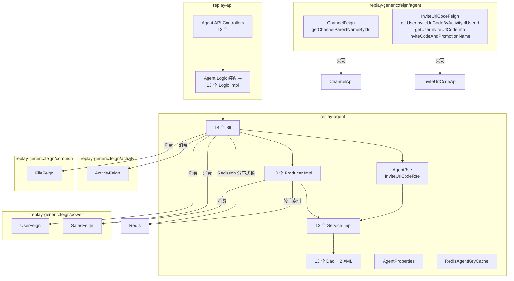

<!-- module: agent -->
<!-- area: architecture -->
<!-- generated-by: reverse-scan -->
<!-- last-scan: 2026-05-20 -->
<!-- source-paths: replay-agent/src/main/java/com/jiuyu/replay/agent/ -->

# Agent Architecture -- 架构决策与设计

> replay-agent 模块的架构基线、设计决策与关键技术约束。该模块承载**代理商 / 渠道 / 销售 / 佣金 / 邀请活动**全链路业务。

---

## 一、模块定位

replay-agent 承载平台**代理商生态**的核心能力：

- **代理商**: 代理商 CRUD / 状态管理 / 普通代理商（agentType=0）与渠道代理商（agentType=1）双类型 / 运营人员绑定
- **渠道**: 树形渠道管理（parentId 自引用）/ 渠道-代理商关联
- **销售**: 代理商销售 / 平台销售 / 销售-推广渠道关联 / 轮询分配
- **佣金**: 新签佣金 / 续费佣金 / 分佣计算 / 佣金结算记录
- **邀请链接**: 邀请码生成（10 位随机字母数字混合）/ code 类型（0=代理商 1=推广渠道 2=用户 3=销售）/ 分布式锁防并发
- **邀请活动**: 活动配置 / 进度里程碑 / 进度奖励 / 奖励记录 / 奖励明细

---

## 二、分层架构

```
┌────────────────────────────────────────────────────────────┐
│  API Controller (replay-api)                               │
│  - 13 个 Logic Interface + Impl 装配层                      │
│  - replay-api/controller/agent/  (13 controllers)          │
│  - 模块内 controller (replay-agent): AgentSaleController    │
│    + InviteUrlController (2 个)                             │
├────────────────────────────────────────────────────────────┤
│  Logic (replay-api/logic/agent/)                           │
│  - 13 个 Logic Interface + 13 个 Impl                      │
│  - 薄装配层，直调 Bll                                      │
├────────────────────────────────────────────────────────────┤
│  Bll (@Component) -- 14 个                                 │
│  - 参数校验 / 组合 Producer / Feign 调用                    │
│  - AgentBll / AgentSaleBll / AgentCommissionBll /          │
│    AgentPlatformSaleBll / AgentPromotionBll / ChannelBll / │
│    AgentSalePromotionChannelBll / InviteUrlCodeBll /       │
│    ClientInviteActivityBll / ClientInviteProgressBll /     │
│    ClientInviteProgressRewardBll /                          │
│    ClientInviteRewardRecordBll /                            │
│    ClientInviteRewardRecordDetailBll                        │
│  - 注意: 后 4 个 (ClientInvite*) Bll @Component 被注释，    │
│    当前未被 Spring 管理                                     │
├────────────────────────────────────────────────────────────┤
│  Producer (13 接口 + 13 实现) -- @Service                  │
│  - 完整 CRUD + @Transactional(rollbackFor = Exception.class)│
│  - Entity ↔ VO/BO 转换，雪花 ID 生成                        │
│  - AgentPlatformSaleProducerImpl 使用 Redis 轮询索引        │
│  - AgentCommissionProducerImpl 实现分佣计算逻辑             │
├────────────────────────┬────────────────────────────────────┤
│  Service (13 对)       │  Rse (Feign 提供方 + 数据查询)     │
│  IService<Entity>      │  AgentRse → AgentInfoVo            │
│  extends ServiceImpl   │  InviteUrlCodeRse → code 生成/查询 │
│  + 复杂 SQL (XML)      │                                    │
├────────────────────────┴────────────────────────────────────┤
│  Dao (BaseMapper<Entity>) -- 13 个                          │
│  + 2 个 XML Mapper (AgentPlatformSaleMapper.xml,            │
│    InviteUrlCodeMapper.xml)                                 │
└────────────────────────────────────────────────────────────┘
```

### 历史分层说明（Bll / Producer / Rse 三层）

agent 模块沿用与 words / order / power 相同的历史分层。**本项目不再 push 新代码使用此分层**（CLAUDE.md §4），新模块/新业务默认 `Controller → Service → Mapper` 三层。读懂存量代码时遵循即可。

### 层级职责（存量约定）

| 层 | 允许操作 | 禁止操作 |
|----|----------|----------|
| Logic (replay-api) | 参数二次校验、调 Bll、返回 R\<T\> | 直接调 Producer / Dao |
| Bll | 组合 Producer 调用、Feign 交互、参数校验、`@Transactional` | 直接操作 Entity |
| Producer | 完整 CRUD、`@Transactional`、Entity↔VO 转换、雪花 ID 生成 | 跨模块调用（必须通过 Feign） |
| Rse | 复杂查询组合、跨表联查、code 生成 | 跨模块调用 |
| Service | MyBatis-Plus 基础 CRUD / 自定义 XML | 业务逻辑 |
| Dao | 单表 CRUD + 复杂 SQL（XML） | 业务装配 |

---

## 三、实体概览（13 张表）

| Entity | 表名 | 核心字段 |
|--------|------|---------|
| `AgentEntity` | `tb_agent` | id, agentName, parentId, agentType(0=普通/1=渠道), channelId, operationUserId, contactName, contactPhone, commissionRate, renewalCommissionRate, agentStatus, employeeStatus, tradeId, userId, agentUrlCode, btnBgColor, btContent, posterImgIds |
| `ChannelEntity` | `tb_channel` | id, parentId, channelName, channelLogo, sort |
| `AgentSaleEntity` | `tb_agent_sale` | id, agentId, saleName, phone, saleUrlCode |
| `AgentSalePromotionChannelEntity` | `tb_agent_sale_promotion_channel` | id, agentId, agentSaleId, promotionChannelId, saleUrlCode |
| `AgentPlatformSaleEntity` | `tb_agent_platform_sale` | id, agentId, saleId, channelQrcodeImgId |
| `AgentPromotionEntity` | `tb_agent_promotion` | id, agentId, promotionName, commissionRate, renewalCommissionRate, promotionStatus, btnBgColor, btContent, posterImgIds, promotionUrlCode |
| `InviteUrlCodeEntity` | `tb_invite_url_code` | id, urlCode(10位随机), agentId, promotionId, agentSaleId, userId, subUserId, activityId, tenantId, codeType(0=代理商/1=推广渠道/2=用户/3=销售) |
| `AgentCommissionEntity` | `tb_agent_commission` | id, agentId, promotionId, agentSaleId, orderId, userId, orderTotalMoney, commission, commissionMoney, commissionType(0=新签/1=续费), commissionMode, commissionTime, remarks |
| `ClientInviteActivityEntity` | `tb_client_invite_activity` | id, agentId, activityName, activityStatus, startDate, endDate |
| `ClientInviteProgressEntity` | `tb_client_invite_progress` | id, inviteActivityId, progressType, targetNum, rewardType |
| `ClientInviteProgressRewardEntity` | `tb_client_invite_progress_reward` | id, inviteProgressId, rewardName, rewardValue |
| `ClientInviteRewardRecordEntity` | `tb_client_invite_reward_record` | id, userId, inviteActivityId, progressId, rewardType, rewardName, rewardValue, status |
| `ClientInviteRewardRecordDetailEntity` | `tb_client_invite_reward_record_detail` | id, rewardRecordId, userId, inviteProgressId, rewardName, rewardValue |

---

## 四、模块拓扑（Mermaid）



---

## 五、跨模块通信

### 1. Feign 接口（agent 暴露 → 其他模块消费）

定义在 `replay-generic/src/main/java/com/jiuyu/replay/generic/feign/agent/`，实现在 `replay-agent/api/`：

| Feign 接口 | 实现类 | 方法数 | 主要消费方 |
|------------|--------|--------|-----------|
| `ChannelFeign` | `ChannelApi` | 1 | power / order |
| `InviteUrlCodeFeign` | `InviteUrlCodeApi` | 3 | reward / activity / power |

#### `ChannelFeign` 方法

| 方法 | 用途 |
|------|------|
| `getChannelParentNameByIds(List<Long> channelIds)` | 根据渠道 ID 集合获取渠道父级名称映射 Map\<Long, String\> |

- 消费方: `power/UserBll`（用户详情装配渠道名）、`order/InvitationCodeBatchBll`（邀请码批次）

#### `InviteUrlCodeFeign` 方法

| 方法 | 用途 |
|------|------|
| `getUserInviteUrlCodeByActivityIdUserId(activityId, userId)` | 获取用户在某活动下的邀请码信息 |
| `getUserInviteUrlCodeInfo()` | 获取当前登录用户的邀请链接信息（含海报/按钮样式） |
| `inviteCodeAndPromotionName(List<String> inviteUrlCodes)` | 批量获取邀请码对应的推广渠道名称 |

- 消费方: `reward/ClientInviteRewardRecordBll`（奖励记录关联邀请码）

### 2. Feign 反向依赖（agent 消费其他模块）

| 调用方向 | Feign / Service | 用途 |
|----------|-----------------|------|
| agent → power | `UserFeign` | 获取当前用户 / 按手机号查用户 / 创建/更新代理商后台用户 / 修改用户状态 / 父子账号 |
| agent → power | `SalesFeign` | 按 ID 查销售 / 代理商销售列表 / 排除不轮询销售 / 修改代理商下所有销售状态 |
| agent → activity | `ActivityFeign` | 获取当前启用的邀请活动信息（InviteUrlCodeBll 生成邀请链接时） |
| agent → common | `FileFeign` | 文件信息查询（二维码图片等） |
| agent → common | `SystemKvService` (common 直注入) | 系统配置（代理商用户角色 ID `agent_user_role_id`、续费间隔 `new_renewal_interval`、断约天数 `break_agreement_num`） |
| agent → common | `FileProducer` (common 直注入) | 海报图片列表批量查询 |

### 3. MQ 通信

**agent 模块当前未发现任何 RocketMQ 生产者或消费者。** 所有业务操作均为同步调用。

### 4. 共享 Service 调用（同 JVM Spring 直注入）

agent 模块的 Bll/Producer 中通过构造器注入 / `@Resource` 调用 common 模块：
- `FileProducer` -- 文件/图片查询
- `SystemKvService` -- 系统 KV 配置（角色 ID、续费参数）
- `SnowflakeManager` -- 雪花 ID 生成
- `RRException` / `BeanConvertUtils` -- 工具类

---

## 六、定时任务 / 异步任务

**agent 模块当前未发现任何 `@XxlJob`、`@Scheduled` 或 `@RocketMQMessageListener`。** 无定时任务，无异步消费。

所有业务操作均为同步请求-响应模式。

---

## 七、缓存策略（Redis）

### Redis Key 定义

| Key 前缀 | 用途 | TTL |
|----------|------|-----|
| `replay:agent:sale:index:{agentId}` | 代理商平台销售轮询索引计数器 | 30 天（首次 set 时，超过 10000 重置为 1） |

定义在 `RedisAgentKeyCache` 类中，仅有上述 1 个 key。

### 轮询索引机制（AgentPlatformSaleProducerImpl.getPollingSaleId）

```
getSaleIndex(agentId):
  INCR replay:agent:sale:index:{agentId}
  首次 → EXPIRE 30天
  index > 10000 → SET 1 + EXPIRE 30天
  return index - 1

getSaleList(agentId):
  优先级顺序（fallthrough chain）:
  1. 代理商设置的代理商销售 (salesType=AGENT)
  2. 通过 SalesFeign 查询系统创建的代理商销售 (salesType=AGENT, userPolling=1)
  3. 代理商设置的平台销售 (salesType=ADMIN)
  4. 通过 SalesFeign 查询系统创建的通用平台销售 (salesType=ADMIN, userPolling=1)

polling: saleList.get(index % saleList.size()).saleId
```

### 已注释的 Redis 缓存逻辑

代码中存在已注释的 Redis 列表缓存逻辑（`getSaleList` 方法末尾），原本设计用 `replay:agent:sale:list:{agentId}` 缓存销售列表 5 分钟，当前已被注释，改为每次实时查询。

---

## 八、分布式锁

### Redisson

| 使用点 | Key 模式 | 用途 |
|--------|---------|------|
| `InviteUrlCodeBll.getUserInviteUrlCodeInfo()` | `LockKeyPrefix.USER.getLockKey("inviteUrlCode:" + userId)` | 防止同一用户并发生成多个邀请链接 |
| `AgentPlatformSaleBll.save()` | `@CustomRedissonLock(key = "'replay:lock:agentPlatformSaleAdd'")` | 防止并发添加平台销售时重复 |

- `InviteUrlCodeBll` 手动 `redissonClient.getLock()` + `lock.tryLock()` / `finally lock.unlock()`
- `AgentPlatformSaleBll` 使用 common 模块的 `@CustomRedissonLock` 声明式注解

---

## 九、事务边界

事务声明在 **Bll 层**（非 Producer），这是 agent 模块与 power 模块的显著差异：

| 方法 | 所在类 | 事务范围 |
|------|--------|----------|
| `save(AgentBo)` | `AgentBll` | 新增代理商 + 创建后台用户(UserFeign) + 生成邀请码 + 保存代理商实体 |
| `update(AgentBo)` | `AgentBll` | 更新代理商 + 更新后台用户(UserFeign) |
| `save(AgentSaleBo)` | `AgentSaleBll` | 创建销售 + 批量创建销售-渠道关联 + 批量生成邀请码 |
| `update(AgentSaleBo)` | `AgentSaleBll` | 删旧渠道关联 + 删旧邀请码 + 更新销售 + 重建渠道关联 + 重建邀请码 |
| `save(AgentPromotionBo)` | `AgentPromotionBll` | 创建推广渠道 + 生成邀请码 |
| `save(ClientInviteActivityBo)` | `ClientInviteActivityBll` | 创建活动 + 批量创建进度里程碑 |
| `update(ClientInviteActivityBo)` | `ClientInviteActivityBll` | 更新活动 + 停用旧进度 + 批量创建新进度 |
| `setInviteProgressAndReward(...)` | `ClientInviteProgressBll` | 设置进度和奖励（方法体内已注释，当前 no-op） |

> 注意: Producer 层的 `AgentCommissionProducerImpl.commissionAllocation()` 没有 `@Transactional`，分佣逻辑在一个方法内完成（查邀请码 → 查代理商 → 查推广渠道 → 计算佣金 → 保存佣金记录），无显式事务。

---

## 十、关键设计模式

| 模式 | 在 agent 模块的应用 |
|------|-------------------|
| **Façade** | `ChannelApi` / `InviteUrlCodeApi` 作为 Feign 接口实现，封装内部 Bll/Rse/Producer 复杂度 |
| **Strategy (fallthrough chain)** | `AgentPlatformSaleProducerImpl.getSaleList()` 四级优先级 fallthrough：代理商销售 → 系统代理销售 → 平台销售 → 系统平台销售 |
| **Template Method** | Producer 接口 + Impl 对（13 对），约定 `save/update/delete/info/queryPage` 模板方法 |
| **Builder / Factory** | `InviteUrlCodeRseImpl.createUrlCode()` 随机码生成 + 唯一性 while-loop 校验 |
| **Distributed Lock (Redisson)** | 手动 `RLock` + 声明式 `@CustomRedissonLock`，防止并发重复生成邀请码 / 重复添加平台销售 |
| **Round-Robin Polling** | Redis INCR 计数器 + 取模，实现平台销售轮询分配（超过 10000 重置） |
| **Lazy Cache-Aside (部分注释)** | 销售列表原本缓存在 Redis 5 分钟，现已注释禁用以实时查询为准 |

避开的反模式：
- 不在 Controller / Logic 层加 `@Transactional`（事务在 Bll）
- 跨模块调用统一走 Feign，不直连 Dao
- 不适用 `@TableLogic`（手动 isDeleted）
- 不在 Producer 内调用跨模块 Feign（AgentPlatformSaleProducerImpl 中存在 SalesFeign 调用 -- 历史遗留非严格隔离，新代码避免）

---

## 十一、关键约束（投影自 CLAUDE.md §5）

- **DI**: 新代码使用构造器注入；存量代码仍大量使用 `@Resource`（`AgentCommissionProducerImpl` 使用 `@RequiredArgsConstructor`）
- **R\<T\>**: Controller 必须返回 `R<T>`，禁裸返业务对象
- **Snowflake ID**: 所有新增实体走 `SnowflakeManager.nextValue()` + `@TableId(type=IdType.INPUT)`
- **软删除**: 手动 `isDeleted`，禁 `@TableLogic`
- **时间戳**: `new Date()` 显式赋值 `createDate` / `updateDate`
- **租户隔离**: `InviteUrlCodeEntity` 中 `tenantId` 字段用于用户邀请码隔离；`InviteUrlCodeRseImpl.infoByCondition` 支持 `tenantId` 过滤
- **事务**: 所有写方法 `@Transactional(rollbackFor = Exception.class)`，agent 模块中事务在 Bll 层
- **分页**: 统一使用 `PageUtils<T>` 包装 `IPage`
- **Bean 拷贝**: Spring `BeanUtils.copyProperties` 或 Hutool `BeanUtil.copyProperties`（两者混用）

---

## 十二、未涵盖 / 待补充

- `<待补充>` `AgentPlatformSaleMapper.xml` / `InviteUrlCodeMapper.xml` 中自定义 SQL 的索引依赖分析
- `<待补充>` `ClientInviteActivityBll` / `ClientInviteProgressBll` / `ClientInviteProgressRewardBll` / `ClientInviteRewardRecordBll` / `ClientInviteRewardRecordDetailBll` 的 `@Component` 被注释，疑似废弃或迁移中，需确认是否清理
- `<待补充>` `AgentCommissionProducerImpl.commissionAllocation` 无事务保护，存在分佣计算与入库非原子的风险
- `<待补充>` 分佣比例配置（`commissionRate`/`renewalCommissionRate`）目前仅支持代理商级和推广渠道级，是否需要支持销售级分佣比例
- `<待补充>` 续费分佣判定逻辑中 `break_agreement_num` 和 `new_renewal_interval` 两个 KV 配置的语义说明
- `<待补充>` 雪花 ID 冲突处理机制（`InviteUrlCodeRseImpl.createUrlCode` 使用 while-loop 自旋，无上限保护）
