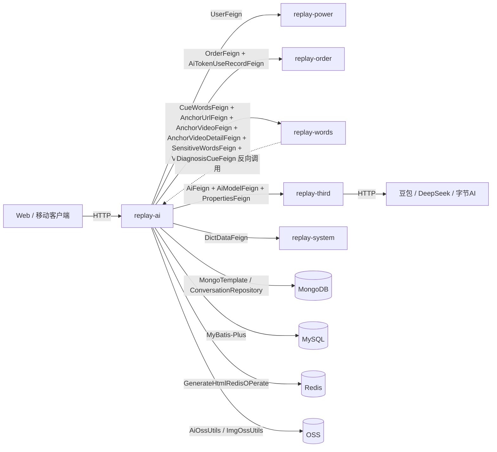

<!-- module: ai -->
<!-- area: architecture -->
<!-- persistence: MongoDB + MySQL -->
<!-- generated-by: reverse-scan -->
<!-- last-scan: 2026-05-20 -->
<!-- source-paths: replay-ai/src/main/java/com/jiuyu/replay/ai/ -->

# AI Architecture — 架构决策与设计

> replay-ai 模块的架构基线、设计决策与关键技术约束。作为平台的 **AI 诊断与对话引擎**，负责 AI 诊断报告生成（内容诊断 + 数据诊断）、AI 问答记录管理（MongoDB）、用户自定义提示词、分享链接记录等功能。

---

## 一、模块定位

replay-ai 是直播复盘平台的 **AI 业务层**，对外暴露 5 块能力：

- **AI 问答**：用户在视频 / 文件 / 对比分析场景发起多轮对话，结果按 Q/A 双文档落 MongoDB（`replay_ai_conversation`）
- **AI 诊断**：基于预选提示词对主播 / 视频做批量内容 / 数据诊断，PDF 报告上传 OSS，状态机驱动客户端轮询
- **用户自定义提示词**：企业版及以上私人提示词维护（`tb_cust_prompt`）
- **AI 结果增强**：HTML 可视化 + AI 内容纠正（均为"先同步改状态 + 异步线程池跑模型"模式）
- **链接分享**：把若干 `qaCode` 打包成可分享链接，定时清扫过期

不负责：
- AI 模型本身（属于 **replay-third** 的 `AiModelEntity` / `AiFeign`）
- 提示词文本数据本体（属于 **replay-words** 的 `tb_cue_words`）
- Token 计费记录（属于 **replay-order** 的 `tb_ai_token_use_record`）

---

## 二、分层架构

```
┌────────────────────────────────────────────────────────────┐
│  Controller (5)                                              │
│  AiController / ConversationController /                    │
│  CustPromptController / DiagnosisController /               │
│  ShareLinkRecordController                                  │
├────────────────────────────────────────────────────────────┤
│  Api (Feign 实现，2 个) — 被其他模块调用                      │
│  ConversationApi (impl ConversationFeign)                   │
│  DiagnosisCueApi (impl DiagnosisCueFeign)                   │
├────────────────────────────────────────────────────────────┤
│  Bll (7 个) — 业务编排薄层                                   │
│  AiRelatedBll / ConversationBll / CustPromptBll /           │
│  DiagnosisBll / DiagnosisCueBll / DiagnosisModelBll /       │
│  ShareLinkRecordBll                                         │
├────────────────────────────────────────────────────────────┤
│  Rse (6 接口 + 6 实现) — 跨表 / MongoTemplate 聚合查询        │
│  ConversationRse / ConversationHtmlRse (空壳) /              │
│  CustPromptRse / DiagnosisCueRse / DiagnosisModelRse /      │
│  ShareLinkRecordRse                                         │
├──────────────────────┬─────────────────────────────────────┤
│  Service (6 对)       │  MongoRepository (1 个)             │
│  IService<Entity>     │  ConversationRepository            │
│  extends ServiceImpl  │  MongoTemplate (直接注入用于 update) │
├──────────────────────┼─────────────────────────────────────┤
│  Dao (4 个 MyBatis)   │  MongoDB Collections (2)           │
│  CustPromptDao /      │  replay_ai_conversation /          │
│  DiagnosisCueDao /    │  replay_ai_conversation_html        │
│  DiagnosisModelDao /  │                                     │
│  ShareLinkRecordDao   │                                     │
└──────────────────────┴─────────────────────────────────────┘
```

### 层级职责边界

| 层 | 允许操作 | 禁止操作 |
|---|---|---|
| **Controller** | 参数校验、调用 Bll、返回 `R<T>`、`@CrossOrigin` | 直接调用 Rse / Dao；包含业务编排逻辑 |
| **Api** | 实现 Feign 接口，直接转交 Rse 或 Bll | 副作用（如 `ConversationApi.saveConversationData` 故意只走 Rse，不走 Bll 的 `hasDiagnosisReport` 副作用链） |
| **Bll** | 编排多个 Rse + Feign、AES 加密、调度线程池 | 长事务（事务下沉到 Rse） |
| **Rse** | MongoTemplate 聚合查询、跨表组装、`@Transactional` | 跨模块调用（走 Feign） |
| **Service** | MyBatis-Plus 基础 CRUD（继承 `ServiceImpl<Dao, Entity>`）、MongoRepository 包装 | 业务逻辑 |
| **Dao** | MyBatis-Plus `BaseMapper<Entity>` | XML mapper（本模块未使用） |
| **MongoRepository** | Spring Data MongoDB `findAll / saveAll / findAllById` | 复杂聚合（走 MongoTemplate） |

**历史遗留 Bll/Rse 命名**：这是 replay-words / replay-order / replay-agent 系列的旧分层风格，新代码不建议外推到其他模块（详见 `feedback_no_bll_producer_rse_standardization.md`）。但本模块代码已经全部按此分层落地，维护时遵循即可，**不需要重构**。

---

## 三、ADR 记录

### ADR-AI-001: AI 问答采用 MongoDB 而非 MySQL
- **决策**：`ConversationEntity` 落 MongoDB（`replay_ai_conversation`）
- **原因**：
  1. `content`（模型回答）和 `realContent`（提问全文）长度高度不可控，可达 10k+ 字
  2. 字段经常扩展（HTML / AI 纠正 / 优化目的等都是后期加的）
  3. 一问一答按 `qaCode` 聚合、按 `contextId` 串联，文档天然适合
- **代价**：与 MySQL 业务表跨数据源，无法 JOIN；事务边界严格分离

### ADR-AI-002: 诊断 cue / model 用 MySQL
- **决策**：`tb_diagnosis_cue` / `tb_diagnosis_model` 保留在 MySQL
- **原因**：行式 + 业务 ID + 多维过滤（user/tenant/source）+ 频繁列表查询，MyBatis-Plus LambdaQueryWrapper 表达力强
- **代价**：与 `replay_ai_conversation` 的关联只能在应用层做（无法 JOIN）

### ADR-AI-003: HTML 生成 / AI 纠正走"同步改状态 + 异步线程池"
- **决策**：使用 `generateHtmlExecutor`（在 `replay-api/.../config/ThreadPoolConfig.java` 定义），由 `Executor#execute` 跑 chatCompletion；同步接口仅改状态为 GENERATING/CORRECTING 并返回拼好的 prompt
- **原因**：
  1. 模型调用秒级，不能阻塞 HTTP
  2. 不引入 MQ（项目尚未把 AI 任务接入 RocketMQ）
  3. 失败可由列表查询的"超时清扫"被动恢复
- **代价**：
  1. 容器重启会丢任务（GENERATING 永远停在那直到超时回扫）
  2. 横向扩容时同一 Conversation 可能被同一节点处理两次（需 `htmlStatus = GENERATING` 检查防重）

### ADR-AI-004: 提示词来源回退 (CueWords vs CustPrompt)
- **决策**：`AiRelatedBll#getAiPromptWord(cueWordsId, cueWordsType=null, ...)` 优先查系统 `tb_cue_words`，找不到再回退 `tb_cust_prompt`
- **原因**：客户端历史接口不传 `cueWordsType`，回退保证旧客户端兼容
- **代价**：当系统提示词和用户提示词 ID 冲突（雪花 ID 极小概率重复但理论可能）时，行为不确定。新客户端应显式传 `cueWordsType`

### ADR-AI-005: AI 服务调用经由 replay-third
- **决策**：所有模型调用（chatCompletion / 模型列表 / TempToken）通过 `replay-generic` 中的 Feign 接口（`AiFeign / AiModelFeign`）由 replay-third 提供实现
- **原因**：AI 厂商凭证 / API Key 集中在 third 模块，避免散落
- **跨模块通信形式**：这是 Spring Bean 接口（不是 @FeignClient HTTP 调用），单体内通过依赖注入解耦

### ADR-AI-006: 客户端版本协商默认模型 fallback
- **决策**：若 `diagnosis_ai_model_default` 配置的模型要求高版本，但客户端 `webVersion` 不达标 → 兜底返回 `analysis-doubao-deep-seek-R1`
- **原因**：保证旧版本客户端不会因配置升级直接报错
- **代价**：兜底 modelCode 硬编码在 `DiagnosisCueBll#resolveDefaultModelCode`，更换需要改代码

### ADR-AI-007: 巡检 buildSummary 范式统一 — Markdown + `<aifupan-data-block>` 标签（2026-06-07）
- **决策**：`ScriptMonitorPatrolGenerateBll.buildSummary` 采用与质检（`ScriptMonitorGenerateBll`）相同的正则提取范式，完全 mirror `SUMMARY_TAG_PATTERN`，取代原 JSON.parseObject 路径。
- **原因**：见 [ADR-0001](adrs/0001-patrol-summary-markdown.md)。
- **代价**：`summaryJson` 字段从 JSON 变为 Markdown 纯文本，失去 effectiveRate 等数值字段的机器可读性。

### ADR-AI-008: 已读语义简化 — is_read/confirmed_at 迁入报告主表（2026-06-08）
- **决策**：删除 `tb_script_monitor_read` + `tb_script_monitor_role_confirm` 两张子表，将 `is_read TINYINT` 和 `confirmed_at DATETIME NULL` 作为列新增到 `tb_script_monitor_report`；detail 接口内置写已读，使用独立 Spring Bean 独立事务 + fail-safe 方式。
- **原因**：已读状态是 per-report 维度属性（非 per-user），内置到主表消除 IN 查询、降低代码复杂度。
- **代价**：历史已读数据不 backfill（前端重新显示为未读）；DROP TABLE 后旧版代码回滚需同步重建子表。
- **详细 ADR**：见 [ADR-0003](adrs/0003-script-monitor-read-to-report-column.md)（存储方案）、[ADR-0004](adrs/0004-script-monitor-read-transaction-boundary.md)（事务边界）、[ADR-0005](adrs/0005-script-monitor-confirmed-at-retention.md)（confirmed_at 保留）。

---

## 四、跨模块通信

### 4.1 出站（replay-ai → 其他模块）

通过 `replay-generic` 的 Feign 接口（**Spring Bean 注入，非 HTTP**）：

| 目标模块 | Feign 接口 | 用途 |
|---|---|---|
| replay-third | `AiFeign` | `chatCompletion` 调模型、`getAnalysisTempToken` 拿临时凭证 |
| replay-third | `AiModelFeign` | `getByCode / info / listDiagnosisModel / getAiModel` |
| replay-third | `PropertiesFeign` | 取第三方厂商配置 |
| replay-power | `UserFeign` | `getLocalUser` 取当前用户 + activeTenantId |
| replay-words | `CueWordsFeign` | 取系统提示词 / `pageCueWords` / `getHtmlPrompt` |
| replay-words | `SensitiveWordsFeign` | `getTradeId(sourceType, sourceId)` 拿行业 |
| replay-words | `AnchorUrlFeign` | `getUserAnchorBySecUid` / `minusDataDiagnosisGenerateNum` |
| replay-words | `AnchorVideoFeign` | `GetByVideoId / listByVideoIds` |
| replay-words | `AnchorVideoDetailFeign` | `getAndSave / updateHasDiagnosisReport` |
| replay-words | `VideoDataViewingFeign` | `hasBoard(videoId)` 判断看板是否存在 |
| replay-order | `OrderFeign` | `currentOrderByUserId` 校验企业版 |
| replay-order | `AiTokenUseRecordFeign` | `saveAiTokenUseRec / getByRequestId` |
| replay-system | `DictDataFeign` | 字典 `diagnosis_cue_type` / `ai_model_min_web_version` |

### 4.2 入站（其他模块 → replay-ai）

| 来源 | Feign 接口 | 实现 | 用途 |
|---|---|---|---|
| replay-words.AnchorVideoBll | `DiagnosisCueFeign` | `DiagnosisCueApi#listBySourceIds` | 批量按 sourceId 反查诊断 cue 列表 |
| (暂无外部消费者) | `ConversationFeign` | `ConversationApi#saveConversationData` | 跨模块同步写入 AI 问答记录 |

**关键差异**：`ConversationApi.saveConversationData` 直接走 `conversationRse.saveAll`，**不执行** `ConversationBll.saveConversationData` 里的 `saveConversationDataPost` 副作用（即跨模块插数据不会触发 `hasDiagnosisReport` 自动回填）。

### 4.3 模块拓扑图



启动入口与单体边界：所有模块在 `replay-api` 启动类（端口 6606）下统一加载，**没有跨服务 RPC**，Feign 接口都是本进程 Spring Bean。MQ / 异步任务通过共享 `generateHtmlExecutor` 线程池，定义在 replay-api 的 `ThreadPoolConfig`。

---

## 五、异步任务与调度

### 5.1 线程池

| Bean 名 | 定义位置 | 用途 | 备注 |
|---|---|---|---|
| `generateHtmlExecutor` | `replay-api/.../config/ThreadPoolConfig.java` | HTML 生成、AI 纠正 | 通过 `@Resource(name = "generateHtmlExecutor")` 注入到 `ConversationBll` 和 `ConversationApi` |

**Bean 跨模块注入**：本模块的 Bll 注入 replay-api 模块定义的线程池 — 这是因为整个项目是单体（启动入口在 replay-api 端口 6606）。replay-ai 没有自己的应用启动类，所有 Bean 在 replay-api 的 Spring 容器中统一管理。

### 5.2 @Scheduled / @RocketMQMessageListener

**本模块代码内 0 个 `@Scheduled` 注解，0 个 `@RocketMQMessageListener`。** 无 MQ 生产者或消费者。

### 5.3 超时清扫（被动 — 接口触发）

不是后台定时任务，是接口被调用时的"机会式清扫"：

| 检查点 | 触发接口 | systemKv 阈值 | 动作 |
|---|---|---|---|
| `htmlStatus = GENERATING` 超时 | `conversationPage` | `html_generate_expiration_time` (默认 20 分钟) | 改 FAIL + `htmlCreateError` |
| `aiCorrectStatus = CORRECTING` 超时 | `conversationPage` | `correct_generate_expiration_time` (默认 20 分钟) | 改 FAIL + `aiCorrectError` |
| `qaStatus = GENERATING` 超时 | `listDiagnosis` / `handleDiagnosisByUser` | `diagnosis_timeout_report` (默认 30 分钟 → 秒) | SQL `TIMESTAMPDIFF > timeout` 批量 update FAIL |

---

## 六、缓存策略

### 6.1 Redis

| 用途 | 工具类 | Key 模式 | 备注 |
|---|---|---|---|
| 数据诊断生成次数计数 | `GenerateHtmlRedisOPerate` (`replay-common`) | (userId, tenantId, secUid) 维度统计 | save / delete / size 三个方法；控制数据诊断扣配额 |

### 6.2 应用层缓存

无。`ConversationBll.htmlPrefix = "ai-html"` 为常量。

---

## 七、设计模式

| 模式 | 应用点 | 备注 |
|---|---|---|
| **Template Method (准)** | `ConversationBll` 中 HTML 生成和 AI 纠正 | 统一流程："检查前置条件 → 更新状态为生成中/纠错中 → 异步执行 → 完成后更新状态" |
| **Strategy via Dict** | `DiagnosisCueBll.listDiagnosis()` | 按字典 `diagnosis_cue_type` 分组提示词，不同 cueType 独立列表 |
| **Fire-and-Forget 异步** | HTML 生成、AI 纠正 | 通过 `generateHtmlExecutor` 线程池异步执行，接口立即返回参数给客户端 |
| **Version Gate** | `DiagnosisCueBll#shouldShowModel()` | 字典配置模型最低客户端版本要求，低版本不显示特定模型 |
| **Backoff Fallback** | `DiagnosisCueBll#resolveDefaultModelCode()` | 客户端版本不够时兜底到 `analysis-doubao-deep-seek-R1` |
| **Opaque Token** | `ConversationBll#getHtmlTempToken()` | 获取临时 token 给客户端直接调用 AI，避免透传 API key |

避开的反模式 / 已知遗留问题（保留 — 非本次重构范畴）：
- ❌ `ShareLinkRecordBll` / `ShareLinkRecordController` 使用 `@Resource` 字段注入和 `@Autowired`（不符合 CLAUDE.md §5 构造器注入约束）
- ❌ `ConversationBll` 字段 `@Resource(name = "generateHtmlExecutor")` 与 `@AllArgsConstructor` 混用
- ❌ `ConversationHtmlEntity.isDelected` 字段拼写错误（应为 `isDeleted`）
- ❌ `conversationByCueWordsIdsBo` 类名首字母小写（应为 `ConversationByCueWordsIdsBo`）

---

## 八、事务边界

| 写操作 | 事务声明 | 备注 |
|---|---|---|
| `DiagnosisCueBll#getAutoDiagnosisQuestions` | `@Transactional(rollbackFor = Exception.class)` | 复合写：复制 cue + 写 model + Redis 写计数 |
| `DiagnosisCueRseImpl#saveDiagnosisCue` | `@Transactional`（默认 RuntimeException 回滚） | 写 `tb_diagnosis_model` + diff/save/delete `tb_diagnosis_cue` |
| 其他 Rse 写方法 | 无显式 `@Transactional` | 单表 update / insert，依赖 MyBatis-Plus 默认行为 |
| MongoDB 写 | 无事务 | MongoDB 单文档 ACID，多文档不开 session |

**约束**：跨数据源（MySQL + MongoDB）的写操作**不在同一事务**内。例如：
- `saveDiagnosisCue` 写 MySQL → 客户端/服务端跑模型 → 写 MongoDB Conversation → 回写 `hasDiagnosisReport` 到 MySQL
- 中间任一步失败，前面已落库的数据需要靠状态机（`qaStatus FAIL`）或被动清扫纠正

---

## 九、MongoDB 索引

### ConversationEntity (`replay_ai_conversation`)

| 索引 | 类型 | 用途 |
|------|------|------|
| `sourceId_sourceType_userId_tenantId_askType_index` | Compound | 查询用户在某来源下某类型的对话历史 |
| `createTime` (DESC) | Single | 按时间排序分页 |

查询模式：
- 分页查询：`findAll(Example, PageRequest)` + Sort by `createTime DESC, type ASC`
- 聚合查询：`conversationByCueWordsIds` 使用 `MongoTemplate.aggregate` 按 `cueWordsId + type` 分组取最新记录

### ConversationHtmlEntity (`replay_ai_conversation_html`)

| 索引 | 类型 | 用途 |
|------|------|------|
| `conversationId_isDelected_index` | Compound | 按对话 ID 查询 HTML 快照 |

---

## 十、配置项（SystemKv 依赖）

模块直接消费 13 个 systemKv 配置：

| Key | 默认值 | 用途 |
|---|---|---|
| `cust_prompt_content_max_count` | 30000 | 自定义提示词内容长度上限 |
| `user_cust_prompt_num_max` | — | 单用户自定义提示词条数上限 |
| `client_front_domain_name` | — | 分享链接的 host 前缀 |
| `html_generate_expiration_time` | 20 (分钟) | HTML 生成超时 |
| `correct_generate_expiration_time` | 20 (分钟) | AI 纠正超时 |
| `diagnosis_timeout_report` | 30 (分钟) | 诊断生成超时 |
| `html_ai_model_default` | — | HTML 生成默认模型 code |
| `correct_ai_content_model` | — | AI 纠正默认模型 code |
| `diagnosis_ai_model_default` | — | 诊断默认模型 code |
| `html_system_extra_prompt` | — | HTML 提示词补充段 |
| `correct_ai_content_prompt` | — | AI 纠正提示词 |
| `content_diagnosis_prompt_limit` | 10 | 内容诊断每个 cueType 提示词列表上限 |

字典依赖：
- `diagnosis_cue_type`：决定哪些 askType 算"内容诊断"（用于 `hasDiagnosisReport` 回填）
- `ai_model_min_web_version`：模型 code → 最低 webVersion 映射

修改这些配置不需要重启，但需要清理 systemKv 缓存（取决于 `SystemKvProducer` 实现）。

---

## 十一、数据流关键路径

### 路径 1: AI 诊断（内容诊断）

```
1. 前端请求 → DiagnosisController.aiModelBySourceIdAndType()
2. DiagnosisCueBll → DiagnosisModelRse.getBySource() 查 tb_diagnosis_model
3. 未设置 → SystemKvProducer 取默认模型 code → AiModelFeign.getByCode()
4. 前端请求 → DiagnosisController.listDiagnosis()
5. DiagnosisCueBll.listDiagnosis() → 超时检查 → 查主播+视频的诊断提示词配置
   → CueWordsFeign.pageCueWords() 获取提示词列表 → 装配选中状态
6. 前端提交分析 → DiagnosisController.saveDiagnosis()
7. DiagnosisCueBll.saveDiagnosis() → DiagnosisCueRse.saveDiagnosis()
   → 保存 tb_diagnosis_cue 记录（状态 WAITING）
8. 客户端处理后回调 → DiagnosisController.updateDiagnosisCueStatus()
   → 更新 qaStatus + qaHandleTime
   → 如果是数据诊断(SUCCESS) → minusDataDiagnosisGenerateNum()
     → GenerateHtmlRedisOPerate.delete() → AnchorUrlFeign.minusDataDiagnosisGenerateNum()
```

### 路径 2: AI 问答记录保存

```
1. 前端提交 → ConversationController.saveConversationData()
2. ConversationBll.saveConversationData() → ConversationRse.saveAll()
   → MongoDB insert (replay_ai_conversation)
3. saveConversationDataPost() — 后置处理：
   → 过滤 sourceType=0(视频) + cueWordsType=0(系统) 的记录
   → 区分内容诊断 / 数据诊断
   → AnchorVideoDetailFeign.updateHasDiagnosisReport() 更新视频详情
   → 失败仅 log.error，不影响主流程
```

### 路径 3: 服务端 HTML 生成

```
1. 前端请求 → ConversationController.serviceGenerateHtml(id)
2. ConversationBll.serviceGenerateHtml(id)
   → proGenerateHtml(id, SERVER) — 检查前置条件 + 拼接提示词 + 更新状态为 GENERATING
   → generateHtmlExecutor.execute() 异步执行
3. 异步线程 doServiceGenerateHtml():
   → SystemKvProducer.getByKey("html_ai_model_default") 获取模型
   → AiModelFeign.getByCode() 获取模型配置
   → AiFeign.chatCompletion() 调用 AI
   → AiTokenUseRecordFeign.saveAiTokenUseRec() 记录 token 消耗
   → ImgOssUtils.uploadToString() 上传 HTML 到 OSS
   → updateHtmlStatus() 更新状态为 SUCCESS 或 FAIL
```

### 路径 4: 自动诊断问题生成

```
1. 前端请求 → DiagnosisController.getAutoDiagnosisQuestions(videoId)
2. DiagnosisCueBll.getAutoDiagnosisQuestions(videoId)
   → AnchorVideoFeign.GetByVideoId 获取视频
   → AnchorUrlFeign.getUserAnchorBySecUid 获取主播配置
3. 内容诊断（isAutoDiagnosis=1）:
   → DiagnosisModelRse.addVideoDiagnosisModel(secUid, videoId) — 从主播复制模型
   → DiagnosisCueRse.setAutoDiagnosisQuestions(videoId, secUid) — 复制提示词配置
4. 数据诊断（isDataDiagnosis=1 + 次数>0 + 有看板）:
   → GenerateHtmlRedisOPerate.size() 检查已用次数
   → CueWordsFeign.pageCueWords() 获取数据诊断提示词
   → DiagnosisCueRse.setAutoDataDiagnosisQuestions() 保存诊断配置
   → GenerateHtmlRedisOPerate.save() 记录生成次数
```

---

## 十二、枚举与状态机

### 核心枚举（`AiEnums`）

| 枚举 | 值范围 | 用途 |
|------|--------|------|
| `diagnosisType` | 0: 内容诊断, 1: 数据诊断 | 区分诊断类型 |
| `diagnosisSourceType` | 0: 主播, 1: 视频 | 诊断配置关联维度 |
| `qaStatus` | 0: 待处理, 1: 处理中, 2: 完成, 3: 失败 | 诊断报告生命周期 |
| `htmlStatus` | 0: 待生成, 1: 生成中, 2: 成功, 3: 失败 | HTML 生成生命周期 |
| `htmlType` | 0: 服务器, 1: 客户端 | HTML 生成来源 |
| `correctStatus` | 0: 正常, 1: 纠错中, 2: 纠错完成, 3: 失败 | AI 纠正生命周期 |
| `correctType` | 0: 服务器, 1: 客户端 | 纠正来源类型 |
| `cueWordsType` | 0: 系统提示词, 1: 用户自定义 | 提示词来源 |
| `readStatus` | 0: 未读, 1: 已读 | 报告已读状态 |
| `questionType` | 0: 正常问题, 1: 重新提问 | 提问类型 |

### 核心状态流转

**诊断报告 (tb_diagnosis_cue.qa_status)**:
```
WAITING(0) → GENERATING(1) → SUCCESS(2) / FAIL(3)
         ↑ ← ← ← ← ← ← ← ↓ (用户重新提交 / 超时自动回扫)
```

**HTML 生成 (replay_ai_conversation.html_status)**:
```
WAITING(0) → GENERATING(1) → SUCCESS(2) / FAIL(3)
         ↑ (超时自动 FAIL：html_generate_expiration_time KV 配置，默认 20 分钟)
```

**AI 纠正 (replay_ai_conversation.ai_correct_status)**:
```
NORMAL(0) → CORRECTING(1) → CORRECTED(2) / FAIL(3)
       ↑ (超时自动 FAIL：correct_generate_expiration_time KV 配置，默认 20 分钟)
```

---

## 十三、MySQL 实体与表

| 实体 | 表名 | 关键字段 | 软删除 |
|------|------|---------|--------|
| `CustPromptEntity` | `tb_cust_prompt` | id, promptTitle, promptContent, promptSort, userId, isDeleted | 手动 `isDeleted` (Integer) |
| `DiagnosisCueEntity` | `tb_diagnosis_cue` | id, sourceId, sourceType, tradeId, cueWordsId, qaStatus, diagnosisType, userId, tenantId, isRead, isDeleted | 手动 `isDeleted` (Integer) |
| `DiagnosisModelEntity` | `tb_diagnosis_model` | id, sourceId, sourceType, modelId, diagnosisType, userId, tenantId, isDeleted | 手动 `isDeleted` (Integer) |
| `ShareLinkRecordEntity` | `tb_share_link_record` | id, userId, tenantId, shareTime, codes, sourceId, sourceType, expireTime, urlStatus, isDeleted | 手动 `isDeleted` (Integer) |

所有 MySQL 实体：`@TableId(type = IdType.INPUT)` + 雪花 ID (`SnowflakeManager.nextValue()`)。

---

## 十四、关键约束（投影自 CLAUDE.md §5 + 模块特异）

- **DI**: 存量代码混用 `@Resource` / `@AllArgsConstructor` / `@Autowired`；新代码用构造器注入
- **R&lt;T&gt;**: Controller 必须返回 `R<T>`，禁裸返业务对象
- **Snowflake ID**: MySQL 实体走 `SnowflakeManager.nextValue()` + `@TableId(type=IdType.INPUT)`；MongoDB 实体使用 String ID（Mongo 自动生成 ObjectId）
- **软删除**: MySQL 表手动 `isDeleted` 字段（Integer），MongoDB 不走软删除（ConversationHtmlEntity.isDelected 目前未实际使用）
- **时间戳**: MySQL 用 `new Date()` 显式赋值 `createDate` / `updateDate`；MongoDB 用 `System.currentTimeMillis()` / `DateUtil.format()`
- **租户隔离**: 所有查询必须 `tenantId` + `userId` 过滤；通过 `UserFeign.getLocalUser()` 获取当前用户上下文
- **事务**: 写方法 `@Transactional(rollbackFor = Exception.class)`，事务边界在 Rse；MongoDB 操作不参与 JDBC 事务
- **AI Token 消耗**: 每次调用 AI 后必须通过 `AiTokenUseRecordFeign.saveAiTokenUseRec()` 记录 token 消耗
- **IN ≤ 500**: 大批量 `IN` 查询用 `Lists.partition` 分批

---

## 十五、观测性

- 日志：`@Slf4j` 在 `ConversationBll / DiagnosisCueBll / ShareLinkRecordBll / DiagnosisModelRseImpl / ConversationRseImpl` 启用
- 关键日志键：`videoId` / `id` / `modelCode` / 异常堆栈
- 无 `traceId / tenantId` 显式注入日志 MDC（推测在 `replay-common` 的 AOP 中统一处理，未在扫描范围）
- 无 metrics 埋点 / Skywalking 显式 span（依赖项目级 APM）

---

## 十六、未涵盖 / 待补充

- `<待补充>` ai 模块的 Controller 是否在 replay-api 侧有对应的独立包（当前在 replay-ai 模块内直接暴露）
- `<待补充>` MongoDB 连接配置与容灾策略（ConnectionPool 参数、failover）
- `<待补充>` AiFeign（replay-third）实际的 AI 调用目标（字节豆包 / DeepSeek 的具体 API 对接细节）
- `<待补充>` 模块内各 API 的完整鉴权链路（当前通过 UserFeign.getLocalUser() 隐式依赖 power 的 token 拦截器）
- `<待补充>` ConversationHtmlRse / ConversationHtmlEntity 的完整 CRUD 实现（当前仅为空壳占位）
