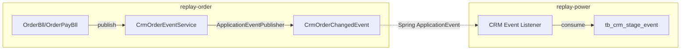

<!-- module: order -->
<!-- area: architecture -->
<!-- generated-by: reverse-scan -->
<!-- last-scan: 2026-05-20 -->
<!-- source-paths: replay-order/src/main/java/com/jiuyu/replay/order/ -->

# Order Architecture -- 架构决策与设计

> replay-order 模块的架构基线、设计决策与关键技术约束。作为平台的**商品/订单/支付/资产核心**，提供套餐购买、邀请码发放、用户资产扣减与 AI Token 计费等能力。

---

## 一、模块定位

replay-order 承载平台的**交易与资产管理核心**：

- **商品管理**: 商品 / 商品类型 / 价格档位配置
- **套餐/版本**: 套餐定义、升级规则、自定义版本
- **订单**: 下单 / 支付 / 退款 / 升级 / 续费 / 增量包全生命周期
- **邀请码**: 批次管理 / 码生成 / 兑换激活
- **用户资产**: 资产总览 / 消耗流水 / 批次剩余跟踪 / 月底重置
- **AI Token 计费**: 多模型 Token 消耗记录（通义/豆包）
- **CRM 集成**: 订单变更事件发布（供 CRM 子系统消费）

---

## 二、分层架构

```
┌─────────────────────────────────────────────────────────────────┐
│  Controller (4)                                                  │
│  - replay-order/controller/: ClientOrderController,              │
│    OrderPackageController, OrderUserPropertyController,          │
│    UserVersionNewController                                      │
├─────────────────────────────────────────────────────────────────┤
│  Api (7) -- Feign 接口实现                                       │
│  - OrderApi, PackageApi, CommodityApi, CommodityTypeApi,         │
│    UserPropertyApi, UserPropertyDetailsApi, AiTokenUseRecordApi  │
├─────────────────────────────────────────────────────────────────┤
│  Bll (16) -- 组合编排层                                          │
│  - OrderBll, OrderPayBll, OrderDetailBll, OrderExtendBll        │
│  - UserPropertyBll, UserPropertyTypeBll, UserPropertyDetailsBll  │
│  - TypeSurplusBll, TypeConsumptionBll                           │
│  - CommodityBll, CommodityTypeBll                               │
│  - PackageBll, PackageUserBll                                   │
│  - InvitationCodeBll, InvitationCodeBatchBll                    │
│  - AiTokenUseRecordBll                                          │
├──────────────────────────┬───────────────────────────────────────┤
│  Rse (4)                 │  Bean (Strategy) -- 订单创建策略      │
│  - CommodityRse          │  - CreateOrder (interface)            │
│  - CommodityTypeRse      │  - OrderFactoryUtils (工厂)           │
│  - PackageRse            │  - CreateOrderBeanAbstract            │
│  - UserPropertyDetailsRse│  - CreateOrderPackage                 │
│                          │  - CreateOrderIncremental              │
│                          │  - CreateOrderActivity                │
│                          │  - CreateOrderCommodityActivity        │
│                          │  - UserPropertyImpl                   │
├──────────────────────────┴───────────────────────────────────────┤
│  Producer (18 接口 + 18 实现)                                    │
│  - @Service, 完整 CRUD + 事务边界                                │
│  - Entity ↔ VO/BO 转换，雪花 ID 生成                            │
├─────────────────────────────────────────────────────────────────┤
│  Repository Service (20 对) -- IService<Entity>                  │
│  Repository Dao (20) -- BaseMapper<Entity>                       │
└─────────────────────────────────────────────────────────────────┘
```

### 历史分层说明（Bll / Producer / Rse 三层）

order 模块沿用与 words / power / agent 相同的历史分层（`@Component Bll` + `@Service Producer` + `@Component Rse`）。
**本项目不再 push 新代码使用此分层**（CLAUDE.md §4），新模块/新业务默认 `Controller → Service → Mapper` 三层。读懂存量代码时遵循即可。

### 层级职责（存量约定）

| 层 | 允许操作 | 禁止操作 |
|----|----------|----------|
| Controller | 参数校验、调用 Bll、返回 R<T> | 直接调 Dao / 含业务逻辑 |
| Api (Feign Impl) | 委托 Bll 或 Producer，跨模块调用 UserFeign 等 | 编写业务逻辑 |
| Bll | 组合 Producer 调用、跨模块 Feign 调用、简单转换 | `@Transactional` / 直接操作 Entity |
| Rse | 跨模块数据聚合（读密集型查询） | 写操作 |
| Producer | 完整 CRUD、`@Transactional(rollbackFor = Exception.class)`、Entity↔VO 转换、雪花 ID 生成 | 跨模块调用（必须通过 Api/Rse） |
| Repository Service | MyBatis-Plus 基础 CRUD / 自定义批量查询 | 业务逻辑 |
| Repository Dao | 单表 CRUD + 复杂 SQL 聚合（XML） | 业务装配 |

---

## 三、Feign 接口

### 3.1 order 暴露 -- 供其他模块消费

定义在 `replay-generic/src/main/java/com/jiuyu/replay/generic/feign/order/`，实现在 `replay-order/api/`：

| Feign 接口 | 实现类 | 方法数 | 主要消费方 |
|------------|--------|--------|-----------|
| `OrderFeign` | `OrderApi` | 3 | power / activity / agent |
| `PackageFeign` | `PackageApi` | 2 | power / agent |
| `CommodityFeign` | `CommodityApi` | 1 | power |
| `CommodityTypeFeign` | `CommodityTypeApi` | 1 | power / words |
| `UserPropertyFeign` | `UserPropertyApi` | 5 | words / video / ai / activity |
| `UserPropertyDetailsFeign` | `UserPropertyDetailsApi` | 2 | power |
| `AiTokenUseRecordFeign` | `AiTokenUseRecordApi` | 2 | replay-ai |

#### `OrderFeign` 关键方法
- `currentOrderByUserId(userId)` / `currentOrderByUserIds(userIds)` -- 获取用户当前生效订单（子账号自动追溯到父账号）
- `addActivityOrder(dtoList)` -- 批量创建活动订单（邀请奖励等），失败时清理资产缓存

#### `UserPropertyFeign` 关键方法（高频热点）
- `getUserProperty(userId)` -- 获取用户全部资产类型汇总
- `checkUseProperty(userId, code, quantity)` -- 检查资产是否足够（区分订阅资产 / 普通资产两种路径）
- `useShortVideoProperty(userId, code, quantity)` -- 使用短视频资产（订阅达人/爆款，走专属扣减逻辑）
- `updateByPropertyNumRetBoolean(userId, code, quantity)` -- 直接更新资产数量
- `syncSubAccountCount(userId)` -- 同步主账号的子账号数量资产（从 power 模块反查子账号数写入资产）

#### `AiTokenUseRecordFeign` 关键方法
- `saveAiTokenUseRec(bo)` -- 保存 AI Token 消耗记录（幂等：同一 requestId 不重复写入）
- `getByRequestId(requestId)` -- 按请求 ID 反查记录

### 3.2 order 消费 -- 调用其他模块

| 调用方向 | Feign 接口 | 用途 |
|----------|-----------|------|
| order → power | `UserFeign` | 获取用户信息、父账号追溯、子账号计数 |
| order → activity | `UserInviteFeign` | 邀请活动订单创建 |
| order → agent | `ChannelFeign` | 渠道信息装配（邀请码批次关联渠道） |

---

## 四、跨模块通信

### 4.1 Spring Event -- CRM 订单事件



- **事件类**: `CrmOrderChangedEvent` -- `eventType`, `occurredAt`, `userId`, `salesId`, `salesPhone`, `orderId`
- **发布服务**: `CrmOrderEventService` / `CrmOrderEventServiceImpl`
- **消费方**: power 模块（CRM 阶段事件记录）
- **发布时机**: 订单关键节点（支付成功、退款、过期等）

### 4.2 Redis -- 订单超时监听

- **Key 前缀**: `order.orderTimeoutRedisKey`（配置注入 `OrderProperties`）
- **Key 格式**: `{prefix}:{orderId}`
- **监听器**: `RedisTimeoutOrderListener`（继承 `KeyExpirationEventMessageListener`，**当前已注释掉**）
- **机制**: 创建订单时 SET key 带 TTL → key 过期触发 Redis keyspace notification → `onMessage` → `OrderPayBll.orderExpired(orderId)`
- **状态**: 代码中整个类已被注释，当前使用独立定时任务扫过期订单替代

### 4.3 MQ 通信

- **生产者**: `UserPropertyImpl` 中引用 `RocketMqBll`（通过 `ApplicationContextUtil.getBean(RocketMqBll.class)`）-- 用于资产变更通知
- **消费者**: 当前 replay-order **未发现** RocketMQ 消费者 / `@RocketMQMessageListener`
- 其他模块可通过 Spring Event 或直接 Feign 调用感知订单状态变化

---

## 五、定时任务与异步

当前 replay-order 模块**未发现** `@XxlJob` 或 `@Scheduled` 注解的定时任务。
订单超时处理通过 Redis key 过期回调（已注释）或调用方主动触发。

---

## 六、缓存策略（Redis）

### Redis Key 前缀

| Key 前缀 | 用途 | TTL |
|----------|------|-----|
| `order.orderTimeoutRedisKey` | 订单超时标记（配置注入 `OrderProperties`） | 订单剩余有效时长 |
| 用户资产缓存 | `UserPropertyBll` / `CommodityTypeBll` 中缓存用户资产/商品类型列表 | 业务自定 |

### 资产缓存操作
- **读**: `UserPropertyBll.getUserProperty` 先查 Redis → 未命中查 DB → 回写缓存
- **删**: 资产变动后 `deleteUserPropertyCache(userIds)` 批量清理
- **同步**: 子账号数量资产通过 `UserPropertyApi.syncSubAccountCount` 从 power 模块反查后写入资产表，同时刷新缓存

### 一致性策略
- 资产扣减通过 `TypeSurplusProducerImpl` 走 DB 行锁 + `@Transactional`，缓存为最终一致（扣减后删缓存，下次读回源）
- AI Token 记录写入后立即入 DB，不涉缓存

---

## 七、事务边界与并发控制

### 事务边界

所有写方法在 Producer 层声明 `@Transactional(rollbackFor = Exception.class)`：

| Producer | 关键方法 | 事务范围 |
|----------|---------|---------|
| `OrderProducerImpl` | `createOrder`, `updateOrderStatus` | 订单 + order_detail + order_pay 多表写 |
| `UserPropertyProducerImpl` | `useProperty` | 资产扣减明细 + 剩余批次更新 + 类型汇总更新 |
| `OrderPayProducerImpl` | `confirmPay` | 支付状态更新 + 订单状态流转 |

### 并发控制

- **资产扣减**: 通过 `tb_type_surplus` 行更新 + `use_number < total_number` WHERE 条件实现乐观并发（避免超扣）
- **订单幂等**: 订单 ID 雪花全局唯一；邀请码兑换通过 `tb_invitation_code.code` 唯一性 + `use_status` 状态机保证幂等
- **AI Token 记录**: `tb_ai_token_use_record.request_id` 可作幂等键（未在 DB 层加唯一约束，业务代码需检查重复）
- **防重复**: Controller 层部分接口使用 `@NoRepeatSubmit`

---

## 八、关键设计模式

| 模式 | 在 order 模块的应用 |
|------|-------------------|
| **Strategy + Factory** | `OrderFactoryUtils.getCreateOrder(commodityType)` 根据商品类型（0增量包/1套餐/2活动版本/3商品活动）返回不同 `CreateOrder` 策略实现；`CreateOrderBeanAbstract` 提供公共模板 |
| **Façade** | `OrderApi` / `UserPropertyApi` 等对外统一暴露 Feign，封装内部 Bll / Producer 复杂度 |
| **Template Method** | `CreateOrderBeanAbstract` 定义订单创建公共流程，子类实现差异部分（价格计算、有效期等） |
| **Event-Driven** | `CrmOrderEventService` + `ApplicationEventPublisher` 发布 `CrmOrderChangedEvent`，解耦 order 与 CRM 模块 |
| **Cache-Aside** | 用户资产列表 Redis 缓存：按需读/写/失效，由业务代码控制 |
| **Parent-Child Asset** | `tb_user_property.parent_id` + `tb_user_property_type.parent_id` 实现父子账号资产树，子账号资产继承自父账号 |

### 避开的反模式
- X 不在 Bll 层加 `@Transactional`（事务边界统一在 Producer）
- X 不在 Controller 直调 Dao（必须走 Bll → Producer → Service → Dao）
- X 不在跨模块场景直连 Dao（必须 Feign）
- X 不在新表使用 `@TableLogic`（`tb_invitation_usage_record` 为历史例外）

---

## 九、关键约束（投影自 CLAUDE.md §5 + order 模块特异）

- **DI**: 新代码构造器注入（存量代码混用 `@Resource` 与 `@AllArgsConstructor`，Api 层两种均有）
- **R<T>**: Controller 必须返回 `R<T>`，禁裸返业务对象
- **Snowflake ID**: 所有新增实体走 `SnowflakeManager.nextValue()` + `@TableId(type=IdType.INPUT)`
- **软删除**: 手动 `isDeleted`，禁 `@TableLogic`（`InvitationUsageRecordEntity` 为历史例外，不参照）
- **时间戳**: `new Date()` 显式赋值 `createDate` / `updateDate`（`InvitationUsageRecordEntity` 例外使用自动填充）
- **金额单位**: `INTEGER`，单位**分**；增量包 `tb_increment.real_price` 例外用 `DECIMAL`（类型不一致，历史遗留）
- **事务**: 所有写方法 `@Transactional(rollbackFor = Exception.class)`，事务边界在 Producer
- **租户隔离**: 大部分 order 表无 `tenantId`，通过 `userId` 间接隔离；带 `tenantId` 的表（`tb_package_user` / `tb_ai_token_use_record` / `tb_invitation_usage_record`）需显式过滤
- **资产扣减安全**: `tb_type_surplus` 采用乐观并发（WHERE 条件防超扣），避免分布式锁开销
- **Bean 拷贝**: Spring `BeanUtils.copyProperties` 或 Hutool `BeanUtil.copyProperties`（两者混用）

---

## 十、未涵盖 / 待补充

- `<待补充>` 支付回调的完整重试/对账流程（涉及 `replay-third` 模块微信/支付宝回调 → `replay-order` 确认）
- `<待补充>` 月底资产重置的触发机制（是否依赖定时任务或手动触发）
- `<待补充>` `RocketMqBll` 在 `UserPropertyImpl` 中的具体消费/生产 topic 和 tag
- `<待补充>` 订单超时 Redis 回调是否已完全迁移到替代方案，`RedisTimeoutOrderListener` 是否可删除
- `<待补充>` `sql/replay-22.sql` / `sql/replay9-21.sql` 中 order 相关 DDL 的完整原始建表语句与当前实体差异
- `<待补充>` 邀请码下发/个人码/激活码的完整业务流程（涉及 `InvitationCodeBatchBll` 对 `UserInviteFeign` / `ChannelFeign` 的调用）
