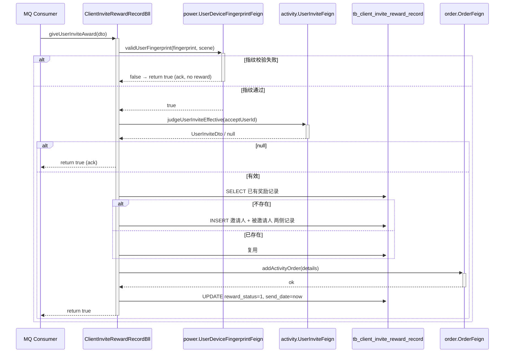

<!-- module: reward -->
<!-- area: architecture -->
<!-- generated-by: reverse-scan -->
<!-- last-scan: 2026-05-20 -->
<!-- source-paths: replay-reward/, replay-generic/.../feign -->

# Reward Architecture (架构 / 拓扑 / 跨模块通信)

## 一、模块定位

`replay-reward` 在依赖图中处于**中下游**：
- 不被任何模块直接 Feign 调用（**未在 replay-generic 暴露 RewardFeign**）。
- 通过 **MQ 消费** 接收 `UserInviteMqDto` 触发发奖流程。MQ Consumer（`@RocketMQMessageListener`）位于 `replay-api/.../listener/RocketMqListener.java`（line 79, 199-213），Producer 分散在 `replay-power/UserBll.java:275`、`replay-order/UserPropertyImpl.java:210`、`replay-words/SensitiveWordsLogicImpl.java:383`、`replay-api/RocketMqListener.java:230` 等多处。
- 同步出站调用 9 个 Feign 接口（见下）完成数据补全 + 实际发奖。

## 二、模块拓扑

```mermaid
graph LR
  api[replay-api] -.->|MQ: UserInviteMqDto<br/>(RocketMqListener)| reward[replay-reward]
  reward -->|Feign| power_user[power: UserFeign]
  reward -->|Feign| power_dfp[power: UserDeviceFingerprintFeign]
  reward -->|Feign| activity_act[activity: ActivityFeign]
  reward -->|Feign| activity_prog[activity: ClientInviteProgressFeign]
  reward -->|Feign| activity_prog_rwd[activity: ClientInviteProgressRewardFeign]
  reward -->|Feign| activity_inv[activity: UserInviteFeign]
  reward -->|Feign| agent_inv[agent: InviteUrlCodeFeign]
  reward -->|Feign| order_pkg[order: PackageFeign]
  reward -->|Feign| order_comm[order: CommodityTypeFeign]
  reward -->|Feign| order_order[order: OrderFeign]
  reward -->|Feign| system_dict[system: DictDataFeign]
  reward -->|RPC| db[(MySQL tb_client_invite_reward_record)]
  reward -.->|writes via| order_order
```

## 三、跨模块通信

### 3.1 入站：MQ 消费

**来源**：MQ Consumer 位于 `replay-api/src/main/java/com/jiuyu/replay/api/listener/RocketMqListener.java`（`@RocketMQMessageListener` on line 79, `processUserInviteActivity` on line 199-213）。Producer 分散在多个模块：`replay-power/UserBll.java:275`、`replay-order/UserPropertyImpl.java:210`、`replay-words/SensitiveWordsLogicImpl.java:383`、`replay-api/RocketMqListener.java:230`。

**消费入口**：`RocketMqListener#processUserInviteActivity` → `ClientInviteRewardRecordBll#giveUserInviteAward(UserInviteMqDto)`
- `giveUserInviteAward` 标注 `@Transactional(rollbackFor = Exception.class)`
- 返回 `boolean`：`true`=ack；`false`=已知失败可忽略；`throw BusinessException(NEED_RETRY)`=重投

⚠️ `@RocketMQMessageListener` 在 `replay-api` 而不在 `replay-reward`，本模块只暴露 Bll 方法供 Listener 调用。

### 3.2 出站：Feign 同步调用列表

| Feign 接口 | 来源模块 | 用途 | 调用频次 |
|---|---|---|---|
| `UserFeign#getLocalUser` | power | 取当前登录用户上下文 | 每请求 1 次 |
| `UserFeign#getUserTenantId(userId)` | power | 邀请人/被邀请人租户 ID | 发奖 2 次 |
| `UserFeign#listByIds` | power | 批量补昵称 | 后台列表 1 次 |
| `UserFeign#listByNameOrPhone` | power | 后台姓名/手机模糊反查 ID | 入参时按需 |
| `UserDeviceFingerprintFeign#getUserDeviceFingerprintByFingerprintAndDeviceType` | power | 防刷指纹查询 | 每发奖 1 次 |
| `UserDeviceFingerprintFeign#saveUserDeviceFingerprint` | power | 新指纹绑定 | 按场景 0-1 次 |
| `ActivityFeign#infoActivateById` | activity | 当前生效活动 | 每流程 1-2 次 |
| `ClientInviteProgressFeign#listClientInviteProgressByActivityIdAndInviteProgressType` | activity | 活动进度配置 | 创建时 2 次 |
| `ClientInviteProgressRewardFeign#listByProgressIds` | activity | 进度下的奖励规则 | 创建时 2 次 |
| `ClientInviteProgressRewardFeign#listByProgressRewardIds` | activity | 进度奖励详情批量取 | 列表展示 1-2 次 |
| `UserInviteFeign#judgeUserInviteEffective` | activity | 邀请关系是否生效 | 发奖 1 次 |
| `UserInviteFeign#getInviteUserNumberByInviteUserId` | activity | 总邀请人数 | summary 1 次 |
| `InviteUrlCodeFeign#getUserInviteUrlCodeByActivityIdUserId` | agent | 当前用户的邀请码 | summary 1 次 |
| `PackageFeign#listAll(1)` | order | 所有版本套餐 | summary / list 1 次 |
| `CommodityTypeFeign#listAll` | order | 所有商品类型 | summary / list 1 次 |
| `OrderFeign#addActivityOrder(List<InviteUserRewardDetailDto>)` | order | **实际发奖出口** | 发奖 1 次（关键） |
| `DictDataFeign#dictDataListByCode("invite_user_reward_code")` | system | 进度码 → label 字典 | 后台列表 1 次 |

⚠️ N+1 / 性能风险：`clientGetUserRewardList` 在 records 遍历中按 `progressRewardIdStr` 拆分后逐条 `listByProgressRewardIds`，但已**前置批量**捞 `progressRewardInfoVoMap` → Map.get 命中，未触发 N+1。

## 四、关键流程：发奖（giveUserInviteAward）



## 五、并发与一致性

### 5.1 事务边界

`giveUserInviteAward` 标 `@Transactional`，但**事务内嵌出站 Feign 调用** `orderFeign.addActivityOrder`——若 OrderFeign 内部抛异常，事务回滚后**已发出的 HTTP 请求无法撤销**。当前依赖 `addActivityOrder` 端自身的幂等。

### 5.2 分布式锁

`DistributedLock` 在调用链上游 `RocketMqListener#processUserInviteActivity` 处应用，锁 key 为 `fingerprintInfo:{fingerprint}`（防同一设备指纹并发）。`giveUserInviteAward` 方法本身未再加锁。

`giveUserInviteAward` 层面的幂等性依靠：
1. `(activityId, rewardTargetType, rewardUserId, rewardSourceUserId)` 查询前置存在性。
2. `rewardStatus=0` 才会进 `inviteCollect` 过滤进入 `addActivityOrder` 调用。
3. UPDATE `reward_status=1` 是单向状态转移。

⚠️ **风险**：若 fingerprint 锁粒度不足以覆盖同一用户的不同指纹场景，两条 MQ 消息**同时**到达时，两个事务都会查到 `rewardStatus=0`，两个都会调 `addActivityOrder`，造成**双发**。该模块依赖 `OrderFeign#addActivityOrder` 的幂等性（按 reward record id 去重）兜底。建议未来补 `DistributedLock` on `(activityId, inviteUserId, passiveUserId)` 在 `giveUserInviteAward` 层面加固。

### 5.3 主从同步处理

指纹查询失败抛 `BusinessException(NEED_RETRY)` → MQ 重试机制。**不重试其他失败场景**（其他都直接 ack 防死循环）。

## 六、设计模式

- **Repository + DAO 双层**（旧 Rse + Service 分层）：`Rse` 是数据访问封装（业务无关的 CRUD + 简单查询），`Service` 是 MyBatis-Plus `IService` 的子类。新代码已不推荐此分层（CLAUDE.md §4 三层架构），保留为读懂旧代码用。
- **In-memory join**：5 个跨模块 Feign 拉数据后用 `Map<Long, X>` 装配，**全程无 SQL JOIN**——符合 jiuyu 反 JOIN 原则。
- **Pair-write**：邀请人和被邀请人两侧记录分别 INSERT（不是同一行存两个 ID），便于按 rewardTargetType 分别查询。

## 七、ADR（待补）

| ADR # | 主题 | 备注 |
|---|---|---|
| `<待补充>` | reward 是否应该独立 Feign 暴露给外部？ | 当前仅 MQ 入站，无 Feign，需澄清是否设计意图 |
| `<待补充>` | 是否补 DistributedLock on 三元组防双发 | 当前依赖下游 OrderFeign 幂等兜底 |

## 八、监控埋点

未发现 `prometheus` / `Micrometer` 显式埋点。请求级日志走 SLF4J（`@Slf4j`），关键节点 log.info/warn/debug，定位问题靠 `userId + fingerprint + rewardRuleCode` 上下文。
