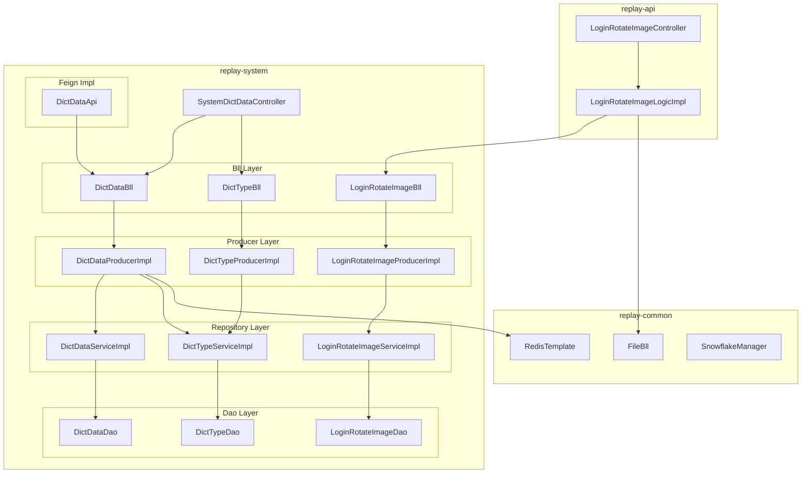

<!-- module: system -->
<!-- area: architecture -->
<!-- generated-by: reverse-scan -->
<!-- last-scan: 2026-05-20 -->
<!-- source-paths: replay-system/src/main/java/com/jiuyu/replay/system/ -->

# System Architecture -- 架构决策与设计

> replay-system 模块的架构基线、设计决策与关键技术约束。作为平台的**配置底座**，几乎所有业务模块都通过 `DictDataFeign` 读取字典配置。

---

## 一、模块定位

replay-system 承载平台的**配置管理基础能力**：

- **字典类型管理**: 字典分类定义（logo/name），管理端 CRUD
- **字典数据管理**: 字典键值对条目，支持树形层级，管理端 CRUD
- **字典查询服务**: 高并发读场景，提供 Redis 缓存 + Feign 接口供所有业务模块查询
- **登录页轮播图**: 客户端登录页轮播图片的 CRUD + 排序管理 + 客户端查询

---

## 二、分层架构

```
┌──────────────────────────────────────────────────────────────────┐
│  Controller                                                      │
│  - replay-system/controller/: SystemDictDataController (1)       │
│  - replay-api/controller/system/: LoginRotateImageController (1) │
├──────────────────────────────────────────────────────────────────┤
│  Logic (replay-api/logic/system/)                                │
│  - LoginRotateImageLogic / Impl  -- Controller 直调              │
│    (装配文件信息 name/url/resourceId 通过 FileBll)               │
├──────────────────────────────────────────────────────────────────┤
│  Bll (replay-system/bll/)                                        │
│  - DictDataBll      -- 字典数据业务逻辑（树构建/值查找/路径拼接）│
│  - DictTypeBll      -- 字典类型业务逻辑（CRUD 转发）             │
│  - LoginRotateImageBll -- 轮播图业务逻辑（CRUD 转发）            │
├──────────────────────────────────────────────────────────────────┤
│  Producer (3 接口 + 3 实现)                                      │
│  - @Service, 完整 CRUD, 缓存管理                                │
│  - 雪花 ID 生成, Entity <-> VO/BO 转换                           │
│  - 仅 LoginRotateImageProducerImpl 加 @Transactional             │
├──────────────────────────────────────────────────────────────────┤
│  Repository Service (3 对)                                       │
│  - IService<Entity> extends ServiceImpl<Dao, Entity>             │
│  - 无自定义业务方法（纯 MyBatis-Plus 代理）                      │
├──────────────────────────────────────────────────────────────────┤
│  Dao (3 个)                                                      │
│  - BaseMapper<Entity>, 无自定义 SQL                              │
└──────────────────────────────────────────────────────────────────┘
```

### 历史分层说明（Bll / Producer / Repository 三层）

system 模块沿用与 words / order / agent / power 相同的历史分层（`@Component Bll` + `@Service Producer` + `@Service RepositoryImpl`）。**本项目不再 push 新代码使用此分层**（CLAUDE.md SS4），新模块/新业务默认 `Controller -> Service -> Mapper` 三层。读懂存量代码时遵循即可。

### 层级职责（存量约定）

| 层 | 职责 | 技术要点 |
|----|------|----------|
| Controller | 参数校验、调用 Logic/Bll、返回 R\<T\> | 构造器注入（SystemDictDataController 使用 `@AllArgsConstructor`） |
| Logic (仅轮播图) | 装配跨模块数据（文件信息）、转发 Bll | `@Resource` 注入 Bll + FileBll |
| Bll | 业务编排、树构建、RRException 校验 | 树构建使用 Hutool TreeUtil，O(n) 迭代路径拼接 |
| Producer | 完整 CRUD、Redis 缓存管理、雪花 ID、Entity 转换 | 缓存 key: `replay:dict:type-logo:{logo}`, TTL 5 天；写操作主动 delete 缓存 |
| Repository Service | MyBatis-Plus IService 代理 | 无自定义方法，全由 Producer 通过 LambdaQueryWrapper 查询 |
| Dao | MyBatis-Plus BaseMapper | 无自定义 XML SQL |
| Api (Feign Impl) | DictDataApi implements DictDataFeign | 构造器注入 DictDataBll，委托 Bll 方法 |

---

## 三、Feign 接口实现

### DictDataApi（Feign 实现类）

`replay-system/api/DictDataApi.java` -- 实现 `DictDataFeign` 接口

| Feign 方法 | 委托 Bll 方法 | 说明 |
|-----------|--------------|------|
| `dictDataByValue(code, value)` | `dictDataBll.dictDataTreeByValue(code, value)` | label 返回树形路径 |
| `dictDataByLabel(code, label)` | `dictDataBll.dictDataByLabel(code, label)` | 精确匹配 |
| `dictDataListByCode(code)` | `dictDataBll.dictDataListByCode(code)` | 启用态列表 |
| `dictDataParentLabelByCode(code)` | `dictDataBll.buildTreePathLabels(dictDataBll.dictDataListByCode(code))` | 带父级路径 label |
| `dictDataTreeListByCode(code)` | `dictDataBll.dictDataTreeListByCode(code, true)` | 树形结构+父级名称 |
| `dictDataListByIds(ids)` | `dictDataBll.dictDataListByIds(ids)` | 按 ID 批量查 |

### DictDataFeign（Feign 接口定义）

`replay-generic/feign/system/DictDataFeign.java` -- 除以上 6 个核心方法外，还提供 5 个 default 便捷方法（无需 Feign 实现类覆写）：

- `getConfigValue(key, label)` -- 取配置字符串值
- `getValueDefault(key, label, defaultValue)` -- 取配置值，无值时默认
- `getDate(key, label)` -- 取配置值解析为 LocalDateTime
- `getConfigValue(key, label, Class<T>)` -- JSON 反序列化为 Bean
- `getConfigList(key, label, Class<T>)` -- JSON Array 反序列化为 List\<T\>

---

## 四、跨模块通信

### 1. Feign 接口（system 暴露 -> 其他模块消费）

定义在 `replay-generic/src/main/java/com/jiuyu/replay/generic/feign/system/DictDataFeign.java`，实现在 `replay-system/api/DictDataApi.java`。

| 消费模块 | 消费类 | 用途 |
|----------|--------|------|
| replay-words | AnchorVideoBll, AnchorUrlBll | 分配标记等字典配置 |
| replay-power | SalesStatisticsBll, UserRemarkLogicImpl | 销售/跟进相关配置 |
| replay-ai | DiagnosisCueBll, ConversationBll | AI 诊断提示词配置 |
| replay-reward | ClientInviteRewardRecordBll | 奖励规则配置 |
| replay-third | AiModelBll, LianLuSmsHandler, SmsConfig, AliSmsProvider, LianLuSmsProvider, AiModelApi | AI 模型配置、短信配置 |
| replay-video | VideoExtractProducer | 视频提取配置 |
| replay-api | OrderScheduledTasks, DefaultSentenceMarkImpl | 订单定时任务、句子标记配置 |

### 2. system 反向依赖（消费其他模块）

| 调用方向 | 依赖 | 用途 |
|----------|------|------|
| system -> common | `FileBll` (通过 Logic 层间接调用) | 轮播图文件信息装配（获取 url/name/resourceId） |
| system -> common | `SnowflakeManager` (Producer 层) | ID 生成 |
| system -> common | `RedisTemplate<String, Object>` (Producer 层) | 字典缓存读写 |
| system -> common | `RRException` (Bll 层) | 业务校验异常 |

> system 模块**未发现** RocketMQ 生产者/消费者、@Scheduled 定时任务、@NoRepeatSubmit 防重复提交。

---

## 五、缓存策略（Redis）

### 唯一 Redis Key

| Key 模式 | 数据类型 | TTL | 读写路径 |
|----------|----------|-----|----------|
| `replay:dict:type-logo:{logo}` | String (JSON Array of DictDataListVo) | 5 天 | `DictDataProducerImpl.listByTypeLogo()` 方法内 Cache-Aside |

### Cache-Aside 流程

```
读:
  1. redisTemplate.opsForValue().get(key)
  2. 命中 -> JSON.parseArray(json, DictDataListVo.class) 直接返回
  3. miss -> 查 tb_dict_type(logo) + tb_dict_data(type_id, order by sort)
          -> Entity -> DictDataListVo (BeanUtils.copyProperties)
          -> redisTemplate.opsForValue().set(key, JSON.toJSONString(list), Duration.ofDays(5))
          -> 返回 list

写/删:
  任何 DictData 变更（save/update/deleteById）
  -> 查新旧 typeLogo
  -> redisTemplate.delete("replay:dict:type-logo:" + logo)
  -> 再写 DB（非事务原子操作）
```

### 一致性问题

- **写操作非原子**: 先删缓存再写 DB，两步之间可能有并发读回填旧数据
- **无分布式锁**: 缓存 miss 后的回填未加锁，高并发时可能缓存击穿
- **降级策略**: 未发现 Redis 降级检测（无 ResilientRedisTemplate 使用），Redis 故障时每次请求均直查 DB

---

## 六、安全 / 鉴权机制

### 鉴权现状
- `SystemDictDataController` 的 9 个 GET 端点**未显式加 token 鉴权**（字典查询接口为公共服务）
- `LoginRotateImageController` 的 6 个端点由 replay-api 统一 AOP 拦截鉴权（`noPage` 方法为客户端公开查询，可能豁免 token）
- 字典数据为用户无关的全局配置，租户隔离不适用（无 tenantId 字段）
- Feign 调用为内部服务间通信，无额外鉴权

### 敏感字段
- 无密码、手机号、身份证等敏感字段
- 轮播图 `fileId` 间接关联文件（文件鉴权由 FileBll 管理）

---

## 七、关键设计模式

| 模式 | 在 system 模块的应用 |
|------|-------------------|
| **Cache-Aside** | 字典数据查询：先读 Redis，miss 后查 DB 并回填；写操作先删缓存 |
| **Facade** | `DictDataApi` 作为 Feign 统一入口，封装内部 Bll 复杂度 |
| **Tree Builder** | `DictDataBll.buildTree()` 使用 Hutool TreeUtil 构建字典树形结构，支持递归 children |
| **Anti-JOIN Assembly** | 字典列表 typeName 装配、轮播图文件信息装配均采用"先查主表 -> 取外键集合 -> 批量查关联表 -> Map 内存装配"模式 |
| **Sort Auto-Increment** | `LoginRotateImageProducerImpl.toUpdateSort()` 插入/修改时自动将后续记录的 sort+1，保证序号连续 |

避开的反模式：
- 不在 Bll/Producer 间使用 `@Autowired`（Bll 用 `@Resource`，Controller/Feign 用构造器注入 `@AllArgsConstructor`）
- 不在新表使用 `@TableLogic`（Entity 虽有 isDeleted 字段但未启用）
- 不跨模块直连 Dao（唯一外部调用通过 Feign）

---

## 八、三层 Bll/Producer/Service 关系图



---

## 九、关键约束（投影自 CLAUDE.md SS5）

- **DI**: 新代码构造器注入；存量 Bll 使用 `@Resource`（不强行重构）；`SystemDictDataController` 和 `DictDataApi` 已使用 `@AllArgsConstructor` 构造器注入
- **R\<T\>**: Controller 必须返回 `R<T>`，禁裸返业务对象
- **Snowflake ID**: 所有新增实体走 `SnowflakeManager.nextValue()` + `@TableId(type=IdType.INPUT)`
- **软删除**: 手动 `isDeleted`（虽当前代码未启用软删除语义）
- **时间戳**: `new Date()` 显式赋值 `createDate` / `updateDate`
- **租户隔离**: system 模块无 tenantId（全局配置），不适用
- **事务**: 写方法应加 `@Transactional(rollbackFor = Exception.class)`（当前仅 `toUpdateSort` 有，其余缺失）
- **Bean 拷贝**: Spring `BeanUtils.copyProperties`（DictDataProducerImpl）或 Hutool `BeanUtil.copyProperties`（LoginRotateImageProducerImpl）混用
- **缓存失效**: 写操作主动删除 Redis key，不设 TTL 之外的被动过期策略

---

## 十、未涵盖 / 待补充

- `<待补充>` 管理端 DictData/DictType 的完整 CRUD 端点路径（scan 中发现 Bll 提供了 CRUD 方法但未找到对应 Controller，可能在 replay-api 中通过通用模板/代码生成器暴露）
- `<待补充>` 字典缓存一致性改进方案（加分布式锁 / 延迟双删 / Canal 监听）
- `<待补充>` 完整的 Redis key 规范迁移（当前 key 为硬编码字符串 `"replay:dict:type-logo:" + logo`，建议统一到常量类）
- `<待补充>` is_deleted 软删除的启用或清理（当前三张表全为物理删除，Entity 的 isDeleted 字段处于废弃状态）
- `<待补充>` 事务边界的补充（DictData/DictType 的 save/update/delete 方法缺乏 @Transactional 保护）
