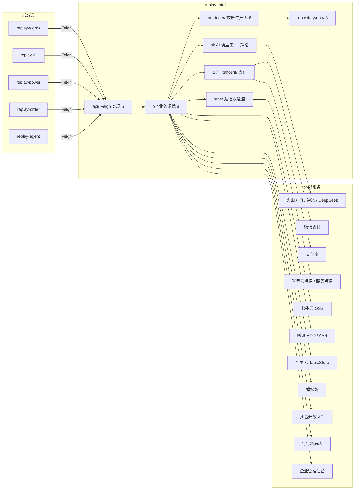

<!-- module: third -->
<!-- area: architecture -->
<!-- generated-by: reverse-scan -->
<!-- last-scan: 2026-05-20 -->
<!-- source-paths: replay-third/src/main/java/com/jiuyu/replay/third/ -->

# Third Architecture -- 架构决策与设计

> replay-third 模块的架构基线、设计决策与关键技术约束。作为平台的**第三方服务集成层**，聚合所有外部服务调用（AI 模型、支付、短信、存储、数据分析），通过 Feign 向业务模块暴露统一 API。

---

## 一、模块定位

replay-third 承载平台的**外部服务网关**：

- **AI 模型集成**: 豆包（火山方舟）、通义千问、DeepSeek 多厂商统一调用
- **支付**: 微信支付（Native Pay） + 支付宝（Page Pay），提供下单/查单/关单/回调验签
- **短信**: 阿里云 + 联麓双通道，自动故障转移
- **存储**: 七牛云 OSS（上传 Token）、腾讯 VOD（上传签名）、腾讯 ASR（语音识别临时凭证）
- **弹幕存储**: 阿里云 TableStore 表格存储（多元索引 SQL 查询 + 二级索引范围查询）
- **第三方数据**: 蝉妈妈（chanmama）数据平台集成
- **抖音开放 API**: 抖音主播搜索
- **企业治理**: 企业管理后台 HTTP 集成（租户状态 / 员工管理 / 直播间主播）
- **通知**: 钉钉机器人 Webhook
- **代理 IP**: 代理 IP 池管理与提取记录

---

## 二、模块拓扑



---

## 三、分层架构

```
┌──────────────────────────────────────────────────────────────────┐
│  HTTP Controller                                                │
│  - 管理端 API: replay-api/controller/third/  (8 个 Controller)   │
│  - 模块内 controller: replay-third/controller/            (2 个)  │
├──────────────────────────────────────────────────────────────────┤
│  Feign 实现 (Api)                                                │
│  - 6 个 Feign 接口实现 + 1 个 Douyin OpenFeign 实现               │
│  - 将外部调用包装为统一内部 API                                     │
├──────────────────────────────────────────────────────────────────┤
│  Bll (业务逻辑层) — 8 个                                          │
│  - AiModelBll, ChanmamaAccountBll, CosThumbsFileBll, MsgBll,     │
│    PayBll(已注释), ProxyIpBll, ProxyIpRecordBll, TableStoreBll   │
│  - @Component, 组装 Producer + Feign + 外部工具类调用               │
├──────────────────────────────┬───────────────────────────────────┤
│  Producer (5 接口 + 5 实现)   │  外部工具类                        │
│  - AiModelProducer           │  - ai/ (模型工厂+策略模板)          │
│  - ChanmamaAccountProducer   │  - sms/ (短信双通道+故障转移)       │
│  - CosThumbsFileProducer     │  - ali/ (Alipay, DingDing, AliMsg) │
│  - ProxyIpProducer           │  - tencent/ (WeChatPay)            │
│  - ProxyIpRecordProducer     │  - qiniu/ (QiNiuOssUtils)          │
│  @Transactional 标注          │  - zijie/ (ZiJieUtils 火山方舟)     │
│                              │  - chanmama/ (ThirdDataUtils)      │
│                              │  - douyin/ (DouyinOpenFeignImpl)   │
│                              │  - tablestore/ (TableStore 工具)    │
│                              │  - shlianlu/ (LianLuSmsHandler)   │
│                              │  - governance/ (企业后台 HTTP)     │
├──────────────────────────────┴───────────────────────────────────┤
│  Dao (BaseMapper<Entity>) — 8 个                                 │
│  - AiModelDao, AudioLogDao, ChanmamaAccountDao, CosThumbsFileDao │
│  - LogAudioCollectDao, LogAudioDao, ProxyIpDao, ProxyIpRecordDao │
├──────────────────────────────────────────────────────────────────┤
│  Entity — 8 个                                                   │
│  - AiModelEntity, AudioLogEntity, ChanmamaAccountEntity,          │
│    CosThumbsFileEntity, LogAudioCollectEntity, LogAudioEntity,    │
│    ProxyIpEntity, ProxyIpRecordEntity                             │
└──────────────────────────────────────────────────────────────────┘
```

### 历史分层说明（Bll / Producer / Rse 三层）

third 模块沿用与 words / order / agent 相同的历史分层（`@Component Bll` + `@Service Producer`）。**本项目不再 push 新代码使用此分层**（CLAUDE.md §4），新模块/新业务默认 `Controller → Service → Mapper` 三层。读懂存量代码时遵循即可。

third 模块**没有** Rse 层（Feign 提供方实现在 `api/` 包下直接委托 Bll）。

### 层级职责（存量约定）

| 层 | 允许操作 | 禁止操作 |
|----|----------|----------|
| Controller | 参数校验、调用 Bll、返回 R<T> | 直接调 Dao / 含业务逻辑 |
| Api (Feign Impl) | Feign 接口实现，委托 Bll 或直接调工具类 | 业务逻辑（委托 Bll） |
| Bll | 组合 Producer 调用、与外部工具类交互、简单转换 | `@Transactional` / 直接操作 Entity |
| Producer | 完整 CRUD、`@Transactional(rollbackFor = Exception.class)`、Entity↔VO 转换、雪花 ID 生成 | 跨模块调用（必须通过 Feign） |
| Dao | MyBatis-Plus 单表 CRUD | 业务装配 |

---

## 四、ADR 记录

### ADR-001: AI 模型多厂商工厂模式统一调用

- **决策**: `ModelFactoryUtils.getAiModel(resourceType)` 工厂根据 resourceType (0=豆包, 1=通义, 2=DeepSeek) 创建对应 `AiModel` 实现
- **原因**: 屏蔽厂商 API 差异，上层业务（AiApi）只需调 `aiModel.chatCompletion()` 无需关心底层 SDK
- **影响**: 新增厂商只需加一个 impl 类 + 工厂分支；`AiStrategy` 策略接口预留了上下文缓存/无缓存两种模式

### ADR-002: 短信双通道自动故障转移（Chain of Responsibility）

- **决策**: `SmsServiceImpl` 递归调用实现自动降级：默认提供商失败 → 按 `fallbackProviders` 列表顺序切换 → 最大 10 次递归
- **原因**: 避免单一短信通道故障导致全站验证码不可用；阿里云和联麓互为备份
- **影响**:
  - 模板 ID 通过字典 `unified_providers_template_code` 映射到各提供商的实际上行模板号
  - 支持 `sms.enabled` 全局开关，紧急情况下可禁用短信发送
- **代价**: 递归深度限制 10 次防止栈溢出；Provider 注册靠 Spring `List<AbstractSmsProvider>` 自动注入

### ADR-003: 弹幕数据用阿里云 TableStore 而非 MySQL

- **决策**: 弹幕数据（BarrageBo）存储在阿里云表格存储（TableStore），通过 SQL 多元索引 + 二级索引两种方式查询
- **原因**: 弹幕数据量大（单场直播可达数万条）、写入频率高、需要多维查询（时间范围 + 昵称模糊 + 等级范围）；TableStore 的多元索引支持复杂组合查询且成本低于自建 ES
- **影响**:
  - `TableStoreBll` 提供两套查询接口：多元索引 SQL（`queryDanMuSearchData`，支持模糊搜索 + 复杂过滤）和二级索引范围查询（`queryDanMuData`）
  - 弹幕数据带 Redis 缓存（2 小时 TTL），减少 TableStore 读费用
  - `TableStoreServiceUtils` 封装了批量写入（每批 200 条）、SQL 查询、范围查询等操作
- **代价**: 依赖阿里云 TableStore SDK (`com.alicloud.openservices.tablestore.SyncClient`)；运维需关注 TableStore 容量和索引重建

### ADR-004: AI Token 消耗记录复用 order 模块的 Feign

- **决策**: `AiApi.chatCompletion` 每次 AI 调用后通过 `AiTokenUseRecordFeign.saveAiTokenUseRec()` 记录 token 消耗到 `tb_ai_token_use_record`
- **原因**: token 消耗与订单/套餐计费强相关，记录表归属 order 模块更合理；third 模块只负责调用和上报，不管理计费逻辑
- **影响**: third → order 方向 Feign 依赖，形成循环依赖风险（实际通过接口分离 + Spring 懒加载避免）

### ADR-005: 支付能力下沉 third 模块但回调入口在 order

- **决策**: 微信支付 SDK (`WeChatPay`) 和支付宝 SDK (`Alipay`) 封装在 third 模块；但支付回调 endpoint 由 replay-order 提供
- **原因**: third 模块负责 SDK 封装和协议细节；order 模块负责订单状态机和业务处理；回调验签后委托 `PayBll.wechatPayCallbackHandle()` 解析
- **影响**: `PayBll` 当前已被注释（`//@Component`），支付流程实际由 order 模块直调 `WeChatPay` / `Alipay` 组件

### ADR-006: 企业治理集成通过 HTTP 直调而非独立 SDK

- **决策**: `GovernanceTenantServiceImpl` / `GovernanceEmployeeServiceImpl` / `GovernanceLiveRoomServiceImpl` 通过 `GovernanceHttpServer`（RestClient 封装）直调企业管理后台 REST API
- **原因**: 企业管理后台是本体系内服务，无独立 SDK；HTTP 直调简单可控
- **影响**: 强依赖企业管理后台可用性；无熔断/降级（当前未接入 Resilience4j）

---

## 五、定时任务

| 任务类 | 触发器 | 功能 | 状态 |
|--------|--------|------|------|
| `ScheduledTasks` | `@Scheduled(cron = "0/13 * * * * ?")` | qpsCount: 每 13 秒统计 ASR QPS 峰值和用户量，从 Redis 取日志批量写入 `tb_log_audio_collect` | **已注释**，废弃 |
| `ScheduledTasks` | `@Scheduled(cron = "0/10 * * * * ?")` | batchSaveAudioLog: 每 10 秒批量写入语音识别日志到 `tb_audio_log` | **已注释**，v1.9.10 后废弃 |
| `ChanmamaScheduledTasks` | `@XxlJob("refreshChanmamaToken")` | refreshChanmamaToken: 每 5 分钟刷新蝉妈妈登录 token | **活跃**，XXL-JOB 调度 |
| `ChanmamaScheduledTasks` | `@Scheduled(cron = "0 0 0 * * ?")` | refreshChanmamaQueryNum: 每天凌晨刷新蝉妈妈查询次数 | **已注释** |

### 启动初始化

`ThirdStartInit.@PostConstruct init()`: Spring 启动后初始化每个腾讯语音识别 secret 的 QPS 余量到 Redis（`tencentAudioProperties.redisKeyPrefix + secretId → qpsNum`）

---

## 六、跨模块通信

### 1. Feign 接口（third 暴露 → 其他模块消费）

定义在 `replay-generic/src/main/java/com/jiuyu/replay/generic/feign/third/`，实现在 `replay-third/api/`：

| Feign 接口 | 实现类 | 方法数 | 主要消费方 |
|------------|--------|--------|-----------|
| `AiFeign` | `AiApi` | 5 | replay-ai (诊断/对话), replay-words (文稿分析) |
| `AiModelFeign` | `AiModelApi` | 5 | replay-ai (模型查询/列表) |
| `ChanmamaFeign` | `ChanmamaApi` | 3 | replay-words (蝉妈妈数据) |
| `SmsServiceFeign` | `SmsServiceApi` | 1 | replay-power, replay-order (短信发送) |
| `TableStoreFeign` | `TableStoreApi` | 2 | replay-words (弹幕查询) |
| `PropertiesFeign` | `PropertiesApi` | 1 | 内部使用 (火山引擎配置) |
| `GovernanceLiveRoomService` | `GovernanceLiveRoomServiceImpl` | 1 | replay-words (添加主播到企业后台) |
| `DouyinOpenFeign` | `DouyinOpenFeignImpl` | 1 | replay-words, replay-agent (抖音主播搜索) |

### 2. Feign 反向依赖（third 消费其他模块）

third 模块自身需调用：

| 调用方向 | Feign | 用途 |
|----------|-------|------|
| third → words | `SensitiveWordsFeign` | 获取语音分析结果用于弹幕聚合 |
| third → words | `AnchorVideoFeign` | 获取视频信息（平台类型、切片信息） |
| third → system | `DictDataFeign` | 字典数据查询（client_ai_model / use_model_way / unified_providers_template_code 等） |
| third → order | `AiTokenUseRecordFeign` | 记录 AI Token 消耗 |
| third → power | `UserFeign` (间接) | 用户信息（通过 common 的 GlobalObject 获取） |

### 3. 共享 Service 调用（同 JVM Spring 直注入）

third 模块的 Bll/Api 中通过 `@Resource` 或构造器注入直接调用 common 模块：
- `SystemKvBll` / `SystemKvProducer` -- 系统 KV 配置（ai_question_gen_model / ai_question_length / client_ai_model_default 等）
- `RedisTemplate<String, Object>` -- Redis 缓存操作
- `GovernanceHttpServer` -- 企业管理后台 HTTP 客户端
- `AiRedisOperate` -- AI 模型临时 token 的 Redis 过期管理

### 4. MQ 通信

**replay-third 没有 RocketMQ 生产者或消费者**。所有 MQ 通信在 words / order / activity 等业务模块。

已注释的 `RedisTimeoutThirdListener`（`KeyExpirationEventMessageListener`）曾用于监听 Redis key 过期事件，补回腾讯语音识别 QPS 余量。

---

## 七、缓存策略（Redis）

### Redis Key 与用途

| Key 模式 | 用途 | TTL |
|----------|------|-----|
| `RedisCacheKey.barrageDataCacheKey + videoId` | 弹幕数据缓存 | 2 小时 |
| `replay:words:barrageAnnotation:{videoId}[_{isBlessBag}]` | 弹幕标注聚合结果 | 14 天 |
| `tencentAudioProperties.redisKeyPrefix + {secretId}` | 腾讯语音识别 QPS 余量 | 启动初始化，无 TTL |
| `tencentAudioProperties.qpsLogKeyPrefix + *` | QPS 日志暂存（已废弃） | -- |
| `RedisCacheKey.aiTempArkTokenCacheKey + {modelCode}` | AI 模型临时 token（火山方舟 API Key） | 由 `AiRedisOperate.getAiModelExpire()` 决定 |
| `chanmamaProperties.tokenRedisKey + {accountId}` | 蝉妈妈登录 token | 30 分钟 |
| `weChatPayProperties.codeUrlRedisKey + {orderId}` | 微信支付二维码 URL 缓存 | 订单超时分钟数 |
| `aliPayProperties.codeUrlRedisKey + {orderId}` | 支付宝支付二维码 URL 缓存 | 订单超时分钟数 |

### 一致性策略
- 弹幕数据：缓存优先，未命中查 TableStore → 写入缓存
- AI 临时 token：`AiRedisOperate` 管理过期，火山方舟 API Key 有独立有效期
- 支付二维码：写入时设 TTL（订单超时分钟数），过期自动失效
- QPS 余量：启动时全量初始化，运行时通过 `addSurplus` 归还

---

## 八、安全 / 鉴权机制

### 支付安全
- **微信支付**: 使用 `wechatpay-java` SDK，商户证书 + APIv3 key 验签；回调验签通过 `NotificationParser` + 请求头签名
- **支付宝**: 使用 `alipay-sdk-java`，公钥证书验签；`AlipayClient.certificateExecute()` SDK 自动验签

### API 密钥管理
- 火山方舟：AccessKey + SecretKey 通过 `VolcengineProperties` 配置注入，临时 API Key 通过 `ArkApi.getApiKey` 动态生成
- 七牛云：AccessKey + SecretKey 通过 `QiNiuProperties` 配置注入
- 腾讯云：SecretId + SecretKey 通过 `TencentAudioProperties` 配置注入
- 蝉妈妈：Token 通过登录接口动态获取，Redis 缓存 30 分钟
- 联麓短信：AppId + AppSecret 通过 `LianLuProperties` YAML 配置注入，MD5 签名

### 敏感字段
- 所有 AccessKey/SecretKey 不入日志
- 手机号在短信发送前校验格式（`PhoneUtil.isMobile()`），非法号码不入日志详情
- 支付金额 / 订单号日志脱敏

---

## 九、关键设计模式

| 模式 | 在 third 模块的应用 |
|------|-------------------|
| **Factory** | `ModelFactoryUtils.getAiModel(resourceType)` -- 根据厂商类型创建 AI 模型实例；`ModelFactoryUtils.getModel(hasContext)` -- 创建上下文缓存模型 |
| **Strategy** | `AiStrategy` 接口 + `AbstractAiStrategy` / `ContextCacheAIStrategy` / `NoContextCacheAIStrategy` -- AI 策略模板 |
| **Template Method** | `AbstractSmsProvider` 定义 `doSend()` 模板，`AliSmsProvider` / `LianLuSmsProvider` 实现具体发送逻辑 |
| **Chain of Responsibility** | `SmsServiceImpl` 递归故障转移：默认提供商失败 → 自动切换到备用提供商（最多 10 次） |
| **Façade** | `AiApi` / `AiModelApi` / `ChanmamaApi` 等 Feign 实现类封装内部 Bll/Producer/工具类复杂性 |
| **Producer** | `AiModelProducer` / `ChanmamaAccountProducer` 等 -- 历史分层中的 Producer 模式，封装 CRUD + 事务 |
| **Adapter** | `DouyinOpenFeignImpl` -- 将 HTTP 调用适配为 Feign 接口；`GovernanceLiveRoomServiceImpl` -- 将企业后台 REST API 适配为 Feign 接口 |
| **Annotation-driven** | `TableStoreSaveAnnotation` / `TableStoreRangeAnnotation` 用于 TableStore 实体映射；`@CustomRedissonLock` 用于蝉妈妈 API 防并发 |

避开的反模式：
- ❌ 不在 Bll 层加 `@Transactional`（事务边界统一在 Producer）
- ❌ 不在 Feign 实现层直接调 Dao（必须通过 Bll / Producer）
- ❌ 不在跨模块场景直连 Dao（必须 Feign）

---

## 十、外部集成一览

| 外部服务 | 集成方式 | 核心类 |
|----------|---------|--------|
| 火山方舟 (豆包 AI) | Ark SDK (`com.volcengine.ark.runtime`) | `ZiJieUtils`, `DoubaoAiModelImpl`, `AiGeneralUtils` |
| 通义千问 | HTTP 直调 | `TongyiAiModelImpl` |
| DeepSeek | HTTP 直调 (`DeepSeekHttpClient`) | `DeepSeekAiModelImpl` |
| 微信支付 | `wechatpay-java` SDK | `WeChatPay` |
| 支付宝 | `alipay-sdk-java` SDK | `Alipay` |
| 阿里云短信 | `dysmsapi20170525` SDK | `AliSmsProvider` |
| 联麓短信 | HTTP POST + MD5 签名 | `LianLuSmsHandler`, `LianLuSmsProvider` |
| 阿里云 TableStore | `tablestore` SDK (`SyncClient`) | `TableStoreUtils`, `TableStoreServiceUtils`, `TableStoreBll` |
| 七牛云 OSS | `qiniu-java-sdk` | `QiNiuOssUtils` |
| 腾讯 VOD / ASR | `tencentcloud-sdk-java` (在 replay-common) | 管理端 Controller 调用 replay-common 中的工具类 |
| 蝉妈妈 | Java 11 `HttpClient` + HMAC 签名 | `ThirdDataUtils` |
| 抖音开放 API | `RestClient` HTTP GET | `DouyinOpenFeignImpl` |
| 钉钉机器人 | Java 11 `HttpClient` POST | `DingDingUtils` |
| 企业管理后台 | `GovernanceHttpServer` (RestClient 封装) | `GovernanceTenantServiceImpl` 等 |

---

## 十一、关键约束（投影自 CLAUDE.md §5）

- **DI**: 存量代码大量使用 `@Resource`；新代码倾向构造器注入（`GovernanceLiveRoomServiceImpl` 等新类已采用）
- **R<T>**: Controller 必须返回 `R<T>`，禁裸返业务对象
- **Snowflake ID**: 所有新增实体走 `SnowflakeManager.nextValue()` + `@TableId(type=IdType.INPUT)`
- **软删除**: 手动 `isDeleted`，禁 `@TableLogic`（`tb_audio_log` 等表有 `is_deleted` 字段，手动设值）
- **时间戳**: `new Date()` / `LocalDateTime.now()` 显式赋值 `createDate` / `updateDate`
- **租户隔离**: 弹幕查询等跨租户数据操作必须带 `tenantId` 过滤
- **事务**: 所有 Producer 写方法 `@Transactional(rollbackFor = Exception.class)`；Bll 层不标注事务
- **Bean 拷贝**: Hutool `BeanUtil.copyProperties` 或 `BeanUtil.copyToList`（存量代码倾向 Hutool）
- **PayBll 已注释**: `PayBll` 被 `//@Component` 注释，支付流程实际由 replay-order 模块直接使用 `WeChatPay` / `Alipay` 组件

---

## 十二、数据库表（MySQL）

| 表名 | Entity | 说明 |
|------|--------|------|
| `tb_ai_model` | `AiModelEntity` | AI 模型配置（modelCode, modelName, resourceType, endpointId, wordsNum, outWordNum 等） |
| `tb_chanmama_account` | `ChanmamaAccountEntity` | 蝉妈妈账号（everyDayQueryNum 每日额度等） |
| `tb_proxy_ip` | `ProxyIpEntity` | 代理 IP 池（ip, port, validityType 短效/长效, remainingNum 剩余次数等） |
| `tb_proxy_ip_record` | `ProxyIpRecordEntity` | 代理 IP 提取记录 |
| `tb_cos_thumbs_file` | `CosThumbsFileEntity` | 点赞问答文件 COS 上传记录（contextId, fileUrl 等） |
| `tb_audio_log` | `AudioLogEntity` | 语音识别调用日志（已废弃，v1.9.10 后不再写入） |
| `tb_log_audio` | `LogAudioEntity` | 语音识别日志（另一张表） |
| `tb_log_audio_collect` | `LogAudioCollectEntity` | 语音识别 QPS 统计（qpsNumCount, userNumCount, callDate） |

> TableStore 中弹幕表 `barrage-table-name`（YAML 配置 `third.ali.tablestore.barrage-table-name`）和主播用户表 `anchor-user-table-name` 不属于 MySQL，是阿里云表格存储。

---

## 十三、未涵盖 / 待补充

- `<待补充>` 火山方舟/通义/DeepSeek 具体 API 调用参数和响应格式（实现类约 200+ 行，值得单独文档）
- `<待补充>` 蝉妈妈完整 API 接口文档（修正查询 / 相似达人 / 榜单的请求/响应结构）
- `<待补充>` TableStore 表格存储的多元索引配置和二级索引设计
- `<待补充>` 支付签名/验签的完整时序图（微信支付回调验签流程）
- `<待补充>` AI 模型上下文缓存（ContextCache）的 Redis key 设计和清理策略
- `<待补充>` 代理 IP 池的定时刷新和失效检测机制
- `<待补充>` 钉钉通知的完整消息模板和使用场景
