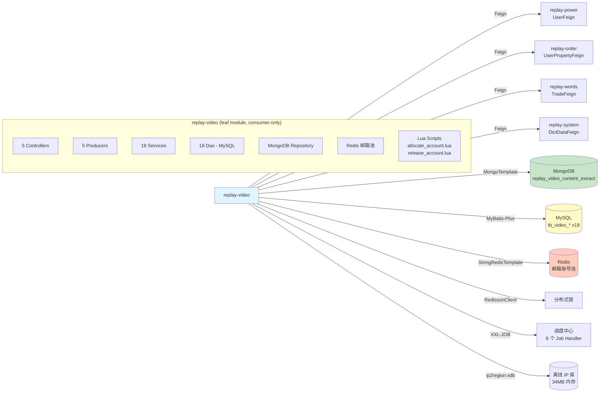

<!-- module: video -->
<!-- area: architecture -->
<!-- generated-by: reverse-scan -->
<!-- last-scan: 2026-05-20 -->
<!-- source-paths: replay-video/src/main/java/com/jiuyu/replay/video/ -->

# Video Architecture — 架构决策与设计

> replay-video 模块的架构基线、设计决策与关键技术约束。该模块是平台的**短视频数据中台**，承载视频文案提取、爆款搜索、达人管理与邮箱账号池等核心能力。采用 MySQL (MyBatis-Plus) + MongoDB (单集合) + Redis (邮箱池 + Lua 原子操作) 混合存储。

---

## 一、模块定位

replay-video 承载平台的**短视频业务能力**：

- **视频文案提取**: URL 链接 / 本地上传 → 状态机（PENDING → PROCESSING → COMPLETED / FAILED）→ MongoDB 文案落地，hash 去重跨用户复用
- **爆款搜索**: 多平台短视频关键词搜索 / 订阅 / 分组管理 / 数据分析
- **达人管理**: 达人搜索 / 订阅 / 信息同步 / 详情视频浏览
- **通用分组管理**: 达人分组 + 爆款订阅分组的 CRUD
- **邮箱账号池**: Redis + Lua 驱动的智能账号池（同城优先分配、IP 1h 黏性、原子操作、超时自动释放）
- **资产统计**: 用户短视频资产（订阅达人/爆款数量）实时同步至 order 模块

---

## 二、分层架构

```
┌───────────────────────────────────────────────────────────────┐
│  Controller (5 个，全部在 replay-video 模块内)                  │
│  - VideoExtractController              /replay/video/extract    │
│  - VideoHotSearchController           /replay/video/hotSearch   │
│  - VideoInfluencerController          /replay/video/influencer  │
│  - VideoHotSearchEmailAccountController /replay/video/hotSearch/email │
│  - VideoGroupManagementController      /replay/video/group      │
├───────────────────────────────────────────────────────────────┤
│  Producer (5 个 @Component 业务编排层)                          │
│  - VideoExtractProducer              状态机分发 + Mongo upsert   │
│  - VideoHotSearchProducer             爆款搜索/订阅/同步         │
│  - VideoInfluencerProducer            达人搜索/订阅/同步         │
│  - VideoHotSearchEmailAccountProducer 邮箱账号池管理入口         │
│  - VideoGroupManagementProducer       通用分组 CRUD              │
├──────────────────────┬────────────────────────────────────────┤
│  Service (19 对)      │  MongoRepository (1 个)                 │
│  IService<Entity>     │  VideoExtractContentRepository          │
│  + ServiceImpl        │  MongoUpsertService (原子 upsert 工具)   │
│  + TransactionService │                                        │
├──────────────────────┴────────────────────────────────────────┤
│  Dao (18 个, BaseMapper<Entity>) — MySQL                        │
└────────────────────────────────────────────────────────────────┘
```

### 分层说明

video 模块沿用项目历史分层（Producer / Service / Dao），**没有** Bll / Rse（Api）层。本模块是**叶子模块**（纯消费者），不向其他模块暴露 Feign 接口。

### 层级职责

| 层 | 允许操作 | 禁止操作 |
|----|----------|----------|
| Controller | 参数校验、调用 Producer、返回 R\<T\> | 直接调 Dao / 含业务逻辑 |
| Producer | 业务编排、`@Transactional(rollbackFor = Exception.class)`、Feign 调用、状态机分支、Mongo upsert、分布式锁 | 跨模块 Dao 直连 |
| Service | MyBatis-Plus 基础 CRUD + Redis 操作（邮箱池 Service） | 跨 Service 直接组装（委托 Producer） |
| TransactionService | 独立事务 Bean（`@Transactional` 在 Spring AOP 代理内生效） | 大段业务逻辑 |
| Dao | 单表 CRUD + XML 自定义批量查询（如 `batchQueryByPlatformAndVideoIds`） | 业务装配 |
| MongoRepository | MongoDB 集合的查询 + `MongoUpsertService` 原子 upsert | 业务逻辑 |

---

## 三、模块拓扑



> replay-video **不暴露任何 Feign 接口**给其他模块。`replay-generic/feign/` 下没有 `video/` 子目录。所有对 video 数据的访问必须通过 Controller HTTP 入口。

---

## 四、跨模块通信

### 4.1 Feign 出向（video 消费其他模块）

| Feign 接口 | 来源模块 | 使用位置 | 用途 |
|------------|----------|----------|------|
| `UserFeign` | power | 所有 Producer | `getLocalUser()` 获取当前用户、`getUserTenantId(userId)` 获取租户、`listByIds(ids)` 批量查 |
| `UserPropertyFeign` | order | VideoExtractProducer, VideoHotSearchProducer | 短视频资产扣减/统计（`useShortVideoProperty`、`updateByPropertyNumRetBoolean`、`syncSubAccountCount`） |
| `TradeFeign` | words | VideoHotSearchProducer, VideoInfluencerProducer | 行业分类信息查询 |
| `DictDataFeign` | system | VideoExtractProducer | 字典数据（AI 模型类型等） |

### 4.2 Feign 入向（其他模块调用 video）

**当前为空。** replay-video 是纯消费者叶子模块。

### 4.3 共享 Service 调用（同 JVM Spring 直注入）

video 模块（Producer 层）通过构造器注入直接调用 common 模块：
- `SystemKvService` — 全局 KV 配置（如 `short_video_duration_max`、`optimize_extract_copy_ai_code`、`optimize_extract_copy_prompt`）
- `ImgOssUtils` — OSS 图片预签名 URL
- `SnowflakeManager` — 全局雪花 ID
- `BeanConvertUtils` — Entity/VO 转换
- `RedissonClient` — 分布式锁
- `BusinessCachePrefix` — Redis Key 前缀常量

### 4.4 MQ 通信

**当前 video 模块未使用 RocketMQ / Kafka。** 无 `@RocketMQMessageListener`、无 MQ 生产者、无 MQ 消费者。跨模块异步通信通过 XXL-JOB 定时任务实现。

### 4.5 Controller 路径

| Controller | 路径前缀 | Tag |
|------------|----------|-----|
| `VideoExtractController` | `/replay/video/extract` | V2.5.3 短视频/短视频提取文案模块 |
| `VideoHotSearchController` | `/replay/video/hotSearch` | V2.5.3 短视频/爆款管理模块 |
| `VideoInfluencerController` | `/replay/video/influencer` | V2.5.3 短视频/达人管理模块 |
| `VideoHotSearchEmailAccountController` | `/replay/video/hotSearch/email` | V2.5.3 短视频/热搜邮箱账号管理 |
| `VideoGroupManagementController` | `/replay/video/group` | V2.5.3 短视频/分组管理模块 |

> 所有 Controller 均部署在 replay-video 模块内部，**不通过 replay-api 转发**。管理端功能通过 `/admin/...` 子路径在 Controller 内区分。

---

## 五、数据存储

### 5.1 MySQL 表（18 张，MyBatis-Plus）

| Entity | 用途 |
|--------|------|
| `VideoInfoEntity` | 视频基础信息（标题、URL、hash、平台类型、作者、提取状态） |
| `VideoInfoDailyDataEntity` | 视频每日增量数据（点赞/评论/转发/收藏增长） |
| `VideoUserVideoEntity` | 用户-视频关联（提取任务记录，含状态机） |
| `VideoHotSearchEntity` | 爆款搜索关键词记录 |
| `VideoHotSearchSnapshotEntity` | 爆款搜索快照元数据 |
| `VideoHotSearchRelationEntity` | 搜索快照-视频关联 |
| `VideoHotSearchDailyDataEntity` | 爆款视频每日数据 |
| `VideoHotSearchVideoEntity` | 爆款视频详情 |
| `VideoHotSearchEmailAccountEntity` | 热搜邮箱账号 |
| `VideoHotSearchEmailUsageLogEntity` | 邮箱使用日志 |
| `VideoHotSearchEmailFailureLogEntity` | 邮箱失败日志 |
| `VideoInfluencerInfoEntity` | 达人基础信息 |
| `VideoInfluencerDailyDataEntity` | 达人每日数据 |
| `VideoInfluencerSearchRelationEntity` | 搜索快照-达人关联 |
| `VideoInfluencerSearchSnapshotEntity` | 达人搜索快照 |
| `VideoUserHotSubscriptionEntity` | 用户爆款订阅 |
| `VideoUserInfluencerSubscriptionEntity` | 用户达人订阅 |
| `VideoUserSubscriptionGroupEntity` | 用户订阅分组（通用：达人 + 爆款） |

### 5.2 MongoDB 集合（1 个）

| 集合名 | Document | 存储内容 |
|--------|----------|----------|
| `replay_video_content_extract` | `VideoContentExtract` | 视频提取文案（audio_content + original_audio_content），以 `video_hash` 为业务唯一键 |

**Document 字段:**
- `_id` (String, 雪花 ID)
- `video_hash` (String) — 与 MySQL `tb_video_info.video_hash` 对应
- `audio_content` (String) — AI 优化后的文案
- `original_audio_content` (String) — 原始提取文案（可选）
- `subtitle_content` / `ocr_content` (Object, 预留未启用)
- `created_date` / `update_date` / `is_deleted`

**访问方式:**
- `VideoExtractContentRepository` (Spring Data `MongoRepository`) — 按 `video_hash + is_deleted=0` 查询
- `MongoUpsertService` (`MongoTemplate.findAndModify` + upsert) — **原子性** upsert，`setOnInsert` 写不可变字段，`set` 写可变字段

### 5.3 数据装配策略（反 JOIN）

video 模块遵循项目全局规范：

1. 先查主表，拿到 ID 列表
2. 分别收集 `userId`、`videoId` 等外键
3. 通过 Feign / Service 批量获取关联数据
4. 在内存中用 `Map<Long, Entity>` 装配 VO

典型模式见 `VideoExtractProducer.queryHistoryRecord()`。

---

## 六、Redis 使用模式

### 6.1 邮箱账号池（Hash + ZSet + Lua 原子操作）

**Redis 数据结构:**

| 数据结构 | Key 模式 | 用途 |
|----------|----------|------|
| Hash | `BusinessCachePrefix.HOT_SEARCH_EMAIL_ACCOUNTS` | 全局账号池 — field=accountId, value=`HotSearchAccountRedisDTO` JSON |
| ZSet | `hot_search:email:city:{cityName}` | 同城账号池 — score=最后使用时间戳，同城优先分配 |
| ZSet | `hot_search:email:global` | 全局降级池 — 同城池无可用账号时回退 |
| String | `BusinessCachePrefix.HOT_SEARCH_EMAIL_DAY_LIMIT + {clientIp}` | IP 限流标记 — 防单 IP 高频刷号 |

**Lua 脚本（classpath: lua/）:**

| 脚本 | 功能 |
|------|------|
| `allocate_account.lua` | 原子分配 — 同城优先 → 全局降级 → 跨池迁移 → availableCount -1 → 设置 IP 映射 |
| `release_account.lua` | 原子释放 — 恢复 availableCount + 更新 lastUseTime + 清除 IP 映射 |

**分配流程:**
```
Client IP → IpCityService.getCityByIp(ip) → 同城 ZSet 取最久未用 → 无 → 全局池降级
→ 检查 availableCount > 0 → 执行 allocate_account.lua → 返回账号
→ IP 日限流检查（按 ipLockStrategy: 当天锁 / 10分钟锁）
→ 同城失败时触发 fallback DB 查询
```

**TTL 策略:**
- 全局账号池 Hash: 7 天（`REDIS_TTL_DAYS = 7`），通过 `renewRedisExpirationJob` 续期
- IP 限流: 按 `ipLockStrategy` 配置（1=当天锁，2=10分钟锁）

### 6.2 分布式锁（Redisson）

| 使用场景 | 实现方式 | 位置 |
|----------|----------|------|
| 批量创建提取任务 | `RedissonClient.getMultiLock()` — 多 key 分布式锁 | `VideoExtractProducer.batchCreateExtract()` |
| 爆款搜索保存 | `@CustomRedissonLock` 注解 | `VideoHotSearchProducer.saveSearchHotVideos()` |
| 达人搜索保存 | `@CustomRedissonLock` 注解 | `VideoInfluencerProducer.saveSearchInfluencers()` |
| 爆款数据定时同步 | `@CustomRedissonLock` 注解 | `VideoHotSearchSyncService` |

锁 Key 模式: `LockKeyPrefix.VIDEO_INFO.getLockKey("batchCreateExtract:" + tenantId + ":" + videoId)`

### 6.3 StringRedisTemplate

`StringRedisTemplate` 注入到 `VideoHotSearchEmailAccountServiceImpl`，用于：
- `execute(script, keys, args...)` 调用 Lua 分配 / 释放脚本
- ZSet / Hash 操作维护账号池
- IP 限流标记设置与查询
- SCAN 遍历城市池 Key

---

## 七、定时任务（XXL-JOB）

全部定义在 `VideoHotSearchEmailAccountTask`（1 个 Task 类，6 个 Job Handler）：

| Job Handler | 建议调度 | 功能 |
|-------------|----------|------|
| `renewRedisExpirationJob` | 每天凌晨 | Redis Key TTL 续期（全局池、城市池、IP 映射） |
| `syncRedisToDatabaseJob` | 每 30 分钟 | Redis 热数据回写 MySQL（可用次数、最后使用时间、IP） |
| `releaseTimeoutAccountsJob` | 每 5 分钟 | 释放超过 `use_timeout_minutes`（默认 60 分钟）的超时账号 |
| `autoRepairAccountsJob` | 每 1 小时 | 自动修复异常账号（`last_failure_time` 过期自动复活） |
| `poolCapacityAlertJob` | 每 40 分钟 | 账号池容量检查，低于 `alertThreshold` 触发钉钉告警 |
| `reloadAllAccountsFromDatabaseJob` | 不自动调度（手动） | DB 全量重载至 Redis，应急恢复用 |

> 达人 / 爆款 / 视频的每日数据同步**未发现**独立定时任务，当前依赖客户端通过 `syncInfluencerInfo()` / `syncVideoHotSearchData()` 接口推送。

---

## 八、状态机设计（视频文案提取）

```
NON(0) ──[首次提交]──> PENDING(1) ──[上传完成]──> PROCESSING(2)
                                                    │
                            ┌───────────────────────┤
                            │                       │
                     [提取成功]                  [提取失败]
                            │                       │
                            v                       v
                     COMPLETED(3)             FAILED(4)
                            │
                     [重新提取]──> PENDING(1)
```

`VideoExtractProducer.extractFromUrlAndLocal()` 通过 `switch-case` 按 `extractStatus` 分发：

| 状态 | 输入参数 | 操作 |
|------|----------|------|
| PENDING (1) | videoTitle, videoUrl, coverUrl, duration | 创建 `VideoInfoEntity` + `VideoUserVideoEntity` |
| PROCESSING (2) | id, videoHash | 更新 hash + 检查已有文案（hash 复用） |
| COMPLETED (3) | id, extractContent, originalExtractContent | Mongo upsert + 更新状态 + 扣减套餐 |
| FAILED (4) | id, extractErrorReason | 标记失败原因 |

> **双轨状态**: `VideoInfoEntity.extractStatus`（0=未提取/1=视频已提取）与 `VideoUserVideoEntity.extractStatus`（0-4 完整状态机）语义不同。前者用于 hash 去重查询，后者用于用户维度任务进度。

---

## 九、IP 地理位置服务

`IpCityService` — 基于 ip2region v4 xdb 离线库（34 MB）：

- **加载**: `@PostConstruct` Buffer 模式全内存加载（`Searcher.newWithBuffer`），支持 JAR 包内 classpath 读取
- **查询性能**: < 10μs（VectorIndex 算法）
- **解析格式**: `国家|省份|城市|ISP`，优先取城市（第 3 段），缺失则降级为省份（第 2 段）
- **生命周期**: `@PreDestroy` 释放 `searcher.close()`
- **应用场景**: 邮箱账号池同城优先分配（`getAvailableAccount` 传入 `ipCityService.getCityByIp(clientIp)`）
- **并发**: 单个 `Searcher` 实例线程安全

---

## 十、事务边界

| Producer / Service 方法 | 事务范围 |
|--------------------------|----------|
| `VideoExtractProducer.extractFromUrlAndLocal()` | `VideoInfoEntity` + `VideoUserVideoEntity` 双表写入（状态机方法，含 hash 复用分支） |
| `VideoExtractProducer.batchDelete()` | `VideoUserVideoEntity` 批量逻辑删除 |
| `VideoExtractProducer.reuseExtract()` | `VideoUserVideoEntity` 单条状态重置（FAILED → PENDING） |
| `VideoExtractTransactionService.executeTransactionalBatchCreate()` | `VideoUserVideoEntity` 批量插入（独立 Bean，分布式锁保护内外分离） |
| `VideoHotSearchProducer.saveSearchHotVideos()` | 搜索快照 + 关联 + 视频信息 + 每日数据多表写入 |
| `VideoInfluencerProducer.saveSearchInfluencers()` | 搜索快照 + 关联 + 达人信息 + 每日数据多表写入 |
| `VideoInfluencerProducer.syncInfluencerInfo()` | 达人信息更新 + 视频信息批量 upsert |

> 所有事务使用 `@Transactional(rollbackFor = Exception.class)`。MongoDB upsert **不在 MySQL 事务内**，跨存储一致性通过 hash 去重 + 重试路径自愈。

**事务拆分模式**: `VideoExtractTransactionService` 作为独立 Bean 承载被分布式锁保护的事务操作，确保 `@Transactional` 在 Spring AOP 代理内正确生效（解决自调用问题）。

---

## 十一、关键设计模式

| 模式 | 应用位置 | 目的 |
|------|----------|------|
| **State Machine** | `VideoExtractProducer.extractFromUrlAndLocal()` → switch on `ExtractStatusEnum` | 四态分支 + 状态变更预校验 |
| **Object Pool** | 邮箱账号池（Redis Hash + ZSet + Lua 原子分配） | 共享稀缺资源、LRU 风格分配、同城优先 |
| **Template Method** | `ServiceImpl<Dao, Entity>` → 各子类 | MyBatis-Plus 标准 CRUD 继承 |
| **Strategy** | 排序字段 `sortCode` (1-6) → 不同 `ORDER BY` 条件 | 视频/达人列表多维度排序 |
| **Distributed MultiLock** | `RedissonClient.getMultiLock()` | 批量创建提取任务的并发保护 |
| **Declarative Lock** | `@CustomRedissonLock` | 声明式分布式锁，避免显式 try/finally |
| **Upsert Pattern** | `MongoUpsertService` → `findAndModify` + upsert + `setOnInsert` | 原子性"存在则更新/不存在则插入" |
| **Domain Geofencing** | `IpCityService` + ip2region xdb | 离线 IP 地理位置识别（邮箱同城分配） |
| **Transaction Split** | `VideoExtractTransactionService` 独立 Bean | 自调用 `@Transactional` 代理生效 |
| **Cache-Aside** | Redis 邮箱池 + DB 兜底 | 分配优先 Redis（Lua），失效回退 DB |
| **Chain of Responsibility** | Client IP 解析（6 个 header 顺序回退） | 合理获取客户端真实 IP |

**避开的反模式:**
- 不在 Controller 直调 Dao
- 不在 Service 层自调用 `@Transactional` 方法（拆分独立 Bean）
- 不跨模块直连 Dao（通过 Feign 访问 power/order/words/system）
- MongoDB 不直接 `mongoTemplate.save`（走 `MongoUpsertService` 保证 `setOnInsert` 语义）

---

## 十二、关键约束（投影自 CLAUDE.md §5）

- **DI**: 构造器注入（`@RequiredArgsConstructor` + `private final`），全模块未发现 `@Autowired` / `@Resource`
- **R\<T\>**: Controller 必须返回 `R<T>`，禁裸返业务对象
- **分页**: `PageUtils<T>` 包装 `IPage`
- **Snowflake ID**: 所有新增实体走 `SnowflakeManager.nextValue()` + `@TableId(type=IdType.INPUT)`（含 MongoDB `_id` 字符串形式）
- **软删除**: 手动 `isDeleted`，新表逐步回归项目主规范
- **时间戳**: `LocalDateTime.now()` 显式赋值 `createdDate` / `updateDate`
- **租户隔离**: 所有用户视角列表查询必含 `tenantId` 过滤
- **事务**: 所有写方法 `@Transactional(rollbackFor = Exception.class)`
- **分批**: `IN (...)` 列表 > 500 用 `Lists.partition(ids, 500)` 分批
- **反 JOIN**: 批量查询在内存中 Map 装配
- **Bean 拷贝**: `BeanConvertUtils.convert()` 或 Spring `BeanUtils.copyProperties`
- **敏感字段**: 邮箱密码通过 `AESUtil` 加解密存储，不入日志

---

## 十三、可观测性

- **日志**: `@Slf4j`，关键路径含 `tenantId` / `userId` / `videoHash` / `accountId` / `clientIp`
- **告警**: 邮箱池容量低于阈值 → 钉钉机器人通知（`DingTalkRobotUtil`）
- **指标**: 未发现专用埋点，依赖项目级 Skywalking 标准请求日志 <待补充>

---

## 十四、未涵盖 / 待补充

- `<待补充>` 各 Dao XML 中自定义聚合 SQL 的索引依赖分析
- `<待补充>` Lua 脚本 `allocate_account.lua` / `release_account.lua` 的完整边界条件文档
- `<待补充>` `VideoHotSearchVideoEntity` 与 `VideoHotSearchRelationEntity` 的两层关联查询模式
- `<待补充>` 爆款搜索 / 达人搜索快照 + 关联 + 每日数据的三层写入流程
- `<待补充>` 视频/达人/爆款每日增量数据的计算逻辑与数据来源
- `<待补充>` 邮箱账号池的钉钉告警格式与接收人配置
- `<待补充>` `@CustomRedissonLock` 注解的 SPEL 表达式支持细节
- `<待补充>` `@TableLogic` 老表去 `@TableLogic` 迁移计划
- `<待补充>` 达人/爆款数据自动同步的独立定时任务方案（当前依赖客户端推送）
- `<待补充>` `subtitle_content` / `ocr_content` 多模态字段的启用计划
