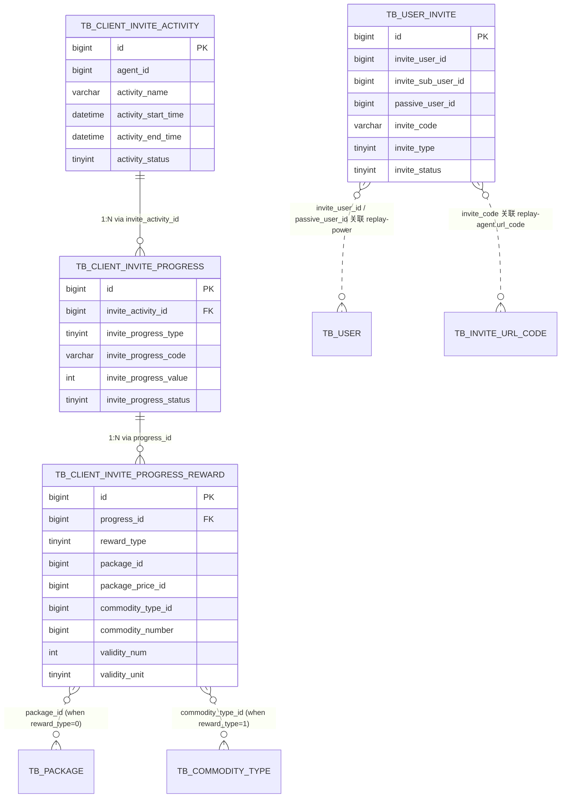

<!-- module: activity -->
<!-- area: data -->
<!-- generated-by: reverse-scan -->
<!-- last-scan: 2026-05-20 -->
<!-- source-paths: replay-activity/src/main/java/com/jiuyu/replay/activity/entity/ -->

# Activity Data — 数据模型

> replay-activity 共 4 张表，均使用 MyBatis-Plus 注解式映射（无 XML mapper）。
> **均无 `tenant_id` 列** — 邀请活动是**平台级**配置（通过 `agent_id` 区分代理商，但客户端只读默认活动）。

---

## 一、表总览

| 表名 | 实体 | 用途 | 记录粒度 |
|---|---|---|---|
| `tb_client_invite_activity` | `ClientInviteActivityEntity` | 邀请活动主体 | 一次活动一条 |
| `tb_client_invite_progress` | `ClientInviteProgressEntity` | 活动下的进度阶梯门槛 | 一个活动 N 条阶梯（含 type=0 被邀请人 + type=1 邀请人）|
| `tb_client_invite_progress_reward` | `ClientInviteProgressRewardEntity` | 阶梯达成后发放的奖励规则 | 一个阶梯 M 条奖励规则 |
| `tb_user_invite` | `UserInviteEntity` | 用户邀请关系记录（谁邀请了谁） | 一对邀请关系一条 |

> **下游表（不在本模块）**：`tb_client_invite_reward_record`（奖励发放流水，归 `replay-reward`）、`tb_invite_url_code`（邀请链接，归 `replay-agent`）

---

## 二、表结构（基于 Entity 反推）

> ⚠️ 字段以 `@TableName` + `@Data` 字段为权威；DDL 未在 `sql/` 目录中找到，请以实际数据库为准。

### 1. `tb_client_invite_activity` — 邀请活动

| 字段 | 类型 | 必填 | 说明 |
|---|---|---|---|
| `id` | BIGINT | 是 | 主键，雪花 ID (`IdType.INPUT`) |
| `agent_id` | BIGINT | 是 | 代理商 ID（关联 `tb_agent`），活动归属 |
| `activity_name` | VARCHAR | 是 | 活动名称 |
| `activity_start_time` | DATETIME | 是 | 活动开始时间 |
| `activity_end_time` | DATETIME | 是 | 活动结束时间 |
| `activity_status` | TINYINT | 是 | 0未启用 / 1启用中 |
| `create_date` | DATETIME | 是 | 创建时间（手动 `LocalDateTime.now()` / `new Date()`）|
| `update_date` | DATETIME | 是 | 更新时间（手动）|
| `is_deleted` | TINYINT | 是 | 0未删 / 1已删（**当前代码物理删除，本字段实际未被读写**）|

**关键查询模式：**
- "激活态" 三条件：`activity_status=1 AND activity_start_time < now() AND activity_end_time > now()` (`infoByActivate`)
- 后台列表：分页 + `LIKE name`（疑似列名不一致）

### 2. `tb_client_invite_progress` — 邀请进度阶梯

| 字段 | 类型 | 必填 | 说明 |
|---|---|---|---|
| `id` | BIGINT | 是 | 主键，雪花 ID |
| `invite_activity_id` | BIGINT | 是 | 关联 `tb_client_invite_activity.id` |
| `invite_progress_type` | TINYINT | 是 | 0被邀请人进度 / 1邀请人进度 |
| `invite_progress_code` | VARCHAR | 是 | 进度 code（业务标识，与 reward 模块的 `rewardRuleCode` 对齐）|
| `invite_progress_value` | INT | 是 | 达成阈值（如 3 表示"邀请 3 人"）|
| `invite_progress_title` | VARCHAR | 是 | 进度标题（展示用，如"邀请 3 人"） |
| `invite_progress_require` | VARCHAR | 是 | 进度要求文案（展示用） |
| `invite_progress_status` | TINYINT | 是 | 0停用 / 1启用 |
| `create_date` | DATETIME | 是 | 创建时间 |
| `update_date` | DATETIME | 是 | 更新时间 |
| `is_deleted` | TINYINT | 是 | 0未删 / 1已删（同上，物理删除）|

**关键查询模式：**
- 客户端拉取：`invite_progress_status=1 AND invite_activity_id=? AND invite_progress_type=?` ORDER BY `invite_progress_type DESC, invite_progress_value ASC`
- 修改活动时批量"软停用"：`invite_activity_id=? AND invite_progress_status=1` → set `status=0`

### 3. `tb_client_invite_progress_reward` — 邀请进度奖励规则

| 字段 | 类型 | 必填 | 说明 |
|---|---|---|---|
| `id` | BIGINT | 是 | 主键，雪花 ID |
| `progress_id` | BIGINT | 是 | 关联 `tb_client_invite_progress.id` |
| `reward_type` | TINYINT | 是 | 0版本 / 1增量包 |
| `package_id` | BIGINT | 条件必填 | reward_type=0 时必填，否则强制 NULL |
| `package_price_id` | BIGINT | 条件必填 | reward_type=0 时必填，否则强制 NULL |
| `commodity_type_id` | BIGINT | 条件必填 | reward_type=1 时必填，否则强制 NULL |
| `commodity_number` | BIGINT | 条件必填 | reward_type=1 时必填，商品数据量 |
| `validity_num` | INT | 否 | 有效期值（与 validity_unit 结合） |
| `validity_unit` | TINYINT | 否 | 0小时/1天/2月/3季度/4半年/5年 |
| `create_date` | DATETIME | 是 | 创建时间 |
| `update_date` | DATETIME | 是 | 更新时间 |
| `is_deleted` | TINYINT | 是 | 0未删 / 1已删 |

**字段互斥约束（代码强制 — `ClientInviteActivityRseImpl#saveBatch`）：**
```
IF reward_type = 0 THEN commodity_type_id = NULL ∧ commodity_number = NULL
IF reward_type = 1 THEN package_id = NULL ∧ package_price_id = NULL
```

**关键查询模式：**
- 按 progress 批量拉：`progress_id IN (?,?,?)`
- 按 reward 规则 ID 批量拉：`id IN (?,?,?)` （reward 模块发放时使用）

### 4. `tb_user_invite` — 用户邀请关系

| 字段 | 类型 | 必填 | 说明 |
|---|---|---|---|
| `id` | BIGINT | 是 | 主键，雪花 ID |
| `invite_user_id` | BIGINT | 是 | 邀请人用户 ID（主账号）|
| `invite_sub_user_id` | BIGINT | 否 | 邀请人子账号 ID（如果邀请方是子账号触发的） |
| `passive_user_id` | BIGINT | 是 | 被邀请人用户 ID |
| `invite_code` | VARCHAR | 是 | 邀请链接 code（对应 `tb_invite_url_code.url_code`） |
| `invite_type` | TINYINT | 是 | 0代理商 / 1渠道 / 2用户 / 3代理商销售 |
| `invite_status` | TINYINT | 是 | 1有效 / 0无效（默认 1）|
| `create_date` | DATETIME | 是 | 创建时间 |
| `update_date` | DATETIME | 是 | 更新时间 |
| `is_deleted` | TINYINT | 是 | 0未删 / 1已删 |

**关键查询模式：**
- 邀请关系判定：`passive_user_id=? AND invite_status=1 AND invite_type=2` (`judgeUserInviteEffective`)
- 邀请人计数：`COUNT(*) WHERE invite_user_id=? AND invite_type=2 AND invite_status=1` (`getInviteUserNumberByInviteUserId`)
- 按邀请码查列表：`invite_code=? AND invite_status=1` (`listByCode`)

---

## 三、ER 图



---

## 四、索引建议（基于查询模式反推 — 数据库实际索引未验证）

| 表 | 建议索引 | 支撑查询 |
|---|---|---|
| `tb_client_invite_activity` | `idx_status_time (activity_status, activity_start_time, activity_end_time)` | `infoByActivate` 三条件过滤 |
| `tb_client_invite_progress` | `idx_activity_type_status (invite_activity_id, invite_progress_type, invite_progress_status)` | 客户端拉取 + 修改活动批量停用 |
| `tb_client_invite_progress` | `idx_progress_value (invite_progress_value)` | 阶梯按值排序 |
| `tb_client_invite_progress_reward` | `idx_progress_id (progress_id)` | 按阶梯批量拉奖励规则 |
| `tb_user_invite` | `idx_passive_status_type (passive_user_id, invite_status, invite_type)` | `judgeUserInviteEffective` |
| `tb_user_invite` | `idx_invite_user_type_status (invite_user_id, invite_type, invite_status)` | `getInviteUserNumberByInviteUserId` 计数 |
| `tb_user_invite` | `idx_invite_code (invite_code, invite_status)` | `listByCode` |

---

## 五、设计原则与约定

1. **平台级配置，无租户隔离** — 4 张表均无 `tenant_id`。`activity` 通过 `agent_id` 区分代理商，但客户端固定取默认活动 ID，所以实际是单租户视角。
2. **雪花 ID 强制 INPUT 模式** — 所有实体 `@TableId(value="id", type=IdType.INPUT)`，由 `SnowflakeManager.nextValue()` 生成。
3. **手动维护审计字段** — `create_date` / `update_date` 由 `Rse` 实现手动 `new Date()` 或 `LocalDateTime.now()` 赋值，**未启用 MyBatis-Plus 自动填充**。
4. **`is_deleted` 字段存在但不生效** — 4 张表都有该字段，但 `Rse` 删除时调用 `removeById` 走 MyBatis-Plus 默认 `DELETE FROM`，即**物理删除**。查询时也未带 `is_deleted=0` 过滤。**违反 `CLAUDE.md §5` 的"手动 `is_deleted`" 约定**。
5. **进度阶梯采用"软停用"语义** — 修改活动时 `disableOld` 把旧阶梯 `invite_progress_status=0`，不删；查询只读 status=1。这是本模块**唯一**真正用到"状态字段做软删"的地方。
6. **奖励类型字段互斥** — 由 `saveBatch` 在落库前清洗，避免脏数据；反向也意味着 **没有数据库 CHECK 约束**，依赖应用层强制。
7. **`tb_user_invite` 跨模块归属模糊** — 实体在 activity 模块，但写入触发点在 `replay-power` / `replay-agent`（新用户注册流程），本模块只暴露查询。生命周期事实上分散管理。

---

## 六、跨模块数据依赖

| 字段 | 引用表（外部模块） | 说明 |
|---|---|---|
| `tb_client_invite_activity.agent_id` | `tb_agent` (replay-agent) | 代理商主体 |
| `tb_client_invite_progress_reward.package_id` | `tb_package` (replay-order) | 版本套餐 |
| `tb_client_invite_progress_reward.package_price_id` | `tb_package_price` (replay-order) | 套餐价格 |
| `tb_client_invite_progress_reward.commodity_type_id` | `tb_commodity_type` (replay-order) | 商品类型（增量包）|
| `tb_user_invite.invite_user_id` / `passive_user_id` | `tb_user` (replay-power) | 用户主体 |
| `tb_user_invite.invite_code` | `tb_invite_url_code.url_code` (replay-agent) | 邀请链接短码 |

跨模块**只通过 ID 软引用**，不建数据库外键，符合 jiuyu 跨模块通讯原则（Feign / shared ID）。
