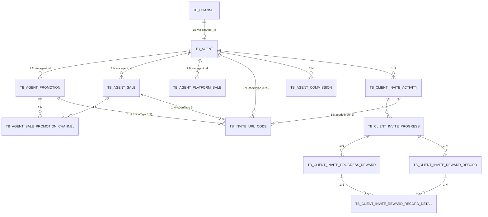

<!-- module: agent -->
<!-- area: data -->
<!-- generated-by: reverse-scan -->
<!-- last-scan: 2026-05-20 -->
<!-- source-paths: replay-agent/.../entity/ -->

# Agent Data — 数据模型

> `replay-agent` 模块共 12 张实体表。共同约束：
> - **ID**：雪花 ID（`@TableId(value="id", type=IdType.INPUT)` + `SnowflakeManager.nextValue()`）
> - **时间戳**：手动 `LocalDateTime.now()` / `new Date()` 写入 `create_date` 和 `update_date`
> - **软删除**：手动维护 `is_deleted`（0 未删除 / 1 已删除），**禁用** `@TableLogic`
> - **租户隔离**：客户身份链路（`tb_invite_url_code` / `tb_client_invite_reward_record(_detail)`）带 `tenant_id`，写入和读取必须按 `tenantId` 过滤；代理商体系本身（`tb_agent` 等）属于平台级数据，不带租户列
>
> 实体类全部位于 `com.jiuyu.replay.agent.entity`，仅 2 张表有 MyBatis XML（`InviteUrlCodeMapper.xml`、`AgentPlatformSaleMapper.xml`）；其余走 MyBatis-Plus 默认 LambdaQuery。

---

## 一、代理商体系

### 1.1 `tb_channel` — 用户来源渠道

`ChannelEntity` — 渠道树（父子结构）。

| 字段 | 类型 | 必填 | 说明 |
|------|------|------|------|
| id | BIGINT | 是 | 主键，雪花 ID |
| parent_id | BIGINT | 否 | 父渠道 ID（0/null = 根节点）|
| channel_name | VARCHAR | 是 | 渠道名称 |
| create_date | DATETIME | 是 | 创建时间 |
| update_date | DATETIME | 是 | 更新时间 |
| is_deleted | TINYINT | 是 | 软删除 0/1 |

无显式索引声明（默认 PK）。`Channel` 被 `Agent.channelId` 引用。

### 1.2 `tb_agent` — 代理商

`AgentEntity` — 代理商主表。

| 字段 | 类型 | 必填 | 说明 |
|------|------|------|------|
| id | BIGINT | 是 | 主键，雪花 ID |
| agent_name | VARCHAR | 是 | 代理商名称（保存时由 `Channel.channelName` 同步）|
| parent_id | BIGINT | 否 | 父代理商 ID |
| agent_type | TINYINT | 是 | 代理商类型 0普通 / 1渠道 |
| channel_id | BIGINT | 是 | 关联 `tb_channel.id`；逻辑上唯一 |
| operation_user_id | BIGINT | 否 | 运营人员用户 ID |
| contact_name | VARCHAR | 否 | 联系人姓名 |
| contact_phone | VARCHAR | 否 | 联系人手机号（普通代理商不可重复）|
| contact_address | VARCHAR | 否 | 联系地址 |
| trade_id | BIGINT | 否 | 行业 ID |
| commission_rate | DOUBLE | 是 | 新签佣金比例 [0,1] |
| renewal_commission_rate | DOUBLE | 是 | 续费佣金比例 [0,1] |
| agent_status | TINYINT | 是 | 代理商状态 0未启用 / 1启用中 |
| create_user_id | BIGINT | 否 | 创建人用户 ID |
| agent_url_code | VARCHAR(10) | 是 | 代理商邀请 URL code |
| poster_img_ids | VARCHAR | 否 | 海报图片文件 ID（`_` 分隔）|
| btn_bg_color | VARCHAR | 否 | 按钮颜色 |
| bt_content | VARCHAR | 否 | 按钮文案 |
| user_id | BIGINT | 否 | 普通代理商对应的后台账号 `tb_user.id` |
| employee_status | TINYINT | 否 | 员工状态 0离职 / 1在职 |
| create_date / update_date | DATETIME | 是 | 时间戳 |
| is_deleted | TINYINT | 是 | 软删除 |

### 1.3 `tb_agent_promotion` — 代理商推广渠道

`AgentPromotionEntity`

| 字段 | 类型 | 必填 | 说明 |
|------|------|------|------|
| id | BIGINT | 是 | 主键 |
| agent_id | BIGINT | 是 | 关联 `tb_agent.id` |
| promotion_name | VARCHAR | 是 | 推广渠道名 |
| poster_img_ids | VARCHAR | 否 | 海报图片 ID |
| btn_bg_color / bt_content | VARCHAR | 否 | 按钮样式 |
| commission_rate | DOUBLE | 是 | 新签佣金比例 |
| renewal_commission_rate | DOUBLE | 是 | 续费佣金比例 |
| promotion_url_code | VARCHAR | 是 | 渠道 URL code |
| promotion_status | TINYINT | 是 | 0未启用 / 1启用中 |
| create_date / update_date | DATETIME | 是 | — |
| is_deleted | TINYINT | 是 | 软删除 |

### 1.4 `tb_agent_sale` — 代理商销售

`AgentSaleEntity`

| 字段 | 类型 | 必填 | 说明 |
|------|------|------|------|
| id | BIGINT | 是 | 主键 |
| agent_id | BIGINT | 是 | 关联 `tb_agent.id` |
| sale_name | VARCHAR | 是 | 销售姓名 |
| sale_phone | VARCHAR | 是 | 销售手机号 |
| sale_status | TINYINT | 是 | 0未启用 / 1启用中 |
| create_user_id | BIGINT | 否 | 创建人 |
| create_date / update_date | DATETIME | 是 | — |
| is_deleted | TINYINT | 是 | 软删除 |

### 1.5 `tb_agent_sale_promotion_channel` — 销售-推广渠道关联

`AgentSalePromotionChannelEntity` — 销售与推广渠道多对多关系。

| 字段 | 类型 | 必填 | 说明 |
|------|------|------|------|
| id | BIGINT | 是 | 主键 |
| promotion_channel_id | BIGINT | 是 | 关联 `tb_agent_promotion.id` |
| agent_sale_id | BIGINT | 是 | 关联 `tb_agent_sale.id` |
| sale_url_code | VARCHAR | 是 | 销售渠道邀请 URL code |
| create_date / update_date | DATETIME | 是 | — |
| is_deleted | TINYINT | 是 | 软删除 |

### 1.6 `tb_agent_platform_sale` — 代理商平台销售（白名单）

`AgentPlatformSaleEntity` — 代理商把自家代理商销售/平台销售挂到自己旗下，供"客户分配轮询"使用。

| 字段 | 类型 | 必填 | 说明 |
|------|------|------|------|
| id | BIGINT | 是 | 主键 |
| agent_id | BIGINT | 是 | 关联 `tb_agent.id` |
| sale_id | BIGINT | 是 | 关联 `tb_sales.id`（在 `replay-power`）|
| channel_qrcode_img_id | BIGINT | 否 | 渠道二维码图片文件 ID |
| create_date / update_date | DATETIME | 是 | — |
| is_deleted | TINYINT | 是 | 软删除 |

### 1.7 `tb_agent_commission` — 代理商佣金

`AgentCommissionEntity` — 每笔订单分佣的结算记录。

| 字段 | 类型 | 必填 | 说明 |
|------|------|------|------|
| id | BIGINT | 是 | 主键 |
| agent_id | BIGINT | 是 | 代理商 ID |
| promotion_id | BIGINT | 否 | 推广渠道 ID（来自邀请码）|
| agent_sale_id | BIGINT | 否 | 代理商销售 ID（来自邀请码）|
| order_id | BIGINT | 是 | 订单 ID（`replay-order`）|
| user_id | BIGINT | 是 | 下单用户 ID |
| order_total_money | INT | 是 | 订单总金额（分）|
| commission | DOUBLE | 是 | 实际使用的佣金比例（≤1）|
| commission_money | INT | 是 | 佣金金额（分），上限 `order_total_money` |
| commission_type | TINYINT | 是 | 0新签 / 1续费 |
| commission_mode | TINYINT | 是 | 镜像邀请码 `code_type`（0/1/2/3）|
| commission_time | DATETIME | 是 | 分佣时间 |
| remarks | VARCHAR | 否 | 备注 |
| create_date / update_date | DATETIME | 是 | — |
| is_deleted | TINYINT | 是 | 软删除 |

---

## 二、邀请活动体系

### 2.1 `tb_invite_url_code` — 邀请链接 code（**统一入口**）

`InviteUrlCodeEntity` — 代理商/推广渠道/销售/用户邀请码的统一存储，**唯一带 `tenant_id`** 的非奖励表。

| 字段 | 类型 | 必填 | 说明 |
|------|------|------|------|
| id | BIGINT | 是 | 主键 |
| url_code | VARCHAR(10) | 是 | 邀请码（字母数字混排，逻辑上唯一）|
| agent_id | BIGINT | 否 | 关联代理商 |
| promotion_id | BIGINT | 否 | 关联推广渠道（`code_type=1/3`）|
| agent_sale_id | BIGINT | 否 | 关联代理商销售（`code_type=3`）|
| user_id | BIGINT | 否 | 关联用户（`code_type=2`）|
| sub_user_id | BIGINT | 否 | 子账号用户 ID（`code_type=2` 且操作者为子账号时记录）|
| activity_id | BIGINT | 否 | 关联活动（`code_type=2`）|
| code_type | TINYINT | 是 | 0代理商 / 1推广渠道 / 2用户 / 3代理商销售 |
| tenant_id | BIGINT | 否 | 租户 ID（`code_type=2` 时必填）|
| create_date / update_date | DATETIME | 是 | — |
| is_deleted | TINYINT | 是 | 软删除 |

**查询契约**（mapper XML 中唯一一条原生 SQL）：

```sql
-- inviteCodeAndPromotionName
SELECT iuc.url_code, ap.promotion_name
FROM tb_invite_url_code iuc
LEFT JOIN tb_agent_promotion ap ON iuc.promotion_id = ap.id
WHERE iuc.is_deleted = 0
  AND iuc.promotion_id > 0
  AND iuc.url_code IN (#{code}, ...)
```

> 这是 agent 模块**唯一**的 JOIN 查询。其余统统按 `LambdaQueryWrapper` 单表查 + in-memory 装配（遵循"反 JOIN"策略）。

### 2.2 `tb_client_invite_activity` — 客户端邀请活动

`ClientInviteActivityEntity`

| 字段 | 类型 | 必填 | 说明 |
|------|------|------|------|
| id | BIGINT | 是 | 主键 |
| agent_id | BIGINT | 是 | 活动归属代理商 |
| activity_name | VARCHAR | 是 | 活动名 |
| activity_start_time | DATETIME | 是 | 活动开始时间 |
| activity_end_time | DATETIME | 是 | 活动结束时间 |
| activity_status | TINYINT | 是 | 0未启用 / 1启用中 |
| create_date / update_date | DATETIME | 是 | — |
| is_deleted | TINYINT | 是 | 软删除 |

### 2.3 `tb_client_invite_progress` — 邀请进度（门槛）

`ClientInviteProgressEntity`

| 字段 | 类型 | 必填 | 说明 |
|------|------|------|------|
| id | BIGINT | 是 | 主键 |
| invite_activity_id | BIGINT | 是 | 关联活动 |
| invite_progress_type | TINYINT | 是 | 0被邀请人 / 1邀请人 |
| invite_progress_code | VARCHAR | 否 | 进度 code |
| invite_progress_value | INT | 是 | 进度值（如"邀请人数"）|
| invite_progress_title | VARCHAR | 否 | 进度标题 |
| invite_progress_require | VARCHAR | 否 | 进度要求文案 |
| invite_progress_status | TINYINT | 是 | 0停用 / 1启用中 |
| create_date / update_date | DATETIME | 是 | — |
| is_deleted | TINYINT | 是 | 软删除 |

### 2.4 `tb_client_invite_progress_reward` — 进度奖励

`ClientInviteProgressRewardEntity`

| 字段 | 类型 | 必填 | 说明 |
|------|------|------|------|
| id | BIGINT | 是 | 主键 |
| progress_id | BIGINT | 是 | 关联进度 |
| reward_type | BIGINT | 是 | 0版本套餐 / 1增量包 |
| package_id | BIGINT | 否 | 版本 ID（`reward_type=0`）|
| package_price_id | BIGINT | 否 | 版本价格 ID（`reward_type=0`）|
| commodity_type_id | BIGINT | 否 | 商品类型 ID |
| commodity_number | BIGINT | 否 | 商品数量 |
| validity_num | INT | 否 | 有效期数值 |
| validity_unit | TINYINT | 否 | 有效期单位 0时 / 1天 / 2月 / 3季度 / 4半年 / 5年 |
| create_date / update_date | DATETIME | 是 | — |
| is_deleted | TINYINT | 是 | 软删除 |

### 2.5 `tb_client_invite_reward_record` — 邀请奖励记录

`ClientInviteRewardRecordEntity` — 一次邀请关系链上的奖励授予记录（租户隔离）。

| 字段 | 类型 | 必填 | 说明 |
|------|------|------|------|
| id | BIGINT | 是 | 主键 |
| invite_user_id | BIGINT | 是 | 邀请人 user_id |
| be_invite_user_id | BIGINT | 是 | 被邀请人 user_id |
| invite_progress_id | BIGINT | 是 | 命中的进度 ID |
| tenant_id | BIGINT | 是 | 租户 ID |
| create_date / update_date | DATETIME | 是 | — |
| is_deleted | TINYINT | 是 | 软删除 |

### 2.6 `tb_client_invite_reward_record_detail` — 邀请奖励明细

`ClientInviteRewardRecordDetailEntity` — 一条 record 派生出的具体发放明细。

| 字段 | 类型 | 必填 | 说明 |
|------|------|------|------|
| id | BIGINT | 是 | 主键 |
| user_id | BIGINT | 是 | 受奖用户 user_id（可能是邀请人或被邀请人）|
| invite_reward_record_id | BIGINT | 是 | 关联 `tb_client_invite_reward_record.id` |
| invite_progress_reward_id | BIGINT | 是 | 命中的 progress_reward ID |
| reward_content | VARCHAR | 否 | 奖励内容描述 |
| tenant_id | BIGINT | 是 | 租户 ID |
| create_date / update_date | DATETIME | 是 | — |
| is_deleted | TINYINT | 是 | 软删除 |

---

## 三、ER 关系图



---

## 四、索引设计（推断 + 当前实现）

> 当前实体类未声明索引；以下为基于实际查询模式的**推断索引**，建表 DDL 不在 `sql/` 目录中（线上由 DBA 维护）。

| 表 | 推断索引 | 用于的查询 |
|---|---|---|
| `tb_invite_url_code` | `UNIQUE KEY uk_url_code (url_code)` | `infoByCode(String)` 单点查 |
| `tb_invite_url_code` | `KEY idx_user_activity (user_id, activity_id, code_type)` | `InviteUrlCodeRse.infoByCondition` |
| `tb_invite_url_code` | `KEY idx_agent_sale_id (agent_sale_id)` | `deleteByAgentSaleId` |
| `tb_invite_url_code` | `KEY idx_promotion_id (promotion_id)` | `selectQuery(promotionIds) WHERE code_type=1` |
| `tb_agent` | `UNIQUE KEY uk_channel_id (channel_id)` | `infoByChannelId` |
| `tb_agent` | `KEY idx_agent_url_code (agent_url_code)` | `infoByUrlCode` |
| `tb_agent` | `KEY idx_phone_type (contact_phone, agent_type)` | `countAgentByPhoneType` 普通代理商手机号唯一性校验 |
| `tb_agent` | `KEY idx_user_id (user_id)` | `infoByPhoneType` 反查后台账号 |
| `tb_agent_promotion` | `KEY idx_agent_id (agent_id)` | 按代理商列推广渠道 |
| `tb_agent_sale` | `KEY idx_agent_id (agent_id)` | 按代理商列销售 |
| `tb_agent_platform_sale` | `KEY idx_agent_id (agent_id)` | 客户分配轮询读 |
| `tb_agent_commission` | `KEY idx_agent_user_type (agent_id, user_id, commission_type)` | 续费防重 + 月度报表 |
| `tb_agent_commission` | `KEY idx_order_id (order_id)` | `getByOrderId / listByOrderIds` |
| `tb_client_invite_reward_record` | `KEY idx_tenant_invite_user (tenant_id, invite_user_id)` | 列租户内邀请人奖励 |
| `tb_client_invite_reward_record_detail` | `KEY idx_tenant_user (tenant_id, user_id)` | 列租户内某用户拿到的奖励 |

**若发现以上索引线上缺失，应作为优化 ADR 推动建立。**

---

## 五、数据组装策略（anti-JOIN）

agent 模块**几乎不写 JOIN**（仅 `InviteUrlCodeMapper.xml` 一处反查推广渠道名）。其余路径全部走：

1. **先单表查列表** → `LambdaQueryWrapper` 按主键/索引列过滤
2. **抽出关联 ID** → 收集到 `List<Long>`
3. **批量查关联表** → 用 `in(...)` 一把拿回
4. **stream + Map 装配** → 在 Java 内存里做 join

样例：`AgentCommissionProducerImpl#commissionRecords` 先按 `agentId` 查全部佣金，再用 `Collectors.groupingBy(yyyy-MM)` 在内存中聚合，避免 GROUP BY 在 DB 侧负担。

---

## 六、数据生命周期

| 维度 | 规则 |
|---|---|
| 软删除 | 全表 `is_deleted=0/1`，**禁** `@TableLogic`；删除路径走 MyBatis-Plus `removeById` —— 注意当前未标注 `@TableLogic` 时 `removeById` 实际**物理删除**，需评估是否符合预期 |
| 时间戳 | `create_date` / `update_date` 在 Producer 层手动 `new Date()` 写入 |
| 归档 | 无 |
| 租户隔离 | `tb_invite_url_code` / `tb_client_invite_reward_record(_detail)` 三张表必须按 `tenant_id` 过滤；其余代理商体系表全租户共享 |
| 防重复落单 | `tb_invite_url_code.url_code` 由 Java 层循环重试保证唯一（无 `UNIQUE KEY` 兜底时可能因为竞态拿到重复码 —— 由 Redisson 锁串行化） |

---

## 七、关键 SystemKv 配置（外部依赖）

agent 模块依赖 `replay-common` 的 `tb_system_kv` 配置：

| key | 用途 | 默认/示例 |
|-----|------|----------|
| `agent_user_role_id` | 普通代理商后台账号绑定的角色 ID | 必须配置，否则 `save/update` 失败 |
| `new_renewal_interval` | 续费间隔窗口（天） | 默认 90 |
| `break_agreement_num` | 断约天数 | 默认 180 |

`new_renewal_interval + break_agreement_num` 共同构成"续费防重佣"的时间窗口（`commissionAllocation` 用）。

---

## 八、Redis Key

agent 模块的 Redis Key 全部前缀 `replay:agent:`：

| Key 模板 | 用途 | TTL |
|---|---|---|
| `replay:agent:sale:index:{agentId}` | 代理商平台销售轮询索引（自增计数器，1~10000 循环）| 30 天 |
| 见 `LockKeyPrefix.USER.getLockKey("inviteUrlCode:" + userId)` | 用户邀请码生成的 Redisson 分布式锁 | 默认 |

---

## 九、设计原则

1. **代理商体系与活动体系正交**：通过 `tb_invite_url_code.code_type` 路由识别身份，**单表多用**避免 4 张并列的 invite_code 表。
2. **代理商表无租户列**：`tb_agent` / `tb_agent_promotion` / `tb_agent_sale` / `tb_agent_commission` 是平台级配置数据，所有租户共享一份。租户隔离只发生在用户身份链（`tb_invite_url_code`, `tb_client_invite_reward_record(_detail)`）。
3. **客户端邀请奖励记录与明细分两张表**：record 表锁定"谁邀请了谁、命中了哪个进度"，detail 表锁定"实际派发了哪个商品"，便于一对多展开。
4. **代理商关联后台账号通过 `user_id` 单向引用 `tb_user`**：避免在代理商表里冗余手机号字段；联动状态由 `UserFeign` 远程调用。
5. **续费防重佣靠时间窗口而非业务标记**：用 `system_kv` 配置可调，避免 hardcode；新签则不防重。
