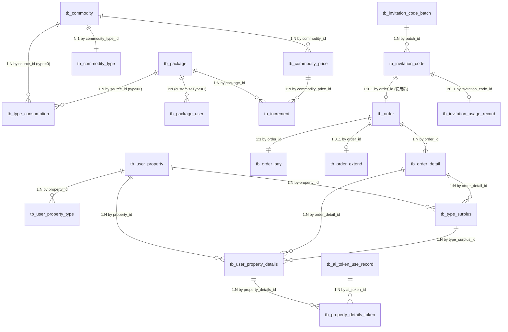

<!-- module: order -->
<!-- area: data -->
<!-- generated-by: reverse-scan -->
<!-- last-scan: 2026-05-20 -->
<!-- source-paths: replay-order/src/main/java/com/jiuyu/replay/order/entity/ -->

# Order Data — 数据模型

> replay-order 模块完整数据表结构。共 20 张 MySQL 表，使用 MyBatis-Plus。详细 DDL 见 [order_data_detail.md](./order_data_detail.md)。

---

## 一、表清单概览

| # | 表名 | Entity | 域 | 软删除 | 审计字段 | 租户隔离 |
|---|---|---|---|---|---|---|
| 1 | `tb_commodity` | CommodityEntity | 商品配置 | `isDeleted` | createDate/updateDate | 通过 userId 间接 |
| 2 | `tb_commodity_type` | CommodityTypeEntity | 商品配置 | `isDeleted` | createDate/updateDate | — |
| 3 | `tb_commodity_price` | CommodityPriceEntity | 商品配置 | `isDeleted` | createDate/updateDate | — |
| 4 | `tb_package` | PackageEntity | 套餐 | `isDeleted` | createDate/updateDate | — |
| 5 | `tb_package_user` | PackageUserEntity | 套餐 | `isDeleted` | createDate/updateDate | ✅ `tenantId` |
| 6 | `tb_increment` | IncrementEntity | 套餐 | ❌ 无 `isDeleted` / `updateDate` | createDate only | — |
| 7 | `tb_type_consumption` | TypeConsumptionEntity | 套餐 | ❌（配方表） | ❌ | — |
| 8 | `tb_order` | OrderEntity | 订单 | `isDeleted` | createDate/updateDate | 通过 userId |
| 9 | `tb_order_detail` | OrderDetailEntity | 订单 | `isDeleted` | createDate/updateDate | 通过 orderId |
| 10 | `tb_order_pay` | OrderPayEntity | 订单 | `isDeleted` | createDate/updateDate | 通过 orderId |
| 11 | `tb_order_extend` | OrderExtendEntity (extends BaseEntity) | 订单 | `isDeleted` | createDate/updateDate + create_id/update_id | — |
| 12 | `tb_invitation_code_batch` | InvitationCodeBatchEntity | 邀请码 | `isDeleted` | createDate/updateDate | 通过 userId |
| 13 | `tb_invitation_code` | InvitationCodeEntity | 邀请码 | `isDeleted` | createDate/updateDate | 通过 batch/userId |
| 14 | `tb_invitation_usage_record` | InvitationUsageRecordEntity | 邀请码 | ⚠️ `@TableLogic` | `@TableField(fill=...)` 自动 | ✅ `tenantId` |
| 15 | `tb_user_property` | UserPropertyEntity | 用户资产 | `isDeleted` | createDate/updateDate | 通过 userId |
| 16 | `tb_user_property_type` | UserPropertyTypeEntity | 用户资产 | `isDeleted` | createDate/updateDate | 通过 userId |
| 17 | `tb_user_property_details` | UserPropertyDetailsEntity | 用户资产 | ❌（流水表） | createDate only | 通过 userId |
| 18 | `tb_type_surplus` | TypeSurplusEntity | 用户资产 | ❌（运行时批次） | ❌ | 通过 userId |
| 19 | `tb_ai_token_use_record` | AiTokenUseRecordEntity | AI 计费 | ❌（流水表） | createDate/updateDate | ✅ `tenantId` |
| 20 | `tb_property_details_token` | PropertyDetailsTokenEntity | AI 计费 | ❌（多对多关联） | ❌ | — |

> 完整 DDL 见 [order_data_detail.md](./order_data_detail.md)

---

## 二、域关系（ER）

---

## 三、索引建议概要

> 详细索引表见 [order_data_detail.md §七](./order_data_detail.md#七索引建议按表)

关键索引（按查询频率排序）：
- `tb_user_property_type`: `idx_user_code (user_id, commodity_type_code)` — 总账查询，占绝大部分 R/W
- `tb_type_surplus`: `idx_user_code_status (user_id, commodity_type_code, use_status, time_status)` — 扣资产批次定位
- `tb_order`: `idx_user_status (user_id, status)` + `idx_status_end (status, end_date)` — 用户订单 + 过期扫表
- `tb_invitation_code`: `uk_code (code)` — 兑换查码

`<待补充>`：实际线上索引以 DBA 维护为准。

---

## 四、数据装配策略（anti-JOIN）

1. **订单详情聚合**：`tb_order` → `tb_order_detail` (in-memory `Map<orderId, List<OrderDetailEntity>>`)；不写 `LEFT JOIN`。
2. **资产总账 + 批次**：`tb_user_property_type` 读总数（带 Redis 缓存），扣减时再读 `tb_type_surplus` 当前可用批次；避免 JOIN 索引失效。
3. **邀请码使用聚合**：`tb_invitation_code` → in-memory map by `batchId`。
4. **`Lists.partition(ids, 500)`**：多数批量查询通过 `LambdaQueryWrapper.in(...)`，调用方需自己控制 IN 列表大小。订单/资产相关接口默认按 50/批走。

---

## 五、租户隔离与软删除

### 显式带 `tenant_id` 的表
- `tb_package_user`, `tb_invitation_usage_record`, `tb_ai_token_use_record`

其余表通过 `user_id → tb_user.tenant_id` 间接关联。**列表查询必须先按 userId / tenantId 过滤**（CLAUDE.md §5）。

### 软删除规范
- 大部分表：手动 `is_deleted = 1` ✅
- ⚠️ 例外：`InvitationUsageRecordEntity` 使用 `@TableLogic`（历史遗留，与约定冲突）
- 流水/配置/批次类无 `is_deleted`：业务不删除（增量包通过 `status=0` 下架，流水永久保留）

### 审计字段
- 大部分表手动 `LocalDateTime.now()` 设置；旧表混用 `java.util.Date` 与 `LocalDateTime`
- ⚠️ `InvitationUsageRecordEntity` 用 `@TableField(fill=...)` 自动填充
- `OrderExtendEntity` 通过 `BaseEntity` 提供 `create_id / update_id`

---

## 六、生命周期与归档

- **订单**：永久保留（审计、退款追溯、税务）。`is_deleted=1` 软删，未观察到分库分表或归档。
- **资产流水**（`tb_user_property_details` / `tb_ai_token_use_record`）：永久保留。建议按月分区（`<待补充>`，需 DBA 评估）。
- **资产批次**（`tb_type_surplus`）：随订单周期生灭。订单到期 → `useStatus=3 / timeStatus=1`；订单升级 → `useStatus=2`。
- **支付二维码**（`tb_order_pay.pay_code`）：业务过期后可清理（`<待补充>`，未见清理逻辑）。

---

## 七、引用与跨域

- `tb_user / tb_user_details` 在 `replay-power`，详见 [power_data.md](./power_data.md)。
- `tb_order` 作为 CRM 视角的下游订单表；CRM 通过 `userId` 反查订单（API-C02 `/internal/crm/order/query-by-phone`）。
- `commodityTypeCode` 命名空间被 `replay-words` 消费（监控位、弹幕位等）；详见 [order_domain.md §3.8](../domain/order_domain.md)。

## 八、类型注意

- `tb_increment.real_price` 是 `DECIMAL`，与 `tb_commodity_price.real_price` (`INT 分`) 类型不一致 —— 历史遗留，读写时校验单位。
