<!-- module: power -->
<!-- area: data -->
<!-- generated-by: reverse-scan -->
<!-- last-scan: 2026-05-20 -->
<!-- source-paths: replay-power/, replay-api/.../controller/power/, sql/replay-22.sql, sql/replay9-21.sql -->

# Power Data — 数据模型

> replay-power 模块完整数据表结构。共 23 张 MySQL 表，覆盖用户 / 租户 / 角色 / 菜单 / 销售 / CRM 集成等基础域。

---

## 一、表清单（按子域分组）

所有表统一约束：
- 雪花 ID `@TableId(type = IdType.INPUT)`，PK 由 `SnowflakeManager.nextValue()` 在 Producer 层生成
- 手动软删除字段 `is_deleted (TINYINT)`，**禁** `@TableLogic`（例外见 §四：tb_user_token / tb_user_login_info / tb_user_device_fingerprint 例外使用 `@TableLogic` + Byte 类型）
- 手动审计 `create_date` / `update_date` (DATETIME)，业务代码显式 `new Date()` / `LocalDateTime.now()` 赋值

### 1. 用户域（核心 5 张）

| 表名 | 实体 | 核心字段 | 说明 |
|------|------|----------|------|
| `tb_user` | UserEntity | id, username, password(MD5), nickName, phone, wxOpenid, status(0未冻结/1冻结), userType(0客户端/1后台/2子账号), adminUserType(0正常/1代理商/2代理商销售), parentId(父账号), activeTenantId, inviteUrlCode, ips(登录IP拼接) | 用户主体 |
| `tb_user_details` | UserDetailsEntity (extends BaseEntity) | id, userId, tradeId, companyId, anchorType(0个人/1公司), realName, idCard, sex, birthday, email, address, channelId, saleId, agentSaleId, agentId, wxName, userAmbition(S/A/B/C), userBelongType(0个人/1工作室/2企业), isLoggedIn(0未/1已), isShow(演示标记), videoMeetPath, employeeStatus(0离职/1在职), position | 用户扩展信息 |
| `tb_user_business` | UserBusinessEntity | user_id(PK, IdType.INPUT), accordingStatus, accordingContent, accordingDate, nextFolTime, clientVersion(record纯录制/replay复盘) | 用户业务快照（每用户一条，跟进状态冗余） |
| `tb_user_remark` | UserRemarkEntity (extends BaseEntity) | id, userId, remark, followType, followStatus, followUpTime, nextFolTime, isDeleted | 用户备注 / 跟进记录明细 |
| `tb_binding_account` | BindingAccountEntity | id, parentUserId, parentUserName, childUserId, childUserName, bindingStatus(0绑定/1解绑), bindingDate, unbindDate, unbindReason, createDate | 父子账号绑定/解绑历史 |

### 2. 租户域（2 张）

| 表名 | 实体 | 核心字段 | 说明 |
|------|------|----------|------|
| `tb_tenant` | TenantEntity | id, tenantName, showPdfHead(0不显示/1显示), UserId(所属用户) | 租户基本信息 |
| `tb_tenant_user` | TenantUserEntity | id, tenantId, userId | 租户-用户多对多关联 |

### 3. RBAC 域（4 张）

| 表名 | 实体 | 核心字段 | 说明 |
|------|------|----------|------|
| `tb_role` | RoleEntity | id, name, level(A/E 等) | 角色定义 |
| `tb_menu` | MenuEntity | id, parentId, name, url, type(0菜单/1功能/2目录), sort, img | 菜单树 |
| `tb_user_role` | UserRoleEntity | id, userId, roleId | 用户-角色关联 |
| `tb_menu_role` | MenuRoleEntity | id, roleId, menuId | 角色-菜单关联 |

### 4. 会话 / Token 域（3 张）

| 表名 | 实体 | 核心字段 | 说明 |
|------|------|----------|------|
| `tb_user_token` | UserTokenEntity | id, userId, token, userInfo(JSON), expireTime, lastAccessTime, isDeleted (`@TableLogic`, Byte) | 用户登录 Token 持久化（Redis 降级兜底） |
| `tb_user_login_info` | UserLoginInfoEntity | id, userId, token, sourceInfo(client/web/back), fingerprint, lastRequestTime, expireTime, isDeleted (`@TableLogic`, Byte) | 单次登录会话信息 |
| `tb_user_device_fingerprint` | UserDeviceFingerprintEntity | id, userId, deviceType(0桌面/1Web), fingerprint, isDeleted (`@TableLogic`, Byte) | 设备指纹（按 fingerprint+deviceType 去重） |

注意：上面 3 张表是 2025/06-07 新增，作者 RayChou；统一使用 `@TableLogic` + Byte，这是模块内例外（与全局"禁 @TableLogic"约定冲突，**新代码继续遵循全局约定**，不要参照此 3 张表）。

### 5. 审计日志（1 张）

| 表名 | 实体 | 核心字段 | 说明 |
|------|------|----------|------|
| `tb_user_login_log` | UserLoginLogEntity | id, userId, userName, userType, operaType(0登录/1离线/2上线/3退出), ipAddress, operaStatus(0成功/1失败), remarks | 登录操作审计日志 |

### 6. 销售 / 部门域（3 张）

| 表名 | 实体 | 核心字段 | 说明 |
|------|------|----------|------|
| `tb_sales` | SalesEntity | id, parentId, salesName, phone, qrcodeImgId(二维码文件), isChoose(分配线索 0关/1开), userPolling(轮询 0否/1是), salesIntroductionUrl(获客助手链接), salesType(0平台/1代理商), agentId, userId(关联 tb_user), employeeStatus(0离职/1在职) | 销售人员 |
| `tb_dept` | DeptEntity | id, name, parentId | 部门树 |
| `tb_dept_user` | DeptUserEntity | id, deptId, userId | 部门-用户关联 |

### 7. 标签 / 公司域（3 张）

| 表名 | 实体 | 核心字段 | 说明 |
|------|------|----------|------|
| `tb_tag` | TagEntity | id, name, remarks | 用户标签 |
| `tb_user_tag` | UserTagEntity | id, userId, tagId | 用户-标签关联 |
| `tb_company` | CompanyEntity | id, name, registrationNumber, tradeId, scales(规模/人数), linkman, phones, address, email, foundingDate, annualRevenue, status(0正常/1暂停), description | 公司表 |

### 8. CRM 智能体集成（2 张，与 [[crm_data]] 共享）

| 表名 | 实体 | 核心字段 | 说明 |
|------|------|----------|------|
| `tb_crm_ai_profile` | CrmAiProfileEntity | id, userId, profileId(UNIQUE), source, updatedAt, profileJson(LONGTEXT), summary | 客户 AI 画像（智能体生成） |
| `tb_crm_stage_event` | CrmStageEventEntity | id, userId, eventId(UNIQUE), source, occurredAt, stageCode, stageLabel, confidence(DECIMAL 5,4), summary, factsJson, rawJson, createDate | 阶段事件流水 |

详见 [[crm_data]]。

---

## 二、ER 关系（RBAC + 用户 + 销售）

```mermaid
erDiagram
    TB_USER ||--o{ TB_USER_ROLE : "1:N"
    TB_USER ||--o| TB_USER_DETAILS : "1:1 by user_id"
    TB_USER ||--o| TB_USER_BUSINESS : "1:1 by user_id (PK)"
    TB_USER ||--o{ TB_USER_REMARK : "1:N follow-up records"
    TB_USER ||--o{ TB_USER_TAG : "1:N"
    TB_USER ||--o{ TB_TENANT_USER : "1:N"
    TB_USER ||--o{ TB_USER_TOKEN : "1:N active sessions"
    TB_USER ||--o{ TB_USER_LOGIN_INFO : "1:N session info"
    TB_USER ||--o{ TB_USER_LOGIN_LOG : "1:N audit"
    TB_USER ||--o| TB_BINDING_ACCOUNT : "0:N as parent or child"

    TB_ROLE ||--o{ TB_USER_ROLE : "1:N"
    TB_ROLE ||--o{ TB_MENU_ROLE : "1:N"
    TB_MENU ||--o{ TB_MENU_ROLE : "1:N"
    TB_MENU ||--o{ TB_MENU : "self: parent_id"

    TB_TAG ||--o{ TB_USER_TAG : "1:N"

    TB_TENANT ||--o{ TB_TENANT_USER : "1:N"
    TB_USER ||--o| TB_TENANT : "active_tenant_id (FK soft)"

    TB_USER_DETAILS }o--o| TB_COMPANY : "company_id"
    TB_USER_DETAILS }o--o| TB_SALES : "sale_id / agent_sale_id"

    TB_SALES ||--o| TB_USER : "user_id (link to tb_user)"
    TB_DEPT ||--o{ TB_DEPT_USER : "1:N"
    TB_DEPT ||--o{ TB_DEPT : "self: parent_id"
    TB_USER ||--o{ TB_DEPT_USER : "1:N"

    TB_USER ||--o{ TB_USER_DEVICE_FINGERPRINT : "1:N device prints"
    TB_USER ||--o{ TB_CRM_AI_PROFILE : "1:N profiles by version"
    TB_USER ||--o{ TB_CRM_STAGE_EVENT : "1:N stage events"
```

---

## 三、索引与查询模式

> 多数表只声明 PK；未显式新增二级索引；高频查询走 PK / userId / token / phone。建议新增功能涉及大表扫描时按下表补索引。

### 关键查询路径与建议索引

| 表 | 高频查询 | 字段 | 建议索引（未来）|
|----|----------|------|------|
| `tb_user` | 登录/注册查重 | `phone` + `user_type` | `KEY idx_phone_user_type (phone, user_type, is_deleted)` |
| `tb_user` | 子账号查询 | `parent_id` | `KEY idx_parent_id (parent_id, is_deleted)` |
| `tb_user` | 按昵称/手机模糊 | LIKE 双向 | 走 ES / 业务限制 |
| `tb_user_token` | token 鉴权 | `token`（UNIQUE） | `UK uk_token (token)` |
| `tb_user_token` | 用户多端 token 列表 | `user_id` | `KEY idx_user_id_expire (user_id, expire_time)` |
| `tb_user_login_info` | 登录会话查询 | `user_id, token` | `KEY idx_user_token (user_id, token)` |
| `tb_user_details` | 按用户/销售 | `user_id` (推荐 UNIQUE), `sale_id` | `UK uk_user_id (user_id)`, `KEY idx_sale_id (sale_id)` |
| `tb_user_business` | 按用户（PK）| `user_id` | PK 已就位 |
| `tb_user_remark` | 跟进列表 | `user_id`, `sales_id`, `create_date` | `KEY idx_user_create (user_id, create_date)` |
| `tb_sales` | 销售查询 | `user_id`, `agent_id`, `sales_type` | `KEY idx_user_id`, `KEY idx_agent_sales_type` |
| `tb_tenant_user` | 用户的租户列表 | `user_id`, `tenant_id` | `KEY idx_user_id`, `KEY idx_tenant_id` |
| `tb_user_role` | 用户角色查询 | `user_id`, `role_id` | `KEY idx_user_id` |
| `tb_menu_role` | 角色菜单查询 | `role_id` | `KEY idx_role_id` |
| `tb_crm_ai_profile` | 幂等写入 | `profile_id`(UNIQUE), `user_id` | `UK uk_profile_id`, `KEY idx_user_id` |
| `tb_crm_stage_event` | 幂等写入 | `event_id`(UNIQUE), `user_id, occurred_at` | `UK uk_event_id`, `KEY idx_user_occurred` |

### 反 JOIN 数据装配模式

- **用户列表 + 角色名**: `UserProducerImpl.queryPage` 先查 user 主表 → 提取 userIds → 批量查 `tb_user_role` → 批量查 `tb_role` → 内存装配 roleName 字符串（顿号拼接）
- **跟进列表 + 销售名**: `UserRemarkBll` 先查 tb_user_remark → 提取 salesIds → 批量查 `tb_sales` → 内存装配
- **看板统计**: SalesStatisticsBll 通过 Dao 层 SQL 聚合 `tb_user` / `tb_user_details` / `tb_sales`，多次小聚合 + 内存合并，避免巨型 JOIN

`IN (...)` 查询超过 500 元素时必须 `Lists.partition(ids, 500)` 分批（项目级硬约束）。

---

## 四、租户隔离规则（关键安全基线）

power 模块的租户面与其他业务模块**反向**：

- `tb_tenant` / `tb_tenant_user` 是租户主表 / 关联表 — power 模块**自有**
- `tb_user` 仅持有 `activeTenantId` 字段，**不含** 强制 tenantId 列；用户跨租户
- 但其他模块（words / order / agent / ...）的所有业务查询**必须**带 `tenantId = #{currentUser.activeTenantId}`

power 模块自身的查询：
- 用户列表 / 详情：通过 `parentId` 限制数据归属（主账号祖先维度），子账号共享主账号视图
- 销售看板：基于 `tb_sales`（无 tenantId）+ `tb_user_details.saleId` 关联用户，按销售人员权限过滤
- 跟进记录 / 业务快照：通过 `userId` 关联，权限校验在 BLL/Logic 层

**注意**：power 模块的 `tb_user_details.saleId` / `tb_user_business.userId` 同时是 [[crm_data]] 的核心，CRM 子系统的跟进流通过这些字段维护。

---

## 五、生命周期与归档

| 表 | 软删除 | 归档策略 | 备注 |
|----|--------|----------|------|
| `tb_user` | `is_deleted=1` 手动 | 不归档；硬删通过 `/deleteByIds` | 删除后连带清 token + login_log |
| `tb_user_token` / `tb_user_login_info` | `@TableLogic` Byte | 过期 token 由 `removeUserTokenLastRequestDateAfterDayByUserId` 清理 | XXL-JOB `checkUserLogin` (TODO 注释，当前 no-op) |
| `tb_user_login_log` | `is_deleted=1` 手动 | 不归档 | 仅审计用 |
| `tb_user_remark` | `is_deleted=1` 手动 | 不归档 | 历史保留 |
| `tb_user_business` | `is_deleted=1` 手动 | 不归档 | 每用户一条，随跟进刷新 |
| 其他 | `is_deleted=1` 手动 | 不归档 | — |

---

## 六、字段命名 / 类型约定

- 主键：`id BIGINT` 雪花，例外 `tb_user_business.user_id BIGINT (PK)`、`tb_anchor_url_details.sec_uid (PK varchar)` 这种业务键作 PK 的需在 Entity 明示 `@TableId(value="...", type=IdType.INPUT)`
- 时间：`create_date` / `update_date` (DATETIME)；token/login_info 表用 `LocalDateTime` 配 `@TableField`
- 布尔语义：`TINYINT` (0/1) 不用 `BOOLEAN`
- 金额：N/A（不在 power 模块）
- 模式：所有写方法在 Producer 层加 `@Transactional(rollbackFor = Exception.class)` （强制）

---

## 七、注意点 / 反模式

| 反模式 | 正例 |
|--------|------|
| 直接 INSERT 不调 SnowflakeManager → ID=0 冲突 | `entity.setId(SnowflakeManager.nextValue())` 显式赋值 |
| 用 `@TableLogic` 写新表 | 手动 `setIsDeleted(0)` / `setIsDeleted(1)`，UPDATE 时显式 `set is_deleted=1` |
| 创建用户后忘记同步 tb_user_details | 注册 / agent 用户创建必须同步落 tb_user_details（即使字段为空） |
| 修改用户状态忘记刷 Redis token 缓存 | 走 `UserTokenProducer.updateUserStatusByUserId` 同步双写 |
| 跨账号查询未走 `parentId` 链 | 用 `userProducer.getCurrentUserParentId()` / `getUserIdNoPre(userId)` |
| 用 Resource/Autowired 注入 UserProducer | 模块内既有大量 `@Resource` 历史代码；新代码统一构造器注入（CLAUDE.md §5） |

---

## 八、未涵盖 / 待补充

- `<待补充>` 各表运行时的实际索引（DBA 维护）— 上文"建议索引"列为推荐，落地前需 DBA 评估
- `<待补充>` Redis key 完整清单：仅 `RedisPowerKeyCache.REDIS_POWER_SALE_INDEX_KEY="replay:sale:index:"` 在常量中暴露；其余通过 `PowerProperties` (phoneCodeRedisKey / userLoginTokenRedisKey / tempLoginToken / userLoginInfoRedisKey) 配置注入，具体值见 `application-*.yml`
- `<待补充>` 用户 / 销售 / 部门统计 SQL 详细索引依赖（Dao XML 中的复杂聚合）— 见 `UserDao` / `SalesDao` / `DeptDao` Mapper.xml
