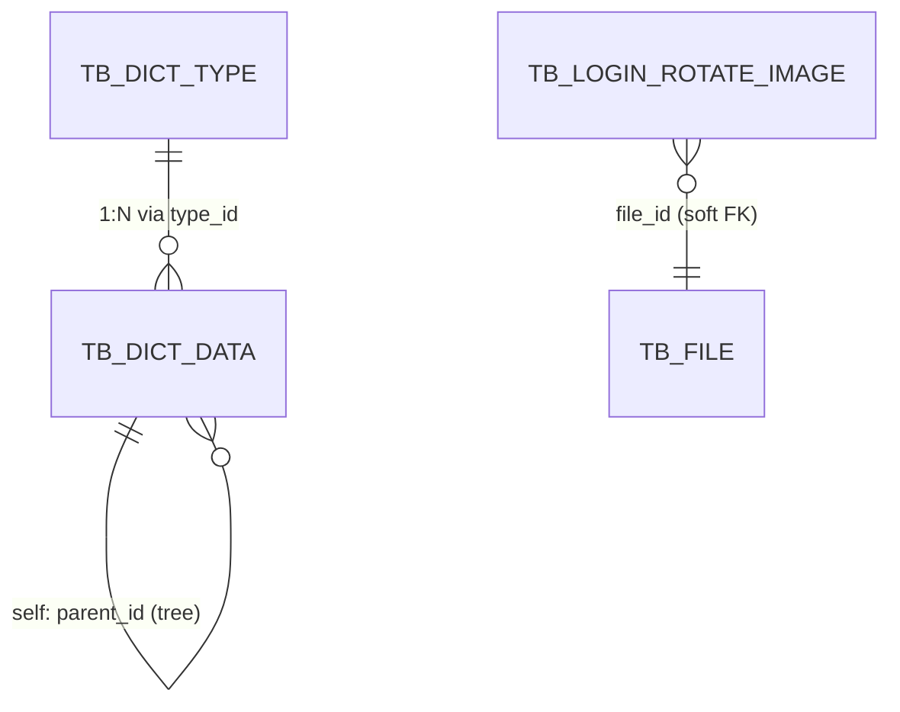

<!-- module: system -->
<!-- area: data -->
<!-- generated-by: reverse-scan -->
<!-- last-scan: 2026-05-20 -->
<!-- source-paths: replay-system/src/main/java/com/jiuyu/replay/system/entity/, replay-system/src/main/java/com/jiuyu/replay/system/repository/dao/ -->

# System Data -- 数据模型

> replay-system 模块完整数据表结构。共 3 张 MySQL 表，覆盖字典类型、字典数据、登录页轮播图。

---

## 一、表清单

所有表统一约束：
- 雪花 ID `@TableId(type = IdType.INPUT)`，PK 由 `SnowflakeManager.nextValue()` 在 Producer 层生成
- 手动软删除字段 `is_deleted (Integer)`，**禁** `@TableLogic`
- 手动审计 `create_date` / `update_date` (DATETIME)，业务代码显式 `new Date()` 赋值
- 无 tenantId 字段（字典和轮播图为全局配置，不区分租户）

### 1. 字典类型（1 张）

| 表名 | 实体 | 核心字段 | 说明 |
|------|------|----------|------|
| `tb_dict_type` | DictTypeEntity | id, logo(字典类型标识, UNIQUE 语义), name(字典类型名称), status(0启用/1禁用), createDate, updateDate, isDeleted | 字典分类定义，logo 是跨模块查找 key |

### 2. 字典数据（1 张）

| 表名 | 实体 | 核心字段 | 说明 |
|------|------|----------|------|
| `tb_dict_data` | DictDataEntity | id, typeId(关联 tb_dict_type.id), label(字典标签), value(字典值), status(0启用/1禁用), sort(排序), parentId(父级ID, 0=根节点), createDate, updateDate, isDeleted | 字典键值对条目，通过 parentId 支持树形层级 |

### 3. 登录页轮播图（1 张）

| 表名 | 实体 | 核心字段 | 说明 |
|------|------|----------|------|
| `tb_login_rotate_image` | LoginRotateImageEntity | id, userId(存入者), imgStatus(0启用/1停用), sort(排序), content(图片下方内容), fileId(关联文件表), createDate, updateDate, isDeleted | 客户端登录页轮播图片配置 |

---

## 二、ER 关系



- `tb_dict_data.typeId` --> `tb_dict_type.id`：每个字典项归属一个字典类型
- `tb_dict_data.parentId` --> `tb_dict_data.id`：自引用树形层级
- `tb_login_rotate_image.fileId` --> 文件表（replay-common 模块管理）：轮播图片关联

---

## 三、表结构详解

### 3.1 tb_dict_type -- 字典类型

| 列名 | Java 类型 | DB 类型 | Key | 说明 |
|------|-----------|--------|-----|------|
| id | Long | BIGINT | PK | 雪花 ID |
| logo | String | VARCHAR | 业务唯一 | 字典类型标识（如 "replay_platform_type"），跨模块查找 key |
| name | String | VARCHAR | | 字典类型名称（中文展示） |
| status | Integer | TINYINT | | 0:启用 / 1:禁用 |
| create_date | Date | DATETIME | | 创建时间 |
| update_date | Date | DATETIME | | 最后修改时间 |
| is_deleted | Integer | TINYINT | | 0:未删除 / 1:已删除 |

DDL 推断：
```sql
CREATE TABLE tb_dict_type (
    id BIGINT NOT NULL,
    logo VARCHAR(64) NOT NULL,
    name VARCHAR(64) NOT NULL,
    status TINYINT NOT NULL DEFAULT 0,
    create_date DATETIME NOT NULL,
    update_date DATETIME NOT NULL,
    is_deleted TINYINT NOT NULL DEFAULT 0,
    PRIMARY KEY (id),
    UNIQUE KEY uk_logo (logo)
);
```

### 3.2 tb_dict_data -- 字典数据

| 列名 | Java 类型 | DB 类型 | Key | 说明 |
|------|-----------|--------|-----|------|
| id | Long | BIGINT | PK | 雪花 ID |
| type_id | Long | BIGINT | FK | 关联 tb_dict_type.id |
| label | String | VARCHAR | | 字典标签（显示名） |
| value | String | VARCHAR | | 字典值（存储/传输用） |
| status | Integer | TINYINT | | 0:启用 / 1:禁用 |
| sort | Integer | INT | | 排序（ASC） |
| parent_id | Long | BIGINT | | 父级字典数据 ID，0=根节点 |
| create_date | Date | DATETIME | | 创建时间 |
| update_date | Date | DATETIME | | 最后修改时间 |
| is_deleted | Integer | TINYINT | | 0:未删除 / 1:已删除 |

DDL 推断：
```sql
CREATE TABLE tb_dict_data (
    id BIGINT NOT NULL,
    type_id BIGINT NOT NULL,
    label VARCHAR(128) NOT NULL,
    value VARCHAR(128) NOT NULL,
    status TINYINT NOT NULL DEFAULT 0,
    sort INT NOT NULL DEFAULT 0,
    parent_id BIGINT NOT NULL DEFAULT 0,
    create_date DATETIME NOT NULL,
    update_date DATETIME NOT NULL,
    is_deleted TINYINT NOT NULL DEFAULT 0,
    PRIMARY KEY (id),
    KEY idx_type_sort (type_id, sort),
    KEY idx_type_status (type_id, status)
);
```

### 3.3 tb_login_rotate_image -- 客户端登录页轮播图

| 列名 | Java 类型 | DB 类型 | Key | 说明 |
|------|-----------|--------|-----|------|
| id | Long | BIGINT | PK | 雪花 ID |
| user_id | Long | BIGINT | | 存入者 ID |
| img_status | Integer | TINYINT | | 0:启用展示 / 1:停止展示 |
| sort | Integer | INT | | 排序（ASC），新增时自动重排避免冲突 |
| content | String | VARCHAR | | 每张图片底下的描述内容 |
| file_id | Long | BIGINT | | 关联文件表 ID |
| create_date | Date | DATETIME | | 创建时间 |
| update_date | Date | DATETIME | | 修改时间 |
| is_deleted | Integer | TINYINT | | 0:未删除 / 1:已删除 |

DDL 推断：
```sql
CREATE TABLE tb_login_rotate_image (
    id BIGINT NOT NULL,
    user_id BIGINT NOT NULL,
    img_status TINYINT NOT NULL DEFAULT 0,
    sort INT NOT NULL DEFAULT 0,
    content VARCHAR(256) DEFAULT '',
    file_id BIGINT NOT NULL,
    create_date DATETIME NOT NULL,
    update_date DATETIME NOT NULL,
    is_deleted TINYINT NOT NULL DEFAULT 0,
    PRIMARY KEY (id),
    KEY idx_img_status_sort (img_status, sort)
);
```

---

## 四、索引与查询模式

### 关键查询路径与建议索引

| 表 | 高频查询 | 字段 | 代码查询方式 | 建议索引 |
|----|----------|------|-------------|----------|
| `tb_dict_type` | 按 logo 查类型 | `logo` | `LambdaQueryWrapper.eq(DictTypeEntity::getLogo, typeLogo)` | `UNIQUE KEY uk_logo (logo)` |
| `tb_dict_data` | 按 type_id 查全部条目 | `type_id`, `sort` | `LambdaQueryWrapper.eq(DictDataEntity::getTypeId, typeId).orderByAsc(DictDataEntity::getSort)` | `KEY idx_type_sort (type_id, sort)` |
| `tb_dict_data` | 分页查询按 typeId + status | `type_id`, `status`, `sort` | 多条件 LambdaQueryWrapper | `KEY idx_type_status_sort (type_id, status, sort)` |
| `tb_dict_data` | 按 id 批量查 | `id` | `LambdaQueryWrapper.in(DictDataEntity::getId, ids)` | PK 已就位 |
| `tb_login_rotate_image` | 客户端查询启用图 | `img_status`, `sort` | `LambdaQueryWrapper.eq(imgStatus, 0).orderByAsc(sort)` | `KEY idx_status_sort (img_status, sort)` |
| `tb_login_rotate_image` | 分页管理查询 | `content` LIKE | `QueryWrapper.like("content", keyword)` | PK 已就位（全表扫描，数据量小） |

### 反 JOIN 数据装配模式

- **字典列表 + 类型名**: `DictDataProducerImpl.queryPage` 先分页查 `tb_dict_data` -> 提取 typeIds -> `dictTypeService.listByIds(typeIds)` -> 内存 Map 装配 typeName
- **字典树 + 类型名**: `DictDataProducerImpl.listDictDataTree` 查全部条目 -> `dictTypeService.lambdaQuery().in(typeIds).list()` -> Map 批量装配
- **轮播图 + 文件信息**: `LoginRotateImageLogicImpl` 查轮播图记录 -> 提取 fileIds -> `fileBll.listByFileIds(fileIds)` -> 内存 Map 装配 name/url/resourceId

`IN (...)` 查询：dictDataListByIds 使用 `IN` 按 ID 列表查询；需注意超过 500 时 `Lists.partition(ids, 500)` 分批（项目级硬约束）。

---

## 五、缓存策略（Redis）

| Redis Key | 数据类型 | TTL | 写入时机 | 失效时机 |
|-----------|----------|-----|----------|----------|
| `replay:dict:type-logo:{logo}` | String (JSON Array) | 5 天 | `DictDataProducerImpl.listByTypeLogo()` 首次查询 miss 后回填 | DictData 新增/修改/删除时主动 delete |

缓存详情：
- 存储格式：`JSON.toJSONString(List<DictDataListVo>)`
- 读取方式：`redisTemplate.opsForValue().get(key)` -> `JSON.parseArray(json, DictDataListVo.class)`
- 写入方式：`redisTemplate.opsForValue().set(key, json, Duration.ofDays(5))`
- 删除方式：`redisTemplate.delete(key)`
- 降级策略：缓存 miss 时直接查 DB（**未发现** Redis 降级检测机制）

---

## 六、生命周期与归档

| 表 | 软删除 | 删除方式 | 备注 |
|----|--------|----------|------|
| `tb_dict_type` | is_deleted 字段存在但代码未使用 | `dictTypeService.removeById(id)` 物理删除 | 实际为硬删除 |
| `tb_dict_data` | is_deleted 字段存在但代码未使用 | `dictDataService.removeById(id)` 物理删除 | 实际为硬删除 |
| `tb_login_rotate_image` | is_deleted 字段存在但代码未使用 | `loginRotateImageService.removeById(id)` 物理删除 | 实际为硬删除，删除前同步删除关联文件 |

> 注意：三张表 Entity 均声明了 `isDeleted` 字段，但 Producer 层**未显式设置 `setIsDeleted(0/1)`**，删除操作使用 `removeById`（MyBatis-Plus 物理删除），实际上 is_deleted 字段未被充分利用。

---

## 七、字段命名 / 类型约定

- 主键：`id BIGINT` 雪花
- 时间：`create_date` / `update_date` (DATETIME)，Java 类型 `java.util.Date`
- 布尔语义：`TINYINT` (0/1) -- `status` / `imgStatus` / `isDeleted`
- 金额：N/A（system 模块无金额字段）
- 树形结构：`parent_id BIGINT`，0 表示根节点
- 模式：所有写方法在 Producer 层**未显式加 `@Transactional`**（例外：`LoginRotateImageProducerImpl.toUpdateSort` 加了 `@Transactional(rollbackFor = Exception.class)`）

---

## 八、注意点 / 反模式

| 反模式 / 注意点 | 说明 |
|----------------|------|
| is_deleted 字段未使用 | 三张表 Entity 都有 isDeleted 字段，但删除使用物理删除（removeById），未走软删除 |
| 无 @Transactional 保护 | DictDataProducerImpl.save/update/delete 和 DictTypeProducerImpl.save/update/delete 未加 @Transactional；多表写操作（如 save 同时删缓存）缺少事务边界 |
| 缓存和 DB 不一致风险 | DictData 变更时先删缓存再写 DB，两步非原子，缓存 miss 后回填逻辑无锁保护 |
| 字典值唯一性无约束 | label+typeId 组合未建唯一索引，可能出现同类型下 label 重复 |
| QueryWrapper 非 Lambda 风格 | DictTypeProducerImpl 和 LoginRotateImageProducerImpl 使用 `QueryWrapper`（字符串字段名），非 `LambdaQueryWrapper`（类型安全），与规范建议不一致 |
| 轮播图 sort 自增逻辑 | toUpdateSort 方法在 save/update 后调用，查询 `sort >= 当前值` 的全部记录逐条 +1，并发场景可能产生 sort 重复 |
