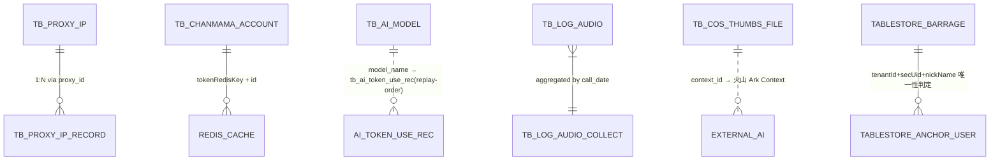

<!-- module: third -->
<!-- area: data -->
<!-- generated-by: reverse-scan -->
<!-- last-scan: 2026-05-20 -->
<!-- source-paths: replay-third/src/main/java/com/jiuyu/replay/third/entity/, replay-third/src/main/java/com/jiuyu/replay/third/tablestore/entity/ -->

# Third Data — 数据模型

> `replay-third` 自有的持久化数据 = 8 张 MySQL 表 + 2 张 TableStore 表（阿里云 NoSQL）。所有 MySQL 表统一约束：雪花 ID (`IdType.INPUT`)、手动软删除 (`isDeleted`)、手动时间戳 (`createDate` / `updateDate`)，**不使用 `@TableLogic`**。

---

## 一、MySQL 表（8 张）

> 所有实体在 `replay-third/src/main/java/com/jiuyu/replay/third/entity/`。命名通用：表名 `tb_xxx`，字段 snake_case，实体字段 camelCase。

### 1.1 AI 模型配置表

| 项 | 值 |
|---|---|
| 表名 | `tb_ai_model` |
| 实体 | `AiModelEntity` |
| 用途 | 大模型对接的可选模型配置；运营在后台维护，运行时通过 `modelCode` / `endpointId` 路由到具体厂商 |

| 字段（Java） | 列名 | 类型 | 必填 | 含义 |
|---|---|---|---|---|
| id | id | BIGINT | 是 | 雪花 ID（IdType.INPUT） |
| modelCode | model_code | VARCHAR | 是 | 模型编码（业务侧标识，唯一） |
| resourceType | resource_type | TINYINT | 是 | 厂商：0 豆包 / 1 通义 / 2 DeepSeek |
| useType | use_type | TINYINT | 是 | 用途：0 分析内容 / 1 截图视觉理解 |
| modelName | model_name | VARCHAR | 是 | 模型展示名 |
| endpointId | endpoint_id | VARCHAR | 是 | 厂商 endpoint id（如豆包 `ep-xxx`） |
| apiKey | api_key | VARCHAR | 是 | 厂商 apiKey（**敏感**） |
| outSize | out_size | INT | 否 | 输出数据流大小（KB） |
| inputSize | input_size | INT | 否 | 输入数据流大小（KB） |
| contextSize | context_size | INT | 否 | 缓存上下文大小（KB） |
| wordsNum | words_num | INT | 否 | 限制使用字数 |
| outWordNum | out_word_num | INT | 否 | 推荐输出字数 |
| sort | sort | INT | 否 | 排序 |
| remarks | remarks | VARCHAR | 否 | 备注 |
| consumeMultiple | consume_multiple | DOUBLE | 否 | 算力消费倍数（计费用） |
| createDate | create_date | DATETIME | 是 | 创建时间 |
| updateDate | update_date | DATETIME | 是 | 修改时间 |
| isDeleted | is_deleted | TINYINT | 是 | 软删除 0/1 |

---

### 1.2 代理 IP 提取配置表

| 项 | 值 |
|---|---|
| 表名 | `tb_proxy_ip` |
| 实体 | `ProxyIpEntity` |
| 用途 | 神龙代理 IP 提取链接池配置 |

| 字段 | 列名 | 类型 | 含义 |
|---|---|---|---|
| id | id | BIGINT | 雪花 ID |
| extractUrl | extract_url | VARCHAR | 提取 IP 的 URL（含厂商鉴权参数） |
| totalNum | total_num | INT | 总 IP 数 |
| remainingNum | remaining_num | INT | 剩余 IP 数（每次提取 -1） |
| ipEffectiveTime | ip_effective_time | INT | IP 有效时长（分钟） |
| activeStatus | active_status | TINYINT | 激活状态 0/1 |
| proxyUsername | proxy_username | VARCHAR | 代理账号（**敏感**） |
| proxyPassword | proxy_password | VARCHAR | 代理密码（**敏感**） |
| validityType | validity_type | TINYINT | 时效类型 0=短效 / 1=长效 |
| dayUseNum | day_use_num | INT | 单用户每日可用次数 |
| createDate / updateDate / isDeleted | — | — | 通用审计字段 |

---

### 1.3 代理 IP 提取记录

| 项 | 值 |
|---|---|
| 表名 | `tb_proxy_ip_record` |
| 实体 | `ProxyIpRecordEntity` |
| 用途 | 每个用户每次实际分配到的 IP 记录 |

| 字段 | 列名 | 类型 | 含义 |
|---|---|---|---|
| id | id | BIGINT | 雪花 ID |
| userId | user_id | BIGINT | 用户 ID |
| tenantId | tenant_id | BIGINT | 租户 ID |
| proxyId | proxy_id | BIGINT | 关联 `tb_proxy_ip.id` |
| ipStr | ip_str | VARCHAR | 分配的 IP |
| portStr | port_str | VARCHAR | 分配的端口 |
| extractDate | extract_date | DATETIME | 提取时间 |
| validityDate | validity_date | DATETIME | 有效期至 |
| ipEffectiveTime | ip_effective_time | INT | 该次有效时长（分钟） |
| createDate / updateDate / isDeleted | — | — | 通用审计 |

---

### 1.4 COS 点赞问答文件记录

| 项 | 值 |
|---|---|
| 表名 | `tb_cos_thumbs_file` |
| 实体 | `CosThumbsFileEntity` |
| 用途 | 点赞问答 / 内容分析上传到对象存储的文件元数据，用于 AI 上下文复用 |

| 字段 | 列名 | 类型 | 含义 |
|---|---|---|---|
| id | id | BIGINT | 雪花 ID |
| tradeId | trade_id | BIGINT | 行业 ID（0=全行业） |
| userId | user_id | BIGINT | 用户 ID |
| sourceId | source_id | VARCHAR | 资源 ID（视频 ID / 文件 ID） |
| sourceType | source_type | TINYINT | 0=单个视频 / 1=文件 / 2=对比分析 |
| fileSize | file_size | BIGINT | 文件大小（字节） |
| coskey | coskey | VARCHAR | COS object key |
| contextId | context_id | VARCHAR | AI 上下文 ID（绑定豆包 Ark Context） |
| fileName | file_name | VARCHAR | 文件名 |
| askCount | ask_count | INT | 问答次数 |
| thumbState | thumb_state | TINYINT | 点赞状态 0/1/2（未点 / 已点赞 / 点踩） |
| uploadDate | upload_date | DATETIME | 上传时间 |
| resourceType | resource_type | TINYINT | 来源类型 0=系统 |
| platformType | platform_type | TINYINT | 0 全 / 1 抖音 / 2 快手 / 3 微视 |
| cosType | cos_type | TINYINT | 会话类型 0=运营问题 / 1=违规 |
| sort | sort | INT | 排序 |
| remarks | remarks | VARCHAR | 描述 |
| createDate / updateDate / isDeleted | — | — | 通用审计 |

---

### 1.5 语音识别 QPS 日志

| 项 | 值 |
|---|---|
| 表名 | `tb_log_audio` |
| 实体 | `LogAudioEntity` |
| 用途 | 每次 ASR 调用的日志（成功 / 失败 / 失败码） |

| 字段 | 列名 | 类型 | 含义 |
|---|---|---|---|
| id | id | BIGINT | 雪花 ID |
| userId | user_id | BIGINT | 用户 ID |
| callDate | call_date | DATETIME | 调用时间 |
| status | status | TINYINT | 0=成功 / 1=失败 |
| successNum | success_num | INT | 累计成功次数（重试到成功的次数） |
| errCode | err_code | VARCHAR | 失败状态码 |
| errMsg | err_msg | VARCHAR | 失败原因 |
| createDate / updateDate / isDeleted | — | — | 通用审计 |

---

### 1.6 语音识别 QPS 聚合

| 项 | 值 |
|---|---|
| 表名 | `tb_log_audio_collect` |
| 实体 | `LogAudioCollectEntity` |
| 用途 | 按秒聚合的 QPS / 用户数（用于 dashboard） |

| 字段 | 含义 |
|---|---|
| id | 雪花 ID |
| callDate | 时间点 |
| qpsNumCount | QPS 总数 |
| userNumCount | 用户量总数 |
| createDate / updateDate / isDeleted | 通用审计 |

> ⚠️ `ScheduledTasks#qpsCount` / `batchSaveAudioLog` 的批写定时任务**当前全部注释**（1.9.10 之后版本废弃）。表保留但写入路径已停用。

---

### 1.7 ASR 调用日志（备份表）

| 项 | 值 |
|---|---|
| 表名 | `tb_audio_log` |
| 实体 | `AudioLogEntity` |
| 用途 | 历史 ASR 调用记录（最小版） |

| 字段 | 含义 |
|---|---|
| id | 雪花 ID |
| userId | 用户 ID |
| callDate | 调用时间 |
| createDate / updateDate / isDeleted | 通用审计 |

---

### 1.8 蝉妈妈账号

| 项 | 值 |
|---|---|
| 表名 | `tb_chanmama_account` |
| 实体 | `ChanmamaAccountEntity` |
| 用途 | 第三方数据平台账号池，运行时由定时任务定期登录获取 token |

| 字段 | 含义 |
|---|---|
| id | 雪花 ID |
| username | 蝉妈妈账号（**敏感**） |
| chanmamaPassword | 蝉妈妈密码（**敏感**） |
| everyDayQueryNum | 每日查询次数上限 |
| createDate / updateDate / isDeleted | 通用审计 |

---

## 二、阿里云 TableStore 表（NoSQL，2 张）

> 配置：`third.ali.tablestore.{endpoint, accessKeyId, accessKeySecret, instanceName, barrageTableName, anchorUserTableName}`。客户端在 `TableStoreConfig#syncClient`（`SyncClient`）。

### 2.1 弹幕表（Barrage）

| 项 | 值 |
|---|---|
| 表名变量 | `${third.ali.tablestore.barrage-table-name}` |
| 实体 | `BarrageBo`（`tablestore/entity/BarrageBo.java`） |
| 类型 | TableStore（OTS）行存储 + 二级索引 + 多元索引 |

**主键（PK）：** `tenantId, userId, batchNumber, msgId`（4 列复合 PK，msgId 为最末位用于排序）

**核心属性列：**
- `secUid`（主播标识）、`videoId`
- `nickName`、`realNickName`、`level`、`isNew`
- `fansLevelMin`、`fansLevelMax`、`fansLevelCurrent`（粉丝团等级范围 + 当前值）
- `content`（弹幕文本）、`recordDate`（毫秒时间戳）
- `sort`（同时间窗内顺序；福袋固定 0）、`isBlessBag`
- `important`（重要弹幕标记）

**索引：**
- 主键范围查询（`queryRange` → 二级索引）：`TableStoreBll#queryDanMuData`
- 多元索引（SQL 接口）：`TableStoreBll#queryDanMuSearchData` 直接拼 SQL，`from ${barrageTableName} where 1=1 and ...` 支持 nick / level / 时间 / 福袋 / 重要弹幕过滤
- 缓存：`replay:words:barrageAnnotation:{videoId}[_{isBlessBag}]` Redis 14 天

---

### 2.2 主播-用户快照表（AnchorUser）

| 项 | 值 |
|---|---|
| 表名变量 | `${third.ali.tablestore.anchor-user-table-name}` |
| 实体 | `AnchorUserBo` |

**主键：** `tenantId, secUid, nickName, batchNumber`

**属性列：**
- `recordDate`（首次出现时间）
- `realNickName`（脱敏前真实昵称，脱敏抖音昵称用）
- `userLevel`（用户等级）

**用途：** 判定弹幕里 `isNew`（同主播同昵称首次出现 → true）。

---

## 三、ER 关系图

---

## 四、租户隔离 & 索引建议

### 4.1 哪些表需要租户隔离

| 表 | 字段 | 是否必带 tenantId 过滤 |
|---|---|---|
| `tb_proxy_ip_record` | `tenant_id` | 是 |
| `tb_proxy_ip` | — | 否（全局共享池） |
| `tb_ai_model` | — | 否（全局共享） |
| `tb_chanmama_account` | — | 否（全局共享） |
| `tb_log_audio` / `tb_log_audio_collect` / `tb_audio_log` | — | 否（按 userId） |
| `tb_cos_thumbs_file` | — | 否（按 userId） |
| TableStore `BARRAGE` / `ANCHOR_USER` | `tenantId`（PK 首位） | 是（PK 必带，物理保证） |

> 注：`ProxyIpRecordEntity` 有 `tenantId` 字段，统计 / 列表查询时必须带 `tenant_id = #{tenantId}` 过滤。

### 4.2 推荐索引（实际 DDL 待人工校验）

| 表 | 推荐索引 | 查询场景 |
|---|---|---|
| `tb_ai_model` | `KEY idx_model_code (model_code)` | `getByCode(modelCode)` |
| `tb_ai_model` | `KEY idx_resource_use (resource_type, use_type)` | 按厂商 / 用途筛选 |
| `tb_proxy_ip` | `KEY idx_active_validity (active_status, validity_type)` | `getUsableProxyIp(validityType)` |
| `tb_proxy_ip_record` | `KEY idx_user_proxy_date (user_id, proxy_id, create_date)` | `countDayUserNum(userId, tenantId, proxyId)` |
| `tb_cos_thumbs_file` | `KEY idx_user_source (user_id, source_id, source_type)` + `KEY idx_context (context_id)` | `getCosThumbsFileByContextId` |
| `tb_log_audio` | `KEY idx_user_call (user_id, call_date)` | 按用户拉调用历史 |
| `tb_chanmama_account` | `KEY idx_username (username)` | login 时定位账号 |

---

## 五、数据生命周期

| 表 | 软删除 | 归档 | 备注 |
|---|---|---|---|
| 全部 8 张 MySQL 表 | 手动 `is_deleted = 1` | 暂无 | 实体均无 `@TableLogic`（按 jiuyu 项目规范） |
| TableStore Barrage | TableStore 自带 TTL（按表配置，默认无） | 14 天 Redis 缓存 + 阿里云冷存储分层 | 取决于云配置 |
| Redis 临时数据 | TTL 自动过期 | — | 涉及：支付二维码、ASR token、AI Context、Chanmama token、Proxy IP user 缓存、弹幕埋点缓存 |

---

## 六、关键 Redis Key（与持久化数据相关）

| Key 前缀（配置项） | 内容 | TTL | 来源类 |
|---|---|---|---|
| `weChatPayProperties.codeUrlRedisKey + orderId` | 微信支付二维码 URL | `common.order-timeout-minutes` | `PayBll#getPayCode` |
| `aliPayProperties.codeUrlRedisKey + orderId` | 支付宝支付二维码 URL | `common.order-timeout-minutes` | `PayBll#getPayCode` |
| `shenlongProperties.proxyIpUserRedisKeyPrefix + validityType + userId` | 用户已分配代理 IP | `ipEffectiveTime - 1 min` | `ProxyIpBll#getProxyIp` |
| `chanmamaProperties.tokenRedisKey + accountId` | 蝉妈妈登录 token + 账号缓存 | 30 分钟 | `ThirdDataUtils` |
| `RedisCacheKey.aiTempArkTokenCacheKey` | 火山 Ark 全局临时 token（旧路径） | `tempTokenSaveTime - 120s` | `ZiJieUtils#getArkTempToken` |
| `RedisCacheKey.aiTempArkTokenCacheKey + modelCode` | 火山 Ark 模型级临时 token | 同上 | `ZiJieUtils#getArkTempTokenByModel` + `AiRedisOperate` |
| `RedisCacheKey.aiContextIdCacheKey + uuid` | 豆包 Ark 上下文 ID | 3600s | `ZiJieUtils#douBaoAI` |
| `RedisCacheKey.aiSessionIdCacheKey + uuid + sessionIdKey` | 当前分析任务 SessionId | 任务完成自动删 | `ZiJieUtils#douBaoAI` |
| `replay:words:barrageAnnotation:{videoId}[_{isBlessBag}]` | 弹幕埋点聚合结果 | 14 天 | `TableStoreBll#getBarrageDataList` |
| `RedisCacheKey.barrageDataCacheKey + videoId` | 视频维度全量弹幕缓存 | 2 小时 | `TableStoreBll#setBarrageRedisCache` |
| `tencentAudioProperties.redisKeyPrefix + secretId` | ASR QPS 余量 | 启动时初始化 | `ThirdStartInit#init` |

---

## 七、数据装配策略（反 JOIN）

- 跨模块**不直连 Dao** —— `replay-third` 通过 Feign 调 `dictDataFeign` / `anchorVideoFeign` / `sensitiveWordsFeign` / `aiTokenUseRecordFeign`。
- TableStore 表与 MySQL 表**完全隔离**，不存在跨库 JOIN。
- AI Token 计费记录（`tb_ai_token_use_rec`）落在 replay-order，本模块通过 Feign 写入。
- AnchorVideo / SentenceMark 等业务 VO 通过 Feign 拉取，在 `TableStoreBll#getBarrageDataList` 内存装配后输出。

---

## 八、设计原则

1. **协议适配只持有"适配所需"的数据** —— 平台凭证、上下文、调用日志、用户级临时凭证缓存；业务实体不在本模块。
2. **AK/SK 字段绝对不入应用日志** —— `WeChatPay#queryOrderStatus` 打印 transaction 是 OK 的（已脱敏），但 `merchantId / apiKey / privateKey / accessKeySecret` 在任何 log 调用都禁止出现。
3. **新增表必须遵循 jiuyu 实体规约** —— 雪花 ID + IdType.INPUT + 手动审计字段 + 手动 isDeleted。**不要**对 `tb_ai_model` 等新表加 `create_id` / `update_id` 列继承 `BaseEntity`（见 CRM ADR-005 教训）。
4. **TableStore 字段 snake_case，Java 字段 camelCase** —— SDK 自动映射；新增字段需双侧同步。
