<!-- module: video -->
<!-- area: data -->
<!-- persistence: MySQL (MyBatis-Plus) — 18 tables + MongoDB — 1 collection -->
<!-- generated-by: reverse-scan -->
<!-- last-scan: 2026-05-20 -->
<!-- source-paths: replay-video/src/main/java/com/jiuyu/replay/video/project/entity/, replay-video/src/main/java/com/jiuyu/replay/video/project/document/ -->

# Video Data — 数据模型

> replay-video 模块完整数据结构。共 **18 张 MySQL 表 + 1 个 MongoDB 集合**。
> **⚠️ 与项目主规范的偏差**：本模块的 MySQL 实体**普遍使用** `@TableLogic` 注解（而 CLAUDE.md §5 / words 模块约定**禁用** `@TableLogic`、要求手动 `isDeleted`）。这是 replay-video 模块的历史实现，**新增表 / 改老表时建议保持现状不要混用两种风格**，跨模块新接口若需复用 video 表，注意软删除行为差异。

---

## 一、MySQL 表（18 张）

### 表级共用规则

- **ID**：`@TableId("id")` + `private Long id`（雪花 ID，由 `SnowflakeManager.nextValue()` 生成）。新表（如 `tb_video_hot_search_email_*`）显式声明 `type = IdType.INPUT`，老表大多省略（依赖 MyBatis-Plus 全局默认）。
- **时间戳**：手动赋值 `created_date`（注意：词段是 `created_date`，**不是** words 模块的 `create_date`）+ `update_date`（`updated_date` 用于 DailyData 表，命名不统一）。
- **软删除**：绝大多数表使用 `@TableLogic` + `is_deleted` Byte（0/1）。例外：`tb_video_hot_search_email_account / tb_video_hot_search_email_failure_log / tb_video_hot_search_email_usage_log` 这 3 张邮箱池新表**未加** `@TableLogic`，是普通字段（手动判断）。
- **租户隔离**：仅"用户视角"的表带 `tenant_id`；事实 / 字典类表不带。

### 1. 视频域（3 张）

| 表名 | 实体 | 核心字段 | 说明 |
|------|------|----------|------|
| `tb_video_info` | VideoInfoEntity | platformType(1抖音/2快手/3视频号/4本地), platformVideoId, videoHash, title, description, coverUrl, videoUrl, authorId, authorName, likeCount, commentCount, shareCount, collectCount, duration(s), publishTime, extractStatus(0未/1已), extractTime, analysisStatus(0/1), analysisTime | 视频基础事实表（跨用户共享）|
| `tb_video_user_video` | VideoUserVideoEntity | videoId(关联 tb_video_info), videoTitle, **tenantId**, userId, sourceType(1URL/2本地/3达人/4爆款), sourceId, extractStatus(0-4), extractTime, extractErrorReason, analysisStatus, analysisTime | 用户-视频提取任务表（核心状态机载体） |
| `tb_video_info_daily_data` | VideoInfoDailyDataEntity | videoId, dataDate, likeCount, commentCount, shareCount, collectCount, +increment 各项, collectionTime, dataSource(1订阅/2手动/3API) | 视频每日增量数据；时间字段是 `updated_date` |

### 2. 达人域（4 张）

| 表名 | 实体 | 核心字段 | 说明 |
|------|------|----------|------|
| `tb_video_influencer_info` | VideoInfluencerInfoEntity | platformType, platformUserId, platformAccount, nickname, avatar, description(`@TableField("influencer_description")`), followersCount, followingCount, videoCount, likeCount, verificationStatus(0-4), verificationInfo, lastSyncTime | 跨平台达人事实表 |
| `tb_video_influencer_daily_data` | VideoInfluencerDailyDataEntity | influencerId, dataDate, followersCount, followingCount, videoCount, likeCount, +increment 各项, collectionTime, dataSource(1/2/3) | 达人每日增量数据；时间字段 `updated_date` |
| `tb_video_influencer_search_snapshot` | VideoInfluencerSearchSnapshotEntity | userId, **tenantId**, searchKeyword, platformType, totalInfluencers, totalVideos, searchTime | 达人搜索快照 |
| `tb_video_influencer_search_relation` | VideoInfluencerSearchRelationEntity | snapshotId, influencerId, sortOrder, videoCount, followersCount, isProcessed(0/1) | 快照-达人关联 |

### 3. 爆款域（5 张）

| 表名 | 实体 | 核心字段 | 说明 |
|------|------|----------|------|
| `tb_video_hot_search` | VideoHotSearchEntity | platformType, searchKeyword, videoCount, lastSyncTime | 爆款关键词事实表（platform_type + search_keyword 业务唯一） |
| `tb_video_hot_search_video` | VideoHotSearchVideoEntity | searchId(关联 tb_video_hot_search), videoId, influencerPlatformType, influencerPlatformUserId, influencerNickname, influencerAvatar, influencerFollowersCount, sortOrder | 爆款-视频关联（带达人冗余字段） |
| `tb_video_hot_search_daily_data` | VideoHotSearchDailyDataEntity | searchId, dataDate, videoCount, videoIncrement, collectionTime | 爆款每日增量数据 |
| `tb_video_hot_search_snapshot` | VideoHotSearchSnapshotEntity | userId, **tenantId**, searchKeyword, platformType, totalVideos, searchTime | 用户爆款搜索快照 |
| `tb_video_hot_search_relation` | VideoHotSearchRelationEntity | snapshotId, videoId, influencerPlatformType, influencerPlatformUserId, influencerNickname, influencerAvatar, influencerFollowersCount, sortOrder | 快照-视频关联（带达人冗余字段） |

### 4. 订阅 / 分组域（3 张）

| 表名 | 实体 | 核心字段 | 说明 |
|------|------|----------|------|
| `tb_video_user_subscription_group` | VideoUserSubscriptionGroupEntity | userId, **tenantId**, groupType(1达人/2爆款), groupName, description(`@TableField("group_description")`), isDefault(0/1) | 通用订阅分组容器 |
| `tb_video_user_influencer_subscription` | VideoUserInfluencerSubscriptionEntity | userId, **tenantId**, groupId(`updateStrategy = FieldStrategy.ALWAYS`), influencerId, industryId, isEnabled(0/1), likeCountThreshold(ALWAYS), updateTimeCondition(0-5, ALWAYS), monitorFrequency(h), lastSyncTime | 达人订阅 |
| `tb_video_user_hot_subscription` | VideoUserHotSubscriptionEntity | userId, **tenantId**, groupId(ALWAYS), keyword, platformType, industryId, subscriptionLikeCountThreshold, isEnabled, likeCountThreshold(ALWAYS), updateTimeCondition(ALWAYS), monitorFrequency, lastSyncTime | 爆款订阅 |

> `FieldStrategy.ALWAYS` 字段：允许将值更新为 null。**关键约束**——把订阅从某分组移回默认分组（groupId = null）必须用 ALWAYS，否则 MyBatis-Plus 默认会忽略 null 更新。

### 5. 邮箱账号池域（3 张，新表）

| 表名 | 实体 | 核心字段 | 说明 |
|------|------|----------|------|
| `tb_video_hot_search_email_account` | VideoHotSearchEmailAccountEntity | email, emailPassword(AES 加密), accountType(1-5), city, accountStatus(0-3), lastFailureTime, lastUseTime, lastUseClientIp, useTimeoutMinutes, currentUserCount, maxConcurrentUsers, remark | 邮箱账号主表；**无 `@TableLogic`** |
| `tb_video_hot_search_email_usage_log` | VideoHotSearchEmailUsageLogEntity | emailAccountId, clientIp, clientCity, useTime, releaseTime | 使用 / 释放流水；**无 `@TableLogic`** |
| `tb_video_hot_search_email_failure_log` | VideoHotSearchEmailFailureLogEntity | emailAccountId, email, clientIp, clientCity, failureType(1-5), failureReason, errorCode, errorMessage | 失败上报流水；**无 `@TableLogic`** |

> 邮箱池设计选择：因为大量记录需要"逻辑删除后保留审计 + 物理保留"，但是新代码倾向于让物理保留由日志表本身承担，因此账号主表去掉了 `@TableLogic`，靠 `accountStatus = 3` 表示禁用、靠运维清理日志表。

---

## 二、MongoDB 集合（1 个）

### `replay_video_content_extract`

**文档类**：`com.jiuyu.replay.video.project.document.VideoContentExtract`

```java
@Document(collection = "replay_video_content_extract")
```

#### 字段表

| 字段 | 类型 | 必填 | 索引 | 说明 |
|------|------|------|------|------|
| `_id` | String | 是 | 主键 | `String.valueOf(SnowflakeManager.nextValue())` |
| `video_hash` | String | 是 | **业务唯一**（无 unique 注解，靠应用层 + upsert 保证） | 与 MySQL `tb_video_info.video_hash` 对应；跨用户共享 key |
| `audio_content` | String | 是 | — | AI 优化后的音频转文字 |
| `original_audio_content` | String | 否 | — | 原文（未优化） |
| `subtitle_content` | Object | 否 | — | 字幕（预留） |
| `ocr_content` | Object | 否 | — | OCR 识别（预留） |
| `created_date` | LocalDateTime | 是 | — | 创建时间 |
| `update_date` | LocalDateTime | 是 | — | 更新时间 |
| `is_deleted` | Integer | 是 | — | 软删除标记（0 / 1） |

#### 索引

**当前文档类未使用任何 Spring Data MongoDB 索引注解** （`@Indexed / @CompoundIndex`）。
索引依赖在 MongoDB 侧手动建立（推测：`{video_hash: 1, is_deleted: 1}` —— Repository `@Query` 用此组合查询）<待补充：确认数据库侧索引>。

#### 访问层

- **Repository**：`VideoExtractContentRepository extends MongoRepository<VideoContentExtract, String>`
  - `@Query("{'video_hash': ?0, 'is_deleted': 0}") Optional<VideoContentExtract> findByVideoHash(String videoHash)`
- **Upsert 服务**：`MongoUpsertService`（`@Service`）
  - 关键方法 `upsertVideoContent(videoHash, audioContent, originalAudioContent)`：使用 `findAndModify + upsert(true) + returnNew(true)` 实现原子 upsert，`setOnInsert` 写入 `_id / created_date / is_deleted`，仅更新 `audio_content / update_date / original_audio_content`

#### 关键复用规则

- `video_hash` 复用：同一 hash 跨用户共享文案，扣费时检测命中后跳过实际生成、复用现有 doc
- 软删除：业务读取必须带 `is_deleted: 0`
- 与 MySQL 的关联：通过 `tb_video_info.video_hash` ↔ `replay_video_content_extract.video_hash`

---

## 三、ER（逻辑关系，MongoDB 无 FK，仅应用层引用）

```mermaid
erDiagram
    tb_video_info ||--o{ tb_video_user_video : "video_id"
    tb_video_info ||--o{ tb_video_info_daily_data : "video_id"
    tb_video_info ||--|| replay_video_content_extract : "video_hash (cross-store)"

    tb_video_influencer_info ||--o{ tb_video_influencer_daily_data : "influencer_id"
    tb_video_influencer_info ||--o{ tb_video_user_influencer_subscription : "influencer_id"
    tb_video_influencer_search_snapshot ||--o{ tb_video_influencer_search_relation : "snapshot_id"
    tb_video_influencer_info ||--o{ tb_video_influencer_search_relation : "influencer_id"

    tb_video_hot_search ||--o{ tb_video_hot_search_video : "search_id"
    tb_video_hot_search ||--o{ tb_video_hot_search_daily_data : "search_id"
    tb_video_info ||--o{ tb_video_hot_search_video : "video_id (denormalized influencer fields)"
    tb_video_hot_search_snapshot ||--o{ tb_video_hot_search_relation : "snapshot_id"
    tb_video_info ||--o{ tb_video_hot_search_relation : "video_id"

    tb_video_user_subscription_group ||--o{ tb_video_user_influencer_subscription : "group_id (nullable = default)"
    tb_video_user_subscription_group ||--o{ tb_video_user_hot_subscription : "group_id (nullable = default)"

    tb_video_hot_search_email_account ||--o{ tb_video_hot_search_email_usage_log : "email_account_id"
    tb_video_hot_search_email_account ||--o{ tb_video_hot_search_email_failure_log : "email_account_id"
```



---

## 四、索引（已确认 / 推测）

> DDL / `CREATE INDEX` 文件未在本扫描范围内（不在 `replay-video/src` 下）。索引猜测来自字段使用模式、唯一性语义、查询场景，标 `<待补充>` 处需后续手动确认。

### 高频查询字段（推测索引）

| 表 | 推荐索引 | 业务场景 |
|----|----------|----------|
| `tb_video_info` | `(platform_type, platform_video_id)` UNIQUE | 跨平台视频去重 |
| `tb_video_info` | `(video_hash)` | hash 复用查找 |
| `tb_video_user_video` | `(tenant_id, user_id, created_date)` | 历史列表分页 |
| `tb_video_user_video` | `(tenant_id, video_id)` | 检查是否已提取 |
| `tb_video_influencer_info` | `(platform_type, platform_user_id)` UNIQUE | 达人唯一定位 |
| `tb_video_influencer_search_snapshot` | `(tenant_id, user_id, search_time)` | 用户搜索历史 |
| `tb_video_hot_search` | `(platform_type, search_keyword)` UNIQUE | 关键词去重 |
| `tb_video_hot_search_snapshot` | `(tenant_id, user_id, search_time)` | 用户搜索历史 |
| `tb_video_hot_search_video` | `(search_id, sort_order)` | 按搜索取排序结果 |
| `tb_video_user_influencer_subscription` | `(tenant_id, user_id, group_id)` | 分组聚合 |
| `tb_video_user_hot_subscription` | `(tenant_id, user_id, group_id)` | 分组聚合 |
| `tb_video_hot_search_email_account` | `(account_status, city, last_use_time)` | 同城优先 + 时间最早分配（实际由 Redis ZSet 主导，DB 索引为兜底） |
| `tb_video_influencer_daily_data` | `(influencer_id, data_date)` UNIQUE | 每日数据去重 + 时序查询 |
| `tb_video_info_daily_data` | `(video_id, data_date)` UNIQUE | 同上 |
| `replay_video_content_extract` (Mongo) | `{video_hash: 1, is_deleted: 1}` | Repository @Query 走 |

详细 DDL 与索引证据 <待补充：从 sql/ 目录或 DB schema dump 取>。

---

## 五、数据装配策略（anti-JOIN）

与 words 模块一致，replay-video 也遵循"内存装配"原则，避免 SQL JOIN：

### 典型场景：历史提取记录列表

```text
1. Page 查询 tb_video_user_video by (tenant_id, ...)
2. List<userId> → userFeign.listByIds(userIds) → Map<userId, UserDto>
3. List<videoId> → videoInfoService.listByIds(videoIds) → Map<videoId, VideoInfoEntity>
4. records.stream().map → 装配 VideoExtractQueryVo
```

证据：`VideoExtractProducer#queryHistoryRecord`（约 130-195 行）

### 典型场景：爆款搜索结果列表

```text
1. Page 查询 tb_video_hot_search_video / tb_video_hot_search_relation by (search_id / snapshot_id)
2. videoIds → tb_video_info.listByIds → Map
3. influencerIds 已在关联表冗余存储（达人昵称 / 头像 / 粉丝数），无需二次查询
```

冗余字段（`influencer_nickname / influencer_avatar / influencer_followers_count`）是有意为之的反范式设计，避免热点路径 JOIN tb_video_influencer_info。

---

## 六、生命周期与跨域规则

### 软删除
- 18 张表中 **15 张使用 `@TableLogic + is_deleted Byte`**（一行 `@TableLogic` 注解）
- 3 张邮箱池表**不使用** `@TableLogic`（`tb_video_hot_search_email_account / email_usage_log / email_failure_log`），软删除靠业务层判断
- MongoDB `replay_video_content_extract` 用 `is_deleted: Integer 0/1` 手动管理

### 时间戳
- 写入时显式 `LocalDateTime.now()` 设置（不依赖自动填充）
- 字段名约定：
  - 多数业务表：`created_date / update_date`
  - DailyData 系列：`created_date / updated_date`（注意 d 的位置）

### 租户隔离
- 用户视角的表带 `tenant_id`：VideoUserVideo, VideoUserSubscriptionGroup, VideoUserHotSubscription, VideoUserInfluencerSubscription, VideoHotSearchSnapshot, VideoInfluencerSearchSnapshot
- 事实 / 字典表不带 `tenant_id`：VideoInfo, VideoInfluencerInfo, VideoHotSearch, VideoHotSearchEmailAccount, 各种 *DailyData, *Relation, *Video 关联表

### 跨存储一致性
- MySQL（tb_video_info / tb_video_user_video）与 MongoDB（replay_video_content_extract）**不在同一事务**
- 文案 upsert 使用 `MongoTemplate#findAndModify`，是原子单文档操作
- 状态机 COMPLETED 转换流程：MongoDB upsert 在 MySQL 事务**之前**完成（推测，<待补充：确认 Producer 调用顺序>），失败时通过状态回滚 + 业务补偿处理
