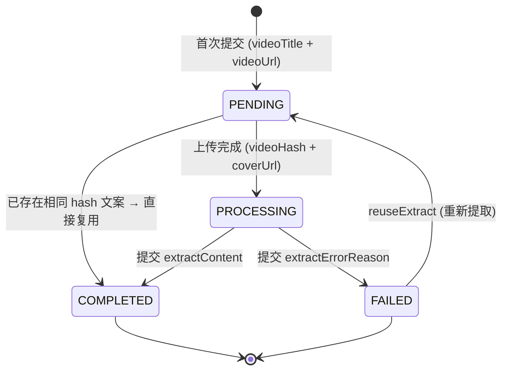

<!-- module: video -->
<!-- area: domain -->
<!-- persistence: MySQL (MyBatis-Plus) + MongoDB (single collection) -->
<!-- generated-by: reverse-scan -->
<!-- last-scan: 2026-05-20 -->
<!-- source-paths: replay-video/, replay-api/.../controller/video/ (无：本模块全部 Controller 在 replay-video 内) -->

# Video Domain — 业务概念与词汇表

> replay-video 模块核心业务概念定义。Agent 在进行 Explorer/Propose 阶段时必须使用此术语表，避免领域漂移。

> **重要：持久化构成**
> 与 CLAUDE.md "(MongoDB)" 简短描述不同——本模块**绝大部分**业务表是 **MySQL (MyBatis-Plus)**，仅 **1 个集合** `replay_video_content_extract` 落 MongoDB（用于存超长文案）。详细见 [`video_data.md`](../data/video_data.md)。

---

## 一、模块定位

replay-video 是直播复盘平台的 **短视频文案工具模块**，承载三大子域：

- **短视频文案提取（Extract）**：URL / 本地上传 → 状态机驱动 → MongoDB 落文案
- **达人管理（Influencer）**：跨平台达人信息、搜索快照、订阅、每日数据采集
- **爆款搜索（Hot Search）**：关键词爆款视频搜索、订阅、邮箱账号池（Redis + Lua）
- **订阅分组（Subscription Group）**：通用分组容器（达人订阅 / 爆款订阅复用同一张表）

---

## 二、核心概念

| 概念 | 定义 | 关联概念 | 状态机 |
|------|------|----------|--------|
| **VideoInfo (视频基础信息)** | 跨平台视频（抖音/快手/视频号/本地上传）的事实表，按 `platform_type + platform_video_id` 唯一 | VideoUserVideo, VideoContentExtract | `extractStatus`: 0未提取/1已提取 |
| **VideoUserVideo (用户-视频提取记录)** | 用户对某视频发起的文案提取任务，承载状态机生命周期 | VideoInfo, VideoContentExtract | `ExtractStatusEnum` |
| **VideoContentExtract (视频内容提取-MongoDB)** | 视频文案（音频转文字 / 字幕 / OCR），以 `video_hash` 为复用 key，跨用户共享 | VideoInfo (video_hash) | — |
| **VideoInfoDailyData (视频每日数据)** | 视频的逐日点赞 / 评论 / 分享 / 收藏快照与增量 | VideoInfo | — |
| **VideoInfluencerInfo (达人信息)** | 平台达人（抖音号/快手号/视频号），唯一键 `platform_type + platform_user_id` | VideoInfluencerDailyData, VideoUserInfluencerSubscription | `verificationStatus`: 0-4 认证状态 |
| **VideoInfluencerDailyData (达人每日数据)** | 达人逐日粉丝 / 关注 / 作品 / 获赞快照与增量 | VideoInfluencerInfo | `dataSource`: 1订阅/2手动/3API |
| **VideoInfluencerSearchSnapshot (达人搜索快照)** | 一次达人搜索的快照记录，存搜索关键词与命中达人数 | VideoInfluencerSearchRelation | — |
| **VideoInfluencerSearchRelation (达人搜索-达人关联)** | 搜索快照与命中达人的多对多关联，含排序与处理标记 | VideoInfluencerSearchSnapshot, VideoInfluencerInfo | `isProcessed`: 0未处理/1已处理 |
| **VideoHotSearch (爆款表)** | 关键词维度的爆款条目（platform_type + search_keyword 唯一），承载视频总数与最后同步时间 | VideoHotSearchVideo, VideoHotSearchDailyData | — |
| **VideoHotSearchVideo (爆款-视频关联)** | 爆款条目与具体视频的关联，含达人冗余字段 | VideoHotSearch, VideoInfo | — |
| **VideoHotSearchDailyData (爆款每日数据)** | 爆款条目逐日视频数与增量 | VideoHotSearch | — |
| **VideoHotSearchSnapshot (爆款搜索快照)** | 用户某次爆款搜索的快照记录 | VideoHotSearchRelation | — |
| **VideoHotSearchRelation (爆款搜索快照-视频关联)** | 搜索快照与命中视频的多对多关联，含达人冗余字段与排序 | VideoHotSearchSnapshot, VideoInfo | — |
| **VideoUserInfluencerSubscription (达人订阅)** | 用户订阅某达人，含行业、自动同步阈值、监控频率 | VideoInfluencerInfo, VideoUserSubscriptionGroup | `isEnabled`: 0/1 |
| **VideoUserHotSubscription (爆款订阅)** | 用户订阅某关键词，含点赞阈值、监控频率 | VideoUserSubscriptionGroup | `isEnabled`: 0/1 |
| **VideoUserSubscriptionGroup (订阅分组)** | 通用分组容器，按 `groupType` 区分达人订阅 / 爆款订阅 | VideoUserInfluencerSubscription, VideoUserHotSubscription | — |
| **VideoHotSearchEmailAccount (热搜邮箱账号)** | 爆款搜索所需邮箱账号池，按城市 + 使用时间智能分配 | VideoHotSearchEmailUsageLog, VideoHotSearchEmailFailureLog | `accountStatus`: 0不可用/1可用/2使用中/3禁用 |
| **VideoHotSearchEmailUsageLog (邮箱使用记录)** | 邮箱账号的使用 / 释放时间审计流水 | VideoHotSearchEmailAccount | — |
| **VideoHotSearchEmailFailureLog (邮箱失败记录)** | 邮箱账号的失败上报流水（用于自动修复判断） | VideoHotSearchEmailAccount | `failureType`: 1-5 |

---

## 三、状态机定义

### ExtractStatusEnum — 文案提取状态机（核心）

**位置**：`com.jiuyu.replay.video.common.enums.ExtractStatusEnum`
**承载实体**：`VideoUserVideoEntity#extractStatus`

| 值 | 状态 | 说明 |
|----|------|------|
| 0 | NON | 未提取（兼容旧记录） |
| 1 | PENDING | 待处理（首次提交后） |
| 2 | PROCESSING | 处理中（客户端已上传完成 / hash 上报） |
| 3 | COMPLETED | 已完成（文案已写入 MongoDB） |
| 4 | FAILED | 失败 |
| 1 | VIDEO_COMPLETED | (注：与 PENDING 共用 code=1，语义为"视频已提取过文案"——主要用于 VideoInfo.extractStatus 字段) |

**状态转换流程（来自 VideoExtractController#extractFromUrlAndLocal Javadoc）**：

**关键规则**：
- COMPLETED 转换时扣减用户套餐资产（`userPropertyFeign`）
- 相同 `video_hash` 的文案跨用户共享（命中即标记 COMPLETED，免重复扣费）
- VideoInfo 的 `extractStatus` 与 VideoUserVideo 的 `extractStatus` 语义不同：前者表示"视频本身是否曾提取成功过"（0/1），后者表示"该用户对该视频的提取任务进度"

---

## 四、枚举

### PlatformTypeEnum — 平台类型

**位置**：`com.jiuyu.replay.video.common.enums.PlatformTypeEnum`

| 值 | 名称 | 说明 |
|----|------|------|
| 1 | DOUYIN | 抖音 |
| 2 | KUAISHOU | 快手 |
| 3 | WEIXIN_VIDEO | 视频号 |
| 4 | LOCAL_UPLOAD | 本地上传（仅用于 VideoInfo / VideoUserVideo，达人 / 爆款搜索 API 不允许） |

> 接口入参校验：`@EnumValue(byteValues = {1, 2, 3})`，本地上传通常不允许通过 API 直接传入。

### SubscriptionGroupTypeEnum — 订阅分组类型

**位置**：`com.jiuyu.replay.video.common.enums.SubscriptionGroupTypeEnum`
**承载实体**：`VideoUserSubscriptionGroupEntity#groupType`（类型 `Byte`，但 enum 用 `Integer`，业务层兼容比较）

| 值 | 名称 | 说明 |
|----|------|------|
| 1 | INFLUENCER | 达人订阅分组 |
| 2 | HOT | 爆款订阅分组 |

### VideoUserVideo.sourceType — 视频来源类型

| 值 | 说明 |
|----|------|
| 1 | 短视频 URL |
| 2 | 本地上传 |
| 3 | 搜达人（sourceId = 达人 id） |
| 4 | 搜爆款（sourceId = 爆款搜索 id） |

### VideoHotSearchEmailAccount.accountStatus — 邮箱账号状态

| 值 | 说明 |
|----|------|
| 0 | 不可用 |
| 1 | 可用 |
| 2 | 使用中 |
| 3 | 已禁用 |

### VideoHotSearchEmailAccount.accountType — 邮箱账号类型

| 值 | 说明 |
|----|------|
| 1 | Gmail |
| 2 | Outlook |
| 3 | QQ 邮箱 |
| 4 | 163 邮箱 |
| 5 | 其他 |

### VideoHotSearchEmailFailureLog.failureType — 邮箱失败类型

| 值 | 说明 |
|----|------|
| 1 | 密码错误 |
| 2 | 账号被封 |
| 3 | 网络超时 |
| 4 | 验证码错误 |
| 5 | 其他 |

### VideoInfluencerInfo.verificationStatus — 达人认证状态

| 值 | 说明 |
|----|------|
| 0 | 未认证 |
| 1 | 个人认证 |
| 2 | 企业 / 机构认证 |
| 3 | 政府 / 官方组织认证 |
| 4 | 媒体 / 特殊认证 |

### 视频列表排序枚举（sortCode）

- 爆款搜索 (`VideoHotSearchController#/search`) `sortCode`：`{1,2,3,4,5}` = 默认 / 点赞 / 评论 / 转发 / 收藏。
- 达人详情视频 (`VideoInfluencerController#/detailVideos`) `sortCode`：`{1..6}` = 默认 / 点赞 / 评论 / 转发 / 收藏 / 评赞比。
- `sortSequence`：0 降 / 1 升。

### updateTimeCondition — 订阅自动提取作品更新时间阈值

| 值 | 说明 |
|----|------|
| 0 | 全部 |
| 1 | 近一周 |
| 2 | 近半个月 |
| 3 | 近一个月 |
| 4 | 近 3 个月 |
| 5 | 近 6 个月 |

### videoPublishTimeType — 达人详情视频发布时间过滤

| 值 | 说明 |
|----|------|
| 1 | 今日发布 |
| 2 | 三日发布 |

### VideoInfluencerDailyData / VideoInfoDailyData.dataSource — 数据来源

| 值 | 说明 |
|----|------|
| 1 | 订阅采集 |
| 2 | 手动采集 |
| 3 | API 同步 |

---

## 五、关键业务规则

### 1. 文案复用规则（VideoContentExtract）

- `video_hash` 是跨用户复用 key
- 用户提交相同 hash 时，直接复用已有内容并标记 `COMPLETED`
- 资产扣减发生在 `PROCESSING → COMPLETED` 跃迁（含复用路径）
- MongoDB upsert 由 `MongoUpsertService` 统一封装（`findAndModify` + `upsert` + `returnNew`）
- ID 生成：`String.valueOf(SnowflakeManager.nextValue())`（MongoDB `_id` 用字符串雪花 ID）

### 2. 邮箱账号智能分配（Redis + Lua）

- **同城优先**：先尝试同城池 ZSet（key 含城市名）
- **降级到全局池**：全局 ZSet
- **可用次数耗尽 → 自动从池中移除**
- **IP 映射缓存（1 小时）**：同一 IP 1 小时内返回同账号，避免颠簸
- **跨池迁移**：从全局池获取到账号且客户端有城市信息 → 迁移到同城池
- 详见 `replay-video/src/main/resources/lua/allocate_account.lua` 与 `release_account.lua`

### 3. 租户隔离

- 所有列表查询必须包含 `tenantId` 过滤
- 含 `tenant_id` 字段的表：VideoUserVideo / VideoUserSubscriptionGroup / VideoUserHotSubscription / VideoUserInfluencerSubscription / VideoHotSearchSnapshot / VideoInfluencerSearchSnapshot
- **不含** `tenant_id` 字段的表：VideoHotSearch / VideoInfo / VideoInfluencerInfo / VideoHotSearchEmailAccount / VideoHotSearchVideo / VideoHotSearchRelation / VideoHotSearchDailyData / VideoInfluencerDailyData / VideoInfoDailyData / VideoInfluencerSearchRelation（公共字典 / 事实数据，跨租户复用）

### 4. 子账号隔离

- 主账号：可见租户下所有提取记录 / 订阅
- 子账号：仅见自己的提取记录 / 订阅
- 实现：Producer 内 `userFeign.getLocalUser()` 取当前用户身份后追加 `user_id = ?` 过滤

### 5. 默认分组（虚拟）

- `VideoUserSubscriptionGroupEntity#isDefault = 1` 表示默认分组
- 订阅表 `VideoUserHotSubscriptionEntity#groupId / VideoUserInfluencerSubscriptionEntity#groupId` 为 `null` 时**逻辑上属于默认分组**
- DB 字段策略：`@TableField(value = "group_id", updateStrategy = FieldStrategy.ALWAYS)` —— 允许 null 值写入（关键约束，否则把订阅从某分组改回默认分组会失败）

### 6. 视频订阅阈值（自动同步）

- `subscriptionLikeCountThreshold`（爆款）/ `likeCountThreshold`（达人 / 爆款的自动文案提取门槛）
- `monitorFrequency`：监控频率（小时）
- `updateTimeCondition`：作品发布时间窗口
- 后台同步：当前模块**未发现** `@XxlJob` 调度的达人 / 爆款数据同步任务，仅有邮箱账号池任务。同步路径推测由客户端 `syncInfluencerInfo` / `syncVideoHotSearchData` 主动上报 <待补充>

### 7. 邮箱账号池容量告警

- `@XxlJob("poolCapacityAlertJob")` 每 40 分钟检查
- 阈值由 `${hot-search.alert.threshold:10}` 配置
- 告警发送到钉钉机器人（`${hot-search.dingtalk.webhook-url}`）

### 8. 资产扣减

- 完成文案提取（COMPLETED）扣减用户套餐短视频额度
- 通过 `UserPropertyFeign#syncSubAccountCount(userId)` 同步子账号资产统计
- 入口：`VideoExtractController#syncUserShortVideoProperty` 重新统计；状态机 COMPLETED 内联触发
