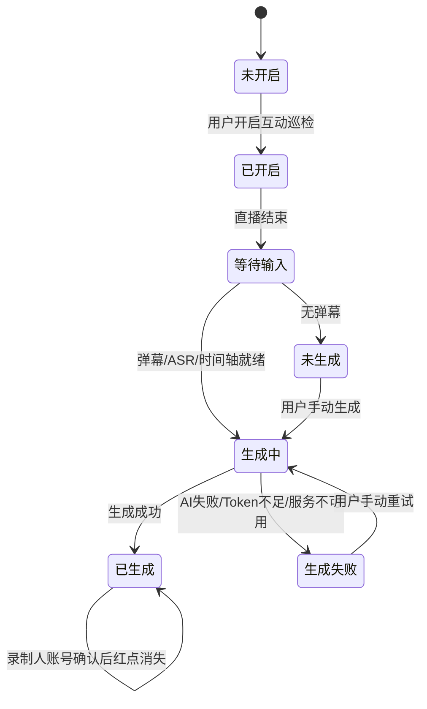
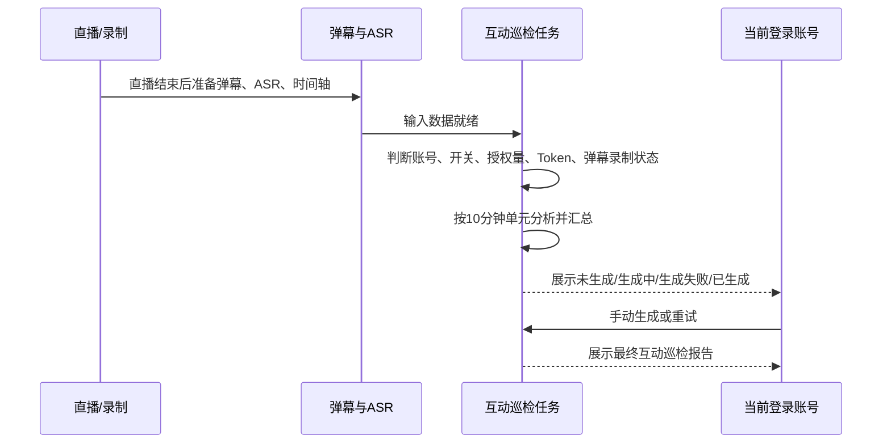

# PRD: 互动有效性巡检

## 元信息

- **REQ-ID**：REQ-2026-0508-互动巡检
- **标题**：互动有效性巡检
- **优先级**：P1
- **目标版本**：2.60.3
- **生效日期**：2026-05-18
- **业务负责人**：PM
- **技术负责人**：Beta
- **受影响项目**：服务端 / 客户端前端 / 管理后台前端
- **关联需求 / shared spec**：`REQ-2026-0508-话术质检`、`REQ-2026-0508-话术还原度`、`requirements/_shared/REQ-2026-0508-话术监控/shared-capability.md`

## 一、Problem Statement

### 1.1 用户问题

用户弹幕回复依赖主播和助手自觉，运营无法量化评估哪些用户疑问没有被及时有效回应，也难以从直播复盘中看出互动质量和响应及时性，潜在转化机会可能流失。

### 1.2 受影响用户 / 场景

- 主要用户：运营主管。
- 次要用户：主播、助手、可查看同租户云空间分享记录的账号、内部运营。
- 不受影响用户：竞品账号相关记录；无互动巡检功能权限的套餐用户；视频分析、文案预审页面。

### 1.3 当前不解决的代价

- 用户疑问和购买意向弹幕是否被有效回复缺少量化闭环。
- 主播和助手只能人工回看弹幕与话术，复盘成本高。
- 运营无法稳定发现互动响应不足造成的转化损失。

### 1.4 证据来源

- 原始草稿片段：`source-traceability.md` ST-IR-001 至 ST-IR-010。
- PM answers：`03-pm-answers-round1.md` Q1 至 Q17。
- Shared capability：`requirements/_shared/REQ-2026-0508-话术监控/shared-capability.md`。
- 领域知识：`glossary.md` 中的自有账号、竞品账号、授权量、Token、互动有效性巡检。

## 二、Goals

### 2.1 用户目标

- G1：运营主管能在复盘中看到互动巡检报告，判断弹幕疑问是否被及时有效回复。
- G2：主播和助手能查看互动问题，了解本场互动响应不足之处。
- G3：用户能在未自动生成或生成失败后手动生成 / 重试互动巡检报告。

### 2.2 业务目标

- G1：将互动有效性巡检纳入 2.60.3 AI 监控套件，并与话术质检、话术还原度共用账号、授权量、Token 和发布隐藏策略。
- G2：通过 10 分钟弹幕单元与对应 ASR 单元分析，形成最终互动巡检报告。

### 2.3 成功指标

| 指标 | 类型 | 目标值 | 最低可接受值 | 衡量方式 | 评估时间 |
|---|---|---|---|---|---|
| 报告生成完成时长 | leading | P95 5 分钟内 | P95 20 分钟内 | 生成任务耗时统计 | 上线验收与灰度期 |
| 用户侧状态可解释性 | leading | 未生成、生成中、已生成、失败、无弹幕、Token 不足均有明确表现 | 不出现无反馈的卡死状态 | QA 场景验收 | 上线前 |
| 交互报告可读性 | leading | 报告展示最终分析结论和必要证据 | 不要求前端独立展示所有中间产物 | QA 场景验收 | 上线前 |

当报告生成 P95 超过 5 分钟但不超过 20 分钟时，由 PM 和技术负责人共同决定是否允许灰度放行；超过 20 分钟不得放行。

## 三、Non-Goals

| 不做事项 | 原因 | 后续版本 / 触发条件 |
|---|---|---|
| 不覆盖 视频分析、文案预审页面 | PM 确认本期只覆盖 AI复盘列表 / 详情和云空间列表/详情、AI切片复盘列表/详情页 | 这些页面需要互动巡检时另起需求 |
| 不固定“需要回复弹幕”的规则清单 | PM 确认由 AI 根据提示词提取需要回复的弹幕 | 如后续要做规则可配置，再评估 |
| 不固定有效回复的细分判定规则 | PM 确认业务逻辑不单独定义，标准交给提示词和大模型 | 如客户要求可解释判定，再补充规则 |
| 不向用户展示中间产物 | PM 确认中间产物只用于内部排查和重新生成 | 如需要强追溯，再评估内部查看能力 |

## 四、Personas & User Stories

### 4.1 Personas

| 角色 | 目标 | 可见内容 | 可执行动作 | 不可执行动作 |
|---|---|---|---|---|
| 运营主管 | 评估弹幕互动质量 | 互动巡检结果、摘要、明细、红点、生成状态 | 开启巡检、查看报告、手动生成 / 重试、确认已读 | 查看内部中间产物 |
| 主播 / 助手 | 了解互动回复不足 | 自己可见记录中的互动报告 | 查看报告 | 配置内部提示词 |
| 内部运营 | 维护互动巡检提示词 | 管理后台内部配置 | 维护提取疑问弹幕、判断互动有效性、合并提示词 | 开放租户侧配置 |
| 竞品账号用户 | 不适用 | 无入口或 `-` | 无 | 开启或生成互动巡检 |

### 4.2 User Stories

- US-001：作为运营主管，我希望查看本场互动巡检报告，以便知道用户弹幕疑问是否被及时有效回复。
- US-002：作为主播或助手，我希望看到互动回复不足的分析，以便改进下一场互动响应。
- US-003：作为运营人员，我希望在生成失败或未生成时手动生成报告，以便补齐本场复盘结果。

### 4.3 场景与边界

| 场景 | 触发条件 | 用户可见输出 | 结束条件 |
|---|---|---|---|
| 自动生成 | 自有账号、开关开启、授权量和 Token 满足，弹幕 / ASR / 时间轴校准就绪 | 生成中，成功后展示互动巡检报告 | 生成成功或失败 |
| 手动生成 | 用户点击生成报告，当前版本有授权量，自有账号，Token 满足 | 生成中，按钮禁用 | 成功覆盖旧报告，失败不覆盖旧成功报告 |
| 无弹幕 | 本场没有录制弹幕 | 未生成 / 可手动重试，展示无弹幕原因 | 有弹幕数据或用户放弃生成 |
| AI 提取失败 | AI 识别需要回复弹幕失败 | 生成失败，可手动重试 | 重试成功或继续失败 |
| 大量弹幕 | 10 分钟单元内弹幕很多 | 仍按提示词和 AI 自主分析，不做前端 Top N 特殊逻辑 | 最终报告生成完成 |
| 关闭开关 | 直播中关闭互动巡检 | 以整场 AI 复盘基础分析完成时开关状态为准 | 自动生成判断完成 |

## 五、Scope & Requirements

### 5.1 P0 Must-Have

| ID | Requirement | Acceptance Criteria | 来源 / 追溯 |
|---|---|---|---|
| R-P0-001 | 添加 / 编辑直播间支持互动巡检开关 | 仅自有账号可见；竞品账号隐藏；默认关闭；开启时校验套餐功能权限、授权量和 Token；第一个自有直播间也默认关闭 | ST-IR-003, Q17 |
| R-P0-002 | 自动生成互动巡检报告 | 直播结束组合信号成立后，弹幕数据、主播 / 助手 ASR 逐字稿、直播时间轴校准均就绪，且自动生成前置条件满足时创建任务 | ST-IR-004, Q6, Q7, Q14 |
| R-P0-003 | 10 分钟单元分析规则 | 互动巡检不固定生成 3 份报告；按弹幕 10 分钟单元切分；对应 ASR 单元开始时间等于弹幕单元开始时间，结束时间为弹幕单元结束时间 + 1 分钟；每个单元提交给 AI 分析，再将多个单元分析结果合并为 1 份最终互动巡检报告 | ST-IR-004, Q3, Q10, 06-round1 |
| R-P0-004 | AI 提取与判定规则 | 需要回复的弹幕由 AI 根据提示词提取；有效回复由提示词和大模型判断，不在 PRD 固定关键词或细分权重 | Q1, Q4, Q8 |
| R-P0-005 | 手动生成 / 重试互动巡检报告 | 手动生成需要判断当前版本是否有授权量，但不判断授权量是否有剩余；仍需自有账号和 Token；生成中按钮禁用防重复 | ST-IR-006, Q14, Q15 |
| R-P0-006 | 无弹幕处理 | 自动生成时无弹幕标记未生成，可手动重试；手动生成时展示无弹幕原因 | ST-IR-006, Q5, Q15 |
| R-P0-007 | 生成失败处理 | AI 识别失败、服务不可用、Token 不足、不可生成时，用户看到明确失败原因和重试入口 | Q9, Q15 |
| R-P0-008 | 互动巡检报告输出 | 最终报告至少包含互动有效性百分比、报告摘要、关键明细、生成状态和失败原因；摘要和明细口径必须与互动有效性百分比一致 | ST-IR-002, Q1, Q3, Q4 |
| R-P0-009 | 报告覆盖页面 | 仅覆盖 AI复盘列表 / 详情和云空间 AI复盘详情，AI切片列表/详情页；不覆盖 视频分析、文案预审 | ST-IR-007, ST-IR-008, Q12 |
| R-P0-010 | 报告确认权限 | 与话术质检一致，只有录制人账号可确认；无确认权限账号只读展示，不展示确认按钮 | Q2, Q15 |
| R-P0-011 | 重新生成数据处理 | 条件恢复后旧成功报告保留；重新生成成功覆盖旧报告；重新生成失败不覆盖已有成功报告 | Q14 |
| R-P0-012 | 发布灰度与隐藏 | 互动巡检可单独灰度；未灰度用户隐藏开关、列表列、红点和报告入口 | Q16 |

### 5.2 P1 Nice-to-Have

| ID | Requirement | Acceptance Criteria | 来源 / 追溯 |
|---|---|---|---|
| R-P1-001 | 内部运营维护互动巡检提示词 | 复用现有管理后台配置体系，新增互动巡检类型；默认仅内部运营维护 | ST-IR-009, Q13 |
| R-P1-002 | 中间产物内部留存 | 10 分钟单元提取结果、有效回复判断结果、合并前分片结果只用于内部排查和重新生成，不对用户展示 | Q14 |

### 5.3 P2 Future Considerations

| ID | Requirement | Acceptance Criteria | 来源 / 追溯 |
|---|---|---|
| R-P2-001 | 视频分析 / 文案预审覆盖互动巡检 | 当这些页面需要弹幕互动语境时，另起需求定义入口和数据适配 | Q12 |
| R-P2-002 | 固定有效回复规则 | 当需要可解释判定或客户可配置规则时，再定义关键词、分类和验收样例 | Q1, Q4 |

## 六、UX / Interaction Rules

- Figma / 原型链接：暂无。
- 链接有效期保障：不适用。
- 原型覆盖范围：以本 PRD 文字规则为准。
- 原型未覆盖但 PRD 必须明确的规则：入口展示、按钮状态、无弹幕、生成失败、手动生成、红点和确认权限。

### 6.1 页面与入口

| 页面 | 入口/控件 | 展示条件 | 隐藏/禁用条件 | 点击后去向 |
|---|---|---|---|---|
| 添加 / 编辑直播间 | 互动巡检开关 | 自有账号，套餐支持 | 竞品账号隐藏；权限、授权量或 Token 不足时开启失败 | 留在当前页 |
| AI复盘列表 | 开启监控 / 生成报告 / 互动巡检结果 / 红点 | 自有账号记录，且用户在灰度范围内 | 未灰度、竞品账号或不覆盖页面隐藏 | 打开报告弹窗或触发生成 |
| AI复盘详情 | 互动巡检报告入口 | 自有账号记录 | 未灰度或竞品账号隐藏 | 留在详情页 |
| 云空间 AI复盘详情 | 互动巡检报告入口 | 当前账号可查看分享记录 | 无确认权限时只读 | 留在详情页 |
| AI切片列表 | 互动巡检入口 | 自有账号记录 | 无确认权限时只读 | 打开报告弹窗或触发生成 |
| AI切片详情 | 互动巡检入口 | 自有账号记录 | 无确认权限时只读 | 留在详情页 |
| 视频分析 / 文案预审 | 无互动巡检入口 | 不适用 | 本期不展示 | 不适用 |

### 6.2 关键交互状态

| 场景 | 用户动作 | 处理中表现 | 成功反馈 | 失败反馈 | 页面停留/关闭/跳转 |
|---|---|---|---|---|---|
| 开启巡检 | 打开互动巡检开关 | 按开关保存流程反馈 | 开关保持开启 | 权限、授权量或 Token 不足时提示原因 | 留在当前页 |
| 手动生成 | 点击生成报告 | 按钮禁用，防重复点击 | 生成成功后停留当前页；用户主动刷新后展示摘要、明细和红点 | 停留当前页；用户主动刷新后展示失败原因和重试入口 | 留在当前页 |
| 查看报告 | 点击互动巡检入口 | 打开弹窗 / 区域 loading | 展示最终报告 | 展示失败、无弹幕、Token 不足或不可生成原因 | 不改变原页面上下文 |
| 确认已读 | 录制人账号打开报告弹窗后点击确认 | 按钮 loading | 红点消失 | 红点不消失，按钮恢复可点 | 不要求滚动到底部，不自动关闭弹窗 |

### 6.3 用户可见状态与文案语义

| 状态 | 用户看到什么 | 可执行动作 | 备注 |
|---|---|---|---|
| 未开启 | 不展示互动巡检报告入口和红点；展示开启监控、生成报告按钮 | 开启监控或手动生成 | 手动生成仍需满足权限和 Token |
| 已开启未生成 | 生成中 / 待生成 / 可手动生成 | 手动生成 | 根据输入是否就绪展示 |
| 无弹幕 | 明确提示本场无弹幕或未录制弹幕 | 条件恢复后重试 | 自动路径为未生成，可手动重试 |
| 生成中 | 生成中 | 不可重复点击生成 | 用户主动刷新后查看最新结果 |
| 已生成 | 摘要、明细、红点 | 查看报告、录制人确认 | 无确认权限账号只读 |
| 生成失败 | 失败原因和重试入口 | 重试 | AI 失败、Token 不足、不可生成都要明确原因 |

## 七、Data & State Flow

### 7.1 端到端数据状态流转

| 阶段 | 触发条件 | 业务状态 | 用户可见输出 | 结束条件 |
|---|---|---|---|---|
| 直播结束 | 组合信号成立；组合信号包括平台通知下播 / 推流终止、用户主动停止录制、系统因无法获取直播流自动停止录制 | 等待输入 | 无或原有复盘状态 | 弹幕、ASR、时间轴校准就绪 |
| 输入就绪判断 | 弹幕数据、ASR、时间轴校准准备完成 | 未触发 / 条件不满足 / 等待输入 | 未生成或生成中 | 创建任务或停留未生成 |
| 分片分析 | 任务创建 | 生成中 / 部分生成 / 生成失败 | 生成中 | 10 分钟单元分析完成或失败 |
| 汇总报告 | 分片结果可用 | 已生成 / 生成失败 | 最终报告或失败原因 | 保存最终报告或失败 |
| 失败恢复 | 无弹幕、Token 不足、AI 失败、服务不可用 | 未生成 / 生成失败 / 不可生成 | 明确原因和重试入口 | 用户手动重试 |

### 7.2 状态与标记归属

- **任务状态归属**：场次级。
- **红点 / 已读 / 确认归属**：当前登录账号级；只有录制人账号可确认。
- **配置归属**：开关为直播间 + 功能；授权量为租户 + 功能 + 直播间；Token 为租户资源。
- **账号类型切换规则**：沿用 shared capability，已开启任一 AI 监控能力时，不能直接从自有账号切换为同行业 / 竞品账号。

### 7.3 产物生命周期

- 中间产物：10 分钟单元提取结果、有效回复判断结果、合并前分片结果；只用于系统内部排查和重新生成，不直接对用户展示。
- 最终产物：一份互动巡检最终报告，用户可见。
- 生成策略：互动巡检不固定生成 3 份报告；最终报告来自多个 10 分钟单元分析结果的合并。
- 空输入 / 样本不足产物：无弹幕时停留未生成或失败原因，不生成误导性空报告。
- 重新生成 / 手动重试后的旧数据处理：条件恢复后旧成功报告保留；重新生成成功覆盖旧报告；重新生成失败不覆盖已有成功报告。

## 八、AI-Specific Constraints

### 8.1 输入数据语义

- **数据来源**：弹幕数据、主播 / 助手 ASR 逐字稿、直播时间轴校准结果。
- **粒度**：弹幕按 10 分钟单元切分；对应 ASR 单元结束时间延长 1 分钟。
- **报告生成策略**：不固定生成 3 份报告；按 10 分钟单元逐段分析，再合并多单元结果形成 1 份最终互动巡检报告。
- **数据质量约束**：缺弹幕、缺 ASR 或时间轴未校准时不进入有效分析。

### 8.2 用户视角输出

- **输出形态**：最终互动巡检报告，至少包含互动有效性百分比、AI 判断后的摘要和关键明细。
- **承载位置**：AI复盘列表 / 详情、云空间 AI复盘详情。
- **可解释性**：本期由提示词和大模型判断，不固定规则清单。
- **最小可用结构**：至少有互动有效性百分比、报告摘要、关键明细、生成状态和失败原因。

### 8.3 业务达标标准

- **准确率 / 召回率 / 可接受误差**：本期由提示词和人工验收样例判断，不设固定数值。
- **失败可接受率**：上线验收不得出现无反馈卡死；失败必须可重试。
- **延迟可接受范围**：P95 5 分钟目标，P95 20 分钟最低可接受；P95 超过 5 分钟但不超过 20 分钟时由 PM 和技术负责人共同决定是否灰度放行，超过 20 分钟不得放行。

### 8.4 Token / 算力消耗边界

- 成功：生成成功后消耗 Token。
- AI 失败：展示生成失败，支持手动重试；不消耗 Token，若任务开始时预扣则失败后返还。
- 超时：用户侧展示生成失败，可重试；不消耗 Token，若任务开始时预扣则超时后返还。
- 空输入 / 低质量输入：无弹幕、输入缺失或时间轴未校准时不生成有效报告，不消耗 Token。
- 手动重试 / 重新生成：按新生成任务处理；成功后消耗 Token，失败不消耗，重新生成成功覆盖旧报告，失败不覆盖旧成功报告。

## 九、Cross-Project Impact & Dependencies

### 9.1 项目影响

| 项目 | 新增能力 | 修改能力 | 不动能力 |
|---|---|---|---|
| 服务端 | 互动巡检任务、10 分钟单元分析、报告汇总、状态与资源判断 | AI 监控公共资源校验、报告生命周期 | 具体项目实现方案由 SDD 决定 |
| 客户端前端 | 添加 / 编辑直播间开关、AI复盘列表 / 详情和云空间入口、AI切片复盘列表/详情、报告展示、红点和手动生成 | AI 监控公共状态、生成按钮、失败提示 | 视频分析、文案预审不展示互动巡检 |
| 客户端 | 承载客户端前端运行与录制上下文 | 不新增独立业务入口 | 本地采集播放能力不在本 PRD 展开 |
| 管理后台前端 | 互动巡检提示词类型维护 | 现有智能体配置体系新增互动巡检类型 | 租户侧配置入口不做 |

### 9.2 Shared Capability 依赖

- 共享页面 / 入口：添加 / 编辑直播间、AI复盘列表 / 详情、云空间详情。
- 共享权限 / 资源校验：自有账号、套餐功能权限、授权量、Token。
- 共享状态 / 异常：未开启、未生成、生成中、已生成、生成失败、红点、手动生成。
- 与 sibling REQ 不同的地方：互动巡检只覆盖 AI复盘和云空间详情；默认关闭；依赖弹幕、ASR、时间轴校准；中间产物不对用户展示。
- 共享发布结论：PM 已确认互动巡检可单独灰度；未灰度用户隐藏开关、列表列、红点和报告入口。本期不覆盖视频分析、文案预审。

### 9.3 发布顺序 / Phasing

| 阶段 | 范围 | 依赖 | 是否可独立上线 | 风险 |
|---|---|---|---|---|
| Phase 1 | 互动巡检服务端生成能力和客户端展示灰度 | 内部提示词配置、客户端入口隐藏策略 | 是，可单能力灰度 | 未灰度用户必须完全隐藏入口和结果 |
| Phase 2 | 与话术质检、话术还原度共同开放 | 三个子能力均就绪 | 是 | 公共入口和授权余量需保持一致 |

## 十、Open Questions

| ID | 问题 | 责任方 | 阻塞级别 | 决策时点 | 当前处理 |
|---|---|---|---|---|---|
| OQ-IR-001 | 后续是否覆盖 视频分析、文案预审 | PM | non-blocking | 后续版本 | 本期不做 |
| OQ-IR-002 | 后续是否固定有效回复规则或开放租户配置 | PM / 技术负责人 | non-blocking | 后续版本 | 本期由提示词和大模型判断 |

## 十一、Acceptance

### 11.1 验收清单

- [ ] 自有账号添加 / 编辑直播间时可看到互动巡检开关；竞品账号无入口。
- [ ] 第一个自有直播间默认关闭，用户需要手动开启。
- [ ] 自动生成前必须满足弹幕、ASR、时间轴校准、自有账号、开关、授权量、Token。
- [ ] 弹幕按 10 分钟单元切分，对应 ASR 单元结束时间延长 1 分钟。
- [ ] 互动巡检不固定生成 3 份报告；多单元分析结果合并为 1 份最终互动巡检报告。
- [ ] 需要回复弹幕和有效回复由提示词和大模型判断，不由前端硬编码规则。
- [ ] 无弹幕时自动路径停留未生成 / 可重试，手动路径展示明确原因。
- [ ] 手动生成只判断当前版本是否有授权量，不判断授权量是否有剩余。
- [ ] AI复盘列表 / 详情和云空间 AI复盘详情 AI切片复盘列表 / 详情 展示互动巡检入口和结果；视频分析、文案预审不展示。
- [ ] 最终报告展示互动有效性百分比，且摘要、关键明细与该百分比口径一致。
- [ ] 录制人账号可确认已读；无确认权限账号只读且不展示确认按钮。
- [ ] 重新生成成功覆盖旧报告，失败不覆盖已有成功报告。
- [ ] P95 5 分钟目标、P95 20 分钟最低可接受口径可被观测。

### 11.2 业务验收场景

| 场景 | 前置条件 | 用户操作 | 预期结果 |
|---|---|---|---|
| 自动生成成功 | 自有账号，互动巡检已开启，直播结束组合信号成立，弹幕 / ASR / 时间轴校准就绪，授权量和 Token 满足 | 等待系统自动生成 | AI复盘列表 / 详情和云空间详情展示互动有效性百分比、摘要、关键明细和红点 |
| 手动生成成功 | 自有账号，当前版本有授权量，Token 满足，弹幕已录制 | 点击生成报告 | 按钮生成中禁用；成功后停留当前页，主动刷新后展示最终报告 |
| 无弹幕 | 本场没有录制弹幕 | 自动生成或手动生成 | 自动路径停留未生成 / 可重试；手动路径展示无弹幕原因 |
| Token 不足 | 自有账号但 Token 低于门槛 | 自动或手动触发生成 | 展示算力不足原因，不消耗 Token，可补足后重试 |
| AI 失败重试 | AI 识别需要回复弹幕失败 | 点击重试 | 失败时展示失败原因；重试成功后展示最终报告 |
| 重新生成失败不覆盖旧成功报告 | 已有旧成功报告，本次重新生成失败 | 点击重新生成 | 旧成功报告仍可查看，新失败原因可见 |
| 无确认权限只读 | 当前账号可查看但不是录制人账号 | 打开报告 | 只读展示报告，不显示确认按钮 |
| 录制人确认红点消失 | 录制人账号打开已生成报告 | 点击确认已读 | 当前账号红点消失；确认失败时红点保留 |
| 未灰度隐藏入口 | 用户不在互动巡检灰度范围内 | 查看添加 / 编辑直播间、列表、详情 | 不展示互动巡检开关、列、红点和报告入口 |

## 十二、Source Traceability

- 原稿追溯矩阵：`source-traceability.md`。
- 未覆盖但已解释项：视频分析、文案预审本期不覆盖互动巡检，进入 Non-Goals。
- 被 PM answers 明确改掉的项：第一个自有直播间默认关闭；大量弹幕不做 Top N 特殊展示；确认已读不要求滚动到底部。

## 十三、实施记录

> 由开发在实施过程中追加。每条反馈必须包含维度标签，便于后续复盘。

（初始为空）

## 十四、变更日志

- 见同目录 `changelog.md`

---

<!-- generated-by: refiner v3, from REQ-2026-0508-互动巡检, at 2026-05-18 -->
