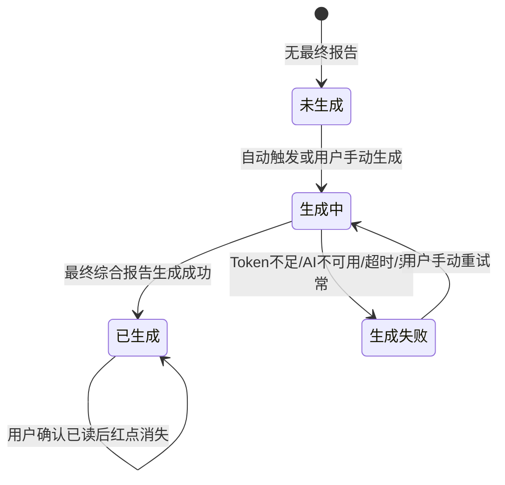
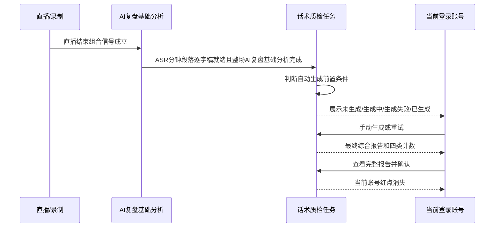

# PRD: 话术质检

## 元信息

- **REQ-ID**：REQ-2026-0508-话术质检
- **标题**：话术质检
- **优先级**：P1
- **目标版本**：2.60.3
- **生效日期**：2026-05-15
- **业务负责人**：PM
- **技术负责人**：Beta
- **受影响项目**：服务端 / 客户端前端 / 管理后台前端
- **关联需求 / shared spec**：`REQ-2026-0508-话术还原度`、`REQ-2026-0508-互动巡检`、`requirements/_shared/REQ-2026-0508-话术监控/shared-capability.md`

## 一、Problem Statement

### 1.1 用户问题

主播直播中的负面话术目前主要依赖人工巡查，合规性、专业性和转化影响无法稳定量化。运营或合规人员往往在问题发生后较晚发现，无法及时干预崩盘话术、摸鱼话术、有损品牌话术和增加售后成本话术。

### 1.2 受影响用户 / 场景

- 主要用户：运营主管、合规专员。
- 次要用户：主播、可查看同租户云空间分享记录的账号。
- 不受影响用户：竞品账号相关记录；无话术质检功能权限的套餐用户。

### 1.3 当前不解决的代价

- 话术标准和合规要求难以落地，负面话术发现滞后。
- 运营只能逐场人工查看，复盘成本高。
- 主播无法快速看到问题话术和改进方向。

### 1.4 证据来源

- 原始草稿片段：`source-traceability.md` ST-QC-001 至 ST-QC-010。
- PM answers：round1 至 round4。
- 领域知识：`glossary.md` 中的自有账号、竞品账号、授权量、Token、话术质检。
- 现有项目说明：客户端前端复盘域、服务端 AI / 文案 / 订单资产域、管理后台词库与 AI 配置域。

## 二、Goals

### 2.1 用户目标

- G1：运营或合规人员能在直播结束后看到本场四类负面话术的计数和报告。
- G2：用户能在未自动生成或生成失败后手动生成 / 重试话术质检报告。
- G3：当前登录账号能独立确认已读，确认后该账号的红点消失。

### 2.2 业务目标

- G1：将话术质检纳入 2.60.3 AI 监控套件，并与话术还原度、互动巡检共用账号、授权量、Token 和发布策略。
- G2：服务端生成能力和客户端前端展示同版本发布，避免半成品能力对用户可见。

### 2.3 成功指标

| 指标 | 类型 | 目标值 | 最低可接受值 | 衡量方式 | 评估时间 |
|---|---|---|---|---|---|
| 自动 / 手动生成完成时长 | leading | P95 5 分钟内 | P95 20 分钟内 | 生成任务耗时统计 | 上线验收与灰度期 |
| 用户侧状态可解释性 | leading | 生成失败、生成中、已生成、未生成均有明确表现 | 不出现无反馈的卡死状态 | QA 场景验收 | 上线前 |
| 报告确认闭环 | leading | 当前账号确认后红点消失 | 确认失败不误消红点 | QA 场景验收 | 上线前 |

## 三、Non-Goals

| 不做事项 | 原因 | 后续版本 / 触发条件 |
|---|---|---|
| 不向租户开放话术质检提示词配置页面 | PM 已确认仅内部运营可配置，租户不可见不可改 | 需要租户自定义智能体时再评估 |
| 不展示三份中间报告给普通用户 | PM 已确认只以最终综合报告为准 | 如出现大量争议或需要强追溯时再评估内部查看能力 |
| 不改变竞品账号能力边界 | AI 监控类功能仅自有账号开放 | 无 |

## 四、Personas & User Stories

### 4.1 Personas

| 角色 | 目标 | 可见内容 | 可执行动作 | 不可执行动作 |
|---|---|---|---|---|
| 运营主管 / 合规专员 | 发现本场负面话术问题 | 四类计数、报告正文、生成状态、红点 | 查看报告、手动生成 / 重试、确认已读 | 查看中间三份报告 |
| 主播 | 了解自身话术问题 | 自己可见记录中的报告 | 查看报告、确认已读 | 配置内部提示词 |
| 内部运营 | 维护话术质检默认配置 | 现有提示词 / 智能体配置能力 | 维护内部配置 | 给租户开放独立配置页 |
| 竞品账号用户 | 不适用 | 无入口或 `-` | 无 | 开启或生成话术质检 |

### 4.2 User Stories

- US-001：作为合规专员，我希望自动收到负面话术报告，以便及时发现并干预不当话术。
- US-002：作为运营主管，我希望在复盘列表看到四类负面话术计数和红点，以便快速筛选需要查看的场次。
- US-003：作为当前登录账号，我希望查看完整报告后确认已读，以便我的红点状态被清除。

### 4.3 场景与边界

| 场景 | 触发条件 | 用户可见输出 | 结束条件 |
|---|---|---|---|
| 自动生成 | 自有账号、开关开启、授权量满足、Token 不低于 10 万，整场 AI 复盘基础分析完成 | 生成中，成功后展示四类计数和报告 | 生成成功或生成失败 |
| 手动生成 | 用户点击生成；套餐有功能权限、自有账号、Token 不低于 10 万 | 生成中，按钮不可重复点击 | 用户刷新后看到最新状态 |
| 竞品账号 | 记录归属竞品账号 | 无入口或 `-` | 不进入生成流程 |
| 自有账号改为同行业 / 竞品账号 | 用户编辑直播间账号类型，且该直播间已开启话术质检 | 保存阻断，提示需先关闭话术质检功能 | 用户关闭话术质检后，才允许提交账号类型修改 |
| 极短直播 / 无有效语音 | 输入数据不足但仍触发生成 | 常规报告，列表四类计数正常展示 | 报告生成完成 |

## 五、Scope & Requirements

### 5.1 P0 Must-Have

| ID | Requirement | Acceptance Criteria | 来源 / 追溯 |
|---|---|---|---|
| R-P0-001 | 添加 / 编辑直播间支持话术质检开关 | 仅自有账号可见；竞品账号隐藏；开关默认关闭；页面展示话术质检授权余量和总量；开启时校验套餐功能权限、授权量和 Token；保存成功后才占用授权量，保存失败不改变占用 | ST-QC-006, round4 Q3 |
| R-P0-001A | 编辑直播间账号类型时保护已开启的话术质检 | 用户将直播间由自有账号切换为同行业 / 竞品账号时，如果该直播间已开启话术质检，保存必须被阻断，并提示用户先关闭话术质检功能；用户关闭话术质检并释放授权占用后，才允许提交账号类型修改 | 06-prd-review-round1 |
| R-P0-002 | 自动生成话术质检报告 | 整场 AI 复盘基础分析完成后，满足自有账号、开关开启、授权量满足、Token 不低于 10 万才创建任务 | ST-QC-004, round2 Q1, round2 Q3, round4 Q2 |
| R-P0-003 | 手动生成 / 重试话术质检报告 | 只校验套餐功能权限、自有账号和 Token，不校验授权数量，不要求质检开关开启；点击后显示生成中，按钮不可重复点击 | ST-QC-005, round4 Q1, round3 Q9 |
| R-P0-004 | 生成最终综合报告 | 每次自动生成或手动生成时，固定使用负面话术质检提示词生成 3 份质检报告，再由负面话术质检校验提示词 / AI 校验合并成 1 份最终话术质检报告；用户只看到最终综合报告和最终计数 | ST-QC-004, round1 Q4, round2 Q4, 06-round2 |
| R-P0-005 | 展示四类负面话术计数 | 列表缩略列展示崩盘话术、摸鱼话术、有损品牌、增加售后四类计数；点击计数 / 质检入口打开报告弹窗 | ST-QC-007, round3 Q3 |
| R-P0-006 | 报告弹窗 / 详情展示与确认 | 展示直播间、主播、时间、报告正文、三类已知晓记录项；未滚动到底部时确认按钮不可用；确认成功后弹窗保持打开，按钮变为已确认 | ST-QC-007, round1 Q3, round3 Q4 |
| R-P0-007 | 红点 / 已读归属 | 当前登录账号级记录红点和确认；当前账号能看到报告但不是录制人时只可查看，不可确认 | round2 Q2, round3 Q5 |
| R-P0-008 | 覆盖本期页面范围 | AI复盘列表 / 详情、云空间 AI复盘详情、AI切片复盘列表 / 详情、视频分析列表 / 详情、文案预审列表 / 详情均覆盖话术质检入口和结果 | ST-QC-008, 用户后续修正 |
| R-P0-009 | Token 与授权量规则 | Token 最低值 10 万；生成成功才消耗 Token；任务开始时可预扣，失败返还；授权量按租户 + 功能 + 直播间计数 | round2 Q10-Q11, round4 Q2-Q3 |
| R-P0-010 | 失败与恢复 | AI 服务不可用、超时、异常返回时用户侧归入生成失败；用户可手动重试；新成功结果覆盖旧最终结果，失败不覆盖已有成功结果 | round1 Q10-Q11, round2 Q7, round3 Q1 |

### 5.2 P1 Nice-to-Have

| ID | Requirement | Acceptance Criteria | 来源 / 追溯 |
|---|---|---|---|
| R-P1-001 | 内部运营维护默认配置 | 不新增租户可见专门页面；仅内部运营通过现有提示词 / 智能体管理能力维护默认配置 | ST-QC-009, round1 Q14, round2 Q14 |
| R-P1-002 | 状态后台完整追踪 | 后台保留未触发、条件不满足、等待输入、生成中、综合中、已生成、AI 服务暂不可用、生成失败、可手动生成等完整状态 | round2 Q5-Q6 |

### 5.3 P2 Future Considerations

| ID | Requirement | Acceptance Criteria | 来源 / 追溯 |
|---|---|---|---|
| R-P2-001 | 租户自定义话术质检规则 | 租户可见且可配置独立质检智能体时，另起需求评估权限、版本和审核流程 | round2 Q14 |

## 六、UX / Interaction Rules

- Figma / 原型链接：原稿未提供有效蓝湖地址。
- 原型覆盖范围：以本 PRD 文字规则为准。

### 6.1 页面与入口

| 页面 | 入口/控件 | 展示条件 | 隐藏/禁用条件 | 点击后去向 |
|---|---|---|---|---|
| 添加 / 编辑直播间 | 话术质检开关 | 自有账号，套餐支持 | 竞品账号隐藏；权限、授权量或 Token 不足时开启失败 | 留在当前页并反馈结果 |
| 编辑直播间 | 账号类型切换保存 | 直播间当前为自有账号 | 已开启话术质检时，不允许直接保存为同行业 / 竞品账号 | 留在编辑页，提示先关闭话术质检 |
| AI复盘列表 | 质检缩略列、四类计数、红点、生成入口 | 自有账号记录 | 竞品账号展示 `-` 或隐藏 | 点击计数 / 入口打开报告弹窗 |
| AI复盘详情 | 话术质检区域 | 自有账号记录 | 竞品账号隐藏 | 留在详情页 |
| 云空间 AI复盘详情 | 话术质检区域 | 当前账号可查看分享记录 | 无权确认时只读 | 留在详情页 |
| AI切片复盘 / 视频分析 / 文案预审列表与详情 | 话术质检入口和结果 | 自有账号记录 | 竞品账号隐藏 | 列表入口打开弹窗，详情入口留在详情页 |

### 6.2 关键交互状态

| 场景 | 用户动作 | 处理中表现 | 成功反馈 | 失败反馈 | 页面停留/关闭/跳转 |
|---|---|---|---|---|---|
| 手动生成 | 点击生成本场话术质检报告 | 显示生成中，按钮不可点击 | 用户刷新页面后看到最新状态和计数 | 统一展示生成失败 | 留在当前页 |
| 打开报告弹窗 | 点击列表质检计数 / 入口 | 立即 loading；超过 5 秒提示加载失败 | 展示最终报告 | 保留弹窗并提示失败 | 不改变列表行原有跳转 |
| 确认已读 | 滚动到底部后点击确认 | 按钮 loading，禁止重复点击 | 红点消失，按钮变为已确认，弹窗保持打开 | 红点不消失，按钮恢复可点 | 不自动关闭弹窗 |
| 修改账号类型 | 将已开启话术质检的自有账号改为同行业 / 竞品账号并保存 | 不进入保存中 | 无 | 提示先关闭话术质检功能后再提交 | 停留在编辑页 |

### 6.3 用户可见状态与文案语义

| 状态 | 用户看到什么 | 可执行动作 | 备注 |
|---|---|---|---|
| 未生成 | 未生成 / 生成入口 | 手动生成 | 满足手动生成条件时可点 |
| 生成中 | 生成中 | 不可重复点击生成 | 用户需刷新页面查看最新状态 |
| 已生成 | 四类计数、报告入口、可能有红点 | 查看报告、确认已读 | 以最终综合报告为准 |
| 生成失败 | 生成失败 | 条件恢复后可重试 | Token 不足、AI 服务暂不可用统一归入生成失败 |
| 套餐无功能权限 | 提示升级 | 不允许开启自动监控或生成报告 | 用户侧不创建生成任务 |
| 授权量不足 | 提示联系产品顾问购买增量包 | 不允许开启自动监控或保存相关配置 | 手动生成不校验授权数量 |
| Token 不足 | `您的算力数量不足，请联系产品顾问购买。` | 补足 Token 后可手动生成 / 重试 | 用户侧可归入生成失败，但必须展示具体原因 |
| 账号类型切换冲突 | 提示先关闭话术质检功能后再提交修改 | 关闭话术质检后重新保存账号类型 | 适用于已开启话术质检的自有账号改为同行业 / 竞品账号 |

## 七、Data & State Flow

### 7.1 端到端数据状态流转

| 阶段 | 触发条件 | 业务状态 | 用户可见输出 | 结束条件 |
|---|---|---|---|---|
| 直播结束 | 组合信号成立：平台通知主播下播或系统检测到推流终止；用户主动停止录制；外部环境变化导致系统获取不到直播流并自动停止录制 | 等待基础分析 | 无或原有复盘状态 | ASR 和基础分析就绪 |
| 自动前置判断 | 整场 AI 复盘基础分析完成 | 未触发 / 条件不满足 / 可生成 | 未生成或生成中 | 创建任务或停留未生成 |
| AI 生成 | 任务创建 | 生成中 / 综合中 | 生成中 | 成功或失败 |
| 报告展示 | 最终综合报告生成成功 | 已生成 | 四类计数、报告、红点 | 当前账号确认或保持未读 |
| 失败恢复 | Token 不足、AI 不可用、超时、异常 | 生成失败 | 生成失败，可手动重试 | 重试成功或继续失败 |

### 7.2 状态与标记归属

- **任务状态归属**：场次级。
- **红点 / 已读 / 确认归属**：当前登录账号级；只影响当前账号。
- **配置归属**：开关为直播间 + 功能；授权量为租户 + 功能 + 直播间；Token 为租户资源。
- **账号类型切换规则**：直播间已开启话术质检时，不能直接从自有账号保存为同行业 / 竞品账号；必须先关闭话术质检，释放该功能授权占用后，再提交账号类型修改。

### 7.3 产物生命周期

- 中间产物：固定生成的 3 份质检报告仅内部追溯，不对用户展示。
- 最终产物：一份最终综合报告，用户可见，列表计数以它为准。
- 空输入 / 样本不足产物：仍生成常规报告，列表四类计数正常展示，不额外提示。
- 重新生成 / 手动重试后的旧数据处理：新成功结果覆盖旧最终结果；失败不覆盖已有成功结果；新成功后红点重新按当前账号未读处理。

## 八、AI-Specific Constraints

### 8.1 输入数据语义

- **数据来源**：ASR 逐字稿。
- **粒度**：带分钟段落结构，按时间顺序组织。
- **数据质量约束**：必须有分钟段落和时间顺序；允许个别分钟缺失并在报告中标注。

### 8.2 用户视角输出

- **输出形态**：四类负面话术计数 + 最终综合报告正文。
- **报告生成策略**：固定生成 3 份质检报告，再用校验 / 合并模型形成 1 份最终综合报告；三份中间报告不作为用户侧输出。
- **承载位置**：复盘列表缩略列、详情页、报告弹窗。
- **可解释性**：只展示最终综合报告；不展示三份中间报告。
- **最小可用结构**：极短直播或无有效语音时仍生成常规报告。

### 8.3 业务达标标准

- **准确率 / 召回率 / 可接受误差**：本期不在 PRD 中写固定数值，依据内部提示词效果验收。
- **失败可接受率**：不得出现无状态反馈的静默失败。
- **延迟可接受范围**：目标 P95 5 分钟内，最低可接受 P95 20 分钟内。

### 8.4 Token / 算力消耗边界

- 成功：最终生成成功才消耗 Token，按实际消耗扣除。
- 失败：失败返还预扣 Token。
- 超时：视为生成失败，Token 按失败口径处理。
- 空输入 / 低质量输入：仍生成常规报告，成功后按实际消耗扣除。
- 手动重试 / 重新生成：按一次新的生成任务处理。

## 九、Cross-Project Impact & Dependencies

### 9.1 项目影响

| 项目 | 新增能力 | 修改能力 | 不动能力 |
|---|---|---|---|
| 服务端 | 话术质检任务、状态流转、Token 与授权量校验、最终综合报告能力 | 复盘分析完成后的自动触发链路、用户资产消耗口径 | 不在 PRD 写技术契约 |
| 客户端前端 | 直播间开关、列表缩略列、报告弹窗 / 详情区域、红点确认交互 | AI复盘、云空间、AI切片复盘、视频分析、文案预审的相关展示 | 不改变现有整行点击逻辑 |
| 管理后台前端 | 不新增租户可见专门页面 | 复用现有内部提示词 / 智能体管理能力 | 租户不可见不可改 |
| 客户端 | 无新增本地采集能力要求 | 依赖既有录制结束信号 | 本地录制能力本身不在本需求内修改 |

### 9.2 Shared Capability 依赖

- 共享页面 / 入口：添加 / 编辑直播间、复盘列表、复盘详情、云空间详情。
- 共享权限 / 资源校验：自有账号、套餐功能权限、授权量、Token。
- 共享状态 / 异常：生成中、已生成、生成失败、手动重试、红点确认。
- 与 sibling REQ 不同的地方：话术质检只使用 ASR 逐字稿和负面话术提示词，不需要标准直播稿配置，也不依赖弹幕录制。

### 9.3 发布顺序 / Phasing

| 阶段 | 范围 | 依赖 | 是否可独立上线 | 风险 |
|---|---|---|---|---|
| P0 | 服务端生成能力 + 客户端前端展示 | shared capability 权限、授权量、Token 规则 | 否，必须同版本对用户开放 | 任一端未就绪时需隐藏入口 |
| P1 | 内部运营配置默认提示词 | 现有提示词 / 智能体管理能力 | 可随 P0 或随后补齐 | 配置缺失会影响报告质量 |

## 十、Open Questions

| ID | 问题 | 当前处理 | 阻塞状态 | 后续责任方 / 时点 |
|---|---|---|---|---|
| SOQ-001 | 三个 AI 监控能力是否允许分批发布或灰度 | 对本 REQ 采用保守口径：服务端与客户端前端同版本发布，任一端未就绪时隐藏入口 | 不阻塞本 PRD | PM / 技术负责人，灰度方案确定前 |
| SOQ-002 | AI切片复盘、视频分析、文案预审是否属于本期范围 | 对话术质检采用用户后续修正：本期覆盖这些页面 | 不阻塞本 PRD | 已确认 |
| SOQ-003 | 报告已读确认、小红点、勾选项是否三个能力完全一致 | 本 PRD 仅固化话术质检口径；另外两个 sibling REQ 精炼时分别确认 | 不阻塞本 PRD | PM / 设计，联调或验收前 |

## 十一、Acceptance Checklist

| ID | 验收项 | 验收方式 |
|---|---|---|
| AC-001 | 竞品账号无话术质检入口 | 用竞品账号记录检查添加 / 编辑直播间、列表、详情 |
| AC-002 | 自有账号开启话术质检时校验授权量和 Token | 构造套餐、授权量、Token 不同状态 |
| AC-003 | 手动生成不校验授权数量且不要求开关开启 | 关闭开关但套餐、自有账号、Token 满足时可触发 |
| AC-004 | Token 低于 10 万时不可生成 | 自动和手动路径均覆盖 |
| AC-005 | 最终报告生成后列表展示四类计数 | 验证列表缩略列和报告弹窗一致 |
| AC-005A | 每次生成固定产出 3 份质检中间报告并合并成 1 份最终报告 | 验证自动生成和手动生成路径均进入 3 份质检报告 + 校验合并流程；用户侧仅展示最终报告 |
| AC-006 | 当前登录账号确认后红点消失，弹窗不自动关闭 | 验证确认按钮状态和红点归属 |
| AC-007 | 生成失败不覆盖已有成功报告 | 先生成成功，再触发失败重试 |
| AC-008 | AI切片复盘、视频分析、文案预审相关页面有话术质检入口和结果 | 按页面范围逐项验收 |
| AC-009 | 套餐无权限、授权量不足、Token 不足分别有明确用户提示 | 构造三类资源失败场景逐项验收 |
| AC-010 | 直播结束组合信号三类触发均能进入后续判断 | 分别构造平台下播 / 推流终止、用户主动停止、系统自动停止场景 |
| AC-011 | 已开启话术质检的自有账号不能直接改为同行业 / 竞品账号保存 | 编辑直播间，将账号类型从自有改为同行业 / 竞品账号，验证保存被阻断并提示先关闭话术质检；关闭后再保存可继续 |

## 十二、Traceability Summary

- `source-traceability.md`：ST-QC-001 至 ST-QC-011 均已覆盖。
- `04-answer-coverage.md`：历史 4 轮 PM answers 已导入并处理冲突。
- `shared-capability.md`：公共入口、权限、资源校验、状态、异常和发布策略已同步。
