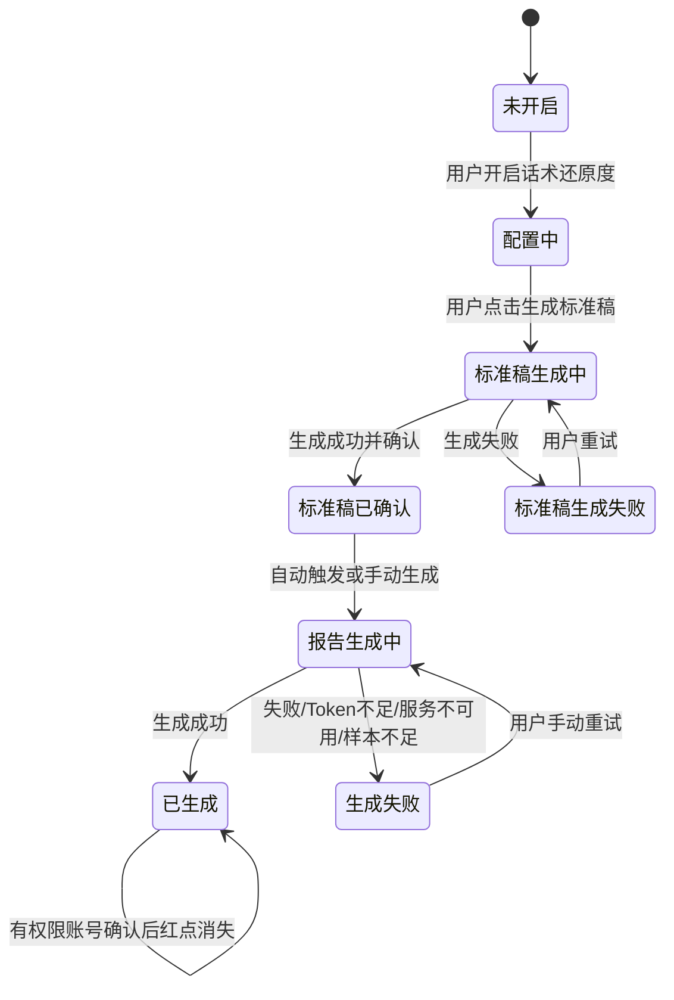
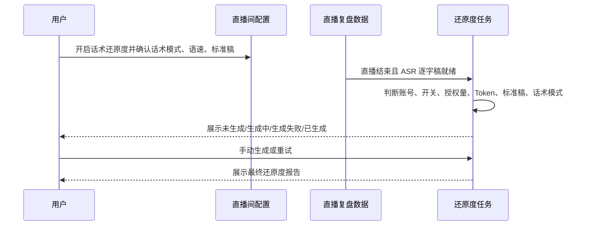

# PRD: 话术还原度监控

## 元信息

- **REQ-ID**：REQ-2026-0508-话术还原度
- **标题**：话术还原度监控
- **优先级**：P1
- **目标版本**：2.60.3
- **生效日期**：2026-05-18
- **业务负责人**：PM
- **技术负责人**：Beta
- **受影响项目**：服务端 / 客户端前端 / 管理后台前端
- **关联需求 / shared spec**：`REQ-2026-0508-话术质检`、`REQ-2026-0508-互动巡检`、`requirements/_shared/REQ-2026-0508-话术监控/shared-capability.md`

## 一、Problem Statement

### 1.1 用户问题

主播是否按标准直播话术执行，目前依赖人工巡查，运营无法稳定量化主播偏离标准脚本、随意发挥或漏讲关键内容的程度。直播结束后缺少自动化还原度报告，主播和运营主管都难以及时复盘执行偏差。

### 1.2 受影响用户 / 场景

- 主要用户：运营主管、主播。
- 次要用户：可查看同租户云空间分享记录的账号、内部运营。
- 不受影响用户：竞品账号相关记录；无话术还原度功能权限的套餐用户。

### 1.3 当前不解决的代价

- 标准直播脚本无法形成稳定复盘闭环，执行偏差仍靠人工抽查。
- 运营难以快速判断主播是否按标准话术执行，培训和纠偏成本高。
- 主播无法在复盘结果中直接看到本场话术执行情况。

### 1.4 证据来源

- 原始草稿片段：`source-traceability.md` ST-RS-001 至 ST-RS-010。
- PM answers：`03-pm-answers-round1.md` Q1 至 Q16。
- 领域知识：`glossary.md` 中的自有账号、竞品账号、授权量、Token、话术还原度、标准直播稿。
- Shared capability：`requirements/_shared/REQ-2026-0508-话术监控/shared-capability.md`。

## 二、Goals

### 2.1 用户目标

- G1：运营主管能在复盘列表和详情中看到本场话术还原度结果，快速判断主播是否按标准话术执行。
- G2：主播能查看还原度报告，理解本场话术执行偏差。
- G3：用户能在自动生成失败、未生成或需要补生成时手动生成 / 重试报告。

### 2.2 业务目标

- G1：将话术还原度纳入 2.60.3 AI 监控套件，并与话术质检、互动巡检共用账号、授权量、Token 和发布隐藏策略。
- G2：用标准直播稿 + ASR 逐字稿 + AI 提示词生成最终还原度结果，减少人工复盘成本。

### 2.3 成功指标

| 指标 | 类型 | 目标值 | 最低可接受值 | 衡量方式 | 评估时间 |
|---|---|---|---|---|---|
| 报告生成完成时长 | leading | P95 5 分钟内 | P95 20 分钟内 | 生成任务耗时统计 | 上线验收与灰度期 |
| 用户侧状态可解释性 | leading | 未生成、生成中、已生成、生成失败、不可生成均有明确表现 | 不出现无反馈的卡死状态 | QA 场景验收 | 上线前 |
| 手动生成可恢复性 | leading | 失败后用户可重新触发并看到新结果 | 失败不覆盖已有成功报告 | QA 场景验收 | 上线前 |

当报告生成 P95 超过 5 分钟但不超过 20 分钟时，由 PM 和技术负责人共同决定是否允许灰度放行；超过 20 分钟不得放行。

## 三、Non-Goals

| 不做事项 | 原因 | 后续版本 / 触发条件 |
|---|---|---|
| 不固定还原度拆分维度和权重 | PM 确认由 AI 根据提示词自动分析判断，PRD 不写死评分权重 | 如后续要做可解释分项评分，另起需求 |
| 不向租户开放还原度智能体配置 | PM 确认仅内部运营维护默认模板，租户侧不开放 | 需要租户差异化模板时再评估 |
| 不让互动巡检覆盖 AI切片、视频分析、文案预审 | 该范围属于互动巡检子 REQ 差异，话术还原度本期覆盖这些页面 | 无 |
| 不展示还原度内部推理过程 | PM 确认列表展示 AI 输出包裹内容，内部判断交给提示词和大模型 | 如客户要求可解释明细，再评估报告结构 |

## 四、Personas & User Stories

### 4.1 Personas

| 角色 | 目标 | 可见内容 | 可执行动作 | 不可执行动作 |
|---|---|---|---|---|
| 运营主管 | 判断主播是否按标准话术执行 | 标准稿配置、还原度结果、报告摘要、生成状态、红点 | 开启监控、生成标准稿、编辑标准稿、查看报告、手动生成 / 重试 | 修改内部提示词 |
| 主播 | 了解自己话术执行偏差 | 自己可见记录中的还原度报告 | 查看报告 | 配置内部提示词 |
| 内部运营 | 维护还原度提示词模板 | 管理后台内部配置 | 维护循环 / 非循环对比与校验提示词 | 让租户侧直接编辑 |
| 竞品账号用户 | 不适用 | 无入口或 `-` | 无 | 开启或生成话术还原度 |

### 4.2 User Stories

- US-001：作为运营主管，我希望为直播间配置标准直播稿，以便系统能自动比对主播实际话术和标准稿。
- US-002：作为运营主管，我希望在复盘列表和详情看到还原度结果，以便快速筛选需要复盘的场次。
- US-003：作为主播，我希望查看还原度报告，以便了解本场偏离标准话术的情况。
- US-004：作为运营人员，我希望生成失败后能手动重试，以便在条件恢复后拿到报告。

### 4.3 场景与边界

| 场景 | 触发条件 | 用户可见输出 | 结束条件 |
|---|---|---|---|
| 开启并配置标准稿 | 自有账号直播间，用户开启话术还原度 | 展示配置区、语速、循环模式、参考脚本、标准稿生成入口 | 标准稿确认后允许保存直播间 |
| 循环模式生成标准稿 | 用户选择循环模式并填写循环话术预估时长 | 生成单轮时间轴标准直播稿；报告生成时按实际直播时长循环铺满整场 | 标准稿确认后作为本场比对基准 |
| 非循环模式生成标准稿 | 用户选择非循环模式 | 生成一份按完整直播流程顺序排列的时间轴标准直播稿 | 标准稿确认后作为本场比对基准 |
| 自动生成 | 直播结束组合信号成立，ASR 就绪，开关和资源满足 | 生成中，成功后展示还原度结果 | 生成成功或生成失败 |
| 手动生成 | 用户点击生成报告 | 生成中，按钮禁用 | 成功覆盖旧报告，失败不覆盖旧成功报告 |
| 标准稿缺失 | 用户开启还原度但未确认标准稿 | 保存阻断并提示先确认标准稿 | 用户确认标准稿或关闭开关 |
| 短直播 | 直播时长短于完整标准稿 | 按完整标准稿评分，未覆盖部分扣分 | 报告生成完成 |
| 非循环超出标准稿时长 | 实际直播时长长于非循环标准稿覆盖时长 | 超出部分标记为标准稿外自由发挥，不计入 0-100 还原度分数，可在报告中说明 | 报告生成完成 |
| 无 ASR / 样本不足 | 输入数据不足 | 用户侧展示生成失败，并记录不可生成 / 跳过状态 | 用户补齐条件后手动重新生成 |

## 五、Scope & Requirements

### 5.1 P0 Must-Have

| ID | Requirement | Acceptance Criteria | 来源 / 追溯 |
|---|---|---|---|
| R-P0-001 | 添加 / 编辑直播间支持话术还原度开关 | 仅自有账号可见；竞品账号隐藏；开关默认关闭；开启时校验套餐功能权限、授权量和 Token；开启后展示配置区 | ST-RS-003, Q15 |
| R-P0-002 | 标准直播稿配置与确认 | 用户可选择循环 / 非循环模式、配置语速、录入参考脚本；语速默认 280 字/分钟，允许在 100-500 字/分钟范围内调整；选择循环模式时必须填写循环话术预估时长；生成标准稿前二次确认语速和话术模式；未确认标准稿时保存直播间必须阻断；当前登录账号具备该直播间编辑权限时，可编辑、合并、调整时段并确认标准直播稿，无直播间编辑权限时只能查看或无入口 | ST-RS-003, ST-RS-004, Q2, Q6, 06-round1 |
| R-P0-003 | 标准直播稿生成失败处理 | 标准稿生成失败时展示报错，不允许进入下一步；保留用户输入，允许重新生成 | ST-RS-004, Q9 |
| R-P0-004 | 标准稿继承与本场取用规则 | 同一直播间自动继承上一场已确认标准稿；本期不做租户内模板选择；同一场直播以报告生成前最后一次保存并确认的标准直播稿作为比对基准，直播中修改并保存后，本场后续生成 / 重新生成使用该最后保存版本 | Q4, Q5 |
| R-P0-005 | 自动生成还原度报告 | 直播结束组合信号成立且 ASR 就绪后，满足自有账号、开关、授权量、Token、标准稿条件才创建任务；任务必须读取报告生成前最后一次保存并确认的话术模式、语速和标准直播稿版本；同一场同时开启多个 AI 监控能力时，还原度与话术质检、互动巡检并行判断和生成，任一能力 Token 不足或生成失败只影响该能力，不阻断其他能力 | ST-RS-005, Q10, Q14, 06-round1 |
| R-P0-006 | 手动生成 / 重试还原度报告 | 手动生成只校验套餐功能权限、自有账号和 Token，不校验授权数量，也不判断还原度开关；生成中按钮禁用防重复；如手动生成时重新录入或复用标准脚本，必须以本次选择的话术模式和语速作为生成与比对口径 | ST-RS-006, Q14, Q15, 06-round1 |
| R-P0-007 | 还原度输出展示 | AI 输出报告中以 `</话术还原度检验>` 包裹的内容作为用户可见还原度结果；列表展示该结果，详情展示报告摘要和明细；报告需体现本场使用的话术模式、语速、标准稿版本，以及模式相关的偏离说明 | Q1, Q3, 06-round1 |
| R-P0-008 | 报告覆盖页面 | AI复盘列表、AI复盘详情、云空间详情、AI切片复盘列表 / 详情、视频分析列表 / 详情、文案预审列表 / 详情均展示还原度入口和结果；AI整场复盘和 AI切片复盘列表核心数据增加语速 | ST-RS-007, ST-RS-008 |
| R-P0-009 | 重新生成数据处理 | 手动重新生成成功后覆盖旧最终报告；失败不覆盖已有成功报告；条件恢复后旧失败状态不自动恢复为可生成，需用户手动触发 | Q14 |
| R-P0-010 | Token 消耗边界 | 标准稿生成和还原度报告仅生成成功后消耗 Token；失败、超时、不可生成不消耗 | Q12 |
| R-P0-011 | 发布灰度与隐藏 | 允许单个子能力先灰度；未开放能力完全隐藏入口、列、红点和报告 | Q16 |
| R-P0-012 | 循环 / 非循环话术模式业务规则 | 循环模式下，标准直播稿按循环话术预估时长生成单轮时间轴，报告生成时按实际直播时长循环铺满整场并逐轮比对；最后不足一整轮时只比对实际发生时长对应的标准稿片段。非循环模式下，标准直播稿按完整直播流程顺序生成，不循环铺排；实际直播超出标准稿覆盖时长的部分标记为标准稿外自由发挥，不计入 0-100 还原度分数，但可在报告中说明自由发挥内容；实际直播短于完整标准稿时，沿用短直播规则按完整标准稿评分，未覆盖部分扣分 | glossary.md, Q8, 06-round1 |
| R-P0-013 | 三份还原度报告校验合并策略 | 每次自动生成或手动生成时，基于已确认的话术模式、语速、循环话术预估时长和标准稿版本，固定生成 3 份还原度报告，再由校验 / 合并模型合并成 1 份最终还原度报告；用户侧只展示最终报告，三份中间报告仅系统内部留存 | inbox 改稿, 06-round2 |

### 5.2 P1 Nice-to-Have

| ID | Requirement | Acceptance Criteria | 来源 / 追溯 |
|---|---|---|---|
| R-P1-001 | 内部运营维护还原度提示词模板 | 管理后台内部维护循环 / 非循环对比与校验提示词；租户侧不可见不可改 | ST-RS-009, Q13 |
| R-P1-002 | 标准稿中间产物留存 | 参考脚本、时间轴标准直播稿作为内部中间产物留存；标准直播稿用户可查看 | Q14 |

### 5.3 P2 Future Considerations

| ID | Requirement | Acceptance Criteria | 来源 / 追溯 |
|---|---|---|---|
| R-P2-001 | 固定拆分维度和权重 | 如后续需要可解释分项评分，再定义权重、分项展示和验收样例 | Q3 |
| R-P2-002 | 租户内模板选择 | 如后续需要跨直播间手动选择标准稿，另起需求定义模板管理和选择流程 | Q4 |

## 六、UX / Interaction Rules

- Figma / 原型链接：暂无。
- 链接有效期保障：不适用。
- 原型覆盖范围：以本 PRD 文字规则为准。
- 原型未覆盖但 PRD 必须明确的规则：入口展示、按钮状态、生成失败、红点、重试、标准稿确认阻断。

### 6.1 页面与入口

| 页面 | 入口/控件 | 展示条件 | 隐藏/禁用条件 | 点击后去向 |
|---|---|---|---|---|
| 添加 / 编辑直播间 | 话术还原度开关 | 自有账号，套餐支持 | 竞品账号隐藏；权限、授权量或 Token 不足时开启失败 | 展开配置区 |
| 添加 / 编辑直播间 | 标准稿配置区 | 开启话术还原度后 | 未开启时隐藏 | 留在当前页 |
| 添加 / 编辑直播间 | 话术模式 | 标准稿配置区展示时可选循环 / 非循环 | 循环模式未填写循环话术预估时长时，生成标准稿不可提交 | 留在当前页 |
| 添加 / 编辑直播间 | 生成标准稿 | 已录入必要配置 | 生成中禁用；失败后可重试 | 留在当前页 |
| AI复盘列表 | 开启监控 / 生成报告 / 还原度结果 / 红点 | 自有账号记录 | 未开放灰度时隐藏；竞品账号隐藏或展示 `-` | 打开报告弹窗或触发生成 |
| AI复盘详情 / 云空间详情 | 还原度报告入口 | 自有账号记录 | 无结果时按状态展示 | 留在详情页 |
| AI切片复盘列表 / AI切片复盘详情 | 还原度入口和结果 | 自有账号记录 | 未开放灰度时隐藏 | 列表打开弹窗，详情留在当前页 |
| 视频分析列表 / 视频分析详情 | 还原度入口和结果 | 自有账号记录 | 未开放灰度时隐藏 | 列表打开弹窗，详情留在当前页 |
| 文案预审列表 / 文案预审详情 | 还原度入口和结果 | 自有账号记录 | 未开放灰度时隐藏 | 列表打开弹窗，详情留在当前页 |

### 6.2 关键交互状态

| 场景 | 用户动作 | 处理中表现 | 成功反馈 | 失败反馈 | 页面停留/关闭/跳转 |
|---|---|---|---|---|---|
| 开启监控 | 打开话术还原度开关 | 展示配置区 | 可继续配置标准稿 | 权限、授权量或 Token 不足时提示原因 | 留在当前页 |
| 切换话术模式 | 在标准稿配置区选择循环 / 非循环 | 已生成但未确认标准稿时提示需重新生成；已确认标准稿被编辑后需重新确认 | 当前配置按新模式展示必要字段 | 循环模式缺少循环话术预估时长时提示补齐 | 留在当前页 |
| 保存直播间 | 未确认标准稿时点击保存 | 不进入保存中 | 无 | 阻断并提示先确认标准稿 | 留在编辑页 |
| 生成标准稿 | 点击生成标准稿 | 按钮 loading 且禁用 | 展示时间轴标准稿，可编辑和确认 | 保留原输入，展示失败原因和重试入口 | 留在当前页 |
| 手动生成报告 | 点击生成报告 | 按钮禁用防重复 | 主动刷新后展示最新结果、摘要和红点 | 主动刷新后展示失败原因和重试入口 | 留在当前页 |
| 查看报告 | 点击还原度结果或入口 | 打开弹窗 / 区域 loading | 展示总分或 AI 输出内容、摘要、明细、红点 | 展示生成失败或不可生成原因 | 不改变原页面上下文 |
| 确认已读 | 有确认权限账号滚动报告到底部后点击确认 | 按钮 loading，禁止重复点击 | 当前账号红点消失，按钮变为已确认 | 红点保留，按钮恢复可点并展示失败原因 | 弹窗保持打开 |

### 6.3 用户可见状态与文案语义

| 状态 | 用户看到什么 | 可执行动作 | 备注 |
|---|---|---|---|
| 未开启 | 标准稿配置区、报告入口和红点隐藏；复盘列表展示开启监控、生成报告按钮 | 开启监控或手动生成 | 手动生成不要求开关开启 |
| 配置未完成 | 提示需先确认标准稿 | 完成标准稿生成和确认 | 保存直播间被阻断 |
| 标准稿生成中 | 生成中 | 无法重复点击 | 保留当前输入 |
| 标准稿生成失败 | 失败原因 | 重试生成 | 不允许进入下一步 |
| 循环模式配置缺失 | 提示需填写循环话术预估时长 | 补齐后生成标准稿 | 不生成标准稿，不允许确认 |
| 报告未生成 | 生成中 / 可手动生成 / 不可生成 | 手动生成或重试 | 根据条件显示具体原因 |
| 已生成 | 还原度结果、摘要、明细、红点 | 查看报告；有确认权限账号可确认已读 | 当前账号无确认权限时只读展示且不显示确认按钮；打开报告不自动消红点 |
| Token 不足 | `您的算力数量不足，请联系产品顾问购买。` | 补足后手动重试 | 失败不消耗 Token |

## 七、Data & State Flow

### 7.1 端到端数据状态流转

| 阶段 | 触发条件 | 业务状态 | 用户可见输出 | 结束条件 |
|---|---|---|---|---|
| 配置 | 用户开启话术还原度 | 配置中 / 标准稿生成中 / 标准稿已确认 / 标准稿生成失败 | 配置区、生成中、失败原因、标准稿 | 标准稿确认或关闭开关 |
| 自动前置判断 | 直播结束组合信号成立且 ASR 就绪；组合信号包括平台通知下播 / 推流终止、用户主动停止录制、系统因无法获取直播流自动停止录制 | 未触发 / 条件不满足 / 等待输入 | 未生成、生成中或失败原因 | 创建任务或停留未生成 |
| 话术模式处理 | 报告任务读取已确认标准稿 | 循环铺排 / 非循环顺序比对 | 报告中展示本场话术模式、语速、标准稿版本和偏离说明 | 进入 AI 生成 |
| AI 生成 | 自动触发或手动触发 | 生成中 / 校验合并中 / 已生成 / 生成失败 / 不可生成 / 跳过 | 生成中、结果、失败原因 | 3 份还原度报告生成并校验合并成功，或失败 |
| 报告展示 | 最终报告生成成功 | 已生成 | 还原度结果、摘要、明细、红点 | 有权限账号确认后当前账号红点消失；无确认权限账号保持只读 |
| 失败恢复 | Token 不足、服务不可用、无 ASR、无标准稿、样本不足 | 生成失败 / 不可生成 / 跳过 | 用户侧展示生成失败并说明原因 | 用户手动重试 |

### 7.2 状态与标记归属

- **任务状态归属**：场次级。
- **红点 / 已读 / 确认归属**：当前登录账号级；只影响当前账号。当前账号有确认权限时，打开报告不自动消红点；报告内容滚动到底部后可点击确认，确认成功后当前账号红点消失；确认失败则红点保留并恢复按钮；当前账号无确认权限时只读展示且不显示确认按钮。
- **配置归属**：标准稿为同一直播间继承；开关为直播间 + 功能；授权量为租户 + 功能 + 直播间；Token 为租户资源。
- **话术模式归属**：话术模式、语速、循环话术预估时长与标准直播稿一起归属于已确认标准稿版本；报告生成和重新生成均使用报告生成前最后一次保存并确认的版本。
- **账号类型切换规则**：沿用 shared capability，已开启任一 AI 监控能力时，不能直接从自有账号切换为同行业 / 竞品账号。
- **多能力并行规则**：同一场同时开启话术质检、话术还原度、互动巡检时，三个能力并行判断和生成；任一能力 Token 不足或生成失败只影响该能力，不阻断其他能力生成。

### 7.3 话术模式数据处理

| 话术模式 | 标准稿生成 | 报告比对范围 | 超出 / 不足处理 | 报告展示 |
|---|---|---|---|---|
| 循环模式 | 按循环话术预估时长生成单轮时间轴标准直播稿 | 按实际直播时长循环铺满整场，每一轮与对应标准稿片段比对 | 最后一轮不足完整循环时，只比对实际发生时长对应的标准稿片段；未发生的剩余片段不扣分 | 展示循环模式、语速、标准稿版本、轮次级漏讲 / 乱序 / 偏离 / 自由发挥说明 |
| 非循环模式 | 按完整直播流程顺序生成一份时间轴标准直播稿 | 按标准稿顺序与 ASR 逐字稿比对，不循环铺排 | 超出标准稿覆盖时长的部分标记为标准稿外自由发挥，不计入 0-100 还原度分数；直播短于完整标准稿时，按完整标准稿评分，未覆盖部分扣分 | 展示非循环模式、语速、标准稿版本、未覆盖扣分和自由发挥说明 |

### 7.4 产物生命周期

- 中间产物：参考脚本、时间轴标准直播稿；内部留存，标准直播稿用户可查看。
- 报告中间产物：固定生成的 3 份还原度报告仅系统内部留存，用于校验合并和问题排查，不对普通用户展示。
- 最终产物：一份还原度最终报告，列表和详情展示该最终结果。
- 模式产物：话术模式、语速、循环话术预估时长和标准稿版本需随报告留存，保证后续查看、手动重试和问题排查能追溯生成口径。
- 空输入 / 样本不足产物：记录不可生成 / 跳过状态，用户侧展示生成失败和原因。
- 重新生成 / 手动重试后的旧数据处理：重新生成成功覆盖旧最终报告；失败不覆盖已有成功报告；旧失败状态不自动恢复为可生成。

## 八、AI-Specific Constraints

### 8.1 输入数据语义

- **数据来源**：标准直播稿来自用户配置和 AI 生成；实际话术来自主播 / 助手 ASR 逐字稿。
- **粒度**：以单场直播为最终报告粒度；标准稿带时间轴。
- **话术模式输入**：还原度任务必须同时读取话术模式、语速、循环话术预估时长（仅循环模式必填）和已确认标准稿版本；缺少必要模式输入时不可生成有效报告，用户侧展示生成失败。
- **数据质量约束**：无 ASR、无标准稿、样本不足时不生成有效报告，用户侧展示生成失败。

### 8.2 用户视角输出

- **输出形态**：AI 输出报告中由 `</话术还原度检验>` 包裹的内容作为用户可见结果；报告正文可包含摘要和明细。
- **报告生成策略**：固定生成 3 份还原度报告，再用校验 / 合并模型形成 1 份最终还原度报告；用户侧只展示最终报告。
- **承载位置**：AI复盘列表 / 详情、云空间详情、AI切片复盘列表 / 详情、视频分析列表 / 详情、文案预审列表 / 详情。
- **可解释性**：本期不固定拆分维度和权重，由提示词和大模型分析。
- **模式可解释性**：报告必须展示本场使用的循环 / 非循环模式、语速和标准稿版本。循环模式需说明轮次级偏离；非循环模式需说明未覆盖扣分和标准稿外自由发挥内容。
- **最小可用结构**：至少有用户可见还原度结果、报告摘要、生成状态和失败原因。

### 8.3 业务达标标准

- **准确率 / 召回率 / 可接受误差**：本期由提示词和人工验收样例判断，不设固定数值。
- **失败可接受率**：上线验收不得出现无反馈卡死；失败必须可重试。
- **延迟可接受范围**：P95 5 分钟目标，P95 20 分钟最低可接受；P95 超过 5 分钟但不超过 20 分钟时由 PM 和技术负责人共同决定是否灰度放行，超过 20 分钟不得放行。

### 8.4 Token / 算力消耗边界

- 成功：生成成功后消耗 Token。
- 失败：不消耗 Token。
- 超时：不消耗 Token。
- 空输入 / 低质量输入：不消耗 Token。
- 手动重试 / 重新生成：成功后消耗 Token，失败不消耗。

## 九、Cross-Project Impact & Dependencies

### 9.1 项目影响

| 项目 | 新增能力 | 修改能力 | 不动能力 |
|---|---|---|---|
| 服务端 | 还原度任务、标准稿生成、报告生成、状态与资源判断 | AI 监控公共资源校验、报告生命周期 | 具体项目实现方案由 SDD 决定 |
| 客户端前端 | 添加 / 编辑直播间配置区、复盘列表与详情入口、报告展示、红点和手动生成 | AI 监控公共状态、生成按钮、失败提示 | 视觉细节由设计稿承载 |
| 客户端 | 承载客户端前端运行与录制上下文 | 不新增独立业务入口 | 本地采集播放能力不在本 PRD 展开 |
| 管理后台前端 | 内部运营维护循环 / 非循环对比与校验提示词 | 现有智能体配置体系新增还原度类型 | 租户侧配置入口不做 |

### 9.2 Shared Capability 依赖

- 共享页面 / 入口：添加 / 编辑直播间、AI复盘列表 / 详情、云空间详情。
- 共享权限 / 资源校验：自有账号、套餐功能权限、授权量、Token。
- 共享状态 / 异常：未开启、未生成、生成中、已生成、生成失败、红点、手动生成。
- 与 sibling REQ 不同的地方：话术还原度需要标准稿配置和标准稿生成；覆盖 AI切片复盘列表/详情页。
- 共享发布结论：PM 已确认允许单个子能力先灰度；未开放能力完全隐藏入口、列、红点和报告。

### 9.3 发布顺序 / Phasing

| 阶段 | 范围 | 依赖 | 是否可独立上线 | 风险 |
|---|---|---|---|---|
| Phase 1 | 还原度服务端生成能力和客户端展示灰度 | 内部提示词配置、客户端入口隐藏策略 | 是，可单能力灰度 | 未灰度用户必须完全隐藏入口和结果 |
| Phase 2 | 与话术质检、互动巡检共同开放 | 三个子能力均就绪 | 是 | 公共入口和授权余量需保持一致 |

## 十、Open Questions

| ID | 问题 | 责任方 | 阻塞级别 | 决策时点 | 当前处理 |
|---|---|---|---|---|---|
| OQ-RS-001 | 后续是否要固定分项评分和权重 | PM | non-blocking | 后续版本 | 本期由 AI 提示词判断 |
| OQ-RS-002 | 后续是否开放租户内标准稿模板选择 | PM / 技术负责人 | non-blocking | 后续版本 | 本期同一直播间继承 |

## 十一、Acceptance

### 11.1 验收清单

- [ ] 自有账号添加 / 编辑直播间时可看到话术还原度开关；竞品账号无入口。
- [ ] 开启后展示标准稿配置区；未确认标准稿时保存直播间被阻断。
- [ ] 循环模式必须填写循环话术预估时长；生成报告时按实际直播时长循环铺满整场并逐轮比对。
- [ ] 非循环模式不循环铺排标准稿；超出标准稿覆盖时长的内容标记为自由发挥且不计入 0-100 还原度分数。
- [ ] 自动生成和手动生成均固定生成 3 份还原度报告，再校验合并为 1 份最终还原度报告；用户侧只展示最终报告。
- [ ] 标准稿生成中按钮 loading 且不可重复点击；失败后保留输入并可重试。
- [ ] 同一直播间下一场自动继承上一场已确认标准稿。
- [ ] 自动生成满足自有账号、开关、授权量、Token、标准稿、ASR 就绪等条件。
- [ ] 手动生成不校验授权数量，也不要求开关开启，但必须校验套餐功能权限、自有账号和 Token。
- [ ] AI复盘、云空间、AI切片、视频分析、文案预审相关页面均展示还原度入口和结果。
- [ ] 无 ASR、无标准稿、样本不足、Token 不足、服务不可用时，用户能看到明确失败原因。
- [ ] 重新生成成功覆盖旧报告，失败不覆盖已有成功报告。
- [ ] P95 5 分钟目标、P95 20 分钟最低可接受口径可被观测。

### 11.2 业务验收场景

| 场景 | 前置条件 | 用户操作 | 预期结果 |
|---|---|---|---|
| 开启并确认标准稿 | 自有账号直播间，套餐和授权量满足，Token 充足 | 开启话术还原度，录入参考脚本，生成并确认标准稿，保存直播间 | 保存成功，标准稿可查看；后续同一直播间继承该标准稿 |
| 循环模式整场比对 | 选择循环模式，填写循环话术预估时长并确认标准稿，实际直播时长超过一轮 | 触发自动生成或手动生成 | 系统按实际直播时长循环铺满标准稿，逐轮判断漏讲、乱序、偏离或自由发挥；最后不足整轮时只按实际发生片段比对 |
| 非循环模式超出时长 | 选择非循环模式并确认标准稿，实际直播时长长于标准稿覆盖时长 | 触发自动生成或手动生成 | 超出标准稿覆盖时长的内容标记为标准稿外自由发挥，不计入 0-100 还原度分数，报告中展示说明 |
| 三份报告校验合并 | 已确认标准稿，自动生成或手动生成条件满足 | 触发自动生成或手动生成 | 系统固定生成 3 份还原度报告，经校验 / 合并模型形成 1 份最终报告；用户侧只看到最终报告 |
| 未确认标准稿保存阻断 | 已开启话术还原度但未确认标准稿 | 点击保存直播间 | 保存被阻断，提示先确认标准稿 |
| 自动生成成功 | 已开启还原度，直播结束组合信号成立，ASR 就绪，资源满足 | 等待系统自动生成 | 列表 / 详情展示还原度结果、摘要、明细和红点 |
| 手动生成成功覆盖旧报告 | 已有旧成功报告，用户具备手动生成条件 | 点击手动生成并生成成功 | 新成功报告覆盖旧最终报告，失败历史不影响新结果展示 |
| 手动生成失败不覆盖旧报告 | 已有旧成功报告，本次手动生成失败 | 点击手动生成 | 展示失败原因，旧成功报告仍可查看 |
| Token 不足 | 自有账号但 Token 低于门槛 | 自动或手动触发生成 | 展示算力不足原因，不消耗 Token，可补足后重试 |
| 无 ASR / 样本不足 | 直播结束但 ASR 缺失或样本不足 | 自动触发或手动生成 | 用户侧展示生成失败并说明原因，内部记录不可生成 / 跳过 |
| 红点确认成功 / 失败 | 报告已生成且当前账号有确认权限 | 滚动到底部后点击确认 | 成功后当前账号红点消失；失败时红点保留并恢复按钮 |
| 无确认权限只读 | 当前账号可查看但无确认权限 | 打开报告 | 只读展示报告，不显示确认按钮，红点规则不被误更新 |
| 单能力灰度隐藏 | 用户不在话术还原度灰度范围 | 查看添加 / 编辑直播间、列表、详情 | 不展示还原度开关、列、红点和报告入口 |

## 十二、Source Traceability

- 原稿追溯矩阵：`source-traceability.md`。
- 未覆盖但已解释项：无 blocking 项。
- 被 PM answers 明确改掉的项：评分权重改为 AI 根据提示词判断；短直播按完整标准稿评分；标准稿生成失败不进入下一步；单能力允许灰度。

## 十三、实施记录

> 由开发在实施过程中追加。每条反馈必须包含维度标签，便于后续复盘。

（初始为空）

## 十四、变更日志

- 见同目录 `changelog.md`

---

<!-- generated-by: refiner v3, from REQ-2026-0508-话术还原度, at 2026-05-18 -->
