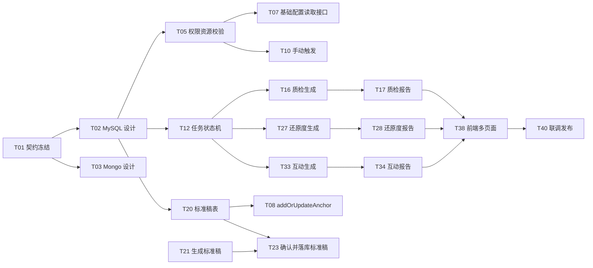

# 话术智能监控任务拆解

> 输入文档：`REQ-2026-0508-话术质检`、`REQ-2026-0508-话术还原度`、`REQ-2026-0508-互动巡检`、`API-话术智能监控-接口文档.md`、`_shared/shared-capability.md`
> 拆解日期：2026-05-20
> 当前阶段：需求理解与任务拆解，尚未进入编码

## 1. 总览面板

| 项 | 结论 |
|---|---|
| 核心能力数 | 4 个：公共 AI 监控底座、话术质检、话术还原度、互动巡检 |
| 拆解任务数 | 39 个 |
| 粗估总工时 | 约 366h，约 45.8 人日，未包含产品返工和模型效果调参反复 |
| PRD 体检评分 | 78/100 |
| 风险等级 | HIGH：涉及 DB schema、公共 API、AI 异步生成、资产/Token 扣减、跨页面展示和灰度隐藏 |
| 推荐实施方式 | Standard 模式，先产出 openspec，再按公共底座 + 单能力纵向切片推进 |

## 2. PRD 体检与风险

### 2.1 已明确的关键规则

- 三个能力共享账号类型、套餐权限、授权量、Token、灰度隐藏、报告状态和已读红点规则。
- 竞品/同行账号不允许调用 AI 监控能力；已开启任一 AI 监控时，不允许把自有账号切换为非自有账号。
- 三个开关不单独拆接口管理，统一随 `/replay/anchorurl/addOrUpdateAnchor` 添加或修改直播间时提交。
- 监控位统计**新增** `/replay/userproperty/monitorPositionStatistics` 接口（现网 `UserPropertyController` 无此方法），在 userproperty 资产体系下扩展三个 AI 监控位资产类型；三个 AI 监控位为租户共享口径，和现有子账号监控位一致，统计总量、已使用量和剩余量。
- 自动生成依赖开关和授权剩余量；手动生成不要求开关开启，也不校验授权剩余量，但要校验版本是否有该能力、自有账号和 Token。
- 话术质检固定生成 3 份中间报告，再校验合并成 1 份最终报告。
- 话术还原度需要用户已确认的标准稿；`generateStandardScript` 生成的标准稿不落库、仅返回内容供前端预览，必须经 `confirmStandardScript` 提交落库后才产生 `standardScriptId`，才能用于开启话术还原度。
- `addOrUpdateAnchor` 开启话术还原度时，新增和编辑直播间都必须传已确认的 `standardScriptId`。
- 标准稿可修改：用户在前端预览/修改标准稿（不落库），确认时由 `confirmStandardScript` 提交落库；编辑直播间场景按 `anchorUrlUserId` UPDATE 当前已确认稿、`standardScriptId` 不变，同一直播间只保留一条标准稿。
- 标准稿确认前不落库，放弃编辑无需调接口；不保留历史版本；多端编辑最后一次提交为准；报告生成不固化标准稿快照，报告详情不返回标准稿 ID、版本或快照内容。
- 话术还原度固定生成 3 份中间报告，再校验合并成 1 份最终报告。
- 互动巡检按弹幕 10 分钟单元切分，对应 ASR 单元结束时间延长 1 分钟，多单元合并为 1 份最终报告。
- 话术质检和还原度覆盖 AI复盘、云空间、AI切片、视频分析、文案预审；互动巡检覆盖 AI复盘、云空间和 AI切片，不覆盖视频分析、文案预审。

### 2.2 需要联调前冻结的冲突

| ID | 冲突点 | 当前建议 |
|---|---|---|
| C-001 | 互动巡检确认已读：PRD `11.2` 写“不要求滚动到底部”，旧接口文档写“必须滚动到底部” | 已统一为公共确认接口；后端只控制 `canConfirm` 和确认权限，滚动到底部由前端控制 |
| C-002 | `existsBarrage`：原文档曾考虑复用弹幕存在性接口 | 本需求不使用该接口，接口契约中删除 |
| C-003 | API 清单序号缺 12、13 | 已修订，接口清单与正文编号保持一致 |
| C-004 | “授权量”口径 | 已冻结：授权量为租户共享监控位池，`addOrUpdateAnchor` 提交开启时按「直播间 × 功能」校验并占用 1 位、关闭释放，扣减用幂等键防保存失败/重复提交/开关反复切换多扣；手动生成只校验当前版本是否有授权量，不校验剩余量 |
| C-005 | 公共状态/触发接口如何同时支持复盘视频、视频分析和文案预审 | 已冻结：使用 `sourceType + sceneType + sourceId` 统一定位资源；`sourceType=0,sceneType=0,sourceId=tb_anchor_video.video_id`；`sourceType=1,sceneType=1,sourceId=tb_upload_file.file_id` 表示视频分析；`sourceType=1,sceneType=2,sourceId=tb_upload_file.file_id` 表示文案预审；报告唯一键为 `tenantId + sourceType + sceneType + sourceId + monitorType` |
| C-006 | 标准稿草稿、确认和覆盖规则 | 已冻结（2026-05-22 澄清更新）：`generateStandardScript` 生成标准稿不落库、不返回 ID；前端预览/修改后由 `confirmStandardScript` 提交完整内容落库（删除 `saveStandardScriptDraft` 接口）；编辑场景按 `anchorUrlUserId` UPDATE 旧稿、`standardScriptId` 不变；不开历史；删除 `ScriptStatus` 枚举；`addOrUpdateAnchor` 开启还原度时 `standardScriptId` 必传 |

## 3. 现网影响评估

| 模块 | 影响 |
|---|---|
| `replay-api` | `ClientOpenApi2100` 需要新增状态、触发、报告、标准稿接口；`AnchorUrlController.addOrUpdateAnchor` 需要新增标准稿校验和账号切换保护 |
| `replay-words` | `AnchorUrlBll.addOrUpdateAnchor`、`tb_anchor_url_user`、`tb_basic_settings` 相关配置链路要扩展三个开关和标准稿 ID；弹幕、ASR、复盘基础分析数据在这里有现有生产者/服务 |
| `replay-ai` | 适合承载 AI 监控任务、标准稿、报告、中间产物、已读状态和提示词配置；已有 `DiagnosisCue`/`Conversation` 可参考但不应混用语义 |
| `replay-order` | 需要接入套餐能力、授权量和 AI Token 消耗/返还；现有 `AiTokenUseRecord` 可作为扣减记录参考 |
| `replay-third` | 复用 AI 模型调用能力，增加新监控类型的模型调用封装、超时与失败原因归一 |
| 数据存储 | MySQL 存任务、报告摘要、配置、已读；MongoDB 可存报告正文和中间产物，避免大字段压垮列表查询 |
| 发布运维 | 需要单能力灰度开关、回滚隐藏策略、生成耗时 P95 监控、失败率监控 |

## 4. 任务拆解清单

### 公共底座

| ID | 角色 | 任务 | 估时 | 依赖 | 验收标准 |
|---|---|---|---:|---|---|
| T01 | 产品/后端/前端 | 冻结接口契约和冲突口径 | 4h | 无 | C-001 至 C-006 有最终结论；接口方法、参数、错误码、页面覆盖矩阵确认 |
| T02 | 数据库/后端 | 设计 AI 监控 MySQL 表结构 | 8h | T01 | 覆盖开关配置、授权占用、标准稿、任务、最终报告、已读确认、灰度字段；所有列表查询有 `tenant_id` 索引 |
| T03 | 数据库/后端 | 设计 MongoDB 报告正文与中间产物集合 | 4h | T01 | 能保存质检/还原度 3 份中间报告、互动分片结果、最终正文；报告详情按 `reportId` 可查 |
| T04 | 后端 | 实现监控类型、报告状态、话术模式枚举与统一业务错误码 | 4h | T01 | 0/1/2 监控类型、报告状态（0-4）、话术模式 0=非循环/1=循环、`70001-70013` 业务错误码与接口文档一致；不设标准稿状态枚举 |
| T05 | 后端 | 实现公共权限与资源校验服务 | 12h | T02 | 自有账号、套餐、授权量、Token 校验可复用；自动/手动生成校验口径可区分 |
| T06 | 后端 | 实现授权占用/释放幂等逻辑和监控位统计扩展 | 8h | T02,T05 | 开启占用、关闭释放、保存失败不占用、重复请求不多扣；`monitorPositionStatistics` 返回版本相关监控位总量、已使用量、剩余量，并新增话术质检、话术还原度、互动巡检三个租户共享资产类型 |
| T07 | 后端 | 新增 `anchorBasicConfig` 直播间基础配置接口 | 6h | T02,T05,T06 | 根据主播 ID 返回主播名称、行业、账号归属、直播间模式、账号水平、流量结构、录制时间、上下播提醒、默认识别语言、录制清晰度、每段录制时长、录制完成操作、智能分析设置、三个 AI 监控开关和当前已确认 `standardScriptId`；不返回独立 AI 授权配置，不提供单独开关修改接口 |
| T08 | 后端 | 修改 `addOrUpdateAnchor` 统一提交三个开关 | 12h | T02,T05,T06,T20 | 三个开关统一保存；开启时校验资源并占用；关闭时释放；新增/编辑直播间开启还原度时都必须传已确认的 `standardScriptId`；新增直播间保存成功后回填 `anchorUrlUserId/secUid` 到标准直播稿表并绑定新直播间；编辑直播间校验 `standardScriptId` 属于当前直播间和当前用户/租户且已确认；已开启任一 AI 监控时账号类型不能改非自有 |
| T09 | 后端 | 实现公共状态查询 `reportStatus` / `batchReportStatus` | 10h | T02,T03,T04 | 单个查询入参使用 `sourceType + sceneType + sourceId`；批量查询入参使用 `sources[{sourceType,sceneType,sourceId}]`，返回数组元素结构与单个查询一致；按资源同时返回话术质检、话术还原度、互动巡检三份报告状态、摘要、红点和确认权限；不返回 `displayRules`；批量接口需校验所有资源的数据读取权限；同一 `fileId` 下视频分析和文案预审报告、红点、确认状态互相隔离 |
| T10 | 后端 | 实现手动触发 `triggerReport` | 8h | T05,T09 | 入参使用 `sourceType + sceneType + sourceId + monitorType`；`sourceType=0` 根据 `tb_anchor_video.video_id` 查询录制记录并校验 `tenantId/userId`；`sourceType=1` 根据 `tb_upload_file.file_id` 查询上传文件并校验 `tenantId/userId/accountType`；防重复触发；生成中返回可解释状态；不同能力前置校验独立 |
| T11 | 后端 | 实现公共确认已读接口 `confirmRead`（POST） | 6h | T02,T09 | 三类报告统一按 `reportId` 确认已读；当前账号级红点；只有资源归属账号可确认；`sourceType=0` 校验录制记录归属，`sourceType=1` 校验上传文件归属；可选 `confirmRole`（1运营/2主播/3主管）写入话术质检报告「已知晓」勾选项；已确认重复调用幂等成功；失败不误消红点 |
| T12 | 后端/DevOps | 生成任务幂等锁、重试和状态机 | 8h | T02,T04 | 同一 `tenantId + sourceType + sceneType + sourceId + monitorType` 不重复生成；失败/不可生成/生成中状态可恢复 |
| T13 | 后端/DevOps | 指标、日志和告警 | 6h | T12 | 可观测生成耗时 P95、失败率、Token 不足、AI 调用异常；日志不输出敏感正文 |

### 话术质检

| ID | 角色 | 任务 | 估时 | 依赖 | 验收标准 |
|---|---|---|---:|---|---|
| T14 | 后端/管理后台 | 新增话术质检提示词类型与默认配置 | 6h | T01 | 内部运营可维护；租户侧不可见 |
| T15 | 后端 | 话术质检自动触发接入基础复盘完成事件 | 8h | T05,T12,T14 | 自有账号、开关、授权量、Token、ASR 就绪后创建任务 |
| T16 | 后端 | 话术质检 3 份中间报告生成与合并 | 16h | T12,T14 | 每次生成固定 3 份，再合并 1 份最终报告；失败不覆盖旧成功报告 |
| T17 | 后端 | 话术质检报告详情接口 | 8h | T11,T16 | 详情入参只用 `reportId`；除已分享到云空间的录制记录外，报告 `tenantId` 必须与当前账号 `tenantId` 一致；四类计数、正文、录制人确认权限、已读状态与接口文档一致 |
| T18 | 后端 | 话术质检多页面数据适配 | 8h | T09,T17 | AI复盘、云空间、AI切片、视频分析、文案预审均能拿到状态和摘要 |
| T19 | 测试 | 话术质检专项用例 | 8h | T15-T18 | 覆盖自动、手动、Token 不足、失败重试、红点、账号切换保护、页面范围 |

### 话术还原度

| ID | 角色 | 任务 | 估时 | 依赖 | 验收标准 |
|---|---|---|---:|---|---|
| T20 | 后端 | 标准直播稿表设计 | 6h | T02,T03 | 同一直播间只保留一条已确认标准稿；表含标准稿 ID、用户 ID、租户 ID、直播间 ID（`anchorUrlUserId/secUid`，新增直播间确认时可暂空）、模式、语速、循环时长、参考脚本、时间轴正文；草稿不落库，无 status 字段、无历史版本 |
| T21 | 后端 | `generateStandardScript` 生成标准稿（不落库） | 10h | T05 | 话术模式必选；语速 100-500；参考脚本必填；循环模式必须填循环话术预估时长；调 AI 生成后直接返回标准稿内容（每段含时间段、框架标题、直播话术），不落库、不返回 `standardScriptId`；新增直播间不传 `anchorUrlUserId`，修改直播间和手动分析必须携带 `anchorUrlUserId`；仅生成成功消耗 Token |
| T23 | 后端 | `confirmStandardScript` 提交并落库标准稿 | 8h | T20,T21 | 接收完整标准稿内容（模式/语速/循环时长/参考脚本/时间轴正文）落库并返回 `standardScriptId`；新增直播间（不传 `anchorUrlUserId`）INSERT、`anchorUrlUserId/secUid` 暂空待 `addOrUpdateAnchor` 回填；修改直播间/手动分析（带 `anchorUrlUserId`）按 `anchorUrlUserId` UPDATE 当前稿、`standardScriptId` 不变，无则 INSERT；不保留历史；重复提交最后一次为准 |
| T24 | 后端 | `standardScriptDetail` | 4h | T20,T23 | 按 `anchorUrlUserId` 查询，`userId/tenantId` 从登录态获取；校验 `anchorUrlUserId` 访问权限；返回当前直播间已确认标准稿（草稿不落库，无草稿态）；无稿返回 `hasScript=false` 和默认语速 280 |
| T25 | 后端 | 还原度自动触发和手动触发前置校验 | 8h | T10,T20,T23 | 无已确认标准稿/无 ASR/样本不足/Token 不足都有明确失败原因；手动触发话术还原度无标准稿时返回“请先确认标准直播稿”，前端按当前资源关联直播间 `anchorUrlUserId` 生成并确认标准稿后再重试；报告生成时按当前可查询到的已确认标准稿执行，不固化标准稿快照 |
| T26 | 后端 | 循环/非循环标准稿铺排与输入组装 | 12h | T20,T25 | 循环按实际时长铺满；非循环超出部分标记自由发挥且不计入评分 |
| T27 | 后端 | 还原度 3 份报告生成与合并 | 16h | T14,T26 | 固定 3 份中间报告合并最终报告；报告保留模式、语速等展示字段，不保留标准稿历史版本或快照 |
| T28 | 后端 | 还原度报告详情接口 | 8h | T11,T27 | 详情入参只用 `reportId`；除已分享到云空间的录制记录外，报告 `tenantId` 必须与当前账号 `tenantId` 一致；返回 score、`deviationDetail`、正文、红点、确认权限；不返回标准稿 ID、版本或快照内容 |
| T29 | 后端 | 还原度多页面数据适配 | 8h | T09,T28 | AI复盘、云空间、AI切片、视频分析、文案预审均展示还原度和语速 |
| T30 | 测试 | 话术还原度专项用例 | 10h | T21,T23-T29 | 覆盖模式必选、循环时长必填、参考脚本必填、未提交落库不可开启、新增/编辑开启还原度未传或错传 `standardScriptId` 阻断、确认即落库、编辑按 `anchorUrlUserId` UPDATE 覆盖不留历史、循环/非循环、失败不覆盖、红点 |

### 互动巡检

| ID | 角色 | 任务 | 估时 | 依赖 | 验收标准 |
|---|---|---|---:|---|---|
| T31 | 后端 | 弹幕、ASR、时间轴输入准备服务 | 12h | T03,T12 | 仅面向 `sourceType=0` 录制视频资源，能按 `sourceId=tb_anchor_video.video_id` 获取弹幕、主播/助手 ASR 和时间轴校准结果；缺失时不可生成 |
| T32 | 后端 | 10 分钟单元切片与 ASR +1 分钟窗口 | 8h | T31 | 弹幕单元和对应 ASR 窗口准确；大量弹幕不做前端 TopN 硬编码 |
| T33 | 后端 | 互动巡检分片分析与最终合并 | 16h | T14,T32 | 多单元结果合并 1 份最终报告；无弹幕不生成误导性空报告 |
| T34 | 后端 | 互动巡检报告详情接口 | 8h | T11,T33 | 详情入参只用 `reportId`；除已分享到云空间的录制记录外，报告 `tenantId` 必须与当前账号 `tenantId` 一致；返回互动有效性百分比、摘要、明细、红点、确认权限 |
| T35 | 后端 | 互动巡检页面范围适配 | 4h | T09,T34 | AI复盘列表/详情、云空间详情、AI切片列表/详情展示；视频分析/文案预审隐藏 |
| T36 | 测试 | 互动巡检专项用例 | 10h | T31-T35 | 覆盖无弹幕、无 ASR、失败重试、10 分钟单元、旧成功不覆盖、AI切片展示、视频分析/文案预审隐藏 |

### 前端、管理后台、发布与总体验收

| ID | 角色 | 任务 | 估时 | 依赖 | 验收标准 |
|---|---|---|---:|---|---|
| T37 | 前端 | 添加/编辑直播间基础配置和 AI 监控配置区 | 16h | T07,T08,T21,T23,T24 | 通过 `anchorBasicConfig` 回填直播间基础字段和三个新开关；三个开关统一随 `addOrUpdateAnchor` 提交（不传保持原值，关闭显式传 0）；`generateStandardScript` 生成的标准稿在前端预览/修改（不落库），用户确认时由 `confirmStandardScript` 提交落库取得 `standardScriptId`；新增和编辑直播间开启还原度都必须提交该 `standardScriptId`；账号类型隐藏/阻断表现一致 |
| T38 | 前端 | 用户侧多页面入口、状态、报告弹窗和红点 | 24h | T09,T11,T17,T28,T34 | 页面覆盖矩阵全部符合；列表页优先调用 `batchReportStatus` 批量获取状态，详情页可调用 `reportStatus`；手动分析无标准稿时，前端用当前资源关联直播间 `anchorUrlUserId` 生成并确认标准稿后再重试；三类报告统一调用 `confirmRead` 确认已读；未灰度/竞品账号完全隐藏或展示 `-` |
| T39 | 管理后台 | 内部提示词配置扩展 | 8h | T14 | 支持质检、还原度循环/非循环、互动巡检类型；租户不可见 |
| T40 | QA/DevOps | 全链路联调、灰度、回滚和性能验收 | 16h | T01-T39 | P95 5 分钟目标可观测，20 分钟红线可判定；单能力灰度和回滚隐藏验证通过 |

## 5. 建议实施顺序

1. 契约冻结：T01，先解决接口和交互冲突。
2. 公共底座：T02-T13，先打通配置、资源、状态、触发、已读、幂等（其中 T08 修改 `addOrUpdateAnchor` 依赖标准稿表 T20，需先完成 T20）。
3. 单能力纵向切片：建议按“话术质检 -> 话术还原度 -> 互动巡检”推进。质检不依赖标准稿/弹幕，最适合作为首个闭环。
4. 前端并行：T37 可在 T07/T08/T21-T24 契约稳定后启动；T38 按单能力报告接口完成情况分批联调。
5. 发布验收：T40 必须在每个单能力灰度前执行对应子集，不等三个能力全部完成才验收。

## 6. 关键依赖图

## 7. 下一步建议

- 先开 Standard openspec，Allowed Scope 至少覆盖 `replay-api`、`replay-words`、`replay-ai`、`replay-order`、`replay-third`、`replay-generic` 和 SQL 文档。
- openspec 第一阶段只设计公共底座和话术质检首个纵向闭环，避免一次性把三个 AI 能力全部塞进同一个实现上下文。
- 在进入实现前补充 DB DDL、接口 BO/VO 字段、`sourceType + sceneType + sourceId` 资源映射、Token/授权量资产表关系和生成状态机图。
