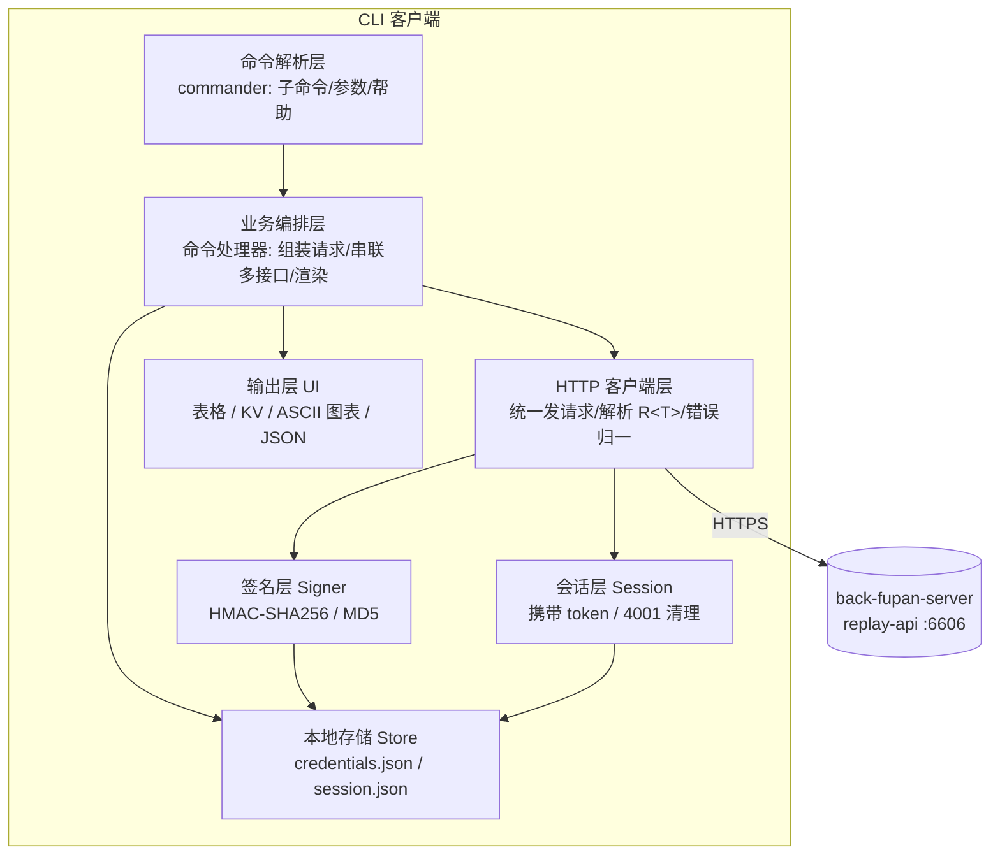
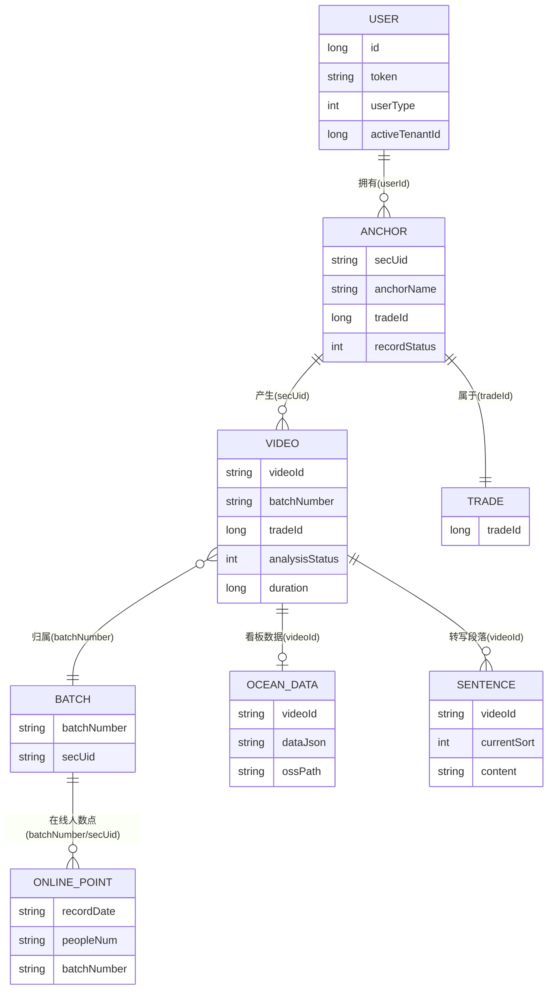
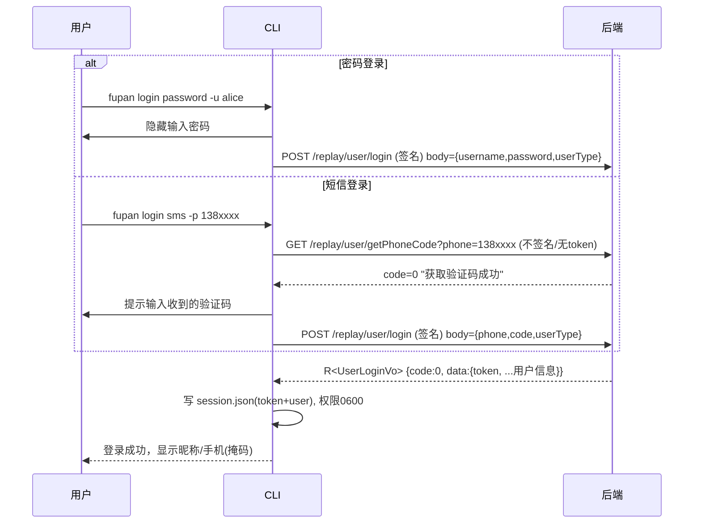
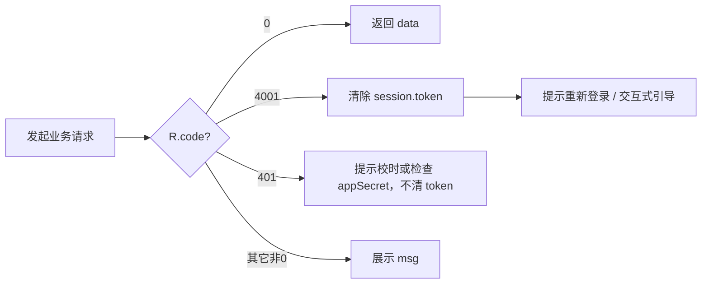
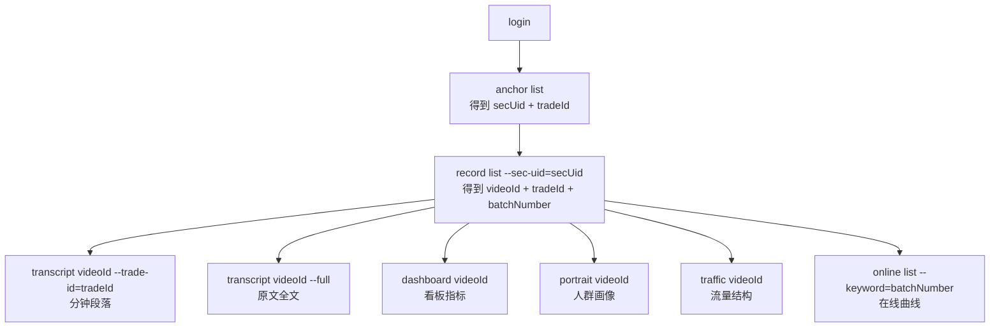

# 直播复盘 CLI 客户端 — 设计与接口规约（PRD + 架构设计 + 接口文档）

> 版本：v1.0（2026-05-27）
> 适用后端：back-fupan-server（Java 17 / Spring Boot 3）
> 读者：负责实现该 CLI 的外部开发团队、对接的后端同学、测试同学
> 性质：本文是「PRD + 架构设计 + 接口文档」三合一，所有接口与字段均**基于现有后端代码事实**抽取，可直接据此并行开发。

---

## 0. 文档导航

| 章节 | 内容 | 给谁看 |
|---|---|---|
| 1 | 产品概述（目标 / 功能清单 / 非功能需求） | PM / 全员 |
| 2 | 整体架构（分层 / 请求生命周期） | 开发 |
| 3 | 鉴权与签名机制（**核心**） | 开发 |
| 4 | 本地凭证存储设计 | 开发 |
| 5 | 业务流程与数据关系（接口编排 / 时序图 / ER） | 开发 / 测试 |
| 6 | CLI 命令与交互设计 | 开发 / 用户 |
| 7 | 接口规约（字段级，逐接口） | 开发（对接契约） |
| 8 | 错误处理、重试、退出码 | 开发 |
| 9 | 附录（枚举字典 / 公共封装 / 注意事项） | 开发 |

### 术语表

| 术语 | 含义 |
|---|---|
| `appId` / `appSecret` | 接口签名用的应用 ID 与密钥，按环境（prod/test/yz）区分 |
| `token` | 登录成功后返回的会话令牌，后续业务接口鉴权用 |
| `secUid` | 主播唯一标识（一个主播） |
| `videoId` | 一条录制记录（一个视频）的唯一标识 |
| `batchNumber` | 直播场次号（一场直播；分段录制时多个 video 同属一个 batch，取自直播间 room_id） |
| `tradeId` | 行业 id（调用转写段落接口必需） |
| `R<T>` | 后端统一响应封装 `{code, msg, data}`，`code===0` 为成功 |
| `PageUtils<T>` | 后端统一分页封装 |

---

## 1. 产品概述（PRD）

### 1.1 目标

提供一个**命令行客户端**，让运营/数据同学与外部集成脚本，无需打开 Web 端即可：完成登录鉴权、查询主播与录制记录、读取直播转写文本、查看数据看板/在线曲线/人群画像/流量结构。CLI 需做到：

- **用户友好**：交互式登录、清晰的表格/图表输出、可读的报错与下一步提示。
- **高性能**：单命令冷启动快、网络请求带超时与并发控制、大列表分页拉取。
- **可读 / 可维护**：分层清晰、注释完善、流程可追踪。
- **安全**：密钥与 token 落本地受限文件，鉴权失效自动清理。

### 1.2 用户与场景

| 角色 | 典型场景 |
|---|---|
| 运营 | 登录后查看自己名下主播的录制情况、读某场直播的转写原文与看板数据 |
| 数据分析 | 批量导出某主播多场直播的指标、流量结构、人群画像做离线分析 |
| 集成脚本 | 在 CI / 定时任务里用密码登录后拉数据（非交互模式） |

### 1.3 功能清单（MoSCoW）

| 优先级 | 功能 | 对应命令（见 §6） |
|---|---|---|
| Must | 配置签名密钥与环境 | `fupan configure` |
| Must | 登录（密码 / 短信验证码）+ 持久化 token | `fupan login` |
| Must | 登出 / 查看当前登录态 | `fupan logout` / `fupan whoami` |
| Must | 主播列表 | `fupan anchor list` |
| Must | 录制记录 | `fupan record list` / `record get` |
| Must | 分钟段落 / 原文全文 | `fupan transcript <videoId>` |
| Must | 数据看板 | `fupan dashboard <videoId>` |
| Should | 在线曲线 | `fupan online list` |
| Should | 人群画像 | `fupan portrait <videoId>` |
| Should | 流量结构 | `fupan traffic <videoId>` |
| Could | JSON 原样输出（供脚本消费） | 各命令 `--json` |

### 1.4 非功能需求

| 维度 | 要求 |
|---|---|
| 性能 | 单请求默认超时 15s（可配）；列表自动按需翻页；输出渲染 O(n) |
| 兼容 | 仅依赖运行时 Node ≥ 18（自带 `fetch`/`crypto`），减少第三方依赖以提速冷启动 |
| 安全 | 凭证文件权限 `0600`；密码以隐藏输入读取；敏感字段不打印到日志；`appSecret` 不写入仓库文档 |
| 可观测 | `--verbose` 打印请求摘要（不含密钥/密码）；错误带可操作建议 |
| 国际化 | 输出中文为主，字段名保留英文 |

---

## 2. 整体架构

### 2.1 分层



**职责边界**

| 层 | 职责 | 不做 |
|---|---|---|
| 命令解析 | 定义命令树、校验参数、产出 help | 不发请求 |
| 业务编排 | 一个命令 = 一段业务流（可能串多个接口）、组织入参、调用渲染 | 不直接拼签名 |
| HTTP 客户端 | 统一加签名头 + token 头、发请求、超时、把 `R<T>` 解开成 `data` 或抛 `ApiError` | 不关心具体业务字段 |
| 签名层 | 纯函数：输入参数 → 签名头 | 不读网络 |
| 会话层 | 读/写/清 token；判定鉴权失效 | 不渲染 |
| 本地存储 | 原子读写 JSON、设权限 | 不含业务逻辑 |
| 输出层 | 表格 / 详情 / 图表 / JSON / 颜色 | 不发请求 |

### 2.2 请求生命周期（一个业务请求的完整链路）

```mermaid
sequenceDiagram
  participant U as 用户/命令
  participant H as HTTP 客户端
  participant S as 签名层
  participant K as 本地存储
  participant B as 后端

  U->>H: request(method, path, {query, body})
  H->>K: 读 credentials(appId/appSecret) + session(token)
  alt 路径属于"需签名"集合 或 始终签名策略
    H->>S: 计算待签名串 contentToSign
    S-->>H: 签名头(X-App-Id/X-Timestamp/X-Nonce/X-RequestId/X-Signature/X-Sign-Type)
  end
  H->>B: 发送(含签名头 + token 头 + body 原文)
  B-->>H: HTTP 200 + R&lt;T&gt; {code,msg,data}
  alt code==0
    H-->>U: data
  else code==4001(登录过期)
    H->>K: 清除 session.token
    H-->>U: 抛 AuthExpiredError(提示重新登录)
  else code==401(签名失败/过期)
    H-->>U: 抛 SignatureError(提示校时/检查密钥)
  else 其它非0
    H-->>U: 抛 ApiError(展示 msg)
  end
```

> 关键点：**后端无论成功失败几乎都返回 HTTP 200**，真正的状态在 `R.code`。客户端判定一律以 `R.code===0` 为成功，详见 §3.6 与 §8。

---

## 3. 鉴权与签名机制（核心）

### 3.1 两层鉴权模型

后端有**两套独立的鉴权关卡**，CLI 必须同时满足对应关卡：

| 关卡 | 触发范围 | 作用 | 失败信号 |
|---|---|---|---|
| **签名关卡**（`SignatureAuthFilter`） | 仅 `signature.include-paths` 列出的 3 个接口 | 校验请求来自合法 app（防伪造/重放） | `R.code = 401` |
| **登录关卡**（`LoginInterceptor`） | 除白名单外的几乎所有接口 | 校验 `token` 有效（已登录） | `R.code = 4001`（"登录过期"） |

**当前需要签名的接口（`signature.include-paths`，反向 include 逻辑——不在表内的接口一律不验签）：**

```
/replay/user/login
/replay/user/register
/replay/user/loginOnline
```

> 含义：**只有登录/注册类接口验签**。主播、录制、转写、看板等业务接口**不验签**，只校验 `token`。
>
> 实现建议：CLI 的 HTTP 客户端可采用「**只要配置了 appId/appSecret 就对所有请求计算并附带签名头**」的策略——对不验签的接口是无害冗余，对验签接口是必需，且能在后端将来扩大验签范围时自动兼容。本文 §7 在每个接口标注「是否验签」「是否需 token」，按需附带亦可。

### 3.2 签名算法（逐步骤）

> 后端实现：`SignatureUtils.generateSignature` + `CachedBodyHttpServletRequest.getContentToSign`。CLI 必须**逐字节复刻**，否则验签失败。

**Step 1 — 准备签名头原料**

| 头 | 是否必填 | 取值 |
|---|---|---|
| `X-App-Id` | 必填 | 环境对应 appId |
| `X-Timestamp` | 必填 | 当前**毫秒**时间戳（`Date.now()`），字符串 |
| `X-Nonce` | 必填 | 随机串（如 16 字节 hex / UUID） |
| `X-RequestId` | 必填 | **每次请求唯一** UUID（后端 2 分钟内去重，重复即拒） |
| `X-Sign-Type` | 选填 | `HMAC-SHA256`（默认）或 `MD5` |
| `X-Fingerprint` | 选填 | 设备指纹；**若传则必须纳入签名**，不传则不纳入 |

**Step 2 — 计算"待签名内容" `contentToSign`**

取决于 HTTP 方法与内容类型（后端 `getContentToSign`）：

| 方法 / 类型 | contentToSign |
|---|---|
| `POST`/`PUT` + JSON | **请求体 JSON 原始字符串**（与实际发送的 body 完全一致，逐字节） |
| `POST`/`PUT` + 表单 | 表单字段按 key 升序拼 `k=v&k=v`（值经 URL 解码后的原文） |
| `GET`/`DELETE` | query 参数按 key 升序拼 `k=v&k=v`（值经 URL 解码后的原文） |
| 无 body 无 query | 空串 `""` |

> CLI 实际只对登录类 POST-JSON 验签，因此重点保证：**先把 body 序列化成字符串，对该字符串签名，再把该字符串原样作为请求体发送**——不要让 HTTP 库二次序列化导致字节不一致（空格/字段顺序差异都会签失败）。

**Step 3 — 构造"待签名串" `stringToSign`**

把以下键值放入一个 **按 key 升序排序** 的有序表，拼成 `key=value&key=value`：

```
键集合（存在才放）：
  X-App-Id, X-Timestamp, X-Nonce, [X-Fingerprint], [X-RequestId], [body]
  其中 body 的值 = Step 2 的 contentToSign（非空才放）

升序后的固定顺序（ASCII）：
  X-App-Id < X-Fingerprint < X-Nonce < X-RequestId < X-Timestamp < body
```

例（带 fingerprint、HMAC、登录 body）：

```
X-App-Id=replay_test&X-Fingerprint=dev-abc&X-Nonce=9f2c...&X-RequestId=2b7e...&X-Timestamp=1748300000000&body={"username":"alice","password":"p@ss","userType":0}
```

> 注意：`body=` 后面是**整段 JSON 原文**（含花括号引号），不做任何转义/编码。

**Step 4 — 计算签名值，写入 `X-Signature`**

| signType | 算法 |
|---|---|
| `HMAC-SHA256`（默认） | `Base64( HMAC_SHA256(stringToSign, appSecret) )` |
| `MD5` | `lowerHex( MD5( appSecret + stringToSign + appSecret ) )`（密钥前后各拼一次） |

**参考实现（Node，伪代码）**

```ts
import { createHmac, createHash, randomUUID, randomBytes } from 'node:crypto';

function buildSignatureHeaders(opts: {
  appId: string; appSecret: string;
  signType?: 'HMAC-SHA256' | 'MD5';
  fingerprint?: string;
  contentToSign: string;          // Step 2 的结果
}) {
  const ts = String(Date.now());
  const nonce = randomBytes(16).toString('hex');
  const requestId = randomUUID();
  const signType = opts.signType ?? 'HMAC-SHA256';

  const params: Record<string, string> = {
    'X-App-Id': opts.appId,
    'X-Timestamp': ts,
    'X-Nonce': nonce,
    'X-RequestId': requestId,
  };
  if (opts.fingerprint) params['X-Fingerprint'] = opts.fingerprint;
  if (opts.contentToSign) params['body'] = opts.contentToSign;

  const stringToSign = Object.keys(params).sort()
    .map(k => `${k}=${params[k]}`).join('&');

  const signature = signType === 'MD5'
    ? createHash('md5').update(opts.appSecret + stringToSign + opts.appSecret, 'utf8').digest('hex')
    : createHmac('sha256', opts.appSecret).update(stringToSign, 'utf8').digest('base64');

  const headers: Record<string, string> = {
    'X-App-Id': opts.appId, 'X-Timestamp': ts, 'X-Nonce': nonce,
    'X-RequestId': requestId, 'X-Sign-Type': signType, 'X-Signature': signature,
  };
  if (opts.fingerprint) headers['X-Fingerprint'] = opts.fingerprint;
  return headers;
}
```

> JS 默认 `Array.sort()` 按 UTF-16 码元升序，对上述全 ASCII 键与 Java `TreeMap` 的自然序一致，可直接使用。

### 3.3 签名时效与防重放

| 约束 | 值 | 失败信号 |
|---|---|---|
| 时间戳有效窗口 | `|now - X-Timestamp| ≤ 900000ms`（15 分钟） | `code=401`「请求已过期，请勿更改系统时间！」 |
| RequestId 去重窗口 | 同 `appId+requestId` 在 **120s** 内只接受一次 | `code=401`「请求 ID 已使用」 |
| 缺签名头 | `X-App-Id/X-Timestamp/X-Nonce/X-Signature/X-RequestId` 任一缺失 | `code=401`「缺少签名参数」 |

实现要点：每个请求都**新生成** `X-Nonce` 与 `X-RequestId`；本机时钟需与服务端基本同步（偏差 > 15 分钟必失败）。

### 3.4 token 的获取与携带

- **获取**：登录成功后，`R<UserLoginVo>.data.token` 即为令牌。
- **携带**：后续业务请求在请求头放 `Token: <token>`（后端读 `Token`，HTTP 头大小写不敏感；亦支持 query `?token=<token>`，但**推荐用头**）。
- **续期**：后端对每次带有效 token 的请求自动续期；`/replay/user/getUserByToken` 为心跳/校验接口。
- **登录类接口不需要 token**（它们在登录关卡白名单内）。

### 3.5 鉴权相关接口的白名单（无需 token）

CLI 会用到的免登录接口：`/replay/user/login`、`/replay/user/loginOnline`、`/replay/user/register`、`/replay/user/getPhoneCode`、`/replay/user/loginByTempToken`。（其余业务接口均需 token。）

### 3.6 鉴权失效与「401 时如何清除 token」

后端把鉴权错误**以 `R.code` 表达，HTTP 状态码仍是 200**，CLI 必须按 `code` 分流：

| code | 含义 | 来源 | CLI 处理 |
|---|---|---|---|
| `0` | 成功 | — | 取 `data` |
| `4001` | **登录过期 / 未登录** | 登录关卡（token 无效/缺失） | **清除本地 `session.json` 的 token**；提示「登录已失效，请重新 `fupan login`」；交互模式可引导重登 |
| `401` | 签名失败 / 请求过期 / requestId 重复 / 缺签名参数 | 签名关卡 | **不清 token**（与登录态无关）；提示按 `msg` 处理（多为本机时钟漂移或 appSecret 不对） |
| `4002` | 没有权限 | 业务 | 展示 msg |
| `4003` / `8001` | 自定义业务提示（TIP_CUSTOM） | 业务（如「密码错误」「验证码错误」「用户不存在」） | 展示 msg，不清 token |
| 其它非 0 | 一般业务错误 | 业务 | 展示 msg |

> 命名澄清：用户口中的「401」泛指鉴权失败。本系统里 **token 失效是 `4001`**（这才是要清 token 的场景），**签名失败才是 `401`**。CLI 应分别处理：见到 `4001` 清 token，见到 `401` 提示校时/查密钥。为稳健起见，也应把**真实 HTTP 401/403** 当作鉴权失败兜底处理（清 token + 提示）。

清理逻辑（伪代码）：

```ts
function handleR(json: { code: number; msg: string; data: any }) {
  if (json.code === 0) return json.data;
  if (json.code === 4001) { session.clearToken(); throw new AuthExpiredError(json.msg); }
  if (json.code === 401)  { throw new SignatureError(json.msg); }
  throw new ApiError(json.code, json.msg);
}
```

---

## 4. 本地凭证存储设计

### 4.1 目录与文件

根目录：`$FUPAN_CLI_HOME`，缺省 `~/.fupan-cli/`。

```
~/.fupan-cli/
├── credentials.json   # 签名密钥 + 环境配置（敏感）
└── session.json       # 登录态：token + 用户快照（敏感）
```

- 目录权限 `0700`，两个文件权限 `0600`（仅当前用户可读写）。
- 写入采用「写临时文件 → `rename` 原子替换」，避免并发写坏文件。

### 4.2 `credentials.json`（签名密钥持久化）

| 字段 | 类型 | 说明 |
|---|---|---|
| `baseUrl` | string | 后端基址，如 `https://api.example.com`（外部团队按环境填） |
| `env` | string | 环境标识 `prod`/`test`/`yz`（仅作展示/选择） |
| `appId` | string | 签名 appId（见下表） |
| `appSecret` | string | 签名密钥（**由后端团队通过安全渠道下发，不在本仓库文档明文给出**） |
| `signType` | string | `HMAC-SHA256`（默认）/ `MD5` |
| `userType` | number | 登录用户类型，缺省 `0`（普通客户端用户） |
| `fingerprint` | string? | 可选设备指纹 |

各环境 appId（**仅标识，非密钥**）：`prod → replay_prod`、`test → replay_test`、`yz → replay_yz`。对应 `appSecret` 由后端按环境提供。

示例：

```json
{
  "baseUrl": "https://api.example.com",
  "env": "test",
  "appId": "replay_test",
  "appSecret": "<由后端下发>",
  "signType": "HMAC-SHA256",
  "userType": 0
}
```

### 4.3 `session.json`（登录态持久化）

| 字段 | 类型 | 说明 |
|---|---|---|
| `token` | string | 登录令牌，业务请求放 `Token` 头 |
| `user.id` | number | 用户 id |
| `user.username` | string | 账号 |
| `user.nickName` | string | 昵称 |
| `user.phone` | string | 手机号（展示用，注意脱敏打印） |
| `user.userType` | number | 用户类型 |
| `user.activeTenantId` | number | 当前激活租户 id |
| `user.agentId` | number? | 代理商 id |
| `loginAt` | string(ISO) | 本地记录的登录时间 |

> 安全：打印 `whoami` 时手机号需中间四位掩码；`token`/`appSecret` 永不打印；`--verbose` 日志对签名头与 body 中的 password 做脱敏。

---

## 5. 业务流程与数据关系

### 5.1 数据实体关系（ER 概念图）



**关键关联键（在接口间流转的"外键"）**

| 键 | 由哪个接口产出 | 被哪些接口消费 |
|---|---|---|
| `token` | 登录 | 所有业务接口（请求头） |
| `secUid` | 主播列表 / 录制记录 | 录制记录筛选（`secUid`）、在线曲线（keyword） |
| `videoId` | 录制记录 | 转写段落、原文全文、数据看板、画像、流量、在线曲线 |
| `tradeId` | 主播列表 / 录制记录（item.tradeId） | **转写段落接口必传** |
| `batchNumber` | 录制记录（item.batchNumber） | 在线曲线（按场次聚合/keyword 检索） |

### 5.2 登录流程（密码 / 短信）



> 后端登录分支判定（`UserBll.login`）：**body 含 `username`+`password` → 走密码登录**（服务端对密码做 MD5 再比对，故客户端发**明文**密码）；**body 含 `phone`+`code` → 走短信验证码登录**；两者都不满足 → 报「账号或密码错误」。`userType` 不传则默认 `0`。

### 5.3 鉴权失效自动处理



### 5.4 典型用户旅程（接口编排）



> 友好性设计：`transcript` 接口需要 `tradeId`，而 `tradeId` 在录制记录 item 上。CLI 在用户未显式传 `--trade-id` 时，**可先调 `clientGetVideoByVideoId` 读取该视频的 `tradeId`**，再调段落接口，免去用户手填。

---

## 6. CLI 命令与交互设计

### 6.1 命令树

```
fupan
├── configure                       配置签名密钥与环境（交互或参数）
├── login
│   ├── password  -u <user> [-P]    账号/手机号 + 密码登录
│   └── sms       -p <phone>        手机号 + 验证码登录（自动发码并提示输入）
├── logout                          清除本地登录态
├── whoami                          校验并显示当前登录用户（调 getUserByToken）
├── anchor
│   └── list                        主播列表
├── record
│   ├── list                        录制记录列表
│   └── get <videoId>               单条录制详情
├── transcript <videoId>            分钟段落（默认）/ 原文全文（--full）
├── dashboard  <videoId>            数据看板
├── online
│   └── list                        在线曲线（列表 + ASCII 折线）
├── portrait   <videoId>            人群画像（年龄/性别/地域分布）
└── traffic    <videoId>            流量结构（来源占比）
```

### 6.2 全局参数

| 参数 | 说明 |
|---|---|
| `--base-url <url>` | 覆盖 `credentials.json` 的 baseUrl |
| `--env <prod|test|yz>` | 选择环境（影响默认 appId） |
| `--json` | 输出原始 JSON（供脚本消费），不渲染表格 |
| `--no-color` | 关闭 ANSI 颜色（或遵循 `NO_COLOR` 环境变量） |
| `--timeout <ms>` | 请求超时（默认 15000） |
| `--verbose` | 打印请求摘要（脱敏） |

### 6.3 输出规范

- **列表类**：表格（自动列宽，CJK 字符按 2 宽对齐）+ 末行分页信息 `第 X/Y 页 · 共 N 条`。
- **详情类**：`字段: 值` 的对齐键值块，枚举值显示「码值(中文)」。
- **在线曲线**：表格 + 一行 ASCII 折线（`▁▂▃▄▅▆▇█` 采样），展示 peopleNum 随时间趋势。
- **画像/流量**：水平条形图（`█` 比例条 + 百分比）。
- **金额**：分→元自动换算并标注单位（见各接口说明）。
- `--json` 时一律输出后端 `data` 原文（或解析后的结构），便于 `jq` 消费。

### 6.4 退出码

| code | 含义 |
|---|---|
| 0 | 成功 |
| 1 | 一般错误（业务报错） |
| 2 | 需要登录 / 登录失效（4001） |
| 3 | 网络错误 / 超时 |
| 4 | 参数用法错误 |
| 5 | 签名错误（401，含时钟漂移） |

---

## 7. 接口规约（字段级）

> 公共约定：
> - **基址**：`<baseUrl>`（按环境），下文只写相对路径。
> - **响应封装**：所有接口返回 `R<T> = { code:int, msg:string, data:T }`，`code===0` 成功；其余见 §3.6 / §8。
> - **分页封装**：`PageUtils<T> = { totalCount:int, pageSize:int, totalPage:int, currPage:int, list:T[] }`。
> - 「是否验签」「是否需 token」两列指明该接口经过哪个关卡。

### 7.1 登录与会话

#### 7.1.1 获取短信验证码

| 项 | 值 |
|---|---|
| 方法 / 路径 | `GET /replay/user/getPhoneCode` |
| 验签 | 否 |
| 需 token | 否 |

请求参数（query）：

| 字段 | 类型 | 必填 | 说明 |
|---|---|---|---|
| `phone` | String | 是 | 手机号 |

响应 `data`：String（提示语，如「获取验证码成功」）。验证码经短信下发，不在响应里返回。

#### 7.1.2 登录（密码 / 短信，同一接口）

| 项 | 值 |
|---|---|
| 方法 / 路径 | `POST /replay/user/login` |
| 验签 | **是**（必须带签名头） |
| 需 token | 否 |
| Content-Type | `application/json` |

请求体 `LoginBo`：

| 字段 | 类型 | 必填 | 说明 |
|---|---|---|---|
| `username` | String | 密码登录必填 | 账号或手机号 |
| `password` | String | 密码登录必填 | **明文**密码（服务端自行 MD5 比对） |
| `phone` | String | 短信登录必填 | 手机号 |
| `code` | String | 短信登录必填 | 短信验证码 |
| `userType` | Integer | 否（默认 0） | 用户类型 0:普通用户 1:后台管理员 2:子账号 |

> 分支：传 `username+password` 即密码登录；传 `phone+code` 即短信登录。两组互斥，按需只传一组（另一组留空）。

响应 `data`：`UserLoginVo`（继承 `UserVo`）

`UserLoginVo` 自有字段：

| 字段 | 类型 | 说明 |
|---|---|---|
| `token` | String | **会话令牌**，后续业务请求放 `Token` 头 |
| `avatar` | String | 头像地址 |
| `roleIdList` | Long[] | 角色 id 列表 |
| `menuList` | MenuVo[] | 菜单列表（扁平） |
| `menuTreeList` | MenuTreeVo[] | 菜单列表（树形） |
| `agentId` | Long | 代理商 id |

继承自 `UserVo` 的字段：

| 字段 | 类型 | 说明 |
|---|---|---|
| `id` | Long | 用户 ID |
| `username` | String | 登录账号 |
| `nickName` | String | 昵称 |
| `phone` | String | 手机号 |
| `password` | String | 密码（响应中通常无意义，**勿展示/勿存**） |
| `status` | Integer | 冻结状态 0:未冻结 1:已冻结 |
| `parentId` | Long | 上级用户 id |
| `userType` | Integer | 0:普通用户 1:后台管理员 2:子账号 |
| `activeTenantId` | Long | 当前激活租户 id |
| `inviteUrlCode` | String | 邀请链接 code |
| `adminUserType` | Integer | 后台用户类型 0:正常 1:代理商 2:代理商销售 |
| `createDate` | Date | 创建时间 |
| `ips` | String | 历史登录 IP（`_` 分隔） |

> CLI 仅需持久化 `token` 与展示用的 `id/username/nickName/phone/userType/activeTenantId/agentId`（见 §4.3）。

`MenuVo` / `MenuTreeVo`（菜单，CLI 一般不展示，列出供参考）：
- `MenuVo`：`id, parentId, name, url, type(0菜单/1功能/2目录), sort, img, createDate`
- `MenuTreeVo`（继承 MenuVo）：额外 `children: MenuTreeVo[]`、`metaList: MenuVo[]`

#### 7.1.3 校验当前 token / 心跳

| 项 | 值 |
|---|---|
| 方法 / 路径 | `GET /replay/user/getUserByToken` |
| 验签 | 否 |
| 需 token | 是 |

响应 `data`：`UserVo`（字段同上）。用于 `whoami`：若 `code=4001` 则本地 token 已失效。

#### 7.1.4 登出

| 项 | 值 |
|---|---|
| 方法 / 路径 | `GET /replay/user/logout` |
| 验签 | 否 |
| 需 token | 是 |

响应 `data`：String。CLI 调用后无论结果如何都应清除本地 `session.json`。

---

### 7.2 主播列表（功能①）

| 项 | 值 |
|---|---|
| 方法 / 路径 | `POST /replay/anchorurl/clientAnchorRecordList` |
| 验签 | 否 |
| 需 token | 是 |
| Content-Type | `application/json` |

请求体 `ClientAnchorListBo`（继承 `PageBo`）：

| 字段 | 类型 | 必填 | 说明 |
|---|---|---|---|
| `page` | Integer | 否(默认1) | 当前页 |
| `limit` | Integer | 否(默认10) | 每页条数 |
| `anchorName` | String | 否 | 主播名称（模糊） |
| `secUidArr` | String[] | 否 | 主播 secUid 集合 |
| `recordStatus` | Integer | 否 | 录制状态 0:未开始 1:正在录播 2:手动停止 3:录播完成 |
| `isRemoveRecord` | Integer | 否 | 是否已从录制列表移除 0:未移除 1:已移除 |
| `tradeId` | Long | 否 | 行业 id |
| `userId` | Long | 否 | 用户 id |
| `tenantId` | Long | 否 | 租户 id |
| `videoSliceType` | Integer | 否 | 切片类型 0:原视频 1:复盘切片 2:短视频切片 |

响应 `data`：`PageUtils<AnchorRecordListVo>`。

`AnchorRecordListVo` 继承链：`AnchorRecordListVo → AnchorUrlUserVo → BasicSettingsBaseDto`，单条 item 是三者字段之并。

**CLI 主用字段（建议表格列）：**

| 字段 | 类型 | 说明 | 来源类 |
|---|---|---|---|
| `anchorInfo.anchorName` | String | 主播名称 | AnchorUrlInfoVo |
| `anchorUrlSecUid` | String | 主播 secUid（=anchorInfo.secUid） | AnchorUrlUserVo |
| `anchorInfo.platform` | Integer | 平台 0:抖音 1:快手 2:视频号 | AnchorUrlInfoVo |
| `recordTodayTotal` | Integer | 今日录制数量 | AnchorRecordListVo |
| `recordTotal` | Integer | 总录制数量 | AnchorRecordListVo |
| `videoCount` | Integer | 录制视频数量 | AnchorUrlUserVo |
| `lastRecordTime` | String | 最后开始录制时间 | AnchorUrlUserVo |
| `isTop` | Integer | 是否置顶 0/1 | AnchorUrlUserVo |
| `isAutoRecord` | Integer | 在线时是否自动录制 0/1 | AnchorUrlUserVo |
| `tradeId` | Long | 行业 id（供后续 transcript 用） | AnchorUrlUserVo |

`AnchorRecordListVo` 自有字段：`recordTodayTotal`(今日录制数量)、`recordTotal`(总录制数量)。

`AnchorUrlUserVo` 关键字段（完整）：

| 字段 | 类型 | 说明 |
|---|---|---|
| `id` | Long | ID |
| `anchorUrlSecUid` | String | 主播 secUid |
| `anchorInfo` | AnchorUrlInfoVo | 主播基础信息（见下） |
| `isAutoRecord` | Integer | 在线时是否自动录制分析 0/1 |
| `isRemoveRecord` | Integer | 是否移除 0:否 1:是 2:已从恢复列表删除 |
| `isBarrageMonitoring` | Integer | 是否开启弹幕监控 0/1 |
| `isAutoUploadCloud` | Integer | 是否自动上传云空间 0/1 |
| `isTop` | Integer | 是否置顶 0/1 |
| `isAutoDiagnosis` | Integer | 是否自动诊断 0/1 |
| `addTopTime` | String | 加入置顶时间 |
| `lastRecordTime` | String | 最后开始录制时间 |
| `recordTime` | String | 录制时间段，如 `06:00:00-19:00:00` |
| `smsTip` | Integer | 上下播短信提醒 0:不提醒 1:上播 2:下播 3:上下播 |
| `isDataViewing` | Integer | 是否开启数据看板 0/1 |
| `isDataDiagnosis` | Integer | 是否开启数据诊断 0/1 |
| `folderName` | String | 文件夹名称 |
| `remarksName` | String | 主播备注名 |
| `userId` | Long | 用户 id |
| `tradeId` | Long | 行业 id |
| `tenantId` | Long | 租户 id |
| `createDate` / `updateDate` / `deleteDate` | Date | 创建/修改/移除时间 |
| `recordDefinition` | Integer | 清晰度 -1:跟随 0:标清 1:高清 2:超清 3:蓝光 |
| `recordLimitType` | Integer | 录制形式 -1:跟随 0:无限制 1:限时长(单段) 2:时长分段 |
| `recordLimitValue` | Integer | 录制时长（分钟） |
| `isAutoAnalysis` | Integer | 是否自动分析 0/1 |
| `authJlbyStatus` | Integer | 巨量百应授权 0:未授权 1:已授权 2:过期 3:失败 4:授权中 5:抖音号不匹配 |
| `authQcStatus` | Integer | 千川授权（同上枚举） |
| `authLifeStatus` | Integer | 来客授权（同上枚举） |
| `authChannelStatus` | Integer | 微信视频号授权 0:未授权 1:已授权 2:微信后台取消 3:用户取消 |
| `authJlbyStatusTime`/`authQcStatusTime`/`authLifeStatusTime` | Date | 各授权状态变更时间 |
| `pureRecordOnlineNum` | Integer | 纯录制版是否获取在线人数 0/1 |
| `videoCount` | Integer | 录制视频数量 |
| `diagnosisGenerateNum` | Integer | 自动生成数据诊断剩余场次 |
| `engSerViceType` | String | 一句话识别引擎模型，如 `16k_zh` |
| `isScheduleRecord` | Integer | 是否按排班录制 0/1 |
| `recordTimeMode` | Integer | 录制时间模式 0:按视频时长 1:按北京时间(默认) 2:按时间点分段 |
| `segmentTimePoints` | String | 时间点分段，如 `09:30,10:40,11:20` |
| `isStatisticsPerformance` | Integer | 是否统计业绩 0/1 |
| `diagnosisParams` / `dataDiagnosisParams` | DiagnosisParams | 诊断参数 `{modelId:Long, cueWordsIds:Long[]}` |

`AnchorUrlInfoVo`（`anchorInfo`，主播基础信息）：

| 字段 | 类型 | 说明 |
|---|---|---|
| `id` | Long | ID |
| `secUid` | String | 主播唯一标识 |
| `homeUrl` | String | 主页 url |
| `liveUrl` | String | 直播间 url |
| `anchorName` | String | 主播名称 |
| `anchorAvatar` | String | 主播头像 |
| `platform` | Integer | 平台 0:抖音 1:快手 2:视频号 |
| `anchorNumber` | String | 主播抖音号 |
| `anchorUserId` | String | 主播 userId |
| `systemTradeId` | Long | 系统行业 id |
| `aiCorrectTradeId` | Long | AI 纠正后的行业 id |
| `chanmamaInclude` | Integer | 第三方平台是否已收录 0/1 |

> ⚠️ 字段命名注意：`AnchorUrlInfoVo` 末尾有不规则命名字段 `UCounts`(关联统计)、`UUserIds`(关联统计用户 ids)、`VideCounts`(视频统计，注意拼写无 o)、`UserCounts`(白名单人数)，序列化键名很可能保持首字母大写原样，对接时以实际 JSON 为准。

`BasicSettingsBaseDto`（继承字段，账号画像配置，多为字典码值，CLI 一般不展示）：`accountType(0自由/1同行)`、`premiereDate`、`accountStage`、`accountWaterLevel`、`accountFlow`、`livingTarget`、`livingModality`、`marketing`、`optimizeDirection`、`learning`、`livingMode`、`anchorSituation`。

---

### 7.3 录制记录（功能②）

#### 7.3.1 录制记录列表

| 项 | 值 |
|---|---|
| 方法 / 路径 | `POST /replay/AnchorVideo/clientVideoList` |
| 验签 | 否 |
| 需 token | 是 |
| Content-Type | `application/json` |

> 路径大小写注意：是 `AnchorVideo`（驼峰），非全小写。

请求体 `ClientVideoListBo`（继承 `PageBo`）：

| 字段 | 类型 | 必填 | 说明 |
|---|---|---|---|
| `page` / `limit` | Integer | 否 | 分页（默认 1 / 10） |
| `secUid` | String | 否 | 主播 id（单个） |
| `secUidArr` | String[] | 否 | 主播 id 集合 |
| `tradeId` | Long | 否 | 行业 id |
| `uploadStatus` | Integer | 否 | 上传云空间 0:未上传 1:已上传 |
| `deleteStatus` | Integer | 否 | 删除状态 0:未删 1:已从复盘删 2:已从复盘+云空间删 |
| `analysisStatus` | Integer | 否 | 分析状态 0:未分析 1:分析中 2:完成 3:错误 |
| `recordStartDate` / `recordEndDate` | String | 否 | 录制时间范围 `yyyy-MM-dd` |
| `analysisStartDate` / `analysisEndDate` | String | 否 | 分析时间范围 `yyyy-MM-dd` |
| `userId` | Long | 否 | 用户 id |
| `tenantId` | Long | 否 | 租户 id |
| `userKeyword` | String | 否 | 用户昵称或手机号 |
| `anchorName` | String | 否 | 主播名称 |
| `userIdList` | Long[] | 否 | 用户 id 集合 |
| `hasDiagnosisReport` | Integer | 否 | 是否有内容诊断报告 0/1 |
| `hasDiagnosis` | Integer | 否 | 是否有诊断报告 0/1 |
| `hasDataDiagnosisReport` | Integer | 否 | 是否有数据诊断报告 |
| `isCloud` | Boolean | 否 | 是否云空间列表查询 |
| `videoIdList` | String[] | 否 | 视频 videoId 集合 |
| `accountType` | Integer | 否 | 账号类型 0:自有 1:同行 |
| `videoSliceType` | Integer | 否 | 切片类型 0:原视频 1:复盘切片 2:短视频切片 |
| `sliceClass` | Integer | 否 | 切片分类（字典值） |

响应 `data`：`PageUtils<AnchorVideoInfoVo>`。

`AnchorVideoInfoVo` 关键字段（CLI 表格建议列加粗）：

| 字段 | 类型 | 说明 |
|---|---|---|
| **`videoId`** | String | 视频唯一标识（后续转写/看板入参） |
| **`videoName`** | String | 视频名称 |
| `liveTitle` | String | 直播标题 |
| **`startTime`** | Date | 开始录制时间 |
| `endTime` | Date | 结束录制时间 |
| **`duration`** | Long | 视频时长（毫秒） |
| `vedioSizie` | Long | 视频大小（字节，注意原拼写） |
| `videoType` | Integer | 0:ts 1:flv 2:mp4 |
| `definition` | Integer | 0:标清 1:高清 2:超清 3:蓝光 |
| **`analysisStatus`** | Integer | 0:未分析 1:分析中 2:完成 3:错误 |
| `analysisTime` | String | 分析时间 |
| `uploadStatus` | Integer | 0:未上传 1:已上传 |
| `deleteStatus` | Integer | 0:未删 1:已从复盘删 2:已从复盘+云空间删 |
| **`secUid`** | String | 主播 secUid |
| **`tradeId`** | Long | 行业 id（转写段落接口必传，**从这里取**） |
| `batchNumber` | String | 归属批次号（直播场次，分段录制同批次；取自 room_id） |
| `platformType` | String | 0:全平台 1:抖音 2:快手 3:视频号 |
| `playUrl` | String | 在线播放地址 |
| `liveUrl` | String | 视频 url |
| `shareUrl` | String | 分享地址 |
| `sourceUrl` | String | 直播源地址 |
| `userId` | Long | 用户 id |
| `userNickName` | String | 上传者昵称 |
| `viewersNum` / `observationNum` | Integer | 观看人数 |
| `onlineMaxNum` | Integer | 最高在线 |
| `volumeStart` / `volumeEnd` | Integer | 销售额区间（元） |
| `existDataBoard` | Integer | 是否存在数据看板 0/1 |
| `existBarrage` | Integer | 是否存在弹幕 0/1 |
| `hasDiagnosisReport` | Integer | 是否有诊断报告 0/1 |
| `hasDataDiagnosisReport` | Integer | 是否有数据诊断报告 |
| `videoSliceType` | Integer | 0:原视频 1:复盘切片 2:短视频切片 |
| `paragraph` | Integer | 第几段（分段录制） |
| `recordErrorStatus` | Integer | 录制异常状态 0:正常 7:网络异常 |
| `anchorInfo` | AnchorUrlInfoVo | 主播信息（见 §7.2） |
| `createDate` / `updateDate` | Date | 创建/更新时间 |

> 嵌套对象（CLI 默认不展开，`--json` 可见）：`basicSettingsVo`、`recordInfo(VideoAnalysisRecordInfoVo)`、`videoSliceInfo(VideoSliceVo)`、`parentVideoInfo(自引用)`、`sliceList(VideoSliceVo[])`、`sourceStarInfo(SourceStarVo)`。

#### 7.3.2 单条录制详情

| 项 | 值 |
|---|---|
| 方法 / 路径 | `GET /replay/AnchorVideo/clientGetVideoByVideoId` |
| 验签 | 否 |
| 需 token | 是 |

请求参数（query）：`videoId`(String, 必填)。响应 `data`：`AnchorVideoInfoVo`（字段同上）。

> 用途：`transcript` 命令在用户未给 `--trade-id` 时，先用本接口取 `tradeId`。

---

### 7.4 分钟段落 / 原文全文（功能③）

#### 7.4.1 分钟段落（转写分段，含关键词/敏感词标注）

| 项 | 值 |
|---|---|
| 方法 / 路径 | `GET /replay/AnchorVideo/selectAnalysisByVideoId` |
| 验签 | 否 |
| 需 token | 是 |

请求参数（query）：

| 字段 | 类型 | 必填 | 说明 |
|---|---|---|---|
| `videoId` | String | 是 | 视频 id |
| `tradeId` | Long | 是 | 行业 id（取自录制记录 item.tradeId） |

响应 `data`：`SentenceMarkVo[]`（**数组**，每个元素是一段）：

| 字段 | 类型 | 说明 |
|---|---|---|
| `videoId` | String | 视频 id |
| `currentSort` | Integer | 第几段（从 1 开始） |
| `content` | String | 段落文字内容 |
| `items` | WordListItemVo[] | 词语列表（含时间戳） |
| `wordsList` | WordsMarkVo[] | 该段命中的关键词/敏感词列表 |

`WordListItemVo`：`word`(词语)、`startTime`(Long,毫秒)、`endTime`(Long,毫秒)。

`WordsMarkVo`（关键词/敏感词，CLI 可只取常用字段）：

| 字段 | 类型 | 说明 |
|---|---|---|
| `name` | String | 关键词名字 |
| `wordsType` | Integer | 0:敏感词 1:关键词 2:白名单 |
| `wordsTypeStr` | String | 词语类型文案 |
| `type` | Integer | 细分类型（关键词 0:促单 1:互动 2:其他；敏感词 0:广告 1:品牌 2:国家 3:限制词 4:其他） |
| `typeStr` | String | 细分类型文案 |
| `level` | Integer | 敏感词等级 0:1级封号 1:2级严重警告 2:3级警告 |
| `levelStr` | String | 等级文案 |
| `countNum` | Integer | 本段需标注次数 |
| `totalNum` | Integer | 全文出现总次数 |
| `platformType` | Integer | 0:全平台 1:抖音 2:快手 3:视频号 |
| `tradeId` | Long | 行业 id（1=全行业） |
| `remarks` | String | 描述 |
| `recordNeedsWordList` | RecordNeedsWordVo[] | 标注位置 `{recordNeedsNum, restrictWord, restrictRange}` |
| `recordNeedsWordNumList` | Integer[] | 旧版标注位置（兼容 ≤1.8.3） |

> CLI 渲染建议：默认按 `currentSort` 顺序打印每段 `content`；命中的敏感词以红色高亮、关键词以黄色高亮（用 `wordsList[].name` + `recordNeedsWordList` 定位）。

#### 7.4.2 原文全文（自然原文 / 优化原文）

| 项 | 值 |
|---|---|
| 方法 / 路径 | `GET /replay/words/videoContent/getVideoContent` |
| 验签 | 否 |
| 需 token | 是 |

请求参数（query；后端为 doc-only 注解，实际均可选，建议都传）：

| 字段 | 类型 | 说明 |
|---|---|---|
| `sourceId` | String | 来源 id（此处=videoId） |
| `sourceType` | Integer | 0:视频 1:文件 2:对比分析（取视频转写传 0） |
| `type` | Integer | 1:自然原文 2:优化原文 |

响应 `data`：`AnchorVideoFileAllVo`：

| 字段 | 类型 | 说明 |
|---|---|---|
| `sourceId` | String | 来源 id |
| `sourceType` | Integer | 0:视频 1:文件 2:对比分析 |
| `type` | Integer | 1:自然原文 2:优化原文 |
| `contentStatus` | Integer | 优化原文生成状态 0:待生成 1:生成中 2:成功 3:失败 |
| `userId` / `tenantId` | Long | 用户/租户 id |
| `anchorVideo` | AnchorVideoInfoVo | 视频信息（见 §7.3） |
| `anchorVideoDetail` | AnchorVideoDetailInfoVo | 视频详情 |
| `videoFileContentList` | VideoContentVo[] | **正文内容列表**（CLI 拼接展示） |
| `uploadFile` | UploadFileInfoVo | 文件来源信息（视频场景一般空，结构见 §9.5-F） |
| `uploadFileDetail` | UploadFileDetailInfoVo | 文件详情（视频场景一般空，结构见 §9.5-H） |

`VideoContentVo`（`videoFileContentList[]` 元素，**承载实际转写/原文文本**）：

| 字段 | 类型 | 说明 |
|---|---|---|
| `id` | String | 主键 |
| `sourceId` | String | 来源 id |
| `sourceType` | Integer | 0:视频 1:文件 2:对比分析 |
| **`content`** | String | **整段正文文本** |
| **`contentList`** | String[] | 正文按行/句拆分的列表（与 content 二选一使用） |
| `cueWord` | String | 提示词（优化原文用） |
| `generateStatus` | Integer | 生成状态 0:未生成 1:已生成 |
| **`paragraph`** | Integer | 段落序号（**从 0 开始**，用于排序拼接） |
| `type` | Integer | 1:自然原文 2:优化原文 |
| `userId` / `tenantId` | Long | 用户/租户 id |
| `isDeleted` | Integer | 是否删除 |

> CLI 渲染建议：`--full` 时把 `videoFileContentList` 按 `paragraph` 升序，依次取 `content`（或拼 `contentList`）拼成整篇文本输出；`--text-type optimized` 时先看顶层 `contentStatus`，若为「生成中/待生成」给出友好提示。

---

### 7.5 数据看板（功能④）

> ⚠️ **重要契约提示**：`getOceanEngine` 声明返回 `OceanEngineDataVo`，但**运行时只填充 3 个字段**：`dataJson`(字符串化 JSON)、`ossPath`(已签名下载 URL)、`rawOssPath`(原始路径)。**看板所有指标、画像、流量都打包在 `dataJson` 字符串里**，需二次 `JSON.parse`。

#### 7.5.1 巨量数据看板（主源）

| 项 | 值 |
|---|---|
| 方法 / 路径 | `GET /replay/words/oceanEngineData/getOceanEngine` |
| 验签 | 否 |
| 需 token | 是 |

请求参数（query）：`videoId`(String, 必填)。

响应 `data`（有效字段）：

| 字段 | 类型 | 说明 |
|---|---|---|
| `dataJson` | String | **核心**：字符串化的 `OceanEngineDataInfoVo`（结构见下），需 `JSON.parse` |
| `ossPath` | String | 已签名的 oss 下载地址（原始数据文件） |
| `rawOssPath` | String | 原始 oss 存储路径 |

`dataJson` 解析后结构 `OceanEngineDataInfoVo`：

| 字段 | 类型 | 说明 |
|---|---|---|
| `videoId` | String | 视频 id |
| `secUid` | String | 主播 id |
| `batchNumber` | String | 批次号 |
| `anchorNumber` | String | 主播账号 |
| `isTakeProduct` | Integer | 是否带货 0/1 |
| `totalWatchNum` | Integer | 总观看人次 |
| `averageOnlineNum` | Integer | 平均在线人数 |
| `averageResidenceTime` | Integer | 平均停留时间（秒） |
| `incrementFollowerCount` | Integer | 新增粉丝数 |
| `convertFanRate` | Double | 粉丝转化率 |
| `interactionPercent` | Double | 互动率 |
| `volume` | Integer | 销售额 |
| `purchaseCount` | Integer | 销量 |
| `customerUnitPrice` | Double | 客单价 |
| `uvValue` | Double | uv 价值 |
| `goodsConvertRate` | Double | 带货转化率 |
| `roi` | Double | ROI |
| `launchRoiAmount` | Double | 投放 ROI 金额（元） |
| `refundAmount` | Double | 退款金额（元） |
| `overallCostRoi` | Double | 整体消耗 ROI |
| `netTransactionRoi` | Double | 净成交 ROI |
| `watchFlowList` | FlowSourceDto[] | 看播流量结构（见 §7.7） |
| `payFlowList` | FlowSourceDto[] | 成交流量结构（见 §7.7） |
| `watchUserPortrait` | UserPortraitDto | 看播人群画像（见 §7.6） |
| `payUserPortrait` | UserPortraitDto | 成交人群画像（见 §7.6） |

> 金额单位：`OceanEngineDataInfoVo` 内 `launchRoiAmount`/`refundAmount` 为**元**；但更新接口 `OceanEngineDataBo` 里 `volume` 注释为「销售额(分)」、`gpm` 为「分」。CLI 展示金额时以本表注释为准并标注单位，遇分→元换算除以 100。

#### 7.5.2 看盘混淆数据（备选源，含 typed 分布，更易渲染）

| 项 | 值 |
|---|---|
| 方法 / 路径 | `GET /replay/videodataviewing/infoByVideoId` |
| 验签 | 否 |
| 需 token | 是 |

> 路径辨析：是 `replay/videodataviewing`（replay-api 控制器），**不是** `replay/words/videoDataViewing`（那是另一个控制器，无此方法）。

请求参数（query）：`videoId`(String, 必填)。响应 `data`：`VideoDataViewingConfuseInfoVo`。

该 VO **直接给出 typed 分布列表**，比解析 `dataJson` 更省事，适合画像/流量命令：

| 字段 | 类型 | 说明 |
|---|---|---|
| `sexDistributionList` | DataViewingDetailVo[] | 性别分布 `{label, value:Double}` |
| `ageDistributionList` | DataViewingDetailVo[] | 年龄分布 `{label, value:Double}` |
| `trafficStructureDistributionList` | DataViewingDetailVo[] | 流量结构分布 `{label, value:Double}` |
| `oceanEngineProcessList` | OceanEngineProcessBo[] | 巨量实时过程数据（见下） |
| `dataStartTime` / `dataEndTime` | String | 数据起止时间 |

继承自 `VideoDataViewingConfuseVo` 的常用指标字段：`totalWatchNum`、`averageOnlineNum`、`averageResidenceTime`、`incrementFollowerCount`、`convertFanRate`、`interactionPercent`、`volumeStart/volumeEnd(元)`、`purchaseCountStart/End`、`customerUnitPriceStart/End(元)`、`uvValueStart/End`、`goodsConvertRateStart/End`、`gpmStart/End(元)`、`showWatchCntRatio`(曝光-观看率)、`roi`、`launchRoiAmount(元)`、`refundAmount(元)`、`overallCostRoi`、`netTransactionRoi`、`dataStatus`(数据状态，见附录枚举)、`dataSourceType`(0:蝉妈妈 1:巨量百应)、`batchNumber`、`anchorNumber`、`crawlTime`、`watchFlowList/payFlowList/watchUserPortrait/payUserPortrait`(此处为 JSON 字符串，结构同 §7.6/§7.7)。

`OceanEngineProcessBo`（实时过程点，可用于补充曲线）：`payComboCnt`(成交件数)、`payAmt`(成交金额,分)、`fansClubJoinUcnt`(新增直播团人数)、`followAnchorUcnt`(新增粉丝)、`watchNum`(总观看人次)、`gatherTimeStamp`(采集时间戳)、`gatherDateTime`(采集时间)。

`DataViewingDetailVo`：`label`(展示标签)、`value`(Double,值)。

---

### 7.6 人群画像（功能⑥）

数据来源有两个，CLI 用 `--source` 切换：

- **来源 A（主源）**：`getOceanEngine` → `dataJson.watchUserPortrait` / `payUserPortrait`（`UserPortraitDto`）。用 `--scene watch|pay` 选看播/成交。
- **来源 B（备选）**：`infoByVideoId` → `sexDistributionList` / `ageDistributionList`（`DataViewingDetailVo[]`，typed，无地域）。

`UserPortraitDto`（来源 A 结构）：

| 字段 | 类型 | 说明 |
|---|---|---|
| `agePortrait` | UserPortraitItemDto[] | 年龄画像 |
| `genderPortrait` | UserPortraitItemDto[] | 性别画像 |
| `provincePortrait` | UserPortraitItemDto[] | 地域(省份)画像 |

`UserPortraitItemDto`：`label`(String,文本，如「18-23」「女」「广东」)、`value`(**String**，占比，`"1"`=100%)。

> 渲染建议：每个维度一组水平条形图，`value` 解析为浮点后 ×100 显示百分比；按 value 降序。

示例（`getOceanEngine` 的 `dataJson` 解析后）：

```json
"watchUserPortrait": {
  "agePortrait":    [ { "label": "18-23", "value": "0.25" }, { "label": "24-30", "value": "0.4" } ],
  "genderPortrait": [ { "label": "女", "value": "0.7" }, { "label": "男", "value": "0.3" } ],
  "provincePortrait":[ { "label": "广东", "value": "0.15" } ]
}
```

---

### 7.7 流量结构（功能⑦）

- **来源 A（主源）**：`getOceanEngine` → `dataJson.watchFlowList` / `payFlowList`（`FlowSourceDto[]`）。`--scene watch|pay`。
- **来源 B（备选）**：`infoByVideoId` → `trafficStructureDistributionList`（`DataViewingDetailVo[]`）。

`FlowSourceDto`（来源 A 结构，**可递归**）：

| 字段 | 类型 | 说明 |
|---|---|---|
| `channelName` | String | 流量来源名称 |
| `ratio` | Double | 流量占比，`1`=100% |
| `subFlow` | FlowSourceDto[] | 子流量结构（同构，下钻一层） |

> 渲染建议：顶层来源按 `ratio` 降序，水平条形图 + 百分比；有 `subFlow` 时缩进展示子项。

示例：

```json
"watchFlowList": [
  { "channelName": "直播推荐", "ratio": 0.42,
    "subFlow": [ { "channelName": "短视频引流", "ratio": 0.1, "subFlow": null } ] },
  { "channelName": "搜索", "ratio": 0.18, "subFlow": null }
]
```

---

### 7.8 在线曲线（功能⑤）

| 项 | 值 |
|---|---|
| 方法 / 路径 | `POST /replay/totalonlinenum/list` |
| 验签 | 否 |
| 需 token | 是 |
| Content-Type | `application/json` |

请求体 `TotalOnlineNumListBo`（继承 `PageBo`）：

| 字段 | 类型 | 必填 | 说明 |
|---|---|---|---|
| `page` / `limit` | Integer | 否 | 分页（默认 1 / 10） |
| `keyword` | String | 否 | 模糊查询（可填 secUid 或 batchNumber 检索某场次/某主播） |

响应 `data`：`PageUtils<TotalOnlineNumListVo>`，item 字段（继承 `TotalOnlineNumVo`）：

| 字段 | 类型 | 说明 |
|---|---|---|
| `id` | Long | ID |
| `userId` | Long | 用户 id |
| `secUid` | String | 主播 secUid |
| `batchNumber` | String | 直播场次号 |
| `recordDate` | String | 记录时间（时间点） |
| `peopleNum` | String | 当前总在线人数（**字符串，需 parse**） |
| `videoId` | String | 视频唯一标识 |
| `createDate` / `updateDate` | Date | 创建/修改时间 |

> 渲染建议（"曲线"）：用 `--keyword=<batchNumber>` 拉某场次的点，按 `recordDate` 升序排序，把 `peopleNum`(parseInt) 作为 y 序列，用 ASCII sparkline（`▁▂▃▄▅▆▇█`）画一行折线，并在表格里给出峰值/均值。`peopleNum`、`recordDate` 均为字符串，客户端需自行 parse。

---

## 8. 错误处理、重试与边界

### 8.1 错误分类与处理

| 类别 | 判定 | 处理 | 退出码 |
|---|---|---|---|
| 业务成功 | `R.code==0` | 取 data | 0 |
| 登录失效 | `R.code==4001` 或 HTTP 401/403 | 清 token + 提示重登 | 2 |
| 签名失败 | `R.code==401` | 提示校时/查 appSecret | 5 |
| 业务错误 | 其它 `R.code!=0` | 展示 `msg` | 1 |
| 网络/超时 | fetch 抛错 / AbortController | 提示网络，可重试 | 3 |
| 参数错误 | 本地校验失败 | 打印用法 | 4 |

### 8.2 重试策略

- **只重试幂等的 GET**，且仅针对网络层错误（超时/连接重置），最多 2 次，指数退避（如 300ms、900ms）。
- **不自动重试**：业务错误（4xx code）、签名失败（401，重试也会因 requestId 变化重新签名，但语义无意义）、登录失效（4001，应重登而非重试）。
- POST 不自动重试（避免重复提交）。

### 8.3 边界与坑

| 坑 | 说明 / 规避 |
|---|---|
| 签名 body 不一致 | POST-JSON 必须「先序列化成串→对串签名→把同一串作为 body 发送」，禁止 HTTP 库二次序列化 |
| 时钟漂移 | 本机时间与服务端偏差 > 15 分钟必签名失败（`code=401`「请勿更改系统时间」）→ 提示用户校时 |
| requestId 复用 | 每请求新 UUID；120s 内同 id 必拒 |
| `dataJson` 二次解析 | 看板/画像/流量在 `dataJson` 字符串内，必须 `JSON.parse` 后再读 |
| `peopleNum`/`value` 为字符串 | 在线人数、画像占比均为 String，渲染前 parse |
| 路径大小写 | `AnchorVideo`（驼峰）、`anchorurl`（全小写）、`videodataviewing`（全小写）易写错 |
| HTTP 200 ≠ 成功 | 一律以 `R.code` 判定 |
| 字段不规则命名 | `AnchorUrlInfoVo` 的 `UCounts/UUserIds/VideCounts/UserCounts`、`AnchorVideoInfoVo.vedioSizie`(拼写) 以实际 JSON 为准 |

---

## 9. 附录

### 9.1 公共封装

```ts
// 统一响应
interface R<T> { code: number; msg: string; data: T; }
// 统一分页
interface PageUtils<T> {
  totalCount: number; pageSize: number; totalPage: number; currPage: number; list: T[];
}
```

### 9.2 鉴权错误码

| code | 名称 | 含义 |
|---|---|---|
| 0 | SUCCESS | 成功 |
| 401 | （签名层） | 签名失败/请求过期/requestId 重复/缺签名参数 |
| 4001 | NO_LOGIN | 没有登录 / 登录过期 → 清 token |
| 4002 | NO_POWER | 没有权限 |
| 4003 | TIP_CUSTOM | 自定义业务提示（power 模块） |
| 4004 | IS_REGISTER | 自定义提示 |
| 8001 | TIP_CUSTOM | 自定义业务提示（部分模块用此码） |

> 签名失败响应体形如 `{"code":401,"msg":"签名验证失败"}`；登录失效响应体形如 `{"code":4001,"msg":"登录过期"}`。两者 HTTP 状态均为 200。

### 9.3 常用枚举字典

| 字段 | 取值 |
|---|---|
| 平台 `platform` | 0:抖音 1:快手 2:视频号 |
| 平台 `platformType`(视频) | 0:全平台 1:抖音 2:快手 3:视频号 |
| 录制状态 `recordStatus`(主播) | 0:未开始 1:正在录播 2:手动停止 3:录播完成 |
| 分析状态 `analysisStatus`(视频) | 0:未分析 1:分析中 2:完成 3:错误 |
| 上传状态 `uploadStatus` | 0:未上传 1:已上传 |
| 删除状态 `deleteStatus` | 0:未删 1:已从复盘删 2:已从复盘+云空间删 |
| 清晰度 `definition` | -1:跟随 0:标清 1:高清 2:超清 3:蓝光 |
| 视频类型 `videoType` | 0:ts 1:flv 2:mp4 |
| 授权状态 `authJlbyStatus/authQcStatus/authLifeStatus` | 0:未授权 1:已授权 2:过期 3:失败 4:授权中 5:抖音号不匹配 |
| 视频号授权 `authChannelStatus` | 0:未授权 1:已授权 2:微信后台取消 3:用户取消 |
| 切片类型 `videoSliceType` | 0:原视频 1:复盘切片 2:短视频切片 |
| 词语类型 `wordsType` | 0:敏感词 1:关键词 2:白名单 |
| 敏感词等级 `level` | 0:1级封号 1:2级严重警告 2:3级警告 |
| 用户类型 `userType` | 0:普通用户 1:后台管理员 2:子账号 |
| 数据来源 `dataSourceType` | 0:蝉妈妈 1:巨量百应 |
| 看盘数据状态 `dataStatus` | 0:拉取中 1:成功 2:失败 3:未收录主播 4:自动生成但视频未达50min 5:资源不足 6:自动生成但主播未下播 7:已收录但直播列表为空 8:数据整理中 |
| 原文类型 `type`(getVideoContent) | 1:自然原文 2:优化原文 |
| 来源类型 `sourceType`(getVideoContent) | 0:视频 1:文件 2:对比分析 |
| 优化原文生成 `contentStatus` | 0:待生成 1:生成中 2:成功 3:失败 |

### 9.4 接口总览（速查）

| # | 功能 | 方法 | 路径 | 验签 | token | data 类型 |
|---|---|---|---|---|---|---|
| 1 | 发验证码 | GET | `/replay/user/getPhoneCode` | 否 | 否 | String |
| 2 | 登录 | POST | `/replay/user/login` | **是** | 否 | UserLoginVo |
| 3 | 校验token | GET | `/replay/user/getUserByToken` | 否 | 是 | UserVo |
| 4 | 登出 | GET | `/replay/user/logout` | 否 | 是 | String |
| 5 | 主播列表 | POST | `/replay/anchorurl/clientAnchorRecordList` | 否 | 是 | PageUtils\<AnchorRecordListVo\> |
| 6 | 录制列表 | POST | `/replay/AnchorVideo/clientVideoList` | 否 | 是 | PageUtils\<AnchorVideoInfoVo\> |
| 7 | 录制详情 | GET | `/replay/AnchorVideo/clientGetVideoByVideoId` | 否 | 是 | AnchorVideoInfoVo |
| 8 | 分钟段落 | GET | `/replay/AnchorVideo/selectAnalysisByVideoId` | 否 | 是 | SentenceMarkVo[] |
| 9 | 原文全文 | GET | `/replay/words/videoContent/getVideoContent` | 否 | 是 | AnchorVideoFileAllVo |
| 10 | 数据看板(主) | GET | `/replay/words/oceanEngineData/getOceanEngine` | 否 | 是 | OceanEngineDataVo(仅 dataJson/ossPath/rawOssPath) |
| 11 | 看盘数据(备) | GET | `/replay/videodataviewing/infoByVideoId` | 否 | 是 | VideoDataViewingConfuseInfoVo |
| 12 | 在线曲线 | POST | `/replay/totalonlinenum/list` | 否 | 是 | PageUtils\<TotalOnlineNumListVo\> |

### 9.5 嵌套类型字段展开

本节展开 §7 中以对象/列表形式引用、但未在主表内列全字段的嵌套类型。`AnchorVideoInfoVo`（§7.3）、`AnchorUrlInfoVo`（§7.2）、`UserPortraitDto`/`FlowSourceDto`（§7.6/§7.7）、`VideoContentVo`（§7.4.2）已在各处展开，此处不再重复。

#### 9.5-A `BasicSettingsVo`（`AnchorVideoInfoVo.basicSettingsVo`，基础设置）

继承 `BasicSettingsBaseDto`（父类字段见 §7.2 末尾「账号画像配置」表）。自有字段：

| 字段 | 类型 | 说明 |
|---|---|---|
| `id` | Long | 主键 |
| `sourceId` | String | 来源 id |
| `sourceType` | Integer | 来源类型 0:主播 1:视频 2:文件 |
| `userId` | Long | 用户表 id |
| `tenantId` | Long | 租户 id |
| `createDate` / `updateDate` | LocalDateTime | 创建/更新时间 |

#### 9.5-B `VideoAnalysisRecordInfoVo`（`AnchorVideoInfoVo.recordInfo`，分析信息）

本类无自有字段，全部继承自 `VideoAnalysisRecordVo`：

| 字段 | 类型 | 说明 |
|---|---|---|
| `id` | Long | ID |
| `userId` | Long | 用户 id |
| `videoId` | String | 视频唯一标识 |
| `tradeId` | Long | 行业 id |
| `storeFileName` | String | json 数据文件存储路径 |
| `storeFileNameNew` | String | json 数据文件存储路径（2.0 版本） |
| `storeFileOssKey` | String | json 数据文件 oss 存储 key |
| `version` | Integer | 版本号（从 0 开始） |
| `cruxWordNum` | Integer | 关键词数量 |
| `sensitiveWordNum` | Integer | 敏感词数量 |
| `contentNum` | Integer | 文本总字数 |
| `createDate` / `updateDate` | Date | 创建/修改时间 |
| `isDeleted` | Integer | 是否已删除 |

#### 9.5-C `VideoSliceVo`（`videoSliceInfo` 与 `sliceList[]`，切片信息）

| 字段 | 类型 | 说明 |
|---|---|---|
| `id` | Long | ID |
| `userId` / `tenantId` | Long | 用户/租户 id |
| `sourceId` | String | 来源 id（视频 id/文件 id） |
| `sourceType` | Integer | 来源类型 0:视频 1:文件 |
| `sourceParentId` | String | 切片所属原视频 id |
| `sliceType` | Integer | 切片类型 0:复盘切片 1:短视频切片 |
| `sliceClass` | String | 切片分类（字典值） |
| `startMillisecond` / `endMillisecond` | Long | 切片起止时间（毫秒） |
| `startTime` / `endTime` | String | 切片起止时间 `mm:ss` |
| `remarks` | String | 切片备注 |
| `isAutoUploadCloud` | Integer | 是否自动上传云空间 0/1 |
| `savePathType` | Integer | 路径保存类型 0:原视频文件夹 1:自定义文件夹 |
| `savePath` | String | 保存路径 |
| `sliceVideoName` | String | 切片视频名称 |
| `sliceTimeType` | Integer | 切片时间类型 0:视频时间 1:北京时间 |
| `createDate` / `updateDate` | Date | 创建/修改时间 |
| `isDeleted` | Integer | 是否已删除 |

#### 9.5-D `SourceStarVo`（`AnchorVideoInfoVo.sourceStarInfo`，星标信息）

| 字段 | 类型 | 说明 |
|---|---|---|
| `id` | Long | ID |
| `sourceId` | String | 来源 id |
| `sourceType` | Integer | 来源类型 0:视频 1:文件 2:对比 |
| `userId` / `tenantId` | Long | 用户/租户 id |
| `createDate` / `updateDate` | Date | 创建/修改时间 |

#### 9.5-E `AnchorVideoDetailInfoVo`（`AnchorVideoFileAllVo.anchorVideoDetail`，视频详情）

自有字段：`video`（AnchorVideoInfoVo，结构见 §7.3）。继承自 `AnchorVideoDetailVo`：

| 字段 | 类型 | 说明 |
|---|---|---|
| `id` | Long | ID |
| `videoId` | String | 视频唯一标识 |
| `natureContentStatus` | Integer | 自然原文生成状态 0:待生成 1:生成中 2:成功 3:失败 |
| `optimizeContentStatus` | Integer | 优化原文生成状态 0:待生成 1:生成中 2:成功 3:失败 |
| `hasDiagnosisReport` | Integer | 是否有诊断报告 |
| `diagnosisOssName` | String | 最新诊断报告文件名 |
| `hasDataDiagnosisReport` | Integer | 是否有数据诊断报告 |
| `dataDiagnosisOssName` | String | 最新数据诊断报告文件名 |
| `natSetTime` / `optSetTime` | Long | 自然/优化原文上次发送时间 |
| `natSetJob` / `optSetJob` | Integer | 自然/优化原文 xxljob 处理状态 |
| `suggestTrade` | Integer | 是否已推荐行业 0:未推荐 1:已推荐 |
| `suggestTradeId` | Long | 推荐行业 id |
| `importantBarrageStatus` | Integer | 重要弹幕生成状态 0:未获取 1:获取中 2:成功 3:失败 |
| `importantBarrageTime` | Date | 重要弹幕生成开始时间 |
| `importantBarrageError` | String | 重要弹幕生成错误原因 |
| `userId` / `tenantId` | Long | 用户/租户 id |
| `createDate` / `updateDate` | Date | 创建/更新时间 |
| `isDeleted` | Integer | 是否已删除 |

#### 9.5-F `UploadFileInfoVo`（`AnchorVideoFileAllVo.uploadFile`，文件来源信息——仅文件场景）

> 仅当 `sourceType=1`（文件）时填充；视频转写场景一般为空。

| 字段 | 类型 | 说明 |
|---|---|---|
| `id` | Long | ID |
| `fileId` | String | 文件 id |
| `fileName` | String | 文件名称 |
| `fileType` | Integer | 文件类型 0:视频 1:音频 2:文本 |
| `originalPath` / `nowPath` | String | 文件源路径/新路径 |
| `fileSize` | Long | 文件大小（字节） |
| `fileDuration` | String | 时长（秒） |
| `fileWordNum` | Integer | 文件字数（仅文本文件） |
| `tradeId` | Long | 行业 id |
| `platformType` | String | 平台类型 |
| `analysisStatus` | Integer | 分析状态 0:未分析 1:分析中 2:完成 3:错误 |
| `analysisTime` / `uploadTime` | String | 分析/更新时间 |
| `errorReason` | String | 错误原因 |
| `userId` / `tenantId` | Long | 用户/租户 id |
| `uploadStatus` | Integer | 上传状态 0:未上传 1:已上传 |
| `isMark` | Integer | 是否已标注敏感词 0/1 |
| `cloudStore` | Integer | 占用云空间大小（M） |
| `playUrl` | String | 在线播放地址（视频/音频） |
| `shareUrl` | String | 在线复盘 url |
| `fileSliceType` | Integer | 切片类型 0:原文件 1:复盘切片 2:短视频切片 |
| `accountType` | Integer | 账号归属 0:自有 1:同行 |
| `engSerViceType` | String | 识别引擎模型，如 `16k_zh` |
| `videoRename` | String | 重命名 |
| `recordInfo` | UploadFileAnalysisRecordVo | 分析信息（结构同 §9.5-B，字段名以 `fileId` 替 `videoId`） |
| `videoSliceInfo` | VideoSliceVo | 文件切片信息（见 §9.5-C） |
| `parentFileInfo` | UploadFileInfoVo | 切片所属原文件信息（自引用） |
| `sliceList` | VideoSliceVo[] | 原文件下所有切片 |

#### 9.5-G `UploadFileDetailInfoVo`（`AnchorVideoFileAllVo.uploadFileDetail`，文件详情——仅文件场景）

自有字段：`uploadFile`（UploadFileInfoVo，见 §9.5-F）。继承自 `UploadFileDetailVo`：

| 字段 | 类型 | 说明 |
|---|---|---|
| `id` | Long | ID |
| `fileId` | String | 文件唯一标识 |
| `natureContentStatus` | Integer | 自然原文生成状态 0:待生成 1:生成中 2:成功 3:失败 |
| `optimizeContentStatus` | Integer | 优化原文生成状态 0:待生成 1:生成中 2:成功 3:失败 |
| `hasDiagnosisReport` | Integer | 是否上传诊断报告 0:否 1:是 |
| `natSetTime` / `optSetTime` | Long | 自然/优化原文发送时间 |
| `suggestTrade` | Integer | 是否已推荐行业 0:未推荐 1:已推荐 |
| `suggestTradeId` | Long | 推荐行业 id |
| `userId` / `tenantId` | Long | 用户/租户 id |
| `createDate` / `updateDate` | Date | 创建/更新时间 |
| `isDeleted` | Integer | 是否已删除 |

#### 9.5-H `CruxTypeVo`（`WordsMarkVo.cruxTypeInfo` 的父类，关键词类型信息）

`CruxTypeInfoVo`（§7.4.1 中提及）继承本类，并额外有 `parentIdArr/idArr`(Long[])、`parentNameArr/nameArr`(String[]) 四个层级数组字段。`CruxTypeVo` 自有字段：

| 字段 | 类型 | 说明 |
|---|---|---|
| `id` | Long | ID |
| `name` | String | 关键词类型名称 |
| `level` | Integer | 层级（从 1 开始） |
| `sort` | Integer | 排序 |
| `tabSort` | Integer | tab 排序 |
| `parentId` | Long | 父 id |
| `isShowCompass` | Integer | 是否在数据罗盘展示 0/1 |
| `isCount` | Integer | 是否统计到关键词总数 0/1 |
| `remarks` | String | 描述 |
| `createDate` / `updateDate` | Date | 创建/修改时间 |
| `isDeleted` | Integer | 是否已删除 |

> 字典码值字段（`BasicSettingsBaseDto` 的 `accountStage/accountWaterLevel/accountFlow/livingTarget/livingModality/marketing/livingMode` 等）的「码值→含义」映射存于后端字典表（`account_stage`、`living_target`…），不在 Vo 注释中，CLI 如需展示中文需另调字典接口或向后端索取。

---

> 本文所有接口、字段、枚举、错误码均来自 back-fupan-server 现有代码（`replay-api / replay-words / replay-power / replay-generic / replay-common`）。如后端调整契约，请以最新代码为准并同步本文。
