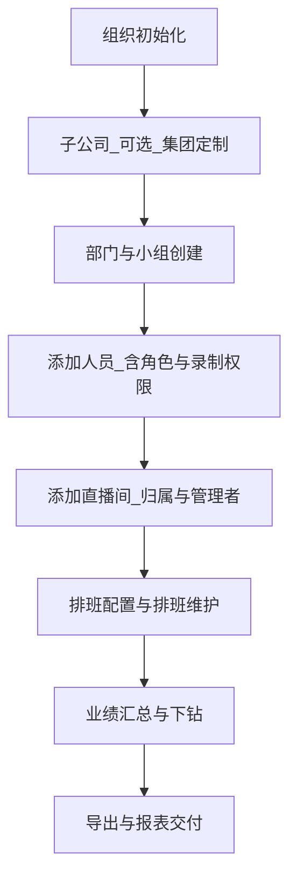

# PRD｜爱复盘企业管理后台（人员 + 排班 + 业绩 + 商品）

## 1. 背景与目标

### 1.1 背景

企业级客户存在多层级组织协作、高频排班、多维度业绩考核及规模化管理需求。现有数据分散在不同系统/端，组织架构与人员权限不清晰，排班依赖人工沟通，业绩数据难以追溯与下钻。

### 1.2 产品目标

- 提供「人员-排班-业绩」全链路一体化后台工具，覆盖组织架构、人员档案、直播间、排班、业绩看板与导出。
- 支持多层级组织（子公司/部门/小组）视角的人员管理与数据聚合。
- 支持排班高效化：批量排班、冲突检测、缺排提醒、周/月视图。
- 支持业绩数据化：直播间业绩、人员业绩、公司业绩罗盘、商品排行榜。

### 1.3 不做什么（非目标）

- 不包含招聘、面试审批、异动申请等 HR 流程（原文中已划线）。
- 不输出原型图（输出原型模型 code 数据）。
- 不要求与任意三方平台的全量授权打通，仅以需求中提到的巨量百应/视频号后台为数据来源。

## 2. 目标用户与角色

### 2.1 角色画像

- 主账号/超级管理者：全局配置、所有模块与数据可见。
- 子公司管理者：仅可查看/管理负责子公司的模块数据（以配置的组织归属为准）。
- 部门管理者：仅可查看/管理负责部门的数据（可兼多个部门）。
- 小组管理者：仅可查看/管理负责小组的数据（可兼多个小组/部门）。
- 直播间管理者：可查看/管理负责直播间的排班与直播间相关数据。
- 普通员工（主播/运营等）：仅可查看个人排班、个人业绩、个人信息并维护资料。

### 2.2 角色分配规则

- 当组织（子公司/部门/小组/直播间）选择管理者时，只能从更高级级别的管理者账号中选择。
- 超级管理者仅允许「爱复盘子账号」成为超级管理者。

## 3. 范围与信息架构（菜单）

### 3.1 全局框架（后台壳）

- 顶部：公司 Logo、登录信息、切换账号、帮助文档入口（可配置）。
- 左侧菜单：最高两级，默认全部展开；一级可配置直达链接；支持收起/展开；选中态高亮。
- 面包屑：一级菜单-二级菜单-功能点，二级标题可跳转。
- 菜单可在后台维护（后续可编辑调整）。

### 3.2 菜单规划（以需求文档为准）

- 我的排班和业绩
  - 个人排班
  - 个人业绩
  - 个人信息
- 业绩汇总
  - 公司业绩罗盘
  - 直播间列表（业绩）
  - 按不同组织查看
- 商品排行榜
- 直播间排班
- 直播间业绩
- 人员业绩和排班
  - 人员业绩
  - 人员排班
- 部门和人员
  - 人员（Tab）
  - 直播间（Tab）
  - 小组和部门（Tab）
  - 子公司（Tab）
  - 岗位（Tab）

## 4. 核心业务模块概览

### 4.1 组织与人员

- 组织层级：子公司（可选，集团/定制）→ 部门（必选，默认部门）→ 小组（可选，默认小组）→ 人员（必选）→ 直播间（必选）。
- 人员档案：头像、昵称/姓名、手机号、邮箱、岗位、工号、类型（全/兼职）、所属组织、角色权限、录制权限、账号类型（爱复盘录制/非录制）。
- 会员套餐限制：企业版 30 人/1 子公司；旗舰版 50 人/1 子公司；集团/定制 120 人/不限子公司。
- 子账号增购价格（按版本）：工作室 960；企业 480；旗舰 360；集团及以上 180。

### 4.2 直播间管理

- 数据来源：租户内所有自有账号直播间汇总到列表。
- 直播间基础信息：平台、账号 ID、行业三级级联、首播日期、归属组织、管理者、监控账号、授权状态。
- 初始化：客户端新增直播间同步基础信息与行业；归属组织需后台维护。

### 4.3 排班（个人/直播间）

- 个人排班：日历/周视图、24 小时横轴、按周/月切换；支持查看直播间当日排班。
- 直播间排班：租户共享排班表；横轴 0-23；纵轴自然周日期；角色区分（主播/助播/场控）；支持新增/编辑/批量；冲突检测。
- 首次排班配置：直播间时间轴规则、班次时长、粒度、是否休息、岗位配置；支持复制其他直播间配置。

### 4.4 业绩

- 个人业绩：T+1/过程数据 + 个人修正（按需求描述）；趋势图（漏斗/指标切换）；明细表支持导出。
- 直播间业绩：列表（今日/昨日/本周/本月等区间汇总）；详情页（概览、趋势、明细导出）。
- 场次：按日汇总与明细（支持录入/编辑/截图上传；净销售、ROI 计算）。
- 人员业绩：按成员统计（依赖智能细分 + 上传云空间的场次）。
- 公司业绩罗盘：公司/子公司/部门/小组/直播间维度汇总与下钻。

### 4.5 商品排行榜

- 数据来源：巨量百应直播大屏基础版（T+1）。
- 权限：超管/集团/部门负责人等；部门负责人仅能看本部门数据（按组织归属）。
- 指标字段：销量/退单、销售/退款、曝光点击率、点击付款率、曝光成交率、千次成交、关联直播间/场次。

## 5. 数据来源与口径（摘要）

### 5.1 数据来源

- 直播间数据：巨量百应（抖音等）与视频号后台；月业绩以当月汇总口径拉取。
- 分段/过程数据：巨量百应过程数据。
- 个人业绩：过程数据 + 个人修正；人员业绩统计依赖“智能细分+上传云空间”。

### 5.2 统计口径

- 集团/子公司/部门/小组/直播间：来自授权平台汇总数据（不依赖单场数据）。
- 个人总业绩：录制 + 上传后统计。
- 跨天/跨多天直播的昨日口径：优先取昨日录制场次汇总；8 点进行数据修正（按原文规则）。

## 6. 权限与版本策略

- 菜单/页面基于角色配置；不同角色可配置默认菜单。
- 导出权限（直播间数据详情/业绩汇总）：企业版不可导出；旗舰/集团/定制可导出。
- 人员/子公司数量限制与提示策略（达到上限时拦截新增并引导扩容）。

## 7. 关键业务流程（概览）

- 组织初始化：创建子公司（可选）→ 创建部门/小组 → 添加人员 → 添加直播间并配置管理者/业绩统计账号。
- 排班：直播间首次配置时间轴 → 周视图新增/批量新增排班 → 冲突处理 → 个人/直播间视角查看。
- 业绩：授权/上传 → 直播间/人员/公司维度汇总 → 下钻详情 → 导出。

### 7.1 业务流程图（Mermaid）

更多细分流程见：[关键流程图.md](file:///c:/Users/JYJY/Desktop/用户管理端需求分析/测试版-爱复盘管理工具需求拆分/06-脑图-流程/02-流程/关键流程图.md)

### 7.2 关键用例（研发无歧义版）

#### UC-01 添加人员（含账号归属判定）

- 参与者：超级管理者
- 前置条件：未超过套餐人数上限；短信服务可用
- 主流程：
  1. 输入姓名/手机号/验证码/岗位/类型（全职或兼职）等信息
  2. 选择组织归属（可为空）
  3. 选择角色与负责范围（部门/小组/直播间）
  4. 选择录制权限（开启/不开启）
  5. 提交保存
- 后置条件：人员出现在人员列表；剩余配额更新
- 异常与边界：
  - 人数已满：阻止提交并提示扩容
  - 手机号已注册且非本租户：要求短信认证加入或提示处理方式
  - 开启录制但无可绑定额度：阻止并引导扩容

#### UC-02 新建直播间（含账号 ID 校验）

- 参与者：超级管理者
- 前置条件：账号 ID 可创建；平台授权状态可获取
- 主流程：选择平台→填写账号 ID→选择行业→选择归属组织→选择管理者→提交
- 异常：
  - 账号 ID 已存在：提示不可重复创建
  - 账号 ID 不存在：提示原因与处理路径

#### UC-03 直播间首次排班配置

- 参与者：直播间管理者/超级管理者
- 主流程：选择直播间→复制已有配置（可选）→配置时间轴/班次/休息/岗位→保存
- 异常：时间配置非法、岗位为空、保存失败重试

#### UC-04 新增/批量新增排班（含冲突）

- 参与者：直播间管理者/组织管理者
- 主流程：选择日期与时间段→选择人员与角色类型→选择重复周几与结束日期→提交→冲突检测→创建
- 异常：
  - 人员跨直播间冲突：提示并阻止或引导调整（策略以 FRD 为准）
  - 同直播间时间冲突：提示并阻止
  - 批量部分冲突：冲突日期失败，其余成功

#### UC-05 场次数据录入与修正（含截图与归属确认）

- 参与者：超级管理者/被授权管理者
- 主流程：进入场次明细→录入指标与截图→系统计算净销售与 ROI→选择业绩归属人员→二次确认→提交
- 异常：截图缺失、投放=0 的 ROI 展示规则、提交失败回滚

#### UC-06 导出报表（按版本限制）

- 参与者：有权限的管理者
- 主流程：选择日期区间→点击导出→生成文件→下载
- 异常：企业版导出拦截提示；无数据提示；导出失败重试

## 8. 交互细节（页面路径、字段限制、前后端判定）

说明：本 PRD 提供“无歧义摘要”，详细字段与校验见 FRD 与前端文档。

### 8.1 页面路径（路由摘要）

路由清单见：[菜单与路由.md](file:///c:/Users/JYJY/Desktop/用户管理端需求分析/测试版-爱复盘管理工具需求拆分/05-前端/01-菜单与路由/菜单与路由.md)

### 8.2 字段限制与校验摘要

表单校验规则见：[表单校验规则.md](file:///c:/Users/JYJY/Desktop/用户管理端需求分析/测试版-爱复盘管理工具需求拆分/05-前端/06-表单校验/表单校验规则.md)

### 8.3 前端与后端逻辑判定摘要

- 权限判定：前端按角色与数据范围控制可见与入口；后端为最终裁决并返回无权限错误
- 套餐上限：前端展示剩余配额；后端在创建/提交时二次校验并返回上限错误
- 排班冲突：前端提示冲突结果；后端在写入时进行并发冲突检测并返回冲突明细
- 导出权限：前端按钮按版本隐藏/禁用；后端在导出接口再次校验版本并返回拦截原因

## 9. 非功能需求（NFR）

### 9.1 性能与容量（建议指标）

- 列表查询（人员/直播间/业绩）：首屏接口 P95 < 2s（在 10k 级数据量与常用筛选条件下）
- 排班详情渲染：单直播间周视图渲染 < 1.5s（含 7 天×24 小时×3 角色的网格）
- 导出任务：异步生成，提供进度/结果；失败可重试

### 9.2 数据埋点（产品分析）

- 登录/切换账号
- 人员新增/编辑/删除/重置密码
- 直播间新增/编辑/删除
- 首次排班配置保存
- 排班新增/编辑/批量新增（含冲突发生）
- 场次录入/编辑/删除
- 导出触发/导出成功/导出失败

### 9.3 兼容性与可用性

- 浏览器：Chrome/Edge（现代版本）；移动端不作为主要适配目标
- 分辨率：1366×768 以上可完整使用，低分辨率支持滚动与自适应
- 时区与时间格式：统一使用北京时间；日期格式 YYYY-MM-DD；时间 HH:mm

### 9.4 安全与审计（建议）

- 权限越权：后端必须校验数据范围
- 关键操作审计：人员删除、直播间删除、排班修改、场次修正、导出等需记录审计日志

## 10. 术语表

## 8. 术语表

- 自有直播间：在客户端录制并标记为“自有”的直播间。
- 监控账号：用于录制该直播间的爱复盘子账号（可多个）。
- 业绩统计账号：用于拉取/归集某直播间业绩的账号（可配置）。
