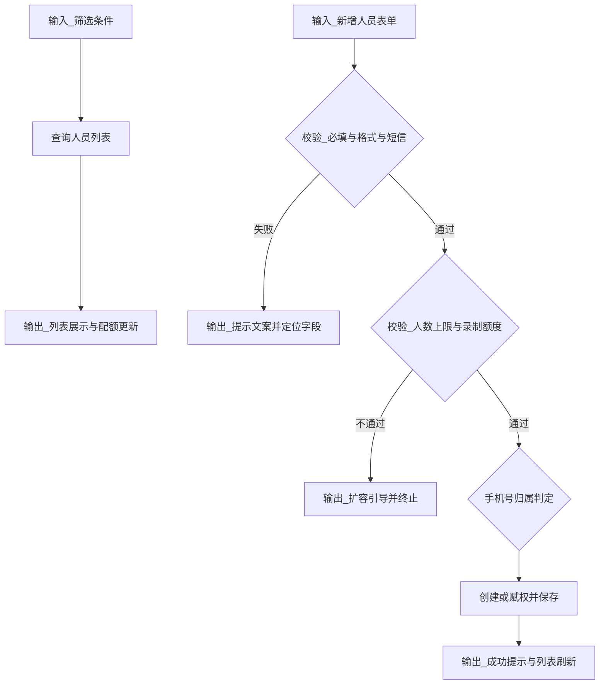
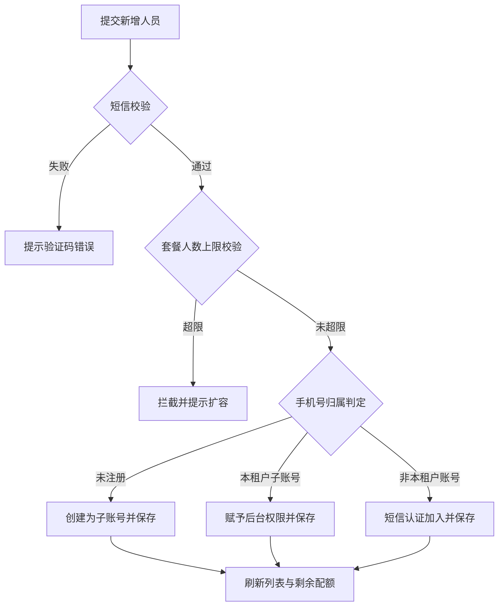
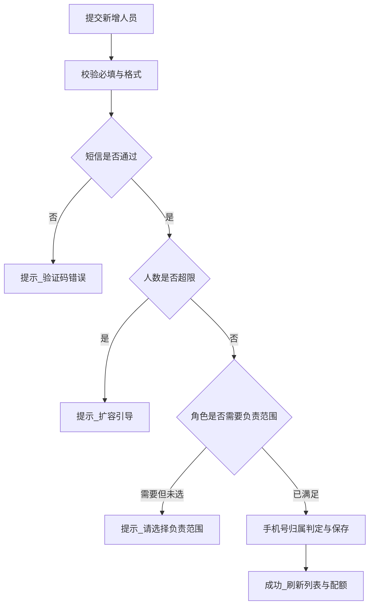

# FRD｜部门和人员-人员（Tab）

## 1. 页面定位

管理员在此管理机构下人员：查询、查看列表、添加、编辑、删除、重置密码，并管理人员的组织归属、角色与录制权限。

## 2. 用户与权限

- 权限：超级管理员（原文）。

## 3. 筛选区

- 所属公司（下拉/级联）
- 所属部门（下拉/级联）
- 所属小组（下拉/级联）
- 岗位（下拉）
- 姓名（输入框，模糊匹配）
- 手机号码（输入框）

## 4. 列表区

### 4.1 顶部提示

- 可添加人员数量：剩余/总（由套餐限制与当前人数计算）

### 4.2 列表字段

- 编号
- 头像
- 姓名
- 手机号码
- 所属部门：公司-部门-小组
- 工号
- 类型：全职/兼职
- 岗位：主播/助播等
- 所属角色：超级管理员/其他角色
- 邮箱
- 账号类型：是否爱复盘账号（或 爱复盘录制/非录制，需统一口径）
- 操作：编辑 / 删除 / 重置密码（可选）

## 5. 添加人员（表单）

### 5.1 表单字段

- 姓名：必填
- 岗位：必选（下拉）
- 头像：必填（上传）
- 手机号码：必填（短信验证码）
- 所属部门：公司-部门-小组（可为空，可不属于任何组织）
- 工号：文本
- 类型：全职/兼职（单选）
- 所属角色：单选（超级管理者/部门管理者/小组管理者/直播间管理者等）
- 邮箱：输入，需校验
- 账号类型：爱复盘录制/非录制
- 选择直播间：可选（部门/小组/直播间）

### 5.2 管理权限配置

若选择：

- 部门管理者：勾选负责部门（多选）
- 小组管理者：勾选负责小组（多选）
- 直播间管理者：勾选负责直播间（多选）
- 超级管理者：提示“拥有和主账号一样的权限”

### 5.3 录制权限配置

选项：不开启 / 开启

- 开启时提示：占用子账号权限，展示已绑定与可绑定数量
- 可绑定数量=0：引导扩容
- 不开启：客户端登录拦截提示文案（产品提供）

### 5.4 提交校验

提交前校验：

- 人数是否已满（满则阻止并提示）
- 手机号归属判断：
  - 未注册：创建子账号
  - 本租户子账号：赋予后台权限
  - 非本租户爱复盘账号：短信认证加入（提示风险与规则）

## 6. 重置密码

- 入口：列表操作
- 二次确认：建议增加
- 默认密码文案：由产品配置（不在前端固定写死）

## 7. 删除人员

- 入口：列表操作
- 二次确认：必须
- 约束：
  - 若人员担任任何组织管理者：需先更换管理者或自动解除（策略明确后验收）
  - 若某组织仅一个管理者：禁止删除并提示“XX组织需更换管理者才允许删除”

## 8. 状态与异常

- 空列表：提示“暂无人员，请添加”
- 短信校验失败：提示并允许重发验证码
- 邮箱校验失败：提示格式错误
- 并发冲突：提交时人数达到上限 → 返回错误并刷新剩余/总

## 9. 验收标准（节选）

- 筛选条件生效且与列表字段一致。
- 添加人员时所有必填校验与短信校验生效。
- 删除管理者账号时按规则拦截并给出明确提示。

## 10. 输入输出（I/O，中文描述）

### 10.1 输入

- 页面路径：部门和人员-人员Tab
- 查询输入（筛选条件）：
  - 所属公司/部门/小组（级联）
  - 岗位
  - 姓名（模糊匹配）
  - 手机号码
  - 分页参数（页码、每页条数）
- 新增/编辑表单输入：
  - 基础信息：姓名、头像、手机号+短信验证码、邮箱、工号、类型、岗位
  - 组织归属：公司/部门/小组（可为空）
  - 角色与负责范围：部门/小组/直播间范围（按角色要求必选）
  - 录制权限：开启/不开启（开启需占用额度）

### 10.2 输出

- 页面展示输出：
  - 人员列表与字段（头像、姓名、手机号、组织、岗位、角色等）
  - 顶部配额提示（剩余/总）
- 业务结果输出：
  - 新增/编辑/删除/重置密码成功提示
  - 删除拦截提示（唯一管理者等）
  - 录制权限额度不足提示与扩容引导

### 10.3 输入→处理→输出逻辑图（code）

## 11. 异常流程（场景与提示文案）

异常场景表：| 场景 | 触发条件 | 用户提示文案 | 前端处理与回退 | 后端处理要点 | |------|---------|-------------|---------------|-------------| | 短信验证码错误 | 验证码错误/过期/次数超限 | 验证码错误，请重试 | 允许重新发送验证码并重试 | 返回可重试原因与限制 | | 人数达到上限 | 套餐人数已满 | 人员数量已达上限，请扩容后继续 | 阻止提交并引导扩容 | 二次校验并返回限制信息 | | 手机号不可加入 | 手机号已绑定其他机构且策略不允许 | 该手机号暂无法加入，请联系客服处理 | 提示并终止提交 | 返回冲突原因与处理建议 | | 删除唯一管理者 | 该人员为某组织唯一管理者 | 该人员为唯一管理者，请先更换管理者 | 阻止删除并定位组织 | 校验组织管理者数量 | | 无权限操作 | 非超级管理员或不在范围 | 无权限操作 | 隐藏入口或提示并返回 | 权限与数据范围校验 |

## 12. 数据结构（中文字段说明）

核心实体：人员 | 字段中文名 | 类型 | 必填 | 示例 | 说明 | |----------|------|------|------|------| | 姓名 | 字符串 | 是 | 张三 | 人员姓名 | | 头像 | 字符串 | 否 | https://... | 头像地址 | | 手机号 | 字符串 | 是 | 13800000000 | 作为账号主标识之一 | | 邮箱 | 字符串 | 否 | a@b.com | 需要格式校验 | | 工号 | 字符串 | 否 | NO001 | 企业内部编号 | | 类型 | 枚举 | 是 | 全职 | 全职/兼职 | | 岗位 | 字符串 | 否 | 主播 | 岗位引用 | | 角色 | 字符串 | 是 | 管理员 | 角色引用 | | 负责范围 | 对象 | 否 | - | 部门/小组/直播间范围集合 | | 录制权限 | 枚举 | 是 | 开启 | 开启/不开启 |

## 13. 算法与逻辑判定（流程图或状态图）

规则说明：

- 负责范围必选：部门/小组/直播间管理者必须选择至少一个对应范围。
- 删除人员约束：若该人员为任何组织唯一管理者，则不允许删除，需先更换管理者。
