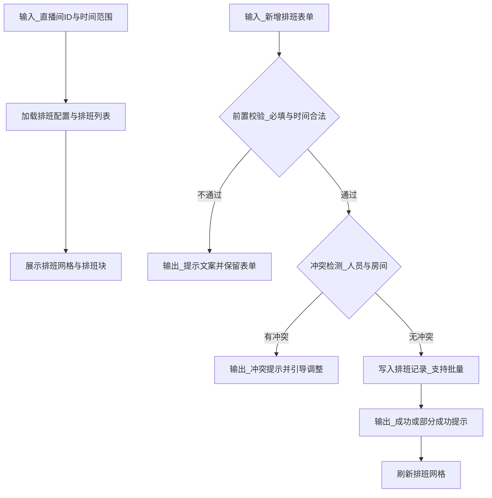
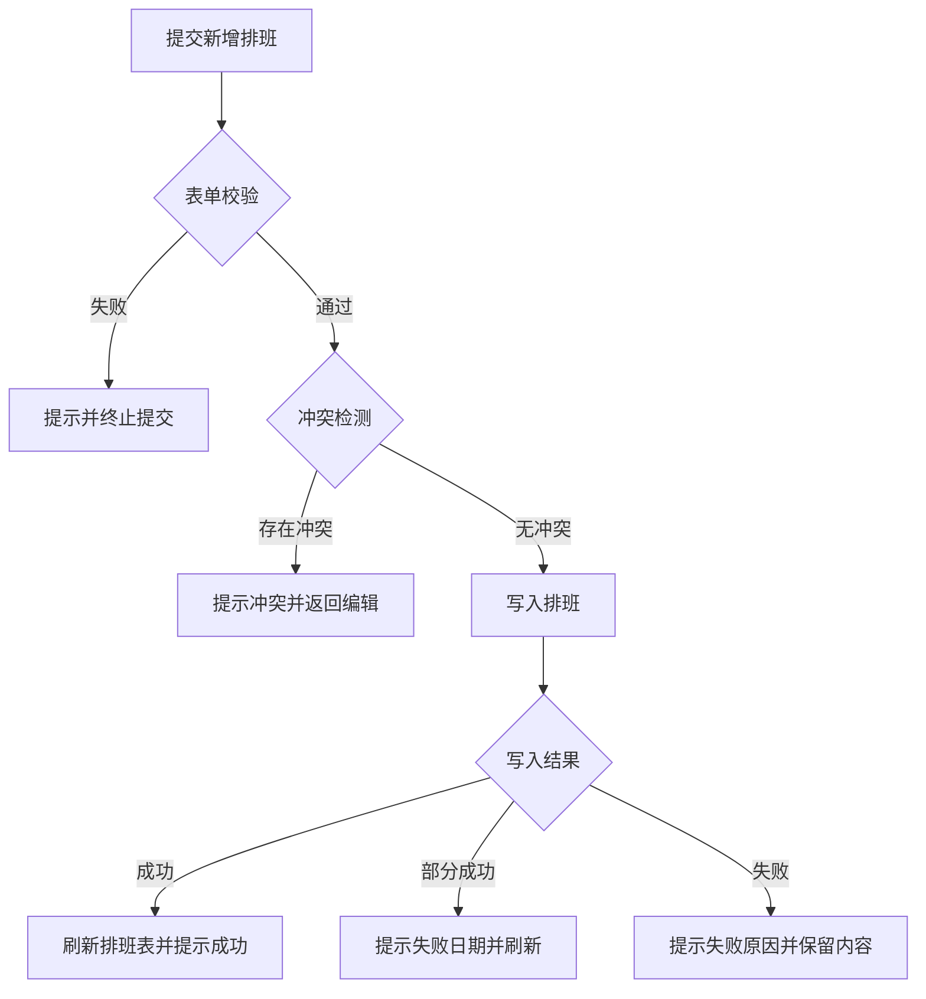
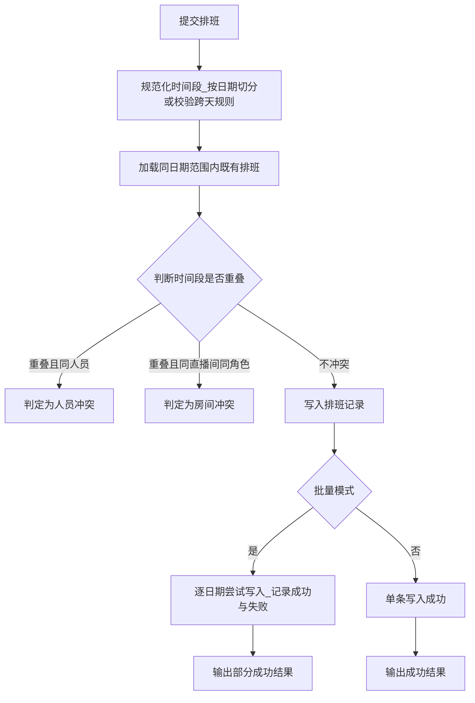

# FRD｜直播间排班详情

## 1. 页面定位

对单个直播间进行排班查看与编辑。排班表为租户共享能力（挂在主账号），子账号可查看，管理号可生成与编辑。

## 2. 用户与权限

- 可查看：子账号、管理号（按角色与直播间范围）。
- 可编辑：主账号、超级管理者、组织管理者、直播间管理者（最终以权限配置为准）。

## 3. 基础信息区

- 直播间头像、昵称
- 平台
- 所属组织
- 管理者

## 4. 时间范围与历史

- 默认展示：当前自然周（周一-周日）
- 切换：下周 / 本月 / 下月
- 历史：支持查看历史排班（一年内）

## 5. 排班表（主区域）

### 5.1 结构

- 横轴：0:00-23:00；按屏幕宽度展示；未展示部分支持左右拖动
- 纵轴：日期（周一-周日）
  - 已过：灰色
  - 今日：紫色
  - 未到：黑色
- 每个日期展示 3 种角色排班：主播/助播/场控

### 5.2 排班块状态视觉

- 已结束：深色底白字
- 未排班：浅绿底深绿字
- 未开始：紫底白字

## 6. 新增排班

### 6.1 触发入口

点击未排班区域 → 打开新增排班弹窗/抽屉。

### 6.2 表单字段

- 日期（默认当前格对应日期）
- 时间段（默认开始/结束来自“场次模块”；支持拖拽或手动修改）
- 重复：周一到周日多选
- 排班结束日期：必填，最大 30 天
- 类型：主播/助播/场控（固定不可改）
- 人员：输入检索选择

### 6.3 冲突检测

提交时校验：

- 人员冲突：同时间段在其他直播间已有排班 → 提示冲突
- 房间冲突：同直播间同时间段已有排班 → 提示冲突
- 并发冲突：同一时间段他人刚新增 → 提示冲突并刷新批量新增：
- 某日冲突则该日期创建失败，其他日期正常创建

## 7. 查看/编辑排班

- 点击排班块打开详情
- 支持修改排班内容（时间段/人员等）
- 保存成功 toast；失败提示原因

## 8. 状态与异常

- 空状态：无排班 → 显示“未排班”提示与引导新增
- 权限不足：隐藏编辑入口或提示无权限

## 9. 输入输出（I/O，中文描述）

### 9.1 输入

- 页面路径：直播间排班详情页
- 路由参数：直播间ID
- 时间范围输入：本周/下周/本月/下月/历史（一年内）
- 新增排班表单输入：
  - 日期
  - 开始时间与结束时间
  - 角色类型（主播/助播/场控，固定）
  - 人员（必选）
  - 重复周几（可选）
  - 排班结束日期（必填，最长30天）

### 9.2 输出

- 页面展示输出：
  - 排班网格（日期×小时×角色）
  - 排班块（直播间、人员、时间段、状态色）
- 业务结果输出：
  - 新增/编辑成功提示
  - 批量新增结果提示（成功日期、失败日期及原因）
  - 冲突提示（定位到冲突日期/时间段）

### 9.3 输入→处理→输出逻辑图（code）

## 10. 异常流程（场景与提示文案）

异常场景表：| 场景 | 触发条件 | 用户提示文案 | 前端处理与回退 | 后端处理要点 | |------|---------|-------------|---------------|-------------| | 无权限编辑排班 | 当前账号无编辑权限或不在负责范围 | 无权限操作当前直播间排班 | 隐藏/禁用编辑入口；提交时提示并退出 | 校验角色与数据范围 | | 时间段不合法 | 开始时间≥结束时间或跨天规则不允许 | 请选择正确的时间段 | 高亮字段并阻止提交 | 返回字段级校验信息 | | 人员冲突 | 同一人员在其他直播间同时间段已有排班 | 该人员在所选时间段已有排班，请调整 | 定位到冲突信息；保留表单 | 返回冲突明细（人员/时间段） | | 房间冲突 | 同直播间同时间段已有排班 | 该时间段已有排班，请调整 | 定位冲突日期；保留表单 | 返回冲突明细（房间/时间段） | | 并发冲突 | 同一时间段他人先提交成功 | 排班已更新，请刷新后重试 | 提示刷新并重试提交 | 并发控制与冲突返回 | | 批量部分失败 | 批量创建中部分日期冲突或写入失败 | 部分日期创建失败，已为其余日期创建成功 | 展示失败日期清单与原因 | 返回 created 与 failed 列表 | | 服务异常 | 网络或服务错误 | 服务繁忙，请稍后重试 | 保留表单；允许重试 | 返回通用错误信息 |

## 11. 数据结构（中文字段说明）

核心实体：排班记录 | 字段中文名 | 类型 | 必填 | 示例 | 说明 | |----------|------|------|------|------| | 日期 | 日期 | 是 | 2026-03-23 | 排班所属自然日 | | 开始时间 | 日期时间 | 是 | 2026-03-23 18:30 | 排班开始时间 | | 结束时间 | 日期时间 | 是 | 2026-03-23 22:00 | 排班结束时间 | | 角色类型 | 枚举 | 是 | 主播 | 主播/助播/场控 | | 人员姓名 | 字符串 | 是 | 张三 | 被排班人员 |

核心结构：冲突信息 | 字段中文名 | 类型 | 必填 | 示例 | 说明 | |----------|------|------|------|------| | 冲突类型 | 枚举 | 是 | 人员冲突 | 人员冲突/房间冲突/并发冲突 | | 冲突日期 | 日期 | 是 | 2026-03-26 | 冲突发生日期 | | 冲突时间段 | 字符串 | 是 | 18:30-22:00 | 冲突时间段描述 | | 冲突说明 | 字符串 | 是 | 时间段冲突 | 给用户展示的原因 |

## 12. 算法与计算逻辑（流程图或状态图）

规则说明：

- 时间重叠判定：两个时间段只要存在交集即视为重叠。
- 批量新增策略：某日期冲突则该日期失败，其余日期照常创建并汇总结果提示。
