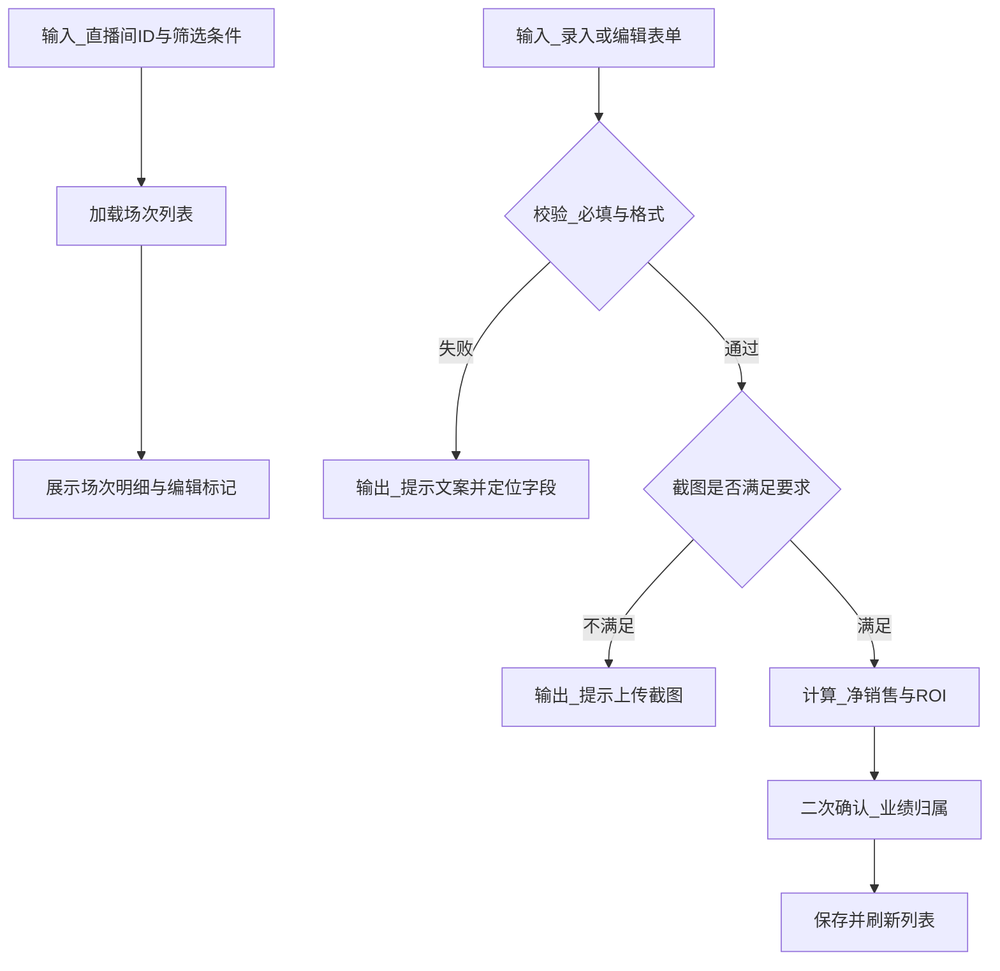
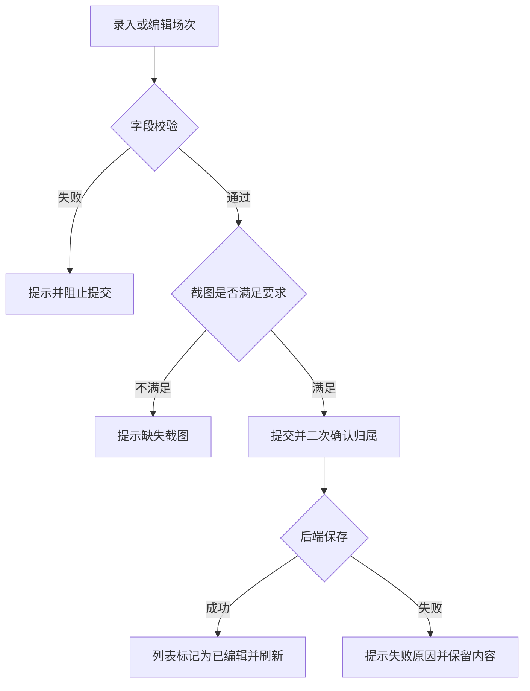
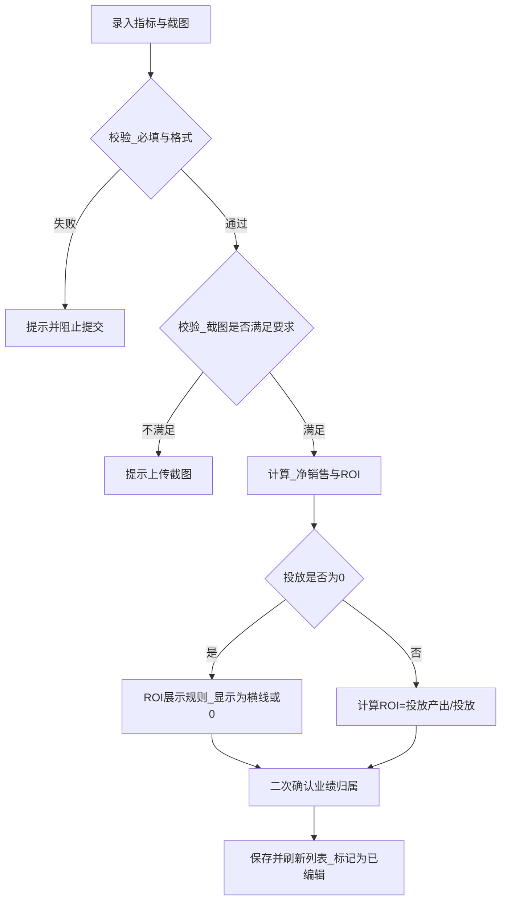

# FRD｜直播场次明细（录入/编辑）

## 1. 页面定位

展示某直播间的场次级明细，并允许对每条场次数据进行录入、编辑、删除；编辑过的数据标记为绿色，形成独立可追溯表。

## 2. 用户与权限

- 查看：同直播间范围权限
- 编辑/录入/删除：主账号、超级管理者、被授权的管理者

## 3. 筛选区

- 时间段
- 主播（选择成员）

## 4. 列表字段

- 日期
- 直播时间（不可编辑）
- 人员（成员 + 直播角色）
- 指标：场观、销售、退款、净销售、投放、投放 ROI
- 数据来源：系统录入/人员录入/系统采集（以产品定义为准）
- 操作：编辑 / 删除

## 5. 录入/编辑弹窗

### 5.1 不可修改字段

- 日期
- 直播时间

### 5.2 可编辑字段

- 人员：选择成员与直播角色
- 场观：文本 + 截图上传
- 销售：文本 + 截图
- 退款：文本 + 截图
- 净销售：自动计算 = 销售 - 退款
- 投放：文本 + 截图
- 投放产出：文本 + 截图
- 投放 ROI：自动计算 = 投放产出 / 投放

### 5.3 截图规则

根据直播间类型：

- 日不落/特殊：弹出 1 张或 2 张截图要求
- 未配置类型：默认 2 张截图弹窗

### 5.4 提交确认

提交前二次确认提示：“本次业绩统计为 主播：XXX（默认勾选） 副播：XXX（默认勾选） 中控：XXX（默认不勾选） 的业绩，确认提交”

## 6. 删除

- 二次确认必需

## 7. 状态与异常

- ROI 除数为 0：展示为 0 或 “-”，并提示规则
- 上传失败：提示重试

## 8. 输入输出（I/O，中文描述）

### 8.1 输入

- 页面路径：直播场次明细页
- 路由参数：直播间ID
- 查询输入：
  - 时间段（开始日期-结束日期）
  - 主播筛选（可选）
- 录入/编辑表单输入：
  - 参与人员与角色（主播/副播/中控等）
  - 指标输入（场观、销售、退款、投放、投放产出）
  - 截图证据（按直播间类型要求1或2张）
  - 业绩归属勾选（主播/副播默认勾选，中控默认不勾选）

### 8.2 输出

- 页面展示输出：
  - 场次列表与明细字段
  - 已编辑标记（绿色）
- 业务结果输出：
  - 新增/编辑/删除成功提示
  - 自动计算字段：净销售、投放ROI
  - 归属确认结果（本次业绩计入哪些人员）

### 8.3 输入→处理→输出逻辑图（code）

## 9. 异常流程（场景与提示文案）

异常场景表：| 场景 | 触发条件 | 用户提示文案 | 前端处理与回退 | 后端处理要点 | |------|---------|-------------|---------------|-------------| | 字段校验失败 | 指标为空/非数字/超范围 | 请检查输入项并重新提交 | 定位到字段并阻止提交 | 返回字段级校验信息 | | 截图不足 | 未上传足够截图 | 请上传对应截图后再提交 | 阻止提交，保留已填内容 | 校验截图数量与类型 | | 无权限录入/编辑 | 非授权账号操作 | 无权限操作该直播间数据 | 隐藏入口或提示并返回 | 校验数据范围与角色权限 | | 并发修改冲突 | 同一场次被他人修改 | 数据已更新，请刷新后重试 | 提示刷新，保留草稿 | 并发控制并返回冲突信息 | | 上传失败 | 网络/存储异常 | 上传失败，请重试 | 允许重试上传 | 返回可重试原因 |

## 10. 数据结构（中文字段说明）

核心实体：场次记录 | 字段中文名 | 类型 | 必填 | 示例 | 说明 | |----------|------|------|------|------| | 开始时间 | 日期时间 | 是 | 2026-03-23 18:30 | 场次开始 | | 结束时间 | 日期时间 | 是 | 2026-03-23 22:00 | 场次结束 | | 参与人员 | 列表 | 是 | - | 参与人员与角色及是否计入业绩 | | 场观 | 数值 | 否 | 120000 | 指标值 | | 销售 | 金额 | 否 | 50000 | 指标值 | | 退款 | 金额 | 否 | 3000 | 指标值 | | 净销售 | 金额 | 否 | 47000 | 自动计算：销售-退款 | | 投放 | 金额 | 否 | 8000 | 指标值 | | 投放产出 | 金额 | 否 | 16000 | 指标值 | | 投放ROI | 数值 | 否 | 2.0 | 自动计算：投放产出/投放 | | 截图证据 | 列表 | 否 | - | 1或2张（按直播间类型） | | 是否被编辑 | 布尔 | 是 | true | 用于显示绿色标记 |

## 11. 算法与计算逻辑（流程图或状态图）

规则说明：

- 净销售计算：净销售=销售-退款（若出现负数，按产品口径处理为0或保留负值，需统一）。
- ROI计算：ROI=投放产出/投放；当投放=0时按统一规则展示（“-”或0）。
- 截图要求：按直播间类型要求1或2张，未满足则不允许提交。
