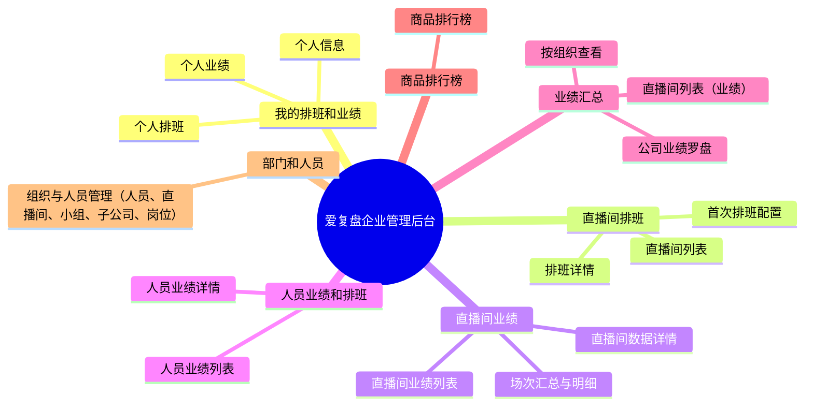

# 【爱复盘管理后台】交互设计文档（DRD）

## 1. 文档信息

- **文档ID**：DRD-20260324
- **所属项目**：爱复盘企业管理后台
- **关联PRD**：PRD-爱复盘企业管理后台-人员排班业绩
- **关联FRD**：03-FRD 目录下所有功能需求文档
- **版本号**：v1.1

## 2. 全局信息架构与导航

## 3. 页面交互详述（核心业务页面）

### 3.1 页面：直播间列表（排班）

#### 3.1.1 页面定位与跳转逻辑

- **页面定位**：查看公司所有直播间状态，进入具体直播间进行排班管理。
- **入口**：左侧菜单 -> 直播间排班 -> 直播间列表。
- **出口与承载方式**：
  - 点击“查看排班”：新开当前页跳转至【排班详情】页面。
  - 点击“首次配置”：新开当前页跳转至【首次排班配置】页面。

#### 3.1.2 页面区域草图式结构表

| 区域名称 | 区域位置 | 包含元素/组件 | 交互动作与状态说明 |
| --- | --- | --- | --- |
| 顶部筛选区 | 页面上方 | 搜索框（直播间名称）、状态下拉框、查询/重置按钮 | 点击查询刷新列表数据；回车触发查询；无数据时显示骨架屏 |
| 数据列表区 | 页面中部 | 表格（直播间名称、负责人、状态）、操作列（查看排班/配置） | 悬浮高亮当前行；无排班配置的显示“首次配置”，有配置的显示“查看排班” |
| 分页区 | 页面底部 | 标准分页组件 | 切换页码触发数据加载，支持选择每页条数 |

#### 3.1.3 页面状态定义

- **加载中**：列表区域显示表格骨架屏。
- **空数据**：显示空状态插画及文案“暂无直播间数据”。
- **异常/报错**：网络错误显示重试按钮。
- **无权限**：全局无权限页面提示及返回首页按钮。

---

### 3.2 页面：排班详情

#### 3.1.1 页面定位与跳转逻辑

- **页面定位**：管理和查看指定直播间的具体排班日历与班次人员。
- **入口**：【直播间列表】点击“查看排班”。
- **出口与承载方式**：
  - 点击“返回”：返回至【直播间列表】页面。
  - 点击“添加排班”：右侧滑出抽屉，进行班次和人员选择。
  - 点击“编辑规则”：弹窗显示排班规则表单。

#### 3.1.2 页面区域草图式结构表

| 区域名称 | 区域位置 | 包含元素/组件 | 交互动作与状态说明 |
| --- | --- | --- | --- |
| 头部信息区 | 页面上方 | 返回图标、直播间名称、当前排班周期切换（周/月）、编辑规则按钮 | 点击返回上级；切换周期刷新日历视图 |
| 排班日历区 | 页面中部 | 日历组件、班次卡片、人员头像堆叠 | 点击日期单元格或班次卡片触发右侧抽屉查看/编辑排班明细 |
| 快捷操作区 | 页面右下角 | 悬浮按钮（快速添加排班） | 点击滑出新增排班抽屉 |

#### 3.1.3 页面状态定义

- **加载中**：日历区域显示局部 Loading 图标。
- **空数据**：当前周期无排班时，日历单元格空白，显示“点击添加”虚线框。
- **异常/报错**：保存排班失败时，顶部弹出 Toast 提示。
- **无权限**：无排班编辑权限时，隐藏编辑规则和添加按钮，仅供查看。

---

### 3.3 页面：直播间业绩列表

#### 3.3.1 页面定位与跳转逻辑

- **页面定位**：查看所有直播间的业绩指标总览。
- **入口**：左侧菜单 -> 直播间业绩 -> 直播间业绩列表。
- **出口与承载方式**：
  - 点击“查看详情”：跳转至【直播间数据详情】页面。

#### 3.3.2 页面区域草图式结构表

| 区域名称 | 区域位置 | 包含元素/组件 | 交互动作与状态说明 |
| --- | --- | --- | --- |
| 顶部筛选区 | 页面上方 | 日期选择器（昨日/近7天/自定义）、组织架构级联选择、查询按钮 | 日期变更即时触发列表数据刷新 |
| 核心指标卡 | 页面中上 | 场观、销售额、退款率等 6 个核心指标卡片 | 骨架屏加载；卡片带数据趋势（同比/环比箭头） |
| 数据列表区 | 页面中部 | 数据表格、支持表头字段排序 | 点击表头字段排序图标进行升降序切换 |

#### 3.3.3 页面状态定义

- **加载中**：指标卡和列表同时展示骨架屏。
- **空数据**：列表区显示“暂无业绩数据”插画。
- **异常/报错**：接口请求失败时显示“数据加载失败，点击重试”。
- **无权限**：若无该组织架构数据权限，列表直接置空并提示无数据权限。

---

### 3.4 页面：个人业绩

#### 3.4.1 页面定位与跳转逻辑

- **页面定位**：员工查看自己参与直播的个人业绩表现与提成。
- **入口**：左侧菜单 -> 我的排班和业绩 -> 个人业绩。
- **出口与承载方式**：
  - 本页面为终点页，无向下钻取的出口。

#### 3.4.2 页面区域草图式结构表

| 区域名称   | 区域位置 | 包含元素/组件                          | 交互动作与状态说明                      |
| ---------- | -------- | -------------------------------------- | --------------------------------------- |
| 顶部筛选区 | 页面上方 | 日期选择器（默认当月）                 | 切换月份刷新页面数据                    |
| 个人指标区 | 页面上方 | 个人销售额、有效时长、预计提成等指标卡 | 带有悬浮问号（Tooltip）说明数据统计口径 |
| 趋势图表区 | 页面中部 | 柱状图/折线图组件                      | 悬浮图表节点显示该日期的具体数据详情    |
| 场次明细区 | 页面底部 | 列表表格                               | 滚动分页加载或标准底部分页              |

#### 3.4.3 页面状态定义

- **加载中**：图表区域显示 Loading 动画，表格骨架屏。
- **空数据**：当前月份无排班业绩时，显示“本月暂无业绩数据”。
- **异常/报错**：图表区和列表区分别处理异常，局部显示重试按钮。

## 4. 全局交互与组件规范

### 4.1 组件复用清单

| 组件名称 | 应用场景 | 交互说明 |
| --- | --- | --- |
| **标准数据表格** | 所有列表页、明细页 | 支持列宽拖拽、表头固定、悬浮操作列、分页联动。 |
| **统一筛选面板** | 列表页顶部 | 支持多条件组合，提供“展开/收起高级筛选”功能，回车键触发查询，重置清空所有条件至默认态。 |
| **确认操作弹窗** | 删除、作废、覆盖等二次确认 | 居中显示、包含警告图标、半透明遮罩背景、防抖防暴击（点击后按钮 loading 态）。 |
| **侧边抽屉** | 新增/编辑排班、查看场次明细 | 从右侧滑出，带半透明遮罩，点击遮罩不关闭（需点击明确的取消/关闭按钮）。 |
| **指标卡组件** | 详情页、个人页顶部 | 统一的数据展示结构：标题、主数值、同比/环比趋势标识、统计口径 Tooltip。 |

### 4.2 统一文案库

| 场景           | 标准文案                                 | 交互表现                                          |
| -------------- | ---------------------------------------- | ------------------------------------------------- |
| **操作成功**   | {操作名}成功，例如“排班保存成功”         | 页面顶部 Toast 提示，停留 2s（绿色图标）          |
| **操作失败**   | {操作名}失败，请稍后重试                 | 页面顶部 Toast 提示，包含具体失败原因（红色图标） |
| **删除确认**   | 确定要删除该{数据项}吗？删除后无法恢复。 | 弹窗正文文案，默认焦点在“取消”按钮                |
| **空状态**     | 暂无相关数据 / 暂无记录                  | 列表或区块无数据时居中显示，配统一空状态插画      |
| **无权限提示** | 抱歉，您暂无权限访问该页面或执行此操作   | 全局异常页或 Toast 提示                           |
| **网络异常**   | 网络不给力，请检查网络设置后重试         | 局部组件重试态或 Toast 提示                       |

### 4.3 动效与可用性规范

- **点击区域**：PC端最小点击区域应满足 32x32px，移动端/平板端应满足 44x44px。图标按钮必须有充足的 padding。
- **反馈时机**：
  - 按钮点击立即触发 Loading 态，防止连点（防抖）。
  - 表单提交操作完成后，按钮 Loading 自动收起，并在 0.5s 内完成页面跳转或抽屉关闭。
- **页面骨架屏**：首屏数据加载时，使用骨架屏（Skeleton）占位，减少用户等待焦虑，禁止出现页面高度坍塌或闪烁。
- **过渡动效**：
  - 弹窗淡入淡出（缓动时间 `0.2s ease-in-out`）。
  - 侧边抽屉从右向左滑出（缓动时间 `0.3s cubic-bezier(0.23, 1, 0.32, 1)`）。

## 5. 版本变更记录

| 版本 | 日期 | 变更实体 | 变更内容 | 变更人 |
| --- | --- | --- | --- | --- |
| v1.0 | 2026-03-24 | 所有 | 初始创建数据模型DRD | AI生成 |
| v1.1 | 2026-03-24 | 所有 | 按照“交互稿”标准进行重构，每个页面独立成节，补充草图式结构表、统一文案库和组件复用清单 | AI生成 |
