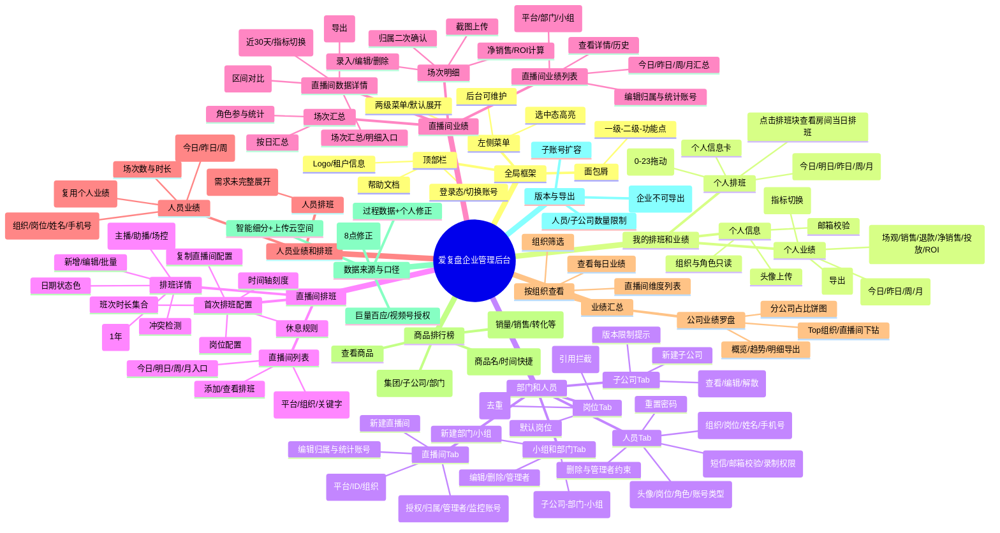

# 脑图｜爱复盘管理后台（菜单-页面-功能）

```mermaid
mindmap
  root((爱复盘企业管理后台))
    全局框架
      顶部栏
        Logo/租户信息
        登录态/切换账号
        帮助文档
      左侧菜单
        两级菜单/默认展开
        选中态高亮
        后台可维护
      面包屑
        一级-二级-功能点
    我的排班和业绩
      个人排班
        个人信息卡
        快捷汇总(今日/明日/昨日/周/月)
        周视图小时表(0-23拖动)
        点击排班块查看房间当日排班
      个人业绩
        区间切换(今日/昨日/周/月)
        指标卡(场观/销售/退款/净销售/投放/ROI)
        趋势图(指标切换)
        明细表(导出)
      个人信息
        头像上传
        邮箱校验
        组织与角色只读
    部门和人员
      人员Tab
        筛选(组织/岗位/姓名/手机号)
        列表(头像/岗位/角色/账号类型)
        添加人员(短信/邮箱校验/录制权限)
        删除与管理者约束
        重置密码
      直播间Tab
        筛选(平台/ID/组织)
        列表(授权/归属/管理者/监控账号)
        新建直播间
        编辑归属与统计账号
      小组和部门Tab
        组织树(子公司-部门-小组)
        新建部门/小组
        编辑/删除/管理者
      子公司Tab
        版本限制提示
        列表(查看/编辑/解散)
        新建子公司
      岗位Tab
        默认岗位
        新增岗位(去重)
        编辑/删除(引用拦截)
    直播间排班
      直播间列表
        筛选(平台/组织/关键字)
        今日/明日/周/月入口
        添加/查看排班
      首次排班配置
        复制直播间配置
        时间轴刻度
        班次时长集合
        休息规则
        岗位配置
      排班详情
        周/月/历史(1年)
        日期状态色
        角色行(主播/助播/场控)
        新增/编辑/批量
        冲突检测
    直播间业绩
      直播间业绩列表
        筛选(平台/部门/小组)
        今日/昨日/周/月汇总
        编辑归属与统计账号
        查看详情/历史
      直播间数据详情
        概览(区间对比)
        趋势(近30天/指标切换)
        明细(导出)
        场次汇总/明细入口
      场次汇总
        按日汇总
        角色参与统计
      场次明细
        录入/编辑/删除
        截图上传
        净销售/ROI计算
        归属二次确认
    人员业绩和排班
      人员业绩
        筛选(组织/岗位/姓名/手机号)
        指标汇总(今日/昨日/周)
        场次数与时长
        详情(复用个人业绩)
      人员排班
        预留(需求未完整展开)
    业绩汇总
      公司业绩罗盘
        概览/趋势/明细导出
        分公司占比饼图
        Top组织/直播间下钻
      按组织查看
        组织筛选
        直播间维度列表
        查看每日业绩
    商品排行榜
      筛选(商品名/时间快捷)
      指标字段(销量/销售/转化等)
      组织范围(集团/子公司/部门)
      查看商品
    数据来源与口径
      巨量百应/视频号授权
      过程数据+个人修正
      智能细分+上传云空间
      跨天直播口径(8点修正)
    版本与导出
      人员/子公司数量限制
      导出权限(企业不可导出)
      子账号扩容
```
