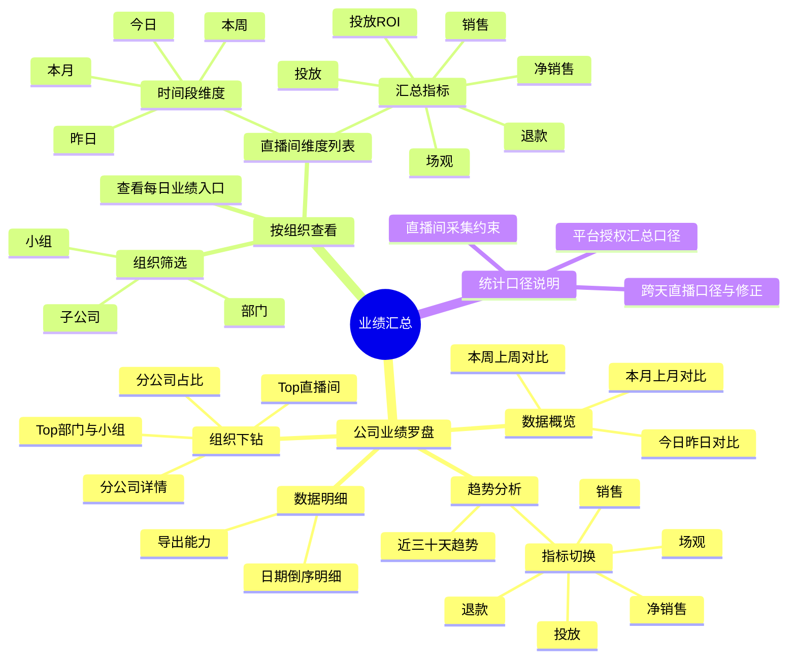

# 脑图｜业绩汇总（整体→大块→小块）

```mermaid
mindmap
  root((业绩汇总))
    公司业绩罗盘
      数据概览
        今日昨日对比
        本周上周对比
        本月上月对比
      趋势分析
        近三十天趋势
        指标切换
          场观
          销售
          退款
          净销售
          投放
      数据明细
        日期倒序明细
        导出能力
      组织下钻
        分公司占比
        分公司详情
        Top部门与小组
        Top直播间
    按组织查看
      组织筛选
        子公司
        部门
        小组
      直播间维度列表
        时间段维度
          今日
          昨日
          本周
          本月
        汇总指标
          场观
          销售
          退款
          净销售
          投放
          投放ROI
      查看每日业绩入口
    统计口径说明
      平台授权汇总口径
      直播间采集约束
      跨天直播口径与修正
```
