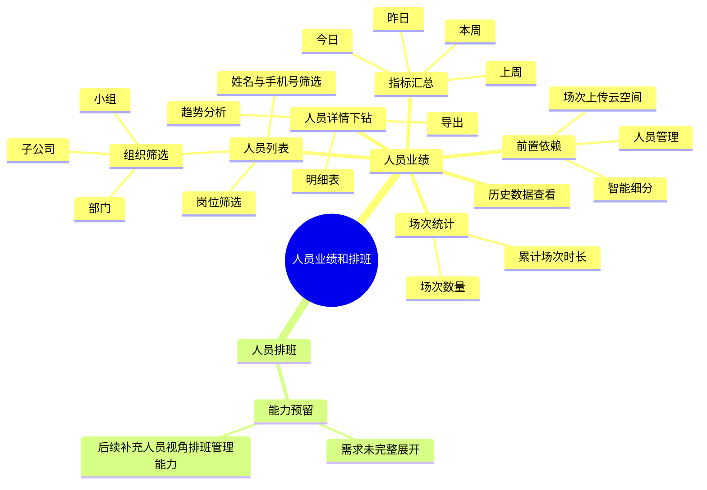

# 脑图｜人员业绩和排班（整体→大块→小块）

```mermaid
mindmap
  root((人员业绩和排班))
    人员业绩
      前置依赖
        人员管理
        智能细分
        场次上传云空间
      人员列表
        组织筛选
          子公司
          部门
          小组
        岗位筛选
        姓名与手机号筛选
      指标汇总
        今日
        昨日
        本周
        上周
      场次统计
        场次数量
        累计场次时长
      历史数据查看
      人员详情下钻
        趋势分析
        明细表
        导出
    人员排班
      能力预留
        需求未完整展开
        后续补充人员视角排班管理能力
```
