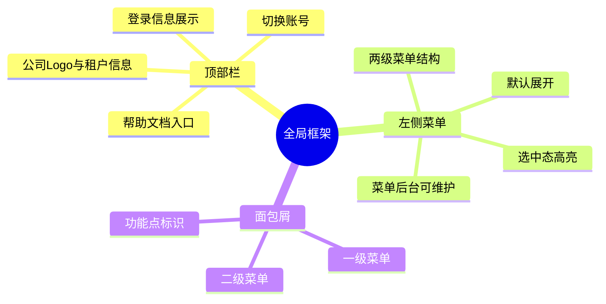

# 脑图｜全局框架（整体→大块→小块）

```mermaid
mindmap
  root((全局框架))
    顶部栏
      公司Logo与租户信息
      登录信息展示
      切换账号
      帮助文档入口
    左侧菜单
      两级菜单结构
      默认展开
      选中态高亮
      菜单后台可维护
    面包屑
      一级菜单
      二级菜单
      功能点标识
```
