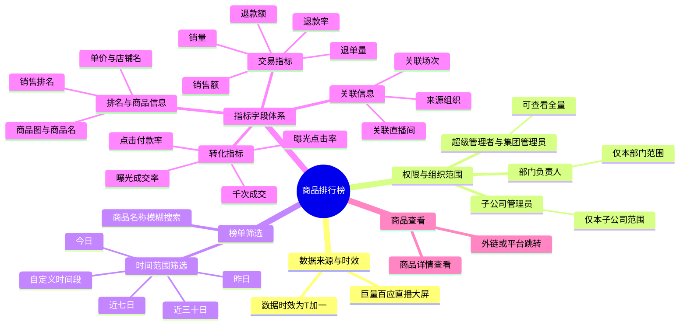

# 脑图｜商品排行榜（整体→大块→小块）

```mermaid
mindmap
  root((商品排行榜))
    数据来源与时效
      巨量百应直播大屏
      数据时效为T加一
    权限与组织范围
      超级管理者与集团管理员
        可查看全量
      子公司管理员
        仅本子公司范围
      部门负责人
        仅本部门范围
    榜单筛选
      商品名称模糊搜索
      时间范围筛选
        今日
        昨日
        近七日
        近三十日
        自定义时间段
    指标字段体系
      排名与商品信息
        销售排名
        商品图与商品名
        单价与店铺名
      交易指标
        销量
        退单量
        销售额
        退款额
        退款率
      转化指标
        曝光点击率
        点击付款率
        曝光成交率
        千次成交
      关联信息
        来源组织
        关联直播间
        关联场次
    商品查看
      商品详情查看
      外链或平台跳转
```
