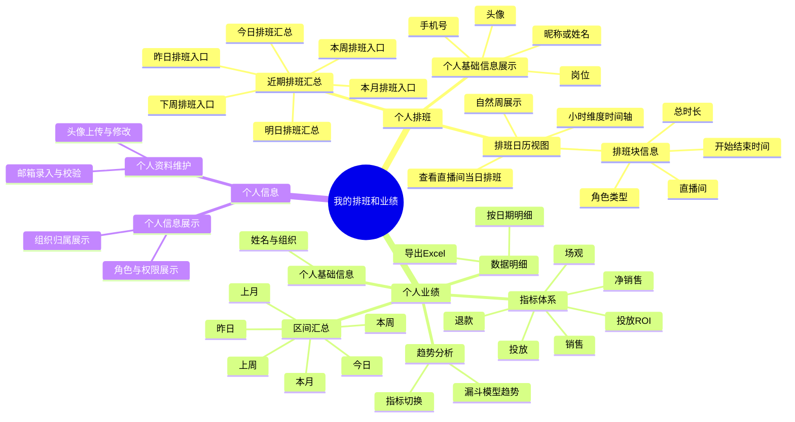

# 脑图｜我的排班和业绩（整体→大块→小块）

```mermaid
mindmap
  root((我的排班和业绩))
    个人排班
      个人基础信息展示
        头像
        昵称或姓名
        岗位
        手机号
      近期排班汇总
        今日排班汇总
        明日排班汇总
        昨日排班入口
        本周排班入口
        下周排班入口
        本月排班入口
      排班日历视图
        自然周展示
        小时维度时间轴
        排班块信息
          直播间
          角色类型
          开始结束时间
          总时长
        查看直播间当日排班
    个人业绩
      个人基础信息
        姓名与组织
      区间汇总
        今日
        昨日
        本周
        上周
        本月
        上月
      指标体系
        场观
        销售
        退款
        净销售
        投放
        投放ROI
      趋势分析
        漏斗模型趋势
        指标切换
      数据明细
        按日期明细
        导出Excel
    个人信息
      个人资料维护
        头像上传与修改
        邮箱录入与校验
      个人信息展示
        组织归属展示
        角色与权限展示
```
