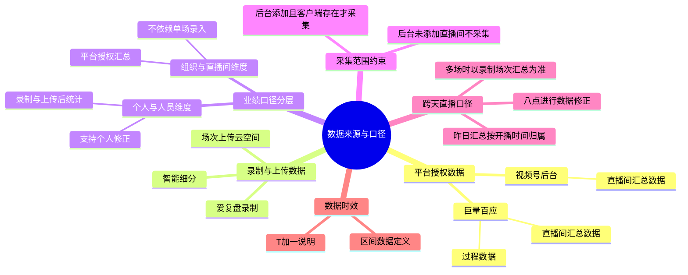

# 脑图｜数据来源与口径（整体→大块→小块）

```mermaid
mindmap
  root((数据来源与口径))
    平台授权数据
      巨量百应
        直播间汇总数据
        过程数据
      视频号后台
        直播间汇总数据
    录制与上传数据
      爱复盘录制
      场次上传云空间
      智能细分
    业绩口径分层
      组织与直播间维度
        平台授权汇总
        不依赖单场录入
      个人与人员维度
        录制与上传后统计
        支持个人修正
    采集范围约束
      后台未添加直播间不采集
      后台添加且客户端存在才采集
    跨天直播口径
      昨日汇总按开播时间归属
      多场时以录制场次汇总为准
      八点进行数据修正
    数据时效
      T加一说明
      区间数据定义
```
