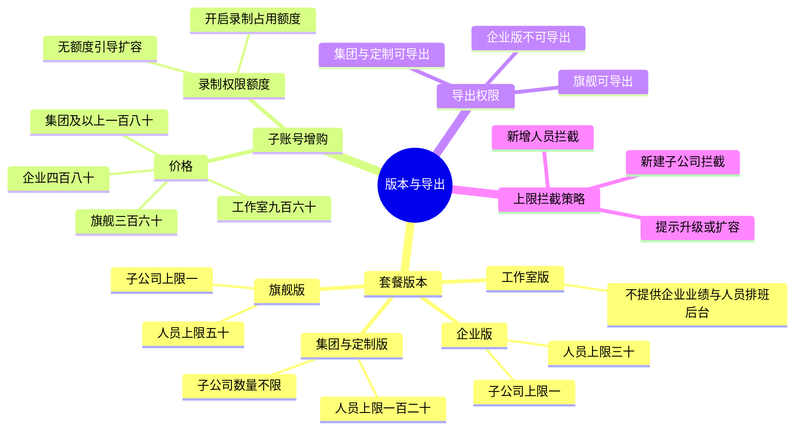

# 脑图｜版本与导出（整体→大块→小块）

```mermaid
mindmap
  root((版本与导出))
    套餐版本
      工作室版
        不提供企业业绩与人员排班后台
      企业版
        人员上限三十
        子公司上限一
      旗舰版
        人员上限五十
        子公司上限一
      集团与定制版
        人员上限一百二十
        子公司数量不限
    子账号增购
      价格
        工作室九百六十
        企业四百八十
        旗舰三百六十
        集团及以上一百八十
      录制权限额度
        开启录制占用额度
        无额度引导扩容
    导出权限
      企业版不可导出
      旗舰可导出
      集团与定制可导出
    上限拦截策略
      新增人员拦截
      新建子公司拦截
      提示升级或扩容
```
