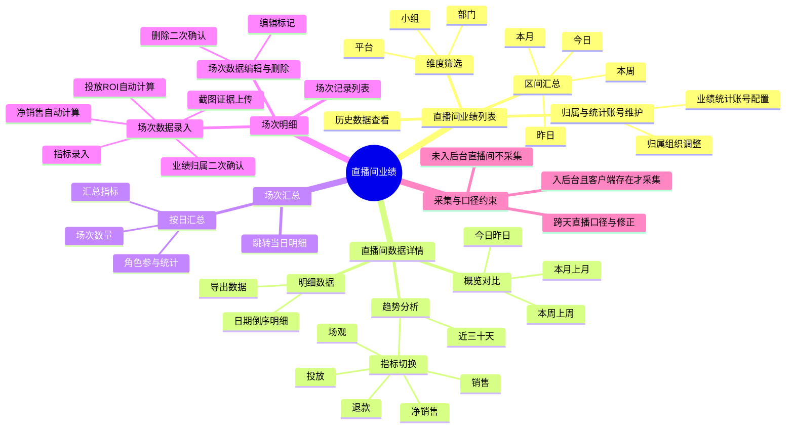

# 脑图｜直播间业绩（整体→大块→小块）

```mermaid
mindmap
  root((直播间业绩))
    直播间业绩列表
      维度筛选
        平台
        部门
        小组
      区间汇总
        今日
        昨日
        本周
        本月
      归属与统计账号维护
        归属组织调整
        业绩统计账号配置
      历史数据查看
    直播间数据详情
      概览对比
        今日昨日
        本周上周
        本月上月
      趋势分析
        近三十天
        指标切换
          场观
          销售
          退款
          投放
          净销售
      明细数据
        日期倒序明细
        导出数据
    场次汇总
      按日汇总
        场次数量
        角色参与统计
        汇总指标
      跳转当日明细
    场次明细
      场次记录列表
      场次数据录入
        截图证据上传
        指标录入
        净销售自动计算
        投放ROI自动计算
        业绩归属二次确认
      场次数据编辑与删除
        编辑标记
        删除二次确认
    采集与口径约束
      未入后台直播间不采集
      入后台且客户端存在才采集
      跨天直播口径与修正
```
