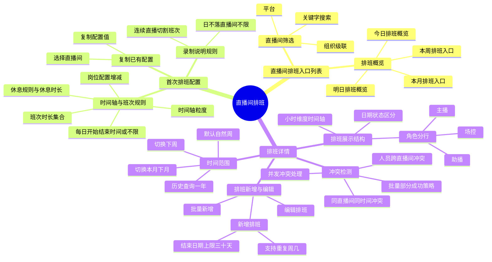

# 脑图｜直播间排班（整体→大块→小块）

```mermaid
mindmap
  root((直播间排班))
    直播间排班入口列表
      直播间筛选
        平台
        组织级联
        关键字搜索
      排班概览
        今日排班概览
        明日排班概览
        本周排班入口
        本月排班入口
    首次排班配置
      复制已有配置
        选择直播间
        复制配置值
      时间轴与班次规则
        每日开始结束时间或不限
        班次时长集合
        时间轴粒度
        休息规则与休息时长
        岗位配置增减
      录制说明规则
        日不落直播间不限
        连续直播切割班次
    排班详情
      时间范围
        默认自然周
        切换下周
        切换本月下月
        历史查询一年
      排班展示结构
        小时维度时间轴
        日期状态区分
        角色分行
          主播
          助播
          场控
      排班新增与编辑
        新增排班
          支持重复周几
          结束日期上限三十天
        批量新增
        编辑排班
      冲突检测
        人员跨直播间冲突
        同直播间同时间冲突
        并发冲突处理
        批量部分成功策略
```
