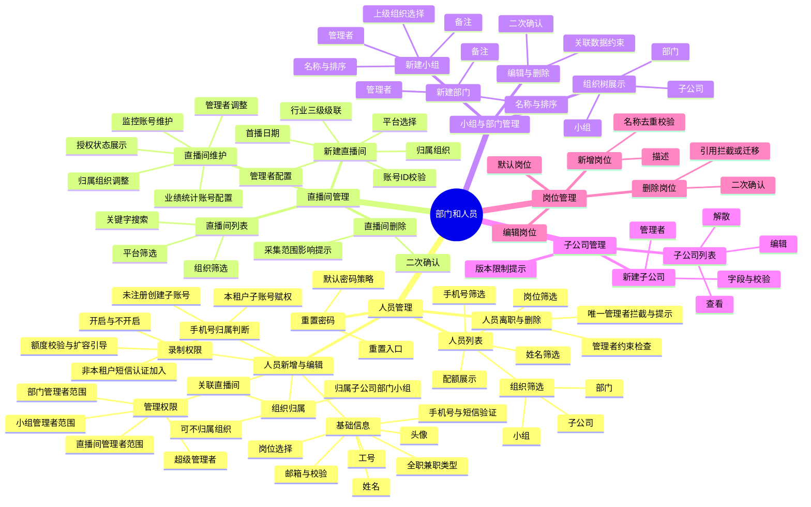

# 脑图｜部门和人员（整体→大块→小块）

```mermaid
mindmap
  root((部门和人员))
    人员管理
      人员列表
        组织筛选
          子公司
          部门
          小组
        岗位筛选
        姓名筛选
        手机号筛选
        配额展示
      人员新增与编辑
        基础信息
          姓名
          头像
          手机号与短信验证
          邮箱与校验
          工号
          全职兼职类型
          岗位选择
        组织归属
          可不归属组织
          归属子公司部门小组
          关联直播间
        管理权限
          超级管理者
          部门管理者范围
          小组管理者范围
          直播间管理者范围
        录制权限
          开启与不开启
          额度校验与扩容引导
        手机号归属判断
          未注册创建子账号
          本租户子账号赋权
          非本租户短信认证加入
      人员离职与删除
        管理者约束检查
        唯一管理者拦截与提示
      重置密码
        重置入口
        默认密码策略
    直播间管理
      直播间列表
        平台筛选
        组织筛选
        关键字搜索
      新建直播间
        平台选择
        账号ID校验
        行业三级级联
        首播日期
        归属组织
        管理者配置
      直播间维护
        归属组织调整
        管理者调整
        监控账号维护
        授权状态展示
        业绩统计账号配置
      直播间删除
        二次确认
        采集范围影响提示
    小组与部门管理
      组织树展示
        子公司
        部门
        小组
      新建部门
        名称与排序
        备注
        管理者
      新建小组
        上级组织选择
        名称与排序
        备注
        管理者
      编辑与删除
        二次确认
        关联数据约束
    子公司管理
      版本限制提示
      子公司列表
        查看
        编辑
        解散
      新建子公司
        字段与校验
        管理者
    岗位管理
      默认岗位
      新增岗位
        名称去重校验
        描述
      编辑岗位
      删除岗位
        二次确认
        引用拦截或迁移
```
