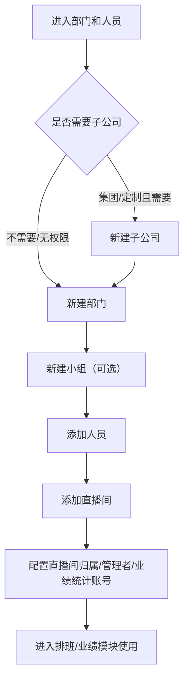
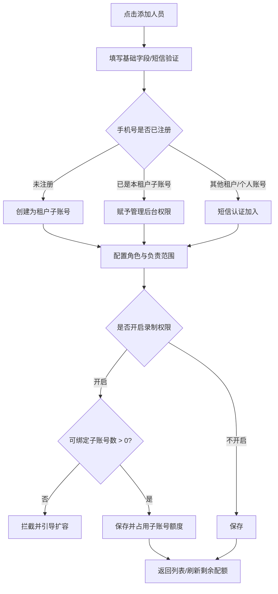
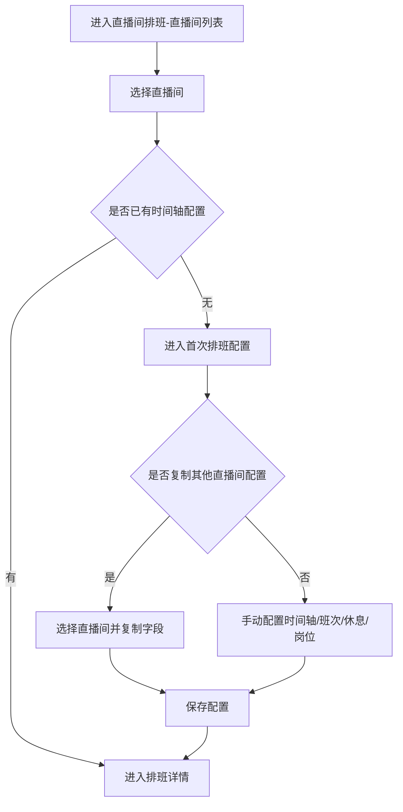
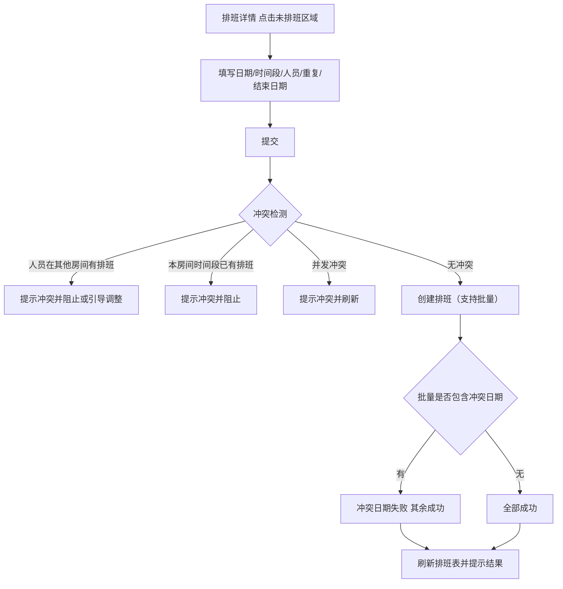
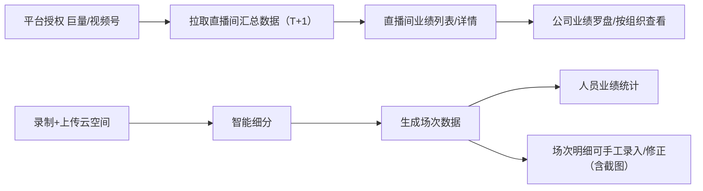
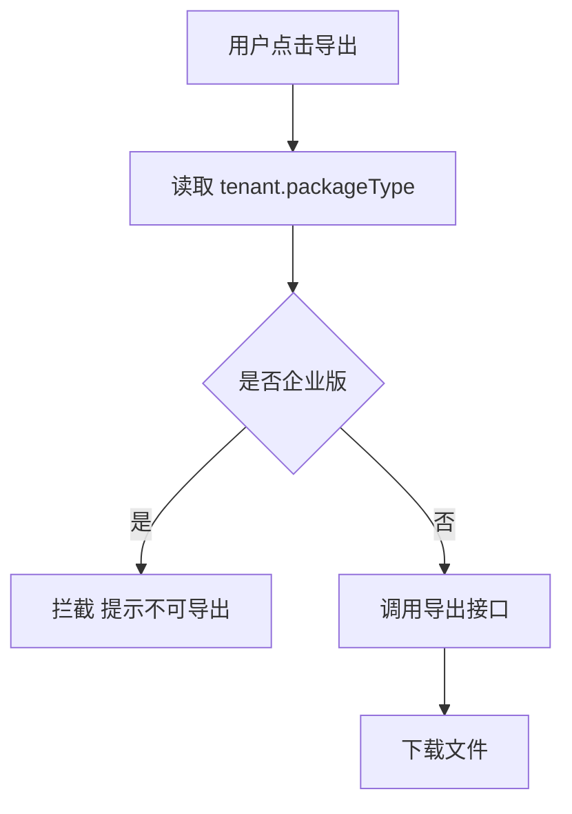

# 流程图｜关键业务流程（Mermaid）

## 1. 租户初始化流程

```mermaid
flowchart TD
  A[进入部门和人员] --> B{是否需要子公司}
  B -->|集团/定制且需要| C[新建子公司]
  B -->|不需要/无权限| D[新建部门]
  C --> D
  D --> E[新建小组（可选）]
  E --> F[添加人员]
  F --> G[添加直播间]
  G --> H[配置直播间归属/管理者/业绩统计账号]
  H --> I[进入排班/业绩模块使用]
```

## 2. 添加人员流程（含账号归属判断）

```mermaid
flowchart TD
  A[点击添加人员] --> B[填写基础字段/短信验证]
  B --> C{手机号是否已注册}
  C -->|未注册| D[创建为租户子账号]
  C -->|已是本租户子账号| E[赋予管理后台权限]
  C -->|其他租户/个人账号| F[短信认证加入]
  D --> G[配置角色与负责范围]
  E --> G
  F --> G
  G --> H{是否开启录制权限}
  H -->|开启| I{可绑定子账号数 > 0?}
  I -->|否| J[拦截并引导扩容]
  I -->|是| K[保存并占用子账号额度]
  H -->|不开启| L[保存]
  K --> M[返回列表/刷新剩余配额]
  L --> M
```

## 3. 直播间首次排班配置流程

```mermaid
flowchart TD
  A[进入直播间排班-直播间列表] --> B[选择直播间]
  B --> C{是否已有时间轴配置}
  C -->|无| D[进入首次排班配置]
  C -->|有| E[进入排班详情]
  D --> F{是否复制其他直播间配置}
  F -->|是| G[选择直播间并复制字段]
  F -->|否| H[手动配置时间轴/班次/休息/岗位]
  G --> I[保存配置]
  H --> I
  I --> E
```

## 4. 新增/批量新增排班流程（含冲突）

```mermaid
  flowchart TD
  A[排班详情 点击未排班区域] --> B[填写日期/时间段/人员/重复/结束日期]
  B --> C[提交]
  C --> D{冲突检测}
  D -->|人员在其他房间有排班| E[提示冲突并阻止或引导调整]
  D -->|本房间时间段已有排班| F[提示冲突并阻止]
  D -->|并发冲突| G[提示冲突并刷新]
  D -->|无冲突| H[创建排班（支持批量）]
  H --> I{批量是否包含冲突日期}
  I -->|有| J[冲突日期失败 其余成功]
  I -->|无| K[全部成功]
  J --> L[刷新排班表并提示结果]
  K --> L
```

## 5. 直播间业绩数据链路（汇总与录入）

```mermaid
flowchart LR
  A[平台授权 巨量/视频号] --> B[拉取直播间汇总数据（T+1）]
  C[录制+上传云空间] --> D[智能细分]
  D --> E[生成场次数据]
  E --> F[人员业绩统计]
  E --> G[场次明细可手工录入/修正（含截图）]
  B --> H[直播间业绩列表/详情]
  H --> I[公司业绩罗盘/按组织查看]
```

## 6. 导出权限判断流程

```mermaid
flowchart TD
  A[用户点击导出] --> B[读取 tenant.packageType]
  B --> C{是否企业版}
  C -->|是| D[拦截 提示不可导出]
  C -->|否| E[调用导出接口]
  E --> F[下载文件]
```
