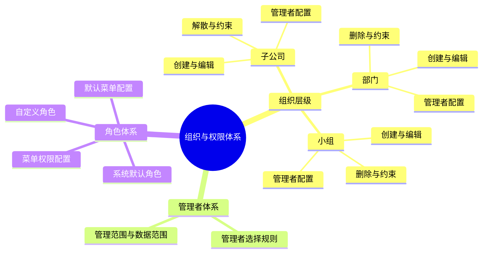

# 需求层小功能脑图｜组织与权限体系

```mermaid
mindmap
  root((组织与权限体系))
    组织层级
      子公司
        创建与编辑
        解散与约束
        管理者配置
      部门
        创建与编辑
        删除与约束
        管理者配置
      小组
        创建与编辑
        删除与约束
        管理者配置
    管理者体系
      管理者选择规则
      管理范围与数据范围
    角色体系
      系统默认角色
      自定义角色
      菜单权限配置
      默认菜单配置
```
