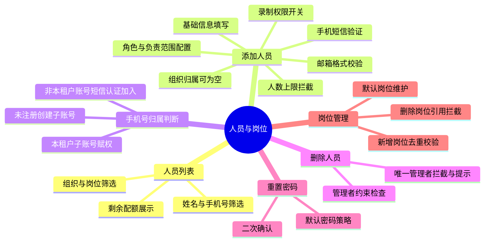

# 需求层小功能脑图｜人员与岗位

```mermaid
mindmap
  root((人员与岗位))
    人员列表
      组织与岗位筛选
      姓名与手机号筛选
      剩余配额展示
    添加人员
      基础信息填写
      手机短信验证
      邮箱格式校验
      组织归属可为空
      角色与负责范围配置
      录制权限开关
      人数上限拦截
    手机号归属判断
      未注册创建子账号
      本租户子账号赋权
      非本租户账号短信认证加入
    删除人员
      管理者约束检查
      唯一管理者拦截与提示
    重置密码
      二次确认
      默认密码策略
    岗位管理
      默认岗位维护
      新增岗位去重校验
      删除岗位引用拦截
```
