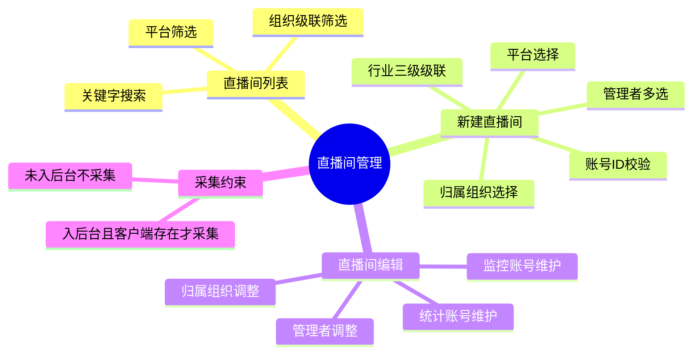

# 需求层小功能脑图｜直播间管理

```mermaid
mindmap
  root((直播间管理))
    直播间列表
      平台筛选
      组织级联筛选
      关键字搜索
    新建直播间
      平台选择
      账号ID校验
      行业三级级联
      归属组织选择
      管理者多选
    直播间编辑
      归属组织调整
      管理者调整
      监控账号维护
      统计账号维护
    采集约束
      未入后台不采集
      入后台且客户端存在才采集
```
