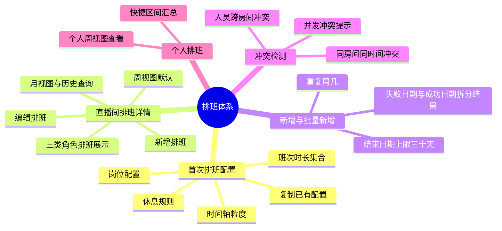

# 需求层小功能脑图｜排班体系

```mermaid
mindmap
  root((排班体系))
    首次排班配置
      时间轴粒度
      班次时长集合
      休息规则
      岗位配置
      复制已有配置
    直播间排班详情
      周视图默认
      月视图与历史查询
      三类角色排班展示
      新增排班
      编辑排班
    新增与批量新增
      重复周几
      结束日期上限三十天
      失败日期与成功日期拆分结果
    冲突检测
      人员跨房间冲突
      同房间同时间冲突
      并发冲突提示
    个人排班
      个人周视图查看
      快捷区间汇总
```
