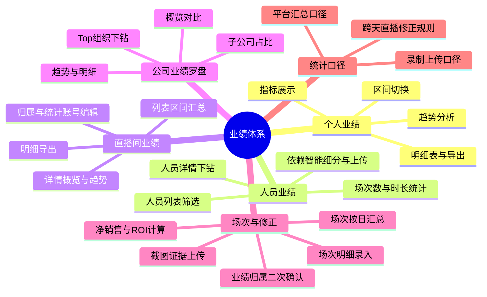

# 需求层小功能脑图｜业绩体系

```mermaid
mindmap
  root((业绩体系))
    个人业绩
      区间切换
      指标展示
      趋势分析
      明细表与导出
    人员业绩
      依赖智能细分与上传
      人员列表筛选
      场次数与时长统计
      人员详情下钻
    直播间业绩
      列表区间汇总
      归属与统计账号编辑
      详情概览与趋势
      明细导出
    公司业绩罗盘
      概览对比
      趋势与明细
      子公司占比
      Top组织下钻
    场次与修正
      场次按日汇总
      场次明细录入
      截图证据上传
      净销售与ROI计算
      业绩归属二次确认
    统计口径
      平台汇总口径
      录制上传口径
      跨天直播修正规则
```
