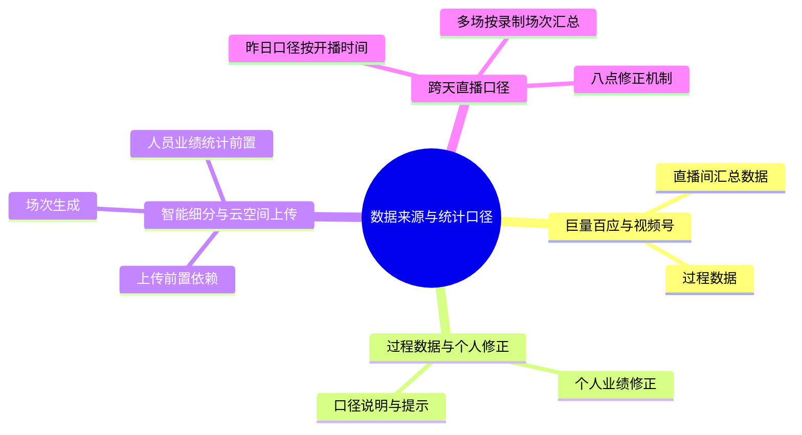

# 需求层小功能脑图｜数据来源与统计口径

```mermaid
mindmap
  root((数据来源与统计口径))
    巨量百应与视频号
      直播间汇总数据
      过程数据
    过程数据与个人修正
      个人业绩修正
      口径说明与提示
    智能细分与云空间上传
      上传前置依赖
      场次生成
      人员业绩统计前置
    跨天直播口径
      昨日口径按开播时间
      多场按录制场次汇总
      八点修正机制
```
