# 需求层脑图（总体 → 模块 → 小功能）

说明：

- 仅聚焦需求层功能模块与能力边界，不包含前端交互、按钮与控件细节。
- 三张脑图依次为：总体脑图 → 模块拆分 → 小功能拆分。

## 1) 总体脑图（只看项目有哪些功能模块）

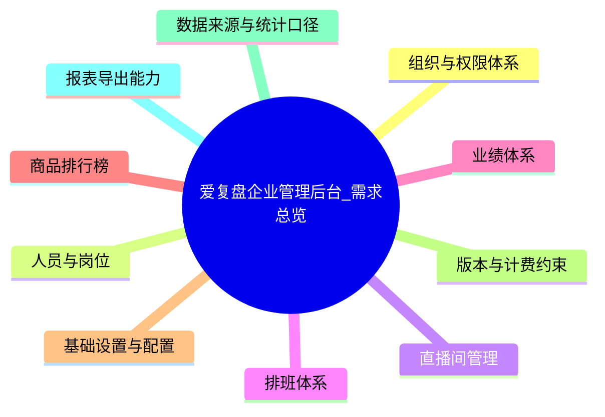

## 2) 模块拆分（模块下的子模块）

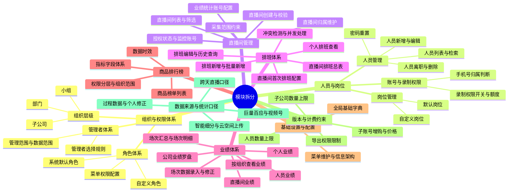

## 3) 小功能拆分（每个模块的关键能力点）

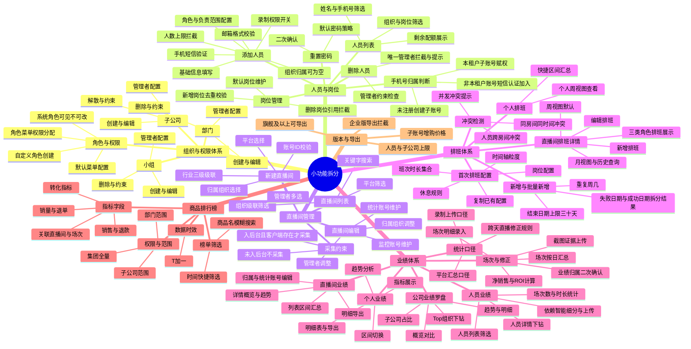

---

## 4) 小功能脑图拆分索引（按大功能块独立文件）

说明：

- 本节将“需求总览”中的每个大功能块，拆成独立文件的“小功能脑图”，用于从宏观到微观逐块阅读。
- 同时在本文件继续保留脑图数据（见第 5 节）。

拆分文件目录：

- `06-脑图-流程/03-需求层-小功能脑图`

文件索引：

- 组织与权限体系：[01-组织与权限体系.md](file:///c:/Users/JYJY/Desktop/用户管理端需求分析/测试版-爱复盘管理工具需求拆分/06-脑图-流程/03-需求层-小功能脑图/01-组织与权限体系.md)
- 人员与岗位：[02-人员与岗位.md](file:///c:/Users/JYJY/Desktop/用户管理端需求分析/测试版-爱复盘管理工具需求拆分/06-脑图-流程/03-需求层-小功能脑图/02-人员与岗位.md)
- 直播间管理：[03-直播间管理.md](file:///c:/Users/JYJY/Desktop/用户管理端需求分析/测试版-爱复盘管理工具需求拆分/06-脑图-流程/03-需求层-小功能脑图/03-直播间管理.md)
- 排班体系：[04-排班体系.md](file:///c:/Users/JYJY/Desktop/用户管理端需求分析/测试版-爱复盘管理工具需求拆分/06-脑图-流程/03-需求层-小功能脑图/04-排班体系.md)
- 业绩体系：[05-业绩体系.md](file:///c:/Users/JYJY/Desktop/用户管理端需求分析/测试版-爱复盘管理工具需求拆分/06-脑图-流程/03-需求层-小功能脑图/05-业绩体系.md)
- 商品排行榜：[06-商品排行榜.md](file:///c:/Users/JYJY/Desktop/用户管理端需求分析/测试版-爱复盘管理工具需求拆分/06-脑图-流程/03-需求层-小功能脑图/06-商品排行榜.md)
- 基础设置与配置：[07-基础设置与配置.md](file:///c:/Users/JYJY/Desktop/用户管理端需求分析/测试版-爱复盘管理工具需求拆分/06-脑图-流程/03-需求层-小功能脑图/07-基础设置与配置.md)
- 版本与计费约束：[08-版本与计费约束.md](file:///c:/Users/JYJY/Desktop/用户管理端需求分析/测试版-爱复盘管理工具需求拆分/06-脑图-流程/03-需求层-小功能脑图/08-版本与计费约束.md)
- 数据来源与统计口径：[09-数据来源与统计口径.md](file:///c:/Users/JYJY/Desktop/用户管理端需求分析/测试版-爱复盘管理工具需求拆分/06-脑图-流程/03-需求层-小功能脑图/09-数据来源与统计口径.md)
- 报表导出能力：[10-报表导出能力.md](file:///c:/Users/JYJY/Desktop/用户管理端需求分析/测试版-爱复盘管理工具需求拆分/06-脑图-流程/03-需求层-小功能脑图/10-报表导出能力.md)

---

## 5) 拆分后的小功能脑图数据（仍保留在本文件）

### 5.1 组织与权限体系

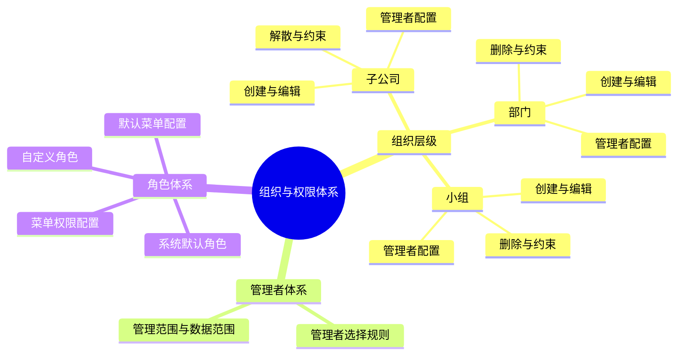

### 5.2 人员与岗位

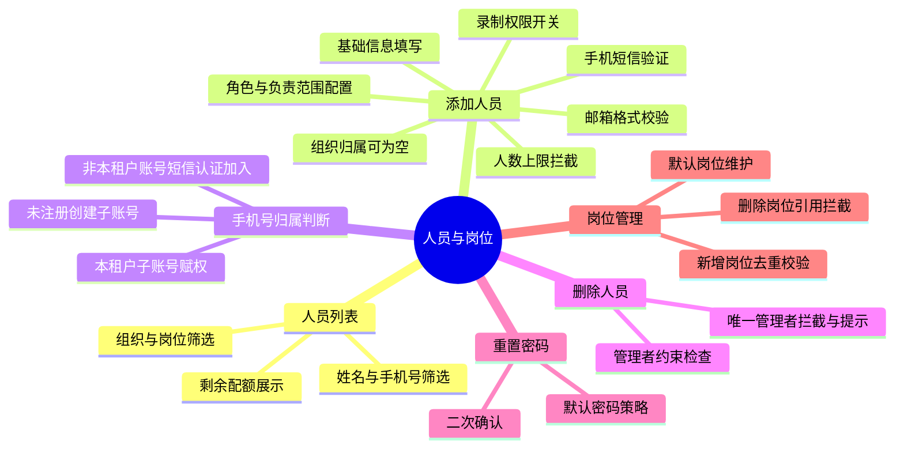

### 5.3 直播间管理

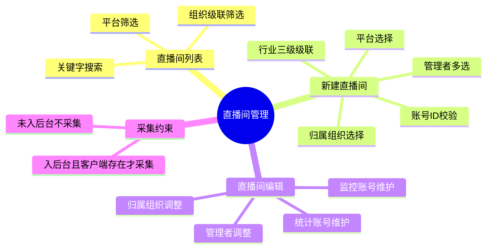

### 5.4 排班体系

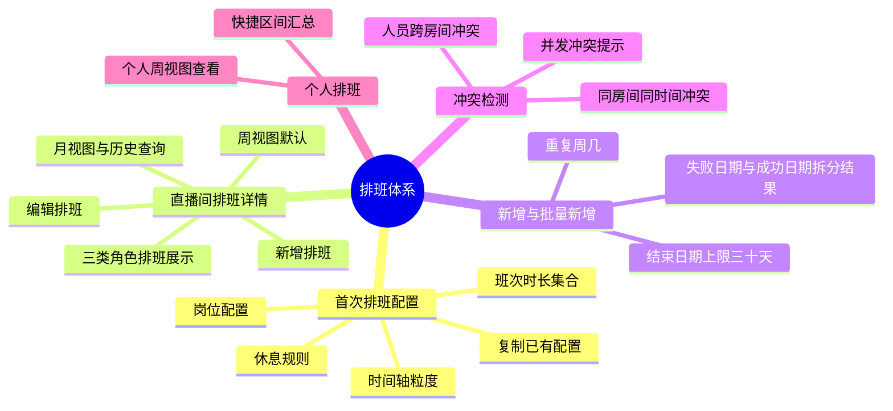

### 5.5 业绩体系

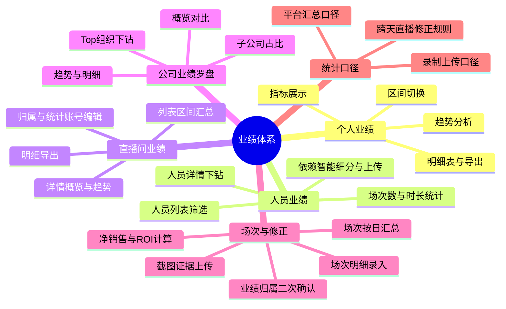

### 5.6 商品排行榜

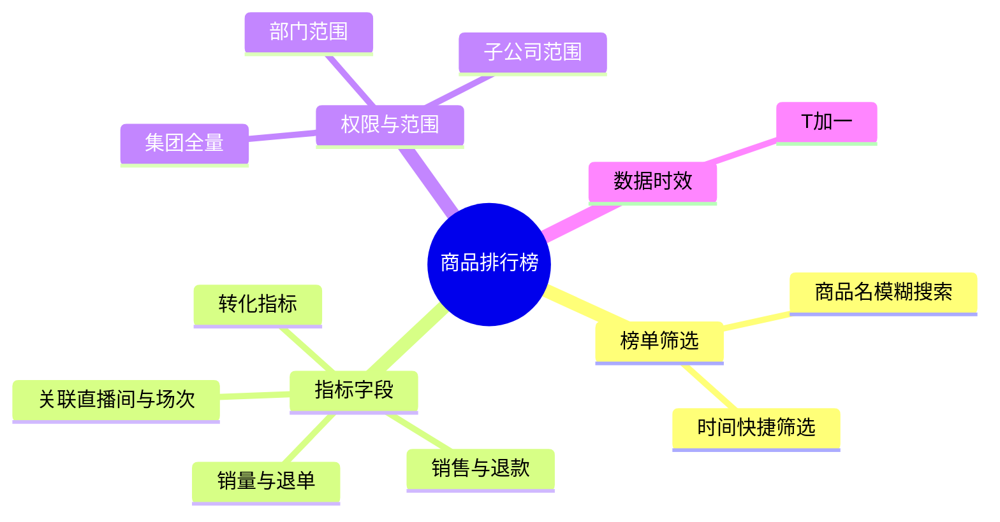

### 5.7 基础设置与配置

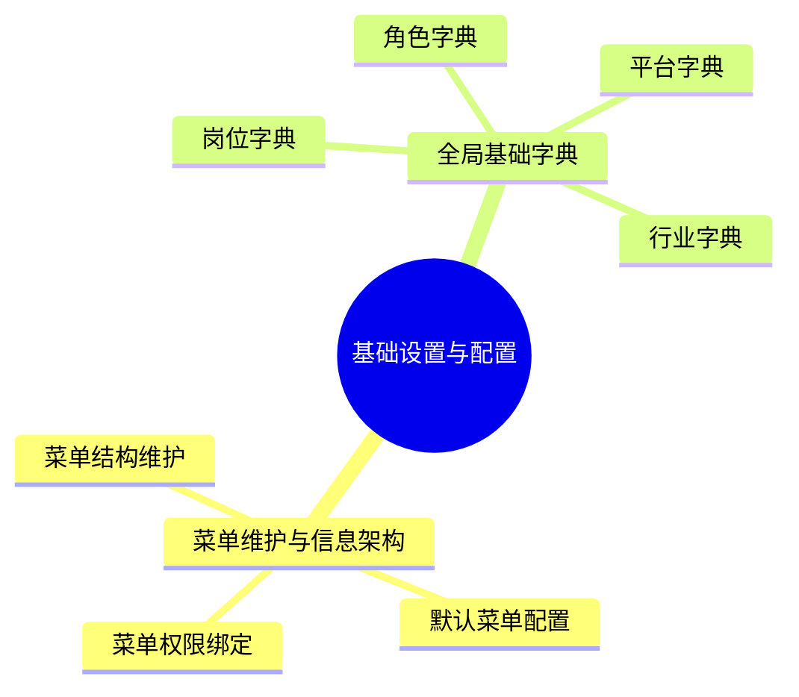

### 5.8 版本与计费约束

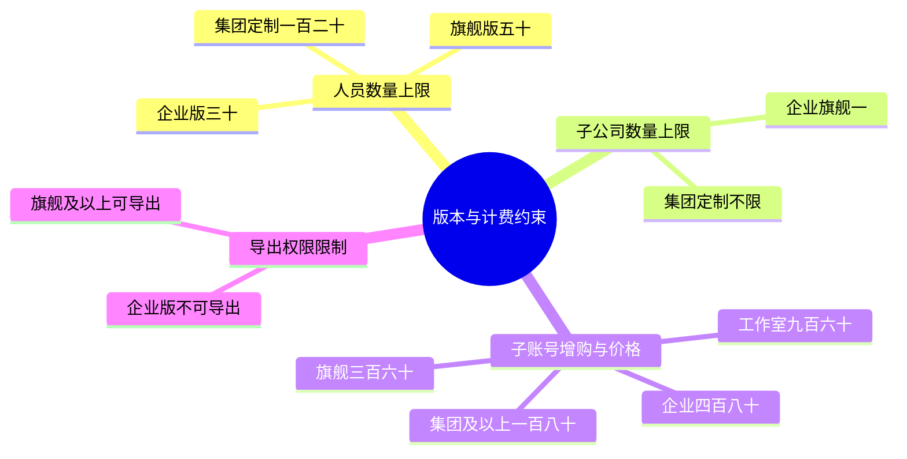

### 5.9 数据来源与统计口径

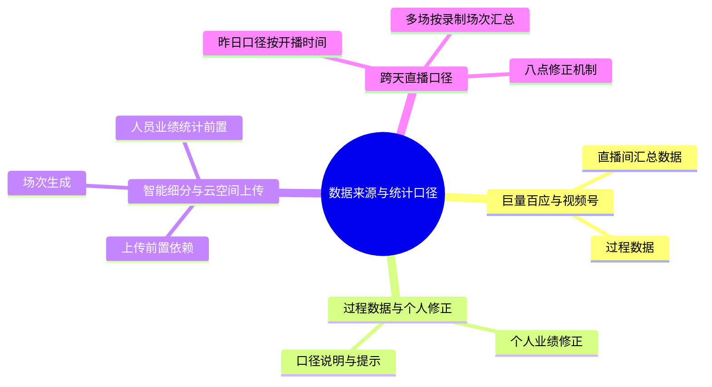

### 5.10 报表导出能力

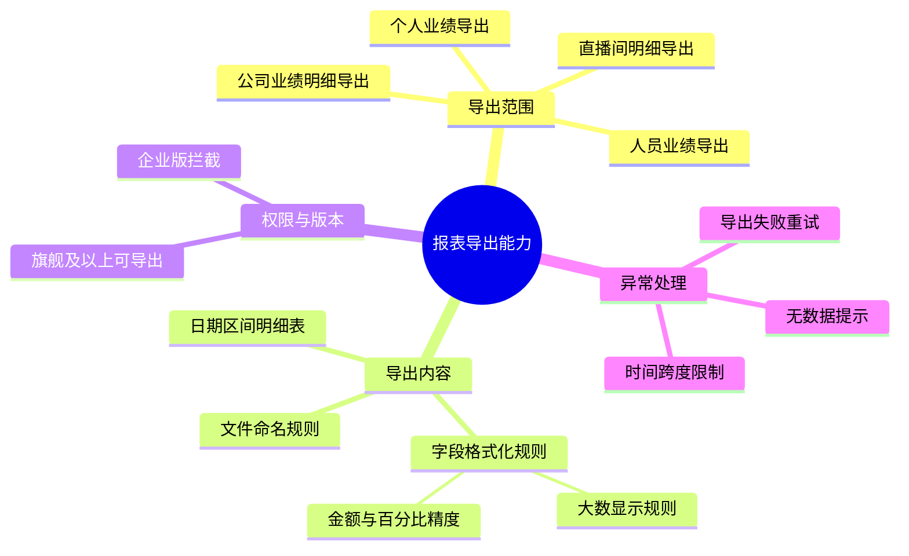
